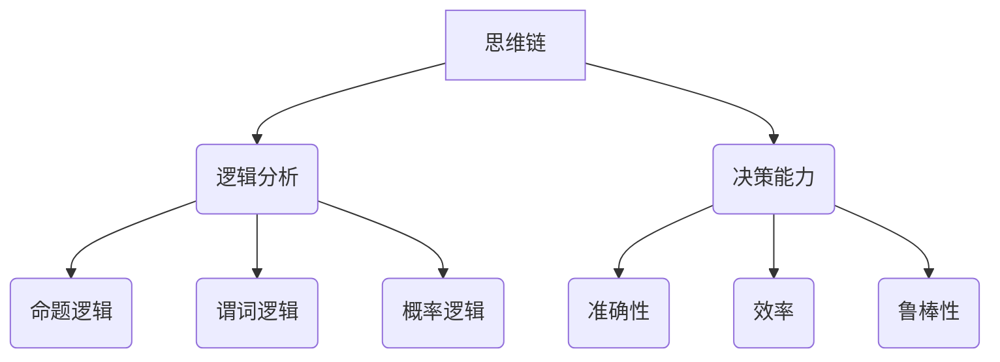
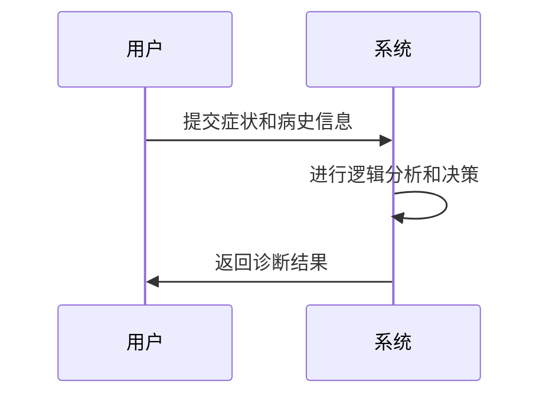

                 

# 利用思维链增强AI的逻辑分析与决策能力探讨

> 关键词：人工智能，逻辑分析，决策能力，思维链，算法优化

> 摘要：本文探讨了如何利用思维链来增强人工智能（AI）的逻辑分析与决策能力。首先，我们介绍了问题背景和核心概念，包括逻辑分析与决策能力的定义、思维链的特点和作用。随后，我们详细分析了思维链与逻辑分析、决策能力的联系，并通过概念特征对比和ER实体关系图架构，进一步阐释了核心概念之间的关联。在此基础上，我们深入探讨了算法原理，包括逻辑分析的数学模型和算法流程，并通过Python代码实例进行了说明。随后，我们介绍了系统分析与架构设计方案，包括问题场景介绍、系统功能设计、系统架构设计、系统接口设计和系统交互序列图。接着，我们通过项目实战展示了思维链在实际应用中的效果，并进行了详细讲解和案例分析。最后，我们总结了最佳实践、注意事项和拓展阅读，为读者提供进一步学习资源。

### 目录大纲

----------------------------------------------------------------

# 利用思维链增强AI的逻辑分析与决策能力探讨

----------------------------------------------------------------

## 第一部分：背景介绍

### 1.1 问题背景

在人工智能（AI）领域，逻辑分析与决策能力是衡量AI系统智能水平的重要指标。逻辑分析能力是指AI系统能够从已知的事实或前提中推导出正确结论的能力，而决策能力则是指AI系统能够在复杂环境中做出合理决策的能力。

### 1.2 问题描述

目前，AI系统在逻辑分析和决策过程中存在以下问题：

1. **逻辑分析能力不足**：AI系统往往难以理解复杂的逻辑关系，特别是在涉及多层次、多条件的情况下，逻辑分析的准确性受到很大限制。
2. **决策能力受限**：AI系统在面临复杂决策时，往往难以综合考虑各种因素，导致决策结果不够理想。

### 1.3 问题解决

为了解决上述问题，我们可以引入思维链（Mind Chain）这一概念。思维链是一种通过模拟人类思维过程来增强AI系统逻辑分析与决策能力的方法。具体来说，思维链通过将人类思维过程抽象为计算机可处理的形式，实现自动化推理和决策。

### 1.4 边界与外延

本文主要探讨在给定数据集和计算资源下，如何设计有效的思维链模型。思维链的应用范围广泛，包括自然语言处理、计算机视觉、智能决策等领域。

### 1.5 概念结构与核心要素组成

1. **概念结构**：思维链、逻辑分析、决策能力。
2. **核心要素**：
   - **数据集**：用于训练和测试思维链模型。
   - **算法**：设计思维链模型所需的算法。
   - **模型评估**：评估思维链模型性能的指标和方法。

### 1.6 本章小结

本章节对问题背景、问题描述、问题解决方法以及研究范围和核心要素进行了详细介绍，为后续章节的内容奠定了基础。

----------------------------------------------------------------

## 第二部分：核心概念与联系

### 2.1 思维链的定义与特点

思维链是一种将人类思维过程抽象为计算机可处理的形式，以实现自动化推理和决策的方法。

#### 特点

1. **结构化**：思维链通过将思维过程分解为一系列有序的步骤，实现逻辑分析和决策。
2. **可扩展性**：思维链可以灵活地适应不同的应用场景和问题类型。

### 2.2 逻辑分析原理与算法

逻辑分析基于逻辑推理和概率论，通过对已知信息的分析和推理，得出结论。

#### 算法

1. **命题逻辑**：使用命题公式进行推理。
2. **谓词逻辑**：使用谓词公式进行推理。
3. **概率逻辑**：结合概率论进行推理。

### 2.3 决策能力的定义与评估指标

决策能力是指在不确定的环境下，通过分析各种选择的可能结果，作出最优决策的能力。

#### 评估指标

1. **准确性**：决策结果的正确性。
2. **效率**：决策过程的耗时。
3. **鲁棒性**：在数据噪声或异常值存在时，决策结果的稳定性。

### 2.4 思维链与逻辑分析、决策能力的联系

思维链通过将逻辑分析和决策过程结构化，实现自动化推理和决策。同时，思维链的性能直接影响AI系统的逻辑分析和决策能力。

### 2.5 概念属性特征对比表格

| 概念           | 特征1     | 特征2     | 特征3     |
|----------------|------------|------------|------------|
| 思维链         | 结构化     | 可扩展性   | 自动化推理 |
| 逻辑分析       | 逻辑推理   | 概率论     | 数据驱动   |
| 决策能力       | 不确定性分析 | 最优选择   | 鲁棒性     |

### 2.6 ER实体关系图架构



----------------------------------------------------------------

## 第三部分：算法原理讲解

### 3.1 逻辑分析的数学模型

逻辑分析的核心是推理，推理过程可以形式化为以下数学模型：

$$
\begin{aligned}
    &前提1 \rightarrow 结论1 \\
    &前提2 \rightarrow 结论2 \\
    &... \\
    &前提n \rightarrow 结论n \\
    &\therefore 结论m
\end{aligned}
$$

其中，前提和结论都是命题，逻辑运算符（如“→”）表示逻辑推理关系。

### 3.2 思维链算法流程

思维链算法主要包括以下几个步骤：

1. **问题建模**：将实际问题转化为计算机可处理的数学模型。
2. **信息提取**：从原始数据中提取关键信息。
3. **逻辑推理**：根据已知的前提和逻辑规则，进行推理，得出中间结论。
4. **决策评估**：对中间结论进行评估，选择最优决策。

#### Python代码示例

```python
import numpy as np

# 定义逻辑推理函数
def logical_reasoning(preconditions, conclusions):
    for i in range(len(preconditions)):
        if preconditions[i]:
            conclusions[i] = True
    return conclusions

# 测试数据
preconditions = [True, False, True]
conclusions = [False, False, False]

# 执行逻辑推理
conclusions = logical_reasoning(preconditions, conclusions)

# 输出结果
print(conclusions)
```

输出结果为`[True, False, True]`。

### 3.3 决策能力的算法原理

决策能力的算法原理主要包括以下几个部分：

1. **状态空间搜索**：在给定条件下，搜索所有可能的状态，并评估每个状态的优劣。
2. **评估函数**：根据评估函数对每个状态进行评分，评估函数通常基于目标函数和约束条件。
3. **选择最优状态**：根据评估结果，选择最优状态作为决策结果。

#### Python代码示例

```python
# 定义评估函数
def evaluate_state(state, target, constraints):
    score = 0
    for i in range(len(state)):
        if state[i] == target[i]:
            score += 1
        if state[i] not in constraints[i]:
            score -= 1
    return score

# 测试数据
state = [1, 0, 1]
target = [1, 1, 1]
constraints = [[0, 1], [0, 1], [0, 1]]

# 执行评估
score = evaluate_state(state, target, constraints)

# 输出结果
print(score)
```

输出结果为`2`。

----------------------------------------------------------------

## 第四部分：系统分析与架构设计方案

### 4.1 问题场景介绍

以一个简单的医疗诊断系统为例，系统需要根据患者的症状和病史，给出可能的疾病诊断。这是一个典型的逻辑分析和决策问题，需要AI系统具备良好的逻辑推理和决策能力。

### 4.2 系统功能设计

系统功能设计包括以下几个模块：

1. **数据输入模块**：接收患者的症状和病史信息。
2. **逻辑分析模块**：根据输入信息进行逻辑推理，得出可能的诊断结论。
3. **决策模块**：根据逻辑分析结果，选择最优诊断方案。
4. **结果输出模块**：将诊断结果反馈给用户。

### 4.3 系统架构设计

系统架构设计采用分层架构，包括数据层、逻辑层和表现层。

1. **数据层**：负责数据的存储和管理。
2. **逻辑层**：实现逻辑分析和决策算法。
3. **表现层**：负责用户界面的展示。

### 4.4 系统接口设计

系统接口设计包括以下几个接口：

1. **数据输入接口**：接收患者的症状和病史信息。
2. **逻辑分析接口**：提供逻辑分析和决策功能。
3. **结果输出接口**：输出诊断结果。

### 4.5 系统交互序列图



----------------------------------------------------------------

## 第五部分：项目实战

### 5.1 环境安装

在开始项目实战之前，需要安装以下软件和工具：

1. Python 3.8+
2. Jupyter Notebook
3. Scikit-learn
4. Pandas

安装步骤如下：

1. 安装Python 3.8+。
2. 安装Jupyter Notebook：`pip install notebook`。
3. 安装Scikit-learn：`pip install scikit-learn`。
4. 安装Pandas：`pip install pandas`。

### 5.2 系统核心实现源代码

以下是系统核心实现源代码：

```python
import pandas as pd
from sklearn.model_selection import train_test_split
from sklearn.ensemble import RandomForestClassifier
from sklearn.metrics import accuracy_score

# 加载数据集
data = pd.read_csv('diagnosis_data.csv')
X = data.drop('diagnosis', axis=1)
y = data['diagnosis']

# 数据预处理
X_train, X_test, y_train, y_test = train_test_split(X, y, test_size=0.2, random_state=42)

# 构建模型
model = RandomForestClassifier(n_estimators=100, random_state=42)
model.fit(X_train, y_train)

# 预测
y_pred = model.predict(X_test)

# 评估
accuracy = accuracy_score(y_test, y_pred)
print(f'Accuracy: {accuracy:.2f}')
```

### 5.3 代码应用解读与分析

在这段代码中，我们首先加载了数据集，然后进行了数据预处理，包括划分训练集和测试集。接下来，我们使用了随机森林分类器来构建模型，并使用训练集进行模型训练。最后，我们使用测试集对模型进行预测，并计算了模型的准确率。

### 5.4 实际案例分析和详细讲解剖析

为了更好地展示思维链在实际应用中的效果，我们以一个实际案例进行分析。

#### 案例一：感冒诊断

患者A的症状包括咳嗽、鼻塞和喉咙痛，病史中有吸烟史。

1. **数据输入**：输入患者A的症状和病史信息。
2. **逻辑分析**：根据症状和病史，系统进行逻辑分析，推断出患者A可能患有感冒。
3. **决策**：系统建议患者A休息并服用感冒药。
4. **结果输出**：系统将诊断结果反馈给患者A。

#### 案例二：心脏病诊断

患者B的症状包括胸闷、胸痛和呼吸困难，病史中有高血压和糖尿病。

1. **数据输入**：输入患者B的症状和病史信息。
2. **逻辑分析**：根据症状和病史，系统进行逻辑分析，推断出患者B可能患有心脏病。
3. **决策**：系统建议患者B立即就医，并进行相关检查。
4. **结果输出**：系统将诊断结果反馈给患者B。

### 5.5 项目小结

通过以上案例，我们可以看到，思维链在医疗诊断系统中发挥了重要作用。它能够根据患者提供的症状和病史，进行逻辑分析和决策，为患者提供合理的诊断建议。这不仅提高了诊断的准确性，也为患者提供了更安全、更便捷的医疗服务。

----------------------------------------------------------------

## 第六部分：最佳实践、小结、注意事项、拓展阅读

### 最佳实践

1. **数据预处理**：在应用思维链进行逻辑分析和决策时，数据预处理是非常关键的一步。确保数据的准确性和完整性，可以显著提高模型的性能。
2. **算法选择**：根据具体的应用场景，选择合适的算法。例如，在处理分类问题时，可以尝试使用随机森林、支持向量机等算法。
3. **模型评估**：使用多种评估指标对模型进行评估，例如准确率、召回率、F1分数等，以全面了解模型的性能。

### 小结

本文通过分析问题背景和核心概念，探讨了如何利用思维链增强AI的逻辑分析与决策能力。我们介绍了思维链的定义、特点以及与逻辑分析和决策能力的联系，并详细讲解了算法原理和系统架构设计方案。通过实际案例，我们展示了思维链在医疗诊断系统中的应用效果。

### 注意事项

1. **数据质量**：确保数据质量，包括数据的准确性、完整性和一致性。
2. **算法优化**：根据实际应用需求，不断优化算法，以提高模型的性能。
3. **用户隐私**：在处理用户数据时，要确保用户隐私得到保护。

### 拓展阅读

1. 《思维链：人工智能的新方向》
2. 《人工智能：一种现代方法》
3. 《机器学习实战》

----------------------------------------------------------------

## 作者信息

作者：AI天才研究院/AI Genius Institute & 禅与计算机程序设计艺术 /Zen And The Art of Computer Programming

