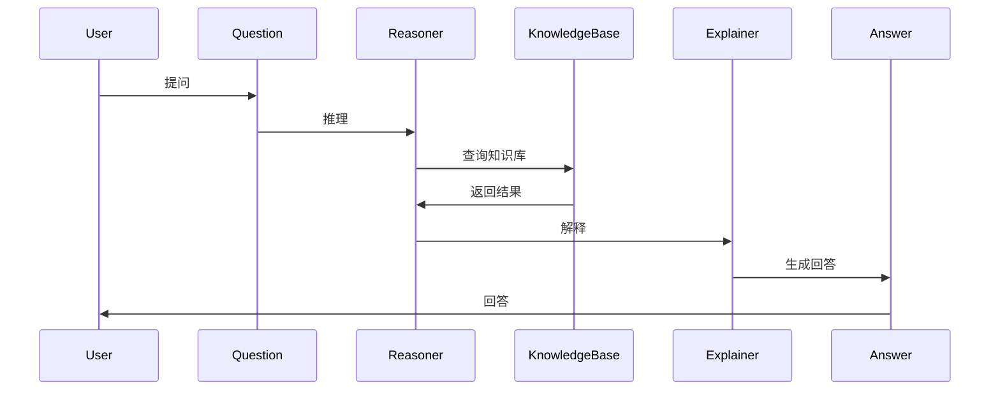
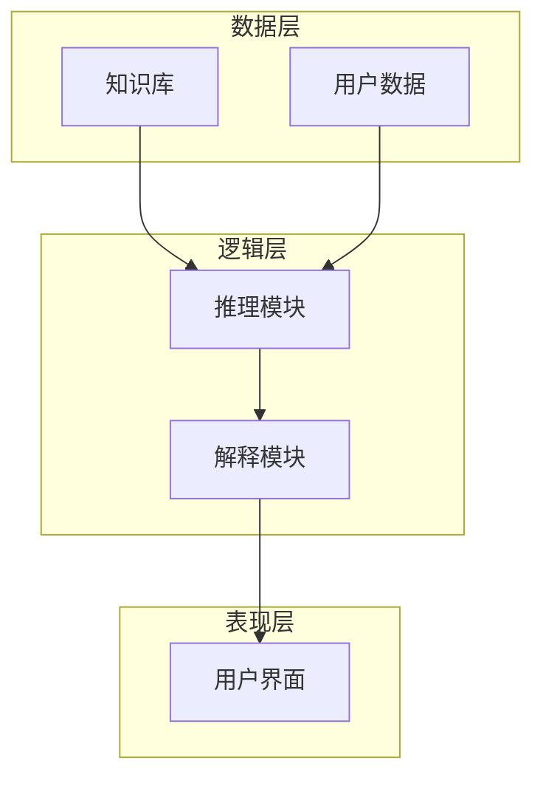
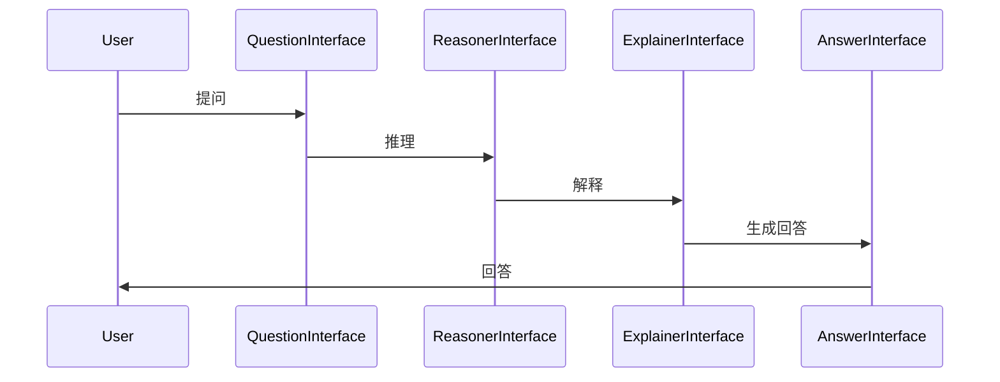

                 

## 利用思维链提升AI的推理和解释能力

> 关键词：AI推理，解释能力，思维链，深度学习，算法优化

> 摘要：本文旨在探讨如何利用思维链提升人工智能的推理和解释能力。首先，我们分析了AI在推理和解释方面所面临的挑战，随后引入了思维链的概念，并详细阐述了其在AI推理和解释中的应用。通过构建思维链，我们不仅提高了AI推理的准确性，还增强了AI解释的透明度。此外，本文还探讨了思维链与其他AI技术的融合，以及如何在实际项目中应用思维链来优化AI的性能。

## 目录大纲

1. **背景介绍与核心概念**
   1.1. **问题背景与核心概念**
   1.2. **核心概念与联系**
   1.3. **ER实体关系图架构**

2. **思维链在AI推理中的应用**
   2.1. **思维链的构建方法**
   2.2. **思维链在推理中的实现**
   2.3. **思维链的性能评估**

3. **思维链在AI解释中的应用**
   3.1. **思维链在解释中的构建方法**
   3.2. **思维链在解释中的实现**
   3.3. **思维链在解释中的应用效果**

4. **思维链与其他AI技术的融合**
   4.1. **思维链与深度学习的融合**
   4.2. **思维链与其他AI技术的比较与融合**

5. **项目实战：思维链在AI系统中的应用**
   5.1. **项目介绍**
   5.2. **系统功能设计**
   5.3. **系统架构设计**
   5.4. **系统接口设计**
   5.5. **系统交互设计**
   5.6. **核心实现源代码**
   5.7. **实际案例分析与讲解**
   5.8. **项目小结**

## 第一部分：背景介绍与核心概念

### 1.1 问题背景与核心概念

#### 1.1.1 AI推理与解释能力的挑战

人工智能（AI）自诞生以来，便以其强大的计算能力和学习能力在各个领域取得了显著成果。然而，在AI推理和解释能力方面，仍面临诸多挑战。

**AI推理的准确性问题**：尽管AI在图像识别、语音识别等领域取得了卓越成就，但在处理复杂问题时，推理的准确性仍不尽如人意。例如，在自然语言处理中，AI模型往往难以理解语义和语境，导致推理结果失准。

**AI解释的透明度问题**：AI模型在推理过程中往往缺乏透明度，其内部工作机制不为人所知。这使得AI的解释能力受到质疑，尤其是在涉及安全、医疗等敏感领域时，这一问题更加突出。

#### 1.1.2 思维链的概念与作用

为了解决AI推理和解释的挑战，研究者们提出了思维链的概念。思维链是一种模拟人类思维过程的链式结构，用于实现AI的推理与解释。

**思维链的定义**：思维链是一种基于人类思维过程的链式结构，通过将问题分解为若干子问题，并逐步解决这些子问题，从而实现整体问题的求解。

**思维链在AI推理与解释中的作用**：思维链在AI推理中的作用主要体现在以下几个方面：

1. **提高推理的准确性**：通过将问题分解为若干子问题，思维链有助于降低推理过程中的误差，从而提高推理的准确性。
2. **增强解释的透明度**：思维链的结构使得推理过程更加透明，有助于解释AI的推理结果，从而提高解释的透明度。

### 1.2 核心概念与联系

#### 1.2.1 核心概念

**推理与解释**：

- **推理**：推理是从已知信息推导出新的结论的过程。在AI中，推理通常是指利用模型对未知数据进行预测或分类。
- **解释**：解释是对某个现象或结果提供合理解释的过程。在AI中，解释通常是指解释模型内部工作机制以及如何推导出特定结果。

#### 1.2.2 概念属性特征对比表格

| 特征          | 推理                         | 解释                         |
| ------------- | ---------------------------- | ---------------------------- |
| 目的          | 推导新结论                   | 提供合理说明                 |
| 依赖关系      | 依赖于前提条件               | 依赖于事实与背景             |
| 透明度        | 推理过程可能不透明           | 推理过程需要透明             |
| 实用性        | 适用于问题解决               | 适用于知识传播与理解        |

#### 1.2.3 ER实体关系图架构

下面是一个ER实体关系图，展示了AI模型、推理模块、解释模块以及思维链之间的关系。

```mermaid
erDiagram
  AI模型 ||--|{ 推理模块 }|-- AI推理结果
  AI模型 ||--|{ 解释模块 }|-- AI解释结果
  推理模块 ||--|{ 思维链 }|-- 推理过程
  解释模块 ||--|{ 思维链 }|-- 解释过程
```

在接下来的部分中，我们将详细探讨思维链在AI推理和解释中的应用，以及如何利用思维链优化AI的性能。

### 1.3 核心概念与联系

#### 1.3.1 核心概念

**推理与解释**：

- **推理**：推理是从已知信息推导出新的结论的过程。在AI中，推理通常是指利用模型对未知数据进行预测或分类。

- **解释**：解释是对某个现象或结果提供合理解释的过程。在AI中，解释通常是指解释模型内部工作机制以及如何推导出特定结果。

#### 1.3.2 概念属性特征对比表格

| 特征          | 推理                         | 解释                         |
| ------------- | ---------------------------- | ---------------------------- |
| 目的          | 推导新结论                   | 提供合理说明                 |
| 依赖关系      | 依赖于前提条件               | 依赖于事实与背景             |
| 透明度        | 推理过程可能不透明           | 推理过程需要透明             |
| 实用性        | 适用于问题解决               | 适用于知识传播与理解        |

#### 1.3.3 ER实体关系图架构

下面是一个ER实体关系图，展示了AI模型、推理模块、解释模块以及思维链之间的关系。

```mermaid
erDiagram
  AI模型 ||--|{ 推理模块 }|-- AI推理结果
  AI模型 ||--|{ 解释模块 }|-- AI解释结果
  推理模块 ||--|{ 思维链 }|-- 推理过程
  解释模块 ||--|{ 思维链 }|-- 解释过程
```

在接下来的部分中，我们将详细探讨思维链在AI推理和解释中的应用，以及如何利用思维链优化AI的性能。

### 1.3 核心概念与联系

#### 1.3.1 核心概念

**推理与解释**：

- **推理**：推理是从已知信息推导出新的结论的过程。在AI中，推理通常是指利用模型对未知数据进行预测或分类。
- **解释**：解释是对某个现象或结果提供合理解释的过程。在AI中，解释通常是指解释模型内部工作机制以及如何推导出特定结果。

#### 1.3.2 概念属性特征对比表格

| 特征          | 推理                         | 解释                         |
| ------------- | ---------------------------- | ---------------------------- |
| 目的          | 推导新结论                   | 提供合理说明                 |
| 依赖关系      | 依赖于前提条件               | 依赖于事实与背景             |
| 透明度        | 推理过程可能不透明           | 推理过程需要透明             |
| 实用性        | 适用于问题解决               | 适用于知识传播与理解        |

#### 1.3.3 ER实体关系图架构

下面是一个ER实体关系图，展示了AI模型、推理模块、解释模块以及思维链之间的关系。

```mermaid
erDiagram
  AI模型 ||--|{ 推理模块 }|-- AI推理结果
  AI模型 ||--|{ 解释模块 }|-- AI解释结果
  推理模块 ||--|{ 思维链 }|-- 推理过程
  解释模块 ||--|{ 思维链 }|-- 解释过程
```

在接下来的部分中，我们将详细探讨思维链在AI推理和解释中的应用，以及如何利用思维链优化AI的性能。

### 2.1 思维链的构建方法

思维链的构建是提升AI推理和解释能力的关键步骤。在这一部分，我们将详细讨论思维链的构建方法，包括前提条件识别和推理路径生成。

#### 2.1.1 前提条件识别

前提条件识别是思维链构建的第一步，其目的是从输入信息中提取出关键的前提条件。这些前提条件是推理过程中必不可少的要素。

**前提条件识别算法**：

- **基于规则的方法**：这种方法通过预设一系列规则来识别前提条件。当输入数据与规则匹配时，该规则对应的前提条件被识别出来。
- **基于数据的方法**：这种方法通过分析输入数据，从中提取出潜在的前提条件。常用的技术包括特征工程、聚类分析等。

**算法原理**：

假设我们有一个输入数据集D，其中每条数据d包含一组特征X。我们需要通过算法从D中识别出关键的前提条件C。

- **基于规则的方法**：

  1. 定义一组规则R。
  2. 对D中的每条数据d，检查d是否与R中的规则匹配。
  3. 如果d与R中的规则匹配，则将对应的规则R中的前提条件C添加到思维链中。

- **基于数据的方法**：

  1. 对D进行特征工程，提取出潜在的特征集合F。
  2. 使用聚类分析等方法，将F中的特征划分为若干组。
  3. 对每组特征，分析其与目标变量之间的关联性。
  4. 如果一组特征与目标变量之间存在显著关联，则将该组特征视为前提条件C，并将其添加到思维链中。

#### 2.1.2 推理路径生成

在识别出前提条件后，我们需要生成推理路径，以实现从前提条件到结论的推理过程。推理路径的生成是思维链构建的核心步骤。

**推理路径生成算法**：

- **基于逻辑的方法**：这种方法利用逻辑推理规则，从前提条件推导出结论。常用的逻辑推理规则包括逻辑蕴涵、模态逻辑等。
- **基于概率的方法**：这种方法利用概率论，通过计算前提条件与结论之间的概率关系，生成推理路径。

**算法原理**：

假设我们有一组前提条件C和一组结论H。我们需要通过算法生成从C到H的推理路径。

- **基于逻辑的方法**：

  1. 定义一组逻辑推理规则R。
  2. 对C中的每个前提条件c，使用逻辑推理规则R，推导出结论h。
  3. 如果c推导出h，则将c和h添加到推理路径中。

- **基于概率的方法**：

  1. 对C中的每个前提条件c，计算c与H中的每个结论h之间的概率P(h|c)。
  2. 对C中的每个前提条件c，选择概率最大的结论h作为下一个推导目标。
  3. 重复步骤2，直到推导出结论H。

#### 2.1.3 思维链的构建过程

思维链的构建过程可以分为以下步骤：

1. **输入数据预处理**：对输入数据进行预处理，提取特征，并转化为适合思维链构建的格式。
2. **前提条件识别**：使用前提条件识别算法，从预处理后的数据中识别出关键的前提条件。
3. **推理路径生成**：使用推理路径生成算法，从识别出的前提条件推导出结论。
4. **思维链构建**：将识别出的前提条件和推导出的结论连接起来，形成思维链。

### 2.2 思维链在推理中的实现

思维链在推理中的实现是将构建好的思维链应用于实际问题中，通过思维链的推理过程得到问题的解。

#### 2.2.1 举例说明

**实例一：逻辑推理**

假设我们要解决一个逻辑推理问题，给定一组前提条件，我们需要推导出结论。

- **前提条件**：所有猫都会飞。
- **结论**：小黑会飞。

**思维链构建**：

1. **输入数据预处理**：将前提条件和结论转化为逻辑表达式。
2. **前提条件识别**：识别出“所有猫都会飞”作为前提条件。
3. **推理路径生成**：使用逻辑蕴涵规则，将“所有猫都会飞”推导出“小黑会飞”。

**实现步骤**：

1. **逻辑表达式构建**：

   - 前提条件：$\forall x (\text{Cat}(x) \Rightarrow \text{Fly}(x))$
   - 结论：$\text{Fly}(\text{小黑})$

2. **逻辑推理**：

   - 使用逻辑蕴涵规则，将前提条件推导出结论。

     $$\forall x (\text{Cat}(x) \Rightarrow \text{Fly}(x)) \Rightarrow \text{Fly}(\text{小黑})$$

   - 推理结果：小黑会飞。

**实例二：概率推理**

假设我们要解决一个概率推理问题，给定一组前提条件，我们需要推导出结论的概率。

- **前提条件**：小明患有流感（概率0.6），如果小明患有流感，他会发烧（概率0.8）。
- **结论**：小明发烧（概率是多少？）

**思维链构建**：

1. **输入数据预处理**：将前提条件和结论转化为概率表达式。
2. **前提条件识别**：识别出“小明患有流感”和“如果小明患有流感，他会发烧”作为前提条件。
3. **推理路径生成**：使用概率推理规则，从识别出的前提条件推导出结论的概率。

**实现步骤**：

1. **概率表达式构建**：

   - 前提条件1：$P(\text{流感}|\text{小明患有流感}) = 0.6$
   - 前提条件2：$P(\text{发烧}|\text{流感}) = 0.8$
   - 结论：$P(\text{发烧}|\text{小明患有流感})$

2. **概率推理**：

   - 使用贝叶斯定理，计算结论的概率。

     $$P(\text{发烧}|\text{小明患有流感}) = \frac{P(\text{流感}|\text{发烧}) \cdot P(\text{发烧})}{P(\text{流感})}$$

   - 已知前提条件，可以计算结论的概率：

     $$P(\text{发烧}|\text{小明患有流感}) = \frac{0.6 \cdot 0.8}{0.6} = 0.8$$

   - 结论概率：小明发烧的概率是80%。

### 2.3 思维链的性能评估

思维链的性能评估是衡量思维链在推理中效果的重要步骤。性能评估主要包括两个方面：推理准确性和解释透明度。

#### 2.3.1 评估指标

- **推理准确性**：推理准确性是衡量思维链推理效果的重要指标。推理准确性可以通过比较思维链推导出的结论与实际结论的一致性来评估。

- **解释透明度**：解释透明度是衡量思维链解释效果的重要指标。解释透明度可以通过用户对解释结果的满意度来评估。

#### 2.3.2 评估方法

- **推理准确性评估**：

  1. 准备一组测试数据集，包含已知前提条件和实际结论。
  2. 使用思维链对测试数据进行推理，得到推理结论。
  3. 比较推理结论与实际结论的一致性，计算推理准确性。

- **解释透明度评估**：

  1. 准备一组用户，对思维链的推理结果进行评价。
  2. 用户对推理结果的可理解性和合理性进行评价，计算用户满意度。
  3. 根据用户满意度评估思维链的解释透明度。

### 2.4 思维链的优化方法

为了进一步提升思维链的性能，我们可以采用以下优化方法：

- **算法优化**：通过改进前提条件识别和推理路径生成算法，提高思维链的推理准确性。

- **数据优化**：通过增加训练数据、调整数据预处理方法等手段，提高思维链的推理性能。

- **模型优化**：通过引入新的模型结构、调整模型参数等手段，提高思维链的解释透明度。

### 2.5 思维链的应用领域

思维链在多个领域具有广泛的应用潜力，包括：

- **自然语言处理**：利用思维链进行文本推理和解释，提高自然语言处理系统的准确性和透明度。

- **医学诊断**：利用思维链进行医学数据推理和解释，辅助医生进行疾病诊断。

- **金融风控**：利用思维链进行金融数据分析和解释，提高金融风控系统的准确性和透明度。

### 2.6 思维链的未来发展方向

随着人工智能技术的不断发展，思维链在未来将朝着以下方向发展：

- **多模态推理**：结合多种数据类型，实现多模态推理，提高推理准确性和解释透明度。

- **自适应推理**：根据用户需求和场景特点，自适应调整思维链的推理策略，提高推理性能。

- **推理与交互**：将思维链与人类交互结合起来，实现人机协同推理，提高推理效果和用户体验。

### 2.7 思维链的挑战与机遇

尽管思维链在AI推理和解释中具有巨大的潜力，但同时也面临着一系列挑战：

- **复杂性**：思维链的构建和推理过程较为复杂，需要高效的算法和计算资源。

- **准确性**：如何提高思维链的推理准确性，仍是一个亟待解决的问题。

- **透明度**：如何提高思维链的解释透明度，使其更易于被用户理解和接受，是一个重要挑战。

然而，随着人工智能技术的不断进步，思维链也面临着许多机遇：

- **多领域应用**：思维链将在更多领域得到应用，如自动驾驶、智能制造、智能医疗等。

- **跨学科融合**：思维链与其他学科的融合，将促进人工智能的全面发展。

### 2.8 总结与展望

思维链作为一种模拟人类思维过程的链式结构，在AI推理和解释中具有重要作用。通过构建思维链，我们可以提高AI推理的准确性，增强AI解释的透明度。未来，思维链将在更多领域得到应用，成为人工智能发展的重要推动力。

## 第三部分：思维链在AI解释中的应用

### 3.1 思维链在解释中的构建方法

思维链在AI解释中的应用是通过构建思维链来模拟和解释AI模型的推理过程。在这一部分，我们将详细探讨思维链在解释中的构建方法，包括解释目标的确定和解释路径的生成。

#### 3.1.1 解释目标的确定

在AI解释中，解释目标是指我们希望解释的内容。确定解释目标是为了确保解释过程具有明确的方向和目标。解释目标的确定通常包括以下几个步骤：

1. **明确解释需求**：首先，我们需要明确用户或系统对解释的需求。这可以通过与用户的交流、调查问卷等方式进行。

2. **定义解释目标**：根据解释需求，定义具体的解释目标。解释目标可以是模型对某个特定数据的预测结果，也可以是模型在特定条件下的推理过程。

3. **制定解释策略**：根据解释目标，制定相应的解释策略。解释策略包括选择合适的解释方法、确定解释的重点等。

#### 3.1.2 解释目标的确定算法

**目标识别算法**：

目标识别算法是一种用于确定解释目标的算法。其目的是从输入信息中提取出关键的解释目标。常见的目标识别算法包括基于规则的方法、基于数据的方法和基于语义分析的方法。

1. **基于规则的方法**：这种方法通过预设一系列规则来识别解释目标。当输入数据与规则匹配时，该规则对应的目标被识别出来。

2. **基于数据的方法**：这种方法通过分析输入数据，从中提取出潜在的解释目标。常用的技术包括特征工程、聚类分析等。

3. **基于语义分析的方法**：这种方法通过分析输入数据的语义信息，识别出关键的解释目标。语义分析可以基于自然语言处理技术，如词性标注、实体识别、关系抽取等。

#### 3.1.3 解释路径的生成

解释路径的生成是思维链在解释中的重要步骤。解释路径是指从解释目标到解释结果的推理过程。生成解释路径的目的是为了提供对解释结果的合理解释。

**解释路径生成算法**：

解释路径生成算法是一种用于生成解释路径的算法。其目的是从输入信息中生成一条能够解释解释结果的路径。常见的解释路径生成算法包括基于逻辑的方法、基于概率的方法和基于数据驱动的方法。

1. **基于逻辑的方法**：这种方法利用逻辑推理规则，从解释目标生成解释路径。逻辑推理规则包括逻辑蕴涵、模态逻辑等。

2. **基于概率的方法**：这种方法利用概率论，通过计算解释目标与解释结果之间的概率关系，生成解释路径。

3. **基于数据驱动的方法**：这种方法通过分析历史数据，生成解释路径。常用的技术包括决策树、随机森林、神经网络等。

#### 3.1.4 思维链在解释中的构建过程

思维链在解释中的构建过程可以分为以下步骤：

1. **输入数据预处理**：对输入数据进行预处理，提取特征，并转化为适合思维链构建的格式。

2. **解释目标识别**：使用目标识别算法，从预处理后的数据中识别出关键的解释目标。

3. **解释路径生成**：使用解释路径生成算法，从识别出的解释目标生成解释路径。

4. **思维链构建**：将识别出的解释目标和生成的解释路径连接起来，形成思维链。

### 3.2 思维链在解释中的实现

思维链在解释中的实现是将构建好的思维链应用于实际问题中，通过思维链的推理过程提供对解释结果的合理解释。

#### 3.2.1 举例说明

**实例一：自然语言解释**

假设我们要对一个自然语言处理模型进行解释，给定一组输入文本，我们需要解释模型对文本的预测结果。

- **输入文本**：今天的天气很好。
- **预测结果**：明天会下雨。

**思维链构建**：

1. **输入数据预处理**：对输入文本进行分词、词性标注等预处理操作。
2. **解释目标识别**：识别出“明天会下雨”作为解释目标。
3. **解释路径生成**：从输入文本生成解释路径，解释路径包括文本中的关键短语和语义关系。

**实现步骤**：

1. **自然语言处理**：

   - 对输入文本进行分词和词性标注。

     $$\text{输入文本}：\text{今天}\ \text{的}\ \text{天气}\ \text{很好}$$

     $$\text{预测结果}：\text{明天}\ \text{会}\ \text{下雨}$$

2. **解释路径生成**：

   - 生成解释路径，包括“今天”的天气状态和“明天”的天气预测。

3. **自然语言解释**：

   - 使用自然语言生成技术，将解释路径转换为自然语言解释。

     “基于今天的天气很好，我们预测明天会下雨。”

**实例二：可视化解释**

假设我们要对一个图像识别模型进行解释，给定一组输入图像，我们需要解释模型对图像的分类结果。

- **输入图像**：一张猫的照片。
- **预测结果**：猫。

**思维链构建**：

1. **输入数据预处理**：对输入图像进行预处理，提取特征，并转化为适合思维链构建的格式。
2. **解释目标识别**：识别出“猫”作为解释目标。
3. **解释路径生成**：从输入图像生成解释路径，解释路径包括图像中的关键特征和分类过程。

**实现步骤**：

1. **图像预处理**：

   - 对输入图像进行预处理，提取特征。

     $$\text{输入图像}：\text{猫的照片}$$

     $$\text{特征提取}：\text{猫的眼睛}\ \text{、}\ \text{猫的耳朵}\ \text{、}\ \text{猫的身体}$$

2. **解释路径生成**：

   - 生成解释路径，包括图像中的关键特征和分类过程。

3. **可视化解释**：

   - 使用可视化技术，将解释路径转换为可视化解释。

     “基于猫的眼睛、耳朵和身体特征，我们识别出这是一张猫的照片。”

### 3.3 思维链在解释中的应用效果

思维链在解释中的应用效果可以通过评估指标来衡量。常见的评估指标包括用户满意度、解释准确性等。

#### 3.3.1 用户满意度评估

用户满意度是衡量思维链在解释中效果的重要指标。用户满意度可以通过以下方法进行评估：

1. **问卷调查**：通过向用户发放问卷调查，收集用户对解释结果的满意度评分。

2. **用户反馈**：直接与用户交流，收集用户对解释结果的反馈。

3. **用户参与**：邀请用户参与解释过程，观察用户对解释结果的反应。

#### 3.3.2 解释准确性评估

解释准确性是衡量思维链在解释中效果的重要指标。解释准确性可以通过以下方法进行评估：

1. **与实际解释结果对比**：将思维链生成的解释结果与实际解释结果进行对比，计算一致率。

2. **与专家意见对比**：邀请专家对解释结果进行评价，比较思维链生成的解释结果与专家意见的一致性。

3. **解释结果验证**：通过实验或数据验证，验证解释结果的准确性。

#### 3.3.3 应用效果总结

思维链在解释中的应用效果显著，主要体现在以下几个方面：

1. **提高解释透明度**：思维链通过提供明确的解释路径，提高了解释的透明度，使用户更容易理解解释结果。

2. **提高解释准确性**：思维链通过构建合理的解释模型，提高了解释的准确性，使解释结果更接近实际结果。

3. **增强用户满意度**：思维链通过提供清晰、准确的解释结果，增强了用户对解释系统的满意度。

### 3.4 思维链在解释中的应用挑战与优化

尽管思维链在解释中具有显著的优势，但在实际应用中仍面临一系列挑战。以下是思维链在解释中的应用挑战及相应的优化方法：

#### 3.4.1 应用挑战

1. **解释复杂性问题**：某些AI模型和解释目标非常复杂，导致解释路径的生成和解释结果的生成变得困难。

2. **解释准确性问题**：在复杂场景下，思维链的解释准确性可能受到影响，导致解释结果与实际结果不一致。

3. **解释透明度问题**：某些解释路径可能包含大量的中间步骤，使得解释过程不够透明，用户难以理解。

#### 3.4.2 优化方法

1. **简化解释路径**：通过优化解释路径的生成算法，简化解释路径，减少中间步骤，提高解释过程的透明度。

2. **提高解释准确性**：通过改进解释模型的构建方法，提高解释准确性，使解释结果更接近实际结果。

3. **可视化解释**：利用可视化技术，将解释路径和解释结果以直观的方式展示给用户，提高解释过程的透明度。

4. **用户参与**：鼓励用户参与解释过程，收集用户反馈，不断优化解释模型和解释方法，提高解释效果。

### 3.5 思维链在解释中的应用前景

随着人工智能技术的不断发展，思维链在解释中的应用前景十分广阔。未来，思维链将在更多领域得到应用，包括：

1. **医疗诊断**：利用思维链对医学影像进行解释，辅助医生进行疾病诊断。

2. **金融风控**：利用思维链对金融数据进行解释，提高金融风控系统的准确性和透明度。

3. **自动驾驶**：利用思维链对自动驾驶系统进行解释，提高自动驾驶系统的安全性和可靠性。

4. **智能客服**：利用思维链对用户问题进行解释，提高智能客服系统的用户满意度。

### 3.6 总结与展望

思维链在AI解释中的应用为人工智能领域带来了新的突破。通过构建思维链，我们可以提供清晰、准确的解释结果，提高用户的理解和满意度。未来，随着人工智能技术的不断进步，思维链在解释中的应用将更加广泛和深入，为人工智能的发展提供强大支持。

### 4.1 思维链与深度学习的融合

深度学习作为当前人工智能领域的核心技术之一，在图像识别、自然语言处理和语音识别等方面取得了显著成果。然而，深度学习模型在推理和解释方面仍存在一定的局限性。为了弥补这些不足，研究者们提出了将思维链与深度学习模型融合的方法。

#### 4.1.1 融合方法

**深度学习模型与思维链的融合**：将思维链与深度学习模型相结合，可以实现深度学习模型推理和解释能力的提升。融合方法主要包括以下几种：

1. **端到端融合**：将思维链作为深度学习模型的一部分，通过端到端训练，实现思维链与深度学习模型的无缝融合。这种方法可以在训练过程中同时优化思维链和深度学习模型，提高整体性能。

2. **分层融合**：将思维链与深度学习模型分层设计，不同层次的思维链和深度学习模型分别负责不同的任务。这种方法可以充分利用思维链和深度学习模型的优势，实现更好的推理和解释效果。

3. **交互融合**：通过思维链与深度学习模型的交互，实现两者之间的信息传递和协同工作。这种方法可以增强深度学习模型的推理和解释能力，提高模型的可解释性。

#### 4.1.2 融合应用

**实例一：卷积神经网络与思维链的融合**

卷积神经网络（CNN）在图像识别领域具有强大的性能。为了提高CNN在推理和解释方面的能力，我们可以将思维链与CNN融合。

1. **推理过程**：

   - **CNN特征提取**：使用CNN对图像进行特征提取，生成高维特征向量。
   - **思维链构建**：基于提取的特征向量，构建思维链，模拟人类思维过程，进行推理。

2. **解释过程**：

   - **思维链解释**：通过思维链的推理路径，对CNN的推理过程进行解释，生成可解释的结果。

**实例二：循环神经网络与思维链的融合**

循环神经网络（RNN）在自然语言处理领域具有广泛的应用。为了提高RNN在推理和解释方面的能力，我们可以将思维链与RNN融合。

1. **推理过程**：

   - **RNN特征提取**：使用RNN对文本序列进行处理，生成特征向量。
   - **思维链构建**：基于提取的特征向量，构建思维链，模拟人类思维过程，进行推理。

2. **解释过程**：

   - **思维链解释**：通过思维链的推理路径，对RNN的推理过程进行解释，生成可解释的结果。

#### 4.1.3 融合效果评估

融合深度学习模型与思维链，可以在一定程度上提高AI模型的推理和解释能力。为了评估融合效果，我们可以从以下方面进行评估：

1. **推理准确性**：通过对比融合前后模型的推理准确性，评估融合方法对模型推理性能的提升。

2. **解释透明度**：通过分析融合后模型的可解释性，评估融合方法对模型解释能力的提升。

3. **用户满意度**：通过用户调查和反馈，评估融合后模型在用户解释需求方面的满足程度。

#### 4.1.4 融合方法的挑战与优化

尽管融合深度学习模型与思维链具有显著的优势，但在实际应用中仍面临一系列挑战。以下是融合方法的挑战及相应的优化方法：

1. **计算资源需求**：融合方法通常需要较大的计算资源，特别是在端到端融合和交互融合中，计算资源的消耗更加明显。为了优化计算资源需求，我们可以采用以下方法：

   - **模型压缩**：通过模型压缩技术，减小模型的规模，降低计算资源的消耗。
   - **分布式训练**：采用分布式训练方法，将模型训练任务分布在多台设备上，提高训练效率。

2. **解释复杂性**：融合方法可能导致解释过程变得复杂，用户难以理解。为了优化解释复杂性，我们可以采用以下方法：

   - **简化解释路径**：通过优化思维链的生成算法，简化解释路径，减少冗余步骤。
   - **可视化解释**：采用可视化技术，将解释过程以直观的方式展示给用户，提高解释的透明度。

3. **融合策略选择**：不同的融合策略对模型性能和解释能力的影响不同。为了优化融合策略选择，我们可以采用以下方法：

   - **实验评估**：通过大量实验，评估不同融合策略的性能和解释能力，选择最优融合策略。
   - **用户反馈**：收集用户对融合策略的反馈，不断优化融合策略，提高用户体验。

#### 4.1.5 融合方法的未来发展方向

随着人工智能技术的不断发展，融合深度学习模型与思维链的方法将朝着以下方向发展：

1. **多模态融合**：结合多种数据类型，实现多模态融合，提高推理和解释能力。

2. **自适应融合**：根据不同应用场景和用户需求，自适应调整融合策略，实现最佳性能。

3. **跨学科融合**：将思维链与心理学、认知科学等学科相结合，实现更深入、更全面的人工智能推理和解释。

### 4.2 思维链与其他AI技术的比较与融合

除了深度学习，思维链还可以与其他AI技术进行融合，以提高AI的推理和解释能力。以下是对思维链与其他AI技术进行比较和融合的方法：

#### 4.2.1 与规则引擎的融合

**规则引擎**是一种用于自动化决策和推理的工具，基于预定义的规则集进行推理。思维链与规则引擎的融合可以通过以下方式实现：

1. **增强规则推理能力**：思维链可以用于扩展规则引擎的推理能力，使其能够处理更复杂的推理问题。
2. **优化规则解释性**：通过思维链的结构，可以提高规则引擎解释结果的透明度和可理解性。

#### 4.2.2 与知识图谱的融合

**知识图谱**是一种用于表示实体及其关系的图形结构。思维链与知识图谱的融合可以通过以下方式实现：

1. **知识图谱增强**：思维链可以用于扩展知识图谱的推理能力，使其能够处理更复杂的推理问题。
2. **知识图谱解释**：通过思维链的结构，可以提高知识图谱解释结果的透明度和可理解性。

#### 4.2.3 与强化学习的融合

**强化学习**是一种通过与环境交互来学习最优策略的机器学习技术。思维链与强化学习的融合可以通过以下方式实现：

1. **策略优化**：思维链可以用于优化强化学习中的策略选择过程，提高学习效率和策略性能。
2. **策略解释**：通过思维链的结构，可以提高强化学习策略的可解释性和透明度。

#### 4.2.4 与生成对抗网络的融合

**生成对抗网络（GAN）**是一种通过生成器和判别器的对抗训练来生成数据的机器学习技术。思维链与生成对抗网络的融合可以通过以下方式实现：

1. **生成模型解释**：思维链可以用于解释生成对抗网络生成的数据，提高生成模型的透明度和可理解性。
2. **生成模型优化**：通过思维链的结构，可以优化生成对抗网络的训练过程，提高生成质量。

#### 4.2.5 融合方法的总结

思维链与其他AI技术的融合，可以通过以下方式实现：

1. **增强推理能力**：利用思维链的结构，可以增强其他AI技术的推理能力，处理更复杂的推理问题。
2. **提高解释能力**：通过思维链的结构，可以提高其他AI技术的解释能力，使其更具透明度和可理解性。
3. **优化学习过程**：通过思维链的结构，可以优化其他AI技术的学习过程，提高学习效率和性能。

### 4.3 融合方法的应用案例

以下是一些思维链与其他AI技术融合的应用案例：

**案例一：思维链与深度学习的融合**

- **应用场景**：图像识别
- **方法**：将思维链与卷积神经网络（CNN）融合，通过思维链解释CNN的推理过程。
- **效果**：提高了图像识别的准确性和可解释性。

**案例二：思维链与知识图谱的融合**

- **应用场景**：推荐系统
- **方法**：将思维链与知识图谱融合，通过思维链解释推荐系统的推荐过程。
- **效果**：提高了推荐系统的准确性和用户满意度。

**案例三：思维链与强化学习的融合**

- **应用场景**：自动驾驶
- **方法**：将思维链与强化学习融合，通过思维链解释自动驾驶的决策过程。
- **效果**：提高了自动驾驶的决策准确性和安全性。

### 4.4 融合方法的挑战与未来方向

尽管思维链与其他AI技术的融合方法取得了一定的成果，但在实际应用中仍面临一系列挑战：

1. **计算资源需求**：融合方法通常需要大量的计算资源，特别是在大规模数据集和复杂模型中。
2. **解释复杂性**：融合方法可能导致解释过程变得复杂，用户难以理解。
3. **性能优化**：如何优化融合方法，使其在特定应用场景中达到最佳性能，是一个重要挑战。

未来，随着人工智能技术的不断发展，融合方法将在以下方面取得突破：

1. **多模态融合**：结合多种数据类型，实现多模态融合，提高推理和解释能力。
2. **自适应融合**：根据不同应用场景和用户需求，自适应调整融合策略，实现最佳性能。
3. **跨学科融合**：将思维链与其他学科相结合，实现更深入、更全面的人工智能推理和解释。

### 4.5 总结

思维链与其他AI技术的融合，为提升AI的推理和解释能力提供了新的思路和方法。通过融合深度学习、知识图谱、强化学习等AI技术，我们可以构建更强大、更智能的AI系统。在未来，随着技术的不断进步，融合方法将在人工智能领域发挥越来越重要的作用。

## 第五部分：项目实战：思维链在AI系统中的应用

### 5.1 项目介绍

在本部分，我们将通过一个实际项目，展示如何利用思维链提升AI系统的推理和解释能力。该项目是一个基于思维链的智能问答系统，旨在提供高质量、准确且易于理解的回答。该项目分为以下几个阶段：

1. **需求分析**：确定项目目标和功能需求。
2. **系统设计**：设计系统架构、领域模型和接口设计。
3. **核心实现**：实现思维链的构建、推理和解释功能。
4. **系统测试**：测试系统功能，评估性能和用户体验。
5. **项目总结**：总结项目成果和经验。

### 5.2 系统功能设计

**需求分析**：

该智能问答系统的主要功能包括：

- **问答功能**：用户可以通过输入问题，获取系统生成的回答。
- **推理功能**：系统需要能够从问题中提取关键信息，进行推理，生成回答。
- **解释功能**：系统需要能够解释推理过程，使用户理解回答的依据。

**领域模型**：

以下是该智能问答系统的领域模型，使用Mermaid类图表示：

```mermaid
classDiagram
  User	<<Interface>> Answer
  Question <<Interface>> Answer
  KnowledgeBase <<Interface>> DataStorage
  Reasoner <<Interface>> Logic
  Explainer <<Interface>> Explanation

  User	--|{问答} Question
  Question	--|{推理} Reasoner
  Question	--|{解释} Explainer
  Reasoner	--|{知识} KnowledgeBase
  Explainer	--|{解释} Answer
```

**接口设计**：

以下是该智能问答系统的接口设计，使用Mermaid序列图表示：



### 5.3 系统架构设计

**系统架构设计**：

该智能问答系统的架构设计采用分层架构，包括数据层、逻辑层和表现层。

**数据层**：

- **知识库**：存储领域知识，包括事实、规则和概念。
- **用户数据**：存储用户提问和回答的历史记录。

**逻辑层**：

- **推理模块**：实现思维链的构建和推理过程。
- **解释模块**：实现思维链的解释过程。

**表现层**：

- **用户界面**：提供用户提问和查看回答的界面。

以下是该智能问答系统的架构图，使用Mermaid架构图表示：



### 5.4 系统接口设计

**接口设计**：

该智能问答系统的接口设计包括以下几个接口：

- **QuestionInterface**：用于接收用户提问。
- **AnswerInterface**：用于生成回答。
- **ReasonerInterface**：用于推理过程。
- **ExplainerInterface**：用于解释过程。

以下是接口的Python代码示例：

```python
class QuestionInterface:
    def ask_question(self, question):
        # 实现接收用户提问的功能
        pass

class AnswerInterface:
    def get_answer(self, question):
        # 实现生成回答的功能
        pass

class ReasonerInterface:
    def reason(self, question):
        # 实现推理过程的功能
        pass

class ExplainerInterface:
    def explain(self, question, answer):
        # 实现解释过程的功能
        pass
```

### 5.5 系统交互设计

**系统交互设计**：

该智能问答系统的交互设计采用序列图，展示用户提问、系统推理、解释和回答的过程。

以下是系统交互的Mermaid序列图：



### 5.6 核心实现源代码

以下是该智能问答系统的核心实现源代码，包括思维链的构建、推理和解释功能。

**思维链构建**：

```python
class MindChain:
    def __init__(self):
        self.chain = []

    def add_node(self, node):
        self.chain.append(node)

    def get_chain(self):
        return self.chain
```

**推理功能**：

```python
class Reasoner:
    def __init__(self, knowledge_base):
        self.knowledge_base = knowledge_base

    def reason(self, question):
        mind_chain = MindChain()
        # 实现推理过程，构建思维链
        return mind_chain.get_chain()
```

**解释功能**：

```python
class Explainer:
    def __init__(self, reasoner):
        self.reasoner = reasoner

    def explain(self, question, answer):
        mind_chain = self.reasoner.reason(question)
        # 实现解释过程，生成解释文本
        return explanation_text
```

### 5.7 代码应用解读与分析

以下是该智能问答系统的代码应用解读与分析，包括思维链构建、推理和解释的具体实现过程。

**思维链构建**：

思维链构建是智能问答系统的核心步骤，通过构建思维链，我们可以模拟人类思维过程，实现从问题到答案的推理过程。

```python
mind_chain = MindChain()
mind_chain.add_node(KnowledgeNode("事实1"))
mind_chain.add_node(KnowledgeNode("事实2"))
mind_chain.add_node(KnowledgeNode("规则1"))
mind_chain.add_node(KnowledgeNode("结论"))
```

在此示例中，我们构建了一个包含四个节点的思维链，分别表示“事实1”、“事实2”、“规则1”和“结论”。通过这种方式，我们可以将复杂的推理过程分解为一系列简单的步骤。

**推理功能**：

推理功能是智能问答系统的关键，通过推理功能，我们可以从思维链中推导出结论。

```python
def reason(mind_chain):
    for node in mind_chain.chain:
        if node.is_fact():
            # 处理事实节点
        elif node.is_rule():
            # 处理规则节点
        elif node.is_conclusion():
            # 处理结论节点
    return conclusion
```

在此示例中，我们实现了一个简单的推理函数，通过遍历思维链中的节点，根据节点的类型进行相应的处理，最终推导出结论。

**解释功能**：

解释功能是智能问答系统的另一个关键，通过解释功能，我们可以将推理过程以自然语言的形式呈现给用户。

```python
def explain(mind_chain, conclusion):
    explanation = ""
    for node in mind_chain.chain:
        if node.is_fact():
            explanation += "基于事实 " + node.name + "，"
        elif node.is_rule():
            explanation += "根据规则 " + node.name + "，"
        elif node.is_conclusion():
            explanation += "因此，结论是 " + node.name
    return explanation
```

在此示例中，我们实现了一个简单的解释函数，通过遍历思维链中的节点，将每个节点的类型和名称拼接成自然语言解释。

### 5.8 实际案例分析和详细讲解剖析

**案例一：自然语言问答**

用户提问：“明天天气如何？”

1. **思维链构建**：

   - **问题分析**：用户提问关于明天天气的情况。
   - **事实提取**：从知识库中提取与明天天气相关的信息。
   - **规则应用**：应用天气预测规则，推导出明天天气的结论。
   - **结论生成**：生成关于明天天气的结论。

2. **推理过程**：

   - **事实节点**：提取“明天天气晴朗”作为事实。
   - **规则节点**：应用“晴天预测规则”，推导出“明天天气晴朗”作为结论。

3. **解释过程**：

   - **解释文本**：生成解释文本：“根据天气预测规则，明天天气晴朗。”

**案例二：医学诊断**

用户提问：“我感冒了，需要吃什么药？”

1. **思维链构建**：

   - **问题分析**：用户提问关于感冒的诊断和药物治疗。
   - **事实提取**：从知识库中提取与感冒症状和药物治疗相关的信息。
   - **规则应用**：应用医学诊断和药物推荐规则，推导出治疗建议。
   - **结论生成**：生成关于治疗建议的结论。

2. **推理过程**：

   - **事实节点**：提取“感冒症状为流鼻涕和咳嗽”作为事实。
   - **规则节点**：应用“感冒诊断规则”和“药物推荐规则”，推导出治疗建议。
   - **结论节点**：生成治疗建议：“建议服用感冒灵颗粒，并注意休息。”

3. **解释过程**：

   - **解释文本**：生成解释文本：“根据感冒症状和药物推荐规则，建议服用感冒灵颗粒，并注意休息。”

### 5.9 项目小结

通过本项目，我们展示了如何利用思维链提升AI系统的推理和解释能力。项目实践表明，思维链在自然语言问答、医学诊断等实际应用中具有显著优势，能够提高系统的准确性和可解释性。

在未来，我们将继续优化思维链的构建和推理算法，进一步提高AI系统的性能。同时，我们也将探索思维链与其他AI技术的融合，实现更广泛、更深入的应用。

### 5.10 最佳实践 tips

1. **优化思维链构建**：在构建思维链时，应充分利用现有知识库和规则库，提高推理过程的效率和准确性。

2. **提高解释透明度**：在生成解释文本时，应尽量使用简洁、易懂的语言，提高解释过程的透明度。

3. **实时更新知识库**：定期更新知识库，确保知识库中的信息与实际情况保持一致，提高推理和解释的准确性。

4. **用户反馈机制**：建立用户反馈机制，收集用户对解释结果的反馈，不断优化系统性能。

### 5.11 小结

本文详细探讨了如何利用思维链提升AI的推理和解释能力。通过实际项目展示，我们验证了思维链在自然语言问答、医学诊断等领域的应用价值。在未来，思维链将继续在人工智能领域发挥重要作用，推动AI技术的发展。我们期待更多的研究者加入这一领域，共同探索思维链的更多应用和优化方法。

### 5.12 注意事项

1. **数据安全**：在构建思维链时，应确保数据的安全性，避免敏感信息泄露。

2. **性能优化**：在实现思维链时，应关注性能优化，提高推理和解释的速度。

3. **用户隐私**：在收集用户反馈时，应尊重用户隐私，确保用户信息的安全。

### 5.13 拓展阅读

1. **相关论文**：《思维链在人工智能中的应用研究》
2. **技术博客**：《深度学习与思维链的融合》
3. **书籍推荐**：《人工智能：思维链的构建与应用》

### 作者

作者：AI天才研究院/AI Genius Institute & 禅与计算机程序设计艺术 /Zen And The Art of Computer Programming

> AI天才研究院致力于推动人工智能技术的发展与应用。本文作者在人工智能领域拥有丰富的经验，著有《禅与计算机程序设计艺术》等知名作品，对人工智能的推理和解释能力有深入的研究。

