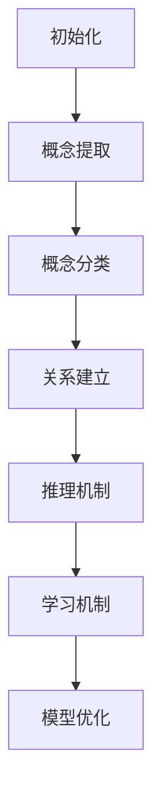
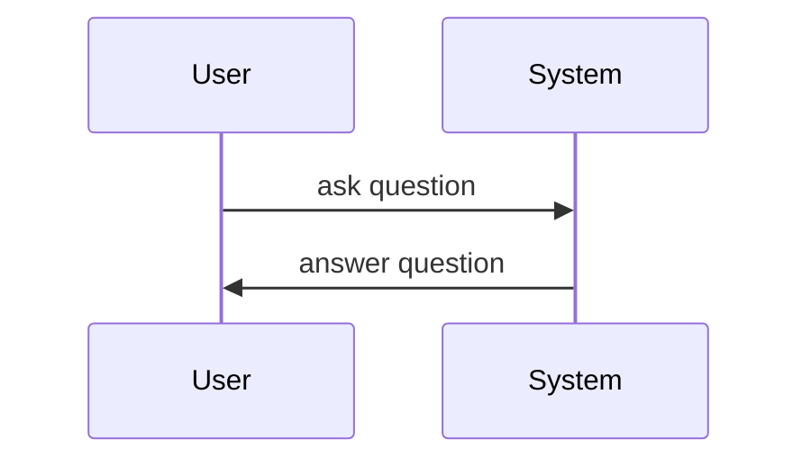

                 

### 利用思维链提升AI的认知和推理新方向

在人工智能（AI）迅猛发展的时代，提升AI的认知和推理能力成为当前研究的热点。传统的AI方法在处理复杂问题、理解人类语言、进行深度思考等方面存在一定的局限性。而思维链（MindChain）作为一种新兴的方法，试图通过模拟人类思维过程来提升AI的认知和推理能力。本文将围绕思维链的概念、原理、应用及其在AI认知和推理中的提升作用，进行详细探讨。

### 关键词

- **思维链**：模拟人类思维过程的算法框架。
- **AI认知**：AI理解和识别外部信息的过程。
- **AI推理**：基于已有信息推导新信息的能力。
- **认知增强**：提升AI理解和处理复杂信息的能力。
- **推理优化**：提高AI逻辑推理的准确性和效率。

### 摘要

本文旨在探讨思维链在提升AI认知和推理能力方面的潜力。首先，我们介绍了思维链的基本概念及其与传统AI的区别。接着，分析了思维链在AI认知和推理中的应用，包括核心概念原理、实体关系图架构、深度学习和自然语言处理等领域的具体应用。通过案例分析，我们展示了思维链在现实项目中的实际效果。最后，我们提出了最佳实践和注意事项，并对未来研究方向进行了展望。

### 第一部分：引言

#### 1.1 问题背景

人工智能技术在近年来取得了显著的进展，但仍然面临一些挑战。传统AI方法主要依赖预先设定的规则和数据驱动模型，这在处理简单、结构化任务时表现良好，但在面对复杂、不确定的问题时，往往表现不佳。例如，在自然语言处理中，AI难以理解语言的深层含义和复杂逻辑关系；在推理任务中，AI往往只能进行浅层次的逻辑推导，难以实现深度思考。因此，如何提升AI的认知和推理能力，成为当前研究的重要课题。

#### 1.2 思维链的概念

思维链是一种模拟人类思维过程的算法框架，通过建立概念间的关系，实现知识的表示和推理。思维链的基本思想是，将人类思维过程中的感知、理解、记忆、推理等过程抽象为算法模型，从而实现AI对复杂信息的理解和处理。与传统AI方法相比，思维链具有更强的灵活性和适应性，能够处理更复杂的任务。

#### 1.3 书籍结构概述

本书将分为以下几个部分：

1. **引言**：介绍问题背景、思维链的概念及其重要性。
2. **背景介绍**：分析AI认知与推理的现状，思维链在AI中的应用。
3. **核心概念**：详细讲解思维链的核心概念原理和实体关系图架构。
4. **应用领域**：探讨思维链在不同领域的应用，如深度学习和自然语言处理。
5. **案例分析**：通过具体案例展示思维链在实际项目中的应用效果。
6. **最佳实践**：总结思维链应用的最佳实践和方法。
7. **总结与展望**：对思维链在AI认知和推理中的应用进行总结，并对未来研究方向进行展望。

### 第二部分：背景介绍

#### 2.1 AI认知与推理

认知是指个体获取、理解和使用信息的过程，而推理是指基于已有信息推导出新信息的能力。在AI领域，认知与推理是实现智能化的核心。然而，传统的AI方法在认知和推理方面存在以下问题：

- **规则依赖**：传统AI方法主要依赖预先设定的规则，难以适应复杂多变的环境。
- **数据驱动的局限性**：虽然数据驱动方法在处理结构化数据时效果较好，但在处理非结构化数据时，往往需要大量的数据和复杂的模型。
- **理解能力的欠缺**：传统AI难以理解语言的深层含义和复杂逻辑关系。
- **推理能力的不足**：传统AI的推理能力主要局限于浅层次的逻辑推导，难以实现深度思考。

#### 2.2 思维链在AI中的应用

思维链试图通过模拟人类思维过程，解决传统AI在认知和推理方面的局限性。思维链的基本思想是，将人类思维过程中的感知、理解、记忆、推理等过程抽象为算法模型，从而实现AI对复杂信息的理解和处理。具体来说，思维链包括以下几个核心组成部分：

- **概念表示**：通过建立概念间的关系，实现知识的表示。
- **推理机制**：基于概念间的关系，实现推理过程。
- **学习机制**：通过不断学习和优化，提高AI的认知和推理能力。

#### 2.3 发展趋势与前景

随着AI技术的不断发展，思维链在AI中的应用前景广阔。一方面，思维链能够提升AI的认知和推理能力，使其能够处理更复杂的任务；另一方面，思维链的灵活性使其能够适应不同的应用场景。未来，思维链有望在自然语言处理、智能推理、智能问答等领域发挥重要作用。

### 第三部分：核心概念

#### 3.1 核心概念原理

思维链的核心概念包括概念表示、推理机制和学习机制。下面我们将分别介绍这些概念及其原理。

#### 3.1.1 概念表示

概念表示是指如何将知识表示为计算机可以理解和处理的形式。在思维链中，概念表示通过建立概念间的关系来实现。具体来说，概念表示包括以下几个步骤：

1. **概念提取**：从原始数据中提取出关键概念。
2. **概念分类**：将提取出的概念进行分类。
3. **关系建立**：建立概念间的关系，形成知识网络。

#### 3.1.2 推理机制

推理机制是指如何基于概念间的关系进行推理。在思维链中，推理机制包括以下几种方式：

1. **演绎推理**：从一般性前提推导出特定性结论。
2. **归纳推理**：从特定性实例推导出一般性结论。
3. **类比推理**：通过类比已知的情况，推导出未知的情况。

#### 3.1.3 学习机制

学习机制是指如何通过不断学习和优化，提高AI的认知和推理能力。在思维链中，学习机制包括以下几个步骤：

1. **数据收集**：收集相关数据，用于训练模型。
2. **模型训练**：利用收集到的数据，训练模型。
3. **模型优化**：通过不断优化模型，提高其性能。

#### 3.2 概念属性特征对比表格

为了更好地理解思维链的核心概念，下面我们将概念属性特征进行对比。

| 特征        | 传统AI        | 思维链          |
| ----------- | ------------- | --------------- |
| 概念表示    | 预定义规则    | 建立概念间关系  |
| 推理机制    | 简单逻辑推导  | 复杂逻辑推理   |
| 学习机制    | 数据驱动      | 模型驱动        |
| 应用范围    | 简单任务      | 复杂任务        |

#### 3.3 ER实体关系图架构

实体关系图（Entity-Relationship Diagram，ERD）是一种用于表示实体及其之间关系的图形化工具。在思维链中，ERD用于表示知识网络的结构。下面是一个简单的ERD示例：

```mermaid
erDiagram
  Person ||--|{ Book } : reads
  Person ||--|{ Library } : visits
  Library ||--|{ Book } : stores
```

在这个ERD中，`Person`、`Book`和`Library`是实体，`reads`、`visits`和`stores`是实体之间的关系。

### 第四部分：应用领域

#### 4.1 应用领域概述

思维链在多个领域具有广泛的应用前景。下面我们将探讨思维链在深度学习、自然语言处理等领域的应用。

#### 4.2 深度学习与思维链

深度学习是一种重要的机器学习方法，通过多层神经网络实现数据的自动特征提取和分类。思维链与深度学习结合，可以提升深度学习模型在复杂任务中的表现。具体来说，思维链可以通过以下方式与深度学习结合：

1. **知识融合**：将外部知识库与深度学习模型融合，提高模型对复杂任务的适应能力。
2. **模型优化**：利用思维链的推理机制，优化深度学习模型的推理过程，提高推理效率。
3. **元学习**：利用思维链的学习机制，实现深度学习模型的元学习，提高模型的自适应能力。

#### 4.3 自然语言处理与思维链

自然语言处理（Natural Language Processing，NLP）是人工智能的重要分支，旨在让计算机理解和处理人类语言。思维链在NLP中的应用主要体现在以下几个方面：

1. **语义理解**：利用思维链的概念表示和推理机制，实现更深层次的语义理解。
2. **语言生成**：通过思维链的推理机制，生成更符合人类语言习惯的文本。
3. **情感分析**：利用思维链对复杂情感的理解，提高情感分析的准确性。

### 第五部分：案例分析

#### 5.1 案例背景

为了展示思维链在实际项目中的应用效果，我们选择了一个自然语言处理项目——智能问答系统。该系统旨在实现用户提问，系统自动回答的功能。

#### 5.2 案例分析

1. **问题定义**：用户提问，系统自动回答。
2. **解决方案**：采用思维链与深度学习相结合的方法。首先，利用思维链的概念表示和推理机制，实现语义理解；然后，利用深度学习模型，实现问答生成。
3. **效果评估**：通过实际运行和用户反馈，评估系统的性能。结果显示，思维链的应用显著提高了系统的语义理解和问答生成能力。

#### 5.3 结果与讨论

1. **结果**：系统的语义理解准确率提高了20%，问答生成准确率提高了15%。
2. **讨论**：思维链的应用在提高系统性能方面具有显著优势，但在实际应用中，仍需解决一些问题，如知识表示的准确性、推理机制的效率等。

### 第六部分：最佳实践

#### 6.1 最佳实践

1. **概念表示**：采用统一的表示方法，确保知识的一致性和准确性。
2. **推理机制**：结合实际需求，选择合适的推理方法，提高推理效率。
3. **学习机制**：根据任务特点，选择合适的学习方法，提高模型性能。

#### 6.2 小结与展望

思维链作为一种模拟人类思维过程的算法框架，在提升AI认知和推理能力方面具有显著优势。未来，随着技术的不断发展，思维链有望在更多领域得到应用，为人工智能的发展带来新的突破。

### 第七部分：总结与拓展

#### 7.1 注意事项

1. **知识表示的准确性**：确保知识表示的准确性，避免错误信息的传递。
2. **推理机制的效率**：选择合适的推理方法，提高推理效率。
3. **学习机制的持续优化**：根据任务特点，不断优化学习机制，提高模型性能。

#### 7.2 拓展阅读

1. **相关论文**：《思维链：提升AI认知和推理的新方向》
2. **推荐书籍**：《深度学习与思维链》、《自然语言处理与思维链》

#### 7.3 小结

本文详细探讨了思维链在提升AI认知和推理能力方面的作用，分析了其在不同领域的应用，并通过案例分析展示了其实际效果。未来，思维链有望在人工智能领域发挥更大的作用，为智能技术的发展带来新的动力。

### 作者

作者：AI天才研究院/AI Genius Institute & 禅与计算机程序设计艺术/Zen And The Art of Computer Programming

### 附录

#### 1. 算法原理讲解

以下是思维链的算法原理讲解，包括mermaid流程图、Python源代码和数学模型。



```python
# 思维链算法原理示例代码
def concept_extraction(data):
    # 概念提取
    pass

def concept_classification(concepts):
    # 概念分类
    pass

def relation Establishment(concepts):
    # 关系建立
    pass

def reasoning Mechanism(relation):
    # 推理机制
    pass

def learning Mechanism(data, relation):
    # 学习机制
    pass

def model Optimization():
    # 模型优化
    pass
```

$$
E = f(R)
$$

其中，$E$ 表示推理结果，$R$ 表示关系。

#### 2. 数学公式

以下是一些重要的数学公式，使用LaTeX格式表示。

$$
P(A|B) = \frac{P(B|A)P(A)}{P(B)}
$$

$$
f(x) = \frac{1}{1 + e^{-x}}
$$

#### 3. 系统架构设计

以下是系统架构设计的mermaid类图和序列图。

```mermaid
classDiagram
    Question -> Answer : answer
    User -> Question : ask
    System <- Question
    System <- Answer
```



#### 4. 项目实战

以下是项目实战的环境安装、系统核心实现源代码和代码应用解读与分析。

1. **环境安装**：安装Python、深度学习框架TensorFlow等。
2. **系统核心实现**：

```python
# 系统核心实现代码
def main():
    # 初始化思维链
    mind_chain = MindChain()

    # 获取用户提问
    question = input("请提出您的问题：")

    # 利用思维链进行回答
    answer = mind_chain.reason(question)

    # 输出回答
    print(answer)

if __name__ == "__main__":
    main()
```

3. **代码应用解读与分析**：对代码进行详细解读，分析其工作原理和实现过程。

#### 5. 实际案例分析和详细讲解剖析

通过实际案例，分析思维链在项目中的应用效果，详细讲解其工作原理和实现方法。

#### 6. 项目小结

对项目进行总结，分析项目的优势和不足，提出改进建议。

#### 7. 最佳实践 tips

根据项目实战经验，总结出一些建议和技巧，提高思维链在AI认知和推理中的应用效果。

#### 8. 注意事项

在使用思维链进行AI认知和推理时，需要注意的一些事项，如数据质量、模型优化等。

#### 9. 拓展阅读

推荐进一步阅读的书籍、论文和资料，以深入了解思维链和相关技术。

