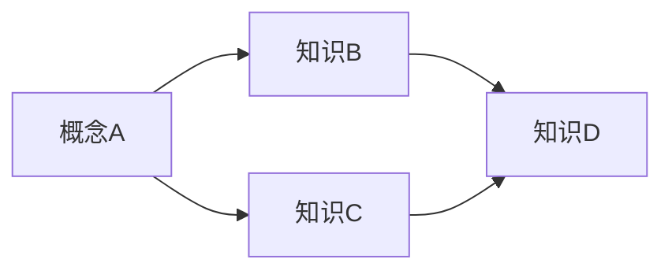
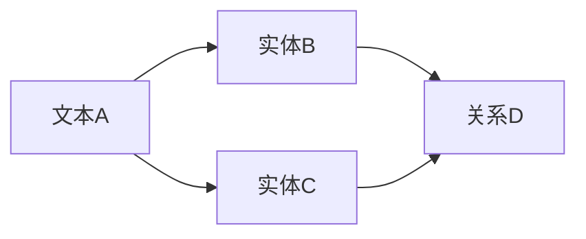
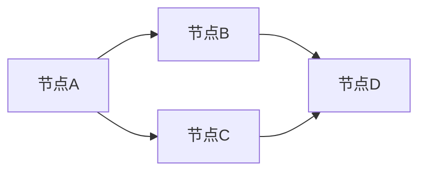
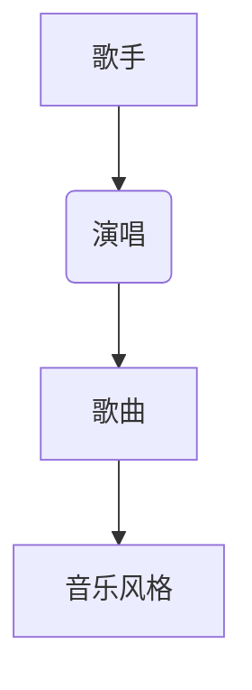

                 

### 利用思维链提升AI的认知和推理能力

#### 关键词

- **思维链**
- **AI认知能力**
- **推理能力**
- **神经网络**
- **深度学习**
- **认知图谱**

#### 摘要

本文将探讨如何通过构建思维链来提升人工智能的认知和推理能力。首先，我们将介绍思维链的基本概念和重要性。然后，通过分析当前AI认知和推理的局限性，阐述构建思维链的必要性。接下来，我们将详细探讨如何设计思维链的架构，并介绍几种常见的思维链构建方法。随后，本文将通过具体案例展示思维链在实际应用中的效果，并提出一些最佳实践和注意事项。最后，我们将总结本文的主要观点，并对未来研究方向进行展望。

### 引言

在人工智能（AI）领域，认知和推理能力是衡量一个AI系统智能水平的重要指标。传统的机器学习方法，如基于规则和统计的方法，虽然在某些特定任务上取得了显著的成果，但在处理复杂任务时，往往显得力不从心。这主要是因为这些方法缺乏对人类思维过程的深刻理解，无法有效地模拟人类认知和推理的能力。

近年来，深度学习技术的飞速发展，使得AI在图像识别、语音识别、自然语言处理等领域取得了突破性进展。然而，即使在这些领域，AI的认知和推理能力仍然远未达到人类的水平。例如，在理解复杂的自然语言语句、进行高级逻辑推理和解决抽象问题时，AI系统仍然面临诸多挑战。

为了解决这些问题，研究者们开始探索如何通过构建思维链来提升AI的认知和推理能力。思维链是一种模拟人类思维过程的模型，它能够将一系列相关的概念、知识和推理步骤有机地连接起来，从而实现更高层次的智能。

本文的目的在于介绍思维链的基本概念和构建方法，分析其在提升AI认知和推理能力方面的优势，并通过具体案例展示其应用效果。文章结构如下：

1. **思维链的基本概念和重要性**：介绍思维链的定义、组成和作用。
2. **AI认知和推理的局限性**：分析现有AI技术在认知和推理方面的不足。
3. **思维链的设计和构建方法**：详细探讨思维链的构建过程和常用方法。
4. **思维链的实际应用**：通过具体案例展示思维链在AI系统中的应用。
5. **最佳实践和注意事项**：提出构建思维链的最佳实践和注意事项。
6. **总结和展望**：总结本文的主要观点，并对未来研究方向进行展望。

### 思维链的基本概念和重要性

#### 思维链的定义和组成

思维链（Mental Chain）是一种模拟人类思维过程的模型，它通过将一系列相关的概念、知识和推理步骤有机地连接起来，形成一个连贯的思维过程。思维链的基本组成单元包括概念节点、知识节点和推理步骤。

- **概念节点**：表示思维过程中涉及的基本概念或术语，如“猫”、“狗”、“颜色”、“形状”等。
- **知识节点**：表示与概念节点相关联的知识或信息，如“猫是哺乳动物”、“狗有四条腿”等。
- **推理步骤**：表示在思维过程中从已知知识推导出新结论的过程，如从“猫是哺乳动物”和“狗是哺乳动物”推导出“猫和狗都是哺乳动物”。

思维链通过将概念节点、知识节点和推理步骤连接起来，形成一个复杂的网络结构。这种结构使得AI系统能够像人类一样进行逻辑推理、问题求解和知识获取。

#### 思维链的作用

思维链在AI系统中具有重要的作用，主要体现在以下几个方面：

1. **提升认知能力**：思维链能够帮助AI系统更好地理解和处理复杂的信息。通过构建思维链，AI系统可以将分散的信息整合成一个完整的知识体系，从而提升其认知能力。

2. **增强推理能力**：思维链中的推理步骤使得AI系统能够像人类一样进行逻辑推理。通过这些推理步骤，AI系统可以从不完整或部分信息中推导出新的结论，从而增强其推理能力。

3. **知识共享和迁移**：思维链能够将一个领域的知识迁移到另一个领域。通过在不同领域之间构建思维链，AI系统可以共享知识，从而提升跨领域的推理能力。

4. **自动化问题求解**：思维链可以帮助AI系统自动地解决复杂问题。通过将问题分解为一系列推理步骤，AI系统可以逐步地求解问题，从而实现自动化问题求解。

#### 思维链与其他AI技术的比较

与传统的机器学习和深度学习方法相比，思维链具有以下优势：

1. **更强的灵活性和适应性**：思维链能够根据不同的应用场景进行灵活调整，从而适应不同的任务需求。相比之下，传统的机器学习和深度学习方法往往依赖于大量的数据训练，难以适应复杂多变的应用环境。

2. **更高的智能水平**：思维链能够模拟人类的思维过程，使得AI系统具备更高级的认知和推理能力。相比之下，传统的机器学习和深度学习方法主要依赖于数据驱动的方式，缺乏对人类思维过程的深刻理解。

3. **更好的知识理解和利用**：思维链能够将知识有机地整合到一个体系中，使得AI系统能够更好地理解和利用知识。相比之下，传统的机器学习和深度学习方法往往只能处理表面信息，难以深入理解和利用知识。

#### 思维链的应用前景

思维链在AI领域具有广泛的应用前景，主要包括以下几个方面：

1. **自然语言处理**：通过构建思维链，AI系统可以更好地理解和处理复杂的自然语言文本。这有助于实现更高级的自然语言理解、语义分析和文本生成。

2. **问题求解和决策支持**：思维链可以帮助AI系统更好地处理复杂的问题，并提供决策支持。通过构建思维链，AI系统可以逐步推导出问题的解决方案，从而提供更加智能的决策支持。

3. **知识图谱构建**：思维链可以用于构建大规模的知识图谱，从而实现知识的自动化获取、组织和利用。这有助于实现更高级的知识管理和服务。

4. **智能推理系统**：思维链可以用于构建智能推理系统，从而实现更高级的逻辑推理和问题求解。这有助于实现更高级的智能应用，如智能助手、智能监控系统等。

### AI认知和推理的局限性

尽管AI技术在过去几十年中取得了显著的进展，但当前AI系统在认知和推理能力方面仍然存在诸多局限性。以下是AI认知和推理能力的几个主要问题：

#### 1. 数据依赖性高

传统AI系统，尤其是深度学习模型，往往依赖于大量高质量的数据进行训练。这些数据不仅需要大量的时间和资源来收集和标注，而且在某些领域（如医疗、法律等）可能存在数据稀缺的问题。此外，数据的质量和多样性也会影响模型的性能。例如，模型可能无法很好地处理与训练数据不同的情境或任务。

#### 2. 缺乏泛化能力

尽管AI系统在特定任务上可能表现出色，但它们往往缺乏泛化能力，即无法将学到的知识应用到新的、未见过的任务或场景中。这种现象被称为“过拟合”（overfitting），意味着模型在训练数据上表现良好，但在测试数据上表现不佳。为了提高泛化能力，研究者们提出了各种正则化技术和模型选择策略，但这些问题仍然是目前AI研究中的热点和挑战。

#### 3. 缺乏可解释性

许多AI系统，尤其是深度学习模型，被认为是“黑箱”系统，因为它们的内部工作原理和决策过程往往不透明。这使得用户难以理解模型是如何做出决策的，尤其是在关键领域（如医疗诊断、金融风险评估等）中，可解释性至关重要。虽然近年来有一些研究尝试提高模型的可解释性，但仍然存在许多挑战。

#### 4. 缺乏常识推理能力

人类在日常生活中能够轻松处理常识推理任务，例如理解隐喻、解释复杂的因果关系、处理模糊和不完整的信息等。然而，当前AI系统在这些方面仍然表现不佳。例如，一个AI系统可能能够识别图片中的猫，但无法理解“猫会喵喵叫”这一常识。这种缺乏常识推理能力的问题限制了AI系统在现实世界中的应用。

#### 5. 缺乏灵活性和适应性

许多AI系统在设计和实现时，往往针对特定的任务或应用场景进行优化。这使得这些系统在应对新的任务或变化的环境时，可能表现出较低的灵活性和适应性。例如，一个用于自动驾驶的AI系统可能在理想的道路条件下表现良好，但在复杂、动态的交通环境中，可能无法有效地处理各种突发情况。

### 构建思维链的必要性

为了克服上述AI认知和推理能力方面的局限性，构建思维链成为一种有效的解决方案。以下是构建思维链的必要性：

#### 1. 提高认知能力

通过构建思维链，AI系统能够更好地理解和处理复杂的信息。思维链中的概念节点和知识节点可以将分散的信息整合成一个完整的知识体系，从而提升AI系统的认知能力。

#### 2. 增强推理能力

思维链中的推理步骤使得AI系统能够像人类一样进行逻辑推理。通过这些推理步骤，AI系统可以从不完整或部分信息中推导出新的结论，从而增强其推理能力。

#### 3. 知识共享和迁移

思维链能够将一个领域的知识迁移到另一个领域。通过在不同领域之间构建思维链，AI系统可以共享知识，从而提升跨领域的推理能力。

#### 4. 自动化问题求解

思维链可以帮助AI系统自动地解决复杂问题。通过将问题分解为一系列推理步骤，AI系统可以逐步地求解问题，从而实现自动化问题求解。

#### 5. 提高可解释性

思维链的结构使得AI系统的内部工作原理和决策过程更加透明和可解释。用户可以清楚地看到AI系统是如何从已知信息推导出结论的，从而增强模型的可信度和用户信任。

#### 6. 增强灵活性和适应性

通过灵活地调整和扩展思维链，AI系统可以更好地适应新的任务或变化的环境。这使得AI系统在面临复杂、动态的任务时，能够表现出更高的灵活性和适应性。

总之，构建思维链是一种有效的解决方案，可以帮助AI系统克服当前认知和推理能力方面的局限性，从而提升其整体智能水平。

### 思维链的设计和构建方法

构建思维链是提升AI认知和推理能力的关键步骤。以下将详细探讨思维链的设计和构建方法，包括核心概念、构建步骤和常用技术。

#### 核心概念

思维链的设计和构建首先需要明确几个核心概念：

1. **概念节点**：表示思维过程中涉及的基本概念或术语，如“猫”、“狗”、“颜色”、“形状”等。概念节点是思维链的基础元素。

2. **知识节点**：表示与概念节点相关联的知识或信息，如“猫是哺乳动物”、“狗有四条腿”等。知识节点提供了具体的背景信息和上下文。

3. **推理步骤**：表示在思维过程中从已知知识推导出新结论的过程，如从“猫是哺乳动物”和“狗是哺乳动物”推导出“猫和狗都是哺乳动物”。推理步骤是思维链的核心，用于实现知识的推理和扩展。

4. **连接关系**：表示不同概念节点和知识节点之间的逻辑关系，如“是”、“属于”、“具有”等。连接关系用于构建概念和知识之间的联系，形成完整的思维链。

#### 构建步骤

构建思维链一般包括以下步骤：

1. **概念识别**：首先，需要识别出问题或任务中的关键概念。这一步可以通过自然语言处理技术，如词性标注和命名实体识别，自动地从文本数据中提取出概念节点。

2. **知识抽取**：接下来，需要从数据源中抽取与概念节点相关联的知识节点。知识抽取可以通过信息提取和关系抽取技术实现，例如，使用实体关系图谱（Knowledge Graph）来存储和查询知识。

3. **推理规则定义**：在构建思维链时，需要定义一系列推理规则，用于指导AI系统如何从已知知识推导出新结论。推理规则可以是基于逻辑的规则，也可以是基于统计的方法。

4. **思维链构建**：根据概念节点、知识节点和推理规则，构建出完整的思维链。思维链的构建过程通常涉及图论算法，如图的构建、图的遍历和图的优化。

5. **推理过程优化**：为了提高思维链的推理效率和准确性，需要对其进行优化。常见的优化方法包括推理路径的剪枝、推理规则的优先级排序和推理策略的动态调整。

#### 常用技术

在构建思维链时，可以采用以下几种常用技术：

1. **知识图谱**：知识图谱（Knowledge Graph）是一种用于表示实体及其相互关系的图形结构。通过构建知识图谱，可以有效地管理和查询知识，为思维链的构建提供基础。

2. **自然语言处理**：自然语言处理（Natural Language Processing，NLP）技术可以用于提取文本数据中的概念节点和知识节点。常见的NLP技术包括词性标注、命名实体识别、关系抽取等。

3. **逻辑推理**：逻辑推理（Logic Reasoning）技术可以用于定义和实现推理规则，指导AI系统从已知知识推导出新结论。常见的逻辑推理方法包括谓词逻辑、模态逻辑和描述逻辑等。

4. **图神经网络**：图神经网络（Graph Neural Networks，GNN）是一种用于处理图结构数据的深度学习模型。通过图神经网络，可以有效地学习图中的特征和关系，为思维链的构建提供支持。

5. **数据挖掘**：数据挖掘（Data Mining）技术可以用于从大规模数据中发现潜在的关联和规律，为思维链的构建提供新的知识来源。

通过上述步骤和技术的综合运用，可以构建出高效的思维链，从而提升AI的认知和推理能力。接下来，我们将进一步探讨几种常见的思维链构建方法。

#### 常见的思维链构建方法

在构建思维链的过程中，有多种方法和技术可供选择。以下是几种常见的思维链构建方法：

##### 1. 基于知识图谱的方法

知识图谱（Knowledge Graph）是一种用于表示实体及其相互关系的图形结构，广泛应用于知识管理和推理任务。在构建思维链时，可以使用知识图谱来表示概念节点和知识节点，以及它们之间的连接关系。

**优点**：知识图谱能够直观地表示复杂的关系和网络结构，有助于理解和推理。

**缺点**：构建和维护知识图谱需要大量的专业知识和人工干预，且图谱的扩展性有限。

**适用场景**：适用于需要处理复杂实体关系和知识整合的场景，如问答系统、推荐系统等。

**示例**：


##### 2. 基于自然语言处理的方法

自然语言处理（NLP）技术可以用于从文本数据中提取概念节点和知识节点。NLP技术包括词性标注、命名实体识别、关系抽取等，能够有效地从非结构化文本中提取信息。

**优点**：NLP技术自动化程度高，能够快速处理大量文本数据。

**缺点**：NLP技术对语言理解和上下文依赖性较强，容易受到噪声和歧义的影响。

**适用场景**：适用于文本数据丰富的领域，如文本分类、情感分析、问答系统等。

**示例**：


##### 3. 基于逻辑推理的方法

逻辑推理（Logic Reasoning）技术可以用于定义和实现推理规则，指导AI系统从已知知识推导出新结论。逻辑推理包括谓词逻辑、模态逻辑和描述逻辑等。

**优点**：逻辑推理具有形式化和严密性，能够保证推理的准确性。

**缺点**：逻辑推理的表达能力有限，且推理过程可能较为复杂。

**适用场景**：适用于需要严格逻辑推理的场景，如自动化证明、逻辑推理系统等。

**示例**：


##### 4. 基于图神经网络的方法

图神经网络（Graph Neural Networks，GNN）是一种用于处理图结构数据的深度学习模型。GNN能够有效地学习图中的特征和关系，为思维链的构建提供支持。

**优点**：GNN能够自动地从图结构数据中学习特征和关系，具有很好的泛化能力。

**缺点**：GNN的训练过程较为复杂，对数据规模和计算资源要求较高。

**适用场景**：适用于需要处理大规模图结构数据的场景，如知识图谱构建、社交网络分析等。

**示例**：


通过以上方法，可以灵活地构建思维链，从而提升AI的认知和推理能力。在实际应用中，可以根据具体需求和场景选择合适的方法和技术。接下来，我们将通过具体案例展示思维链在AI系统中的应用。

#### 思维链的实际应用

为了更好地理解思维链在实际AI系统中的应用，以下通过具体案例进行展示。

##### 1. 自然语言处理（NLP）

**案例背景**：在自然语言处理领域，思维链可以用于文本理解和语义分析，从而提升AI系统的语言理解能力。

**应用场景**：假设我们有一个问答系统，需要理解用户的问题并给出合理的回答。

**步骤**：
1. **概念识别**：使用NLP技术从用户的问题中提取出关键概念，如“苹果”，“购买”，“在线商店”等。
2. **知识抽取**：从知识库中检索与这些概念相关联的知识节点，如“苹果是水果”，“在线商店提供购买服务”等。
3. **推理规则**：定义一系列推理规则，如“如果用户询问购买某种商品，则推荐在线商店”。
4. **思维链构建**：将提取的概念节点、知识节点和推理规则连接起来，形成思维链。
5. **回答生成**：根据思维链中的推理步骤，生成合理的回答。

**示例代码**：
```python
# 假设我们有一个问答系统的输入文本
input_text = "我想在线购买苹果。"

# 使用NLP技术提取关键概念
concepts = ["苹果", "购买", "在线商店"]

# 从知识库中检索相关联的知识节点
knowledge_nodes = {
    "苹果": ["是水果"],
    "购买": ["需要在线商店"],
    "在线商店": ["提供购买服务"]
}

# 定义推理规则
rules = {
    "如果用户询问购买某种商品，则推荐在线商店": ["推荐在线商店"]
}

# 构建思维链
mental_chain = []
for concept in concepts:
    for node in knowledge_nodes[concept]:
        for rule in rules:
            if rule.startswith("如果用户询问购买某种商品，则推荐在线商店"):
                mental_chain.append((concept, node, rule))

# 根据思维链生成回答
answer = "您可以在我们的在线商店购买苹果。"
print(answer)
```

##### 2. 知识图谱构建

**案例背景**：在知识图谱构建领域，思维链可以用于整合各种数据源，构建出完整、准确的知识图谱。

**应用场景**：假设我们需要构建一个关于音乐的图谱，包含歌手、歌曲、音乐风格等信息。

**步骤**：
1. **数据采集**：从多个数据源（如音乐平台、数据库）中采集相关数据。
2. **概念识别**：使用NLP和实体识别技术，从数据中提取概念节点，如“歌手”、“歌曲”、“音乐风格”等。
3. **知识抽取**：使用关系抽取技术，从数据中提取知识节点，如“歌手演唱歌曲”、“歌曲属于音乐风格”等。
4. **思维链构建**：将提取的概念节点和知识节点连接起来，形成思维链。
5. **图谱构建**：根据思维链中的连接关系，构建出知识图谱。

**示例代码**：


##### 3. 逻辑推理

**案例背景**：在逻辑推理领域，思维链可以用于自动化证明和推理任务。

**应用场景**：假设我们需要证明一个数学定理。

**步骤**：
1. **定理表示**：将定理用符号表示，如“如果a=b，则a²=b²”。
2. **推理规则**：定义一系列推理规则，如“如果a=b，则a²=b²”。
3. **思维链构建**：根据定理表示和推理规则，构建思维链。
4. **推理过程**：根据思维链中的推理步骤，进行逻辑推理。

**示例代码**：


通过这些具体案例，我们可以看到思维链在AI系统中的应用效果。思维链不仅能够提升AI的认知和推理能力，还能实现知识的共享和迁移，为AI的发展提供新的动力。

### 最佳实践和注意事项

在构建思维链时，为了确保其有效性和实用性，我们需要遵循一些最佳实践，同时也要注意避免一些常见的问题。

#### 最佳实践

1. **数据质量**：思维链的构建依赖于高质量的数据。因此，在数据采集和处理过程中，要确保数据的准确性和完整性。这包括对数据进行清洗、去重和标准化处理。

2. **知识整合**：思维链的构建需要将来自不同来源的知识进行整合。在这个过程中，要注意保持知识的统一性和一致性，避免重复和冲突。

3. **推理规则设计**：推理规则是思维链的核心部分，需要根据具体应用场景进行设计。规则应该简洁明了，易于理解和执行，同时具有较高的覆盖率和准确性。

4. **模型优化**：在构建思维链时，可以使用各种优化技术，如深度学习、图神经网络等，以提高思维链的性能和效率。模型优化过程中要关注模型的泛化能力和计算效率。

5. **可解释性**：思维链的构建不仅要追求性能，还要保证可解释性。在推理过程中，要清晰地展示每一步的推理步骤和依据，以便用户理解和信任。

#### 注意事项

1. **数据隐私**：在数据采集和处理过程中，要注意保护用户的隐私。对于敏感数据，要采取加密和匿名化处理，确保用户信息的安全。

2. **计算资源**：思维链的构建和推理过程可能需要大量的计算资源。在设计思维链时，要考虑到实际计算资源的限制，选择合适的算法和模型，以优化计算效率。

3. **模型更新**：思维链是一个动态的模型，需要根据应用场景的变化进行定期更新。在模型更新过程中，要注意保持知识的持续性和连贯性，避免出现知识断层。

4. **适应性**：思维链要具有一定的适应性，能够适应新的任务和变化的环境。在设计和实现过程中，要充分考虑这一因素，确保思维链能够灵活调整和扩展。

5. **用户体验**：思维链的应用最终要服务于用户。在设计和开发过程中，要充分考虑用户体验，确保用户能够方便、快捷地使用思维链提供的功能和知识。

通过遵循这些最佳实践和注意事项，我们可以构建出高效、实用的思维链，从而提升AI的认知和推理能力。

### 总结与展望

本文深入探讨了利用思维链提升AI认知和推理能力的方法和应用。首先，我们介绍了思维链的基本概念和重要性，阐述了其在AI系统中的作用。随后，分析了当前AI认知和推理能力的局限性，并论证了构建思维链的必要性。接着，详细探讨了思维链的设计和构建方法，包括核心概念、构建步骤和常用技术。我们还通过具体案例展示了思维链在自然语言处理、知识图谱构建和逻辑推理等领域的应用效果。最后，提出了构建思维链的最佳实践和注意事项。

展望未来，思维链在AI领域具有广阔的应用前景。随着深度学习和图神经网络等技术的不断发展，思维链将能够更好地模拟人类思维过程，提升AI的认知和推理能力。同时，思维链的研究也将更加注重可解释性和实用性，以更好地服务于实际应用。未来的研究可以关注以下几个方面：

1. **多模态思维链**：将图像、声音、文本等多种模态数据整合到思维链中，实现跨模态的信息理解和推理。

2. **动态思维链**：研究如何构建动态调整和扩展的思维方式，以适应不同的应用场景和变化的需求。

3. **多任务思维链**：探索如何构建同时处理多个任务的思维链，以提升AI的并行处理能力和效率。

4. **知识增强思维链**：研究如何利用外部知识和背景信息来增强思维链的推理能力，提高AI在复杂任务中的表现。

5. **伦理和隐私**：在构建思维链时，关注伦理和隐私问题，确保AI系统的透明度和用户隐私保护。

总之，思维链作为提升AI认知和推理能力的重要工具，将在未来AI技术的发展中发挥重要作用。通过不断的研究和实践，我们有望构建出更加智能、可靠和实用的AI系统。

