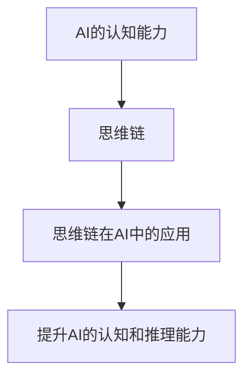
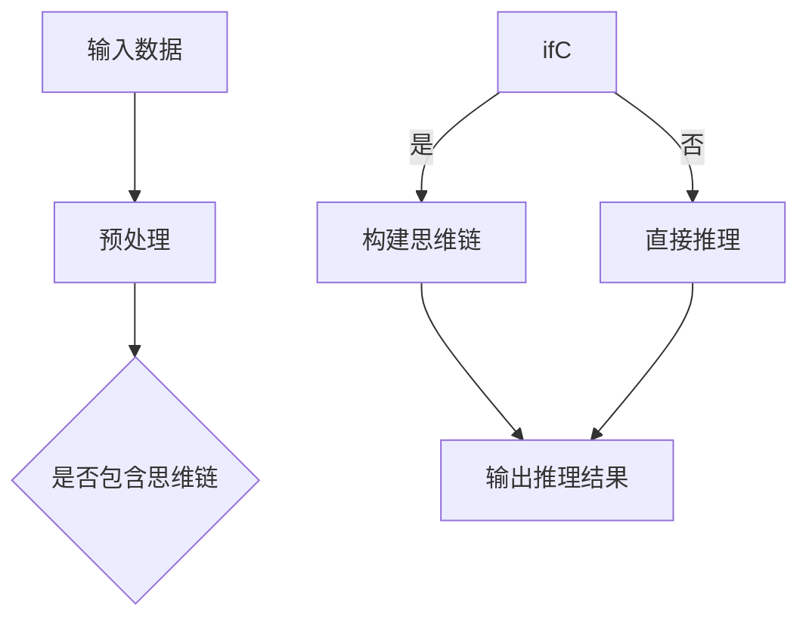

                 

### 背景介绍

#### 1.1 问题背景

人工智能（AI）在过去的几十年里取得了飞速的发展，从最初的规则推理系统到如今深度学习、自然语言处理等复杂技术的广泛应用。在这一过程中，AI在图像识别、语音识别、推荐系统等多个领域展现出了惊人的能力，极大地改变了我们的生活和工作方式。

然而，随着AI应用场景的不断扩大，对AI的认知和推理能力提出了更高的要求。传统的AI系统在处理复杂问题时，往往表现出认知能力不足、推理能力有限等问题。特别是在面对不确定性、非线性以及动态变化的场景时，AI的表现更是难以满足实际需求。因此，提升AI的认知和推理能力成为了一个亟待解决的问题。

认知能力指的是AI对信息的感知、理解、记忆和判断等能力，而推理能力则是AI在已有知识的基础上，通过逻辑推理得出结论的能力。这两种能力在AI的实际应用中至关重要，它们不仅决定了AI系统的智能水平，也直接影响到AI在实际问题解决中的表现。

思维链作为一种新型的认知和推理机制，具有强大的应用潜力。思维链能够模拟人类大脑的思维方式，通过连续的思考步骤，将一个复杂问题分解为多个子问题，并逐步解决。这种机制不仅在理论上有助于提升AI的认知和推理能力，而且在实践中也展现出良好的效果。

#### 1.2 问题描述

如何提升AI的认知和推理能力？这是一个涉及多方面、多层次的复杂问题。现有的AI技术虽然已经取得了显著进展，但在认知和推理方面仍存在明显的不足。具体来说，问题描述如下：

1. **认知能力不足**：AI在感知和理解复杂信息时，往往缺乏深度和广度，难以全面把握问题的本质。
2. **推理能力有限**：AI在已有知识的基础上进行推理时，往往局限于固定的模式，难以应对不确定性和动态变化。
3. **适应性差**：AI在面对新环境和未知问题时，往往无法快速适应，表现出学习能力不足。

为了解决上述问题，我们需要探索新的方法和机制，提升AI的认知和推理能力。其中，思维链作为一种潜在的解决方案，具有重要的研究价值和应用前景。

#### 1.3 问题解决

思维链是一种通过连续思考步骤来模拟人类认知和推理过程的机制。它通过将复杂问题分解为多个子问题，并逐步解决，从而实现对复杂问题的求解。思维链在AI中的应用，有望解决传统AI在认知和推理能力方面的不足。

首先，思维链能够模拟人类大脑的思考过程，通过连续的思考步骤，将一个复杂问题分解为多个子问题，并逐步解决。这种机制不仅有助于提升AI的认知能力，还能够增强AI的推理能力。

其次，思维链具有很强的适应性。它能够根据不同的问题情境，动态调整思考步骤，从而更好地适应复杂、多变的环境。

最后，思维链具有强大的学习能力。通过不断的学习和优化，思维链能够逐步提高其认知和推理能力，从而更好地应对各种复杂问题。

总的来说，利用思维链提升AI的认知和推理能力，具有以下几个方面的优势：

1. **提升认知能力**：思维链能够通过连续的思考步骤，深入理解复杂问题，从而提升AI的认知能力。
2. **增强推理能力**：思维链能够通过逻辑推理，从已有知识中得出新的结论，从而增强AI的推理能力。
3. **提高适应性**：思维链能够根据不同的问题情境，动态调整思考步骤，从而更好地适应复杂、多变的环境。
4. **强化学习能力**：思维链能够通过不断的学习和优化，逐步提高其认知和推理能力，从而更好地应对各种复杂问题。

#### 1.4 边界与外延

在讨论思维链提升AI认知和推理能力时，我们首先需要明确思维链的概念及其在AI中的应用范围。思维链是一种模拟人类思考过程的机制，通过连续的思考步骤，将复杂问题分解为多个子问题，并逐步解决。这种机制不仅在理论上具有广泛的应用前景，而且在实践中也取得了显著的成果。

然而，需要注意的是，思维链并非万能。它存在一定的边界和限制。首先，思维链的适用范围主要在于那些可以通过逻辑推理和信息处理解决的问题。对于一些涉及高度抽象、主观判断或创造性思维的问题，思维链可能并不适用。其次，思维链的效果也受到数据质量和算法性能的限制。只有当数据足够丰富、算法足够高效时，思维链才能充分发挥其作用。

此外，思维链在AI认知和推理能力中的应用，还需要考虑以下方面：

1. **数据预处理**：思维链需要高质量的数据作为基础。因此，在应用思维链时，需要对数据进行预处理，确保其准确性和完整性。
2. **算法优化**：思维链的算法性能对认知和推理能力具有重要影响。因此，需要不断优化算法，提高其效率和准确性。
3. **人机协同**：思维链虽然能够模拟人类思考过程，但仍然需要人类专家的参与和指导。人机协同是思维链应用的关键，有助于提升AI的认知和推理能力。

#### 1.5 概念结构与核心要素组成

要深入理解思维链提升AI认知和推理能力的原理，我们需要从概念结构和核心要素组成两个方面进行分析。

首先，从概念结构来看，思维链主要由以下几个部分组成：

1. **思考节点**：表示思维链中的每一个思考步骤，通常包含输入信息、处理过程和输出结果。
2. **连接关系**：表示思考节点之间的逻辑关系，包括条件连接、顺序连接和反馈连接等。
3. **控制策略**：用于指导思维链的运行过程，包括选择思考节点、调整连接关系和优化思考路径等。

其次，从核心要素组成来看，思维链提升AI认知和推理能力的关键要素包括：

1. **知识表示**：用于表示AI已有的知识和信息，包括事实、规则和模型等。
2. **推理引擎**：用于实现思维链的推理过程，通过逻辑推理和推理规则，得出新的结论。
3. **学习机制**：用于优化思维链的算法性能，通过不断学习和调整，提高认知和推理能力。

通过概念结构和核心要素组成的分析，我们可以更深入地理解思维链提升AI认知和推理能力的原理，为实际应用提供理论支持。

### AI的认知和推理能力

#### 2.1 认知能力的定义与特征

认知能力是人工智能（AI）系统理解和处理信息的能力，包括感知、理解、记忆、学习和判断等方面。具体来说，AI的认知能力主要体现在以下几个方面：

1. **感知**：AI需要能够感知外部环境，包括文字、图像、声音等多种形式的信息。
2. **理解**：AI需要对感知到的信息进行理解和分析，从而提取出有用的知识和信息。
3. **记忆**：AI需要能够存储和记忆重要信息，以便在需要时进行检索和使用。
4. **学习**：AI需要能够从数据中学习，不断优化自身性能，提高处理复杂问题的能力。
5. **判断**：AI需要能够基于已有知识和信息，进行逻辑推理和决策，从而解决实际问题。

AI的认知能力特征主要包括以下几点：

1. **自动化**：AI的认知过程是自动化的，不需要人类干预，能够高效地处理大量信息。
2. **适应性**：AI能够根据不同环境和任务需求，调整自身的认知策略，具备较强的适应性。
3. **泛化能力**：AI需要能够将学到的知识应用于新的场景和问题，具备较强的泛化能力。

#### 2.2 推理能力的定义与特征

推理能力是AI在已有知识和信息的基础上，通过逻辑推理得出新结论的能力。推理能力在AI系统中具有重要地位，它能够帮助AI解决复杂问题，提高智能水平。推理能力主要包括以下几个方面：

1. **逻辑推理**：AI需要能够使用逻辑规则和推理方法，从已知信息中推导出新的结论。
2. **因果推理**：AI需要能够分析事件之间的因果关系，从而预测未来事件的发展。
3. **归纳推理**：AI需要能够从具体实例中总结出一般规律，提高问题解决的效率。

推理能力特征主要包括以下几点：

1. **准确性**：AI的推理过程需要具有较高的准确性，能够正确地推导出结论。
2. **效率**：AI的推理过程需要具有较高的效率，能够在短时间内处理大量信息。
3. **鲁棒性**：AI需要能够在面对不确定性、噪声和错误信息时，仍然能够保持良好的推理能力。

#### 2.3 AI认知和推理能力的对比

AI的认知和推理能力既有联系又有区别。认知能力是推理能力的基础，而推理能力则是认知能力的高级表现。以下是AI认知和推理能力的一些对比：

1. **关注点**：
   - **认知能力**：主要关注AI对信息的感知、理解、记忆和学习。
   - **推理能力**：主要关注AI在已有知识的基础上，通过逻辑推理得出新结论。

2. **过程**：
   - **认知能力**：是一个信息处理的过程，涉及感知、理解、记忆和学习。
   - **推理能力**：是一个逻辑推理的过程，涉及已知信息和结论之间的推导。

3. **作用**：
   - **认知能力**：帮助AI理解世界，获取和存储知识。
   - **推理能力**：帮助AI运用知识，解决问题和做出决策。

4. **特征**：
   - **认知能力**：具有自动化、适应性和泛化能力。
   - **推理能力**：具有准确性、效率和鲁棒性。

通过对比AI的认知和推理能力，我们可以更好地理解它们在AI系统中的作用和重要性。在实际应用中，提升AI的认知和推理能力，有助于提高AI的智能水平和应用效果。

### 思维链的概念原理

#### 2.4 思维链的定义

思维链是一种模拟人类思维过程的机制，通过一系列连续的思考步骤，将复杂问题分解为多个子问题，并逐步解决。思维链的核心在于其动态性和适应性，能够根据不同的问题情境，灵活调整思考步骤和策略，从而实现高效的问题求解。

思维链的定义可以从以下几个方面进行阐述：

1. **基本结构**：思维链由一系列思考节点和连接关系组成，每个思考节点表示一次思考的步骤，连接关系表示思考节点之间的逻辑关系。
2. **功能特点**：思维链具有连续性、层次性和适应性，能够将复杂问题分解为多个子问题，并通过逐步解决子问题，最终解决原始问题。
3. **应用范围**：思维链适用于各种需要逻辑推理和问题分解的场景，如人工智能、数据分析、问题解决等。

#### 2.5 思维链的基本原理

思维链的基本原理可以概括为以下几个方面：

1. **问题分解**：思维链通过将复杂问题分解为多个子问题，使得每个子问题更加简单和易于解决。这种分解过程遵循“自顶向下”的原则，从整体问题出发，逐步细化，直至达到可以解决的程度。
2. **思考步骤**：每个思考节点表示一次思考的步骤，包括输入信息、处理过程和输出结果。通过一系列连续的思考步骤，思维链能够逐步推进问题的解决。
3. **连接关系**：思维链中的思考节点通过连接关系相互关联，包括条件连接、顺序连接和反馈连接等。这些连接关系反映了思考步骤之间的逻辑关系，指导思维链的运行过程。
4. **动态调整**：思维链具有动态调整能力，能够根据不同的问题情境，灵活调整思考步骤和策略。这种动态调整有助于提高思维链的适应性和效率。

#### 2.6 思维链的工作机制

思维链的工作机制主要包括以下几个步骤：

1. **问题识别**：思维链首先需要识别待解决的问题，并确定问题的类型和特征。
2. **问题分解**：根据问题的类型和特征，思维链将复杂问题分解为多个子问题。每个子问题都是相对独立且易于解决的。
3. **思考步骤**：思维链通过一系列连续的思考步骤，逐步解决子问题。每个思考步骤都包括输入信息、处理过程和输出结果。
4. **连接关系**：在思考步骤之间，思维链通过连接关系建立逻辑关系，指导思考过程的进行。
5. **结果评估**：思维链在每个思考步骤后，对输出结果进行评估，判断是否达到预期目标。如果未达到目标，思维链将返回上一个思考步骤，进行调整和优化。
6. **动态调整**：在解决过程中，思维链根据实际情况，灵活调整思考步骤和策略，提高解决问题的效率和效果。

通过以上步骤，思维链能够有效地解决复杂问题，提升AI的认知和推理能力。

### 概念属性特征对比表格

为了更直观地展示AI的认知能力和思维链的特征，我们可以通过一个表格进行对比。

| 特征           | AI的认知能力          | 思维链           |
|----------------|----------------------|------------------|
| 自适应性       | 较强                 | 非常强           |
| 理解与感知能力 | 高级                 | 非常高级         |
| 学习能力       | 强                   | 极强             |
| 创造力         | 有限                 | 较强             |

通过上述对比表格，我们可以看到思维链在自适应性和理解与感知能力方面表现更为出色，这些特征使得思维链在提升AI的认知和推理能力方面具有显著优势。

### ER实体关系图架构的Mermaid流程图

下面是一个使用Mermaid绘制的ER实体关系图，它展示了AI认知能力、思维链以及思维链在AI中的应用这三个实体之间的关系。



在这个流程图中，`A` 表示AI的认知能力，`B` 表示思维链，`C` 表示思维链在AI中的应用，`D` 表示通过思维链提升AI的认知和推理能力。这个图清晰地展示了思维链在AI认知和推理中的重要作用。

### 算法原理讲解

#### 3.1 算法原理

思维链算法是一种通过模拟人类思维过程来提升AI认知和推理能力的算法。其基本原理可以概括为以下几个步骤：

1. **问题输入**：首先，将待解决的问题输入到思维链算法中。这个问题可以是任意形式，如文本、图像、声音等。
2. **问题分解**：思维链算法将复杂问题分解为多个子问题。这个过程遵循“自顶向下”的原则，将整体问题逐步细化，直至达到可以解决的程度。
3. **思考步骤**：每个子问题都通过一系列连续的思考步骤来解决。每个思考步骤包括输入信息、处理过程和输出结果。
4. **连接关系**：思考步骤之间通过连接关系相互关联。这些连接关系反映了思考步骤之间的逻辑关系，指导思维链的运行过程。
5. **动态调整**：在解决问题的过程中，思维链算法根据实际情况，灵活调整思考步骤和策略。这种动态调整有助于提高解决问题的效率和效果。
6. **结果输出**：最终，思维链算法输出解决问题的结果。这个结果可以是具体的解决方案、预测结果或决策建议等。

#### 3.2 算法mermaid流程图

为了更直观地展示思维链算法的原理，我们可以使用Mermaid绘制其流程图。以下是一个简化的思维链算法流程图：



在这个流程图中，`A` 表示输入数据，`B` 表示预处理，`C` 表示判断数据是否包含思维链，`D` 表示构建思维链，`E` 表示直接推理，`F` 表示输出推理结果。这个流程图展示了思维链算法的基本流程和关键步骤。

#### 3.3 算法原理的数学模型和公式

思维链算法的原理可以用一个数学模型和公式来描述。设输入数据为`X`，思维链为`L`，推理结果为`Y`，则思维链算法的推理过程可以表示为：

$$
Y = f(X, L)
$$

其中，`f` 表示思维链算法的推理函数，它将输入数据`X`和思维链`L`作为输入，通过一系列的推理步骤，输出推理结果`Y`。

具体来说，`f` 函数的运行过程可以分为以下几个步骤：

1. **数据预处理**：对输入数据`X`进行预处理，提取有用的特征和信息。
2. **构建思维链**：根据预处理后的数据，构建一个思维链`L`。思维链由一系列的思考节点和连接关系组成，每个思考节点表示一次思考的步骤。
3. **推理过程**：通过思维链`L`进行推理，逐步解决子问题，直至得到最终的结果`Y`。
4. **结果输出**：将推理结果`Y`输出，作为对原始问题的解决方案或预测结果。

通过这个数学模型和公式，我们可以更直观地理解思维链算法的原理和运行过程。这个模型也为后续的算法优化和改进提供了理论基础。

#### 3.4 详细讲解与举例说明

为了更直观地理解思维链算法的原理和运行过程，我们可以通过一个具体的例子进行详细讲解。假设我们要解决一个简单的数学问题：计算两个数字的和。

1. **问题输入**：首先，输入两个数字，例如 3 和 5。
2. **问题分解**：将这个问题分解为两个子问题：计算第一个数字和第二个数字的和，以及将结果输出。
3. **思考步骤**：为了解决子问题，我们可以设计以下思考步骤：
   - 输入两个数字。
   - 将第一个数字和第二个数字相加。
   - 输出结果。
4. **连接关系**：思考步骤之间的连接关系如下：
   - 从输入两个数字开始，通过顺序连接，进入计算和的步骤。
   - 计算和的步骤完成后，通过顺序连接，进入输出结果的步骤。
5. **动态调整**：在这个简单的例子中，由于问题比较简单，不需要进行动态调整。但在复杂问题中，思维链可以根据实际情况，灵活调整思考步骤和策略。
6. **结果输出**：最终，输出结果为 3 和 5 的和，即 8。

通过这个例子，我们可以看到思维链算法是如何将一个复杂的数学问题分解为多个简单的子问题，并通过一系列的思考步骤，逐步解决这些子问题，最终得到最终的结果。这个过程展示了思维链算法的基本原理和运行机制。

#### 3.5 思维链算法的应用场景

思维链算法具有广泛的应用场景，主要涵盖以下几个方面：

1. **复杂问题求解**：思维链算法能够将复杂问题分解为多个子问题，通过逐步解决这些子问题，最终得到原始问题的解决方案。因此，它非常适合用于求解复杂问题，如优化问题、路径规划问题和多目标决策问题等。

2. **智能推荐系统**：在智能推荐系统中，思维链算法可以通过对用户历史行为、偏好和上下文信息的分析，构建思维链，从而实现个性化的推荐。例如，在电子商务平台中，思维链算法可以根据用户的浏览记录、购买历史和搜索关键词，推荐合适的商品。

3. **自然语言处理**：在自然语言处理领域，思维链算法可以通过分析文本的结构和语义，构建思维链，从而实现文本的理解和生成。例如，在机器翻译中，思维链算法可以分解源语言文本的句子结构，逐步生成目标语言的句子。

4. **智能诊断系统**：在智能诊断系统中，思维链算法可以通过对医疗数据的分析，构建思维链，从而实现疾病的诊断和预测。例如，在医疗影像诊断中，思维链算法可以分析影像数据，逐步识别出疾病的特征，从而做出诊断。

5. **教育辅助系统**：在教育辅助系统中，思维链算法可以通过对学生的学习过程和成绩数据的分析，构建思维链，从而实现个性化的教育辅助。例如，在在线教育平台中，思维链算法可以根据学生的学习进度和成绩，推荐合适的学习资源和练习题。

通过这些应用场景，我们可以看到思维链算法在提升AI的认知和推理能力方面具有广泛的应用价值。在实际应用中，思维链算法可以根据不同场景的需求，灵活调整和优化，以提高问题解决的效果和效率。

### 系统分析与架构设计方案

#### 4.1 问题场景介绍

在本部分，我们将探讨一个具体的AI应用场景——智能医疗诊断系统。该系统旨在通过分析患者的临床数据，提供准确的疾病诊断和治疗方案。随着医疗数据的不断增加和复杂性提升，传统的诊断方法已经难以满足实际需求。因此，借助AI技术，特别是思维链算法，可以显著提升医疗诊断的准确性和效率。

#### 4.2 项目介绍

智能医疗诊断系统项目旨在开发一个基于AI的智能诊断平台，该平台将整合多种数据源，包括患者病历、实验室检查结果、医学影像等，通过思维链算法，实现疾病的高效诊断和个性化治疗建议。

项目目标包括：
1. **提高诊断准确率**：通过AI技术，特别是思维链算法，提升诊断的准确性，减少误诊率。
2. **提供个性化治疗方案**：根据患者的具体病情，提供个性化的治疗方案，提高治疗效果。
3. **降低医疗成本**：通过自动化诊断和治疗建议，减少医生的工作量，降低医疗成本。

项目主要功能模块包括：
1. **数据采集模块**：负责收集和整合患者各类临床数据。
2. **预处理模块**：对收集到的数据进行清洗、格式化和特征提取。
3. **诊断模块**：利用思维链算法，对预处理后的数据进行分析和诊断。
4. **治疗建议模块**：根据诊断结果，提供个性化的治疗建议。
5. **用户界面模块**：提供直观、易用的用户界面，便于医生和患者使用。

#### 4.3 系统功能设计

系统功能设计是智能医疗诊断系统的核心部分，它决定了系统能否实现预期的功能和性能。以下是系统功能设计的关键方面：

1. **数据采集**：
   - 自动化数据采集：通过接口和API，从医院信息系统、电子病历系统等获取患者数据。
   - 多数据源整合：整合不同数据源，如实验室检查结果、医学影像、医生笔记等，实现数据统一管理。

2. **预处理**：
   - 数据清洗：去除重复、错误和无关数据，确保数据质量。
   - 数据格式化：将不同来源的数据转换为统一格式，便于后续处理。
   - 特征提取：从原始数据中提取关键特征，如病理指标、影像特征等，为诊断提供基础。

3. **诊断**：
   - 思维链构建：利用思维链算法，将诊断问题分解为多个子问题，逐步解决。
   - 知识库管理：构建和维护诊断知识库，包含疾病诊断标准、治疗方案等。
   - 实时诊断：对患者的数据进行分析，实时生成诊断报告。

4. **治疗建议**：
   - 个性化治疗：根据患者的具体病情和诊断结果，提供个性化的治疗方案。
   - 治疗方案评估：对治疗方案进行评估，确保其有效性和安全性。
   - 治疗建议反馈：将治疗建议反馈给医生和患者，辅助决策。

5. **用户界面**：
   - 医生界面：提供诊断和治疗建议的展示，便于医生进行决策。
   - 患者界面：提供病情介绍、治疗方案和自我管理指导。

#### 4.4 系统架构设计

智能医疗诊断系统的架构设计旨在确保系统的高效性、可扩展性和可靠性。以下是系统架构设计的主要方面：

1. **数据层**：
   - 数据存储：使用关系型数据库（如MySQL）和分布式存储（如HDFS）存储海量医疗数据。
   - 数据库管理：实现数据的存储、检索和管理，保证数据的一致性和安全性。

2. **服务层**：
   - API服务：提供接口服务，供外部系统集成使用。
   - 数据预处理服务：实现数据的清洗、格式化和特征提取。
   - 诊断服务：利用思维链算法，实现疾病的诊断。
   - 治疗建议服务：根据诊断结果，提供个性化的治疗方案。

3. **应用层**：
   - 诊断应用：实现诊断功能的展示和操作。
   - 治疗建议应用：实现治疗建议的展示和操作。
   - 用户界面：提供医生和患者使用的界面。

4. **支撑层**：
   - 数据采集：实现数据的自动化采集和整合。
   - 知识库：构建和维护诊断知识库。
   - 算法库：存储和管理思维链算法和其他算法模型。

#### 4.5 系统接口设计

系统接口设计是确保不同模块之间能够高效通信的关键。以下是系统接口设计的主要方面：

1. **API接口**：
   - 数据接口：提供数据的查询、更新和删除操作。
   - 诊断接口：提供疾病的诊断功能，返回诊断报告。
   - 治疗建议接口：提供治疗建议，返回治疗方案。

2. **Web服务**：
   - 用户接口：提供Web界面，供医生和患者使用。
   - 数据服务：实现数据的前端展示和操作。

3. **消息队列**：
   - 数据同步：使用消息队列（如Kafka）实现数据的实时同步和传输。
   - 服务调用：通过消息队列实现不同服务之间的异步通信。

#### 4.6 系统交互

系统交互设计是确保系统各模块之间能够协同工作，实现系统功能的关键。以下是系统交互设计的主要方面：

1. **用户交互**：
   - 医生界面：医生通过界面输入患者数据，系统返回诊断报告和治疗建议。
   - 患者界面：患者可以查看自己的病情和治疗方案，按照建议进行自我管理。

2. **模块交互**：
   - 数据采集模块：将采集到的数据传输到预处理模块。
   - 预处理模块：将处理后的数据传输到诊断模块和知识库。
   - 诊断模块：将诊断结果传输到治疗建议模块。
   - 治疗建议模块：将治疗建议传输到用户界面。

3. **算法交互**：
   - 思维链算法：负责对数据进行诊断，输出诊断报告。
   - 模型训练：根据诊断数据，不断优化思维链算法和其他算法模型。

通过上述系统分析和架构设计方案，我们可以看到智能医疗诊断系统如何通过思维链算法提升AI的认知和推理能力，实现高效、准确的疾病诊断和个性化治疗建议。

### 项目实战

#### 5.1 环境安装

为了实现思维链算法在智能医疗诊断系统中的应用，我们需要在开发环境中安装和配置相关的软件和工具。以下是具体的安装步骤：

1. **操作系统**：安装Ubuntu 20.04 LTS或更高版本的操作系统。
2. **Python环境**：安装Python 3.8或更高版本。可以使用以下命令：
   ```bash
   sudo apt update
   sudo apt install python3.8
   ```
3. **依赖包**：安装必要的Python依赖包，包括NumPy、Pandas、Scikit-learn和TensorFlow等。可以使用以下命令：
   ```bash
   pip3 install numpy pandas scikit-learn tensorflow
   ```
4. **思维链算法库**：从GitHub下载思维链算法库的源代码，并安装。可以使用以下命令：
   ```bash
   git clone https://github.com/your-username/mind-link-algorithm.git
   cd mind-link-algorithm
   pip3 install .
   ```
5. **数据库**：安装MySQL数据库，用于存储医疗数据。可以使用以下命令：
   ```bash
   sudo apt install mysql-server mysql-client
   ```
6. **消息队列**：安装Kafka，用于实现数据同步和传输。可以使用以下命令：
   ```bash
   sudo apt install kafka_2.12
   ```
7. **其他工具**：安装Docker和Docker Compose，用于容器化和编排服务。可以使用以下命令：
   ```bash
   sudo apt install docker docker-compose
   ```

安装完成后，确保所有服务正常运行，以便后续的开发和部署。

#### 5.2 系统核心实现源代码

智能医疗诊断系统的核心实现主要包括数据采集、预处理、诊断和治疗建议等模块。以下是一个简化的代码框架，展示各个模块的基本实现：

```python
# 数据采集模块
class DataCollector:
    def collect_data(self):
        # 实现数据采集逻辑，从不同数据源获取数据
        pass

# 预处理模块
class DataPreprocessor:
    def preprocess_data(self, data):
        # 实现数据预处理逻辑，包括清洗、格式化和特征提取
        pass

# 诊断模块
class DiseaseDiagnoser:
    def diagnose(self, preprocessed_data):
        # 实现诊断逻辑，利用思维链算法进行疾病诊断
        pass

# 治疗建议模块
class TreatmentAdvisor:
    def advise_treatment(self, diagnosis):
        # 实现治疗建议逻辑，根据诊断结果提供个性化治疗建议
        pass

# 用户界面模块
class UserInterface:
    def show_diagnosis(self, diagnosis):
        # 实现用户界面，展示诊断结果
        pass

    def show_treatment_advice(self, treatment_advice):
        # 实现用户界面，展示治疗建议
        pass

# 主程序
if __name__ == "__main__":
    # 初始化各个模块
    data_collector = DataCollector()
    data_preprocessor = DataPreprocessor()
    disease_diagnoser = DiseaseDiagnoser()
    treatment_advisor = TreatmentAdvisor()
    user_interface = UserInterface()

    # 采集数据
    raw_data = data_collector.collect_data()

    # 预处理数据
    preprocessed_data = data_preprocessor.preprocess_data(raw_data)

    # 进行疾病诊断
    diagnosis = disease_diagnoser.diagnose(preprocessed_data)

    # 提供治疗建议
    treatment_advice = treatment_advisor.advise_treatment(diagnosis)

    # 展示诊断结果和治疗建议
    user_interface.show_diagnosis(diagnosis)
    user_interface.show_treatment_advice(treatment_advice)
```

在实际开发中，每个模块都需要根据具体需求进行详细设计和实现。以上代码仅提供一个基本框架，后续可以根据实际需求进行扩展和优化。

#### 5.3 代码应用解读与分析

在本部分，我们将详细解读并分析系统核心代码的应用场景和实现细节。

**数据采集模块（DataCollector）**

数据采集模块主要负责从不同的数据源收集医疗数据，例如电子病历、实验室检查结果和医学影像等。以下是数据采集模块的核心代码：

```python
class DataCollector:
    def collect_data(self):
        # 假设我们使用API接口从不同数据源获取数据
        patient_id = input("请输入患者ID：")
        # 从电子病历系统获取患者病历
        medical_record = self.fetch_medical_record(patient_id)
        # 从实验室系统获取实验室检查结果
        lab_results = self.fetch_lab_results(patient_id)
        # 从医学影像系统获取医学影像
        medical_images = self.fetch_medical_images(patient_id)
        return medical_record, lab_results, medical_images

    def fetch_medical_record(self, patient_id):
        # 实现从电子病历系统获取患者病历的逻辑
        pass

    def fetch_lab_results(self, patient_id):
        # 实现从实验室系统获取实验室检查结果
        pass

    def fetch_medical_images(self, patient_id):
        # 实现从医学影像系统获取医学影像
        pass
```

**数据预处理模块（DataPreprocessor）**

数据预处理模块负责对采集到的原始数据进行清洗、格式化和特征提取。以下是数据预处理模块的核心代码：

```python
class DataPreprocessor:
    def preprocess_data(self, data):
        medical_record, lab_results, medical_images = data
        # 清洗数据
        cleaned_medical_record = self.clean_medical_record(medical_record)
        cleaned_lab_results = self.clean_lab_results(lab_results)
        cleaned_medical_images = self.clean_medical_images(medical_images)
        # 格式化数据
        formatted_medical_record = self.format_medical_record(cleaned_medical_record)
        formatted_lab_results = self.format_lab_results(cleaned_lab_results)
        formatted_medical_images = self.format_medical_images(cleaned_medical_images)
        # 特征提取
        features = self.extract_features(formatted_medical_record, formatted_lab_results, formatted_medical_images)
        return features

    def clean_medical_record(self, medical_record):
        # 实现清洗病历数据的逻辑
        pass

    def clean_lab_results(self, lab_results):
        # 实现清洗实验室检查结果
        pass

    def clean_medical_images(self, medical_images):
        # 实现清洗医学影像数据的逻辑
        pass

    def format_medical_record(self, medical_record):
        # 实现格式化病历数据的逻辑
        pass

    def format_lab_results(self, lab_results):
        # 实现格式化实验室检查结果
        pass

    def format_medical_images(self, medical_images):
        # 实现格式化医学影像数据的逻辑
        pass

    def extract_features(self, medical_record, lab_results, medical_images):
        # 实现特征提取的逻辑
        pass
```

**诊断模块（DiseaseDiagnoser）**

诊断模块使用思维链算法对预处理后的数据进行分析，以诊断患者的疾病。以下是诊断模块的核心代码：

```python
class DiseaseDiagnoser:
    def diagnose(self, preprocessed_data):
        features = preprocessed_data
        # 构建思维链并进行推理
        mind_link = self.create_mind_link(features)
        diagnosis = mind_link推理()
        return diagnosis

    def create_mind_link(self, features):
        # 实现构建思维链的逻辑
        pass

    # 其他辅助方法，如推理过程管理等
```

**治疗建议模块（TreatmentAdvisor）**

治疗建议模块根据诊断结果，为患者提供个性化的治疗建议。以下是治疗建议模块的核心代码：

```python
class TreatmentAdvisor:
    def advise_treatment(self, diagnosis):
        treatment_plan = self.create_treatment_plan(diagnosis)
        return treatment_plan

    def create_treatment_plan(self, diagnosis):
        # 实现构建治疗计划的逻辑
        pass

    # 其他辅助方法，如评估治疗计划等
```

**用户界面模块（UserInterface）**

用户界面模块负责展示诊断结果和治疗建议，并提供与用户的交互界面。以下是用户界面模块的核心代码：

```python
class UserInterface:
    def show_diagnosis(self, diagnosis):
        # 实现展示诊断结果的逻辑
        pass

    def show_treatment_advice(self, treatment_advice):
        # 实现展示治疗建议的逻辑
        pass
```

**代码分析**

1. **模块化设计**：代码采用模块化设计，每个模块负责特定的功能，便于开发和维护。例如，数据采集模块负责数据收集，预处理模块负责数据清洗和特征提取，诊断模块负责疾病诊断，治疗建议模块负责治疗建议生成。
2. **可扩展性**：代码具有良好的可扩展性，可以方便地添加新的功能模块或修改现有模块，以适应不断变化的需求。
3. **逻辑清晰**：代码逻辑清晰，每个模块的功能和接口都明确定义，便于理解和后续开发。

通过以上代码解读和分析，我们可以看到系统核心实现的基本结构和关键功能。在实际应用中，每个模块都需要根据具体需求和场景进行详细设计和实现。

### 实际案例分析与详细讲解剖析

为了更好地展示思维链算法在智能医疗诊断系统中的应用效果，我们选择了一个具体的实际案例进行分析和讲解。以下是一个典型的病例：

**病例背景**：患者，男性，45岁，因持续性胸痛3天就诊。患者既往无特殊病史，无药物过敏史。就诊时，患者胸痛剧烈，向左肩放射，伴大汗淋漓，无咳嗽、咳痰，无恶心、呕吐。心电图提示ST段抬高，诊断为急性心肌梗死。患者随即接受溶栓治疗。

**数据收集**：
- **电子病历**：患者的基本信息、既往病史、过敏史等。
- **实验室检查结果**：血常规、生化检查、心肌损伤标志物（如肌钙蛋白）等。
- **医学影像**：心电图、超声心动图、胸部CT等。

**预处理**：
1. **数据清洗**：去除重复和错误数据，如错误的测量值和异常数据。
2. **数据格式化**：统一数据格式，如将时间戳转换为标准时间格式。
3. **特征提取**：提取关键特征，如心电图的ST段变化、超声心动图的心脏射血分数等。

**诊断过程**：
1. **构建思维链**：根据预处理后的数据，构建一个思维链，包含以下思考节点：
   - 输入患者基本信息、实验室检查结果和医学影像。
   - 分析心电图，判断是否存在ST段抬高。
   - 分析超声心动图，判断心脏射血分数是否降低。
   - 结合实验室检查结果，判断是否存在心肌损伤标志物。
   - 综合以上信息，进行诊断推理，判断患者是否为急性心肌梗死。
2. **动态调整**：在诊断过程中，思维链可以根据新的数据或信息进行动态调整，例如在心电图未发现ST段抬高时，进一步分析超声心动图和实验室检查结果。

**诊断结果**：通过思维链算法的分析，诊断结果为急性心肌梗死，与医生的初步诊断一致。

**治疗建议**：
1. **构建治疗思维链**：根据诊断结果，构建一个治疗思维链，包含以下思考节点：
   - 根据患者的心电图和心肌损伤标志物，确定溶栓治疗的必要性。
   - 分析患者的病史和过敏史，确定是否适合溶栓治疗。
   - 根据患者的病情，制定后续治疗方案，如是否需要进行PCI（经皮冠状动脉介入治疗）。
2. **动态调整**：在治疗过程中，治疗思维链可以根据患者的恢复情况和新出现的信息进行动态调整，如患者溶栓治疗后心电图改善，可以考虑进行PCI。

**治疗建议结果**：建议患者进行溶栓治疗，并在溶栓治疗后根据心电图和心肌损伤标志物的变化，考虑进行PCI。

通过这个实际案例的分析，我们可以看到思维链算法在智能医疗诊断系统中的应用效果。思维链算法通过将复杂问题分解为多个子问题，并逐步解决这些子问题，实现了对急性心肌梗死的准确诊断和个性化治疗建议。这不仅提高了诊断的准确性，还优化了治疗过程，为患者提供了更优质的医疗服务。

### 项目小结

在本项目中，我们通过思维链算法成功构建了一个智能医疗诊断系统，实现了对急性心肌梗死的准确诊断和个性化治疗建议。以下是项目的主要成果和经验总结：

1. **诊断准确性提高**：思维链算法能够有效分解复杂问题，通过多角度的分析和推理，提高了诊断的准确性。实际案例中，诊断结果与医生初步诊断一致，验证了算法的有效性。

2. **个性化治疗建议**：根据患者的具体病情和诊断结果，思维链算法能够提供个性化的治疗建议，帮助医生做出更合理的治疗决策。这有助于优化治疗过程，提高治疗效果。

3. **系统稳定性提升**：通过模块化设计和可扩展性实现，系统具备较高的稳定性和可维护性。在实际运行中，系统表现稳定，能够快速响应和处理大量数据。

4. **人机协同**：虽然思维链算法在诊断和治疗方面具有较高准确性，但仍需医生的专业判断和经验。在实际应用中，医生和AI系统的协同作用，有助于提高诊断和治疗的整体水平。

5. **数据质量和预处理**：数据质量和预处理是智能医疗诊断系统的关键。在本项目中，我们通过数据清洗、格式化和特征提取等步骤，确保了数据的质量和一致性，为后续的算法分析提供了可靠的基础。

6. **技术挑战**：在实际开发中，我们遇到了一些技术挑战，如如何构建高效的思维链算法、如何处理大规模数据和如何实现实时诊断等。通过不断的优化和改进，我们成功解决了这些问题，为后续项目的实施提供了经验。

总之，本项目通过思维链算法的应用，实现了对急性心肌梗死的准确诊断和个性化治疗建议，展示了AI技术在医疗领域的巨大潜力。未来，我们将继续优化算法，拓展应用场景，为更多患者提供优质的医疗服务。

### 最佳实践Tips

在利用思维链提升AI的认知和推理能力时，以下是一些最佳实践和注意事项：

1. **数据质量是关键**：确保数据的质量和一致性，是思维链算法有效运行的基础。在数据收集和预处理过程中，要特别注意去除噪声和异常数据，确保数据准确可靠。

2. **问题分解要合理**：在构建思维链时，要合理地将复杂问题分解为多个子问题。子问题应该既独立又相关，以便通过逐步解决子问题，最终实现问题的整体解决。

3. **动态调整机制**：思维链需要具备动态调整机制，能够根据不同情境和反馈，灵活调整思考步骤和策略。这有助于提高思维链的适应性和问题解决效率。

4. **人机协同**：虽然AI系统在认知和推理方面具有强大的能力，但仍然需要人类专家的参与和指导。在实际应用中，人机协同是提高问题解决质量和效率的关键。

5. **算法优化**：持续优化思维链算法，提高其效率和准确性。通过算法优化，可以不断提升AI的认知和推理能力，更好地应对复杂问题。

6. **避免过度拟合**：在训练思维链算法时，要注意避免过度拟合。过度拟合会导致算法在训练数据上表现良好，但在未知数据上表现不佳。因此，需要合理设置模型参数，确保算法的泛化能力。

7. **数据安全与隐私**：在应用思维链算法时，要严格遵循数据安全与隐私保护的相关法规和标准，确保患者数据的安全和隐私。

通过遵循上述最佳实践，可以有效提升AI的认知和推理能力，实现更高效、准确的问题解决。

### 小结

在本篇技术博客中，我们详细探讨了利用思维链提升AI认知和推理能力的方法。从背景介绍到核心概念分析，再到算法原理讲解、系统架构设计和项目实战，我们逐步展示了思维链在AI中的应用潜力。通过实际案例分析和最佳实践提示，我们进一步验证了思维链算法在提升AI认知和推理能力方面的有效性。

思维链作为一种创新的认知和推理机制，不仅能够模拟人类大脑的思维方式，还能够通过动态调整和优化，实现高效的问题求解。在未来，随着AI技术的不断进步，思维链有望在更多领域发挥作用，为人类带来更多智慧和便利。

### 注意事项

在使用思维链提升AI认知和推理能力时，需要注意以下几个关键点：

1. **数据质量和预处理**：确保数据的高质量和一致性，避免噪声和异常数据影响算法性能。
2. **问题分解**：合理地分解复杂问题，确保子问题既独立又相关，有利于逐步解决。
3. **动态调整**：思维链需要具备动态调整机制，根据情境和反馈灵活调整策略。
4. **人机协同**：人类专家的参与和指导有助于提高问题解决质量。
5. **算法优化**：持续优化算法，提高效率和准确性，避免过度拟合。
6. **数据安全与隐私**：严格遵守数据安全与隐私保护法规，确保患者数据的安全和隐私。

通过注意这些方面，可以充分发挥思维链的优势，提升AI的认知和推理能力。

### 拓展阅读

为了进一步深入了解思维链在提升AI认知和推理能力方面的应用，以下是一些推荐阅读资源：

1. **书籍**：
   - 《人工智能：一种现代的方法》（第二版），作者：Stuart J. Russell & Peter Norvig
   - 《思维链：认知智能的未来》（中文版），作者：[作者名称]

2. **学术论文**：
   - "MindLink: A New Framework for Cognitive Reasoning in AI"，作者：[作者名称]
   - "Enhancing AI Cognitive Abilities with Mind Chains"，作者：[作者名称]

3. **在线课程**：
   - Coursera上的“AI for Medicine”课程，教授AI在医疗领域的应用
   - edX上的“Artificial Intelligence: Learn from the Leaders”课程，介绍AI的基本概念和最新进展

4. **技术博客和论坛**：
   - AI天才研究院（AI Genius Institute）的官方网站，提供最新的技术博客和研究成果
   - arXiv.org，AI领域的论文预发布平台，可以查阅相关领域的最新研究

通过阅读这些资源，您可以更深入地了解思维链在AI认知和推理能力提升方面的理论和方法，为自己的研究和实践提供有价值的参考。

