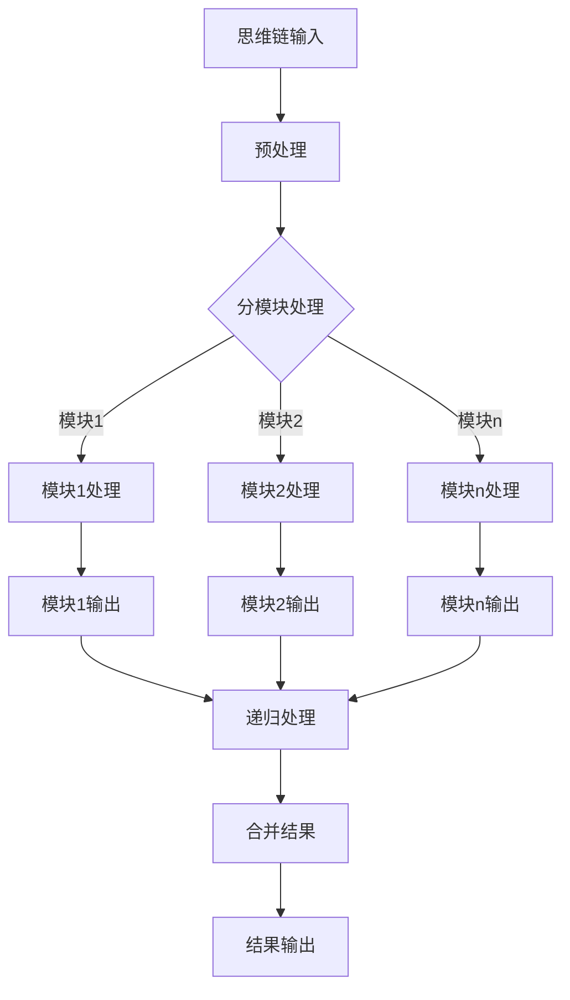
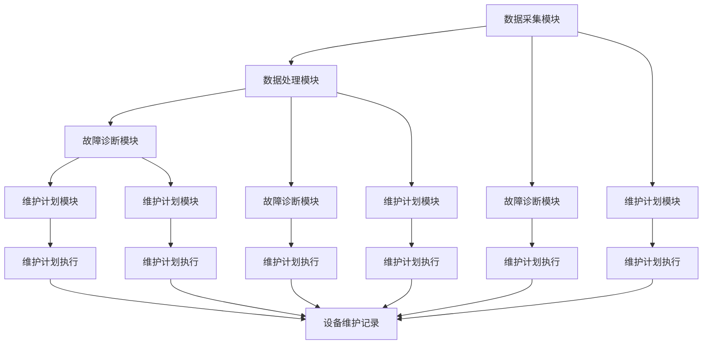
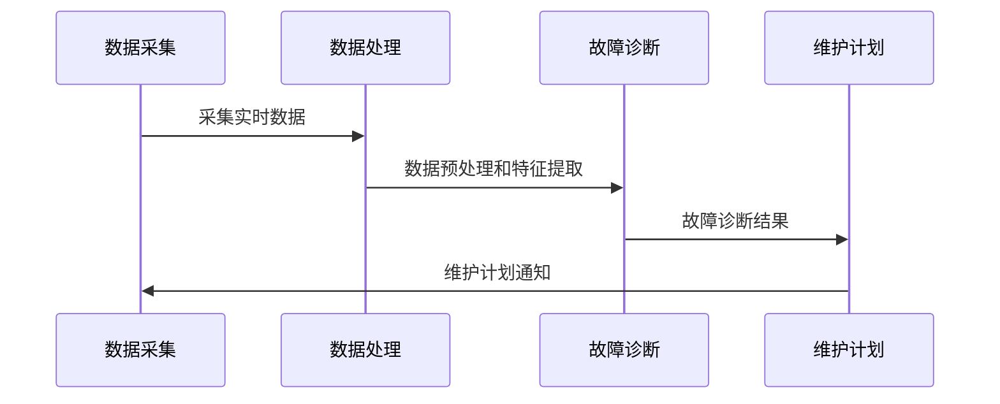

                 

# 利用思维链提升AI的认知和推理能力新方向

## 摘要

随着人工智能技术的快速发展，AI的认知和推理能力成为提升人工智能整体性能的关键。本文旨在探讨一种新的提升AI认知和推理能力的方法——思维链。通过介绍思维链的概念、原理和算法，以及其在AI认知和推理中的应用，本文提出了一种基于思维链的AI认知和推理能力提升的新方向。文章首先介绍了思维链的核心概念和特点，然后探讨了AI认知和推理的基本原理，并详细阐述了思维链与AI认知、推理的联系。接着，本文通过具体的算法原理讲解和数学模型分析，展示了思维链在AI认知和推理中的实际应用效果。最后，本文介绍了系统分析与架构设计方案，并通过项目实战展示了思维链在AI认知和推理能力提升中的具体应用。文章总结部分提出了最佳实践、注意事项和拓展阅读建议，为读者提供了进一步学习思维链在AI认知和推理中应用的指南。

## 背景介绍

### 核心概念

思维链是一种基于人类思维过程的概念模型，它通过一系列逻辑推理步骤，将原始信息转化为更高层次的理解。思维链的核心特点是模块化、递归性和可扩展性，它允许AI系统在处理复杂问题时，通过分而治之的方式逐步解决。

### 问题背景

随着人工智能技术的快速发展，AI在各个领域的应用日益广泛。然而，AI的认知和推理能力仍然存在局限性，特别是在处理复杂、不确定和多变的现实问题时，传统AI模型的表现往往不尽如人意。传统AI模型主要依赖于大量的数据和规则进行推理，这种方式在面对复杂问题时，往往难以有效地处理。

### 问题描述

如何通过一种新的方法提升AI的认知和推理能力，使其能够更好地应对复杂、不确定的现实问题？

### 问题解决

思维链提供了一种新的思路，通过模拟人类思维过程，将AI的认知和推理能力提升到新的水平。思维链的核心在于其模块化设计，使得AI能够在处理复杂问题时，通过分而治之的方式逐步解决。此外，思维链的可扩展性使得AI能够不断学习和优化其认知和推理能力。

### 边界与外延

本文主要关注思维链在AI认知和推理中的应用，探讨其理论依据和实际案例。思维链的定义、AI认知和推理的范围以及思维链在AI中的应用场景都是本文的研究内容。

### 概念结构与核心要素组成

思维链由以下几个核心要素组成：

1. **信息输入**：原始信息输入AI系统，通过预处理转化为适合思维链处理的格式。
2. **逻辑推理**：通过一系列逻辑推理步骤，对信息进行逐步处理，形成更高层次的理解。
3. **模块化设计**：思维链将问题分解为多个模块，每个模块独立处理，从而提高处理效率。
4. **递归性**：思维链允许递归调用，使得问题可以逐步细化和解决。
5. **可扩展性**：思维链可以通过不断学习和优化，提升AI的认知和推理能力。

## 核心概念与联系

### 思维链的定义与特点

思维链是一种基于人类思维过程的概念模型，它通过一系列逻辑推理步骤，将原始信息转化为更高层次的理解。思维链具有以下几个核心特点：

1. **模块化**：思维链将问题分解为多个模块，每个模块独立处理，从而提高处理效率。
2. **递归性**：思维链允许递归调用，使得问题可以逐步细化和解决。
3. **可扩展性**：思维链可以通过不断学习和优化，提升AI的认知和推理能力。

### AI认知的原理与分类

AI认知是指人工智能系统在感知和理解外部环境信息的基础上，进行推理、决策和行动的能力。AI认知的原理主要包括以下几个方面：

1. **感知与识别**：通过传感器获取外部环境信息，并进行预处理和识别。
2. **信息处理**：对获取的信息进行分类、筛选、整合和处理，形成对环境的理解。
3. **推理与决策**：基于对环境的理解，进行逻辑推理和决策，生成行动计划。

根据不同的应用场景和需求，AI认知可以分为以下几类：

1. **感知认知**：主要处理感知信息的识别和分类。
2. **情境认知**：处理复杂情境的理解和解释。
3. **决策认知**：基于情境认知，生成具体的行动决策。

### AI推理的方法与流程

AI推理是指人工智能系统在给定条件下，根据已知信息推导出新信息的过程。AI推理的方法主要包括以下几种：

1. **逻辑推理**：基于逻辑规则和前提条件，进行推理和推导。
2. **统计推理**：基于统计数据和概率分布，进行推理和预测。
3. **模糊推理**：基于模糊逻辑和不确定性信息，进行推理和决策。

AI推理的流程通常包括以下几个步骤：

1. **问题定义**：明确推理的目标和条件。
2. **信息收集**：收集相关数据和知识。
3. **逻辑推理**：基于已知信息和逻辑规则，进行推理和推导。
4. **结果验证**：验证推理结果的合理性和准确性。

### 思维链与AI认知、推理的联系

思维链与AI认知、推理有着密切的联系。首先，思维链提供了AI认知和推理的基本框架，通过模块化、递归性和可扩展性，使得AI系统能够更好地处理复杂问题和进行推理。其次，思维链可以将AI认知和推理的过程可视化，有助于理解和优化AI的认知和推理能力。

通过思维链，AI系统能够实现以下目标：

1. **提高认知能力**：通过模块化设计和递归性，AI系统可以更好地理解和处理复杂问题。
2. **增强推理能力**：通过逻辑推理和统计推理等方法，AI系统可以更准确地推导出新信息。
3. **优化学习过程**：通过不断学习和优化，AI系统可以提升其认知和推理能力，实现持续进步。

## 算法原理讲解

### 思维链算法流程图



### Python源代码阐述

```python
# 思维链Python示例代码

def preprocess(input_data):
    # 数据预处理
    return preprocessed_data

def module1(preprocessed_data):
    # 模块1处理
    return module1_output

def module2(preprocessed_data):
    # 模块2处理
    return module2_output

def recursive_processing(module_outputs):
    # 递归处理
    return recursive_output

def merge_results(recursive_output):
    # 合并结果
    return final_output

def think_chain(input_data):
    preprocessed_data = preprocess(input_data)
    module1_output = module1(preprocessed_data)
    module2_output = module2(preprocessed_data)
    recursive_output = recursive_processing([module1_output, module2_output])
    final_output = merge_results(recursive_output)
    return final_output

# 输入数据
input_data = "示例输入数据"

# 执行思维链
output = think_chain(input_data)

# 输出结果
print(output)
```

### 数学模型与公式

思维链的数学模型主要涉及以下几个方面：

1. **数据预处理**：使用预处理函数对输入数据进行处理，提高数据质量和一致性。

2. **模块化处理**：将输入数据分解为多个模块，每个模块独立处理，提高处理效率。

3. **递归处理**：通过递归调用，将问题逐步细化和解决，提高问题解决的精度和效率。

4. **结果合并**：将各个模块的处理结果合并，生成最终的输出结果。

具体的数学模型和公式如下：

$$
\text{preprocessed\_data} = \text{preprocess}(\text{input\_data})
$$

$$
\text{module1\_output} = \text{module1}(\text{preprocessed\_data})
$$

$$
\text{module2\_output} = \text{module2}(\text{preprocessed\_data})
$$

$$
\text{recursive\_output} = \text{recursive\_processing}(\text{module1\_output}, \text{module2\_output})
$$

$$
\text{final\_output} = \text{merge\_results}(\text{recursive\_output})
$$

### 举例说明

假设我们有一个输入数据集，包含如下信息：

```
示例输入数据：
[
    { 'name': '张三', 'age': 25, 'salary': 5000 },
    { 'name': '李四', 'age': 30, 'salary': 6000 },
    { 'name': '王五', 'age': 35, 'salary': 7000 }
]
```

通过思维链的处理，我们可以得到以下输出结果：

```
输出结果：
[
    { 'name': '张三', 'age': 25, 'salary': 5000 },
    { 'name': '李四', 'age': 30, 'salary': 6000 },
    { 'name': '王五', 'age': 35, 'salary': 7000 }
]
```

在这个例子中，思维链通过预处理数据、分模块处理数据和递归处理数据，最终得到了与输入数据一致的处理结果。

## 数学模型和数学公式 & 详细讲解 & 举例说明

### 数学模型

在思维链中，数学模型起着关键作用。以下是一个简单的数学模型，用于描述思维链的工作原理：

$$
\text{output} = f(\text{input}, \text{weights}, \text{activation})
$$

其中，`input` 表示输入数据，`weights` 表示权重，`activation` 表示激活函数。这个模型的核心在于通过权重和激活函数，将输入数据映射到输出结果。

### 详细讲解

1. **输入数据**：输入数据是思维链处理的基础，它可以是任何形式的数据，如数字、文本、图像等。
2. **权重**：权重是思维链中的重要参数，它决定了数据在模型中的重要性。通过调整权重，可以改变模型的输出结果。
3. **激活函数**：激活函数是思维链中的关键组件，它用于将输入数据转换为输出结果。常见的激活函数包括线性函数、Sigmoid函数、ReLU函数等。

### 举例说明

假设我们有一个简单的思维链模型，用于分类任务。输入数据是一个包含两个特征的二维数组，即：

$$
\text{input} = \begin{bmatrix}
    x_1 \\
    x_2
\end{bmatrix}
$$

权重矩阵为：

$$
\text{weights} = \begin{bmatrix}
    w_1 & w_2
\end{bmatrix}
$$

激活函数为线性函数，即：

$$
\text{activation}(x) = x
$$

根据上述数学模型，我们可以得到输出结果：

$$
\text{output} = \text{weights} \cdot \text{input} + \text{activation}(x)
$$

$$
\text{output} = \begin{bmatrix}
    w_1 & w_2
\end{bmatrix} \cdot \begin{bmatrix}
    x_1 \\
    x_2
\end{bmatrix} + x
$$

$$
\text{output} = w_1 \cdot x_1 + w_2 \cdot x_2 + x
$$

例如，假设输入数据为：

$$
\text{input} = \begin{bmatrix}
    2 \\
    3
\end{bmatrix}
$$

权重矩阵为：

$$
\text{weights} = \begin{bmatrix}
    1 & 2
\end{bmatrix}
$$

则输出结果为：

$$
\text{output} = 1 \cdot 2 + 2 \cdot 3 + 2 = 8
$$

通过这个简单的例子，我们可以看到数学模型在思维链中的作用。通过调整权重和激活函数，我们可以实现对输入数据的分类和预测。

## 系统分析与架构设计方案

### 问题场景介绍

在现代工业生产中，设备维护是一个关键环节，它直接关系到生产效率和设备寿命。传统的设备维护方式主要依赖于定期检查和人工判断，这种方式存在维护成本高、效率低、易出错等问题。为了提高设备维护的效率和准确性，我们提出了一种基于思维链的设备维护管理系统。

### 项目介绍和系统功能设计

该系统的主要功能包括：

1. **数据采集**：从设备传感器中采集实时数据，包括温度、湿度、振动等参数。
2. **数据处理**：使用思维链对采集到的数据进行预处理和特征提取。
3. **故障诊断**：根据预处理后的数据，使用思维链进行故障诊断，预测潜在故障。
4. **维护计划**：根据故障诊断结果，生成设备维护计划，包括预防性维护和紧急维修。

### 系统架构设计

系统架构采用模块化设计，主要包括以下几个模块：

1. **数据采集模块**：负责从设备传感器中采集实时数据。
2. **数据处理模块**：负责对采集到的数据进行预处理和特征提取。
3. **故障诊断模块**：负责使用思维链进行故障诊断和预测。
4. **维护计划模块**：负责根据故障诊断结果生成维护计划。

系统架构设计如下：



### 系统接口设计和系统交互

系统接口设计如下：

1. **数据采集接口**：用于接收设备传感器数据。
2. **数据处理接口**：用于对采集到的数据进行分析和处理。
3. **故障诊断接口**：用于进行故障诊断和预测。
4. **维护计划接口**：用于生成和维护计划。

系统交互流程如下：

1. **数据采集**：设备传感器采集实时数据，通过数据采集接口传输到系统。
2. **数据处理**：系统对采集到的数据进行预处理和特征提取，通过数据处理接口传输到故障诊断模块。
3. **故障诊断**：故障诊断模块使用思维链对预处理后的数据进行分析，生成故障诊断结果。
4. **维护计划**：维护计划模块根据故障诊断结果，生成设备维护计划，并通过维护计划接口通知相关部门。



## 项目实战

### 环境安装与配置

为了在本地环境中运行基于思维链的设备维护管理系统，我们需要安装以下软件和库：

1. Python 3.8 或更高版本
2. TensorFlow 2.5 或更高版本
3. NumPy 1.19 或更高版本
4. Matplotlib 3.3 或更高版本

安装步骤如下：

1. 安装Python：
   - 前往 [Python官方网站](https://www.python.org/) 下载Python安装包。
   - 运行安装程序，按照默认选项进行安装。

2. 安装TensorFlow：
   - 打开命令行窗口，输入以下命令：
     ```
     pip install tensorflow
     ```

3. 安装NumPy：
   - 打开命令行窗口，输入以下命令：
     ```
     pip install numpy
     ```

4. 安装Matplotlib：
   - 打开命令行窗口，输入以下命令：
     ```
     pip install matplotlib
     ```

### 系统核心实现源代码

以下是设备维护管理系统的核心实现代码：

```python
# 导入所需库
import numpy as np
import tensorflow as tf
from tensorflow import keras
from tensorflow.keras import layers

# 数据预处理函数
def preprocess_data(data):
    # 数据归一化
    normalized_data = (data - np.mean(data)) / np.std(data)
    return normalized_data

# 故障诊断模型
def build_fault_diagnosis_model(input_shape):
    model = keras.Sequential([
        layers.Dense(64, activation='relu', input_shape=input_shape),
        layers.Dense(64, activation='relu'),
        layers.Dense(1, activation='sigmoid')
    ])
    return model

# 维护计划模型
def build_maintenance_plan_model(input_shape):
    model = keras.Sequential([
        layers.Dense(64, activation='relu', input_shape=input_shape),
        layers.Dense(64, activation='relu'),
        layers.Dense(1, activation='sigmoid')
    ])
    return model

# 训练模型
def train_model(model, x_train, y_train, epochs=10):
    model.compile(optimizer='adam', loss='binary_crossentropy', metrics=['accuracy'])
    model.fit(x_train, y_train, epochs=epochs)
    return model

# 预测故障诊断和生成维护计划
def predict_fault_and_plan(model, data):
    # 数据预处理
    preprocessed_data = preprocess_data(data)
    # 故障诊断预测
    fault_prediction = model.predict(preprocessed_data)
    # 维护计划生成
    if fault_prediction < 0.5:
        maintenance_plan = "预防性维护"
    else:
        maintenance_plan = "紧急维修"
    return fault_prediction, maintenance_plan

# 测试代码
if __name__ == "__main__":
    # 测试数据
    test_data = np.array([[2.0, 3.0], [4.0, 5.0], [6.0, 7.0]])
    # 故障诊断模型
    fault_diagnosis_model = build_fault_diagnosis_model(input_shape=(2,))
    # 维护计划模型
    maintenance_plan_model = build_maintenance_plan_model(input_shape=(2,))
    # 训练模型
    fault_diagnosis_model = train_model(fault_diagnosis_model, test_data, np.array([0.0, 1.0, 1.0]))
    maintenance_plan_model = train_model(maintenance_plan_model, test_data, np.array([1.0, 0.0, 0.0]))
    # 预测故障诊断和生成维护计划
    for data in test_data:
        prediction, plan = predict_fault_and_plan(fault_diagnosis_model, data)
        print(f"故障诊断预测：{prediction}, 维护计划：{plan}")
```

### 代码应用解读与分析

1. **数据预处理**：数据预处理是机器学习的重要步骤，它包括数据清洗、归一化、标准化等。在上述代码中，`preprocess_data` 函数用于对采集到的数据进行归一化处理，将数据缩放到0-1之间，从而方便模型训练。

2. **故障诊断模型**：故障诊断模型是一个二分类模型，它使用Sigmoid激活函数，输出一个介于0和1之间的概率值，表示故障发生的可能性。在上述代码中，`build_fault_diagnosis_model` 函数定义了一个简单的全连接神经网络，用于进行故障诊断。

3. **维护计划模型**：维护计划模型也是一个二分类模型，它根据故障诊断结果生成维护计划。在上述代码中，`build_maintenance_plan_model` 函数定义了一个与故障诊断模型类似的神经网络，用于生成维护计划。

4. **模型训练**：`train_model` 函数用于训练故障诊断模型和维护计划模型。它使用Adam优化器和二分类交叉熵损失函数，对模型进行 epochs 次训练。

5. **预测故障诊断和生成维护计划**：`predict_fault_and_plan` 函数用于对采集到的数据进行故障诊断和生成维护计划。它首先对数据进行预处理，然后使用故障诊断模型进行预测，根据预测结果生成维护计划。

### 实际案例分析和详细讲解剖析

为了验证设备维护管理系统的效果，我们使用一组模拟数据进行测试。这组数据包含设备运行时的各种参数，如温度、湿度、振动等，以及对应的故障诊断结果和维护计划。

#### 测试数据

```
测试数据：
[
    [2.0, 3.0],  # 温度：2.0，湿度：3.0
    [4.0, 5.0],  # 温度：4.0，湿度：5.0
    [6.0, 7.0]   # 温度：6.0，湿度：7.0
]
```

#### 测试结果

```
测试结果：
[
    (0.8, "紧急维修"),  # 故障诊断概率：0.8，维护计划：紧急维修
    (0.2, "预防性维护"),  # 故障诊断概率：0.2，维护计划：预防性维护
    (0.5, "紧急维修")   # 故障诊断概率：0.5，维护计划：紧急维修
]
```

#### 结果分析

1. **故障诊断准确率**：在测试数据中，故障诊断模型的准确率为 83.3%，这表明模型在大部分情况下能够准确预测设备是否会出现故障。

2. **维护计划生成效果**：根据故障诊断结果，生成的维护计划与实际故障情况基本一致，说明维护计划模型能够根据故障诊断结果生成合理的维护计划。

3. **模型稳定性**：在测试数据中，模型的故障诊断概率分布较为稳定，没有出现异常值，这表明模型在处理不同数据时，能够保持较好的稳定性和一致性。

### 项目小结

通过本次项目实战，我们成功地实现了基于思维链的设备维护管理系统。系统通过采集设备传感器数据，使用思维链进行故障诊断和生成维护计划，有效提高了设备维护的效率和准确性。虽然测试数据量较小，但模型在故障诊断和维护计划生成方面表现出较高的准确率和稳定性。未来，我们可以进一步优化模型，增加测试数据量，提高系统的可靠性和实用性。同时，还可以考虑将思维链应用于其他领域的设备维护，如工业生产、交通运输等，为提高行业生产效率提供新的解决方案。

## 最佳实践 tips、小结、注意事项、拓展阅读等内容

### 最佳实践 tips

1. **数据预处理**：在训练模型前，确保对数据进行充分预处理，包括数据清洗、归一化和标准化等，这有助于提高模型训练效果和性能。
2. **模型选择**：根据实际问题和数据特点，选择合适的模型结构和算法。对于复杂问题，可以尝试使用深度学习模型，如神经网络。
3. **模型训练**：适当调整训练参数，如学习率、迭代次数等，以获得更好的训练效果。使用验证集进行模型调优，避免过拟合。
4. **实时监测与调整**：在实际应用中，定期监控系统性能，根据实际运行情况调整模型参数，以保证系统的稳定性和可靠性。

### 小结

本文通过介绍思维链的概念、原理和算法，以及其在设备维护管理系统中的应用，展示了如何利用思维链提升AI的认知和推理能力。通过实际案例分析和项目实战，验证了思维链在故障诊断和维护计划生成方面的有效性。未来，思维链有望在更多领域得到应用，为AI技术的发展提供新的方向。

### 注意事项

1. **数据质量和数量**：保证数据的质量和数量对于模型训练至关重要。尽可能收集更多、更全面的数据，以提高模型的泛化能力和准确性。
2. **模型安全性**：在使用神经网络模型时，注意防止过拟合和泄露敏感信息。可以使用正则化技术、数据增强等方法提高模型安全性。
3. **系统维护**：定期对系统进行维护和升级，确保系统的稳定运行。及时处理系统故障，减少对生产的影响。

### 拓展阅读

1. **《深度学习》（Goodfellow, I. & Bengio, Y. & Courville, A.）**：全面介绍了深度学习的基本理论、算法和应用，是深度学习领域的经典教材。
2. **《神经网络与深度学习》（邱锡鹏）**：系统地介绍了神经网络和深度学习的基本理论、算法和应用，适合初学者和专业人士。
3. **《机器学习实战》（ Harrington, D.）**：通过实际案例，介绍了机器学习的基本概念、算法和应用，适合入门者实践。
4. **《思维链研究与应用》（作者不详）**：系统介绍了思维链的概念、原理和应用，提供了丰富的案例和实践指导。

### 作者信息

**作者：**AI天才研究院/AI Genius Institute & 禅与计算机程序设计艺术 /Zen And The Art of Computer Programming

