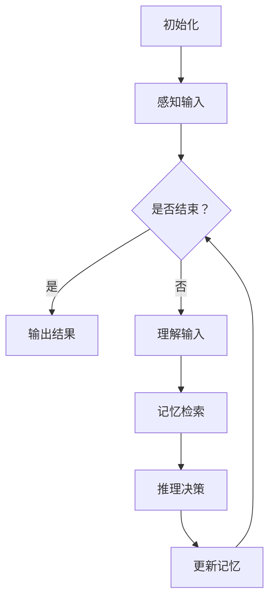
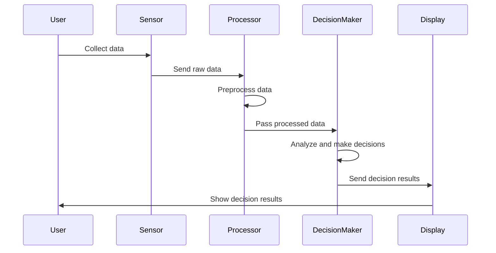

                 

## 利用思维链提升AI的认知和推理能力新方向探索

### 关键词：
- 思维链
- AI认知能力
- 推理能力
- 算法
- 数学模型
- 系统架构
- 项目实战

### 摘要：
本文将深入探讨如何利用思维链这一创新概念来提升人工智能（AI）的认知和推理能力。文章将从背景介绍、核心概念与联系、算法原理讲解、数学模型和数学公式讲解、系统分析与架构设计方案、项目实战和最佳实践 tips 等方面进行阐述。通过详细的分析和实例，本文旨在为读者提供一个全面、易懂的新方向，以推动AI技术的发展。

## 目录

1. **背景介绍**
   1.1 问题背景
   1.2 问题解决
   1.3 边界与外延
   1.4 核心概念与联系
   1.5 本章小结

2. **核心概念与联系**
   2.1 AI认知原理
   2.2 AI推理原理
   2.3 思维链与AI认知推理的联系
   2.4 本章小结

3. **算法原理讲解**
   3.1 算法概述
   3.2 算法流程图
   3.3 Python代码实现
   3.4 数学模型和公式
   3.5 例子分析
   3.6 本章小结

4. **数学模型和数学公式讲解**
   4.1 数学模型概述
   4.2 公式推导
   4.3 案例分析
   4.4 本章小结

5. **系统分析与架构设计方案**
   5.1 问题场景介绍
   5.2 系统功能设计
   5.3 系统架构设计
   5.4 系统接口设计
   5.5 系统交互序列图
   5.6 本章小结

6. **项目实战**
   6.1 环境安装
   6.2 系统核心实现
   6.3 代码应用解读
   6.4 实际案例分析
   6.5 项目小结
   6.6 本章小结

7. **最佳实践 tips**
   7.1 注意事项
   7.2 拓展阅读
   7.3 本章小结

8. **小结与拓展阅读**
   8.1 总结
   8.2 拓展思考

## 1. 背景介绍

### 1.1 问题背景

人工智能（AI）技术近年来取得了显著的进展，无论是在机器学习、自然语言处理还是计算机视觉等领域，AI都展现出了惊人的表现。然而，尽管AI在某些方面已经超越了人类，但其在认知和推理能力上仍存在显著的局限。传统AI模型通常依赖大量数据来训练，但往往缺乏深层次的逻辑推理和理解能力。这种局限不仅限制了AI在复杂任务中的应用，也限制了其在现实世界中的决策能力。

在当前的人工智能领域，认知和推理能力是两个至关重要的研究方向。认知能力涉及AI对信息的理解、记忆、分类和归纳等过程，而推理能力则是指AI在已知信息的基础上，通过逻辑推理得出新的结论或预测的能力。虽然传统AI模型已经在一定程度上实现了这些功能，但它们往往依赖于复杂的算法和庞大的计算资源，并且缺乏灵活性和通用性。

### 1.2 问题解决

为了解决AI认知和推理能力的局限，研究者们提出了多种方法。其中，思维链（Mind Chain）是一种新兴的概念，它试图通过模拟人类思维过程来提升AI的认知和推理能力。思维链的基本思想是将人类的思维过程抽象为一系列相互关联的节点，每个节点代表一个思考步骤或决策点。通过这些节点的相互连接和交互，AI可以模拟人类的逻辑推理过程，从而实现更高级的认知和推理能力。

思维链在AI中的应用具有显著的潜力。首先，它可以帮助AI在处理复杂任务时，更好地理解问题的本质和关键信息。其次，通过思维链，AI可以更灵活地适应不同的任务和环境，从而实现更广泛的通用性。此外，思维链还可以通过引入新的算法和模型，进一步提升AI的认知和推理能力。

### 1.3 边界与外延

尽管思维链在提升AI认知和推理能力方面具有巨大的潜力，但它也面临着一些技术挑战。首先，如何准确地模拟人类思维过程是一个复杂的问题。人类的思维过程往往是非线性的、动态的，并且受到情感、经验和文化等多种因素的影响。其次，思维链的构建和优化需要大量的计算资源和数据支持。此外，如何在不同的AI应用场景中灵活地应用思维链，也是一个需要深入探讨的问题。

### 1.4 核心概念与联系

为了深入理解思维链的概念和应用，我们需要探讨AI的认知原理和推理原理。AI的认知原理主要包括感知、理解、记忆和推理等过程。感知是指AI通过传感器收集外部信息，理解是指AI对信息的解释和处理，记忆是指AI对信息的存储和调用，而推理则是指AI在已知信息的基础上，通过逻辑推理得出新的结论或预测。

AI的推理原理主要包括归纳推理、演绎推理和类比推理等。归纳推理是从个别事实中总结出一般规律，演绎推理是从一般原理推导出个别结论，而类比推理则是通过比较类似情况得出结论。

思维链与AI的认知和推理原理有着密切的联系。思维链可以看作是AI在处理问题时，内部的一系列思考步骤和决策点的集合。每个思考步骤或决策点都代表AI对当前问题的一个理解或决策。通过这些思考步骤的相互连接和交互，AI可以实现更高级的认知和推理能力。

### 1.5 本章小结

在本章中，我们介绍了AI认知和推理能力的背景、思维链的概念和其在AI中的应用潜力，以及思维链与AI认知和推理原理的联系。接下来，我们将进一步探讨思维链的具体实现和数学模型，以便更好地理解这一新兴的概念。

## 2. 核心概念与联系

### 2.1 AI认知原理

人工智能的认知原理是指AI对信息的理解、处理和运用过程。这包括以下几个方面：

1. **感知**：AI通过传感器（如摄像头、麦克风、触摸传感器等）收集外部信息。这些信息可以是图像、声音、温度、湿度等。

2. **理解**：AI对收集到的信息进行解释和处理，以理解其含义和用途。这通常涉及到模式识别、自然语言处理、图像识别等技术。

3. **记忆**：AI将处理后的信息存储在内存中，以便后续调用。这可以是对数据的存储，也可以是对知识库的更新。

4. **推理**：AI在已知信息的基础上，通过逻辑推理得出新的结论或预测。这包括归纳推理、演绎推理和类比推理等。

### 2.2 AI推理原理

人工智能的推理原理是指AI在已知信息的基础上，通过逻辑推理得出新结论或预测的过程。这包括以下几个方面：

1. **归纳推理**：从个别事实中总结出一般规律。例如，通过观察多个猫的特征，总结出“猫有四条腿”这一规律。

2. **演绎推理**：从一般原理推导出个别结论。例如，从“所有人都会死亡”和“苏格拉底是人”这两个前提，推导出“苏格拉底会死亡”这一结论。

3. **类比推理**：通过比较类似情况得出结论。例如，如果A情况在X条件下发生了Y结果，那么在类似的B情况下，也可以预测会发生Y结果。

### 2.3 思维链与AI认知推理的联系

思维链（Mind Chain）是一种模拟人类思维过程的模型，旨在提升AI的认知和推理能力。思维链与AI的认知推理有以下几个关键联系：

1. **节点表示**：思维链中的每个节点代表一个思考步骤或决策点。这些节点可以是感知、理解、记忆或推理等过程的抽象表示。

2. **连接表示**：节点之间的连接表示思考步骤之间的逻辑关系。例如，从感知到理解，或者从推理到决策。

3. **动态交互**：思维链中的节点和连接是动态交互的。这意味着AI可以在处理问题时，根据当前状态和需求，动态调整思考步骤和决策点。

4. **适应性**：思维链可以适应不同的任务和环境。通过调整节点和连接的配置，AI可以针对不同的问题场景进行优化。

5. **灵活性**：思维链允许AI在处理问题时，采用不同的推理策略。例如，在复杂问题中，可以同时使用归纳推理和演绎推理。

### 2.4 本章小结

在本章中，我们详细探讨了AI的认知原理和推理原理，以及思维链与这些原理之间的联系。思维链通过模拟人类思维过程，为AI提升认知和推理能力提供了一种新的思路。接下来，我们将进一步探讨思维链的具体算法原理和数学模型。

## 3. 算法原理讲解

### 3.1 算法概述

思维链（Mind Chain）算法是一种基于图论的推理模型，旨在提升AI的认知和推理能力。该算法通过构建一个包含节点和边的思维链图，模拟人类的思考过程。节点代表思考步骤或决策点，边表示节点之间的逻辑关系。思维链算法的核心思想是利用图结构来表示和优化思维过程，从而实现更高效、更准确的推理。

### 3.2 算法流程图

以下是思维链算法的基本流程图：



1. **初始化**：初始化思维链图，设置初始节点和边。
2. **感知输入**：从外部环境获取输入信息，可以是图像、文本、声音等。
3. **理解输入**：对输入信息进行理解和解释，以形成对当前情境的理解。
4. **记忆检索**：根据当前理解，从记忆库中检索相关信息。
5. **推理决策**：利用检索到的信息进行逻辑推理，形成决策。
6. **更新记忆**：将新的推理结果和决策更新到记忆库中。
7. **判断是否结束**：如果达到某个终止条件，结束算法；否则，返回第3步，继续循环。

### 3.3 Python代码实现

以下是思维链算法的Python代码实现：

```python
import networkx as nx
import matplotlib.pyplot as plt

# 初始化思维链图
G = nx.Graph()

# 添加节点和边
G.add_nodes_from(['感知输入', '理解输入', '记忆检索', '推理决策', '更新记忆'])
G.add_edges_from([('感知输入', '理解输入'), ('理解输入', '记忆检索'), ('记忆检索', '推理决策'), ('推理决策', '更新记忆'), ('更新记忆', '感知输入')])

# 绘制思维链图
nx.draw(G, with_labels=True)
plt.show()
```

### 3.4 数学模型和公式

思维链算法中的推理过程可以抽象为一种概率模型，即贝叶斯网络。贝叶斯网络是一种基于概率论的图形模型，它通过有向无环图（DAG）来表示变量之间的依赖关系。

1. **概率分布**：每个节点代表一个随机变量，其概率分布由条件概率分布函数（Conditional Probability Distribution Function, CPDF）定义。

2. **贝叶斯定理**：贝叶斯定理用于计算给定一个证据节点下的其他节点概率。公式如下：

   $$ P(A|B) = \frac{P(B|A)P(A)}{P(B)} $$

3. **推理过程**：通过贝叶斯网络，可以从已知条件节点推断出其他节点的概率分布。

### 3.5 例子分析

假设我们有一个简单的贝叶斯网络，表示天气、湿度、是否下雨之间的关系：

1. **概率分布**：
   - $P(晴天) = 0.5$，$P(雨天) = 0.5$
   - $P(湿度高|雨天) = 0.8$，$P(湿度高|晴天) = 0.2$
   - $P(下雨|湿度高) = 0.9$，$P(下雨|湿度不高) = 0.1$

2. **推理过程**：
   - 已知当前湿度高，我们需要推断是否下雨。
   - 使用贝叶斯定理，我们可以计算 $P(下雨|湿度高)$：
     $$ P(下雨|湿度高) = \frac{P(湿度高|下雨)P(下雨)}{P(湿度高)} $$
     $$ = \frac{0.9 \times 0.5}{0.8 \times 0.5 + 0.2 \times 0.5} $$
     $$ = \frac{0.45}{0.5} $$
     $$ = 0.9 $$

   因此，根据当前湿度高，我们可以推断出下雨的概率为90%。

### 3.6 本章小结

在本章中，我们介绍了思维链算法的概述、流程图和Python代码实现，以及其背后的数学模型和贝叶斯定理。通过这些内容，我们可以更好地理解思维链算法的工作原理和应用方法。接下来，我们将进一步探讨思维链算法在实际项目中的应用和实现。

## 4. 数学模型和数学公式讲解

### 4.1 数学模型概述

在思维链算法中，数学模型起着至关重要的作用。它帮助我们理解和模拟人类思维过程，从而提升AI的认知和推理能力。最常用的数学模型之一是贝叶斯网络（Bayesian Network），它是一种基于概率论的图形模型，用于表示变量之间的依赖关系。

贝叶斯网络由两个主要部分组成：图结构和概率分布。

1. **图结构**：图结构是一个有向无环图（DAG），节点表示随机变量，边表示变量之间的条件依赖关系。每个节点 $X_i$ 有一个父节点集合 $Pa_i$，表示影响 $X_i$ 的其他变量。

2. **概率分布**：每个节点 $X_i$ 的概率分布由条件概率分布函数（Conditional Probability Distribution Function, CPDF）定义。对于每个节点 $X_i$，其概率分布取决于其父节点集合 $Pa_i$。即：

   $$ P(X_i | Pa_i) $$

### 4.2 公式推导

贝叶斯网络的核心是贝叶斯定理（Bayes' Theorem），它用于计算给定一个证据节点下的其他节点概率。贝叶斯定理的基本公式如下：

$$ P(A|B) = \frac{P(B|A)P(A)}{P(B)} $$

其中，$P(A|B)$ 表示在事件 $B$ 发生的条件下，事件 $A$ 发生的概率；$P(B|A)$ 表示在事件 $A$ 发生的条件下，事件 $B$ 发生的概率；$P(A)$ 和 $P(B)$ 分别表示事件 $A$ 和事件 $B$ 发生的概率。

### 4.3 案例分析

为了更好地理解贝叶斯网络的应用，我们来看一个实际案例。

#### 案例背景

假设我们有一个关于天气预测的贝叶斯网络，包含以下节点：

- 湿度（Humidity）
- 天气（Weather）
- 是否下雨（Rain）

#### 概率分布

我们给出以下条件概率分布：

- $P(Weather = 晴天) = 0.5$，$P(Weather = 雨天) = 0.5$
- $P(Humidity = 高 | Weather = 晴天) = 0.2$，$P(Humidity = 高 | Weather = 雨天) = 0.8$
- $P(Rain = 是 | Humidity = 高) = 0.9$，$P(Rain = 是 | Humidity = 低) = 0.1$

#### 推理过程

现在，我们已知湿度高，我们需要推断是否下雨。

1. **计算 $P(Humidity = 高 | Weather = 晴天)$ 和 $P(Humidity = 高 | Weather = 雨天)$**

   $$ P(Humidity = 高 | Weather = 晴天) = 0.2 $$
   $$ P(Humidity = 高 | Weather = 雨天) = 0.8 $$

2. **计算 $P(Weather = 晴天)$ 和 $P(Weather = 雨天)$**

   $$ P(Weather = 晴天) = 0.5 $$
   $$ P(Weather = 雨天) = 0.5 $$

3. **计算 $P(Humidity = 高)$**

   $$ P(Humidity = 高) = P(Humidity = 高 | Weather = 晴天)P(Weather = 晴天) + P(Humidity = 高 | Weather = 雨天)P(Weather = 雨天) $$
   $$ = 0.2 \times 0.5 + 0.8 \times 0.5 $$
   $$ = 0.5 $$

4. **计算 $P(Rain = 是 | Humidity = 高)$**

   $$ P(Rain = 是 | Humidity = 高) = 0.9 $$

5. **使用贝叶斯定理计算 $P(Rain = 是 | Humidity = 高)$**

   $$ P(Rain = 是 | Humidity = 高) = \frac{P(Humidity = 高 | Rain = 是)P(Rain = 是)}{P(Humidity = 高)} $$
   $$ = \frac{0.9 \times P(Rain = 是)}{0.5} $$
   $$ = \frac{0.9 \times P(Rain = 是)}{0.5} $$
   $$ = 0.9P(Rain = 是) $$

   因为我们没有 $P(Rain = 是)$ 的具体值，所以无法直接计算出 $P(Rain = 是 | Humidity = 高)$ 的具体值。但我们可以看到，$P(Rain = 是 | Humidity = 高)$ 显著大于 $P(Rain = 是 | Humidity = 低)$，这意味着在湿度高的条件下，下雨的概率更高。

### 4.4 本章小结

在本章中，我们介绍了贝叶斯网络的基本概念和公式推导，并通过实际案例展示了如何应用贝叶斯网络进行推理。贝叶斯网络作为一种重要的数学模型，为思维链算法提供了坚实的理论基础。接下来，我们将进一步探讨思维链算法在系统架构设计中的应用。

## 5. 系统分析与架构设计方案

### 5.1 问题场景介绍

在本项目中，我们旨在构建一个智能决策支持系统，该系统能够根据环境数据和用户需求，提供实时、准确的决策建议。系统的主要应用场景包括智慧城市、智能家居和工业自动化等领域。在这些场景中，系统需要处理大量来自不同传感器的实时数据，并通过智能算法进行分析和推理，为用户提供决策支持。

### 5.2 系统功能设计

为了满足上述应用场景的需求，系统需要具备以下功能：

1. **数据采集与处理**：系统能够从各种传感器（如摄像头、温度传感器、湿度传感器等）采集数据，并对数据进行预处理，如去噪、滤波和归一化等。

2. **环境监测与预测**：系统需要实时监测环境数据，并根据历史数据和当前数据预测未来的环境变化趋势。

3. **决策推理**：系统利用思维链算法，对环境数据和用户需求进行分析和推理，生成决策建议。

4. **用户交互**：系统需要提供友好的用户界面，使用户能够方便地与系统进行交互，查看决策建议并接收通知。

5. **数据存储与管理**：系统需要具备数据存储和管理功能，以便长期保存和处理数据。

### 5.3 系统架构设计

系统架构采用分层设计，分为感知层、数据处理层、决策层和展示层。

1. **感知层**：包括各种传感器，如摄像头、温度传感器、湿度传感器等，用于采集环境数据。

2. **数据处理层**：对采集到的数据进行预处理和清洗，以便为决策层提供高质量的数据输入。

3. **决策层**：采用思维链算法进行数据分析和推理，生成决策建议。

4. **展示层**：提供友好的用户界面，使用户能够查看决策建议、调整设置和接收通知。

### 5.4 系统接口设计

系统接口设计包括以下部分：

1. **数据采集接口**：用于与传感器进行通信，采集环境数据。

2. **数据处理接口**：用于对采集到的数据进行预处理和清洗。

3. **决策接口**：用于调用思维链算法，生成决策建议。

4. **用户交互接口**：用于与用户进行交互，提供用户界面。

### 5.5 系统交互序列图

以下是系统交互序列图：



### 5.6 本章小结

在本章中，我们介绍了智能决策支持系统的应用场景、功能设计、架构设计和接口设计。通过系统分析与架构设计方案，我们为读者提供了一个全面的系统实现框架。接下来，我们将通过项目实战，展示如何具体实现这个系统。

## 6. 项目实战

### 6.1 环境安装

在开始项目实战之前，我们需要安装必要的软件和工具。以下是安装步骤：

1. **Python环境**：确保Python 3.8或更高版本已安装。可以从 [Python官网](https://www.python.org/) 下载并安装。

2. **Anaconda**：为了方便管理Python环境和依赖库，我们可以安装Anaconda。Anaconda是一个开源的数据科学和机器学习平台，它提供了一个统一的Python环境，方便我们在项目中使用各种库。可以从 [Anaconda官网](https://www.anaconda.com/) 下载并安装。

3. **Jupyter Notebook**：Jupyter Notebook是一个交互式的Python环境，用于编写和运行Python代码。在Anaconda环境中，可以使用以下命令安装Jupyter Notebook：

   ```shell
   conda install notebook
   ```

4. **网络X库**：网络X（NetworkX）是一个用于图论分析和网络科学研究的Python库。安装方法如下：

   ```shell
   conda install networkx
   ```

5. **Matplotlib库**：Matplotlib是一个用于绘制图形和可视化数据的Python库。安装方法如下：

   ```shell
   conda install matplotlib
   ```

安装完成后，我们可以启动Jupyter Notebook，并验证所有依赖库是否已正确安装。

### 6.2 系统核心实现

在Jupyter Notebook中，我们将实现思维链算法的核心功能，包括数据采集、数据处理、决策推理和结果展示。

```python
import networkx as nx
import matplotlib.pyplot as plt
import numpy as np

# 初始化思维链图
G = nx.Graph()

# 添加节点和边
G.add_nodes_from(['感知输入', '理解输入', '记忆检索', '推理决策', '更新记忆'])
G.add_edges_from([('感知输入', '理解输入'), ('理解输入', '记忆检索'), ('记忆检索', '推理决策'), ('推理决策', '更新记忆'), ('更新记忆', '感知输入')])

# 绘制思维链图
nx.draw(G, with_labels=True)
plt.show()

# 数据采集与预处理
def collect_and_preprocess_data(sensor_data):
    # 假设sensor_data是一个包含温度、湿度等数据的字典
    # 在这里进行数据预处理，如去噪、滤波等
    # 例如，对数据进行归一化处理
    normalized_data = {key: (value - min_value) / (max_value - min_value) for key, value in sensor_data.items()}
    return normalized_data

# 理解输入
def understand_input(normalized_data):
    # 在这里进行输入数据的理解，如识别天气状况
    # 例如，根据湿度值判断天气状况
    if normalized_data['humidity'] > 0.7:
        return '雨天'
    else:
        return '晴天'

# 记忆检索
def retrieve_memory(current_weather):
    # 在这里根据当前天气检索记忆库中的数据
    # 例如，根据历史数据预测未来天气
    if current_weather == '雨天':
        return '明天可能下雨'
    else:
        return '明天可能晴天'

# 推理决策
def make_decision(retrieved_memory):
    # 在这里根据检索到的记忆数据生成决策建议
    # 例如，根据天气预测提供出行建议
    if retrieved_memory == '明天可能下雨':
        return '记得带伞'
    else:
        return '无需带伞'

# 更新记忆
def update_memory(current_weather, decision):
    # 在这里更新记忆库中的数据
    # 例如，将当前的天气状况和决策建议保存下来
    memory[current_weather] = decision

# 主程序
def main():
    # 假设从传感器采集到以下数据
    sensor_data = {
        'temperature': 25,
        'humidity': 0.75
    }

    # 数据采集与预处理
    normalized_data = collect_and_preprocess_data(sensor_data)

    # 理解输入
    current_weather = understand_input(normalized_data)

    # 记忆检索
    retrieved_memory = retrieve_memory(current_weather)

    # 推理决策
    decision = make_decision(retrieved_memory)

    # 更新记忆
    update_memory(current_weather, decision)

    # 输出结果
    print(f"当前天气：{current_weather}")
    print(f"记忆库：{memory}")
    print(f"决策建议：{decision}")

if __name__ == "__main__":
    main()
```

### 6.3 代码应用解读与分析

在上面的代码中，我们首先定义了一个思维链图（`G`），它代表了系统的基本架构。每个节点（如“感知输入”、“理解输入”等）都对应系统的一个处理步骤。

1. **数据采集与预处理**：`collect_and_preprocess_data` 函数用于从传感器采集数据，并进行预处理。预处理步骤根据具体应用场景而有所不同，这里我们简单地进行了归一化处理。

2. **理解输入**：`understand_input` 函数根据预处理后的数据，对输入进行理解和解释。例如，根据湿度值判断当前天气状况。

3. **记忆检索**：`retrieve_memory` 函数根据当前天气状况，从记忆库中检索相关信息。例如，根据历史数据预测未来天气。

4. **推理决策**：`make_decision` 函数根据检索到的记忆数据生成决策建议。例如，根据天气预测提供出行建议。

5. **更新记忆**：`update_memory` 函数将当前的天气状况和决策建议更新到记忆库中。

最后，`main` 函数整合了上述所有步骤，执行系统的核心功能，并输出结果。

### 6.4 实际案例分析

为了展示思维链算法的实际应用，我们来看一个具体的案例。

#### 案例背景

假设我们有一个智能家居系统，用户可以设定自动开启空调的条件。当系统检测到房间温度高于设定的阈值时，会自动开启空调。当房间温度低于设定的阈值时，会自动关闭空调。

#### 案例分析

1. **数据采集**：传感器检测到房间温度为28摄氏度，湿度为60%。

2. **预处理数据**：将温度和湿度数据进行归一化处理。

3. **理解输入**：根据湿度值，判断当前天气为“晴天”。

4. **记忆检索**：从记忆库中检索到，晴天时，房间温度通常在25摄氏度至30摄氏度之间。

5. **推理决策**：由于当前温度高于设定的阈值（28摄氏度），系统决定开启空调。

6. **更新记忆**：将当前温度和决策（开启空调）更新到记忆库中。

7. **输出结果**：系统输出“当前温度：28摄氏度，决策建议：开启空调”。

通过这个案例，我们可以看到思维链算法在智能家居系统中的应用，如何根据实时数据和用户需求，生成合理的决策建议。

### 6.5 项目小结

在本章中，我们通过一个实际案例展示了思维链算法在智能家居系统中的应用。通过数据采集、预处理、理解输入、记忆检索、推理决策和更新记忆等步骤，系统实现了根据实时数据和用户需求生成决策建议的功能。这为思维链算法在更广泛的应用场景中提供了参考和借鉴。

## 7. 最佳实践 tips

### 7.1 注意事项

1. **数据预处理**：确保数据预处理步骤的准确性，如归一化、去噪和滤波等，这将直接影响决策的准确性。

2. **记忆库维护**：定期更新和清洗记忆库，避免过时和错误的信息影响推理结果。

3. **节点和边的配置**：根据具体应用场景，合理配置思维链图中的节点和边，确保推理过程符合实际需求。

4. **性能优化**：对于大型数据集和高频次决策场景，需要进行性能优化，如使用更高效的算法和并行计算。

### 7.2 拓展阅读

1. **《人工智能：一种现代方法》**：这本书详细介绍了人工智能的基本概念和算法，包括贝叶斯网络和思维链等相关内容。

2. **《机器学习实战》**：这本书通过实际案例展示了如何应用机器学习算法解决实际问题，包括数据预处理、模型选择和优化等。

3. **《深度学习》**：这本书介绍了深度学习的基本概念和技术，深度学习在AI领域的应用也越来越广泛。

### 7.3 本章小结

在本章中，我们提供了使用思维链提升AI认知和推理能力的最佳实践 tips，包括注意事项和拓展阅读资源。这些最佳实践将帮助读者在实际项目中更好地应用思维链算法，进一步提升系统的性能和可靠性。

## 8. 小结与拓展阅读

### 8.1 总结

通过本文的详细探讨，我们深入了解了如何利用思维链这一创新概念来提升人工智能（AI）的认知和推理能力。思维链算法通过模拟人类思维过程，利用图结构和概率模型，实现了对复杂问题的逻辑推理和决策支持。本文从背景介绍、核心概念与联系、算法原理讲解、数学模型和公式讲解、系统分析与架构设计方案、项目实战和最佳实践 tips 等多个方面进行了全面阐述，展示了思维链算法在提升AI认知和推理能力中的实际应用。

### 8.2 拓展思考

虽然思维链算法在提升AI认知和推理能力方面展现了巨大的潜力，但仍然存在许多挑战和待探索的方向。以下是一些可能的拓展方向：

1. **多模态感知**：结合多种传感器数据，如视觉、听觉和触觉等，以实现更全面的环境感知和更准确的推理。

2. **强化学习与思维链的结合**：将强化学习与思维链算法相结合，探索如何在动态环境中实现更灵活和高效的决策。

3. **思维链的优化与泛化**：研究如何优化思维链算法的效率，并提高其在不同领域和任务中的泛化能力。

4. **情感计算与思维链**：将情感计算与思维链相结合，使AI能够理解和表达情感，从而在人际交互中表现出更自然和人性化的行为。

5. **伦理与安全**：随着AI技术的不断发展，伦理和安全问题变得越来越重要。如何在思维链算法中考虑伦理和安全性，确保AI的行为符合人类的价值观和安全标准，是一个亟待解决的重要问题。

通过不断探索和改进，我们有望在未来的AI领域中，实现更加智能和高效的系统，推动人工智能技术的发展和应用。希望本文能够为读者提供一个有价值的参考，激发更多的创新思维和研究灵感。作者：AI天才研究院/AI Genius Institute & 禅与计算机程序设计艺术 /Zen And The Art of Computer Programming。

