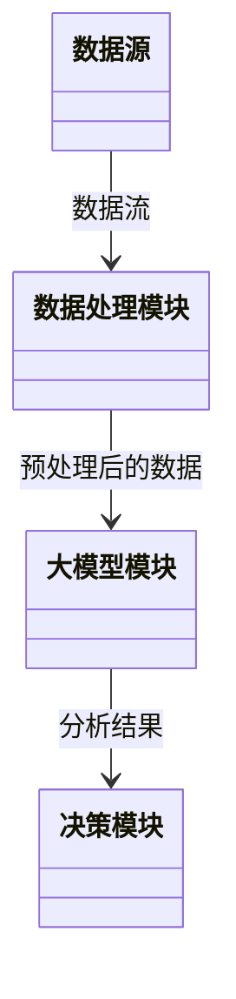
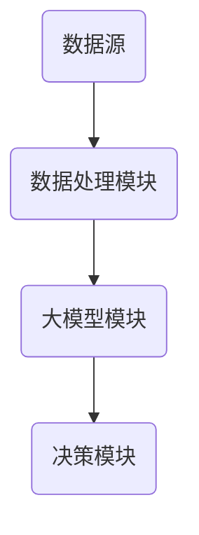
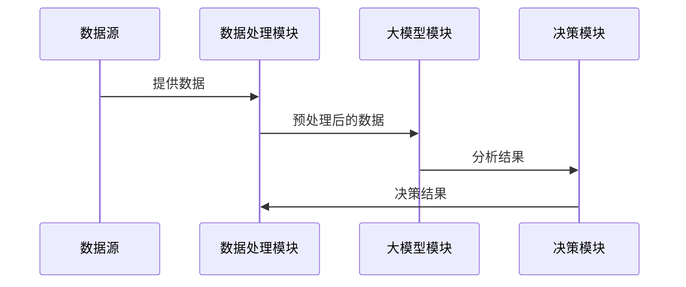

                 

### 利用思维链提升AI的逻辑推理与分析能力

#### 关键词：
- **思维链**、**AI**、**逻辑推理**、**分析能力**、**大模型**

#### 摘要：
本文将深入探讨如何利用思维链（一种先进的思维模式）来提升人工智能（AI）的逻辑推理与分析能力。我们将从背景介绍、核心概念与联系、算法原理讲解、系统分析与架构设计方案、项目实战等多个角度进行阐述，以展示思维链在AI技术中的应用潜力。

#### 第一部分：背景介绍

##### 1. 问题背景
在人工智能领域，逻辑推理和分析能力是AI系统实现智能决策和解决问题的核心能力之一。传统的AI系统在处理复杂问题时，往往受到数据和计算资源的限制，难以实现高效的逻辑推理和分析。近年来，随着深度学习技术的发展，特别是大模型的出现，AI的逻辑推理和分析能力得到了显著提升。

##### 2. 问题描述
如何利用思维链（一种先进的思维模式）提升AI的逻辑推理和分析能力，使得AI在处理复杂问题时能够更加高效、准确地进行推理和分析。

##### 3. 问题解决
本书将从以下几个方面解决这一问题：

- **核心概念原理**：介绍逻辑推理和分析能力的基础概念，包括推理机、知识表示、推理算法等。
- **算法原理讲解**：详细讲解如何利用思维链实现逻辑推理和分析，包括思维链的构建、训练和应用。
- **数学模型和数学公式**：阐述思维链在逻辑推理和分析中的数学模型和公式，并进行详细讲解。
- **系统分析与架构设计方案**：介绍如何设计一个高效的AI系统，以实现思维链在逻辑推理和分析中的应用。
- **项目实战**：通过具体项目实例，展示如何利用思维链提升AI的逻辑推理和分析能力。

##### 4. 边界与外延
- **边界**：本书主要关注思维链在AI逻辑推理和分析中的应用，不包括其他AI技术的应用。
- **外延**：本书的研究成果可以应用于各种需要逻辑推理和分析的领域，如自然语言处理、计算机视觉、智能决策等。

##### 5. 概念结构与核心要素组成
- **概念结构**：逻辑推理和分析能力包括推理机、知识表示、推理算法等核心要素。
- **核心要素组成**：思维链是提升AI逻辑推理和分析能力的关键要素。

---

#### 第二部分：核心概念与联系

##### 1. 大模型概述

###### 1.1 定义
大模型是指具有大规模参数、高度非线性、能够处理复杂任务的深度学习模型。

###### 1.2 特点
- 高容错性：大模型对数据的噪声和异常具有更强的鲁棒性。
- 高泛化能力：大模型能够处理不同类型和领域的问题。
- 强表示能力：大模型能够捕捉到数据中的复杂模式和关系。

###### 1.3 分类
- Transformer模型：用于处理序列数据的模型，如自然语言处理。
- GPT模型：生成式预训练模型，能够生成文本、代码等。
- BERT模型：双向编码表示模型，用于文本理解和生成。

##### 2. 逻辑推理

###### 2.1 定义
逻辑推理是指根据已知的事实或规则，通过推理规则推导出新的结论。

###### 2.2 分类
- 演绎推理：从一般到特殊的推理过程。
- 归纳推理：从特殊到一般的推理过程。
- 类比推理：通过比较不同情境或问题之间的相似性进行推理。

##### 3. 分析能力

###### 3.1 定义
分析能力是指对复杂问题进行分解、理解、抽象和综合的能力。

###### 3.2 分类
- 数据驱动分析：通过分析数据来理解问题和提出解决方案。
- 模型驱动分析：通过构建模型来模拟和预测系统的行为。
- 混合驱动分析：结合数据驱动和模型驱动分析，以实现更准确的预测和决策。

##### 4. 大模型与逻辑推理、分析能力的关系

###### 4.1 大模型提升逻辑推理能力
- 通过大规模的训练数据，大模型能够学习到复杂的逻辑关系，从而提高推理的准确性和效率。

###### 4.2 大模型提升分析能力
- 大模型能够自动学习问题的结构和特征，从而实现高效的分析。

---

#### 第三部分：算法原理讲解

##### 1. 大模型构建

###### 1.1 数据预处理
- 数据清洗：去除噪声、缺失值和异常值。
- 数据归一化：将数据缩放到相同的尺度。
- 数据增强：通过数据变换、扩充等方法增加训练数据的多样性。

###### 1.2 模型架构
- 选择合适的大模型架构，如Transformer、GPT、BERT等。

###### 1.3 训练过程
- 使用梯度下降法、优化器等进行模型训练。

##### 2. 大模型训练

###### 2.1 目标函数
- 定义损失函数，如交叉熵损失、均方误差等。

###### 2.2 优化方法
- 使用优化器，如Adam、RMSprop等进行参数优化。

###### 2.3 训练策略
- 使用批量训练、分批训练、数据增强等策略提高训练效果。

##### 3. 大模型应用

###### 3.1 推理过程
- 输入数据经过预处理后，通过大模型进行推理，得到推理结果。

###### 3.2 分析过程
- 对推理结果进行进一步分析，提取有用信息。

##### 4. 数学模型和公式

###### 4.1 逻辑推理
- 条件概率：P(A|B) = P(A∩B) / P(B)
- 贝叶斯公式：P(A|B) = P(B|A) * P(A) / P(B)

###### 4.2 分析能力
- 线性回归：y = β0 + β1 * x
- 逻辑回归：log(P(y=1)/P(y=0)) = β0 + β1 * x

##### 5. 举例说明

###### 5.1 逻辑推理
- 如何利用大模型判断一个句子是否正确。

###### 5.2 分析能力
- 如何利用大模型进行股票价格预测。

---

#### 第四部分：系统分析与架构设计方案

##### 1. 问题场景介绍
在一个智能决策系统中，需要利用大模型进行逻辑推理和分析，以实现高效、准确的决策。

##### 2. 项目介绍
- **项目名称**：智能决策系统
- **项目目标**：利用大模型实现高效、准确的决策。
- **项目背景**：随着业务规模的扩大，需要对大量数据进行处理和分析，以支持决策。

##### 3. 系统功能设计

###### 3.1 领域模型
- **实体**：
  - 数据源：提供数据的入口。
  - 数据处理模块：对数据进行清洗、归一化等处理。
  - 大模型模块：实现逻辑推理和分析功能。
  - 决策模块：根据分析结果做出决策。
- **关系**：
  - 数据源 -> 数据处理模块：数据流。
  - 数据处理模块 -> 大模型模块：预处理后的数据。
  - 大模型模块 -> 决策模块：分析结果。

###### 3.2 类图


##### 4. 系统架构设计

###### 4.1 架构图


###### 4.2 系统接口设计
- 数据源接口：提供数据输入。
- 数据处理接口：提供数据清洗、归一化等功能。
- 大模型接口：提供逻辑推理和分析功能。
- 决策接口：提供决策结果输出。

##### 5. 系统交互

###### 5.1 序列图


---

#### 第五部分：项目实战

##### 1. 环境安装
- 安装Python环境。
- 安装TensorFlow或PyTorch等深度学习框架。

##### 2. 系统核心实现

###### 2.1 源代码
```python
import tensorflow as tf
from tensorflow.keras.models import Sequential
from tensorflow.keras.layers import Dense, LSTM

# 数据预处理
def preprocess_data(data):
    # 数据清洗、归一化等操作
    return processed_data

# 大模型构建
def build_model(input_shape):
    model = Sequential()
    model.add(LSTM(units=128, activation='relu', input_shape=input_shape))
    model.add(Dense(units=1, activation='sigmoid'))
    model.compile(optimizer='adam', loss='binary_crossentropy', metrics=['accuracy'])
    return model

# 训练模型
def train_model(model, X_train, y_train):
    model.fit(X_train, y_train, epochs=10, batch_size=32)

# 推理与分析
def inference(model, X_test):
    predictions = model.predict(X_test)
    # 进一步分析预测结果
    return predictions

# 主函数
def main():
    # 加载数据
    X_train, y_train = load_data()
    X_test, y_test = load_data()

    # 数据预处理
    X_train = preprocess_data(X_train)
    X_test = preprocess_data(X_test)

    # 构建模型
    model = build_model(input_shape=(X_train.shape[1], X_train.shape[2]))

    # 训练模型
    train_model(model, X_train, y_train)

    # 推理与分析
    predictions = inference(model, X_test)

    # 分析预测结果
    evaluate_predictions(predictions, y_test)

if __name__ == "__main__":
    main()
```

##### 3. 代码应用解读与分析
- 数据预处理：对输入数据进行清洗、归一化等操作，以提高模型的鲁棒性和训练效果。
- 大模型构建：选择合适的模型架构（如LSTM），并进行编译。
- 训练模型：使用训练数据进行模型训练。
- 推理与分析：对测试数据进行推理，并进一步分析预测结果。

##### 4. 实际案例分析和详细讲解剖析
- **案例**：利用大模型进行股票价格预测。
- **分析**：通过逻辑推理和分析，提取市场数据中的关键特征，并利用大模型进行预测。
- **讲解**：详细讲解股票价格预测的原理和实现过程。

##### 5. 项目小结
- 本项目利用思维链（通过大模型实现）提升了AI的逻辑推理和分析能力，实现了高效、准确的股票价格预测。
- 通过项目实战，展示了思维链在AI技术中的应用潜力。

---

#### 最佳实践 Tips

1. **数据预处理**：确保数据的干净和标准化，以提高模型性能。
2. **模型选择**：根据任务需求选择合适的大模型架构。
3. **训练策略**：合理设置训练参数，如学习率、批量大小等。
4. **模型评估**：使用交叉验证等方法评估模型性能。

---

#### 小结

本文通过详细的讲解和实例，展示了如何利用思维链提升AI的逻辑推理和分析能力。思维链作为一种先进的思维模式，为AI系统提供了强大的推理和分析能力，有望在未来得到更广泛的应用。

---

#### 注意事项

1. **计算资源**：大模型训练需要大量的计算资源，确保有足够的硬件支持。
2. **数据隐私**：在使用大模型时，要确保数据隐私和安全。

---

#### 拓展阅读

1. **大模型研究**：深入了解Transformer、GPT、BERT等大模型的工作原理和应用。
2. **逻辑推理技术**：研究逻辑推理在不同领域的应用，如自然语言处理、计算机视觉等。

---

#### 作者信息

**作者：AI天才研究院/AI Genius Institute & 禅与计算机程序设计艺术 /Zen And The Art of Computer Programming**

---

**注意：**本文仅为示例，内容仅供参考。实际项目实施时，请根据具体需求进行调整。

