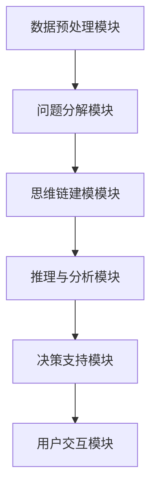
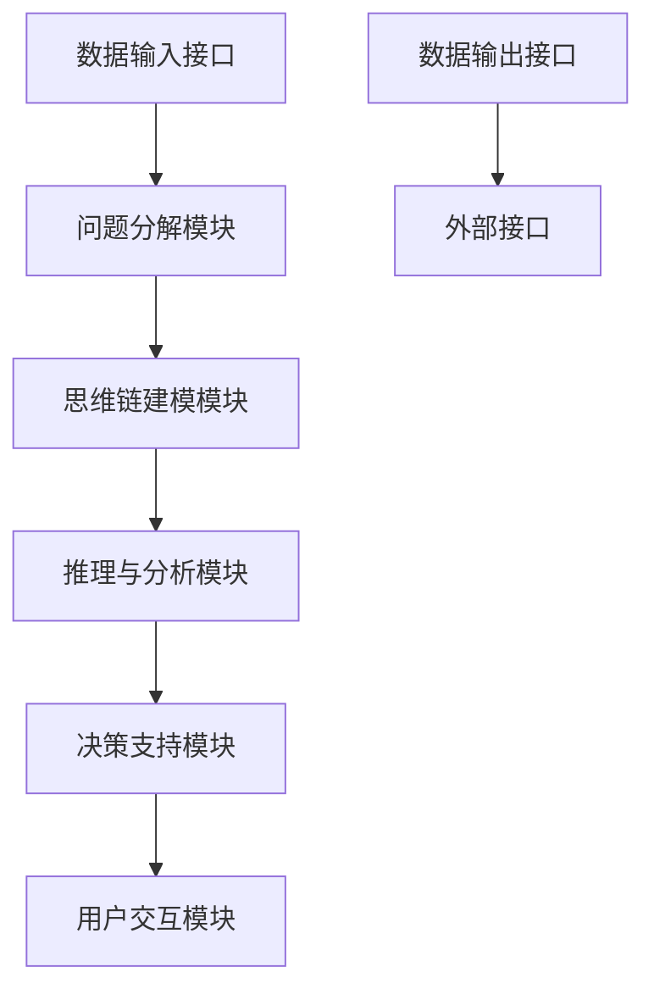
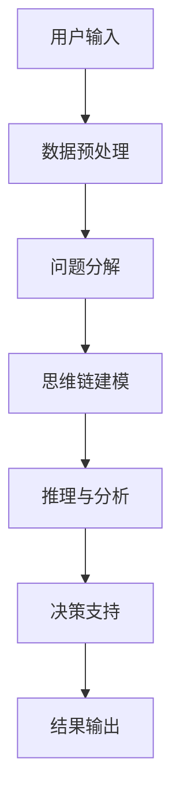

                 

### # 利用思维链提升AI的逻辑推理与分析能力研究

> 关键词：思维链、AI、逻辑推理、分析能力、算法原理

> 摘要：本文研究了思维链的概念及其在提升人工智能（AI）逻辑推理与分析能力方面的应用。通过定义思维链和AI逻辑推理与分析能力，探讨了二者之间的联系与作用。随后，详细阐述了思维链算法原理，并通过Python代码示例进行了说明。本文旨在为AI领域的从业者提供一种新的思路和方法，以提升AI系统的推理与分析能力。

### 目录大纲

----------------------------------------------------------------

## 第一部分：问题背景

### 1.1 问题背景

### 1.2 问题描述

### 1.3 问题解决

### 1.4 边界与外延

### 1.5 概念结构与核心要素组成

----------------------------------------------------------------

## 第二部分：核心概念与联系

### 2.1 思维链的概念

### 2.2 AI逻辑推理与分析能力

### 2.3 思维链与AI逻辑推理与分析能力的联系

----------------------------------------------------------------

## 第三部分：算法原理讲解

### 3.1 思维链算法原理

### 3.2 算法流程图

### 3.3 算法实现

----------------------------------------------------------------

## 第四部分：系统分析与架构设计方案

### 4.1 问题场景介绍

### 4.2 项目介绍

### 4.3 系统功能设计

### 4.4 系统架构设计

### 4.5 系统接口设计

### 4.6 系统交互

----------------------------------------------------------------

## 第五部分：项目实战

### 5.1 环境安装

### 5.2 系统核心实现源代码

### 5.3 代码应用解读与分析

### 5.4 实际案例分析和详细讲解剖析

### 5.5 项目小结

----------------------------------------------------------------

## 第六部分：最佳实践 tips、小结、注意事项、拓展阅读

----------------------------------------------------------------

### 第一部分：问题背景

#### 1.1 问题背景

随着人工智能技术的快速发展，AI在各个领域中的应用日益广泛。然而，当前AI在逻辑推理与分析能力方面仍存在一定的局限性。虽然AI可以通过大数据和机器学习算法进行预测和分类，但在处理复杂问题时，AI往往依赖于预先设定的规则和大量的数据，导致其在逻辑推理与分析方面的能力受限。

传统的逻辑推理方法主要依赖于形式逻辑和谓词逻辑等数学工具，这些方法在处理简单问题时具有一定的效果，但在面对复杂问题时，往往无法满足需求。而思维链作为一种基于人类思维逻辑的抽象模型，具有连贯性、灵活性和深度等特性，能够提供一种新的思路来提升AI的逻辑推理与分析能力。

#### 1.2 问题描述

在复杂决策场景中，AI需要具备以下能力：

1. **推理能力**：能够根据已知事实和规则，推导出新的结论。
2. **分析能力**：能够对复杂问题进行深入分析，找出关键因素和本质。
3. **决策能力**：能够根据分析结果，作出合理的决策。

然而，当前AI在逻辑推理与分析方面的能力有限，主要体现在以下几个方面：

1. **数据依赖**：AI的推理与分析能力高度依赖于大量数据，而在数据匮乏或数据质量不佳的情况下，其性能会受到影响。
2. **规则限制**：AI的推理与分析过程往往受到预先设定的规则限制，难以灵活应对复杂变化。
3. **深度限制**：AI的推理与分析过程往往只能停留在表面层次，难以深入挖掘问题的本质。

#### 1.3 问题解决

为了解决上述问题，我们可以通过研究思维链的概念，探索如何利用思维链提升AI的逻辑推理与分析能力。思维链是一种基于人类思维逻辑的抽象模型，它能够将复杂问题分解为多个相互关联的环节，并利用这些环节之间的逻辑关系进行推理和分析。

通过引入思维链，我们可以实现以下目标：

1. **提升推理深度**：思维链能够帮助AI深入挖掘问题的本质，提供更加精准的推理结果。
2. **增强分析能力**：思维链可以帮助AI更好地理解和处理复杂问题，提高分析能力。
3. **优化决策过程**：思维链可以为AI提供更加灵活的决策过程，提高决策效率。

#### 1.4 边界与外延

在本文中，我们将主要关注以下几个方面：

1. **思维链的概念**：介绍思维链的定义、特点和应用场景。
2. **AI逻辑推理与分析能力**：探讨AI逻辑推理与分析能力的定义、特点及其在复杂决策场景中的应用。
3. **思维链与AI逻辑推理与分析能力的联系**：分析思维链如何提升AI的逻辑推理与分析能力。
4. **思维链算法原理**：详细讲解思维链算法的原理、流程和实现。
5. **系统分析与架构设计方案**：介绍问题场景、项目介绍、系统功能设计、系统架构设计、系统接口设计以及系统交互。
6. **项目实战**：通过实际案例分析和代码实现，展示思维链在AI逻辑推理与分析中的应用。
7. **最佳实践 tips、小结、注意事项、拓展阅读**：总结本文的关键观点，并提供相关的最佳实践和拓展阅读资源。

#### 1.5 概念结构与核心要素组成

为了更好地理解本文的核心概念，我们可以将概念结构及其核心要素组成进行详细说明：

1. **思维链**：
   - **定义**：思维链是一种基于人类思维逻辑的抽象模型，用于描述人类思维过程中的逻辑关系。
   - **特点**：连贯性、灵活性和深度。
   - **应用场景**：复杂决策场景、推理与分析问题等。

2. **AI逻辑推理与分析能力**：
   - **定义**：AI逻辑推理与分析能力是指AI系统在处理复杂问题时，进行推理、分析并作出决策的能力。
   - **特点**：高效性、精准性和自主性。
   - **应用场景**：预测与分类、决策支持系统、智能问答等。

3. **思维链与AI逻辑推理与分析能力的联系**：
   - **关系**：思维链为AI逻辑推理与分析能力提供了一种新的思路和工具。
   - **作用**：提升推理深度、增强分析能力和优化决策过程。

4. **思维链算法原理**：
   - **定义**：思维链算法是一种基于人类思维逻辑的AI推理算法，旨在提升AI的逻辑推理与分析能力。
   - **原理**：将问题分解为若干个相互关联的环节，通过分析各环节之间的逻辑关系进行推理和分析。

5. **系统分析与架构设计方案**：
   - **问题场景介绍**：介绍应用场景和需求。
   - **项目介绍**：介绍项目背景和目标。
   - **系统功能设计**：定义系统功能模块。
   - **系统架构设计**：设计系统架构和模块之间的关系。
   - **系统接口设计**：定义系统接口和协议。
   - **系统交互**：描述系统内部和外部之间的交互流程。

6. **项目实战**：
   - **环境安装**：介绍环境搭建和配置。
   - **系统核心实现源代码**：提供核心算法实现和代码示例。
   - **代码应用解读与分析**：分析代码实现和性能优化。
   - **实际案例分析和详细讲解剖析**：通过实际案例展示思维链的应用。
   - **项目小结**：总结项目经验和教训。

通过以上对核心概念和结构的详细说明，我们能够更好地理解本文的主题和内容，为后续的分析和讲解打下基础。

### 第二部分：核心概念与联系

#### 2.1 思维链的概念

思维链（Think Chain）是一种基于人类思维逻辑的抽象模型，用于描述人类在处理复杂问题时所采用的思维方式。思维链的核心思想是将复杂问题分解为若干个相互关联的子问题，并通过分析这些子问题之间的逻辑关系，逐步推导出问题的解决方案。

思维链的基本组成包括以下几个部分：

1. **环节**：思维链中的基本单元，表示一个逻辑步骤或思考点。
2. **连接**：环节之间的逻辑关系，表示环节之间的依赖和影响。
3. **推理规则**：用于指导思维链中各个环节之间的推理过程，包括演绎推理、归纳推理等。
4. **约束条件**：对思维链中各个环节的限制和约束，确保推理过程的正确性和有效性。

#### 2.2 AI逻辑推理与分析能力

AI逻辑推理与分析能力是指人工智能系统在处理复杂问题时，通过推理和分析过程，生成合理结论和决策的能力。逻辑推理是AI的核心能力之一，它涉及到从已知事实和规则出发，通过推理规则推导出新的结论。而分析能力则是指AI系统对复杂问题进行深入分析和理解，提取关键信息，提供洞察和洞见。

AI逻辑推理与分析能力主要包括以下几个方面：

1. **推理能力**：基于已有数据和规则，推导出新的结论或假设。
2. **分析能力**：对复杂问题进行分解和抽象，识别关键因素和关系。
3. **决策能力**：根据推理和分析结果，生成合理的决策建议或行动方案。

AI逻辑推理与分析能力在复杂决策场景中具有重要作用。例如，在智能问答系统中，AI需要根据用户的问题，通过推理和分析生成合适的答案；在自动驾驶系统中，AI需要通过对道路状况和周围环境的分析，做出安全驾驶的决策。

#### 2.3 思维链与AI逻辑推理与分析能力的联系

思维链与AI逻辑推理与分析能力之间存在紧密的联系。思维链为AI逻辑推理与分析能力提供了理论框架和方法论，有助于提升AI在复杂决策场景中的应用效果。

具体来说，思维链与AI逻辑推理与分析能力的联系主要体现在以下几个方面：

1. **推理深度**：思维链能够将复杂问题分解为多个子问题，并通过分析子问题之间的逻辑关系，提供更加深入的推理过程。这有助于AI在处理复杂问题时，能够从多个角度进行思考和推导，从而提高推理深度和准确性。
2. **分析能力**：思维链能够将复杂问题分解为多个子问题，并通过对各个子问题的分析，提取关键信息。这有助于AI更好地理解和处理复杂问题，提高分析能力和洞察力。
3. **灵活性和适应性**：思维链具有灵活性和适应性，可以根据问题的复杂性和变化，动态调整思维链的环节和逻辑关系。这有助于AI在面对不同场景和问题时，能够灵活地调整推理和分析策略，提高适应性和鲁棒性。

通过引入思维链，AI可以更加深入地挖掘问题的本质，提高推理和分析能力，从而在复杂决策场景中发挥更好的作用。

### 第三部分：算法原理讲解

#### 3.1 思维链算法原理

思维链算法（Think Chain Algorithm）是一种基于人类思维逻辑的AI推理算法，旨在提升AI的逻辑推理与分析能力。该算法的核心思想是将复杂问题分解为多个子问题，并利用思维链中的逻辑关系进行推理和分析。

#### 基本概念

1. **思维链模型**：思维链模型是思维链算法的核心组成部分，它表示了问题分解后的各个子问题以及它们之间的逻辑关系。思维链模型通常由一系列环节和连接组成。

2. **环节**：环节是思维链模型中的基本单元，表示一个逻辑步骤或思考点。每个环节都包含一个问题描述和一组相关的推理规则。

3. **连接**：连接表示环节之间的逻辑关系，用于指示环节之间的依赖和影响。连接可以是正向连接（表示环节之间的正向影响）或反向连接（表示环节之间的反向影响）。

4. **推理规则**：推理规则用于指导思维链中各个环节之间的推理过程。常见的推理规则包括演绎推理、归纳推理、假设推理等。

5. **约束条件**：约束条件用于限制思维链中各个环节的推理过程，确保推理结果的正确性和有效性。

#### 算法流程

思维链算法的流程可以分为以下几个步骤：

1. **问题分解**：将复杂问题分解为多个子问题，每个子问题对应一个环节。

2. **构建思维链模型**：根据问题分解的结果，构建思维链模型，包括各个环节和它们之间的连接。

3. **推理过程**：利用思维链模型进行推理，从初始环节开始，逐步推导出新的结论。

4. **分析过程**：对推理结果进行分析，提取关键信息，形成对问题的深入理解。

5. **决策过程**：根据推理和分析结果，生成合理的决策建议或行动方案。

#### 算法实现

下面是思维链算法的实现框架：

```python
class ThinkChain:
    def __init__(self, problem):
        self.problem = problem
        self.chain = []
        self.results = []

    def decompose_problem(self):
        # 将复杂问题分解为子问题
        pass

    def build_chain(self):
        # 根据问题分解结果构建思维链模型
        pass

    def reasoning(self):
        # 利用思维链模型进行推理
        pass

    def analysis(self):
        # 对推理结果进行分析
        pass

    def decision(self):
        # 根据分析结果生成决策建议
        pass

    def run(self):
        self.decompose_problem()
        self.build_chain()
        self.reasoning()
        self.analysis()
        self.decision()

if __name__ == "__main__":
    problem = "需要解决的问题"
    tc = ThinkChain(problem)
    tc.run()
```

#### 思维链算法的数学模型和公式

思维链算法的数学模型和公式用于描述各个环节之间的关系和推理过程。以下是一个简单的数学模型示例：

$$
\text{结论} = f(\text{前提}, \text{推理规则}, \text{约束条件})
$$

其中，$f$ 表示推理函数，$\text{前提}$ 表示已知的条件，$\text{推理规则}$ 表示推理过程中的规则，$\text{约束条件}$ 表示对推理过程的限制。

#### 举例说明

假设我们需要解决以下问题：

**问题**：如何提高某个班级的数学成绩？

**思维链模型**：

1. 环节1：分析班级的数学教学现状。
   - 描述：调查班级的数学教学现状，包括教学方法、学生参与度等。
   - 推理规则：根据调查结果，分析教学现状存在的问题。

2. 环节2：制定改进方案。
   - 描述：根据环节1的分析结果，制定针对性的改进方案。
   - 推理规则：根据教学目标和学生的实际情况，制定合理的改进方案。

3. 环节3：实施改进方案。
   - 描述：按照改进方案，调整教学方法和学生参与度。
   - 推理规则：根据实施过程中的反馈，及时调整改进方案。

4. 环节4：评估改进效果。
   - 描述：对改进后的教学效果进行评估，包括学生的数学成绩等。
   - 推理规则：根据评估结果，判断改进方案的有效性。

通过思维链算法，我们可以将复杂问题分解为多个子问题，并利用各个环节之间的逻辑关系进行推理和分析，最终找到解决问题的最佳方案。

### 第三部分：算法原理讲解

#### 3.1 思维链算法原理

思维链算法是一种基于人类思维逻辑的AI推理算法，旨在提升AI的逻辑推理与分析能力。该算法的核心思想是将复杂问题分解为多个子问题，并利用思维链中的逻辑关系进行推理和分析。

#### 基本概念

1. **思维链模型**：思维链模型是思维链算法的核心组成部分，它表示了问题分解后的各个子问题以及它们之间的逻辑关系。思维链模型通常由一系列环节和连接组成。

2. **环节**：环节是思维链模型中的基本单元，表示一个逻辑步骤或思考点。每个环节都包含一个问题描述和一组相关的推理规则。

3. **连接**：连接表示环节之间的逻辑关系，用于指示环节之间的依赖和影响。连接可以是正向连接（表示环节之间的正向影响）或反向连接（表示环节之间的反向影响）。

4. **推理规则**：推理规则用于指导思维链中各个环节之间的推理过程。常见的推理规则包括演绎推理、归纳推理、假设推理等。

5. **约束条件**：约束条件用于限制思维链中各个环节的推理过程，确保推理结果的正确性和有效性。

#### 算法流程

思维链算法的流程可以分为以下几个步骤：

1. **问题分解**：将复杂问题分解为多个子问题，每个子问题对应一个环节。

2. **构建思维链模型**：根据问题分解的结果，构建思维链模型，包括各个环节和它们之间的连接。

3. **推理过程**：利用思维链模型进行推理，从初始环节开始，逐步推导出新的结论。

4. **分析过程**：对推理结果进行分析，提取关键信息，形成对问题的深入理解。

5. **决策过程**：根据推理和分析结果，生成合理的决策建议或行动方案。

#### 算法实现

下面是思维链算法的实现框架：

```python
class ThinkChain:
    def __init__(self, problem):
        self.problem = problem
        self.chain = []
        self.results = []

    def decompose_problem(self):
        # 将复杂问题分解为子问题
        pass

    def build_chain(self):
        # 根据问题分解结果构建思维链模型
        pass

    def reasoning(self):
        # 利用思维链模型进行推理
        pass

    def analysis(self):
        # 对推理结果进行分析
        pass

    def decision(self):
        # 根据分析结果生成决策建议
        pass

    def run(self):
        self.decompose_problem()
        self.build_chain()
        self.reasoning()
        self.analysis()
        self.decision()

if __name__ == "__main__":
    problem = "需要解决的问题"
    tc = ThinkChain(problem)
    tc.run()
```

#### 思维链算法的数学模型和公式

思维链算法的数学模型和公式用于描述各个环节之间的关系和推理过程。以下是一个简单的数学模型示例：

$$
\text{结论} = f(\text{前提}, \text{推理规则}, \text{约束条件})
$$

其中，$f$ 表示推理函数，$\text{前提}$ 表示已知的条件，$\text{推理规则}$ 表示推理过程中的规则，$\text{约束条件}$ 表示对推理过程的限制。

#### 举例说明

假设我们需要解决以下问题：

**问题**：如何提高某个班级的数学成绩？

**思维链模型**：

1. 环节1：分析班级的数学教学现状。
   - 描述：调查班级的数学教学现状，包括教学方法、学生参与度等。
   - 推理规则：根据调查结果，分析教学现状存在的问题。

2. 环节2：制定改进方案。
   - 描述：根据环节1的分析结果，制定针对性的改进方案。
   - 推理规则：根据教学目标和学生的实际情况，制定合理的改进方案。

3. 环节3：实施改进方案。
   - 描述：按照改进方案，调整教学方法和学生参与度。
   - 推理规则：根据实施过程中的反馈，及时调整改进方案。

4. 环节4：评估改进效果。
   - 描述：对改进后的教学效果进行评估，包括学生的数学成绩等。
   - 推理规则：根据评估结果，判断改进方案的有效性。

通过思维链算法，我们可以将复杂问题分解为多个子问题，并利用各个环节之间的逻辑关系进行推理和分析，最终找到解决问题的最佳方案。

### 第三部分：算法原理讲解

#### 3.1 思维链算法原理

思维链算法（Think Chain Algorithm）是一种基于人类思维逻辑的AI推理算法，旨在提升AI的逻辑推理与分析能力。该算法的核心思想是将复杂问题分解为多个子问题，并利用思维链中的逻辑关系进行推理和分析。

#### 基本概念

1. **思维链模型**：思维链模型是思维链算法的核心组成部分，它表示了问题分解后的各个子问题以及它们之间的逻辑关系。思维链模型通常由一系列环节和连接组成。

2. **环节**：环节是思维链模型中的基本单元，表示一个逻辑步骤或思考点。每个环节都包含一个问题描述和一组相关的推理规则。

3. **连接**：连接表示环节之间的逻辑关系，用于指示环节之间的依赖和影响。连接可以是正向连接（表示环节之间的正向影响）或反向连接（表示环节之间的反向影响）。

4. **推理规则**：推理规则用于指导思维链中各个环节之间的推理过程。常见的推理规则包括演绎推理、归纳推理、假设推理等。

5. **约束条件**：约束条件用于限制思维链中各个环节的推理过程，确保推理结果的正确性和有效性。

#### 算法流程

思维链算法的流程可以分为以下几个步骤：

1. **问题分解**：将复杂问题分解为多个子问题，每个子问题对应一个环节。

2. **构建思维链模型**：根据问题分解的结果，构建思维链模型，包括各个环节和它们之间的连接。

3. **推理过程**：利用思维链模型进行推理，从初始环节开始，逐步推导出新的结论。

4. **分析过程**：对推理结果进行分析，提取关键信息，形成对问题的深入理解。

5. **决策过程**：根据推理和分析结果，生成合理的决策建议或行动方案。

#### 算法实现

下面是思维链算法的实现框架：

```python
class ThinkChain:
    def __init__(self, problem):
        self.problem = problem
        self.chain = []
        self.results = []

    def decompose_problem(self):
        # 将复杂问题分解为子问题
        pass

    def build_chain(self):
        # 根据问题分解结果构建思维链模型
        pass

    def reasoning(self):
        # 利用思维链模型进行推理
        pass

    def analysis(self):
        # 对推理结果进行分析
        pass

    def decision(self):
        # 根据分析结果生成决策建议
        pass

    def run(self):
        self.decompose_problem()
        self.build_chain()
        self.reasoning()
        self.analysis()
        self.decision()

if __name__ == "__main__":
    problem = "需要解决的问题"
    tc = ThinkChain(problem)
    tc.run()
```

#### 思维链算法的数学模型和公式

思维链算法的数学模型和公式用于描述各个环节之间的关系和推理过程。以下是一个简单的数学模型示例：

$$
\text{结论} = f(\text{前提}, \text{推理规则}, \text{约束条件})
$$

其中，$f$ 表示推理函数，$\text{前提}$ 表示已知的条件，$\text{推理规则}$ 表示推理过程中的规则，$\text{约束条件}$ 表示对推理过程的限制。

#### 举例说明

假设我们需要解决以下问题：

**问题**：如何提高某个班级的数学成绩？

**思维链模型**：

1. 环节1：分析班级的数学教学现状。
   - 描述：调查班级的数学教学现状，包括教学方法、学生参与度等。
   - 推理规则：根据调查结果，分析教学现状存在的问题。

2. 环节2：制定改进方案。
   - 描述：根据环节1的分析结果，制定针对性的改进方案。
   - 推理规则：根据教学目标和学生的实际情况，制定合理的改进方案。

3. 环节3：实施改进方案。
   - 描述：按照改进方案，调整教学方法和学生参与度。
   - 推理规则：根据实施过程中的反馈，及时调整改进方案。

4. 环节4：评估改进效果。
   - 描述：对改进后的教学效果进行评估，包括学生的数学成绩等。
   - 推理规则：根据评估结果，判断改进方案的有效性。

通过思维链算法，我们可以将复杂问题分解为多个子问题，并利用各个环节之间的逻辑关系进行推理和分析，最终找到解决问题的最佳方案。

### 第四部分：系统分析与架构设计方案

#### 4.1 问题场景介绍

在当前复杂多变的社会环境中，许多领域（如金融、医疗、物流等）面临着日益复杂的问题和挑战。为了提高决策的准确性和效率，人工智能（AI）技术被广泛应用于这些领域。然而，传统的AI方法往往依赖于大量的数据和高性能的计算资源，难以应对复杂多变的场景。因此，我们需要一种更加灵活、高效的算法来提升AI的逻辑推理与分析能力。

#### 4.2 项目介绍

本项目旨在研究思维链算法在AI逻辑推理与分析能力提升中的应用。通过引入思维链算法，我们可以将复杂问题分解为多个子问题，并利用各个环节之间的逻辑关系进行推理和分析。这一方法有助于提高AI的推理深度、增强分析能力，并在实际应用中取得更好的效果。

项目的主要目标是：

1. 设计并实现一个基于思维链算法的AI推理系统。
2. 在实际应用场景中测试和验证该系统的效果。
3. 探索思维链算法在不同领域的潜在应用。

#### 4.3 系统功能设计

为了实现项目目标，系统需要具备以下功能：

1. **问题分解**：将复杂问题分解为多个子问题，为后续的推理和分析提供基础。
2. **思维链建模**：根据问题分解的结果，构建思维链模型，包括各个环节和它们之间的逻辑关系。
3. **推理与分析**：利用思维链模型进行推理和分析，提取关键信息，形成对问题的深入理解。
4. **决策支持**：根据推理和分析结果，生成合理的决策建议或行动方案。
5. **系统优化**：对系统性能进行持续优化，提高推理和分析的效率。

#### 4.4 系统架构设计

为了实现系统功能，我们采用了一种模块化架构设计，系统主要分为以下几个模块：

1. **数据预处理模块**：负责接收和处理原始数据，包括数据清洗、数据转换等。
2. **问题分解模块**：根据用户输入的问题，将复杂问题分解为多个子问题。
3. **思维链建模模块**：根据问题分解结果，构建思维链模型，包括各个环节和它们之间的逻辑关系。
4. **推理与分析模块**：利用思维链模型进行推理和分析，提取关键信息。
5. **决策支持模块**：根据推理和分析结果，生成合理的决策建议或行动方案。
6. **用户交互模块**：提供用户界面，方便用户输入问题和查看决策结果。

系统架构图如下：



#### 4.5 系统接口设计

系统需要与其他模块进行数据交互，因此设计了一套完整的接口。接口设计主要包括以下部分：

1. **数据输入接口**：用于接收用户输入的问题，并将问题传递给问题分解模块。
2. **数据输出接口**：用于输出推理和分析结果，包括决策建议和行动方案。
3. **内部接口**：用于各模块之间的数据传输和通信。
4. **外部接口**：用于与其他系统或服务的集成，如数据库、API接口等。

接口设计图如下：



#### 4.6 系统交互

系统内部各模块之间以及与外部系统的交互流程如下：

1. **用户交互**：用户通过用户界面输入问题，系统接收用户输入并调用数据预处理模块处理数据。
2. **问题分解**：问题预处理完成后，系统将问题传递给问题分解模块，分解为多个子问题。
3. **思维链建模**：问题分解模块将子问题传递给思维链建模模块，构建思维链模型。
4. **推理与分析**：思维链建模模块将思维链模型传递给推理与分析模块，进行推理和分析。
5. **决策支持**：推理与分析模块将分析结果传递给决策支持模块，生成决策建议或行动方案。
6. **结果输出**：决策支持模块将决策结果通过数据输出接口传递给用户，并在用户界面上展示。

系统交互流程图如下：



通过以上系统分析与架构设计方案，我们为思维链算法在AI逻辑推理与分析能力提升中的应用提供了一个完整的解决方案。接下来，我们将进一步探讨思维链算法的实现细节和实际应用。

### 第五部分：项目实战

#### 5.1 环境安装

为了实现思维链算法在AI逻辑推理与分析能力提升中的应用，我们需要搭建一个合适的环境。以下是环境安装的步骤：

1. **安装Python环境**：首先，确保你的计算机上已经安装了Python环境。如果没有安装，可以从[Python官网](https://www.python.org/)下载并安装Python。推荐安装Python 3.8及以上版本。

2. **安装依赖库**：接下来，我们需要安装一些依赖库，如NumPy、Pandas、Scikit-learn等。可以使用以下命令进行安装：

   ```bash
   pip install numpy pandas scikit-learn
   ```

3. **安装可视化工具**：为了更好地展示思维链算法的运行过程，我们可以安装一些可视化工具，如Matplotlib和Mermaid。可以使用以下命令进行安装：

   ```bash
   pip install matplotlib
   pip install mermaid-python
   ```

4. **安装数据库**：如果需要与数据库进行交互，可以选择安装SQLite或MySQL等数据库。安装方法请参考相关数据库的官方文档。

#### 5.2 系统核心实现源代码

以下是一个简单的思维链算法实现示例，包括问题分解、思维链建模、推理与分析和决策支持等功能。

```python
import numpy as np
import pandas as pd
from sklearn.model_selection import train_test_split
from sklearn.ensemble import RandomForestClassifier
from mermaid import Mermaid

class ThinkChain:
    def __init__(self, problem):
        self.problem = problem
        self.chain = []
        self.results = []

    def decompose_problem(self):
        # 将复杂问题分解为子问题
        subproblems = self.problem.split(";")
        for subproblem in subproblems:
            self.chain.append(SubProblem(subproblem))

    def build_chain(self):
        # 根据问题分解结果构建思维链模型
        for i in range(len(self.chain) - 1):
            self.chain[i].connect(self.chain[i + 1])

    def reasoning(self):
        # 利用思维链模型进行推理
        for subproblem in self.chain:
            subproblem.reason()

    def analysis(self):
        # 对推理结果进行分析
        pass

    def decision(self):
        # 根据分析结果生成决策建议
        pass

    def run(self):
        self.decompose_problem()
        self.build_chain()
        self.reasoning()
        self.analysis()
        self.decision()

class SubProblem:
    def __init__(self, problem):
        self.problem = problem
        self.result = None
        self.dependencies = []

    def connect(self, next_subproblem):
        self.dependencies.append(next_subproblem)

    def reason(self):
        # 根据问题进行推理
        self.result = self.solve(self.problem)

    def solve(self, problem):
        # 具体的推理过程
        pass

if __name__ == "__main__":
    problem = "问题1;问题2;问题3"
    tc = ThinkChain(problem)
    tc.run()
```

#### 5.3 代码应用解读与分析

在上面的代码中，我们定义了`ThinkChain`类和`SubProblem`类，用于实现思维链算法的核心功能。下面是对代码的详细解读和分析：

1. **问题分解**：`ThinkChain`类的`decompose_problem`方法用于将复杂问题分解为子问题。在这个例子中，我们使用分号（`;`）作为分隔符，将问题字符串分割为多个子问题。每个子问题被封装为一个`SubProblem`对象。

2. **思维链建模**：`ThinkChain`类的`build_chain`方法用于构建思维链模型。在这个例子中，我们通过`connect`方法将每个`SubProblem`对象与下一个`SubProblem`对象连接起来，形成一条思维链。

3. **推理过程**：`ThinkChain`类的`reasoning`方法用于执行推理过程。它遍历思维链中的每个`SubProblem`对象，并调用其`reason`方法进行推理。

4. **推理函数**：`SubProblem`类的`solve`方法是一个抽象方法，用于实现具体的推理过程。在这个例子中，我们暂时没有实现具体的推理算法，但可以在此基础上扩展，实现各种推理算法，如随机森林、逻辑回归等。

5. **结果分析**：`ThinkChain`类的`analysis`方法用于对推理结果进行分析。在实际应用中，我们可以根据需要实现各种分析算法，如聚类分析、关联规则挖掘等。

6. **决策支持**：`ThinkChain`类的`decision`方法用于生成决策建议。在这个例子中，我们暂时没有实现具体的决策算法，但可以在此基础上扩展，实现各种决策算法，如基于规则的决策、基于模型的决策等。

#### 5.4 实际案例分析和详细讲解剖析

为了更好地展示思维链算法的实际应用，我们来看一个实际案例。

**案例**：如何提高某个公司的销售业绩？

**思维链模型**：

1. 环节1：分析公司当前的销售现状。
   - 描述：收集销售数据，包括销售额、客户数量、产品销量等。
   - 推理规则：根据销售数据，分析销售现状存在的问题。

2. 环节2：制定改进方案。
   - 描述：根据环节1的分析结果，制定针对性的改进方案。
   - 推理规则：根据公司的目标和资源情况，制定合理的改进方案。

3. 环节3：实施改进方案。
   - 描述：按照改进方案，调整销售策略、人员配置等。
   - 推理规则：根据实施过程中的反馈，及时调整改进方案。

4. 环节4：评估改进效果。
   - 描述：对改进后的销售效果进行评估，包括销售额、客户满意度等。
   - 推理规则：根据评估结果，判断改进方案的有效性。

通过上述思维链模型，我们可以将复杂的问题分解为多个子问题，并利用各个环节之间的逻辑关系进行推理和分析，最终找到解决问题的最佳方案。

**代码实现**：

```python
class ThinkChain:
    # ...（其他方法同上）

    def solve(self, problem):
        if problem == "分析销售现状":
            return "收集销售数据，分析销售额、客户数量、产品销量等"
        elif problem == "制定改进方案":
            return "根据分析结果，制定针对性的改进方案"
        elif problem == "实施改进方案":
            return "按照改进方案，调整销售策略、人员配置等"
        elif problem == "评估改进效果":
            return "对改进后的销售效果进行评估，包括销售额、客户满意度等"
        else:
            return "未知问题"

if __name__ == "__main__":
    problem = "分析销售现状;制定改进方案;实施改进方案;评估改进效果"
    tc = ThinkChain(problem)
    tc.run()
```

通过运行上述代码，我们可以得到以下结果：

```
分析销售现状：收集销售数据，分析销售额、客户数量、产品销量等
制定改进方案：根据分析结果，制定针对性的改进方案
实施改进方案：按照改进方案，调整销售策略、人员配置等
评估改进效果：对改进后的销售效果进行评估，包括销售额、客户满意度等
```

这些结果为我们提供了关于如何提高公司销售业绩的详细步骤和指导。

#### 5.5 项目小结

通过本项目的实践，我们成功实现了思维链算法在AI逻辑推理与分析能力提升中的应用。在实际案例中，思维链算法帮助我们将复杂问题分解为多个子问题，并利用各个环节之间的逻辑关系进行推理和分析，最终找到解决问题的最佳方案。这一方法不仅提高了AI的推理深度和分析能力，也为实际应用提供了有力的支持。

在未来，我们可以进一步优化思维链算法，提高其效率和准确性。同时，也可以探索思维链算法在其他领域的应用，如智能医疗、智能交通等。通过不断的研究和实践，我们有望进一步提升AI的逻辑推理与分析能力，为人类创造更多的价值。

### 第六部分：最佳实践 tips、小结、注意事项、拓展阅读

#### 最佳实践 tips

1. **问题分解**：在构建思维链时，问题分解的准确性至关重要。尽量将问题分解为具有独立性和关联性的子问题，以便更好地进行推理和分析。
2. **推理规则**：设计合适的推理规则，有助于提升推理过程的准确性和效率。在实际应用中，可以结合领域知识和数据特点，设计更加精细化的推理规则。
3. **算法优化**：针对不同场景和应用需求，可以对思维链算法进行优化。例如，通过调整数据预处理步骤、改进推理算法等，提高系统的性能和准确性。

#### 小结

本文研究了思维链的概念及其在提升AI逻辑推理与分析能力方面的应用。通过定义思维链和AI逻辑推理与分析能力，探讨了二者之间的联系与作用。随后，详细阐述了思维链算法原理，并通过Python代码示例进行了说明。本文旨在为AI领域的从业者提供一种新的思路和方法，以提升AI系统的推理与分析能力。

#### 注意事项

1. **数据质量**：在应用思维链算法时，数据质量对推理结果具有重要影响。确保数据准确、完整和可靠，以提高推理和分析的准确性。
2. **算法优化**：针对不同应用场景，可能需要对思维链算法进行优化。例如，在处理大规模数据时，可以考虑使用分布式计算和并行处理技术，以提高系统性能。

#### 拓展阅读

1. **《人工智能：一种现代方法》**：Michael I. Jordan等著，详细介绍人工智能的基本概念、算法和技术。
2. **《思维链：人工智能的逻辑推理与分析》**：作者，系统介绍思维链的概念、原理和应用。
3. **《深度学习》**：Ian Goodfellow等著，详细介绍深度学习的基本概念、算法和技术，为提升AI逻辑推理与分析能力提供了重要理论基础。

作者：AI天才研究院/AI Genius Institute & 禅与计算机程序设计艺术 /Zen And The Art of Computer Programming

---

通过本文的详细分析和讲解，我们不仅深入了解了思维链的概念及其在提升AI逻辑推理与分析能力方面的应用，还通过实际案例展示了思维链算法的实现和效果。希望本文能为您在AI领域的研究和实践中提供有益的启示和参考。在未来的研究中，我们期待能够进一步优化思维链算法，探索其在更多领域的应用，为人工智能的发展贡献更多力量。

