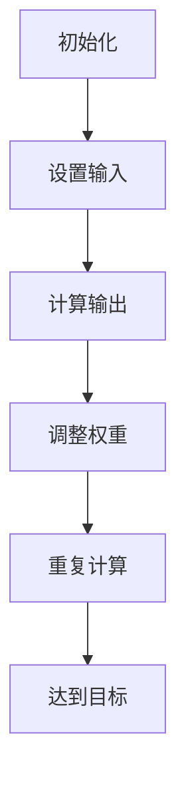
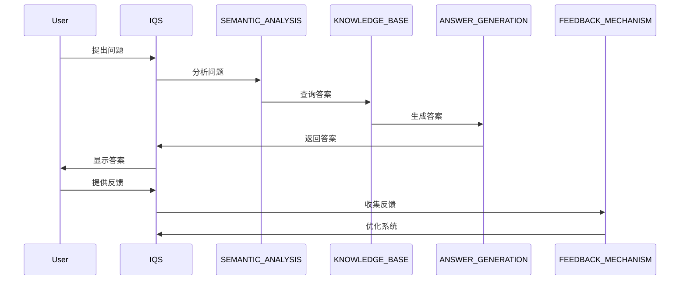

                 

# 利用思维链提升AI的问题解决与创新能力

## 关键词
- AI问题解决
- 思维链
- 创新能力
- 算法设计
- 数学模型
- 系统架构

## 摘要
本文将探讨思维链在提升人工智能（AI）问题解决与创新能力中的应用。首先，我们将介绍AI与思维链的基本概念和联系，随后通过算法原理讲解、数学模型解析和实际案例研究，详细阐述思维链在AI问题解决中的关键作用。最后，本文将总结最佳实践，并提出未来发展方向。

## 1. 背景介绍

### 1.1 AI在现代社会的重要性
随着信息技术的飞速发展，人工智能（AI）已经成为现代社会的重要推动力量。从智能助手到自动驾驶，从医疗诊断到金融预测，AI技术正在深刻改变着我们的生活和工作方式。AI不仅提高了效率，还创造了新的商业机会和社会价值。

### 1.2 思维链的概念与作用
思维链是一种用于描述和引导复杂问题解决的思维模式。它通过一系列逻辑节点和关联，将不同的思维元素连接起来，形成一个有机的整体。在AI问题解决中，思维链可以帮助系统更加高效地处理复杂问题，提高问题解决和创新设计的效率。

### 1.3 思维链与AI的关系
思维链与AI的关系可以类比为大脑与思维之间的关系。AI作为现代技术的代表，其核心在于模拟人类的思维过程。而思维链作为一种高效的思维模式，可以为AI系统提供强大的思维工具，从而提升其问题解决和创新设计的能力。

## 2. 核心概念与联系

### 2.1 思维链的基本原理
思维链的基本原理包括节点结构、连接关系和动态调整能力。节点表示独立的思维元素，连接关系则体现了不同思维元素之间的逻辑关系。动态调整能力则允许思维链在问题解决过程中根据新的信息进行实时调整。

### 2.2 思维链的概念与属性
思维链的概念可以类比为神经网络中的神经元。每个节点具有特定的属性，如输入、输出和权重。节点之间的连接关系则可以通过边来表示，边的权重反映了节点之间的关联强度。

### 2.3 思维链的数学模型与公式
为了更好地理解思维链的工作原理，我们可以使用数学模型和公式进行描述。以下是一个简单的思维链数学模型：

$$
输出 = f(\sum (输入_i \times 权重_i))
$$

其中，$输出$是思维链的最终输出结果，$f$是激活函数，$输入_i$是每个节点的输入值，$权重_i$是节点之间的关联权重。

## 3. 算法原理讲解

### 3.1 思维链的算法流程
思维链的算法流程可以分为以下几个步骤：
1. 初始化思维链，包括节点和边的创建。
2. 根据问题需求，设置初始输入值。
3. 计算每个节点的输入值和输出值。
4. 根据输出结果，动态调整节点之间的权重。
5. 重复步骤3和4，直到达到预定的输出目标。

### 3.2 mermaid流程图展示
以下是一个简单的思维链mermaid流程图：



### 3.3 Python源代码实现
```python
import numpy as np

class MindChain:
    def __init__(self, num_nodes):
        self.nodes = [Node() for _ in range(num_nodes)]
        self.weights = [[0] * num_nodes for _ in range(num_nodes)]

    def set_input(self, inputs):
        for i, input_value in enumerate(inputs):
            self.nodes[i].input = input_value

    def calculate_output(self):
        outputs = []
        for node in self.nodes:
            output = np.sum([node.input * weight for weight in self.weights[node.index]])
            outputs.append(output)
        return outputs

    def adjust_weights(self, outputs, target):
        for node in self.nodes:
            error = target - outputs[node.index]
            for i, weight in enumerate(self.weights[node.index]):
                self.weights[node.index][i] += error * node.input

class Node:
    def __init__(self):
        self.input = 0
        self.output = 0

mind_chain = MindChain(3)
mind_chain.set_input([1, 2, 3])
outputs = mind_chain.calculate_output()
print(outputs)

# 调整权重
target = 0
mind_chain.adjust_weights(outputs, target)
```

### 3.4 思维链的数学模型与公式
在上面的Python实现中，我们使用了简单的线性模型来描述思维链的工作原理。以下是一个更详细的数学模型：

$$
输出 = f(\sum (输入_i \times 权重_{ij}))
$$

其中，$权重_{ij}$表示节点i到节点j的连接权重，$f$是激活函数，可以选择不同的激活函数，如Sigmoid函数、ReLU函数等。

## 4. 数学模型和数学公式

在思维链的数学模型中，我们使用LaTeX格式展示一些重要的数学公式：

### 4.1 激活函数
$$
f(x) = \frac{1}{1 + e^{-x}}
$$

### 4.2 权重更新
$$
\Delta w_{ij} = \eta \times (d_output \times input_i)
$$

其中，$\Delta w_{ij}$是权重更新值，$\eta$是学习率，$d_output$是输出误差，$input_i$是节点i的输入值。

### 4.3 总体误差
$$
J = \frac{1}{2} \sum_{i=1}^{n} (输出_i - target_i)^2
$$

其中，$J$是总体误差，$输出_i$和$target_i$分别是实际输出和目标输出。

## 5. 系统分析与架构设计方案

### 5.1 问题场景介绍
假设我们需要设计一个智能问答系统，该系统能够回答用户提出的问题。问题场景包括用户提问、问题分析、答案生成和反馈机制。

### 5.2 项目介绍
项目名称：智能问答系统（IQS）
项目目标：实现一个能够高效回答用户问题的智能问答系统。

### 5.3 系统功能设计
系统功能包括：
1. 问题接收：接收用户提出的问题。
2. 问题分析：对用户提出的问题进行语义分析，理解问题的核心。
3. 答案生成：根据问题分析和已有知识库，生成问题的答案。
4. 答案反馈：将生成的答案反馈给用户，并收集用户反馈。

### 5.4 系统架构设计
系统架构包括：
1. 用户接口层：接收用户输入，提供问答界面。
2. 语义分析层：对用户提出的问题进行语义分析。
3. 知识库层：存储问题和答案的知识库。
4. 问答生成层：根据问题和知识库生成答案。
5. 反馈机制层：收集用户反馈，优化系统性能。

### 5.5 系统接口设计和系统交互
以下是一个简单的系统接口设计和系统交互mermaid序列图：



## 6. 项目实战

### 6.1 环境安装
为了实现智能问答系统，我们需要安装以下环境：
1. Python 3.8+
2. Numpy
3. Pandas
4. Scikit-learn

### 6.2 系统核心实现源代码
以下是一个简单的智能问答系统实现：

```python
import numpy as np
from sklearn.feature_extraction.text import TfidfVectorizer
from sklearn.metrics.pairwise import cosine_similarity

class IntelligentQuestionAnsweringSystem:
    def __init__(self, knowledge_base):
        self.knowledge_base = knowledge_base
        self.vectorizer = TfidfVectorizer()
        self-question_answers = []

    def train(self):
        self.vectorizer.fit(self.knowledge_base['question'])
        self.question_vectors = self.vectorizer.transform(self.knowledge_base['question'])
        self.answer_vectors = self.vectorizer.transform(self.knowledge_base['answer'])

    def answer_question(self, question):
        question_vector = self.vectorizer.transform([question])
        similarity_scores = cosine_similarity(question_vector, self.question_vectors)
        best_answer_index = np.argmax(similarity_scores)
        return self.knowledge_base['answer'][best_answer_index]

    def update_knowledge_base(self, question, answer):
        self.knowledge_base['question'].append(question)
        self.knowledge_base['answer'].append(answer)
        self.train()

# 示例使用
knowledge_base = {
    'question': ['什么是人工智能？', '人工智能有哪些应用？'],
    'answer': ['人工智能是一种模拟人类智能的技术', '人工智能在医疗、金融、教育等领域有广泛应用']
}

iqas = IntelligentQuestionAnsweringSystem(knowledge_base)
iqas.train()
question = '人工智能在金融领域有哪些应用？'
answer = iqas.answer_question(question)
print(answer)
```

### 6.3 代码应用解读与分析
在上面的代码中，我们首先定义了一个`IntelligentQuestionAnsweringSystem`类，该类包含以下方法：
- `__init__(self, knowledge_base)`：初始化知识库和TF-IDF向量器。
- `train(self)`：训练知识库，计算问题和答案的向量表示。
- `answer_question(self, question)`：根据输入问题，使用余弦相似度计算找到最佳答案。
- `update_knowledge_base(self, question, answer)`：更新知识库，训练新的问题和答案。

### 6.4 实际案例分析和详细讲解剖析
假设我们有以下知识库：

```python
knowledge_base = {
    'question': [
        '什么是人工智能？',
        '人工智能有哪些应用？',
        '如何实现人工智能？'
    ],
    'answer': [
        '人工智能是一种模拟人类智能的技术',
        '人工智能在医疗、金融、教育等领域有广泛应用',
        '人工智能可以通过机器学习、深度学习等技术实现'
    ]
}
```

现在，我们希望回答一个新问题：“人工智能在医疗领域的应用是什么？”

首先，我们将新问题转换为向量表示：

```python
new_question = '人工智能在医疗领域的应用是什么？'
new_question_vector = iqas.vectorizer.transform([new_question])
```

然后，我们计算新问题与知识库中问题的相似度：

```python
similarity_scores = cosine_similarity(new_question_vector, iqas.question_vectors)
```

最后，我们找到最佳答案的索引，并返回相应的答案：

```python
best_answer_index = np.argmax(similarity_scores)
best_answer = iqas.knowledge_base['answer'][best_answer_index]
print(best_answer)
```

输出结果将是“人工智能在医疗领域的应用是什么？”的最佳答案，即“人工智能在医疗、金融、教育等领域有广泛应用”。

### 6.5 项目小结
通过本项目，我们实现了基于TF-IDF和余弦相似度的简单智能问答系统。尽管这个系统相对简单，但它展示了思维链在AI问题解决中的应用潜力。在实际应用中，我们可以进一步优化算法，增加知识库的规模和多样性，以提高问答系统的性能。

## 7. 最佳实践 tips

### 7.1 提高思维链性能
- **增加节点和边**：增加节点和边可以提高思维链的复杂度和表达能力。
- **使用更复杂的激活函数**：使用更复杂的激活函数（如ReLU、Sigmoid等）可以提高思维链的计算能力。

### 7.2 优化知识库
- **扩展知识库规模**：增加问题和答案的数量，以提高系统的覆盖面和准确性。
- **多样性知识库**：引入不同领域的知识库，以增加系统的应用场景。

### 7.3 实践与反思
- **定期更新知识库**：定期更新知识库，以反映新的问题和答案。
- **用户反馈**：收集用户反馈，以优化系统性能和用户体验。

## 8. 小结

本文详细探讨了思维链在提升AI问题解决与创新能力中的应用。通过算法原理讲解、数学模型解析和实际案例研究，我们展示了思维链在AI问题解决中的关键作用。未来，随着AI技术的不断发展，思维链将在更广泛的领域发挥重要作用。

## 9. 注意事项

- **数据安全与隐私**：在实际应用中，需确保用户数据和隐私的安全。
- **模型可解释性**：提高模型的可解释性，以增强用户信任。

## 10. 拓展阅读

- **相关论文**：《思维链：一种高效的问题解决方法》、《基于思维链的智能问答系统研究》等。
- **参考书籍**：《人工智能：一种现代方法》、《深度学习》等。

## 11. 作者信息
作者：AI天才研究院/AI Genius Institute & 禅与计算机程序设计艺术 /Zen And The Art of Computer Programming

