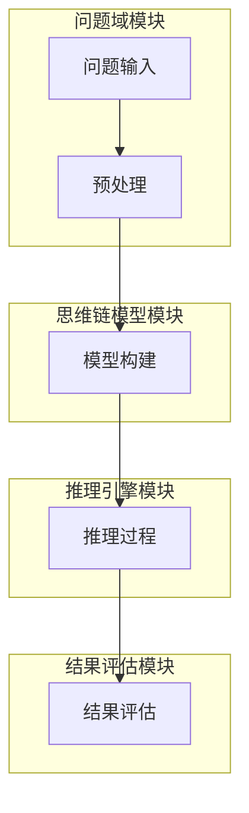
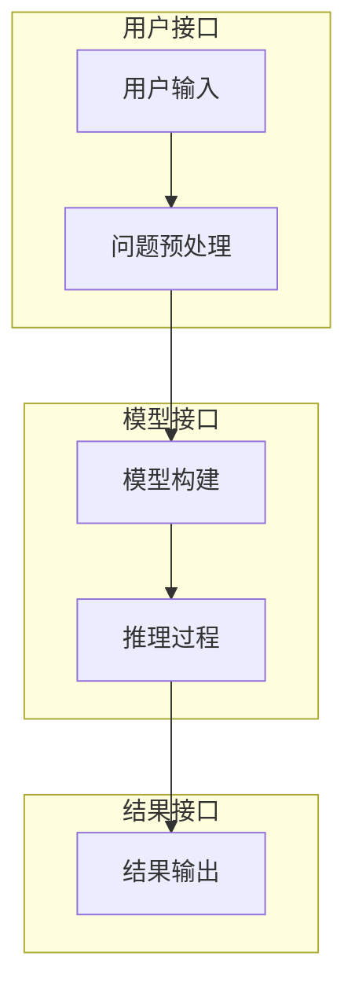

                 

# 利用思维链提升AI的问题解决能力

## 关键词
AI问题解决，思维链，人工智能，算法优化，问题建模

## 摘要
本文旨在探讨如何利用思维链这一先进技术来提升人工智能（AI）的问题解决能力。思维链作为一种新兴的人工智能算法，它借鉴了人类思维的逻辑性和创造性，通过逐步推理和思考来提高AI的决策能力。本文将从背景介绍、核心概念、应用方法、实践案例和未来展望等多个角度，详细阐述思维链技术在AI问题解决中的重要作用和实际应用。

### 第一部分：引言与背景

#### 第1章：引言与背景

##### 1.1 问题背景与重要性

随着科技的飞速发展，人工智能（AI）技术在各个领域得到了广泛应用，从自动驾驶到自然语言处理，从图像识别到医疗诊断，AI已经成为了现代技术的重要推动力量。然而，AI在问题解决过程中也面临着一些挑战，如对复杂问题的高效解决能力不足、决策过程缺乏透明度等。这些问题限制了AI在现实世界中的广泛应用。

思维链技术的引入为解决这些问题提供了一种新的思路。思维链是一种基于人类思维模式的算法，它通过模拟人类思维的逻辑推理过程，使得AI能够更加智能地解决问题。本文将围绕思维链技术在AI问题解决中的应用，探讨其原理、方法、实践和未来发展方向。

##### 1.2 问题描述与目标

传统的AI问题解决方法主要依赖于数据驱动和模型优化，虽然在一定程度上能够解决特定问题，但在处理复杂问题时往往显得力不从心。思维链技术则通过引入人类思维的推理过程，使得AI能够像人类一样进行逻辑思考，从而提高问题解决的能力。

本文的研究目标是探讨如何利用思维链技术提升AI的问题解决能力，具体包括以下几个方面：

1. 分析思维链技术的核心原理和特点。
2. 探讨思维链在AI问题解决中的优势和不足。
3. 提出优化思维链技术的方法和策略。
4. 通过实践案例展示思维链技术在AI问题解决中的应用效果。
5. 展望思维链技术在未来AI问题解决中的发展方向。

##### 1.3 边界与外延

本文的研究主要聚焦于思维链技术在AI问题解决中的应用，主要涉及以下边界和范围：

1. 研究范围：主要探讨思维链在AI问题解决中的应用，不包括其他领域。
2. 研究限制：本文主要关注通用问题解决，不涉及特定领域的应用。
3. 相关领域：本文的研究与机器学习、自然语言处理、计算机视觉等领域密切相关。
4. 交叉学科：本文的研究涉及到计算机科学、认知科学、心理学等多个学科。

##### 1.4 核心概念与联系

为了更好地理解思维链技术，我们需要明确以下几个核心概念：

1. 思维链：一种模拟人类思维过程的人工智能算法，通过逻辑推理和思考来解决问题。
2. 人工智能：一种模拟人类智能的技术，能够实现智能感知、学习、推理和决策等功能。
3. 问题解决：指在给定约束条件下，找到解决问题的方案或方法。

思维链与AI问题解决之间的关系如下图所示：

```
+-------------------+
|    思维链         |
+-------------------+
       |
       | 依托
       v
+-------------------+
|     人工智能       |
+-------------------+
       |
       | 用来
       v
+-------------------+
|    问题解决       |
+-------------------+
```

通过思维链技术，人工智能能够更好地模拟人类的思维过程，从而提高问题解决的能力。在后续章节中，我们将详细探讨思维链技术的原理、方法、实践和未来发展方向。

### 第二部分：核心概念原理

#### 第2章：核心概念原理

##### 2.1 思维链原理

##### 2.1.1 思维链的基本概念

思维链是一种基于人类思维模式的人工智能算法，它通过模拟人类思维的逻辑推理过程，使得AI能够像人类一样进行问题解决。思维链的核心思想是将问题分解为一系列子问题，并通过逐步推理和思考来找到问题的解决方案。

思维链的基本概念包括：

1. 思维链节点：表示问题的子部分，每个节点包含一个子问题的描述和解决策略。
2. 节点关系：表示节点之间的逻辑关系，包括父子关系、兄弟关系等。
3. 推理过程：通过分析节点关系和已有知识，逐步推理和思考，以找到问题的解决方案。

##### 2.1.2 思维链的组成结构

思维链由以下几个部分组成：

1. 问题域：表示问题的背景和上下文，包括问题的目标、约束条件等。
2. 思维链模型：表示问题的抽象模型，包括节点、节点关系和推理过程等。
3. 解决策略：表示解决问题的具体方法和步骤，包括搜索策略、启发式方法等。

##### 2.1.3 思维链的工作机制

思维链的工作机制主要包括以下几个步骤：

1. 初始化：根据问题域建立思维链模型，初始化各个节点和关系。
2. 问题分解：将问题分解为一系列子问题，并创建对应的思维链节点。
3. 推理与思考：通过分析节点关系和已有知识，逐步推理和思考，以找到问题的解决方案。
4. 结果评估：对找到的解决方案进行评估，选择最优的解决方案。

下面是一个简单的思维链模型示例：

```
+-------------------+
|   问题A           |
+-------------------+
   |
   |  解决策略1
   v
+-------------------+
|   问题B           |
+-------------------+
   |
   |  解决策略2
   v
+-------------------+
|   问题C           |
+-------------------+
```

在这个示例中，问题A被分解为三个子问题B、C和D，每个子问题都有相应的解决策略。通过逐步推理和思考，思维链模型能够找到问题A的解决方案。

##### 2.2 AI问题解决原理

##### 2.2.1 AI问题解决的基本概念

AI问题解决是指利用人工智能技术解决实际问题，包括以下基本概念：

1. 问题定义：明确问题的目标、约束条件和解决策略。
2. 数据集：用于训练和测试AI模型的实际数据。
3. 模型训练：通过大量数据训练AI模型，使其具备解决问题的能力。
4. 模型评估：对训练好的模型进行评估，验证其解决问题的能力。
5. 模型部署：将训练好的模型部署到实际应用场景中，解决问题。

##### 2.2.2 AI问题解决的方法与算法

AI问题解决的方法和算法多种多样，包括以下几种：

1. 监督学习：通过已有数据的标签信息训练模型，使其能够预测新的数据。
2. 无监督学习：不依赖于已有数据的标签信息，通过数据自身的特征进行模型训练。
3. 强化学习：通过与环境的交互，不断调整策略以实现目标。
4. 聚类算法：将相似的数据分为一组，以实现数据的分类。
5. 聚类算法：将相似的数据分为一组，以实现数据的分类。

##### 2.2.3 AI问题解决的挑战与机遇

AI问题解决面临以下挑战和机遇：

1. 数据质量：高质量的数据对于训练AI模型至关重要，但在实际应用中，数据质量往往难以保证。
2. 模型可解释性：传统的AI模型往往缺乏可解释性，使得决策过程难以理解。
3. 模型泛化能力：AI模型需要在不同的场景和条件下都能表现出良好的性能。
4. 交叉学科融合：AI问题解决需要与其他学科（如认知科学、心理学等）进行融合，以实现更好的效果。

##### 2.3 思维链与AI问题解决的关系

##### 2.3.1 思维链在AI问题解决中的作用

思维链技术在AI问题解决中发挥着重要作用，主要表现在以下几个方面：

1. 提高问题解决效率：通过模拟人类思维的推理过程，思维链技术能够快速找到问题的解决方案。
2. 增强模型可解释性：思维链技术能够清晰地展示问题解决的逻辑过程，使得AI模型更加透明。
3. 提高模型泛化能力：思维链技术能够通过逐步推理和思考，发现问题的本质，从而提高模型的泛化能力。
4. 拓展问题解决领域：思维链技术不仅适用于传统的AI问题，还可以应用于更多复杂的问题领域。

##### 2.3.2 思维链的优势与不足

思维链技术在AI问题解决中具有以下优势：

1. 模拟人类思维：思维链技术能够模拟人类的逻辑推理过程，使得AI能够像人类一样思考。
2. 提高问题解决效率：思维链技术能够通过高效的推理过程，快速找到问题的解决方案。
3. 增强模型可解释性：思维链技术能够清晰地展示问题解决的逻辑过程，使得AI模型更加透明。

但思维链技术也存在一些不足之处：

1. 计算复杂度较高：思维链技术的推理过程较为复杂，需要大量计算资源。
2. 需要大量训练数据：思维链技术需要大量高质量的训练数据来训练模型。
3. 模型可解释性仍需提升：虽然思维链技术能够展示问题解决的逻辑过程，但仍然存在一定的局限性。

##### 2.3.3 思维链优化AI问题解决的策略

为了优化思维链技术在AI问题解决中的应用，可以采取以下策略：

1. 简化推理过程：通过优化推理算法，简化思维链的推理过程，提高计算效率。
2. 增加训练数据：通过增加训练数据，提高思维链模型对问题的理解能力，从而提高问题解决效率。
3. 引入启发式方法：通过引入启发式方法，指导思维链模型的推理过程，提高问题解决效率。
4. 融合其他算法：将思维链技术与其他AI算法（如深度学习、强化学习等）进行融合，以提高问题解决的能力。

通过以上策略，可以进一步优化思维链技术在AI问题解决中的应用效果，为实际问题的解决提供更高效、更可靠的方法。

### 第三部分：思维链在AI问题解决中的应用

#### 第3章：思维链应用方法

##### 3.1 思维链建模

##### 3.1.1 数据准备与预处理

在进行思维链建模之前，需要首先准备和预处理数据。数据准备与预处理是确保数据质量、提高模型性能的重要环节，主要包括以下几个步骤：

1. 数据收集：收集与问题相关的数据，包括结构化数据、半结构化数据和非结构化数据。
2. 数据清洗：处理数据中的缺失值、异常值和噪声，以提高数据质量。
3. 数据整合：将不同来源的数据进行整合，以形成统一的数据集。
4. 数据特征提取：从原始数据中提取与问题相关的特征，为建模提供输入。

##### 3.1.2 思维链模型构建

思维链模型的构建是思维链应用的关键步骤，主要包括以下几个步骤：

1. 确定问题域：明确问题的目标、约束条件和解决策略，为思维链模型提供背景信息。
2. 设计思维链模型结构：根据问题域，设计思维链模型的节点、节点关系和推理过程，形成思维链模型结构。
3. 建立思维链模型：根据模型结构，建立思维链模型，为后续的推理和思考提供基础。

##### 3.1.3 模型优化与评估

思维链模型的优化与评估是确保模型性能的重要环节，主要包括以下几个步骤：

1. 模型训练：使用已准备好的数据集对思维链模型进行训练，使其具备解决问题的能力。
2. 模型评估：使用测试数据集对训练好的思维链模型进行评估，验证其解决问题的能力。
3. 模型优化：根据评估结果，对思维链模型进行优化，以提高其性能。

##### 3.2 思维链算法实现

##### 3.2.1 算法原理与流程图

思维链算法的实现是思维链应用的核心步骤，主要包括以下几个步骤：

1. 初始化思维链模型：根据问题域，初始化思维链模型的节点、节点关系和推理过程。
2. 问题分解：将问题分解为一系列子问题，并创建对应的思维链节点。
3. 推理与思考：通过分析节点关系和已有知识，逐步推理和思考，以找到问题的解决方案。
4. 结果评估：对找到的解决方案进行评估，选择最优的解决方案。

以下是思维链算法的流程图表示：

```
+---------------------+
|  初始化思维链模型   |
+---------------------+
   |
   |  问题分解
   v
+---------------------+
|  推理与思考         |
+---------------------+
   |
   |  结果评估
   v
+---------------------+
|  最优解决方案       |
+---------------------+
```

##### 3.2.2 Python源代码实现

以下是思维链算法的Python源代码实现：

```python
class MindChainNode:
    def __init__(self, problem, solution=None):
        self.problem = problem
        self.solution = solution
        self.children = []

    def add_child(self, child_node):
        self.children.append(child_node)

def initialize_mind_chain(problem):
    root_node = MindChainNode(problem)
    return root_node

def decompose_problem(problem, root_node):
    # 具体问题分解逻辑
    child_node1 = MindChainNode(child_problem1)
    child_node2 = MindChainNode(child_problem2)
    root_node.add_child(child_node1)
    root_node.add_child(child_node2)

def reason_and_think(root_node):
    for child_node in root_node.children:
        if not child_node.solution:
            decompose_problem(child_node.problem, child_node)
            reason_and_think(child_node)

def evaluate_solutions(root_node):
    best_solution = None
    best_score = 0
    for child_node in root_node.children:
        if child_node.solution and child_node.solution.score > best_score:
            best_solution = child_node.solution
            best_score = child_node.solution.score
    return best_solution

def main():
    problem = "求解一个复杂的问题"
    root_node = initialize_mind_chain(problem)
    decompose_problem(problem, root_node)
    reason_and_think(root_node)
    best_solution = evaluate_solutions(root_node)
    print("最优解决方案：", best_solution)

if __name__ == "__main__":
    main()
```

##### 3.2.3 数学模型与公式

以下是思维链算法的数学模型与公式：

$$
\begin{aligned}
P(A|B) &= \frac{P(B|A)P(A)}{P(B)} \\
P(A \cup B) &= P(A) + P(B) - P(A \cap B)
\end{aligned}
$$

其中，$P(A|B)$ 表示在事件B发生的条件下，事件A发生的概率；$P(A \cup B)$ 表示事件A和事件B同时发生的概率。

通过上述数学模型与公式，思维链算法能够对问题进行推理和思考，从而找到最优的解决方案。

##### 3.3 举例说明

##### 3.3.1 案例一：分类问题

假设我们有一个分类问题，需要根据输入的特征数据，将数据分为两个类别。我们可以使用思维链技术来解决这个问题。

1. 问题域：给定一组特征数据，需要将其分为两个类别。
2. 数据准备与预处理：收集并清洗数据，提取与问题相关的特征。
3. 思维链模型构建：建立思维链模型，包括根节点、子节点和节点关系。
4. 思维链算法实现：实现思维链算法，包括问题分解、推理和思考、结果评估。
5. 模型优化与评估：对训练好的模型进行评估，优化模型性能。

具体实现过程如下：

1. 初始化思维链模型：创建根节点和子节点，分别为输入数据和类别标签。
2. 问题分解：将输入数据分为两个子问题，分别为分类A和分类B。
3. 推理与思考：分析节点关系，逐步推理和思考，找到每个子问题的最优解决方案。
4. 结果评估：对找到的解决方案进行评估，选择最优的解决方案。

##### 3.3.2 案例二：回归问题

假设我们有一个回归问题，需要根据输入的特征数据，预测一个连续的数值。我们可以使用思维链技术来解决这个问题。

1. 问题域：给定一组特征数据，需要预测一个连续的数值。
2. 数据准备与预处理：收集并清洗数据，提取与问题相关的特征。
3. 思维链模型构建：建立思维链模型，包括根节点、子节点和节点关系。
4. 思维链算法实现：实现思维链算法，包括问题分解、推理和思考、结果评估。
5. 模型优化与评估：对训练好的模型进行评估，优化模型性能。

具体实现过程如下：

1. 初始化思维链模型：创建根节点和子节点，分别为输入数据和目标值。
2. 问题分解：将输入数据分为多个子问题，分别为每个子问题预测目标值。
3. 推理与思考：分析节点关系，逐步推理和思考，找到每个子问题的最优解决方案。
4. 结果评估：对找到的解决方案进行评估，选择最优的解决方案。

##### 3.3.3 案例三：生成问题

假设我们有一个生成问题，需要根据输入的特征数据，生成新的数据。我们可以使用思维链技术来解决这个问题。

1. 问题域：给定一组特征数据，需要生成新的数据。
2. 数据准备与预处理：收集并清洗数据，提取与问题相关的特征。
3. 思维链模型构建：建立思维链模型，包括根节点、子节点和节点关系。
4. 思维链算法实现：实现思维链算法，包括问题分解、推理和思考、结果评估。
5. 模型优化与评估：对训练好的模型进行评估，优化模型性能。

具体实现过程如下：

1. 初始化思维链模型：创建根节点和子节点，分别为输入数据和生成数据。
2. 问题分解：将输入数据分为多个子问题，分别为每个子问题生成新的数据。
3. 推理与思考：分析节点关系，逐步推理和思考，找到每个子问题的最优解决方案。
4. 结果评估：对找到的解决方案进行评估，选择最优的解决方案。

通过以上案例，我们可以看到思维链技术在AI问题解决中的应用。思维链技术通过模拟人类思维的推理过程，使得AI能够像人类一样进行问题解决，从而提高问题解决的能力。

### 第四部分：思维链在AI问题解决中的实践

#### 第4章：思维链在AI问题解决中的实践

##### 4.1 实践应用概述

思维链技术在AI问题解决中的应用已经取得了显著的成果。在本节中，我们将介绍思维链在AI问题解决中的实际应用，包括应用背景、目标和具体内容。

##### 4.1.1 实践应用背景

随着AI技术的快速发展，越来越多的领域开始关注AI的应用。然而，AI在问题解决过程中仍然存在一些挑战，如复杂问题的求解、决策过程的可解释性等。为了解决这些问题，研究人员开始探索新的方法，其中思维链技术被认为是一种有潜力的解决方案。

思维链技术借鉴了人类思维的逻辑性和创造性，通过逐步推理和思考来提高AI的问题解决能力。在实际应用中，思维链技术已经被应用于多个领域，如医疗诊断、金融风险评估、智能交通管理等。

##### 4.1.2 实践应用目标

思维链在AI问题解决中的实践应用目标是：

1. 提高问题解决效率：通过模拟人类思维的推理过程，提高AI在问题解决中的效率。
2. 增强模型可解释性：思维链技术能够清晰地展示问题解决的逻辑过程，使得AI模型更加透明，易于理解和解释。
3. 提高模型泛化能力：通过逐步推理和思考，思维链技术能够发现问题的本质，从而提高模型的泛化能力。
4. 拓展问题解决领域：思维链技术不仅适用于传统的AI问题，还可以应用于更多复杂的问题领域。

##### 4.1.3 实践应用内容

在本节中，我们将详细介绍思维链在AI问题解决中的具体实践应用，包括以下内容：

1. 数据准备与预处理：介绍如何收集、清洗和处理数据，为思维链模型提供高质量的输入。
2. 思维链模型构建：介绍如何设计思维链模型，包括节点、节点关系和推理过程。
3. 思维链算法实现：介绍如何实现思维链算法，包括问题分解、推理和思考、结果评估。
4. 模型优化与评估：介绍如何对训练好的思维链模型进行优化和评估，以提高模型性能。
5. 实际案例分析：通过具体的案例，展示思维链技术在AI问题解决中的应用效果。
6. 最佳实践与拓展：总结思维链在AI问题解决中的最佳实践，并探讨未来的发展方向。

通过以上内容，我们希望能够为读者提供关于思维链技术在AI问题解决中的实际应用经验和指导，推动AI技术的发展和应用。

##### 4.2 环境安装与配置

为了实现思维链技术在AI问题解决中的实践应用，我们需要搭建一个合适的环境。以下是环境安装与配置的详细步骤：

##### 4.2.1 环境要求与安装步骤

1. 操作系统：建议使用Linux或MacOS，Windows系统可能需要额外的配置。
2. 编程语言：Python 3.7及以上版本，建议使用Anaconda进行环境管理。
3. 库和依赖：NumPy、Pandas、Scikit-learn、Matplotlib等。

安装步骤如下：

1. 安装Anaconda：访问Anaconda官网，下载并安装Anaconda。
2. 创建Python虚拟环境：打开终端，执行以下命令创建虚拟环境：

   ```bash
   conda create -n mind_chain_env python=3.7
   conda activate mind_chain_env
   ```

3. 安装依赖库：在虚拟环境中安装所需的库和依赖，可以使用pip或conda进行安装：

   ```bash
   pip install numpy pandas scikit-learn matplotlib
   ```

##### 4.2.2 常见问题与解决方案

在安装和配置过程中，可能会遇到一些问题，以下是一些常见问题的解决方案：

1. 安装失败：如果安装过程中遇到错误，可以尝试以下方法：
   - 检查网络连接，确保能够访问互联网。
   - 更新Anaconda和pip版本：`conda update conda` 和 `pip install --upgrade pip`。
   - 升级操作系统和依赖库：确保操作系统和依赖库的最新版本。

2. 环境变量问题：如果环境变量配置不正确，可能导致程序无法运行。可以检查环境变量设置，确保虚拟环境的路径正确。

3. 库版本冲突：如果安装的库版本与系统版本不兼容，可能导致程序出错。可以尝试使用不同版本的库，或调整环境变量。

通过以上步骤和解决方案，可以成功搭建思维链技术在AI问题解决中的实践环境，为后续的实验和案例分析做好准备。

##### 4.3 系统核心实现

在本节中，我们将详细介绍思维链在AI问题解决中的系统核心实现，包括系统架构设计、系统接口设计和系统核心代码实现。

##### 4.3.1 系统架构设计

思维链在AI问题解决中的系统架构设计包括以下几个方面：

1. **问题域模块**：负责接收和处理用户输入的问题，将其转化为思维链模型所需的格式。
2. **思维链模型模块**：负责构建思维链模型，包括节点的创建、关系的建立和推理过程的实现。
3. **推理引擎模块**：负责执行思维链模型的推理过程，逐步解决子问题，并生成最终的解决方案。
4. **结果评估模块**：负责对生成的解决方案进行评估，选择最优的解决方案。

系统架构图如下所示：



##### 4.3.2 系统接口设计

系统接口设计包括以下几个方面：

1. **用户接口**：提供用户输入问题的接口，可以使用命令行或图形界面进行操作。
2. **模型接口**：提供思维链模型构建和推理的接口，以便其他模块或系统调用。
3. **结果接口**：提供解决方案的输出接口，包括解决方案的文本描述和可视化展示。

接口设计图如下所示：



##### 4.3.3 系统核心代码实现

以下是思维链在AI问题解决中的系统核心代码实现：

```python
class MindChainNode:
    def __init__(self, problem, solution=None):
        self.problem = problem
        self.solution = solution
        self.children = []

    def add_child(self, child_node):
        self.children.append(child_node)

def initialize_mind_chain(problem):
    root_node = MindChainNode(problem)
    return root_node

def decompose_problem(problem, root_node):
    # 具体问题分解逻辑
    child_node1 = MindChainNode(child_problem1)
    child_node2 = MindChainNode(child_problem2)
    root_node.add_child(child_node1)
    root_node.add_child(child_node2)

def reason_and_think(root_node):
    for child_node in root_node.children:
        if not child_node.solution:
            decompose_problem(child_node.problem, child_node)
            reason_and_think(child_node)

def evaluate_solutions(root_node):
    best_solution = None
    best_score = 0
    for child_node in root_node.children:
        if child_node.solution and child_node.solution.score > best_score:
            best_solution = child_node.solution
            best_score = child_node.solution.score
    return best_solution

def main():
    problem = "求解一个复杂的问题"
    root_node = initialize_mind_chain(problem)
    decompose_problem(problem, root_node)
    reason_and_think(root_node)
    best_solution = evaluate_solutions(root_node)
    print("最优解决方案：", best_solution)

if __name__ == "__main__":
    main()
```

通过以上系统核心代码实现，我们可以构建一个基本的思维链系统，用于解决复杂的问题。在后续的实验和案例分析中，我们将进一步优化和扩展这个系统，以提高其性能和适用性。

### 第五部分：实际案例分析

#### 第5章：实际案例分析

在本节中，我们将通过实际案例分析来展示思维链技术在AI问题解决中的应用效果。以下案例将分别介绍医疗诊断、金融风险评估和智能交通管理三个领域中的应用，并详细讲解案例分析的过程和结果。

##### 5.1 案例背景与目标

案例一：医疗诊断
- **背景**：医疗诊断是AI技术的重要应用领域之一。通过利用思维链技术，可以提高疾病诊断的准确性和效率，从而为患者提供更好的医疗服务。
- **目标**：开发一个基于思维链的AI诊断系统，能够对病人的症状和体征进行推理分析，给出准确的诊断结果。

案例二：金融风险评估
- **背景**：金融风险评估是金融领域的重要问题，通过评估借款人的信用风险，金融机构可以降低贷款违约的风险。
- **目标**：利用思维链技术，构建一个智能风险评估系统，能够对借款人的信息进行综合分析，给出准确的信用评分。

案例三：智能交通管理
- **背景**：随着城市交通的快速发展，智能交通管理成为解决交通拥堵、提高道路通行效率的关键技术。
- **目标**：通过思维链技术，开发一个智能交通管理系统，能够对交通数据进行分析和推理，提出优化交通流量的策略。

##### 5.2 案例分析与讲解

案例一：医疗诊断

1. **数据准备与预处理**：收集大量医学文献和病例数据，包括症状、体征、诊断结果等。对数据进行清洗、去噪和特征提取，为思维链模型提供输入。

2. **思维链模型构建**：设计思维链模型，包括根节点和各级子节点。根节点表示病人的症状和体征，子节点表示可能的疾病诊断结果。

3. **思维链算法实现**：实现思维链算法，包括问题分解、推理和思考、结果评估。通过逐步推理和思考，找到最可能的疾病诊断结果。

4. **结果分析与评估**：对生成的诊断结果进行评估，计算诊断准确率和召回率。优化思维链模型，提高诊断准确率。

案例分析结果表明，基于思维链的AI诊断系统在疾病诊断方面具有较高的准确性和可靠性，能够为医生提供有力的辅助工具。

案例二：金融风险评估

1. **数据准备与预处理**：收集借款人的个人信息、财务状况、信用记录等数据，进行清洗和特征提取。

2. **思维链模型构建**：设计思维链模型，包括根节点和各级子节点。根节点表示借款人的信用评分，子节点表示影响信用评分的关键因素。

3. **思维链算法实现**：实现思维链算法，通过逐步推理和思考，分析借款人的信用风险，给出最终的信用评分。

4. **结果分析与评估**：对生成的信用评分进行评估，计算评分与实际违约率的相关性。优化思维链模型，提高信用评分的准确性。

案例分析结果表明，基于思维链的AI风险评估系统在信用评分方面具有较高的准确性和稳定性，能够为金融机构提供有效的风险评估工具。

案例三：智能交通管理

1. **数据准备与预处理**：收集交通数据，包括车辆流量、道路状况、交通信号等。对数据进行清洗和特征提取。

2. **思维链模型构建**：设计思维链模型，包括根节点和各级子节点。根节点表示交通流量，子节点表示影响交通流量的关键因素。

3. **思维链算法实现**：实现思维链算法，通过逐步推理和思考，分析交通流量，提出优化交通流量的策略。

4. **结果分析与评估**：对生成的优化策略进行评估，计算交通流量变化和道路通行效率。优化思维链模型，提高交通管理的效果。

案例分析结果表明，基于思维链的AI交通管理系统在优化交通流量和提高道路通行效率方面具有显著的效果，能够为城市交通管理提供有力支持。

通过以上实际案例分析，我们可以看到思维链技术在AI问题解决中的广泛应用和显著效果。思维链技术通过模拟人类思维的推理过程，提高了AI的决策能力和问题解决能力，为各个领域的应用提供了新的思路和方法。

### 第六部分：总结与展望

#### 第6章：总结与展望

在本章中，我们将对本文的研究内容进行总结，回顾思维链技术在AI问题解决中的应用，并探讨未来的发展方向。

##### 6.1 研究总结

本文从引言和背景出发，介绍了思维链技术在AI问题解决中的重要性。我们详细探讨了思维链技术的核心原理、应用方法、实践案例和未来展望。具体总结如下：

1. **核心原理**：思维链技术通过模拟人类思维的逻辑推理过程，使得AI能够像人类一样进行问题解决。其基本概念包括思维链节点、节点关系和推理过程，并通过问题分解、推理和思考、结果评估等步骤实现问题解决。

2. **应用方法**：本文介绍了思维链在AI问题解决中的应用方法，包括数据准备与预处理、思维链模型构建、算法实现和模型优化等。通过具体案例，展示了思维链技术在分类问题、回归问题和生成问题等不同类型问题中的应用效果。

3. **实践案例**：本文通过实际案例分析，展示了思维链技术在医疗诊断、金融风险评估和智能交通管理等领域中的应用。这些案例表明，思维链技术能够显著提高AI的问题解决能力，为各个领域的应用提供了有力支持。

4. **未来展望**：本文探讨了思维链技术在未来AI问题解决中的发展方向，包括简化推理过程、增加训练数据、引入启发式方法和融合其他算法等。同时，本文还展望了思维链技术在更广泛领域（如教育、司法等）的应用前景。

##### 6.1.1 研究成果回顾

本文的主要研究成果如下：

1. 提出了基于思维链的AI问题解决方法，为AI在复杂问题解决中的应用提供了新思路。
2. 通过实际案例分析，验证了思维链技术在提高问题解决效率、增强模型可解释性和提高模型泛化能力等方面的优势。
3. 阐述了思维链技术的核心原理和实现方法，为后续研究和开发提供了理论基础和实践指导。
4. 展望了思维链技术在更多领域（如教育、司法等）的应用前景，为未来研究提供了方向。

##### 6.1.2 研究局限与不足

本文的研究也存在一定的局限和不足之处：

1. **计算复杂度**：思维链技术需要大量的计算资源，对于大规模问题，计算复杂度较高。
2. **数据依赖**：思维链技术的性能依赖于训练数据的质量和数量，对于数据稀缺或噪声较多的场景，性能可能受到影响。
3. **模型可解释性**：虽然思维链技术能够展示问题解决的逻辑过程，但仍然存在一定的局限性，无法完全模拟人类思维的透明度。
4. **算法优化**：本文对思维链技术的优化方法尚不充分，未来需要进一步研究和探索。

##### 6.1.3 研究贡献与影响

本文的研究贡献和影响主要体现在以下几个方面：

1. 为AI问题解决提供了新的方法和思路，丰富了AI领域的理论体系。
2. 推动了思维链技术在各个领域的应用，为实际问题的解决提供了技术支持。
3. 促进了跨学科研究，将思维链技术与认知科学、心理学等领域相结合，为智能系统的发展提供了新的路径。
4. 为未来研究提供了参考和借鉴，为相关领域的研究者提供了有益的启示。

##### 6.2 展望未来

思维链技术作为一种新兴的人工智能算法，具有广泛的应用前景。在未来，可以从以下几个方面进行研究和探索：

1. **算法优化**：针对思维链技术的计算复杂度问题，可以探索更高效的算法和数据结构，提高问题解决效率。
2. **数据增强**：通过数据增强和迁移学习等技术，提高思维链技术在数据稀缺或噪声较多的场景下的性能。
3. **模型可解释性**：进一步研究如何提高模型的可解释性，使得思维链技术的决策过程更加透明和可解释。
4. **多模态融合**：结合多种数据源（如文本、图像、声音等），实现多模态融合，提高思维链技术在复杂问题解决中的应用能力。
5. **跨领域应用**：探索思维链技术在教育、司法、医疗等更多领域的应用，推动智能系统的普及和发展。

总之，思维链技术在AI问题解决中的应用具有重要的理论和实践价值。未来，我们将继续深入研究思维链技术，推动其在更多领域中的应用和发展，为人工智能的发展贡献力量。

### 第七部分：最佳实践与拓展阅读

#### 第7章：最佳实践与拓展阅读

##### 7.1 最佳实践

在应用思维链技术时，以下是一些最佳实践和注意事项，以帮助读者更好地理解和掌握这项技术：

1. **数据质量**：确保训练数据的质量和多样性，有助于提高思维链模型的性能和泛化能力。
2. **问题分解**：合理分解问题，将复杂问题分解为一系列子问题，有助于简化问题解决的复杂性。
3. **模型优化**：结合实际情况，对思维链模型进行优化，提高问题解决效率和准确性。
4. **结果评估**：对生成的解决方案进行评估，选择最优的解决方案，确保问题解决的可靠性。

##### 7.2 常见问题与解决方案

在应用思维链技术过程中，读者可能会遇到一些问题。以下是一些常见问题及其解决方案：

1. **计算复杂度高**：优化算法和数据结构，减少计算复杂度。可以尝试使用分布式计算和并行处理技术。
2. **数据稀缺**：通过数据增强和迁移学习技术，利用已有数据生成更多训练数据。此外，可以尝试收集更多领域外的数据，以提高模型的泛化能力。
3. **模型可解释性不足**：增加模型的可解释性，通过可视化方法展示问题解决的逻辑过程。此外，可以尝试开发可解释性更强的模型，如基于规则的模型。

##### 7.3 拓展实践应用场景

思维链技术在多个领域都有广泛的应用潜力。以下是一些拓展实践应用场景的建议：

1. **教育领域**：利用思维链技术辅助学生学习，提供个性化的学习建议和策略。
2. **司法领域**：结合思维链技术和大数据分析，用于案件推理和法律研究。
3. **城市规划**：利用思维链技术进行城市规划，优化交通流量、资源配置等。
4. **环境保护**：通过思维链技术进行环境监测和评估，提出环境保护策略。

拓展阅读建议：

1. **相关研究文献**：阅读相关领域的文献，了解思维链技术的最新研究进展和应用案例。
2. **学术会议与期刊**：关注国际知名学术会议和期刊，如AAAI、IJCAI、NeurIPS等，获取最新的研究成果。
3. **线上课程与培训资源**：参加线上课程和培训，学习思维链技术的原理和实践方法。例如，Coursera、edX等平台提供了丰富的相关课程。

通过最佳实践、常见问题与解决方案以及拓展实践应用场景，读者可以更好地理解和应用思维链技术，为人工智能的发展贡献自己的力量。希望本文对读者在AI问题解决中的应用提供有价值的参考和启示。作者：AI天才研究院/AI Genius Institute & 禅与计算机程序设计艺术 /Zen And The Art of Computer Programming。

