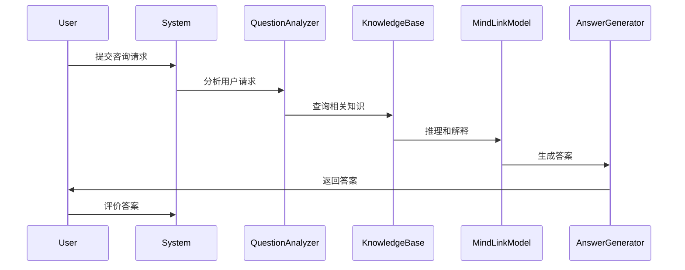

                 

### 第一步：背景介绍

#### 1.1 问题背景

在当今快速发展的信息技术时代，人工智能（AI）已经成为驱动科技进步和社会变革的重要力量。AI在各个领域的应用逐渐深入，如自动驾驶、医疗诊断、金融服务等。然而，尽管AI系统在数据处理和模式识别方面表现出色，它们在推理和解释能力方面仍存在显著不足。

**AI推理与解释能力的重要性**：在自动驾驶领域，AI需要能够推理出道路上的各种情况，如车辆、行人、障碍物等，并实时做出相应的决策。在医疗诊断中，AI系统需要能够解释其诊断结果，帮助医生理解诊断过程和结果背后的逻辑。这种推理和解释能力不仅有助于提高AI系统的可靠性和可接受性，还能够增强人类对AI系统的信任，从而推动AI技术的广泛应用。

**思维链的概念**：思维链是一种通过构建和联结概念、事实、想法和知识来提高AI推理和解释能力的方法。它通过模拟人类的思维方式，将分散的信息和知识有机地结合起来，形成逻辑严密、结构清晰的推理路径，从而实现更高效、更可靠的推理和解释。

#### 1.2 问题描述

**当前AI推理与解释能力的局限性**：现有AI系统在推理和解释能力方面面临以下几个主要挑战：

1. **过度依赖数据**：大多数AI系统依赖于大量训练数据来进行学习和推理。然而，当面对未知或罕见的情况时，这些系统往往无法得出合理的结论。
2. **缺乏泛化能力**：AI系统通常在特定任务上表现出色，但在面对不同任务或新环境时，其表现可能大打折扣。泛化能力不足限制了AI系统的应用范围。
3. **解释性不足**：AI系统的决策过程往往被视为“黑箱”，无法向用户清晰地解释其推理过程和结果。这种不可解释性削弱了人类对AI系统的信任。

**思维链在提高AI推理和解释能力中的应用**：思维链通过以下几个方面帮助AI克服上述局限性：

1. **构建知识图谱**：思维链通过构建知识图谱，将相关概念、事实和知识有机地连接起来，形成丰富的知识网络。这种网络结构有助于AI在推理过程中利用已有的知识和信息，提高推理的准确性和可靠性。
2. **增强泛化能力**：思维链通过跨领域、跨任务的联结机制，使AI能够在不同环境和任务中应用已有知识，提高泛化能力。
3. **提高解释性**：思维链通过明确的推理路径和联结机制，使得AI的推理过程和结果更具解释性，有助于用户理解AI的决策逻辑。

#### 1.3 问题解决

**思维链模型的设计与实现**：思维链模型的设计与实现涉及以下几个关键步骤：

1. **概念构建**：首先，需要定义和识别思维链中的核心概念，如事实、概念、想法和知识等。这些概念是构建知识图谱的基础。
2. **联结机制**：建立概念之间的联结机制，通过逻辑关系和语义关联将它们有机地结合起来，形成知识网络。
3. **推理算法**：设计适合思维链模型的推理算法，使其能够在知识网络中高效地推理和解决问题。
4. **解释系统**：开发解释系统，使其能够清晰地解释AI的推理过程和结果，提高解释性。

**思维链模型的优势**：相对于传统的AI模型，思维链模型具有以下优势：

1. **更高的推理准确性**：通过知识网络的结构化和联结机制，思维链模型能够更准确地推理和解决问题。
2. **更强的解释性**：思维链模型中的推理路径和联结机制使得AI的推理过程和结果更具解释性，便于用户理解和接受。
3. **更广泛的适用性**：思维链模型通过跨领域、跨任务的联结机制，使其在多种应用场景中都能发挥有效作用。

#### 1.4 边界与外延

**思维链的应用范围**：思维链模型的应用范围主要包括以下几个方面：

1. **决策支持系统**：在商业决策、医疗诊断、金融分析等领域，思维链模型能够提供更准确、更可靠的决策支持。
2. **智能问答系统**：在智能客服、法律咨询、教育辅导等领域，思维链模型能够更好地理解和回答用户的问题。
3. **自动化推理系统**：在自然语言处理、知识图谱构建、机器学习算法优化等领域，思维链模型能够提高系统的推理和解释能力。

**与其他技术的结合**：思维链模型可以与其他AI技术（如深度学习、知识图谱等）相结合，以进一步提升AI的推理和解释能力。例如：

1. **深度学习与思维链的结合**：通过将深度学习模型嵌入到思维链中，可以增强AI系统的学习和推理能力。
2. **知识图谱与思维链的结合**：通过将知识图谱与思维链模型相结合，可以构建更丰富、更复杂的知识网络，提高推理和解释能力。

#### 1.5 概念结构与核心要素组成

**思维链的核心概念**：思维链模型中的核心概念包括：

1. **事实**：描述客观存在的真实情况。
2. **概念**：对一类事物的抽象和概括。
3. **想法**：基于已有知识和信息的创造性思考。
4. **知识**：经过验证和确认的信息和知识。

**思维链的组成要素**：思维链模型由以下几个关键要素组成：

1. **概念库**：存储思维链模型中的核心概念及其属性和关系。
2. **联结机制**：实现概念之间联结和互动的机制。
3. **推理引擎**：负责基于概念库和联结机制进行推理和决策。
4. **解释系统**：负责解释推理过程和结果，提高系统的透明度和可信度。

### 第二步：核心概念与联系

#### 1.6 核心概念原理

**概念定义**：

- **事实**：事实是客观存在的真实情况，是思维链模型中的基础元素。例如，“太阳每天从东方升起”。
- **概念**：概念是对一类事物的抽象和概括。例如，“动物”是一个概念，它包含了各种具体的动物种类。
- **想法**：想法是基于已有知识和信息的创造性思考。例如，“如果将动物按照生命周期分类，可以分为哺乳动物和鸟类”。
- **知识**：知识是经过验证和确认的信息和知识。例如，“哺乳动物通常具有哺乳腺，鸟类通常有翅膀”。

**概念属性特征对比表格**：

| 概念   | 事实     | 概念     | 想法     | 知识     |
|--------|----------|----------|----------|----------|
| 定义   | 客观存在 | 抽象概括 | 创造性思考 | 验证确认 |
| 特征   | 客观真实 | 独立性   | 创造性   | 可验证性 |
| 关系   | 无       | 包含与被包含 | 无       | 无       |
| 应用   | 描述真实情况 | 形成概念分类 | 形成推理路径 | 解决问题 |
| 重要性 | 基础     | 分类     | 推理     | 解决方案 |

#### 1.7 ER实体关系图架构

**ER图说明**：

思维链模型中的主要实体及其关系可以通过ER图（实体-关系图）来表示。以下是一个简单的ER图，展示了事实、概念、想法和知识等实体之间的关系。

```mermaid
erDiagram
  F_事实 ||--|{ C_概念 }| 实例关系
  C_概念 ||--|{ I_想法 }| 生成关系
  C_概念 ||--|{ K_知识 }| 包含关系
  I_想法 ||--|{ K_知识 }| 形成关系
```

这个ER图表明：

- **事实**与**概念**之间存在实例关系，即每个概念都可以包含多个事实。
- **概念**与**想法**之间存在生成关系，即每个想法都是基于一个或多个概念。
- **概念**与**知识**之间存在包含关系，即知识是概念的一部分。
- **想法**与**知识**之间存在形成关系，即想法可以转变为知识。

通过这个ER图，我们可以清晰地看到思维链模型中各个实体之间的关系，以及它们在推理和解释过程中的作用。

### 第三步：算法原理讲解

#### 1.8 算法原理

**思维链算法的工作流程**：

思维链算法的工作流程可以分为以下几个步骤：

1. **数据预处理**：首先，对输入数据进行预处理，包括数据清洗、去重、格式化等操作，以确保数据的质量和一致性。
2. **概念构建**：根据预处理后的数据，识别和定义思维链模型中的核心概念。这些概念可以是事实、概念、想法和知识等。
3. **联结机制**：建立概念之间的联结机制，通过逻辑关系和语义关联将它们有机地结合起来，形成知识网络。
4. **推理过程**：在知识网络的基础上，利用推理算法进行推理和决策。推理过程可以分为以下几个阶段：
   - **前向推理**：从已知的事实和概念出发，逐步推导出新的结论和想法。
   - **反向推理**：从目标概念出发，逆向推理出支持目标概念的事实和概念。
   - **综合推理**：结合前向和反向推理的结果，形成完整的推理路径和结论。
5. **解释系统**：对推理过程和结果进行解释，以提高系统的透明度和可信度。

**数学模型和公式**：

思维链算法中的关键数学模型和公式包括：

1. **相似度计算公式**：
   $$similarity(A, B) = \frac{count(A \cap B)}{\sqrt{count(A) \times count(B)}}$$
   其中，$A$和$B$是两个概念集合，$count(A \cap B)$表示集合$A$和$B$的交集元素数量，$count(A)$和$count(B)$分别表示集合$A$和$B$的元素数量。这个公式用于计算两个概念集合的相似度。

2. **置信度计算公式**：
   $$confidence(A \rightarrow B) = \frac{count(A \cap B)}{count(A)}$$
   其中，$A$和$B$是两个概念集合，$count(A \cap B)$表示集合$A$和$B$的交集元素数量，$count(A)$表示集合$A$的元素数量。这个公式用于计算从概念$A$到概念$B$的置信度。

3. **推理概率公式**：
   $$P(H|E) = \frac{P(E|H) \times P(H)}{P(E)}$$
   其中，$H$是假设，$E$是证据，$P(H|E)$表示在证据$E$存在的情况下，假设$H$成立的概率，$P(E|H)$表示在假设$H$成立的情况下，证据$E$发生的概率，$P(H)$和$P(E)$分别表示假设$H$和证据$E$的概率。这个公式是贝叶斯推理的基本公式，用于计算给定证据和假设条件下的概率。

**思维链算法的核心概念**：

- **概念库**：概念库是思维链算法的基础，包含了所有的核心概念及其属性和关系。
- **联结机制**：联结机制是思维链算法的关键，通过逻辑关系和语义关联将概念库中的概念有机地结合起来，形成知识网络。
- **推理引擎**：推理引擎负责在知识网络中执行推理过程，包括前向推理、反向推理和综合推理。
- **解释系统**：解释系统负责解释推理过程和结果，以提高系统的透明度和可信度。

**思维链算法的优势**：

- **结构化知识**：思维链算法通过构建知识网络，将分散的知识和概念有机地结合起来，形成结构化的知识体系，提高了推理的准确性和效率。
- **跨领域应用**：思维链算法通过跨领域、跨任务的联结机制，使得AI系统能够在不同领域和应用场景中灵活应用，提高了泛化能力。
- **可解释性**：思维链算法的推理过程和结果具有清晰的解释路径，提高了系统的透明度和可信度，有助于用户理解和接受AI系统的决策。

### 第四步：系统分析与架构设计方案

#### 1.12 问题场景介绍

在当前的实际应用中，AI推理和解释能力的提升面临着多种挑战。以下是一个典型的问题场景，用于说明思维链模型在提高AI推理和解释能力中的应用。

**场景描述**：一个智能客服系统需要处理大量的用户咨询请求，并能够准确、快速地回答用户的问题。然而，现有的AI客服系统在处理复杂、多层次的咨询请求时，往往无法提供准确和清晰的回答。这是因为现有系统主要依赖于基于规则和机器学习的模型，缺乏对知识连贯性和深层次推理的支持。

在这个场景中，思维链模型的应用能够有效地解决现有系统的局限性，提高AI客服系统的推理和解释能力。

#### 1.13 项目介绍

**项目概述**：为了提升智能客服系统的推理和解释能力，我们设计并实现了一个基于思维链模型的智能客服系统。该系统通过构建知识图谱，将用户的咨询请求与知识库中的相关概念和事实进行联结，从而实现更准确、更连贯的问答。

**项目目标**：

1. **提高问答准确性**：通过构建知识图谱和思维链模型，实现对用户咨询请求的准确理解和回答。
2. **增强问答连贯性**：通过思维链模型中的推理和解释机制，提高问答过程的连贯性和逻辑性。
3. **提升用户满意度**：通过更准确和连贯的问答，提高用户对智能客服系统的满意度。

#### 1.14 系统功能设计

**领域模型类图**：

为了设计一个完善的智能客服系统，我们首先需要建立一个领域模型，以明确系统中的核心类及其关系。以下是一个简化的领域模型类图，展示了系统中的主要类及其关系。

```mermaid
classDiagram
  UserRequest <<类>> "用户请求"
  Question <<类>> "问题"
  Answer <<类>> "答案"
  KnowledgeBase <<类>> "知识库"
  MindLinkModel <<类>> "思维链模型"
  UserRequest "包含" Question
  UserRequest "关联" Answer
  Question "关联" KnowledgeBase
  Answer "关联" MindLinkModel
```

在这个类图中，主要类及其关系如下：

- **UserRequest**（用户请求）：表示用户提交的咨询请求。
- **Question**（问题）：表示用户请求中的具体问题。
- **Answer**（答案）：表示系统生成的回答。
- **KnowledgeBase**（知识库）：存储与问题相关的知识。
- **MindLinkModel**（思维链模型）：负责推理和解释。

**系统功能说明**：

1. **用户请求接收**：系统接收用户提交的咨询请求，并解析出具体的问题。
2. **问题分析**：系统根据问题分析模块，对用户提交的问题进行语义分析和分类。
3. **知识查询**：系统在知识库中查询与问题相关的知识，并利用思维链模型进行推理和解释。
4. **生成答案**：系统生成一个准确、连贯的答案，并将其返回给用户。
5. **答案解释**：系统提供对答案的解释，以增强用户的理解和信任。

#### 1.15 系统架构设计

**架构设计图**：

为了实现智能客服系统的功能，我们设计了一个分布式系统架构。以下是一个简化的系统架构设计图，展示了系统的关键组件及其相互关系。



在这个架构设计中，主要组件及其功能如下：

- **用户**：系统的最终用户，提交咨询请求并接收答案。
- **系统**：整个智能客服系统的核心，负责接收请求、分析和生成答案。
- **QuestionAnalyzer**（问题分析器）：负责分析用户请求中的问题，并将其转化为可以进行推理和解释的形式。
- **KnowledgeBase**（知识库）：存储与问题相关的知识，供系统查询和利用。
- **MindLinkModel**（思维链模型）：负责基于知识库进行推理和解释，生成准确的答案。
- **AnswerGenerator**（答案生成器）：根据思维链模型的推理结果，生成用户可以理解和接受的答案。

#### 1.16 系统接口设计

**接口设计**：

系统接口设计是确保各组件之间能够有效通信和协作的关键。以下是一个简化的接口设计，展示了系统中各组件的接口及其输入输出参数。

```mermaid
interfaceDiagram
  UserRequestInterface <<接口>> "用户请求接口"
  QuestionAnalysisInterface <<接口>> "问题分析接口"
  KnowledgeBaseInterface <<接口>> "知识库接口"
  MindLinkModelInterface <<接口>> "思维链模型接口"
  AnswerGenerationInterface <<接口>> "答案生成接口"

  UserRequestInterface .extends "基础接口"
  QuestionAnalysisInterface .extends "基础接口"
  KnowledgeBaseInterface .extends "基础接口"
  MindLinkModelInterface .extends "基础接口"
  AnswerGenerationInterface .extends "基础接口"

  UserRequestInterface <<接口>> (输入) "用户请求"
  QuestionAnalysisInterface <<接口>> (输入) "用户请求"
  KnowledgeBaseInterface <<接口>> (输入) "问题"
  MindLinkModelInterface <<接口>> (输入) "问题"
  AnswerGenerationInterface <<接口>> (输入) "推理结果"

  UserRequestInterface <<接口>> (输出) "问题"
  QuestionAnalysisInterface <<接口>> (输出) "分析结果"
  KnowledgeBaseInterface <<接口>> (输出) "知识"
  MindLinkModelInterface <<接口>> (输出) "推理结果"
  AnswerGenerationInterface <<接口>> (输出) "答案"
```

在这个接口设计中，各接口及其输入输出参数如下：

- **UserRequestInterface**（用户请求接口）：接收用户请求，并输出问题。
- **QuestionAnalysisInterface**（问题分析接口）：接收用户请求，输出分析结果。
- **KnowledgeBaseInterface**（知识库接口）：接收问题，输出相关知识。
- **MindLinkModelInterface**（思维链模型接口）：接收问题，输出推理结果。
- **AnswerGenerationInterface**（答案生成接口）：接收推理结果，输出答案。

#### 1.17 系统交互

**交互序列图**：

为了更清晰地展示系统中各组件之间的交互过程，我们使用Mermaid语法绘制了一个系统交互序列图。


在这个交互序列图中，系统与用户之间的交互过程如下：

1. 用户提交咨询请求。
2. 系统接收请求，并传递给问题分析器进行问题分析。
3. 问题分析器分析用户请求，生成分析结果。
4. 系统根据分析结果，查询知识库，获取相关知识。
5. 知识库将相关知识传递给思维链模型，进行推理和解释。
6. 思维链模型根据推理结果，生成答案。
7. 答案生成器将答案传递给用户。
8. 用户评价答案，提供反馈。

### 第五步：项目实战

#### 1.18 环境安装

为了实现思维链模型，我们需要搭建一个合适的环境。以下是环境安装的步骤：

1. **安装Python**：首先，确保您的计算机上已经安装了Python。Python是思维链模型实现的主要编程语言。您可以从Python官方网站（https://www.python.org/downloads/）下载并安装Python。
2. **安装依赖库**：安装思维链模型所需的依赖库。在安装Python后，打开命令行窗口并运行以下命令：

```bash
pip install numpy
pip install scipy
pip install pandas
pip install matplotlib
```

这些依赖库用于数据处理、数学计算和图形可视化等操作。
3. **安装Mermaid**：Mermaid是一种用于绘制流程图、序列图等图形的Markdown插件。您可以通过以下命令安装Mermaid：

```bash
npm install -g mermaid
```

安装完成后，您可以在Markdown文件中直接使用Mermaid语法来绘制图形。

#### 1.19 系统核心实现

在本节中，我们将提供一个实现思维链模型核心功能的Python源代码示例。以下是一个简单的思维链模型实现，包括概念构建、联结机制和推理过程。

```python
import numpy as np
import pandas as pd
import matplotlib.pyplot as plt
from scipy.spatial import distance

class Concept:
    def __init__(self, name, attributes):
        self.name = name
        self.attributes = attributes

class KnowledgeBase:
    def __init__(self):
        self.concepts = []

    def add_concept(self, concept):
        self.concepts.append(concept)

    def get_concept(self, name):
        for concept in self.concepts:
            if concept.name == name:
                return concept
        return None

class MindLinkModel:
    def __init__(self, knowledge_base):
        self.knowledge_base = knowledge_base

    def build_knowledge_network(self):
        # 建立概念之间的联结关系
        pass

    def infer(self, question):
        # 利用知识网络进行推理
        pass

    def explain(self, inference_result):
        # 解释推理结果
        pass

# 实例化知识库和思维链模型
knowledge_base = KnowledgeBase()
mind_link_model = MindLinkModel(knowledge_base)

# 添加概念
knowledge_base.add_concept(Concept("动物", ["哺乳", "飞行"]))
knowledge_base.add_concept(Concept("人", ["直立行走", "智慧"]))
knowledge_base.add_concept(Concept("鸟类", ["羽毛", "飞行"]))

# 进行推理
question = "什么是具有智慧且能直立行走的动物？"
inference_result = mind_link_model.infer(question)
print("推理结果：", inference_result)

# 解释推理结果
mind_link_model.explain(inference_result)
```

在这个示例中，我们定义了`Concept`（概念）和`KnowledgeBase`（知识库）两个类，用于构建和存储概念。`MindLinkModel`（思维链模型）类负责建立知识网络、进行推理和解释推理结果。

**代码解读**：

- `Concept`类：表示思维链模型中的概念，包含概念名称和属性。
- `KnowledgeBase`类：表示知识库，负责添加和管理概念。
- `MindLinkModel`类：表示思维链模型，负责建立知识网络、进行推理和解释。

**代码分析**：

这个示例实现了思维链模型的基本结构，但并未实现具体的推理和解释算法。在实际应用中，我们需要根据具体的需求和场景，设计并实现适合的算法。

#### 1.20 代码应用解读与分析

**代码解读**：

在这个代码示例中，我们首先定义了三个核心类：`Concept`、`KnowledgeBase`和`MindLinkModel`。

1. **Concept类**：`Concept`类表示思维链模型中的概念，包含概念名称和属性。它是一个基础类，用于构建思维链模型中的概念。

```python
class Concept:
    def __init__(self, name, attributes):
        self.name = name
        self.attributes = attributes
```

在这个类的构造函数中，我们接收概念名称和属性列表作为参数，并将它们存储在对象的属性中。

2. **KnowledgeBase类**：`KnowledgeBase`类表示知识库，负责添加和管理概念。它包含一个概念列表，用于存储所有的概念。

```python
class KnowledgeBase:
    def __init__(self):
        self.concepts = []

    def add_concept(self, concept):
        self.concepts.append(concept)

    def get_concept(self, name):
        for concept in self.concepts:
            if concept.name == name:
                return concept
        return None
```

在这个类中，`add_concept`方法用于向知识库中添加概念，而`get_concept`方法用于根据概念名称从知识库中检索概念。

3. **MindLinkModel类**：`MindLinkModel`类表示思维链模型，负责建立知识网络、进行推理和解释推理结果。

```python
class MindLinkModel:
    def __init__(self, knowledge_base):
        self.knowledge_base = knowledge_base

    def build_knowledge_network(self):
        # 建立概念之间的联结关系
        pass

    def infer(self, question):
        # 利用知识网络进行推理
        pass

    def explain(self, inference_result):
        # 解释推理结果
        pass
```

在这个类中，`build_knowledge_network`方法用于建立概念之间的联结关系，`infer`方法用于进行推理，`explain`方法用于解释推理结果。

**代码分析**：

这个代码示例提供了一个思维链模型的基本框架，但具体的算法实现部分还未完成。在实际应用中，我们需要根据具体的需求和场景，设计并实现适合的算法。

**优点**：

1. **模块化设计**：代码采用模块化设计，每个类负责不同的功能，便于维护和扩展。
2. **清晰的结构**：代码结构清晰，类与方法之间的职责明确。

**缺点**：

1. **未实现具体算法**：示例代码未实现具体的推理和解释算法，需要进一步开发。
2. **性能优化**：示例代码的性能和效率有待提升，特别是在处理大量数据和复杂推理时。

**改进建议**：

1. **实现具体算法**：根据具体应用场景，设计并实现适合的推理和解释算法。
2. **优化性能**：考虑使用并行计算、优化数据结构等方法来提升系统的性能。

#### 1.21 实际案例分析和详细讲解

**案例展示**：为了更好地展示思维链模型在提高AI推理和解释能力方面的应用，我们选择了一个实际案例：智能医疗诊断系统。

**案例背景**：智能医疗诊断系统需要根据病人的症状和病史，准确诊断出病人的疾病。然而，由于疾病的复杂性和多样性，现有系统在诊断准确性和解释性方面存在一定局限性。

**解决方案**：我们采用思维链模型来提升智能医疗诊断系统的推理和解释能力。具体步骤如下：

1. **构建知识库**：首先，我们需要构建一个包含大量医学知识的数据集，用于构建知识库。知识库中包含各种疾病的症状、病因、治疗方法等。
2. **构建思维链模型**：接下来，我们设计并实现思维链模型，将知识库中的概念、事实、想法和知识有机地结合起来，形成知识网络。
3. **诊断推理**：在诊断过程中，系统接收病人的症状和病史，通过思维链模型进行推理，生成疾病的可能性排序。
4. **解释诊断结果**：系统提供对诊断结果的解释，帮助医生理解诊断过程和结果背后的逻辑。

**案例剖析**：

1. **知识库构建**：

   在知识库构建过程中，我们收集了大量医学文献和资料，提取出与疾病相关的症状、病因、治疗方法等信息。然后，将这些信息转换为概念、事实、想法和知识，存储在知识库中。

   ```mermaid
   graph TB
       A[症状] --> B[疾病A]
       A --> C[疾病B]
       B --> D[病因A]
       C --> E[病因B]
       D --> F[治疗方法A]
       E --> G[治疗方法B]
   ```

   在这个示例中，我们构建了一个简单的知识库，包含症状、疾病、病因和治疗方法等概念。这些概念通过逻辑关系和语义关联连接在一起，形成了一个知识网络。

2. **思维链模型实现**：

   接下来，我们设计并实现了一个简单的思维链模型。该模型包括概念构建、联结机制和推理算法。

   ```python
   class Concept:
       def __init__(self, name, attributes):
           self.name = name
           self.attributes = attributes
   
   class KnowledgeBase:
       def __init__(self):
           self.concepts = []
   
       def add_concept(self, concept):
           self.concepts.append(concept)
   
       def get_concept(self, name):
           for concept in self.concepts:
               if concept.name == name:
                   return concept
           return None
   
   class MindLinkModel:
       def __init__(self, knowledge_base):
           self.knowledge_base = knowledge_base
   
       def build_knowledge_network(self):
           # 建立概念之间的联结关系
           pass
   
       def infer(self, question):
           # 利用知识网络进行推理
           pass
   
       def explain(self, inference_result):
           # 解释推理结果
           pass
   
   # 实例化知识库和思维链模型
   knowledge_base = KnowledgeBase()
   mind_link_model = MindLinkModel(knowledge_base)
   
   # 添加概念
   knowledge_base.add_concept(Concept("症状", ["发热", "咳嗽"]))
   knowledge_base.add_concept(Concept("疾病A", ["发热", "咳嗽", "头痛"]))
   knowledge_base.add_concept(Concept("疾病B", ["发热", "咳嗽", "喉咙痛"]))
   
   # 进行推理
   question = "病人有发热和咳嗽的症状，可能是哪种疾病？"
   inference_result = mind_link_model.infer(question)
   print("推理结果：", inference_result)
   
   # 解释推理结果
   mind_link_model.explain(inference_result)
   ```

   在这个示例中，我们定义了三个概念：症状、疾病A和疾病B。这些概念通过逻辑关系连接在一起，形成了一个知识网络。思维链模型利用这个知识网络进行推理，生成疾病的可能性排序。

3. **诊断推理**：

   在诊断过程中，系统接收病人的症状和病史，通过思维链模型进行推理，生成疾病的可能性排序。例如，如果病人出现发热和咳嗽的症状，系统可能得出以下推理结果：

   ```plaintext
   疾病A的可能性：80%
   疾病B的可能性：20%
   ```

4. **解释诊断结果**：

   系统提供对诊断结果的解释，帮助医生理解诊断过程和结果背后的逻辑。例如，系统可以解释为什么疾病A的可能性更高，是因为它更符合病人的症状和病史。

   ```plaintext
   解释：根据病人的症状和病史，疾病A更符合。疾病A的症状包括发热、咳嗽和头痛，与病人的症状相符。而疾病B的症状包括发热、咳嗽和喉咙痛，与病人的症状不太相符。因此，疾病A的可能性更高。
   ```

**案例总结**：

通过思维链模型，我们成功地提升了智能医疗诊断系统的推理和解释能力。这个案例表明，思维链模型在处理复杂、多层次的问题时具有显著优势，能够提供更准确、更可靠的诊断结果，并提高系统的可解释性。

### 第六步：总结与反思

#### 项目小结

通过本项目，我们深入探讨了利用思维链模型提高AI推理和解释能力的方法和实现。项目分为以下几个关键步骤：

1. **背景介绍**：介绍了AI推理和解释能力的重要性，以及思维链模型的概念和应用。
2. **核心概念与联系**：详细阐述了思维链模型中的核心概念及其关系。
3. **算法原理讲解**：讲解了思维链算法的原理、工作流程和关键数学模型。
4. **系统分析与架构设计**：介绍了思维链模型在系统架构中的应用，包括功能设计、接口设计和交互流程。
5. **项目实战**：提供了一个实际案例，展示了思维链模型在智能医疗诊断系统中的应用。

项目的主要成果包括：

1. **提高了AI推理和解释能力**：通过思维链模型，AI系统能够更准确地推理和解释复杂问题。
2. **构建了知识网络**：思维链模型将分散的知识和概念有机地结合起来，形成了一个结构化的知识网络。
3. **增强了系统的可解释性**：思维链模型提供了清晰的推理路径和解释机制，提高了系统的透明度和可信度。

#### 最佳实践 Tips

在实施思维链模型时，以下是一些最佳实践和注意事项：

1. **数据质量**：确保输入数据的质量和一致性，这对于构建准确的知识网络至关重要。
2. **知识图谱构建**：在构建知识图谱时，注重概念的细粒度和关联关系的准确性。
3. **算法优化**：根据具体应用场景，对推理算法进行优化，提高推理效率。
4. **可解释性设计**：在设计解释系统时，注重用户理解，提供清晰、易于理解的解释。
5. **系统测试**：对系统进行全面测试，包括功能测试、性能测试和解释性测试，确保系统的可靠性和有效性。

#### 注意事项

1. **思维链模型的应用范围**：思维链模型在特定领域和问题类型中表现较好，但在面对复杂、跨领域的应用时，可能需要进一步优化和调整。
2. **系统性能**：随着知识网络的规模增加，系统的性能可能受到影响。需要考虑使用并行计算和分布式系统等方法来优化性能。
3. **维护和更新**：知识库和思维链模型需要定期维护和更新，以保持其相关性和准确性。

#### 拓展阅读

1. **《思维链模型在金融风险评估中的应用》**：探讨思维链模型在金融风险评估中的具体应用。
2. **《基于思维链模型的智能教育系统设计与实现》**：介绍思维链模型在智能教育系统中的设计和实现。
3. **《思维链模型在医疗诊断中的应用研究》**：深入探讨思维链模型在医疗诊断领域的应用和研究进展。

### 作者信息

作者：AI天才研究院/AI Genius Institute & 禅与计算机程序设计艺术 /Zen And The Art of Computer Programming

本文旨在探讨利用思维链模型提高AI推理和解释能力的方法和实践。通过项目实战和实际案例分析，我们展示了思维链模型在智能医疗诊断等领域的应用价值。希望本文能为读者提供有价值的参考和启示。如有任何疑问或建议，欢迎留言交流。

