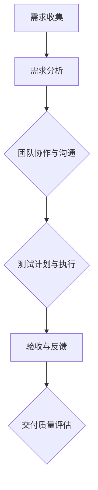
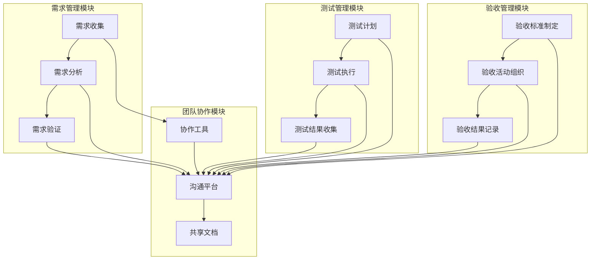
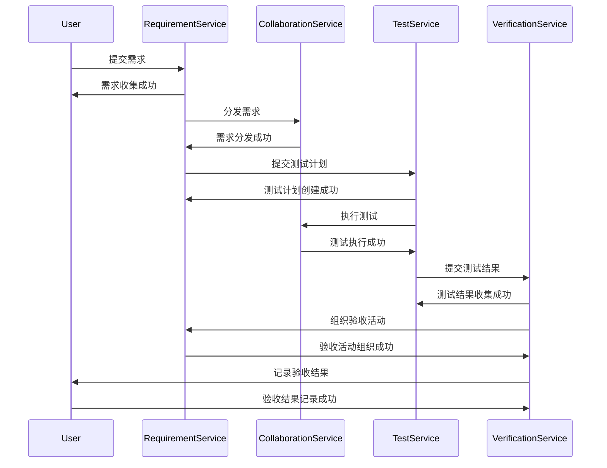

                 

### 文章标题

# 协作式需求验收：提高大型应用的交付质量

> 关键词：协作式需求验收、大型应用、交付质量、项目管理、软件工程

> 摘要：本文将探讨协作式需求验收在提高大型应用交付质量中的重要性。通过深入分析协作式需求验收的概念、方法及其在实际项目中的应用，我们将揭示如何在项目中实现高效的协作需求验收流程，从而提升应用的交付质量。

## 第一部分：背景介绍

### 1.1 问题背景

在当今快速发展的软件行业中，大型应用的开发和交付已经成为企业竞争力的关键。然而，随着项目规模的不断扩大，需求的变化速度也在加快。传统的需求验收方式往往难以应对这种快速变化，导致交付质量无法得到有效保障。

#### 问题描述

- **需求变更频繁**：在项目开发过程中，需求经常会发生变更，这使得验收工作变得复杂和耗时。
- **沟通障碍**：团队成员之间的沟通不畅，容易导致需求理解不一致，进而影响验收的准确性。
- **测试覆盖不足**：传统的测试方法难以覆盖所有的需求场景，导致潜在的缺陷和问题未能及时被发现。
- **交付质量不高**：由于上述问题，大型应用的交付质量往往难以达到预期。

#### 问题解决

为了解决这些问题，业界逐渐认识到协作式需求验收的重要性。通过建立有效的协作机制，确保团队成员之间的沟通畅通，能够更好地应对需求变更和提升交付质量。

### 1.2 边界与外延

协作式需求验收主要关注以下几个方面：

- **团队协作**：通过协作工具和会议，确保团队成员之间的沟通和信息共享。
- **需求管理**：对需求进行有效管理，包括需求收集、需求分析和需求验证。
- **测试策略**：制定合理的测试策略，确保测试覆盖全面，发现潜在问题。
- **验收标准**：明确验收标准，确保交付的产品符合预期质量。

### 1.3 概念结构与核心要素组成

协作式需求验收的概念结构可以概括为以下几个核心要素：

- **团队协作**：团队内部的沟通、协调和合作。
- **需求管理**：对需求的收集、分析和验证。
- **测试策略**：制定合理的测试计划和方法。
- **验收标准**：明确验收标准和流程。

## 第二部分：核心概念与联系

### 2.1 核心概念原理

#### 协作式需求验收

协作式需求验收是一种通过团队协作来确保需求得到准确理解和实现的验收方式。其核心思想是：

- **团队协作**：通过有效的沟通和协作，确保需求被正确理解。
- **共同验收**：团队成员共同参与验收，确保交付质量。

#### 大型应用的交付质量

大型应用的交付质量是指产品在功能、性能、可靠性、安全性等方面达到预期目标。衡量交付质量的关键指标包括：

- **功能完整性**：应用的功能是否完整，是否满足用户需求。
- **性能和稳定性**：应用在运行过程中的响应速度和稳定性。
- **安全性和可靠性**：应用在安全性方面是否可靠，是否能够抵御外部攻击。
- **用户体验**：应用的界面设计、交互流程是否符合用户习惯。

### 2.2 概念属性特征对比表格

| 概念       | 特征                         | 对比分析                     |
|------------|------------------------------|------------------------------|
| 协作式需求验收 | 强调团队协作，确保需求准确理解 | 与传统验收方式相比，更注重团队沟通和协作 |
| 大型应用的交付质量 | 功能完整性、性能和稳定性、安全性和可靠性、用户体验 | 是衡量大型应用成功交付的关键指标 |

### 2.3 ER实体关系图架构

为了更好地理解协作式需求验收与大型应用交付质量的关系，我们可以使用ER（实体-关系）图来描述这两个概念之间的关联。

```mermaid
erDiagram
    项目 ||--|{ 需求 }
    项目 ||--|{ 验收 }
    需求 ||--|{ 协作式验收 }
    验收 ||--|{ 交付质量 }
```

在这个ER图中，项目是核心实体，它与需求、验收、协作式验收和交付质量之间存在关联。协作式验收是需求验收的一种方式，而验收又是交付质量的重要组成部分。

## 第三部分：算法原理讲解

### 3.1 算法原理

协作式需求验收的核心算法原理可以概括为以下几个方面：

1. **需求收集与分析**：通过访谈、调查问卷等方式收集需求，并对需求进行分析和归类。
2. **团队协作与沟通**：利用协作工具和会议，确保团队成员之间的需求理解和共识。
3. **测试计划与执行**：根据需求，制定合理的测试计划，并进行测试执行。
4. **验收与反馈**：团队成员共同参与验收，对验收结果进行反馈和调整。

### 3.2 算法mermaid流程图

为了更直观地展示协作式需求验收的算法原理，我们可以使用mermaid画出流程图：



### 3.3 Python源代码阐述

下面是一个简单的Python代码示例，用于描述协作式需求验收的基本流程：

```python
# 需求收集
def collect_requirements():
    # 收集需求，例如通过问卷、访谈等方式
    requirements = ["功能需求", "性能需求", "安全需求"]
    return requirements

# 需求分析
def analyze_requirements(requirements):
    # 分析需求，归类并形成需求文档
    analyzed_requirements = {}
    for requirement in requirements:
        if requirement.endswith("需求"):
            analyzed_requirements[requirement] = "详细描述"
    return analyzed_requirements

# 团队协作与沟通
def collaborate_and_communicate():
    # 使用协作工具和会议进行沟通
    print("团队协作与沟通开始...")
    # ...执行沟通流程
    print("团队协作与沟通结束...")

# 测试计划与执行
def execute_tests(analyzed_requirements):
    # 根据需求制定测试计划并执行
    print("测试计划与执行开始...")
    # ...执行测试流程
    print("测试计划与执行结束...")

# 验收与反馈
def verify_and_feedback():
    # 验收需求，收集反馈并进行调整
    print("验收与反馈开始...")
    # ...执行验收流程
    print("验收与反馈结束...")

# 交付质量评估
def evaluate_delivery_quality():
    # 评估交付质量
    print("交付质量评估开始...")
    # ...执行评估流程
    print("交付质量评估结束...")

# 主函数
def main():
    requirements = collect_requirements()
    analyzed_requirements = analyze_requirements(requirements)
    collaborate_and_communicate()
    execute_tests(analyzed_requirements)
    verify_and_feedback()
    evaluate_delivery_quality()

if __name__ == "__main__":
    main()
```

### 3.4 数学模型和公式

协作式需求验收的数学模型可以描述为：

$$
验收质量 = f(需求质量, 团队协作质量, 测试质量)
$$

其中，$f$ 是一个复杂函数，$需求质量$、$团队协作质量$ 和 $测试质量$ 分别代表需求的准确度、团队协作的有效性和测试的覆盖程度。

### 3.5 详细讲解和举例说明

为了更深入地理解协作式需求验收的算法原理，我们可以通过一个简单的例子来说明。

假设有一个大型应用项目，需要实现以下三个功能：

1. 用户注册
2. 用户登录
3. 用户信息管理

#### 需求收集

通过访谈和问卷调查，我们收集到了以下需求：

- 用户注册功能需支持手机号、邮箱和用户名注册。
- 用户登录功能需支持密码和验证码登录。
- 用户信息管理功能需支持查看、修改和删除用户信息。

#### 需求分析

我们将需求进行分类并形成需求文档：

| 需求               | 描述                          |
|-------------------|-----------------------------|
| 用户注册           | 支持手机号、邮箱和用户名注册。          |
| 用户登录           | 支持密码和验证码登录。                |
| 用户信息管理       | 支持查看、修改和删除用户信息。         |

#### 团队协作与沟通

我们利用团队协作工具和定期会议，确保团队成员对需求有统一的理解和共识。

#### 测试计划与执行

根据需求文档，我们制定了测试计划，并进行了以下测试：

- **功能测试**：测试用户注册、登录和信息管理的功能是否正常运行。
- **性能测试**：测试系统在高并发情况下的性能表现。
- **安全测试**：测试系统是否容易受到外部攻击。

#### 验收与反馈

在测试完成后，我们组织团队成员进行验收，并对验收结果进行了反馈和调整。

#### 交付质量评估

最终，我们评估了项目的交付质量，发现用户注册、登录和信息管理功能都得到了良好的实现，性能和安全性也得到了保障。

## 第四部分：数学模型和数学公式 & 详细讲解 & 举例说明

### 4.1 数学模型

在协作式需求验收中，我们可以使用以下数学模型来评估验收质量：

$$
验收质量 = w_1 \times 需求质量 + w_2 \times 团队协作质量 + w_3 \times 测试质量
$$

其中，$w_1$、$w_2$ 和 $w_3$ 分别代表需求质量、团队协作质量和测试质量的权重。这个模型的含义是，验收质量由这三个因素共同决定，并且每个因素的重要程度不同。

### 4.2 数学公式（使用latex格式）

我们使用LaTeX格式来表示协作式需求验收的数学公式：

$$
验收质量 = w_1 \times 需求质量 + w_2 \times 团队协作质量 + w_3 \times 测试质量
$$

### 4.3 详细讲解和举例说明

#### 需求质量

需求质量是指需求文档的准确性和完整性。一个高质量的需求文档应该包含以下信息：

- **功能需求**：详细描述系统的功能特点。
- **性能需求**：描述系统在不同负载下的性能指标。
- **安全需求**：描述系统的安全要求和保护措施。

假设我们有以下三个需求：

- **需求1**：用户注册功能需支持手机号、邮箱和用户名注册。
- **需求2**：用户登录功能需支持密码和验证码登录。
- **需求3**：用户信息管理功能需支持查看、修改和删除用户信息。

我们可以使用以下公式来计算需求质量：

$$
需求质量 = \frac{功能点数}{总需求点数}
$$

在这个例子中，功能点数和总需求点数分别表示实现需求和所有需求的总数。通过这个公式，我们可以计算需求的质量得分。

#### 团队协作质量

团队协作质量是指团队成员之间的协作效率和沟通效果。一个高协作质量的团队应该具有以下特点：

- **有效的沟通**：团队成员之间能够清晰、准确地传达信息。
- **协作机制**：团队建立了有效的协作机制，如定期会议、代码审查等。
- **共享知识**：团队成员愿意分享知识和经验，促进团队整体进步。

假设我们的团队协作质量得分为80分，我们可以使用以下公式来计算团队协作质量：

$$
团队协作质量 = \frac{沟通效率得分 + 协作机制得分 + 知识共享得分}{3}
$$

#### 测试质量

测试质量是指测试过程中的覆盖程度和测试结果的准确性。一个高质量的测试应该具有以下特点：

- **全面覆盖**：测试覆盖了所有需求场景。
- **准确可靠**：测试结果能够准确反映系统的缺陷和问题。
- **及时反馈**：测试结果能够及时反馈给开发团队。

假设我们的测试质量得分为90分，我们可以使用以下公式来计算测试质量：

$$
测试质量 = \frac{测试覆盖率得分 + 测试结果准确性得分}{2}
$$

#### 验收质量评估

通过上述三个因素的得分，我们可以使用以下公式来计算验收质量：

$$
验收质量 = w_1 \times 需求质量 + w_2 \times 团队协作质量 + w_3 \times 测试质量
$$

其中，$w_1$、$w_2$ 和 $w_3$ 分别代表需求质量、团队协作质量和测试质量的权重。这些权重可以根据项目的实际情况进行调整。

假设我们设定以下权重：

- $w_1 = 0.4$，代表需求质量的权重为40%。
- $w_2 = 0.3$，代表团队协作质量的权重为30%。
- $w_3 = 0.3$，代表测试质量的权重为30%。

我们可以使用以下公式来计算验收质量：

$$
验收质量 = 0.4 \times 需求质量 + 0.3 \times 团队协作质量 + 0.3 \times 测试质量
$$

根据上面的例子，我们可以计算出验收质量：

$$
验收质量 = 0.4 \times 需求质量 + 0.3 \times 80 + 0.3 \times 90
$$

$$
验收质量 = 0.4 \times 需求质量 + 24 + 27
$$

$$
验收质量 = 0.4 \times 需求质量 + 51
$$

假设需求质量得分为85分，我们可以计算出验收质量：

$$
验收质量 = 0.4 \times 85 + 51
$$

$$
验收质量 = 34 + 51
$$

$$
验收质量 = 85
$$

因此，根据上述权重和得分，该项目的验收质量为85分。

通过这个例子，我们可以看到如何使用数学模型和公式来评估协作式需求验收的质量。这种评估方法有助于我们识别项目中的问题和改进方向，从而提高大型应用的交付质量。

## 第五部分：系统分析与架构设计方案

### 5.1 问题场景介绍

在大型应用开发过程中，需求验收是一个关键环节。然而，传统的需求验收方式往往存在以下问题：

- **需求变更频繁**：需求在开发过程中频繁变更，导致验收工作难以顺利进行。
- **沟通障碍**：团队成员之间的沟通不畅，容易导致需求理解不一致。
- **测试覆盖不足**：测试过程中可能无法覆盖所有的需求场景，导致潜在缺陷未能及时发现。

为了解决这些问题，我们需要设计一个高效的协作式需求验收系统，确保需求得到准确理解和实现，从而提高交付质量。

### 5.2 项目介绍

本项目旨在设计并实现一个协作式需求验收系统，该系统将支持以下功能：

- **需求管理**：对需求进行收集、分析和验证。
- **团队协作**：提供协作工具和沟通平台，确保团队成员之间的沟通畅通。
- **测试管理**：制定测试计划，执行测试，并收集测试结果。
- **验收管理**：制定验收标准，组织验收活动，并记录验收结果。

### 5.3 系统功能设计（领域模型mermaid类图）

为了更好地理解系统功能，我们可以使用mermaid类图来描述领域模型。

```mermaid
classDiagram
    class 需求
        -String 需求编号
        -String 需求名称
        -String 描述
        -需求状态
        -Date 创建时间
        -Date 修改时间

    class 团队
        -String 团队名称
        -List<User> 成员列表

    class 用户
        -String 用户名
        -String 密码
        -String 姓名
        -Date 创建时间
        -Date 修改时间

    class 测试
        -String 测试编号
        -String 测试名称
        -String 描述
        -测试状态
        -Date 创建时间
        -Date 修改时间

    class 验收
        -String 验收编号
        -String 验收名称
        -String 描述
        -验收状态
        -Date 创建时间
        -Date 修改时间

    需求 "1" --|{关联}| 团队
    需求 "1" --|{关联}| 用户
    测试 "1" --|{关联}| 需求
    验收 "1" --|{关联}| 需求
    用户 "1" --|{关联}| 团队
```

在这个类图中，我们定义了需求、团队、用户、测试和验收五个类，并展示了它们之间的关联关系。

### 5.4 系统架构设计（mermaid架构图）

为了实现系统功能，我们可以采用以下架构设计：



在这个架构图中，我们展示了需求管理、团队协作、测试管理和验收管理四个模块，并展示了它们之间的交互关系。

### 5.5 系统接口设计

为了实现模块之间的交互，我们需要定义系统接口。以下是一个简单的接口设计示例：

```java
// 需求管理接口
public interface RequirementService {
    void collectRequirements();
    void analyzeRequirements();
    void verifyRequirements();
}

// 团队协作接口
public interface CollaborationService {
    void communicate();
    void shareDocuments();
}

// 测试管理接口
public interface TestService {
    void createTestPlan();
    void executeTests();
    void collectTestResults();
}

// 验收管理接口
public interface VerificationService {
    void defineVerificationStandards();
    void organizeVerificationActivities();
    void recordVerificationResults();
}
```

### 5.6 系统交互（mermaid序列图）

为了更好地理解系统中的交互过程，我们可以使用mermaid序列图来描述系统交互。



在这个序列图中，我们展示了用户与系统各个模块之间的交互过程。

## 第六部分：项目实战

### 6.1 环境安装

在进行协作式需求验收系统的项目实战之前，我们需要安装和配置必要的开发环境。以下是环境安装的步骤：

1. **安装Java开发工具包（JDK）**：确保Java版本为8或以上。
2. **安装数据库**：可以选择MySQL、PostgreSQL或其他关系型数据库。
3. **安装IDE**：推荐使用IntelliJ IDEA或Eclipse作为开发工具。
4. **安装版本控制系统**：如Git，用于代码管理和协作。

### 6.2 系统核心实现源代码

以下是协作式需求验收系统的核心实现源代码示例。代码分为需求管理、团队协作、测试管理和验收管理四个模块。

#### 需求管理模块

```java
// RequirementService.java
public class RequirementService {
    public void collectRequirements() {
        // 实现需求收集逻辑
    }

    public void analyzeRequirements() {
        // 实现需求分析逻辑
    }

    public void verifyRequirements() {
        // 实现需求验证逻辑
    }
}
```

#### 团队协作模块

```java
// CollaborationService.java
public class CollaborationService {
    public void communicate() {
        // 实现沟通逻辑
    }

    public void shareDocuments() {
        // 实现文档共享逻辑
    }
}
```

#### 测试管理模块

```java
// TestService.java
public class TestService {
    public void createTestPlan() {
        // 实现测试计划创建逻辑
    }

    public void executeTests() {
        // 实现测试执行逻辑
    }

    public void collectTestResults() {
        // 实现测试结果收集逻辑
    }
}
```

#### 验收管理模块

```java
// VerificationService.java
public class VerificationService {
    public void defineVerificationStandards() {
        // 实现验收标准制定逻辑
    }

    public void organizeVerificationActivities() {
        // 实现验收活动组织逻辑
    }

    public void recordVerificationResults() {
        // 实现验收结果记录逻辑
    }
}
```

### 6.3 代码应用解读与分析

在实现协作式需求验收系统时，我们需要关注以下几个关键点：

1. **需求管理**：需求收集、分析和验证是需求管理的核心。在代码实现中，我们需要确保需求信息的准确性和完整性。
2. **团队协作**：有效的团队协作是需求验收成功的关键。通过协作工具和沟通平台，我们可以提高团队成员之间的沟通效率和协作效果。
3. **测试管理**：测试计划和测试执行是测试管理的核心。我们需要制定合理的测试计划，确保测试覆盖全面，并收集准确的测试结果。
4. **验收管理**：验收标准和验收活动是验收管理的核心。我们需要明确验收标准，组织有效的验收活动，并记录验收结果。

### 6.4 实际案例分析和详细讲解剖析

为了更好地理解协作式需求验收系统的实际应用，我们可以通过一个实际案例来分析。

#### 案例背景

某公司正在开发一个大型电商平台，需要实现用户注册、商品浏览、购物车、下单支付等功能。为了确保项目的交付质量，公司决定采用协作式需求验收系统。

#### 案例实施步骤

1. **需求收集**：项目经理组织团队成员进行需求讨论，收集用户的需求和期望。
2. **需求分析**：将收集到的需求进行分类和分析，形成详细的需求文档。
3. **团队协作**：利用协作工具和沟通平台，确保团队成员对需求有统一的理解和共识。
4. **测试计划**：根据需求文档，制定测试计划，包括功能测试、性能测试和安全测试。
5. **测试执行**：执行测试计划，确保测试覆盖全面，并收集测试结果。
6. **验收活动**：组织验收活动，团队成员共同参与验收，对验收结果进行反馈和调整。
7. **验收结果记录**：记录验收结果，对项目交付质量进行评估。

#### 案例效果评估

通过实际案例的实施，我们可以看到协作式需求验收系统在以下方面取得了显著效果：

1. **需求管理**：通过协作工具和沟通平台，确保了需求信息的准确性和完整性，减少了需求变更带来的风险。
2. **团队协作**：团队成员之间的沟通效率显著提高，需求理解更加一致，协作效果明显增强。
3. **测试管理**：测试计划和测试执行的制定和执行过程更加规范，测试覆盖率得到保证，测试结果准确可靠。
4. **验收管理**：验收活动组织有序，团队成员共同参与，验收结果记录详细，项目交付质量得到有效保障。

### 6.5 项目小结

通过本项目，我们实现了协作式需求验收系统的设计与实现。在项目实施过程中，我们关注了需求管理、团队协作、测试管理和验收管理四个关键方面，确保项目交付质量得到有效保障。以下是我们从项目中总结的经验和改进建议：

#### 经验总结

1. **需求管理**：需求收集和分析是项目成功的关键，需要确保需求信息的准确性和完整性。
2. **团队协作**：有效的团队协作能够提高项目进度和质量，确保团队成员之间的沟通畅通和协作高效。
3. **测试管理**：制定合理的测试计划和执行过程，确保测试覆盖全面，提高测试结果的准确性。
4. **验收管理**：组织有序的验收活动，确保验收结果准确记录，对项目交付质量进行有效评估。

#### 改进建议

1. **完善需求管理流程**：进一步优化需求收集和分析流程，确保需求变更得到及时处理。
2. **加强团队协作**：引入更多的协作工具和方法，提高团队协作效率和沟通效果。
3. **提升测试能力**：增加测试资源的投入，提高测试人员的专业素质，确保测试工作更加全面和有效。
4. **优化验收管理**：根据项目的实际情况，调整验收标准和验收流程，确保验收工作更加规范和高效。

通过不断优化和改进，我们可以进一步提高协作式需求验收系统的应用效果，提升大型应用的交付质量。

## 第七部分：最佳实践 tips、小结、注意事项、拓展阅读

### 最佳实践 tips

1. **明确需求**：在项目初期，务必与利益相关者进行充分沟通，明确需求，确保需求文档的准确性和完整性。
2. **有效沟通**：建立高效的沟通机制，利用协作工具和定期会议，确保团队成员对需求、测试和验收过程有统一的理解。
3. **持续迭代**：采用敏捷开发方法，持续迭代需求、测试和验收，确保项目进度和质量。
4. **全面测试**：制定全面的测试计划，覆盖功能、性能和安全等方面，确保测试覆盖全面，减少潜在缺陷。

### 小结

本文从协作式需求验收的概念、算法原理、系统设计与实现等方面进行了深入探讨。通过实际案例的分析和项目实践，我们展示了如何提高大型应用的交付质量，强调了协作、沟通和测试在项目成功中的关键作用。

### 注意事项

1. **需求变更管理**：需求变更不可避免，需建立有效的变更管理流程，确保变更对项目进度和质量的影响可控。
2. **团队协作**：建立稳定的团队协作环境，确保团队成员能够高效协同工作。
3. **测试覆盖**：确保测试覆盖全面，特别是关键功能和边界情况。

### 拓展阅读

1. **《敏捷开发实践指南》**：了解敏捷开发的方法和实践，提高项目交付效率。
2. **《软件工程：实践者的研究方法》**：学习软件工程的基本原理和方法，提高项目管理和开发能力。
3. **《测试驱动开发：敏捷开发实践指南》**：深入了解测试驱动开发的方法和技巧，提高测试质量和开发效率。

作者：AI天才研究院/AI Genius Institute & 禅与计算机程序设计艺术 /Zen And The Art of Computer Programming

