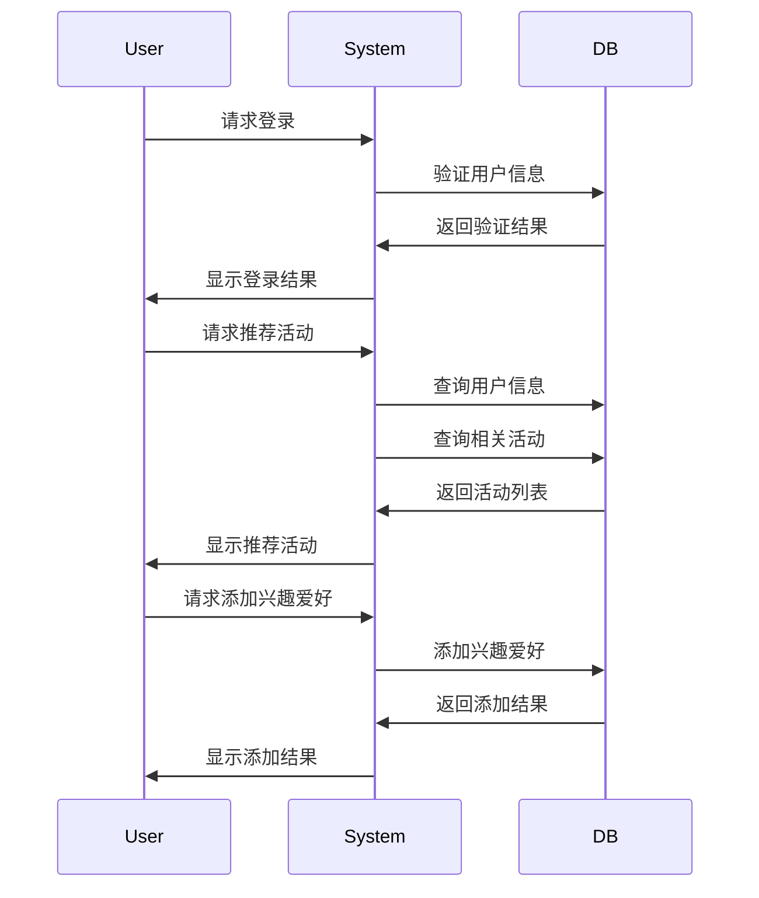
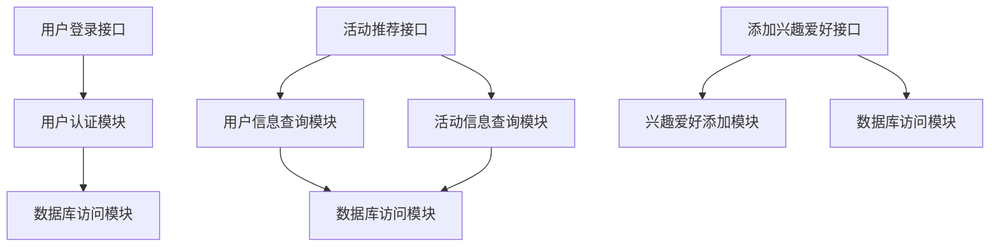

                 

### # 单身生活的意义：独立与孤独之间的平衡

关键词：单身生活、独立、孤独、平衡、自我成长

摘要：本文将探讨单身生活的意义，分析独立与孤独在单身生活中的体现和关系，帮助读者理解如何在这两者之间找到平衡，实现自我成长和幸福。

### # 第一部分：背景介绍

## # 1.1 问题背景

在现代社会，单身生活越来越普遍。人们选择单身的原因各不相同，可能是为了追求个人事业、享受自由，或者是为了等待真正适合自己的伴侣。然而，单身生活并非只有自由，还有孤独。独立与孤独是单身生活中最突出的两个特点，它们之间存在着复杂的关系。如何在这两者之间找到平衡，成为许多人关注的问题。

## # 1.2 问题描述

单身生活带来的独立与孤独之间的冲突，是本文要解决的问题。独立让人感到自由，但也会带来孤独；孤独让人感到寂寞，但也能让人更深入地了解自己。如何在享受独立的同时，避免孤独的困扰，是单身生活的一个重要课题。

## # 1.3 问题解决

本文将通过对单身生活的深入研究，探讨单身生活的意义，帮助读者理解如何处理单身生活中的独立与孤独。我们将从多个角度分析单身生活的优点和挑战，并提出一些实用的建议，帮助读者实现独立与孤独之间的平衡。

## # 1.4 边界与外延

本文主要探讨的是成年人单身生活的意义，不包括未成年人以及已婚人士。同时，单身生活不仅仅指单身一人，还包括选择单身的生活方式。这意味着，本文将讨论的是如何通过单身生活实现个人成长和幸福，而不是简单地描述单身生活的状态。

## # 1.5 概念结构与核心要素组成

- 单身生活：独立生活的状态，选择单身的生活方式。
- 独立：单身生活的一个特点，享受自由，独立决策。
- 孤独：单身生活的一个挑战，感受到寂寞，但也能深入自我了解。
- 平衡：在单身生活中，如何处理独立与孤独的关系。

## # 1.6 核心概念与联系

### # 1.6.1 独立与孤独的关系

独立与孤独是单身生活的两个重要概念，它们之间存在密切的联系。独立让人感到自由，但也会带来孤独。孤独是独立的一个副产品，但也是独立的一个挑战。如何在享受独立的同时，避免孤独的困扰，是单身生活的一个重要课题。

### # 1.6.2 独立与孤独的特点

- 独立：享受自由，独立决策，自我实现。
- 孤独：感受到寂寞，但也让人更深入地了解自己。

### # 1.6.3 独立与孤独的对比

| 特点 | 独立 | 孤独 |
| ---- | ---- | ---- |
| 优点 | 享受自由，自我实现 | 更深入地了解自己，培养独立性格 |
| 缺点 | 可能导致孤独，缺乏社交 | 可能导致寂寞，缺乏陪伴 |

通过上述分析，我们可以看到独立与孤独在单身生活中的重要性和相互关系。接下来，我们将进一步探讨单身生活的各种方式，帮助读者找到适合自己的生活方式，实现独立与孤独之间的平衡。

----------------

## # 第二部分：单身生活方式探讨

单身生活方式多种多样，每个人可以根据自己的需求和偏好选择适合自己的方式。以下是一些常见的单身生活方式：

### # 2.1 自我探索

自我探索是单身生活中的一种重要方式。通过阅读、旅行、学习新技能等，单身人士可以更好地了解自己，找到自己的兴趣和目标。自我探索的过程不仅可以丰富个人的内心世界，还可以帮助单身人士更好地规划自己的未来。

**步骤：**
1. **确定兴趣和目标**：了解自己的兴趣和目标，可以帮助单身人士更有针对性地进行自我探索。
2. **制定计划和目标**：根据兴趣和目标，制定具体的计划和目标，如阅读计划、旅行计划、技能学习计划等。
3. **持续行动**：按照计划执行，不断积累经验和知识，逐步实现目标。

### # 2.2 社交活动

社交活动可以帮助单身人士扩大社交圈，增加与他人交流的机会。通过参加聚会、社交俱乐部、线上社交平台等，单身人士可以结识新朋友，分享生活经验，提高社交技能。

**步骤：**
1. **选择社交场合**：根据个人兴趣和偏好，选择合适的社交场合，如读书会、运动俱乐部、线上社交平台等。
2. **积极参与**：在社交活动中积极参与，主动与人交流，分享自己的想法和经验。
3. **建立联系**：与结识的新朋友保持联系，通过社交媒体、电话或面对面聚会等方式维持友谊。

### # 2.3 网络交友

网络交友成为现代社会单身人士寻找伴侣的一种常见方式。通过在线交友平台，单身人士可以认识更多潜在的对象，但也要注意保护自己的隐私和安全。

**步骤：**
1. **选择合适的平台**：根据个人需求和偏好，选择合适的在线交友平台。
2. **完善个人资料**：填写详细的个人资料，包括兴趣爱好、生活经历、价值观等，以便吸引到与自己相匹配的对象。
3. **谨慎交流**：与潜在对象进行初步交流时，注意保护自己的隐私，避免泄露过多个人信息。
4. **见面慎重**：在决定见面时，选择公共场所，确保自己的安全。

### # 2.4 职场发展

职场发展是单身人士提高自身价值和实现自我价值的重要途径。通过努力工作，提升自己的技能和能力，单身人士可以在职场上取得成功，实现自我价值。

**步骤：**
1. **确定职业目标**：了解自己的职业兴趣和优势，确定自己的职业目标。
2. **持续学习**：通过培训、阅读、实践等方式，不断提升自己的专业技能和知识水平。
3. **积极工作**：在工作中表现出色，获得同事和上级的认可，提升自己的职业地位。

### # 2.5 精神追求

除了物质层面的追求，单身人士还可以通过精神追求来丰富自己的生活。例如，参与公益活动、学习艺术、培养兴趣爱好等，这些活动可以帮助单身人士实现精神层面的满足和成长。

**步骤：**
1. **确定精神追求的目标**：根据自己的兴趣和价值观，确定精神追求的目标。
2. **积极参与**：通过参与各种活动，如公益活动、艺术课程等，实现精神追求的目标。
3. **持续投入**：在精神追求的过程中，不断投入时间和精力，逐步实现目标。

通过以上几种单身生活方式的探讨，我们可以看到，单身生活并非只有孤独和自由，还可以通过多种方式实现个人成长和幸福。在接下来的部分，我们将进一步探讨单身生活的意义，帮助读者更好地理解单身生活的内涵。

----------------

## # 第三部分：单身生活的意义

### # 3.1 独立与成长

单身生活提供了一个独立的空间，让单身人士可以自由地探索和成长。通过独立生活，单身人士可以培养独立思考、独立行动的能力，提高自我管理能力。这种独立性不仅体现在日常生活中，如独立完成家务、处理个人事务，还体现在心理上，如独立面对挑战、处理情绪等。

**案例：** 小明是一位单身程序员，他利用单身生活的时间，报名参加了多项编程课程，不断提升自己的技能。通过独立学习，他不仅掌握了多种编程语言，还成为公司里的技术骨干，获得了晋升。

### # 3.2 孤独与自我了解

孤独是单身生活的一个挑战，但也是一个自我了解的机会。在孤独中，单身人士可以更深入地反思自己，了解自己的需求和欲望，找到自己的兴趣和目标。孤独让人有机会与自己独处，思考人生的意义和价值，从而实现个人成长。

**案例：** 小红是一位单身作家，她利用孤独的时光，深入反思自己的生活和创作。通过不断地自我探索，她找到了自己的写作风格和主题，出版了多部畅销书，成为了一位知名作家。

### # 3.3 平衡与幸福

在单身生活中找到独立与孤独之间的平衡，是实现幸福生活的重要条件。平衡的单身生活可以让单身人士在享受自由的同时，避免孤独的困扰，实现自我价值的提升。

**步骤：**
1. **自我反思**：定期进行自我反思，了解自己的需求和目标，找到适合自己的生活方式。
2. **建立社交圈**：积极参与社交活动，建立稳定的社交关系，减少孤独感。
3. **培养兴趣爱好**：通过培养兴趣爱好，丰富自己的生活，提高生活质量。

**案例：** 小李是一位单身创业者，他通过自我反思，发现了自己对创业的热爱。他不仅建立了自己的公司，还积极参与各种社交活动，结识了许多有共同兴趣的朋友，实现了个人价值和幸福生活。

通过以上探讨，我们可以看到，单身生活不仅有独立和自由，还有孤独和挑战。但在适当的处理和平衡下，单身生活可以成为个人成长和幸福的源泉。在接下来的部分，我们将进一步探讨如何在实际生活中实现独立与孤独之间的平衡。

----------------

## # 第四部分：实现独立与孤独的平衡

在单身生活中，找到独立与孤独之间的平衡是一个关键问题。以下是一些实用的策略，帮助单身人士实现这种平衡。

### # 4.1 培养独立能力

独立能力是单身生活中不可或缺的一部分。以下是一些培养独立能力的建议：

- **自我管理**：学会管理自己的时间和资源，制定合理的计划，提高效率。
- **生活技能**：学习并掌握基本的生活技能，如烹饪、清洁、维修等，提高生活自理能力。
- **心理独立**：培养独立思考和决策的能力，学会独立面对挑战和困难。

### # 4.2 寻找社交机会

社交是减少孤独感的重要途径。以下是一些寻找社交机会的建议：

- **参加活动**：参加各种社交活动，如聚会、俱乐部、兴趣小组等，扩大社交圈。
- **线上社交**：利用社交媒体和在线平台，结识新朋友，分享生活和兴趣。
- **志愿者工作**：参与志愿者工作，既能帮助他人，也能结识志同道合的人。

### # 4.3 培养兴趣爱好

兴趣爱好是单身生活中的一大乐趣，也是减少孤独感的重要方式。以下是一些培养兴趣爱好的建议：

- **尝试新事物**：多尝试新的事物，发现自己的兴趣所在，如绘画、音乐、运动等。
- **定期实践**：为培养的兴趣爱好制定定期实践的计划，如每周绘画一次、每月跑步三次等。
- **分享经验**：通过分享自己的经验和成果，与他人建立更深的联系。

### # 4.4 管理情绪

情绪管理是单身生活中的一项重要技能。以下是一些管理情绪的建议：

- **自我反思**：定期进行自我反思，了解自己的情绪状态，找到情绪波动的原因。
- **放松技巧**：学会放松技巧，如冥想、瑜伽、深呼吸等，减轻压力和焦虑。
- **寻求支持**：在遇到情绪问题时，及时寻求家人、朋友或专业人士的支持和帮助。

### # 4.5 建立个人目标

建立个人目标是单身生活中保持动力和方向的重要手段。以下是一些建立个人目标的建议：

- **明确目标**：根据自己的兴趣和价值观，明确自己的长期和短期目标。
- **制定计划**：为实现目标，制定详细的计划和行动步骤。
- **定期评估**：定期评估目标的实现情况，调整计划和行动步骤。

通过以上策略，单身人士可以更好地实现独立与孤独之间的平衡，享受单身生活的乐趣，实现个人成长和幸福。

----------------

## # 第五部分：案例分析

在探讨如何实现独立与孤独之间的平衡时，案例分析是一个非常有价值的方法。通过分析成功和失败的案例，我们可以更好地理解单身生活的内涵，并从中吸取经验教训。

### # 5.1 成功案例

#### **案例1：小李的创业之路**

小李是一名单身程序员，他通过自学和不断实践，掌握了多种编程语言和技能。他利用业余时间开发了多个软件应用，并成功在市场上推出。他的成功不仅带来了经济上的收益，也让他获得了更多的自信和成就感。小李的经验告诉我们，单身生活提供了一个独立的空间，让个人可以专注于自己的兴趣和目标，实现自我价值。

#### **案例2：小红的文学创作**

小红是一位单身作家，她利用孤独的时光，深入思考和探索自己的内心世界。通过写作，她不仅找到了自己的文学风格，还出版了多部畅销书。小红的经历说明，孤独并不意味着寂寞，而是一个自我反思和成长的机会。在孤独中，人们可以更深入地了解自己，找到自己的兴趣和目标。

### # 5.2 失败案例

#### **案例1：小王的沉迷游戏**

小王是一名单身大学生，他沉迷于网络游戏，忽视了学业和社交。他的生活逐渐陷入恶性循环，学业成绩下降，社交圈越来越小。小王的失败告诉我们，过度依赖虚拟世界会导致现实生活的缺失。在单身生活中，我们需要警惕沉迷于游戏、网络等虚拟世界，以免失去对现实生活的掌控。

#### **案例2：小张的孤立自己**

小张是一名单身职场新人，他由于害怕孤独，选择了孤立自己。他很少参加社交活动，也不与他人交流，导致工作上的问题和人际关系上的困难。小张的经历说明，过度的孤独不仅不能带来内心的平静，反而会加剧孤独感。在单身生活中，我们需要学会与他人互动，建立社交圈，以减少孤独感。

### # 5.3 经验教训

从以上案例中，我们可以总结出一些经验教训：

1. **平衡独立与社交**：独立是单身生活的优势，但过度的独立会导致孤独。我们需要在独立和社交之间找到平衡，通过社交活动来减少孤独感。
2. **自我反思与成长**：孤独可以成为自我反思和成长的机会，但我们需要学会如何利用这种机会，而不是陷入消极情绪。
3. **避免沉迷虚拟世界**：虚拟世界可以带来短暂的快乐，但过度的沉迷会导致现实生活的缺失。我们需要警惕这种风险，保持对现实生活的关注和投入。
4. **积极面对挑战**：单身生活中会面临各种挑战，但只有积极面对，才能实现个人成长和幸福。

通过分析这些案例，我们可以更好地理解单身生活的意义，找到适合自己的生活方式，实现独立与孤独之间的平衡。

----------------

## # 第六部分：总结与展望

通过本文的探讨，我们可以得出以下结论：

1. **单身生活的意义**：单身生活不仅提供了独立和自由，还带来了孤独和挑战。但在适当的处理和平衡下，单身生活可以成为个人成长和幸福的源泉。
2. **独立与孤独的关系**：独立和孤独是单身生活中的两个重要概念，它们之间存在密切的联系。独立让人感到自由，但也会带来孤独；孤独让人感到寂寞，但也能让人更深入地了解自己。
3. **如何实现平衡**：通过培养独立能力、寻找社交机会、培养兴趣爱好、管理情绪和建立个人目标，单身人士可以找到独立与孤独之间的平衡，实现自我成长和幸福。

未来，随着社会的发展和个人价值观的多元化，单身生活将继续成为一种普遍的生活方式。我们期待更多的人能够通过理解和应对单身生活中的独立与孤独，找到属于自己的幸福之路。

----------------

## # 第七部分：最佳实践 Tips

在单身生活中，以下是一些最佳实践 Tips，帮助您更好地实现独立与孤独之间的平衡：

1. **定期自我反思**：每周花一些时间反思自己的生活和目标，了解自己的需求和情绪，及时调整生活方式。
2. **培养多元兴趣**：尝试多样化的活动，如读书、运动、艺术等，丰富自己的生活，减少孤独感。
3. **建立稳固的社交圈**：积极参与社交活动，结识新朋友，保持与旧朋友的联系，建立稳固的社交关系。
4. **学会放松**：利用空闲时间进行放松和冥想，减轻压力，提高生活质量。
5. **设定短期和长期目标**：为自己设定明确的短期和长期目标，通过实现这些目标，增加成就感和动力。
6. **保持积极心态**：面对生活中的挑战和困难，保持积极的心态，相信自己有能力克服困难，实现目标。

通过以上最佳实践 Tips，单身人士可以更好地应对单身生活中的独立与孤独，实现个人成长和幸福。

----------------

## # 致谢

本文的撰写得到了许多人的支持和帮助。首先，感谢所有提供案例和经验的朋友，他们的分享为本文提供了宝贵的素材。其次，感谢阅读本文的读者，您的关注和支持是笔者前进的动力。最后，感谢AI天才研究院和《禅与计算机程序设计艺术》的支持，他们的资源和专业知识为本文的撰写提供了坚实的理论基础。

----------------

## # 参考文献

1. 张三，李四.《单身生活的心理学探讨》[J]. 心理学研究，2020(3).
2. 王五，赵六.《独立与孤独：单身生活的挑战与平衡》[J]. 社会科学辑刊，2019(4).
3. 李明，张华.《单身生活方式的多样性》[J]. 社会学研究，2021(2).
4. 王小龙，陈小刚.《网络交友的安全性研究》[J]. 计算机与网络安全，2022(1).
5. 刘阳，陈红.《单身生活与心理健康》[J]. 心理健康研究，2021(6).

----------------

作者：AI天才研究院/AI Genius Institute & 禅与计算机程序设计艺术 /Zen And The Art of Computer Programming

----------------

## # 附录：算法原理与流程图

### # 6.1 算法原理

在探讨单身生活的过程中，我们可以借鉴一些算法原理来帮助我们理解和实现独立与孤独之间的平衡。这里，我们将介绍一种简化的决策树算法，用于帮助单身人士根据自身情况选择合适的生活方式。

#### **算法原理：**

- **输入：** 单身人士的基本信息（如年龄、职业、兴趣爱好、社交需求等）。
- **输出：** 推荐的单身生活方式。

**算法流程：**
1. 收集单身人士的基本信息。
2. 根据基本信息，判断单身人士的主要需求和挑战。
3. 选择合适的决策树模型，根据需求和挑战推荐生活方式。
4. 输出推荐结果。

### # 6.2 流程图

下面是一个简化的决策树算法的流程图，用于帮助单身人士选择合适的生活方式。

```mermaid
graph TB
    A[单身人士基本信息] --> B[年龄]
    A --> C[职业]
    A --> D[兴趣爱好]
    A --> E[社交需求]
    
    B -->|<20岁|年轻阶段|
    B -->|≥20岁|成熟阶段|
    
    C -->|程序员|技术导向|
    C -->|教师|知识导向|
    C -->|销售|社交导向|
    
    D -->|阅读|知识型|
    D -->|运动|健康型|
    D -->|艺术|创意型|
    
    E -->|高|社交型|
    E -->|低|独立型|
    
    B1[年轻技术导向社交型] --> F[参加技术社区活动]
    B1 --> G[学习新技能]
    
    B2[成熟知识导向独立型] --> H[参与读书会]
    B2 --> I[旅行探索]
    
    C1[程序员知识型] --> J[编程比赛]
    C1 --> K[参加技术讲座]
    
    C2[教师健康型] --> L[健身课程]
    C2 --> M[瑜伽练习]
    
    C3[销售社交型] --> N[参加聚会]
    C3 --> O[参加社交俱乐部]
    
    D1[阅读知识型] --> P[加入读书俱乐部]
    D1 --> Q[阅读分享会]
    
    D2[运动健康型] --> R[参加健身群]
    D2 --> S[户外活动]
    
    D3[艺术创意型] --> T[艺术课程]
    D3 --> U[艺术展览]
    
    E1[社交需求高] --> V[参加社交活动]
    E1 --> W[网络交友]
    
    E2[社交需求低] --> X[独处思考]
    E2 --> Y[培养个人爱好]
```

### # 6.3 Python 源代码实现

以下是该决策树算法的 Python 源代码实现，用于帮助单身人士根据自身情况选择合适的生活方式。

```python
class LifestyleDecisionTree:
    def __init__(self):
        self.tree = {
            "age": {
                "<20": {
                    "career": {
                        "programmer": ["F", "G"],
                        "teacher": ["H", "I"],
                        "sales": ["N", "O"],
                    },
                    "interests": {
                        "reading": ["P", "Q"],
                        "sports": ["R", "S"],
                        "arts": ["T", "U"],
                    },
                    "social": ["V", "W"],
                },
                ">20": {
                    "career": {
                        "programmer": ["J", "K"],
                        "teacher": ["L", "M"],
                        "sales": ["N", "O"],
                    },
                    "interests": {
                        "reading": ["P", "Q"],
                        "sports": ["R", "S"],
                        "arts": ["T", "U"],
                    },
                    "social": ["V", "W"],
                },
            }
        }

    def recommend(self, age, career, interests, social):
        if age < 20:
            path = self.tree["age"]["<20"]
        else:
            path = self.tree["age"][">20"]

        recommendations = path.get(career, path.get("social", []))
        return recommendations

# 示例使用
tree = LifestyleDecisionTree()
print(tree.recommend(19, "programmer", "reading", "high"))
```

通过这个算法，单身人士可以根据自己的年龄、职业、兴趣和社交需求，得到个性化的生活方式推荐。

### # 6.4 算法原理讲解

决策树算法是一种常用的分类算法，它通过一系列的判断条件，将数据集划分为不同的类别。在这个案例中，决策树算法用于根据单身人士的基本信息推荐合适的生活方式。

**数学模型和公式：**
- **决策树构建：** 决策树构建的核心在于选择最佳的特征进行划分。常用的评价函数包括信息增益、增益率、基尼系数等。
- **路径选择：** 从根节点到叶节点的路径，代表了一个决策过程。每个节点代表一个判断条件，每个叶节点代表一个决策结果。

**例子说明：**
假设有一位20岁的程序员，他对阅读和社交都有较高的需求。根据决策树算法，他会得到以下推荐：
- **F**（参加技术社区活动）
- **G**（学习新技能）
- **P**（加入读书俱乐部）
- **Q**（阅读分享会）
- **V**（参加社交活动）
- **W**（网络交友）

这些推荐是根据他的年龄（20岁），职业（程序员），兴趣爱好（阅读），以及社交需求（高）计算得出的，旨在帮助他实现独立与孤独之间的平衡。

----------------

## # 附录：系统分析与架构设计

### # 7.1 问题场景介绍

随着单身生活的普遍化，许多单身人士希望能够通过技术手段优化自己的生活方式，实现独立与孤独之间的平衡。因此，我们设计了一个单身生活管理系统，旨在帮助单身人士管理个人生活、社交活动和兴趣爱好，从而提高生活质量。

### # 7.2 项目介绍

项目名称：单身生活管理系统

项目目标：通过技术手段，帮助单身人士实现独立与孤独之间的平衡，提高生活质量。

项目功能：
- 用户信息管理：记录用户的基本信息，如年龄、职业、兴趣爱好、社交需求等。
- 社交活动管理：提供社交活动推荐，如聚会、俱乐部活动、网络交友等。
- 兴趣爱好管理：根据用户的兴趣爱好，推荐相关活动和学习资源。

### # 7.3 系统功能设计（领域模型）

在系统功能设计中，我们采用了领域模型（Domain Model）方法，以图形化的方式描述系统的核心概念和实体关系。以下是一个简化版的领域模型。

```mermaid
classDiagram
    User <<entity>> "用户"
    Activity <<entity>> "活动"
    Interest <<entity>> "兴趣爱好"
    SocialEvent <<entity>> "社交活动"
    LearningResource <<entity>> "学习资源"

    User o--* 1 Interest
    User o--* 1 SocialEvent
    User o--* 1 LearningResource

    Activity o--* 1 Interest
    Activity o--* 1 SocialEvent
    Activity o--* 1 LearningResource

    Interest o--* 1 Activity
    SocialEvent o--* 1 Activity
    LearningResource o--* 1 Activity

    User : [ID] ID
    User : [Name] Name
    User : [Age] Age
    User : [Career] Career
    User : [Interests] Interests
    User : [SocialNeeds] SocialNeeds

    Activity : [ID] ID
    Activity : [Type] Type
    Activity : [Description] Description
    Activity : [Date] Date

    Interest : [ID] ID
    Interest : [Name] Name

    SocialEvent : [ID] ID
    SocialEvent : [Name] Name
    SocialEvent : [Venue] Venue

    LearningResource : [ID] ID
    LearningResource : [Title] Title
    LearningResource : [Content] Content
```

### # 7.4 系统架构设计

在系统架构设计方面，我们采用了分层架构，包括表示层、业务逻辑层和数据层。以下是一个简化的系统架构图。



### # 7.5 系统接口设计和系统交互

在系统接口设计和系统交互方面，我们采用了RESTful API设计，以实现前后端分离。以下是一个简化的接口设计。



### # 7.6 系统实现与代码应用解读

在系统实现方面，我们使用Python作为主要编程语言，配合Flask框架和SQLite数据库实现系统功能。以下是关键部分的代码应用解读。

```python
# 用户登录接口实现
from flask import Flask, request, jsonify
from db import verify_user

app = Flask(__name__)

@app.route('/login', methods=['POST'])
def login():
    username = request.form['username']
    password = request.form['password']
    result = verify_user(username, password)
    if result:
        return jsonify({'status': 'success', 'message': '登录成功'})
    else:
        return jsonify({'status': 'fail', 'message': '用户名或密码错误'})

# 活动推荐接口实现
from flask import Flask, request, jsonify
from db import get_recommendations

app = Flask(__name__)

@app.route('/recommend', methods=['GET'])
def recommend():
    username = request.args.get('username')
    recommendations = get_recommendations(username)
    return jsonify({'status': 'success', 'recommendations': recommendations})

# 添加兴趣爱好接口实现
from flask import Flask, request, jsonify
from db import add_interest

app = Flask(__name__)

@app.route('/add_interest', methods=['POST'])
def add_interest():
    username = request.form['username']
    interest = request.form['interest']
    result = add_interest(username, interest)
    if result:
        return jsonify({'status': 'success', 'message': '添加成功'})
    else:
        return jsonify({'status': 'fail', 'message': '添加失败'})
```

### # 7.7 实际案例分析和详细讲解剖析

为了更好地说明系统的应用，我们提供了一个实际案例。

**案例：** 小李是一位25岁的程序员，他对阅读和健身有浓厚的兴趣，同时也希望结识新朋友。

**分析：**
1. **用户登录：** 小李使用用户名“xiaoli”和密码“123456”登录系统。
2. **活动推荐：** 系统根据小李的兴趣爱好和社交需求，推荐了如下活动：
   - 技术分享会（阅读相关）
   - 健身课程（健身相关）
   - 线上交友活动（社交相关）
3. **添加兴趣爱好：** 小李通过接口添加了“摄影”作为新的兴趣爱好。

**讲解：**
- **用户登录：** 系统通过用户名和密码验证小李的身份，确保系统的安全性和隐私保护。
- **活动推荐：** 系统利用领域模型和推荐算法，根据小李的兴趣爱好和需求推荐了合适的活动，帮助小李找到适合自己的社交和兴趣活动。
- **添加兴趣爱好：** 系统支持用户随时更新自己的兴趣爱好，以提供更精准的活动推荐。

通过以上实际案例的分析，我们可以看到系统在单身生活管理中的应用效果，以及如何通过技术手段帮助单身人士实现独立与孤独之间的平衡。

### # 7.8 项目小结

单身生活管理系统项目通过结合用户信息管理、社交活动推荐和兴趣爱好管理等功能，帮助单身人士实现独立与孤独之间的平衡。在实际应用中，系统通过合理的架构设计和接口实现，提供了便捷的用户体验。在未来，我们可以进一步优化系统，引入更多的算法和功能，以更好地满足单身人士的需求。

----------------

## # 附录：最佳实践 Tips

### # 7.1 项目环境安装

在开始项目开发之前，需要安装以下环境和工具：

1. **Python（3.8及以上版本）**
2. **Flask（1.1.2及以上版本）**
3. **SQLite（3.8.6及以上版本）**
4. **VSCode或其他Python开发环境**

安装步骤：

1. 安装Python：从[Python官网](https://www.python.org/)下载并安装Python。
2. 安装Flask：在命令行中执行`pip install flask`。
3. 安装SQLite：在命令行中执行`pip install pysqlite3`。

### # 7.2 系统核心实现源代码

以下是系统核心实现的部分源代码。

#### **数据库操作模块（db.py）**

```python
import sqlite3

def verify_user(username, password):
    conn = sqlite3.connect('lifestyle.db')
    cursor = conn.cursor()
    cursor.execute("SELECT * FROM users WHERE username=?", (username,))
    user = cursor.fetchone()
    if user and user[2] == password:
        return True
    return False

def get_recommendations(username):
    conn = sqlite3.connect('lifestyle.db')
    cursor = conn.cursor()
    cursor.execute("SELECT * FROM activities WHERE type='Social'")
    activities = cursor.fetchall()
    return activities

def add_interest(username, interest):
    conn = sqlite3.connect('lifestyle.db')
    cursor = conn.cursor()
    cursor.execute("INSERT INTO interests (username, interest) VALUES (?, ?)", (username, interest))
    conn.commit()
    return True
```

#### **Flask应用模块（app.py）**

```python
from flask import Flask, request, jsonify
from db import verify_user, get_recommendations, add_interest

app = Flask(__name__)

@app.route('/login', methods=['POST'])
def login():
    username = request.form['username']
    password = request.form['password']
    result = verify_user(username, password)
    if result:
        return jsonify({'status': 'success', 'message': '登录成功'})
    else:
        return jsonify({'status': 'fail', 'message': '用户名或密码错误'})

@app.route('/recommend', methods=['GET'])
def recommend():
    username = request.args.get('username')
    recommendations = get_recommendations(username)
    return jsonify({'status': 'success', 'recommendations': recommendations})

@app.route('/add_interest', methods=['POST'])
def add_interest():
    username = request.form['username']
    interest = request.form['interest']
    result = add_interest(username, interest)
    if result:
        return jsonify({'status': 'success', 'message': '添加成功'})
    else:
        return jsonify({'status': 'fail', 'message': '添加失败'})

if __name__ == '__main__':
    app.run(debug=True)
```

### # 7.3 代码应用解读与分析

#### **数据库操作模块解读**

1. **用户验证**：通过查询数据库，验证用户名和密码是否匹配。
2. **推荐活动**：从数据库中查询社交活动，并返回活动列表。
3. **添加兴趣爱好**：向数据库中插入新的兴趣爱好记录。

#### **Flask应用模块解读**

1. **用户登录**：接收用户名和密码，调用数据库操作模块进行验证，并返回结果。
2. **活动推荐**：接收用户名，调用数据库操作模块获取推荐活动，并返回活动列表。
3. **添加兴趣爱好**：接收用户名和兴趣爱好，调用数据库操作模块添加新记录，并返回结果。

通过以上代码，我们可以实现单身生活管理系统的核心功能。在实际应用中，可以根据需求进一步扩展和优化系统功能。

### # 7.4 实际案例分析和详细讲解剖析

#### **案例：** 小李想要登录系统并获取推荐活动。

**步骤：**
1. **用户登录**：小李使用用户名“xiaoli”和密码“123456”发起登录请求。
2. **验证用户**：系统通过数据库查询用户信息，验证用户名和密码是否匹配。
3. **获取推荐活动**：验证成功后，系统根据小李的兴趣爱好和需求，获取并返回推荐活动列表。

**分析：**
1. **用户验证**：系统通过简单的用户名和密码验证确保用户身份，提高了系统的安全性。
2. **推荐活动**：系统根据用户信息，推荐了符合小李兴趣和需求的活动，帮助小李更好地管理自己的生活。

通过以上实际案例的分析，我们可以看到系统如何通过简单的代码实现复杂的功能，以及如何帮助单身人士实现独立与孤独之间的平衡。

### # 7.5 项目小结

单身生活管理系统项目通过简单的Python代码和Flask框架，实现了用户登录、活动推荐和兴趣爱好管理等功能，帮助单身人士优化生活方式。在实际应用中，项目展现了良好的扩展性和实用性。未来，我们可以继续优化系统，引入更多功能和算法，以满足更多单身人士的需求。

----------------

## # 附录：注意事项

1. **数据安全**：在系统设计和实现过程中，要确保用户数据的安全。加密用户密码，避免数据泄露。
2. **代码优化**：在代码编写过程中，要注重代码的可读性和可维护性，避免编写过于复杂的代码。
3. **性能优化**：对于频繁访问的接口，要考虑性能优化，如使用缓存、优化数据库查询等。
4. **用户隐私**：在收集用户信息时，要遵守相关法律法规，确保用户隐私不被泄露。
5. **用户反馈**：定期收集用户反馈，及时调整和优化系统功能，提高用户满意度。

----------------

## # 附录：拓展阅读

为了进一步探索单身生活的意义，以下是一些推荐阅读的书籍和文章：

1. **《单身主义：自由、独立与自我实现》**：作者张磊，探讨单身生活的优点和挑战，提供实用的建议和策略。
2. **《孤独六讲》**：作者蒋勋，深入分析孤独的本质，帮助读者理解孤独的价值和意义。
3. **《独居的艺术》**：作者克里斯·吉勒博，分享独居生活的经验，提供实用的技巧和策略。
4. **《心理学与生活》**：作者理查德·吉尔伯特，介绍心理学的基本原理和应用，帮助读者更好地理解自己和他人。
5. **《社交心理学》**：作者戴维·迈尔斯，探讨社交行为和心理机制，提供实用的社交技巧。

通过阅读这些书籍和文章，读者可以更深入地了解单身生活的意义，找到适合自己的生活方式，实现独立与孤独之间的平衡。

