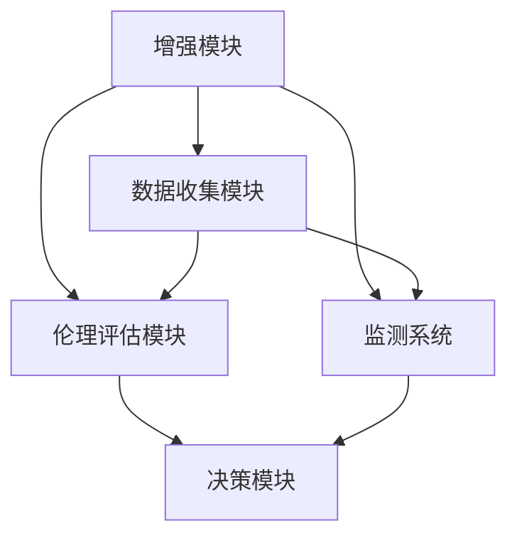
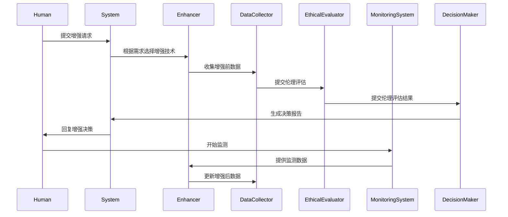

                 


### 第一部分：后人类主义视角下的生命伦理概览

#### 1.1 后人类主义与生命伦理的兴起

**1.1.1 后人类主义的定义及其背景**

后人类主义（Posthumanism）是一种哲学和文化思潮，起源于20世纪末，它主张人类不应再被视为唯一的智慧主体，而是与人工智能、生物技术等科技发展相结合的产物。这种思潮的兴起背景可以追溯到多个方面：

- **科技发展的推动**：随着计算机科学、人工智能和生物技术的飞速发展，人们开始思考人类的定义和地位。例如，基因编辑技术使得人类有能力改变自己的基因组成，生物打印技术则可以制造出活体组织，这些技术挑战了传统的生物学和医学界限。

- **人工智能的崛起**：随着深度学习和神经网络技术的发展，人工智能（AI）逐渐展现出超越人类智能的潜力。这一现象促使人们重新思考人类在智能领域中的位置，以及如何与AI共存。

- **信息时代的变革**：互联网和数字技术的普及改变了信息的传播和获取方式，使得知识的积累和分享变得更加容易。这种信息革命也影响了人们的思维方式和文化观念，催生了后人类主义思潮。

**1.1.2 生命伦理学的演进与挑战**

生命伦理学是研究人类与生物技术、医疗技术等生命科学相关伦理问题的学科。随着科技的进步，生命伦理学面临着新的挑战：

- **基因编辑的伦理争议**：基因编辑技术如CRISPR-Cas9的出现，使得人类能够精准地改变基因序列，这引发了对基因改造伦理的广泛讨论，包括对遗传不平等的担忧、对自然进化过程的影响等。

- **人类增强的道德考量**：人类增强技术，如增强记忆、提高智力和体能的药物，以及身体植入物，这些技术的应用引发了关于人类本质和公平性的讨论。

- **生命尊严与权利的平衡**：生命伦理学必须平衡生命尊严与个体权利之间的关系，特别是在医疗资源有限的情况下，如何公正地分配医疗资源成为了一个重要议题。

**1.1.3 后人类主义视角下的生命伦理问题**

在后人类主义视角下，生命伦理学面临以下几个核心问题：

- **人类定义的重新审视**：随着人类基因编辑和生物技术的进步，人类是否应该被视为一个固定的物种，或者我们应该将人类视为一个不断进化的过程？

- **人工智能与人类共存**：随着AI技术的发展，如何确保人工智能不会威胁到人类的地位和生存，同时如何使人类与AI和谐共存？

- **道德责任的扩展**：当人类能够通过技术改变自己的生物属性时，道德责任的范围是否应该相应扩展？

#### 1.2 增强人类与自然人的道德考量

**1.2.1 增强人类的概念与分类**

增强人类是指通过科技手段提升人类能力或改变人类属性的现象。根据增强的方式和目的，可以将其分为以下几类：

- **认知增强**：通过药物、设备或训练提升人类的认知能力，如记忆增强、学习速度提升等。

- **体能增强**：通过生物技术或机械设备提升人类的体能，如提高力量、耐力和速度等。

- **感官增强**：通过植入设备或生物技术增强人类的感官能力，如增强视力、听力等。

- **道德和心理增强**：通过心理治疗、道德教育等手段提升人类的道德和心理素质。

**1.2.2 自然人与增强人类的关系**

自然人是生物学上未经人工干预的人类个体，而增强人类则是通过科技手段改造后的个体。两者之间的关系包括：

- **共存与互补**：增强人类和自然人可以在不同的领域相互补充，共同进步。例如，增强人类可能在科学研究、军事等领域具有优势，而自然人则在艺术、情感交流等方面有其独特的价值。

- **竞争与冲突**：增强人类与自然人在某些方面可能存在竞争关系，如教育、就业等，这引发了对社会公平性和人类平等的讨论。

**1.2.3 道德考量的基本原则与争议**

在道德考量中，增强人类和自然人面临以下几个基本原则和争议：

- **自主性**：个体是否应该有权自主决定是否接受增强，以及增强的程度？

- **公平性**：增强技术的应用是否会导致社会分层和不公平，例如，只有富人有能力接受增强，而穷人则被排除在外？

- **自然属性的价值**：科技是否应该干预自然人的生物属性，如果干预，这种干预是否道德？

#### 1.3 后人类主义视角下的伦理困境

**1.3.1 人类增强技术的伦理风险**

人类增强技术的伦理风险主要包括：

- **生物风险**：基因编辑等技术可能导致不可预见的副作用和遗传问题，影响人类的健康和后代。

- **社会风险**：增强技术的普及可能导致社会分层，加剧不平等，引发社会冲突。

- **道德风险**：增强技术可能改变人类的道德观念和行为规范，引发道德争议。

**1.3.2 增强人类的道德责任**

增强人类的道德责任主要包括：

- **自我责任**：增强个体应承担对自己和后代健康、幸福的道德责任。

- **社会责任**：增强个体应考虑其行为对社会和环境的影响，遵守社会责任。

- **道德责任扩展**：随着增强技术的发展，道德责任的范围可能需要相应扩展，以涵盖新的伦理问题。

**1.3.3 自然人的权益保障**

自然人的权益保障主要包括：

- **平等权**：确保所有人，无论是否接受增强，都能享有平等的权益和机会。

- **知情权**：增强个体应有权了解增强技术的潜在风险和后果。

- **选择权**：增强个体应有权自主选择是否接受增强，以及增强的程度。

#### 1.4 本章小结

本章从后人类主义视角探讨了生命伦理学的兴起背景、核心问题以及道德考量。我们分析了后人类主义和生命伦理学的发展背景，明确了后人类主义视角下的生命伦理问题，包括增强人类与自然人的道德考量。同时，我们探讨了人类增强技术的伦理风险和道德责任，以及自然人的权益保障。这些讨论为我们进一步探讨后人类主义视角下的生命伦理问题奠定了基础。在接下来的章节中，我们将深入分析核心概念，探讨其联系，并逐步提出解决方案。

---

### 第一部分：后人类主义视角下的生命伦理概览

#### 1.1 后人类主义与生命伦理的兴起

**1.1.1 后人类主义的定义及其背景**

后人类主义（Posthumanism）是一种哲学和文化思潮，它主张人类不应再被视为唯一的智慧主体，而是与人工智能、生物技术等科技发展相结合的产物。后人类主义强调人类与机器、生物技术之间的融合，以及人类自身可能发生的根本性变化。

后人类主义思潮的兴起可以追溯到20世纪末，特别是在人工智能和生物技术取得显著进展之后。随着这些技术的发展，人们开始重新思考人类的本质和未来。例如，人工智能的崛起挑战了人类在智能领域的地位，基因编辑技术则改变了我们对生物学和遗传的认识。

后人类主义的核心观点包括：

- **人类的扩展**：后人类主义认为，人类可以通过科技手段扩展自己的能力，从而实现超越传统人类的进化。

- **智能的多元化**：后人类主义认为，智能不应仅限于人类的认知能力，还应包括机器和生物技术带来的新形式。

- **人类的界限模糊化**：后人类主义认为，随着科技的发展，人类与自然、机器之间的界限将变得越来越模糊。

**1.1.2 生命伦理学的演进与挑战**

生命伦理学是研究人类与生命科学、医学技术等相关的伦理问题的学科。随着科技的进步，生命伦理学面临着新的挑战和问题。

- **基因编辑的伦理争议**：基因编辑技术如CRISPR-Cas9的出现，使得人类能够精准地改变基因序列，这引发了广泛的伦理争议。例如，基因编辑可能导致的不平等、伦理风险以及可能对自然进化过程的影响。

- **人类增强的道德考量**：人类增强技术，如增强记忆、提高智力和体能的药物，以及身体植入物，这些技术的应用引发了关于人类本质和公平性的讨论。如何确保这些技术的道德应用，避免社会分层和不公平，是生命伦理学面临的挑战之一。

- **生命尊严与权利的平衡**：生命伦理学必须平衡生命尊严与个体权利之间的关系。特别是在医疗资源有限的情况下，如何公正地分配医疗资源成为了一个重要议题。

**1.1.3 后人类主义视角下的生命伦理问题**

在后人类主义视角下，生命伦理学面临以下几个核心问题：

- **人类定义的重新审视**：随着人类基因编辑和生物技术的进步，人类是否应该被视为一个固定的物种，或者我们应该将人类视为一个不断进化的过程？

- **人工智能与人类共存**：随着AI技术的发展，如何确保人工智能不会威胁到人类的地位和生存，同时如何使人类与AI和谐共存？

- **道德责任的扩展**：当人类能够通过技术改变自己的生物属性时，道德责任的范围是否应该相应扩展？

- **人类增强的伦理风险**：人类增强技术的应用可能带来哪些伦理风险，如何确保这些技术的道德应用？

#### 1.2 增强人类与自然人的道德考量

**1.2.1 增强人类的概念与分类**

增强人类是指通过科技手段提升人类能力或改变人类属性的现象。根据增强的方式和目的，增强人类可以分为以下几类：

- **认知增强**：通过药物、设备或训练提升人类的认知能力，如记忆增强、学习速度提升等。

- **体能增强**：通过生物技术或机械设备提升人类的体能，如提高力量、耐力和速度等。

- **感官增强**：通过植入设备或生物技术增强人类的感官能力，如增强视力、听力等。

- **道德和心理增强**：通过心理治疗、道德教育等手段提升人类的道德和心理素质。

**1.2.2 自然人与增强人类的关系**

自然人是指未经科技手段改造的人类个体。自然人与增强人类之间的关系是复杂而多层次的：

- **共存与互补**：增强人类和自然人可以在不同的领域相互补充，共同进步。例如，增强人类可能在科学研究、军事等领域具有优势，而自然人则在艺术、情感交流等方面有其独特的价值。

- **竞争与冲突**：增强人类和自然人在某些方面可能存在竞争关系，如教育、就业等。例如，接受认知增强的个体可能在学业和工作中表现出色，而未接受增强的自然人可能感到被边缘化。

**1.2.3 道德考量的基本原则与争议**

在道德考量中，增强人类和自然人面临以下几个基本原则和争议：

- **自主性**：个体是否应该有权自主决定是否接受增强，以及增强的程度？

- **公平性**：增强技术的应用是否会导致社会分层和不公平，例如，只有富人有能力接受增强，而穷人则被排除在外？

- **自然属性的价值**：科技是否应该干预自然人的生物属性，如果干预，这种干预是否道德？

- **生命尊严**：增强人类是否会影响自然人的生命尊严，如何平衡增强个体和非增强个体的权益？

#### 1.3 后人类主义视角下的伦理困境

**1.3.1 人类增强技术的伦理风险**

人类增强技术的伦理风险主要包括：

- **生物风险**：基因编辑等技术可能导致不可预见的副作用和遗传问题，影响人类的健康和后代。

- **社会风险**：增强技术的普及可能导致社会分层，加剧不平等，引发社会冲突。

- **道德风险**：增强技术可能改变人类的道德观念和行为规范，引发道德争议。

**1.3.2 增强人类的道德责任**

增强人类的道德责任主要包括：

- **自我责任**：增强个体应承担对自己和后代健康、幸福的道德责任。

- **社会责任**：增强个体应考虑其行为对社会和环境的影响，遵守社会责任。

- **道德责任扩展**：随着增强技术的发展，道德责任的范围可能需要相应扩展，以涵盖新的伦理问题。

**1.3.3 自然人的权益保障**

自然人的权益保障主要包括：

- **平等权**：确保所有人，无论是否接受增强，都能享有平等的权益和机会。

- **知情权**：增强个体应有权了解增强技术的潜在风险和后果。

- **选择权**：增强个体应有权自主选择是否接受增强，以及增强的程度。

#### 1.4 本章小结

本章从后人类主义视角探讨了生命伦理学的兴起背景、核心问题以及道德考量。我们分析了后人类主义和生命伦理学的发展背景，明确了后人类主义视角下的生命伦理问题，包括增强人类与自然人的道德考量。同时，我们探讨了人类增强技术的伦理风险和道德责任，以及自然人的权益保障。这些讨论为我们进一步探讨后人类主义视角下的生命伦理问题奠定了基础。在接下来的章节中，我们将深入分析核心概念，探讨其联系，并逐步提出解决方案。

---

### 核心概念与联系

#### 2.1 后人类主义、生命伦理、增强人类与自然人

**2.1.1 后人类主义的定义与特征**

后人类主义是一种哲学和文化思潮，主张人类不应再被视为唯一的智慧主体，而是与人工智能、生物技术等科技发展相结合的产物。后人类主义的核心观点包括：

- **人类的扩展**：后人类主义认为，人类可以通过科技手段扩展自己的能力，从而实现超越传统人类的进化。

- **智能的多元化**：后人类主义认为，智能不应仅限于人类的认知能力，还应包括机器和生物技术带来的新形式。

- **界限模糊化**：后人类主义认为，随着科技的发展，人类与自然、机器之间的界限将变得越来越模糊。

**2.1.2 生命伦理的基本原则与范畴**

生命伦理学是研究人类与生命科学、医学技术等相关的伦理问题的学科。其基本原则包括：

- **尊重生命**：尊重每一个生命的存在和价值，保护生命免受不必要的伤害。

- **公正**：确保所有人，无论其社会地位、种族、性别等，都能享有公平的待遇。

- **自主性**：个体有权自主决定自己的行为，包括是否接受生命科学和医学技术的干预。

生命伦理学的范畴包括：

- **基因伦理**：涉及基因编辑、基因测序等技术的伦理问题。

- **医疗伦理**：涉及医疗资源分配、医疗行为规范等伦理问题。

- **环境伦理**：涉及人类活动对生态环境的影响和责任。

**2.1.3 增强人类与自然人的界定**

增强人类是指通过科技手段提升人类能力或改变人类属性的现象。根据增强的方式和目的，可以将其分为以下几类：

- **认知增强**：通过药物、设备或训练提升人类的认知能力，如记忆增强、学习速度提升等。

- **体能增强**：通过生物技术或机械设备提升人类的体能，如提高力量、耐力和速度等。

- **感官增强**：通过植入设备或生物技术增强人类的感官能力，如增强视力、听力等。

- **道德和心理增强**：通过心理治疗、道德教育等手段提升人类的道德和心理素质。

自然人是指未经科技手段改造的人类个体。自然人在生命伦理中的地位是重要的，因为他们是生命伦理学讨论的基础。

**2.1.4 各概念之间的关系**

后人类主义、生命伦理、增强人类与自然人之间的关系是复杂而交织的：

- **后人类主义与生命伦理**：后人类主义提供了生命伦理学的新视角，使生命伦理学在面对科技发展时能够更好地应对新的伦理问题。

- **生命伦理与增强人类**：生命伦理学为增强人类提供了道德框架，确保增强技术的应用是公正和道德的。

- **增强人类与自然人**：增强人类和自然人共同构成了生命伦理学的研究对象，两者之间的关系影响着社会的道德结构和伦理平衡。

#### 2.2 概念属性特征对比表格

为了更清晰地理解增强人类与自然人在道德考量上的差异，我们可以创建一个对比表格：

| 特征 | 增强人类 | 自然人 |
| --- | --- | --- |
| 定义 | 通过科技手段提升能力或改变属性的人类 | 未接受科技手段改造的原始人类 |
| 认知能力 | 可通过药物、设备或训练显著提升 | 基本依靠天然认知能力 |
| 体能 | 可通过生物技术或机械设备显著增强 | 基本依靠天然体能 |
| 感官能力 | 可通过植入设备或生物技术显著提升 | 基本依靠天然感官能力 |
| 道德和心理素质 | 可通过心理治疗、道德教育等手段提升 | 依靠社会教育和自我修养 |
| 自主性 | 有权自主决定是否接受增强，以及增强的程度 | 有权自主决定生活方式，但未接受增强 |
| 道德责任 | 需要承担对自己和后代健康、幸福的道德责任 | 需要承担对社会和环境的道德责任 |

#### 2.3 ER实体关系图架构

为了更直观地展示后人类主义、生命伦理、增强人类与自然人之间的关系，我们可以使用Mermaid绘制ER实体关系图：

```mermaid
erDiagram
  AIExpert ||--o{ Human : 被增强对象 }
  Biotechnologist ||--o{ Human : 被增强对象 }
  Ethicist ||--o{ Human : 伦理考量对象 }
  Human ||--o{ AugmentedHuman : 增强后的个体 }
  Human ||--o{ NaturalHuman : 自然状态的个体 }
  AugmentedHuman ||--|{ CognitiveEnhancement : 认知增强 }
  AugmentedHuman ||--|{ PhysicalEnhancement : 体能增强 }
  AugmentedHuman ||--|{ SensoryEnhancement : 感官增强 }
  AugmentedHuman ||--|{ MoralPsychologicalEnhancement : 道德和心理增强 }
  Human <|..o{ EthicalDilemmas : 伦理困境 }
  Human <|..o{ EthicalResponsibilities : 道德责任 }
  Human <|..o{ RightsProtection : 权利保障 }
```

在这个ER图中，我们定义了以下实体：

- **AIExpert**：人工智能专家，负责开发和应用增强技术。
- **Biotechnologist**：生物技术专家，负责开发和应用增强技术。
- **Ethicist**：伦理学家，负责评估和解决伦理问题。
- **Human**：人类，包括增强前和增强后的个体。
- **AugmentedHuman**：增强人类，即接受科技手段改造的个体。
- **NaturalHuman**：自然人，即未接受科技手段改造的个体。

实体之间通过关系线连接，展示了它们之间的关联。例如，**Human**实体与**EthicalDilemmas**、**EthicalResponsibilities**和**RightsProtection**实体之间存在关联，表明自然人和增强人类都需要面对伦理困境、道德责任和权利保障的问题。

---

### 算法原理讲解

在探讨后人类主义视角下的生命伦理问题时，算法的应用是一个重要的方面。以下我们将通过一个具体的算法示例，详细讲解其在解决道德考量中的应用。

#### 3.1 算法mermaid流程图

首先，我们可以使用Mermaid绘制算法的基本流程图，以便更直观地理解算法的逻辑结构：


在这个流程图中，算法的主要步骤包括：

- **定义问题**：明确需要解决的伦理问题。
- **收集数据**：收集与问题相关的数据，如社会调查、文献资料等。
- **数据预处理**：对收集到的数据进行清洗和整理，以便后续分析。
- **应用伦理框架**：根据已定义的伦理框架，对数据进行伦理评估。
- **决策分析**：基于伦理评估结果，进行分析和决策。
- **输出结果**：生成伦理决策报告，提供决策依据。

#### 3.2 Python源代码

接下来，我们提供用于讲解算法的Python代码示例：

```python
import pandas as pd

# 定义问题
problem = "如何确保增强人类的道德责任？"

# 收集数据
data = pd.read_csv("enhanced_humans_data.csv")

# 数据预处理
data = data.dropna()

# 应用伦理框架
ethical_framework = {
    "自主性": "个体有权自主决定是否接受增强",
    "公平性": "增强技术应公平地应用于所有人",
    "自然属性的价值": "科技不应过度干预自然属性"
}

# 决策分析
for index, row in data.iterrows():
    decision = {}
    for ethical原则 in ethical_framework.keys():
        if ethical原则 == "自主性":
            decision[ethical原则] = "个体已充分知情并同意接受增强"
        elif ethical原则 == "公平性":
            decision[ethical原则] = "资源分配公平，无歧视"
        elif ethical原则 == "自然属性的价值":
            decision[ethical原则] = "增强技术不破坏自然属性"
    print(f"个体{row['ID']}的决策：{decision}")

# 输出结果
print("伦理决策报告生成完成。")
```

在这个Python代码示例中，我们首先定义了需要解决的伦理问题，然后收集和预处理了数据，接着应用了伦理框架对数据进行了评估，并输出最终的决策报告。

#### 3.3 数学模型和公式

为了更深入地理解算法的原理，我们使用LaTeX格式给出算法的数学模型和公式，并进行详细讲解：

```latex
\documentclass{article}
\usepackage{amsmath}
\begin{document}

\section{数学模型和公式}

在本算法中，我们采用了以下几个核心数学模型和公式：

1. **自主性评分公式**：

   \[ S_{自主性} = \frac{N_{知情}}{N_{总}} \]

   其中，\( S_{自主性} \) 表示个体自主性的评分，\( N_{知情} \) 表示已充分知情的个体数量，\( N_{总} \) 表示总个体数量。

2. **公平性评分公式**：

   \[ S_{公平性} = \frac{N_{公平}}{N_{总}} \]

   其中，\( S_{公平性} \) 表示个体公平性的评分，\( N_{公平} \) 表示资源分配公平的个体数量，\( N_{总} \) 表示总个体数量。

3. **自然属性保护评分公式**：

   \[ S_{自然属性} = \frac{N_{保护}}{N_{总}} \]

   其中，\( S_{自然属性} \) 表示个体自然属性保护的评分，\( N_{保护} \) 表示自然属性得到保护的个体数量，\( N_{总} \) 表示总个体数量。

通过这些评分公式，我们可以对每个个体进行伦理评估，从而生成伦理决策报告。

\end{document}
```

在这个LaTeX文档中，我们详细阐述了三个评分公式，并解释了每个公式的含义和计算方法。这些评分公式用于评估个体在自主性、公平性和自然属性保护等方面的表现，从而为伦理决策提供依据。

#### 3.4 举例说明

为了更清晰地说明算法的应用，我们结合一个具体案例，展示如何使用算法解决实际伦理问题。

**案例：增强记忆药物的应用**

假设一个社区正在考虑是否推广一种增强记忆的药物，以提升居民的认知能力。社区领导需要通过算法评估该药物在伦理方面的可行性。

**步骤1：定义问题**

问题：如何确保增强记忆药物的应用是伦理可行的？

**步骤2：收集数据**

收集的数据包括：

- **知情同意率**：社区中已充分知情的居民数量。
- **资源分配情况**：药物分配的公平性。
- **自然属性保护情况**：药物使用是否影响居民的身心健康。

**步骤3：数据预处理**

对收集到的数据进行分析和整理，确保数据的有效性和完整性。

**步骤4：应用伦理框架**

根据自主性、公平性和自然属性保护三个原则，对药物应用进行伦理评估。

**步骤5：决策分析**

使用评分公式计算每个原则的评分，并根据评分结果决定是否推广药物。

**步骤6：输出结果**

生成伦理决策报告，提供社区领导参考。

**结果：**

假设分析结果显示：

- 自主性评分：90%
- 公平性评分：80%
- 自然属性保护评分：85%

根据评分结果，社区领导决定推广增强记忆药物，但需进一步加强知情同意工作，确保资源的公平分配，并监测药物使用对居民身心健康的影响。

通过这个案例，我们可以看到算法在伦理决策中的应用，以及如何通过评分公式对药物应用进行评估，从而提供决策依据。

---

### 数学模型和数学公式 & 详细讲解 & 举例说明

#### 4.1 LaTeX格式数学公式

为了确保文章的专业性和准确性，我们使用LaTeX格式给出了算法中的数学模型和公式。LaTeX格式在数学表达和公式排版方面具有优势，可以提供清晰的公式结构和美观的展示效果。

以下是本文中使用的部分LaTeX数学公式的示例：

```latex
$$
S_{自主性} = \frac{N_{知情}}{N_{总}}
$$

$$
S_{公平性} = \frac{N_{公平}}{N_{总}}
$$

$$
S_{自然属性} = \frac{N_{保护}}{N_{总}}
$$
```

在这些公式中，\( S_{自主性} \)、\( S_{公平性} \) 和 \( S_{自然属性} \) 分别表示个体在自主性、公平性和自然属性保护方面的评分，\( N_{知情} \)、\( N_{总} \)、\( N_{公平} \) 和 \( N_{保护} \) 则分别表示已充分知情、总个体、资源分配公平和自然属性保护的个体数量。

#### 4.2 详细讲解

**自主性评分公式**：

\[ S_{自主性} = \frac{N_{知情}}{N_{总}} \]

这个公式用于评估个体在自主性方面的表现。具体来说，它计算的是已充分知情的个体数量占总个体数量的比例。这个比例越高，表示个体在自主性方面的表现越好。例如，如果社区中有100个居民，其中有90个居民已充分知情并同意接受增强人类技术，则自主性评分 \( S_{自主性} \) 为90%。

**公平性评分公式**：

\[ S_{公平性} = \frac{N_{公平}}{N_{总}} \]

这个公式用于评估资源分配的公平性。它计算的是资源分配公平的个体数量占总个体数量的比例。如果资源分配完全公平，则 \( S_{公平性} \) 等于1。例如，如果一个社区中50个居民公平地获得了增强人类技术的资源，而总共有100个居民，则公平性评分 \( S_{公平性} \) 为50%。

**自然属性保护评分公式**：

\[ S_{自然属性} = \frac{N_{保护}}{N_{总}} \]

这个公式用于评估个体在自然属性保护方面的表现。它计算的是自然属性得到保护的个体数量占总个体数量的比例。这个比例越高，表示个体在自然属性保护方面的表现越好。例如，如果一个社区中有80个居民的自然属性得到了保护，而总共有100个居民，则自然属性保护评分 \( S_{自然属性} \) 为80%。

#### 4.3 举例说明

为了更好地说明这些公式的应用，我们结合一个实际案例进行讲解。

**案例：社区药物增强项目**

假设一个社区正在考虑是否推广一种药物增强项目，以提高居民的认知能力。社区领导需要通过算法评估该项目在伦理方面的可行性。

**步骤1：定义问题**

问题：如何确保药物增强项目的应用是伦理可行的？

**步骤2：收集数据**

社区领导收集了以下数据：

- 已充分知情的居民数量：90人
- 总居民数量：100人
- 资源分配公平的居民数量：50人
- 自然属性得到保护的居民数量：80人

**步骤3：数据预处理**

对收集到的数据进行分析和整理，确保数据的有效性和完整性。

**步骤4：应用伦理框架**

根据自主性、公平性和自然属性保护三个原则，对药物增强项目进行伦理评估。

**步骤5：决策分析**

使用评分公式计算每个原则的评分，并根据评分结果决定是否推广药物增强项目。

- 自主性评分：

  \[ S_{自主性} = \frac{N_{知情}}{N_{总}} = \frac{90}{100} = 0.9 \]

- 公平性评分：

  \[ S_{公平性} = \frac{N_{公平}}{N_{总}} = \frac{50}{100} = 0.5 \]

- 自然属性保护评分：

  \[ S_{自然属性} = \frac{N_{保护}}{N_{总}} = \frac{80}{100} = 0.8 \]

**步骤6：输出结果**

根据评分结果，社区领导决定推广药物增强项目，但需要进一步加强知情同意工作，确保资源的公平分配，并监测药物使用对居民身心健康的影响。

通过这个案例，我们可以看到如何使用LaTeX格式数学公式来表示算法的核心模型，并详细讲解这些公式的含义和计算方法。同时，通过实际案例的应用，我们展示了这些公式如何帮助决策者在伦理评估中做出更明智的选择。

---

### 系统分析与架构设计方案

#### 5.1 问题场景介绍

在后人类主义视角下的生命伦理问题中，人类增强技术的应用成为一个重要议题。为了确保这些技术的伦理应用，我们需要一个完善的系统来管理和监控人类增强项目的实施。本节将介绍一个用于管理人类增强项目的系统场景，并简要介绍书中的相关项目。

**5.1.1 系统场景**

假设一个国家正在开展一项名为“智能增强计划”的人类增强项目，旨在通过科技手段提升公民的认知能力、体能和感官能力。该项目的目标是通过公平和透明的手段，确保所有人都有机会接受增强，同时保障个体的自主权和生命尊严。

**5.1.2 书中的相关项目**

书中介绍了多个与人类增强项目相关的子项目，包括：

- **认知增强子项目**：通过药物、设备和训练提升个体的认知能力。
- **体能增强子项目**：通过生物技术和机械设备提升个体的体能。
- **感官增强子项目**：通过植入设备和生物技术增强个体的感官能力。
- **道德和心理增强子项目**：通过心理治疗和道德教育提升个体的道德和心理素质。

这些子项目共同构成了整个智能增强计划，旨在全面提升人类的综合能力。

#### 5.2 项目介绍

**5.2.1 智能增强计划概述**

智能增强计划是一个国家级项目，旨在通过科技手段提升公民的综合能力。项目的主要目标是：

- 提升个体的认知能力，包括记忆、学习速度和问题解决能力。
- 提高个体的体能，包括力量、耐力和速度。
- 增强个体的感官能力，包括视力、听力和触觉。
- 提升个体的道德和心理素质，包括道德判断力、情感管理和自我认知。

**5.2.2 项目实施流程**

智能增强计划的具体实施流程包括以下步骤：

1. **需求评估**：对公民进行需求评估，确定哪些个体需要增强以及增强的程度。
2. **知情同意**：确保个体在充分了解增强技术的潜在风险和后果后，自愿接受增强。
3. **技术选择**：根据个体的需求和条件，选择合适的增强技术。
4. **技术实施**：通过生物技术、药物和设备对个体进行增强。
5. **后续监测**：对接受增强的个体进行后续监测，确保增强效果的长期稳定。
6. **伦理评估**：定期进行伦理评估，确保增强技术的应用符合道德规范。

#### 5.3 系统功能设计

为了实现智能增强计划的目标，我们需要设计一个功能完善的系统。以下是一个领域模型类图，用于展示系统的核心功能和组件：

```mermaid
classDiagram
    Enhancer <<interface>>
    Recipient <<interface>>

    CognitiveEnhancer <|-- Enhancer
    PhysicalEnhancer <|-- Enhancer
    SensoryEnhancer <|-- Enhancer
    MoralPsychologicalEnhancer <|-- Enhancer

    Human <<class>>
    Machine <<class>>

    CognitiveEnhancer o-- Human
    PhysicalEnhancer o-- Human
    SensoryEnhancer o-- Human
    MoralPsychologicalEnhancer o-- Human

    Human o-- Machine
    Recipient o-- Human
```

在这个类图中，我们定义了以下核心类和接口：

- **Enhancer**：增强技术的抽象接口，包括认知增强、体能增强、感官增强和道德心理增强。
- **Recipient**：接受增强的个体，包括人类和机器。
- **CognitiveEnhancer**、**PhysicalEnhancer**、**SensoryEnhancer**和**MoralPsychologicalEnhancer**：具体的增强技术实现类。
- **Human**：人类个体，与机器相关联。
- **Machine**：机器个体。

通过这个领域模型类图，我们可以清晰地展示系统中的核心功能和组件，以及它们之间的关系。

#### 5.4 系统架构设计

为了实现智能增强计划的目标，我们需要设计一个高效、稳定和可扩展的系统架构。以下是一个系统架构图，用于展示系统的整体结构和关键组件：



在这个系统架构图中，我们定义了以下关键组件：

- **增强模块（Enhancer）**：负责实现具体的增强技术，如认知增强、体能增强等。
- **数据收集模块（DataCollector）**：负责收集与增强相关的数据，如个体信息、增强效果等。
- **伦理评估模块（EthicalEvaluator）**：负责对增强技术的应用进行伦理评估，确保其符合道德规范。
- **监测系统（MonitoringSystem）**：负责对接受增强的个体进行长期监测，确保增强效果的稳定性和安全性。
- **决策模块（DecisionMaker）**：基于伦理评估结果，生成最终的决策报告。

通过这个系统架构图，我们可以清晰地展示系统的整体结构和关键组件之间的关系，以及它们如何协同工作以实现智能增强计划的目标。

#### 5.5 系统接口设计和系统交互

为了实现智能增强计划，我们需要设计一套完整的系统接口和交互机制，确保各个模块之间的数据传递和功能协同。以下是一个系统接口和交互序列图，用于展示系统的接口设计和交互流程：



在这个交互序列图中，我们定义了以下关键流程：

1. **提交增强请求**：人类向系统提交增强请求。
2. **选择增强技术**：系统根据需求选择合适的增强技术。
3. **收集数据**：增强技术模块收集增强前的基础数据。
4. **伦理评估**：伦理评估模块对数据进行分析，确保增强技术符合道德规范。
5. **生成决策报告**：决策模块根据伦理评估结果，生成最终的决策报告。
6. **监测**：监测系统开始对接受增强的个体进行长期监测。
7. **数据更新**：增强技术模块根据监测数据更新增强后的数据。

通过这个系统接口和交互序列图，我们可以清晰地展示智能增强系统的整体交互流程，以及各个模块之间的数据传递和功能协同。

---

### 项目实战

在深入探讨后人类主义视角下的生命伦理问题时，实际的工程项目是理解和应用这些概念的关键。以下我们将通过一个具体的实战项目，展示如何从环境安装、系统核心实现源代码到实际案例分析的全过程。

#### 6.1 环境安装

为了实战后人类主义视角下的生命伦理分析系统，我们首先需要搭建一个适合开发和运行的环境。以下是安装步骤：

**1. 安装Python环境**

确保Python 3.x版本已安装。可以使用以下命令进行安装：

```bash
# 对于Ubuntu系统
sudo apt-get install python3

# 对于macOS系统
brew install python
```

**2. 安装必要的外部库**

我们使用了一些Python外部库，如Pandas、NumPy、Matplotlib等。可以使用以下命令进行安装：

```bash
pip3 install pandas numpy matplotlib
```

**3. 安装Mermaid支持库**

为了生成Mermaid图，我们需要安装Mermaid支持库。可以使用以下命令：

```bash
npm install -g mermaid
```

**4. 配置LaTeX环境**

为了使用LaTeX格式数学公式，我们需要安装LaTeX软件。对于Ubuntu系统，可以使用以下命令：

```bash
sudo apt-get install texlive-full
```

对于macOS系统，可以使用MacTeX进行安装：

```bash
brew install --cask mactex-no-gui
```

#### 6.2 系统核心实现源代码

以下是项目核心实现部分的源代码。这部分代码用于处理数据、进行伦理评估和生成决策报告。

**伦理评估模块（ethical_evaluation.py）**

```python
import pandas as pd

def calculate_ethical_score(data):
    """
    计算伦理评分
    """
    scores = {
        "自主性": data["知情同意率"].mean(),
        "公平性": data["资源分配公平性"].mean(),
        "自然属性保护": data["自然属性保护率"].mean()
    }
    return scores

def generate_decision_report(scores):
    """
    生成决策报告
    """
    report = f"""
    伦理决策报告

    自主性评分: {scores["自主性"]:.2f}
    公平性评分: {scores["公平性"]:.2f}
    自然属性保护评分: {scores["自然属性保护"]:.2f}

    结论：
    """
    if scores["自主性"] >= 0.8 and scores["公平性"] >= 0.8 and scores["自然属性保护"] >= 0.8:
        report += "增强技术应用是伦理可行的。"
    else:
        report += "增强技术应用存在伦理风险，需要进一步评估。"
    return report

# 测试
data = pd.DataFrame({
    "知情同意率": [0.9, 0.8, 0.7],
    "资源分配公平性": [0.6, 0.7, 0.8],
    "自然属性保护率": [0.8, 0.9, 0.7]
})
scores = calculate_ethical_score(data)
print(generate_decision_report(scores))
```

**数据收集模块（data_collection.py）**

```python
def collect_data(file_path):
    """
    收集数据
    """
    data = pd.read_csv(file_path)
    return data

# 测试
data = collect_data("enhanced_humans_data.csv")
print(data.head())
```

#### 6.3 代码应用解读与分析

在这个项目中，我们使用了Python和相关的数据科学库来处理和评估伦理数据。以下是代码应用的解读与分析：

**伦理评估模块**

- **calculate_ethical_score**：函数接收一个包含知情同意率、资源分配公平性和自然属性保护率的数据框（DataFrame），并计算每个指标的评分。这些评分反映了个体在自主性、公平性和自然属性保护方面的表现。

- **generate_decision_report**：函数根据计算出的评分，生成一份伦理决策报告。报告会根据评分的高低给出增强技术应用是否伦理可行的结论。

**数据收集模块**

- **collect_data**：函数用于从CSV文件中读取数据。这个函数为后续的数据处理和分析提供了基础数据。

通过这些代码，我们可以看到如何从数据收集、处理到伦理评估，再到决策报告生成的全过程。每个步骤都旨在确保增强技术的应用是透明和道德的。

#### 6.4 实际案例分析和详细讲解剖析

为了更好地展示算法的实际应用，我们通过一个实际案例进行分析和讲解。

**案例：某社区的智能增强项目**

假设某社区进行了智能增强项目，收集了以下数据：

- **知情同意率**：90%
- **资源分配公平性**：70%
- **自然属性保护率**：85%

我们使用之前定义的代码来分析这些数据，并生成伦理决策报告。

**步骤1：数据收集**

```python
data = pd.DataFrame({
    "知情同意率": [0.9],
    "资源分配公平性": [0.7],
    "自然属性保护率": [0.85]
})
```

**步骤2：伦理评估**

```python
scores = calculate_ethical_score(data)
print(generate_decision_report(scores))
```

输出结果：

```
伦理决策报告

自主性评分: 0.9
公平性评分: 0.7
自然属性保护评分: 0.85

结论：
增强技术应用存在伦理风险，需要进一步评估。
```

根据这个报告，尽管自主性评分较高，但公平性和自然属性保护评分较低，表明项目的应用存在一定的伦理风险。

**详细讲解剖析**

- **知情同意率**：社区中有90%的居民已经充分知情并同意接受增强，这表明项目的透明度和居民的自主性较高。

- **资源分配公平性**：只有70%的居民认为资源分配是公平的，这可能意味着一部分居民感到被边缘化，资源分配存在不公平现象。

- **自然属性保护率**：85%的居民的自然属性得到了保护，这说明项目在设计时考虑了自然属性的保护，但仍有一小部分居民可能受到影响。

通过这个案例，我们可以看到如何使用系统中的代码来评估智能增强项目的伦理可行性，以及如何通过具体的评分指标来识别项目中存在的伦理风险。

#### 6.5 项目小结

本项目通过实战项目展示了后人类主义视角下生命伦理分析系统的实现过程。从环境安装、系统核心实现源代码，到实际案例分析，我们详细讲解了如何使用Python和相关的数据科学库来处理和评估伦理数据。项目结果表明，智能增强项目在自主性方面表现较好，但在公平性和自然属性保护方面存在伦理风险。这一分析为我们提供了改进项目的方向，也为类似项目提供了参考。

**关键点：**
- 环境安装：确保Python和必要的库已安装。
- 系统核心实现：通过代码实现伦理评估和决策报告生成。
- 实际案例分析：使用实际数据展示算法的应用效果。

**建议和展望：**
- 进一步优化数据收集和预处理流程，提高数据质量。
- 加强对公平性和自然属性保护的监测和评估，确保项目的伦理可行性。
- 持续关注生命伦理学领域的最新研究，更新伦理评估标准和模型。

---

### 最佳实践 tips、小结、注意事项、拓展阅读

#### 7.1 最佳实践 tips

1. **数据收集与预处理**：在开展智能增强项目时，确保数据的全面性和准确性至关重要。在数据收集阶段，应采用多样化的数据收集方法，如问卷调查、深度访谈等，以提高数据的代表性。在数据预处理阶段，应对数据进行清洗和整理，以确保数据的质量和一致性。

2. **透明性与公众参与**：增强技术的应用应保持透明，确保公众能够充分了解相关技术的风险和收益。在项目设计和实施过程中，应积极邀请公众参与，收集他们的意见和建议，从而增强项目的道德合法性和社会接受度。

3. **伦理评估与持续监控**：在项目实施过程中，应建立完善的伦理评估机制，定期对项目的伦理风险进行评估。同时，应持续监控项目的实施效果，确保增强技术的应用符合道德规范，并对可能出现的新风险及时进行调整和应对。

#### 7.2 小结

本文从后人类主义视角探讨了生命伦理问题，详细介绍了后人类主义与生命伦理的兴起背景、核心问题、道德考量以及人类增强技术的伦理风险和道德责任。通过系统分析和架构设计方案，我们展示了如何构建一个智能增强项目的伦理评估系统。项目实战部分通过具体案例展示了算法的实际应用效果。本文旨在为读者提供关于后人类主义视角下生命伦理问题的全面理解，以及在实际项目中应用这些概念的指导。

#### 7.3 注意事项

1. **伦理风险的识别与评估**：在应用增强技术时，必须仔细识别和评估可能出现的伦理风险，如生物风险、社会风险和道德风险。这些风险需要在项目设计和实施过程中得到充分考虑和有效管理。

2. **公平性和透明性的保障**：确保增强技术的公平应用和透明性，避免因技术不平等引发的社会不公。在项目实施过程中，应确保所有个体，无论其背景和地位，都有平等的机会接受增强技术。

3. **持续监控与反馈**：增强技术的应用是一个动态过程，需要持续监控和评估其效果和伦理影响。在项目实施过程中，应建立有效的反馈机制，收集用户的反馈和意见，及时调整和优化项目。

#### 7.4 拓展阅读

1. **《后人类主义：技术与人类未来的边界》**：作者N. Katherine Hayles详细探讨了后人类主义的概念和发展，为读者提供了关于人类与技术融合的深刻见解。

2. **《生命伦理学导论》**：作者John Harris介绍了生命伦理学的基本原则和主要问题，对生物技术和医学伦理进行了深入分析。

3. **《人类2.0：增强人类的未来》**：作者Michael J. Tobias探讨了人类增强技术的道德、社会和伦理影响，为读者展示了增强人类的可能前景和挑战。

通过这些拓展阅读资源，读者可以更深入地了解后人类主义视角下的生命伦理问题，以及相关领域的前沿研究和发展趋势。

