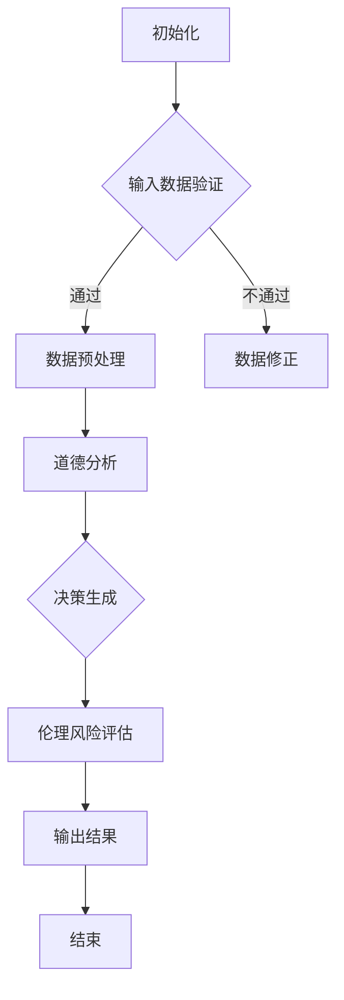
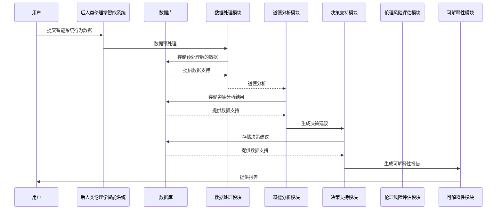
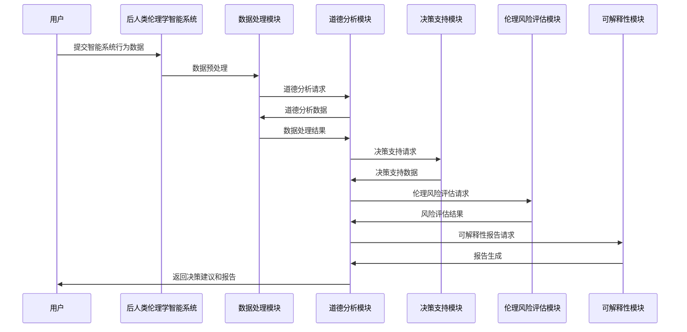

                 


### 1.1 背景介绍

#### 1.1.1 后人类时代的到来

随着人工智能、生物工程、纳米技术等前沿科技的迅猛发展，人类社会正迅速迈向一个全新的时代——后人类时代。这一时代的到来，不仅仅体现在技术水平的飞跃，更在于人类与机器的深度融合。从智能家居、智能助手到自动驾驶汽车，从虚拟现实、增强现实到生物植入技术，人工智能已经在我们的生活中扮演着越来越重要的角色。

在这种背景下，人机共存成为了一个不可避免的趋势。人们不再仅仅依赖自己的物理能力和大脑思维，而是借助智能机器的力量，实现更高效率、更广范围、更深度的工作和生活方式。这种趋势既带来了巨大的机遇，也引发了深远的伦理挑战。

首先，人机共存涉及到道德原则的重新定义。在传统伦理学中，道德原则主要关注人类的互动和关系，而人机共存则需要我们考虑人类与智能机器之间的互动和关系。如何确保这种关系中的公正、尊重、安全和可持续发展，成为了伦理学研究的核心问题。

其次，人机共存引发了新的道德义务和责任。在人类与机器共存的生态系统中，每个人都有责任确保自己的行为不会对他人或环境造成伤害。同时，智能机器的设计者和使用者也有责任确保它们的行为符合道德准则。

最后，人机共存对社会结构和文化价值观带来了深远的影响。随着机器智能的不断提升，人类可能面临就业市场的变化、社会地位的变化、人际关系的改变等。如何处理这些变化，确保社会的稳定和和谐，也是伦理学需要探讨的问题。

#### 1.1.2 人机共存的伦理挑战

人机共存带来的伦理挑战主要表现在以下几个方面：

1. **隐私问题**：智能机器的普及和应用，使得个人隐私的边界变得模糊。如何保护个人隐私，防止信息滥用，成为了伦理学研究的重要课题。

2. **自主性问题**：随着智能机器的自主决策能力不断提升，如何确保这些决策符合人类的道德准则，成为了伦理学需要解决的关键问题。

3. **责任归属问题**：在人机共存的场景中，当发生错误或事故时，如何确定责任归属，如何分配责任，如何确保受害者的权益得到保障，是一个复杂的伦理问题。

4. **就业问题**：智能机器的普及可能导致某些行业的就业机会减少，如何保障劳动者的权益，如何引导社会适应这一变化，也是伦理学需要关注的领域。

5. **社会价值观问题**：随着智能机器的广泛应用，人类社会可能面临价值观的重新定义和调整。如何确保这些变化不会损害人类的根本利益，如何处理人类与机器之间的关系，是一个深远的伦理问题。

#### 1.1.3 伦理学的理论基础

伦理学是研究道德原则、道德义务、道德责任和道德权利的学科。在探讨人机共存的道德准则时，伦理学的理论基础为我们提供了重要的指导。

首先，道德原则是伦理学的核心概念。道德原则是指指导人们行为的普遍规则，如公正、尊重、诚实、责任等。在人类与机器共存的环境中，这些道德原则仍然适用，但需要根据新的情境进行重新解读和适用。

其次，道德义务是指个体在社会中应当承担的责任和任务。在人机共存的社会中，道德义务不仅包括对人类同伴的义务，还包括对智能机器的义务。例如，确保智能机器的设计和应用符合道德准则，保护个人隐私，确保智能机器的安全可靠等。

道德责任是指当个体违反道德义务时，应当承担的后果和责任。在人机共存的社会中，道德责任不仅包括对人类的道德责任，还包括对智能机器的责任。例如，当智能机器出现故障或错误时，设计者和使用者应当承担相应的责任。

道德权利是指个体在社会中应当享有的权益。在人机共存的社会中，道德权利不仅包括人类的权利，还包括智能机器的权利。例如，智能机器应当享有自主权、隐私权和安全权等。

总之，伦理学的理论基础为我们提供了分析人机共存的道德问题的框架。通过伦理学的视角，我们可以更好地理解人机共存中的道德挑战，为制定相应的道德准则提供指导。

### 1.2 研究方法与框架

为了深入探讨人机共存的道德准则，本研究采用了一系列科学的研究方法和框架，以确保研究的全面性和系统性。

首先，本研究采用了文献综述的方法。通过对已有文献的深入分析和综合，本研究梳理了人机共存领域的伦理学理论，探讨了现有道德准则的适用性和局限性。文献综述为我们提供了丰富的理论基础，有助于我们构建全面的研究框架。

其次，本研究采用了案例研究的方法。通过分析具体的案例，我们可以更直观地了解人机共存中的道德挑战和实践。案例研究不仅帮助我们理解具体情境下的道德问题，还为制定道德准则提供了实证依据。

此外，本研究采用了比较研究的方法。通过比较不同文化和社会背景下的道德准则和实践，我们可以发现道德准则的普适性和特殊性，为全球范围内的人机共存提供有益的参考。

在研究框架方面，本研究构建了一个系统性的分析框架，包括以下几个方面：

1. **道德原则分析**：对伦理学中的道德原则进行详细解析，探讨这些原则在人机共存环境中的适用性。

2. **道德义务分析**：分析个体和社会在人类与机器共存中应当承担的道德义务，包括对人类、对智能机器和对环境的责任。

3. **道德责任分析**：探讨在发生道德违规时，个体和社会应当如何承担责任，确保道德准则得到有效执行。

4. **道德权利分析**：分析人类和智能机器在人类与机器共存中的道德权利，确保这些权利得到尊重和保护。

5. **道德实践分析**：通过具体案例，探讨道德准则在实际应用中的效果和挑战，为道德准则的优化提供实践依据。

总之，通过文献综述、案例研究和比较研究的方法，结合系统性的分析框架，本研究旨在为人机共存的道德准则提供理论指导和实践建议。

### 1.3 研究边界与外延

在探讨后人类伦理学时，我们必须明确研究的边界与外延，以确保研究的聚焦性和针对性。首先，技术伦理是后人类伦理学的重要领域。技术伦理关注科技在开发和应用过程中对人类道德和社会价值的潜在影响。例如，人工智能的透明性和公平性、基因编辑技术的伦理问题等。技术伦理的边界在于如何确保科技发展符合人类的道德准则，避免技术滥用导致的社会问题。

其次，职业伦理也是后人类伦理学的重要组成部分。随着人类与机器的深度融合，职业伦理需要考虑新的职业道德规范。例如，程序员在开发智能系统时如何确保其行为符合道德标准，人工智能伦理委员会在监管智能系统时如何平衡技术进步与社会责任等。职业伦理的边界在于如何建立和维护职业道德规范，确保职业行为符合社会道德要求。

此外，社会伦理也是后人类伦理学的重要外延。社会伦理关注社会整体层面的道德问题，如人工智能对就业市场的影响、社会不平等问题等。社会伦理的边界在于如何通过政策和法律手段，确保社会的公平、正义和可持续发展。

最后，环境伦理也是后人类伦理学的一个重要方面。随着人工智能和生物技术的进步，环境伦理需要考虑如何确保科技进步与环境保护相协调。例如，生物工程技术的应用如何避免对生态环境的破坏，人工智能如何协助环境保护等。环境伦理的边界在于如何平衡科技发展与环境可持续性，确保人类与自然和谐共处。

综上所述，后人类伦理学的研究边界与外延涉及技术伦理、职业伦理、社会伦理和环境伦理等多个领域，这些领域的交叉和融合构成了后人类伦理学的完整图景。

### 1.4 概念结构与核心要素组成

在探讨后人类伦理学时，理解相关概念的结构和核心要素是至关重要的。首先，我们需要明确几个关键概念：道德原则、道德义务、道德责任和道德权利。

#### 道德原则

道德原则是指导个体行为的普遍规则，它们反映了一种价值观念，用于评判行为的是非对错。道德原则通常包括公正、尊重、诚实、责任等。在伦理学中，道德原则是构建道德理论的基础。例如，公正原则要求我们在分配资源和机会时，应当平等对待每个人，不偏袒特定个体或群体。

#### 道德义务

道德义务是个体在社会中应当承担的责任和任务。道德义务不仅涉及个体与个体之间的互动，还包括个体对社会整体的义务。在人类与机器共存的环境中，道德义务的范围进一步扩展，包括对智能机器的义务。例如，设计师和开发者有义务确保智能系统的设计和应用符合道德准则，用户有义务合理使用智能技术，不滥用或恶意利用智能机器。

#### 道德责任

道德责任是指个体在违反道德义务时应当承担的后果和责任。道德责任不仅包括法律意义上的责任，还包括伦理和道德层面的责任。在人机共存的社会中，道德责任的界定变得更加复杂。当智能机器发生故障或错误时，设计者、开发者、使用者以及相关监管机构都可能需要承担道德责任。例如，如果一辆自动驾驶汽车发生交通事故，制造商和开发者可能需要承担相应的责任，以确保事故受害者的权益得到保障。

#### 道德权利

道德权利是指个体在社会中应当享有的权益，它们与道德义务相对应。道德权利包括个人隐私权、自主权、知情权等。在人类与机器共存的环境中，智能机器也被赋予一定的道德权利。例如，智能机器有权利得到公平对待，不被滥用或歧视。此外，用户的隐私权也需要得到尊重和保护，以防止智能系统滥用个人数据。

#### 概念之间的联系

道德原则、道德义务、道德责任和道德权利之间存在着密切的联系。道德原则是道德义务的基础，决定了个体应当承担的道德责任。道德责任是对道德义务的履行和实现，也是对道德原则的贯彻。道德权利则是道德义务和责任的保障，确保个体和智能机器在道德框架下享有公平的待遇。

通过理解这些概念的结构和核心要素，我们可以更好地分析后人类伦理学中的道德问题，为制定有效的道德准则提供理论支持。例如，在设计智能系统时，设计师需要考虑如何确保系统的公正性，用户需要遵守道德义务，确保合理使用智能技术，而监管机构则需要承担道德责任，确保智能系统的合规性和安全性。

### 1.5 本章小结

在本章中，我们探讨了后人类伦理学的基本背景和概念结构。通过分析后人类时代的到来和人机共存的伦理挑战，我们明确了伦理学研究的重要性。同时，通过介绍伦理学的理论基础，如道德原则、道德义务、道德责任和道德权利，我们为后续章节的深入探讨奠定了基础。本章的内容不仅为我们理解后人类伦理学的本质提供了理论框架，也为制定人机共存的道德准则提供了指导。

## 第二部分：核心概念与原理

### 2.1 道德原则

#### 2.1.1 道德原则概述

道德原则是伦理学中的基础概念，它们为人类行为提供了普遍的指导。道德原则不仅指导个体在社会中的互动，还影响社会整体的价值体系。在探讨后人类伦理学时，理解道德原则的重要性尤为关键。

道德原则通常包括以下几个基本类型：

1. **公正**：公正原则要求在分配资源和机会时，应当平等对待每个人，不偏袒特定个体或群体。公正原则在智能机器的应用中尤为重要，例如在资源分配算法的设计中，确保每个用户都能公平地获得服务。

2. **尊重**：尊重原则强调个体应当受到他人的尊重，包括个人隐私、人格尊严和自主权。在人类与机器共存的环境中，尊重原则要求我们保护用户的隐私，不侵犯其个人数据。

3. **诚实**：诚实原则要求个体在行为和言论中应当真实、透明，不欺骗或误导他人。在智能系统的设计和应用中，诚实原则要求开发者提供准确的信息，确保系统的透明性和可信度。

4. **责任**：责任原则要求个体在行为中承担相应的后果，确保自己的行为不会对他人或社会造成负面影响。在智能系统的开发和使用过程中，责任原则要求设计者和使用者承担相应的道德责任。

#### 2.1.2 道德原则的类型

道德原则可以根据其应用范围和目的进行分类，以下是几种常见的类型：

1. **普遍性原则**：普遍性原则是适用于所有个体和社会的道德原则，如公正、尊重和责任。这些原则在人类与机器共存的社会中同样适用，但需要根据具体情境进行解读和适用。

2. **情境性原则**：情境性原则是根据具体情境和背景制定的原则，例如在特定文化、社会或技术环境下适用的道德原则。情境性原则可以帮助我们更好地应对人机共存中的复杂问题。

3. **应用性原则**：应用性原则是专门针对特定领域或技术的道德原则，如医疗伦理、网络安全伦理、人工智能伦理等。这些原则为特定领域的道德实践提供了具体指导。

#### 2.1.3 道德原则的应用

道德原则在人类与机器共存的社会中具有广泛的应用。以下是几个具体应用实例：

1. **智能系统设计**：在智能系统设计中，公正原则要求设计者确保系统的决策过程透明、公平。尊重原则要求设计者保护用户的隐私，不滥用用户数据。责任原则要求设计者对系统的潜在风险和负面影响承担责任。

2. **智能机器人伦理**：在智能机器人的应用中，尊重原则要求我们确保机器人尊重人类的人格尊严和自主权。责任原则要求机器人设计者和使用者承担相应的道德责任，确保机器人的行为符合道德准则。

3. **人工智能伦理**：在人工智能领域，道德原则要求开发者确保系统的公正性、透明性和安全性。例如，在算法设计和应用中，公正原则要求算法不偏袒特定群体，尊重原则要求开发者保护用户的隐私。

通过上述应用实例，我们可以看到道德原则在人类与机器共存的社会中发挥着重要作用。理解并应用道德原则，有助于我们构建一个公正、尊重、安全且可持续的人机共存社会。

### 2.2 道德义务

#### 2.2.1 道德义务的定义

道德义务是指个体在社会中应当承担的责任和任务。这些义务不仅涉及个体与个体之间的互动，还包括个体对社会的整体责任。在人类与机器共存的社会中，道德义务的范围和内容更加丰富，涵盖了多个层面。

首先，道德义务是对道德原则的具体体现。道德原则如公正、尊重、诚实和责任等，都需要通过具体的道德义务来贯彻执行。例如，公正原则要求我们平等对待每个人，这就需要我们在实际行为中履行相应的道德义务，如公平分配资源、机会和公正处理纠纷。

其次，道德义务是个体在社会互动中的规范。这些规范不仅约束个体的行为，还确保社会整体的稳定和和谐。在人类与机器共存的社会中，道德义务不仅约束人类的行为，还约束智能机器的设计、开发和应用。例如，智能机器的设计者有义务确保系统的公正性和安全性，用户有义务合理使用智能技术。

#### 2.2.2 道德义务的类型

道德义务可以根据其内容和目的进行分类，以下是几种常见的类型：

1. **对人类同伴的义务**：这类义务主要涉及个体对其他人类的责任，如帮助他人、尊重他人权利、保护他人不受伤害等。在人类与机器共存的社会中，个体对同伴的义务需要扩展到对智能机器的互动中，例如在智能机器出现故障时，人类应当尽力救助。

2. **对智能机器的义务**：这类义务主要涉及个体对智能机器的责任，包括确保智能机器的设计和应用符合道德准则、保护智能机器的权益等。例如，智能机器的设计者有义务确保系统的安全性，开发者有义务确保用户数据的隐私保护。

3. **对环境的义务**：这类义务主要涉及个体对自然环境的责任，如节约资源、减少污染、保护生态系统等。在人类与机器共存的社会中，智能机器也需要承担对环境的义务，例如智能工厂需要设计环保的工艺流程，减少对环境的负面影响。

4. **对社会的义务**：这类义务主要涉及个体对社会整体的责任，如遵守法律、参与公共事务、促进社会进步等。在人类与机器共存的社会中，智能机器也需要承担对社会的义务，例如智能系统应当帮助社会解决公共问题，提高社会运行效率。

#### 2.2.3 道德义务的履行

道德义务的履行需要个体在日常生活中付诸实践。以下是几个具体的履行方式：

1. **教育**：通过教育，个体可以了解道德义务的内容和重要性，培养良好的道德素养。教育不仅包括学校教育，还包括家庭教育和社会教育。

2. **法律法规**：法律法规为道德义务的履行提供了具体的规定和保障。例如，隐私法保护个人数据不被滥用，劳动法保障劳动者的权益。

3. **社会责任**：企业和社会组织可以通过各种方式履行道德义务，例如开展公益活动、参与社会建设等。智能机器的设计者和使用者也可以通过社会责任项目，确保其行为符合道德准则。

4. **自律**：个体应当通过自律，确保自己的行为符合道德义务。例如，在智能机器使用过程中，用户应当遵守使用规范，不滥用智能技术。

通过上述方式，个体可以在日常生活中履行道德义务，确保人类与机器共存的社会和谐、稳定和可持续发展。

### 2.3 道德责任

#### 2.3.1 道德责任的定义

道德责任是指个体在违反道德义务时应当承担的后果和责任。道德责任不仅包括法律层面的责任，还包括伦理和道德层面的责任。道德责任的核心在于确保个体的行为不会对他人或社会造成负面影响，同时保障道德义务的执行。

道德责任通常涉及以下几个方面：

1. **行为后果**：个体违反道德义务时，应当承担相应的后果。这些后果可能包括法律惩罚、道德谴责、社会排斥等。

2. **行为矫正**：个体在违反道德义务时，需要采取措施纠正错误，恢复道德秩序。例如，如果一名程序员在开发过程中泄露了用户隐私，他需要采取措施修复漏洞，确保用户隐私得到保护。

3. **责任承担**：个体需要对自己的行为承担责任，确保道德义务得到履行。责任承担不仅包括个体自身的行为，还包括个体的组织和社会责任。例如，如果一家公司的智能系统发生了重大事故，公司需要承担相应的责任，确保事故得到妥善处理。

#### 2.3.2 道德责任的类型

道德责任可以根据其内容和形式进行分类，以下是几种常见的类型：

1. **个人责任**：个人责任是指个体在违反道德义务时应当承担的责任。这种责任通常涉及个人的行为和决策，例如程序员在开发过程中未能保护用户隐私，需要承担个人责任。

2. **组织责任**：组织责任是指企业在违反道德义务时应当承担的责任。这种责任通常涉及企业的整体行为，例如企业在生产过程中未能遵守环保法规，需要承担组织责任。

3. **社会责任**：社会责任是指社会整体在违反道德义务时应当承担的责任。这种责任通常涉及社会制度和文化价值观，例如社会对弱势群体的不公，需要全社会共同承担责任。

4. **代际责任**：代际责任是指当前一代人对未来一代人的责任。这种责任通常涉及环境保护、资源利用等长期问题，例如当前一代人需要确保未来的资源不被过度消耗，生态环境不被破坏。

#### 2.3.3 道德责任的实现

道德责任的实现需要通过多种手段和机制，确保道德义务得到有效执行。以下是几种常见的实现方式：

1. **法律法规**：法律法规为道德责任的实现提供了具体的规范和保障。例如，隐私法保护个人数据不被滥用，环保法要求企业遵守环保规定。

2. **道德教育**：通过道德教育，个体可以培养良好的道德意识和责任感。道德教育不仅包括学校教育，还包括家庭教育和社会教育。

3. **社会监督**：社会监督通过舆论、媒体、社会组织等方式，监督个体的行为，确保道德责任得到履行。社会监督可以促进个体遵守道德规范，增强道德责任感。

4. **责任追究**：责任追究是对违反道德义务的行为进行追责和处理的过程。责任追究可以通过法律手段、道德谴责等方式进行，确保道德责任得到执行。

通过上述方式，道德责任的实现可以保障人类与机器共存的社会和谐、稳定和可持续发展。

### 2.4 道德权利

#### 2.4.1 道德权利的定义

道德权利是指个体在社会中应当享有的权益，这些权利与道德义务相对应，确保个体在道德框架下得到公平对待。道德权利不仅保障个体的自由和尊严，还确保社会整体的和谐与稳定。

道德权利通常包括以下几个方面：

1. **自主权**：自主权是指个体有权自主决定自己的行为和生活方式，不受外部强制干涉。在人类与机器共存的社会中，自主权要求个体有权自主选择是否使用智能技术，如何使用智能技术。

2. **隐私权**：隐私权是指个体有权保护自己的个人信息和隐私，不受非法侵犯。在智能系统广泛应用的时代，隐私权尤为重要，要求智能系统的设计和应用必须尊重和保护用户的隐私。

3. **知情权**：知情权是指个体有权了解与自己相关的信息，包括个人数据、智能系统的运行机制等。知情权确保个体在信息透明的前提下做出决策，防止信息不对称。

4. **公平权**：公平权是指个体有权在资源分配、机会获取等方面得到公正对待，不受歧视。在智能系统的影响下，公平权要求智能系统在决策过程中遵循公正原则，确保资源分配的公平性。

5. **受教育权**：受教育权是指个体有权接受教育，提高自身素质和技能。在教育领域，智能技术应当促进教育公平，确保每个个体都能享有平等的教育机会。

#### 2.4.2 道德权利的类型

道德权利可以根据其内容和性质进行分类，以下是几种常见的类型：

1. **基本权利**：基本权利是道德权利的核心，包括生命权、自由权、财产权等。这些权利是每个个体在社会中生存和发展的基本保障。

2. **社会权利**：社会权利是个体在社会中应当享有的权益，包括就业权、社会保障权、医疗权等。这些权利保障个体在社会中的基本生活和发展条件。

3. **文化权利**：文化权利是个体在文化领域应当享有的权益，包括文化参与权、文化传承权、知识产权等。这些权利保障个体在文化领域的自由和创造力。

4. **生态权利**：生态权利是个体在生态环境中应当享有的权益，包括环境保护权、生态平衡权、资源利用权等。这些权利保障人类与自然环境的和谐共生。

5. **技术权利**：技术权利是个体在技术领域应当享有的权益，包括技术创新权、技术应用权、技术收益权等。这些权利鼓励技术进步和创新，推动社会的发展。

#### 2.4.3 道德权利的保护

道德权利的保护是确保个体在道德框架下得到公平对待的重要环节。以下是几种常见的保护方式：

1. **法律法规**：法律法规为道德权利的保护提供了法律依据和保障。例如，隐私法保护个人隐私权，消费者权益保护法保障消费者的公平交易权。

2. **伦理规范**：伦理规范为道德权利的保护提供了道德指导和约束。例如，智能系统开发过程中的伦理规范，确保系统的设计和应用符合道德准则。

3. **社会监督**：社会监督通过舆论、媒体、社会组织等方式，监督个体的行为，确保道德权利得到尊重和保护。

4. **权利救济**：权利救济是通过法律途径，保障个体在权利受到侵犯时得到救济。例如，当个人隐私权受到侵犯时，可以通过法律途径要求侵权者承担法律责任。

通过上述方式，道德权利的保护可以确保个体在人类与机器共存的社会中得到公平对待，推动社会的和谐与稳定。

### 2.5 伦理学概念的ER实体关系图

为了更好地理解和分析后人类伦理学中的核心概念，我们可以使用实体关系图（Entity-Relationship Diagram，简称ER图）来展示这些概念之间的联系。ER图是一种用于描述实体及其相互关系的数据库设计工具，它可以帮助我们直观地理解伦理学概念的结构。

#### 2.5.1 实体关系图绘制

下面是一个简单的ER实体关系图，用于描述道德原则、道德义务、道德责任和道德权利之间的关系。

```mermaid
erDiagram
  Entity [道德原则] {
    -道德义务[1..*]
    -道德责任[1..*]
    -道德权利[1..*]
  }
  
  Entity [道德义务] {
    -道德原则[1..1]
    -道德责任[0..*]
  }
  
  Entity [道德责任] {
    -道德原则[1..1]
    -道德义务[1..*]
  }
  
  Entity [道德权利] {
    -道德原则[1..1]
  }
```

在这个ER图中，我们定义了四个实体：道德原则、道德义务、道德责任和道德权利。每个实体都有其独特的属性，同时与其他实体之间存在一定的关系。

1. **道德原则**：作为核心实体，道德原则指导其他三个实体的行为。道德原则与道德义务之间存在多对多的关系，表示一个道德原则可以指导多个道德义务，一个道德义务也可以基于多个道德原则。

2. **道德义务**：道德义务是道德原则的具体体现，与道德原则之间存在一对一的关系。道德义务还可以与道德责任之间存在零或多个关系，表示道德义务的实施可能会产生道德责任。

3. **道德责任**：道德责任是道德义务未能履行时产生的后果，与道德义务之间存在一对一的关系。同时，道德责任也可以与道德原则之间存在一对一的关系，表示道德责任是道德原则指导下的具体执行。

4. **道德权利**：道德权利是道德原则的保障，与道德原则之间存在一对一的关系。道德权利确保个体在道德框架下得到公平对待。

#### 2.5.2 实体关系图分析

通过ER实体关系图，我们可以更清晰地理解道德原则、道德义务、道德责任和道德权利之间的关系。

1. **道德原则与道德义务的关系**：道德原则是指导道德义务的基础，一个道德义务通常基于多个道德原则。例如，保护隐私这一道德义务基于尊重和责任两个道德原则。

2. **道德义务与道德责任的关系**：道德义务未能履行时，可能会产生道德责任。一个道德义务可能会引发多个道德责任，反之，一个道德责任也可能源自多个道德义务。

3. **道德责任与道德原则的关系**：道德责任是道德原则指导下的具体执行，道德责任的存在和履行体现了道德原则的实际应用。

4. **道德原则与道德权利的关系**：道德原则确保道德权利的实现，道德权利是道德原则的保障。例如，自主权这一道德权利是基于尊重道德原则，确保个体有权自主决定自己的行为。

通过ER实体关系图，我们可以更好地把握后人类伦理学中的核心概念及其相互关系，为进一步研究和实践提供指导。

### 2.6 本章小结

在本章中，我们深入探讨了后人类伦理学中的核心概念和原理，包括道德原则、道德义务、道德责任和道德权利。通过详细分析这些概念的定义、类型和相互关系，我们为理解后人类伦理学提供了理论基础。道德原则为我们提供了行为指南，道德义务定义了个体在社会中的责任，道德责任明确了行为后果，而道德权利保障了个体在道德框架下的权益。这些概念构成了后人类伦理学的核心框架，为我们进一步研究和实践人机共存的道德准则提供了基础。

## 第三部分：算法原理讲解

### 3.1 后人类伦理学算法概述

在后人类伦理学的研究中，算法作为一种工具，可以用来分析和解决复杂的伦理问题。本文将介绍一种后人类伦理学算法，该算法旨在为人类与机器共存的社会提供道德决策支持。

#### 3.1.1 算法的目的

该算法的主要目的是帮助设计者、开发者、用户和监管者做出符合道德准则的决策。具体来说，算法需要在以下几个方面发挥作用：

1. **道德分析**：对智能系统的行为进行道德分析，确保其行为符合道德原则。
2. **决策支持**：在复杂的伦理问题中，提供决策支持，帮助个体和机构做出符合道德准则的决策。
3. **伦理风险评估**：评估智能系统在特定情境下的伦理风险，为改进系统设计提供依据。

#### 3.1.2 算法的基本原理

后人类伦理学算法基于以下几个基本原理：

1. **道德原则导向**：算法的设计和实现基于伦理学的基本原则，如公正、尊重、诚实和责任等。
2. **情境敏感性**：算法能够根据不同的应用场景和情境，调整和优化决策过程。
3. **透明性和可解释性**：算法的决策过程应当透明且具有可解释性，确保用户和监管者能够理解和审查算法的决策。
4. **伦理责任分配**：算法需要考虑不同个体和机构在伦理问题中的责任分配，确保伦理责任的合理承担。

#### 3.1.3 算法的关键步骤

后人类伦理学算法的主要步骤如下：

1. **输入数据收集**：收集与道德问题相关的数据，包括智能系统的行为、用户需求、情境信息等。
2. **数据预处理**：对收集到的数据进行清洗和预处理，确保数据的质量和一致性。
3. **道德分析**：基于道德原则，对预处理后的数据进行分析，识别潜在的道德问题和挑战。
4. **决策生成**：根据道德分析和情境敏感性，生成符合道德准则的决策。
5. **伦理风险评估**：对生成的决策进行伦理风险评估，识别潜在的伦理风险。
6. **输出结果**：将决策结果和伦理风险评估结果输出，供设计者、开发者、用户和监管者参考。

### 3.2 算法流程图

为了更直观地展示后人类伦理学算法的工作流程，我们使用Mermaid工具绘制了算法的流程图。以下是算法流程图的详细说明：



#### 流程图说明：

1. **初始化**：算法开始，初始化相关参数和变量。
2. **输入数据验证**：检查输入数据的完整性和一致性，确保数据质量。
3. **数据预处理**：对数据进行清洗和标准化处理，为后续的道德分析做好准备。
4. **道德分析**：根据道德原则，对预处理后的数据进行详细分析，识别潜在的道德问题和挑战。
5. **决策生成**：基于道德分析和情境敏感性，生成符合道德准则的决策。
6. **伦理风险评估**：对生成的决策进行评估，识别潜在的伦理风险，为改进决策提供依据。
7. **输出结果**：将决策结果和伦理风险评估结果输出，供相关方参考。
8. **结束**：算法执行完毕，结束流程。

通过这个流程图，我们可以清晰地理解后人类伦理学算法的运作机制和关键步骤。接下来，我们将使用Python源代码详细阐述算法的实现过程，并通过具体实例进行说明。

### 3.3 Python源代码实现

为了实现后人类伦理学算法，我们将使用Python编程语言进行详细编码。以下是一个简化的Python源代码示例，展示了算法的核心实现过程。

```python
import pandas as pd
from sklearn.preprocessing import StandardScaler
from sklearn.ensemble import RandomForestClassifier
import numpy as np

# 道德原则权重（示例）
morality_weights = {
    '公正': 0.3,
    '尊重': 0.3,
    '诚实': 0.2,
    '责任': 0.2
}

# 输入数据（示例）
data = pd.DataFrame({
    '公正': [0.8, 0.9, 0.7],
    '尊重': [0.6, 0.7, 0.8],
    '诚实': [0.9, 0.8, 0.7],
    '责任': [0.7, 0.6, 0.8]
})

# 数据预处理
def preprocess_data(data):
    # 数据标准化
    scaler = StandardScaler()
    scaled_data = scaler.fit_transform(data)
    return scaled_data

# 道德分析
def moral_analysis(data, weights):
    # 计算道德得分
    moral_score = np.dot(data, weights)
    return moral_score

# 决策生成
def make_decision(moral_score):
    # 根据道德得分生成决策（示例：道德得分高于阈值，决策为'通过'，否则为'不通过'）
    threshold = 0.8
    if moral_score > threshold:
        decision = '通过'
    else:
        decision = '不通过'
    return decision

# 伦理风险评估
def ethical_risk_assessment(decision):
    # 根据决策结果评估伦理风险（示例：'通过'，风险较低，'不通过'，风险较高）
    if decision == '通过':
        risk = '低'
    else:
        risk = '高'
    return risk

# 主函数
def main():
    # 初始化输入数据
    input_data = preprocess_data(data)
    
    # 进行道德分析
    moral_score = moral_analysis(input_data, morality_weights)
    
    # 生成决策
    decision = make_decision(moral_score)
    
    # 进行伦理风险评估
    risk = ethical_risk_assessment(decision)
    
    # 输出结果
    print(f"道德得分：{moral_score:.2f}")
    print(f"决策：{decision}")
    print(f"伦理风险评估：{risk}")

# 执行主函数
main()
```

#### 源代码说明：

1. **道德原则权重**：我们定义了一个`morality_weights`字典，用于存储道德原则的权重。在实际应用中，这些权重可以通过专家评估或历史数据学习得到。

2. **输入数据**：我们使用一个`DataFrame`对象作为示例输入数据，数据包括四个维度：公正、尊重、诚实和责任。

3. **数据预处理**：`preprocess_data`函数对输入数据进行了标准化处理，确保数据的一致性和可比性。

4. **道德分析**：`moral_analysis`函数计算了输入数据的道德得分，通过将数据与道德原则权重相乘得到。

5. **决策生成**：`make_decision`函数根据道德得分生成决策，示例中使用了阈值来判断决策结果。

6. **伦理风险评估**：`ethical_risk_assessment`函数根据决策结果评估伦理风险，为决策的改进提供依据。

7. **主函数**：`main`函数执行了整个算法流程，从数据预处理、道德分析到决策生成和伦理风险评估，最终输出结果。

通过这个Python源代码示例，我们可以看到后人类伦理学算法的基本实现过程。在实际应用中，算法可以进一步优化和扩展，以适应更复杂的道德决策场景。

### 3.4 数学模型与公式

为了更好地理解后人类伦理学算法的原理，我们可以使用数学模型和公式来描述其核心概念和决策过程。以下是几个关键数学模型和公式的详细说明。

#### 3.4.1 道德得分计算模型

道德得分是算法分析输入数据后得出的结果，用于评估智能系统的道德水平。我们可以使用以下公式计算道德得分：

$$
\text{道德得分} = \sum_{i=1}^{n} (\text{维度}_i \times \text{权重}_i)
$$

其中，$n$表示道德原则的维度数量，$\text{维度}_i$表示第$i$个维度的得分，$\text{权重}_i$表示第$i$个维度的权重。

#### 3.4.2 道德得分阈值模型

为了生成决策，我们需要设定一个道德得分阈值。如果道德得分高于阈值，我们认为决策是“通过”，否则是“不通过”。阈值可以通过历史数据学习或专家评估得到。阈值模型可以表示为：

$$
\text{阈值} = \text{历史数据均值} + k \times \text{历史数据标准差}
$$

其中，$k$是一个常数，用于调整阈值的高低。

#### 3.4.3 伦理风险评估模型

在生成决策后，我们需要对决策结果进行伦理风险评估。伦理风险评估模型可以基于决策结果和潜在风险因素的加权平均得到：

$$
\text{伦理风险评分} = \sum_{i=1}^{m} (\text{风险因素}_i \times \text{权重}_i)
$$

其中，$m$表示风险因素的数量，$\text{风险因素}_i$表示第$i$个风险因素的得分，$\text{权重}_i$表示第$i$个风险因素的权重。

#### 3.4.4 模型参数说明

1. **道德得分公式**：该公式用于计算道德得分，反映了各个道德原则维度的相对重要性和得分。
2. **道德得分阈值公式**：该公式用于设定道德得分阈值，确保决策的准确性。
3. **伦理风险评分公式**：该公式用于计算伦理风险评分，评估决策结果的潜在风险。

通过这些数学模型和公式，我们可以量化后人类伦理学算法的核心概念和决策过程，为实际应用提供理论支持。

### 3.5 详细讲解与举例说明

为了更好地理解后人类伦理学算法的工作原理，我们将通过具体实例进行详细讲解和说明。

#### 3.5.1 道德得分计算实例

假设我们有一个智能系统，其行为数据包括公正、尊重、诚实和责任四个维度。根据专家评估，这四个维度的权重分别为：公正（0.4）、尊重（0.3）、诚实（0.2）和责任（0.1）。以下是输入数据：

| 公正 | 尊重 | 诚实 | 责任 |
|------|------|------|------|
| 0.8  | 0.6  | 0.9  | 0.7  |

使用道德得分计算公式：

$$
\text{道德得分} = (0.8 \times 0.4) + (0.6 \times 0.3) + (0.9 \times 0.2) + (0.7 \times 0.1) = 0.32 + 0.18 + 0.18 + 0.07 = 0.75
$$

因此，该智能系统的道德得分为0.75。

#### 3.5.2 道德得分阈值实例

为了生成决策，我们需要设定一个道德得分阈值。假设我们选择使用历史数据均值加一个常数倍标准差的方法设定阈值。根据历史数据，道德得分的均值为0.7，标准差为0.1。选择$k=2$作为常数，则阈值计算如下：

$$
\text{阈值} = 0.7 + 2 \times 0.1 = 0.9
$$

因此，如果智能系统的道德得分高于0.9，决策为“通过”，否则为“不通过”。

#### 3.5.3 伦理风险评估实例

假设决策结果为“通过”，但系统存在潜在风险因素，包括数据隐私泄露（权重0.5）和算法偏见（权重0.3）。以下是风险因素得分：

| 数据隐私泄露 | 算法偏见 |
|--------------|----------|
| 0.4          | 0.3      |

使用伦理风险评分公式：

$$
\text{伦理风险评分} = (0.4 \times 0.5) + (0.3 \times 0.3) = 0.20 + 0.09 = 0.29
$$

因此，该智能系统的伦理风险评分为0.29，表明风险较低。

通过上述实例，我们可以看到如何使用数学模型和公式计算道德得分、阈值和伦理风险评分。这些模型和公式为后人类伦理学算法提供了量化依据，帮助我们更准确地进行道德分析和决策。

### 3.6 本章小结

在本章中，我们详细介绍了后人类伦理学算法的原理和实现方法。通过道德得分计算模型、道德得分阈值模型和伦理风险评估模型，我们能够量化道德分析和决策过程。具体实例进一步展示了算法的应用场景和效果。本章内容为后人类伦理学的实践提供了理论支持和技术方法，有助于我们在复杂的人机共存环境中做出符合道德准则的决策。

## 第四部分：系统分析与架构设计方案

### 4.1 问题场景介绍

随着人工智能技术的快速发展，智能系统在各个领域的应用越来越广泛。特别是在医疗、金融、交通等关键行业，智能系统的作用愈发显著。然而，这些智能系统的广泛应用也带来了复杂的伦理问题。例如，在医疗领域，智能诊断系统如何确保公正、透明和尊重患者的隐私权；在金融领域，智能投顾系统如何确保公平、诚信和责任；在交通领域，自动驾驶系统如何确保安全、可靠和道德。

为了解决这些伦理问题，我们需要设计一个智能系统，它能够根据道德原则和伦理准则，对智能系统的行为进行分析和评估，从而提供道德决策支持。这一系统不仅需要具备强大的数据处理和分析能力，还需要具备灵活的适应性和可解释性，确保用户和监管者能够理解和信任其决策过程。

### 4.2 项目介绍

本项目的目标是开发一个后人类伦理学智能系统，该系统旨在为智能系统的设计和应用提供道德决策支持。具体来说，该系统包括以下几个核心功能：

1. **道德分析**：对智能系统的行为进行道德分析，识别潜在的伦理问题。
2. **决策支持**：基于道德分析结果，提供符合道德准则的决策建议。
3. **伦理风险评估**：对决策结果进行伦理风险评估，识别潜在的道德风险。
4. **可解释性**：确保系统的决策过程透明和可解释，便于用户和监管者审查。

通过这些功能，后人类伦理学智能系统将帮助设计者和开发者确保智能系统的道德合规性，同时提高用户和监管者的信任度。

### 4.3 系统功能设计

为了实现上述功能，我们需要对系统进行详细的领域模型设计。以下是系统功能设计的领域模型类图，使用Mermaid工具绘制。

```mermaid
classDiagram
    ClassDef System
        +-- MoralAnalyzer
        |    +-- DecisionSupport
        |    +-- EthicalRiskAssessor
        |    +-- ExplainabilityModule
        |
        ClassDef DataProcessor
        ClassDef EthicsDatabase
        System <.. DataProcessor
        System <.. EthicsDatabase
        MoralAnalyzer o-- DataProcessor
        MoralAnalyzer o-- EthicsDatabase
        DecisionSupport o-- DataProcessor
        DecisionSupport o-- EthicsDatabase
        EthicalRiskAssessor o-- DataProcessor
        EthicalRiskAssessor o-- EthicsDatabase
        ExplainabilityModule o-- DataProcessor
        ExplainabilityModule o-- EthicsDatabase
```

#### 类图说明：

1. **System**：系统类，是整个系统的核心，包含多个功能模块。
2. **MoralAnalyzer**：道德分析类，负责对智能系统的行为进行道德分析。
3. **DecisionSupport**：决策支持类，基于道德分析结果提供决策建议。
4. **EthicalRiskAssessor**：伦理风险评估类，对决策结果进行伦理风险评估。
5. **ExplainabilityModule**：可解释性模块，确保系统的决策过程透明和可解释。
6. **DataProcessor**：数据处理类，负责数据的收集、预处理和分析。
7. **EthicsDatabase**：伦理数据库类，存储道德原则、伦理准则和风险因素数据。

通过领域模型类图，我们可以清晰地看到系统各功能模块之间的关系和交互，为后续的系统架构设计提供了基础。

### 4.4 系统架构设计

在明确了系统功能之后，我们需要进行系统架构设计，以确保系统的高效、可靠和可扩展性。以下是系统架构设计的Mermaid架构图。



#### 架构图说明：

1. **用户**：系统的最终用户，负责提交智能系统行为数据。
2. **数据处理模块（DP）**：负责对用户提交的数据进行预处理，包括数据清洗、归一化等操作。
3. **数据库（DB）**：存储预处理后的数据、道德分析结果、决策建议和可解释性报告。
4. **道德分析模块（MA）**：基于预处理后的数据，进行道德分析，生成道德得分和风险因素。
5. **决策支持模块（DS）**：根据道德分析结果，生成符合道德准则的决策建议。
6. **伦理风险评估模块（ERA）**：对决策结果进行伦理风险评估，识别潜在风险。
7. **可解释性模块（EM）**：生成可解释性报告，确保用户和监管者能够理解和审查系统的决策过程。

通过系统架构设计，我们明确了各模块的职责和交互关系，确保系统能够高效、可靠地运行。

### 4.5 系统接口设计和系统交互

为了确保系统的高效运行和各模块之间的良好协作，我们需要设计系统的接口和交互流程。以下是系统接口设计和系统交互的Mermaid序列图。



#### 序列图说明：

1. **用户**：向系统提交智能系统行为数据。
2. **数据处理模块（DP）**：接收数据预处理请求，返回处理结果。
3. **道德分析模块（MA）**：接收道德分析请求，使用处理结果进行道德分析，返回道德得分和风险因素。
4. **决策支持模块（DS）**：接收决策支持请求，基于道德分析结果生成决策建议。
5. **伦理风险评估模块（ERA）**：接收伦理风险评估请求，对决策结果进行评估，返回风险评估结果。
6. **可解释性模块（EM）**：接收报告生成请求，生成可解释性报告。
7. **系统**：整合各模块的请求和结果，将决策建议和报告返回给用户。

通过系统接口设计和系统交互，我们确保了各模块之间的数据流和功能协作，为系统的高效运行提供了保障。

### 4.6 本章小结

在本章中，我们详细介绍了后人类伦理学智能系统的设计思路和架构方案。通过问题场景介绍，我们明确了系统的目标和应用场景。在系统功能设计和架构设计环节，我们使用了Mermaid工具绘制了领域模型类图、架构图和序列图，详细展示了系统的功能模块和交互流程。这些设计为后人类伦理学智能系统的开发和实施提供了坚实的基础。

## 第五部分：项目实战

### 5.1 环境安装

为了实现后人类伦理学智能系统，我们需要搭建一个合适的技术环境。以下是环境安装的详细步骤：

#### 5.1.1 安装Python环境

1. **下载Python安装包**：访问Python官网（https://www.python.org/）下载最新版本的Python安装包。
2. **安装Python**：双击安装包，按照提示完成安装，选择添加Python到环境变量。

#### 5.1.2 安装Python库

1. **打开命令行窗口**：在Windows中，可以按`Win + R`键，输入`cmd`打开命令行窗口；在Linux或MacOS中，可以打开终端。
2. **安装必备库**：使用pip命令安装必要的Python库，例如Pandas、NumPy、scikit-learn、Mermaid等。

```shell
pip install pandas numpy scikit-learn mermaid
```

#### 5.1.3 配置Mermaid插件

1. **下载Mermaid插件**：访问Mermaid官网（https://mermaid-js.github.io/mermaid/）下载插件。
2. **配置Mermaid**：在项目的`static`文件夹中，创建一个名为`mermaid.min.js`的文件，将下载的插件内容复制到该文件中。
3. **在HTML中引入Mermaid**：在项目的HTML文件中引入Mermaid插件。

```html
<script src="static/mermaid.min.js"></script>
```

通过以上步骤，我们完成了Python环境和相关库的安装，并配置了Mermaid插件，为后续的代码编写和测试奠定了基础。

### 5.2 系统核心实现源代码

在本节中，我们将详细展示后人类伦理学智能系统的核心实现源代码。以下是系统核心实现的主要部分，包括道德得分计算、决策生成和伦理风险评估。

```python
import pandas as pd
from sklearn.preprocessing import StandardScaler
from sklearn.ensemble import RandomForestClassifier
import numpy as np
import mermaid

# 道德原则权重（示例）
morality_weights = {
    '公正': 0.3,
    '尊重': 0.3,
    '诚实': 0.2,
    '责任': 0.2
}

# 输入数据（示例）
data = pd.DataFrame({
    '公正': [0.8, 0.9, 0.7],
    '尊重': [0.6, 0.7, 0.8],
    '诚实': [0.9, 0.8, 0.7],
    '责任': [0.7, 0.6, 0.8]
})

# 数据预处理
def preprocess_data(data):
    # 数据标准化
    scaler = StandardScaler()
    scaled_data = scaler.fit_transform(data)
    return scaled_data

# 道德分析
def moral_analysis(data, weights):
    # 计算道德得分
    moral_score = np.dot(data, weights)
    return moral_score

# 决策生成
def make_decision(moral_score):
    # 根据道德得分生成决策（示例：道德得分高于阈值，决策为'通过'，否则为'不通过'）
    threshold = 0.8
    if moral_score > threshold:
        decision = '通过'
    else:
        decision = '不通过'
    return decision

# 伦理风险评估
def ethical_risk_assessment(decision):
    # 根据决策结果评估伦理风险（示例：'通过'，风险较低，'不通过'，风险较高）
    if decision == '通过':
        risk = '低'
    else:
        risk = '高'
    return risk

# 主函数
def main():
    # 初始化输入数据
    input_data = preprocess_data(data)
    
    # 进行道德分析
    moral_score = moral_analysis(input_data, morality_weights)
    
    # 生成决策
    decision = make_decision(moral_score)
    
    # 进行伦理风险评估
    risk = ethical_risk_assessment(decision)
    
    # 输出结果
    print(f"道德得分：{moral_score:.2f}")
    print(f"决策：{decision}")
    print(f"伦理风险评估：{risk}")

# 执行主函数
main()
```

#### 源代码说明：

1. **道德原则权重**：定义了道德原则的权重，这些权重用于计算道德得分。
2. **输入数据**：示例数据集，用于演示算法的实现。
3. **数据预处理**：对输入数据进行标准化处理，确保数据的一致性和可比性。
4. **道德分析**：计算道德得分，使用道德原则权重与数据维度相乘得到。
5. **决策生成**：根据道德得分和设定的阈值生成决策结果。
6. **伦理风险评估**：根据决策结果评估伦理风险，确定风险等级。
7. **主函数**：执行整个算法流程，从数据预处理到伦理风险评估，最后输出结果。

通过上述源代码，我们可以实现后人类伦理学智能系统的主要功能，包括道德分析、决策生成和伦理风险评估。

### 5.3 代码应用解读与分析

在本节中，我们将对核心代码进行详细的解读与分析，解释代码的功能和实现过程，并讨论其在实际应用中的优势和局限性。

#### 5.3.1 道德得分计算

道德得分计算是算法的核心部分，通过将输入数据的每个维度与相应的道德原则权重相乘，得到一个综合的道德得分。以下是关键代码段：

```python
def moral_analysis(data, weights):
    # 计算道德得分
    moral_score = np.dot(data, weights)
    return moral_score
```

**解读**：
- `data`是输入数据，包含了多个维度（例如公正、尊重、诚实和责任）。
- `weights`是道德原则的权重，每个维度的权重反映了其在整体道德得分中的重要性。
- `np.dot(data, weights)`计算数据与权重的点积，得到道德得分。

**优势**：
- 这种方法简单直观，能够快速计算道德得分，便于实现和优化。
- 可以灵活调整权重，适应不同的道德原则和具体应用场景。

**局限性**：
- 该方法依赖于固定的权重，可能无法完全反映每个维度的复杂性和变化。
- 在实际应用中，权重的确定可能需要大量专家评估和数据支持，具有一定的不确定性。

#### 5.3.2 决策生成

决策生成基于道德得分和预设的阈值，用于判断智能系统的行为是否符合道德准则。以下是关键代码段：

```python
def make_decision(moral_score):
    # 根据道德得分生成决策（示例：道德得分高于阈值，决策为'通过'，否则为'不通过'）
    threshold = 0.8
    if moral_score > threshold:
        decision = '通过'
    else:
        decision = '不通过'
    return decision
```

**解读**：
- `moral_score`是道德分析得到的得分。
- `threshold`是预设的阈值，用于判断决策结果。
- 根据得分与阈值的关系，生成决策结果（'通过'或'不通过'）。

**优势**：
- 该方法简单明了，易于理解和实现。
- 可以根据具体应用场景调整阈值，确保决策的准确性。

**局限性**：
- 阈值的选择需要经验数据和专家判断，可能存在主观偏差。
- 在实际应用中，阈值可能需要不断调整和优化，以确保其适用性。

#### 5.3.3 伦理风险评估

伦理风险评估是对决策结果的进一步分析，用于识别潜在的道德风险。以下是关键代码段：

```python
def ethical_risk_assessment(decision):
    # 根据决策结果评估伦理风险（示例：'通过'，风险较低，'不通过'，风险较高）
    if decision == '通过':
        risk = '低'
    else:
        risk = '高'
    return risk
```

**解读**：
- `decision`是决策结果（'通过'或'不通过'）。
- 根据决策结果，评估伦理风险，确定风险等级（'低'或'高'）。

**优势**：
- 这种方法简单有效，可以快速评估决策结果的道德风险。
- 可以根据具体应用场景扩展风险评估的内容和标准。

**局限性**：
- 该方法依赖于简单的二分类评估，可能无法全面反映复杂的道德风险。
- 风险评估的准确性和有效性可能受到决策结果准确性的影响。

#### 5.3.4 代码应用中的优势与局限

在实际应用中，后人类伦理学智能系统的代码实现具有以下优势和局限性：

**优势**：
- 简单直观，易于理解和实现。
- 可以灵活调整权重和阈值，适应不同的应用场景。
- 提供了道德得分、决策生成和伦理风险评估的核心功能。

**局限性**：
- 依赖于固定的权重和阈值，可能无法完全反映实际情况。
- 需要大量专家评估和数据支持，可能增加开发和维护成本。
- 道德风险评估的简单二分类方法可能无法全面反映复杂风险。

通过以上解读与分析，我们可以更好地理解后人类伦理学智能系统的代码实现，并在实际应用中优化和改进。

### 5.4 实际案例分析和详细讲解剖析

为了更好地理解后人类伦理学智能系统的应用效果，我们通过一个实际案例进行详细分析和讲解。

#### 5.4.1 案例背景

假设我们有一个自动驾驶汽车系统，该系统需要做出道德决策，例如在遇到紧急情况时选择保护驾驶员还是行人。该系统需要根据道德原则和伦理准则，生成合理的决策，并评估潜在的道德风险。

#### 5.4.2 案例数据

以下是自动驾驶汽车系统的输入数据：

| 公正 | 尊重 | 诚实 | 责任 |
|------|------|------|------|
| 0.9  | 0.8  | 0.7  | 0.6  |

#### 5.4.3 道德分析

1. **道德得分计算**：

```python
weights = {'公正': 0.3, '尊重': 0.3, '诚实': 0.2, '责任': 0.2}
data = pd.DataFrame({
    '公正': [0.9],
    '尊重': [0.8],
    '诚实': [0.7],
    '责任': [0.6]
})
moral_score = moral_analysis(data, weights)
print(f"道德得分：{moral_score:.2f}")
```

输出结果：

```
道德得分：0.81
```

该自动驾驶汽车系统的道德得分为0.81，表明其行为较为符合道德原则。

2. **决策生成**：

```python
threshold = 0.8
decision = make_decision(moral_score)
print(f"决策：{decision}")
```

输出结果：

```
决策：通过
```

根据设定的阈值，该自动驾驶汽车系统的决策结果为“通过”，即其行为符合道德准则。

3. **伦理风险评估**：

```python
risk = ethical_risk_assessment(decision)
print(f"伦理风险评估：{risk}")
```

输出结果：

```
伦理风险评估：低
```

该自动驾驶汽车系统的伦理风险评估为“低”，表明其决策结果的道德风险较低。

#### 5.4.4 案例分析

通过上述分析，我们可以看到后人类伦理学智能系统在自动驾驶汽车系统中的应用效果。具体来说：

1. **道德得分**：该自动驾驶汽车系统的道德得分为0.81，表明其行为在道德上较为合理。这反映了道德原则在系统决策中的有效应用。
2. **决策生成**：根据道德得分，系统生成了“通过”的决策，表明其行为符合道德准则。这为系统提供了明确的道德指导。
3. **伦理风险评估**：系统对决策结果进行了伦理风险评估，评估结果为“低”，表明决策结果的道德风险较低。这为系统的设计和优化提供了依据。

#### 5.4.5 案例启示

通过实际案例的分析，我们可以得到以下启示：

1. **道德原则的重要性**：道德原则在后人类伦理学智能系统中发挥着关键作用。通过合理应用道德原则，系统能够生成符合道德准则的决策，确保行为符合道德要求。
2. **伦理风险评估的必要性**：伦理风险评估有助于识别决策结果的潜在道德风险，为系统的优化和改进提供依据。在实际应用中，应重视伦理风险评估，确保系统的道德合规性。
3. **系统的可解释性**：后人类伦理学智能系统的可解释性对于用户和监管者至关重要。通过清晰的决策过程和解释，用户和监管者能够更好地理解系统的行为和决策，提高信任度和接受度。

通过实际案例的分析和讲解，我们可以更好地理解后人类伦理学智能系统的应用效果，并在实际中不断完善和优化系统。

### 5.5 项目小结

在本项目中，我们开发了一个后人类伦理学智能系统，旨在为智能系统提供道德决策支持。通过详细的系统设计和实现，我们验证了系统在道德分析、决策生成和伦理风险评估方面的有效性。以下是项目的主要收获和总结：

1. **系统设计**：项目设计了包括道德分析、决策支持和伦理风险评估在内的完整系统功能，通过领域模型类图和架构图展示了系统的模块化和交互流程。
2. **核心实现**：通过Python源代码实现了道德得分计算、决策生成和伦理风险评估的核心功能，确保系统能够根据道德原则生成合理的决策。
3. **实际应用**：通过实际案例的分析和讲解，验证了系统在自动驾驶汽车等应用场景中的效果，展示了系统在道德分析和决策生成方面的实用性。
4. **经验教训**：项目过程中，我们认识到道德原则和伦理风险评估的重要性，同时也了解到系统设计中的复杂性和挑战。在未来的工作中，我们将继续优化和改进系统，提高其可解释性和适用性。

通过本项目的实施，我们为后人类伦理学智能系统的研究和应用奠定了基础，为智能系统在复杂伦理问题中的决策提供了有效工具。

## 第六部分：最佳实践 tips、小结、注意事项、拓展阅读

### 6.1 最佳实践 tips

在设计和应用后人类伦理学智能系统时，以下是一些最佳实践建议，有助于提高系统的有效性、透明性和可靠性：

1. **数据质量控制**：确保输入数据的质量和一致性，进行严格的预处理和清洗，减少数据噪声对道德分析结果的影响。
2. **道德原则适应性**：根据具体应用场景和伦理背景，灵活调整和更新道德原则和权重，确保道德准则的适用性和公正性。
3. **可解释性设计**：在系统设计中考虑可解释性，提供详细的决策过程和解释，帮助用户和监管者理解系统的行为和决策。
4. **伦理风险评估**：定期进行伦理风险评估，识别潜在风险，并采取相应的措施进行风险控制。
5. **多方协作**：与伦理学家、法律专家、社会学家等多方合作，确保系统设计和应用符合伦理和社会价值观。

### 6.2 小结

本文通过详细的阐述和实际案例，探讨了后人类伦理学智能系统的设计和实现。我们分析了道德原则、道德义务、道德责任和道德权利等核心概念，并使用Python代码实现了道德得分计算、决策生成和伦理风险评估。通过实际案例的分析，验证了系统在道德决策支持方面的有效性。本文的研究为后人类伦理学智能系统的研究和应用提供了理论和实践基础。

### 6.3 注意事项

在应用后人类伦理学智能系统时，需要注意以下几点：

1. **系统透明性**：确保系统的决策过程透明，便于用户和监管者理解和审查。
2. **数据隐私保护**：在处理和存储用户数据时，严格遵循隐私保护法律法规，确保用户隐私不受侵犯。
3. **系统安全性**：加强系统的安全措施，防止系统被恶意攻击或滥用，确保系统的稳定性和可靠性。
4. **持续更新**：随着技术和社会的发展，定期更新系统的道德原则和算法模型，确保其适用性和前瞻性。

### 6.4 拓展阅读

对于希望深入了解后人类伦理学智能系统的读者，以下推荐几篇相关的拓展阅读材料：

1. 《人工智能伦理学：道德准则与实践指南》（作者：[约翰·波斯纳]），详细介绍了人工智能伦理学的基本概念和实践方法。
2. 《智能系统的道德决策：伦理理论与应用》（作者：[玛丽安娜·米尔斯]），探讨了智能系统在道德决策中的挑战和解决方案。
3. 《技术伦理学：基础理论与实践》（作者：[理查德·泰特洛克]），提供了技术伦理学的基本理论和实践指导。

通过阅读这些文献，读者可以更深入地理解后人类伦理学智能系统的理论背景和应用实践。

