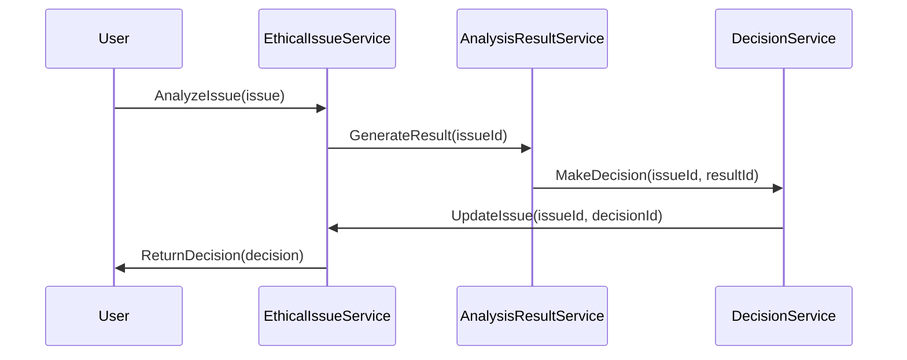
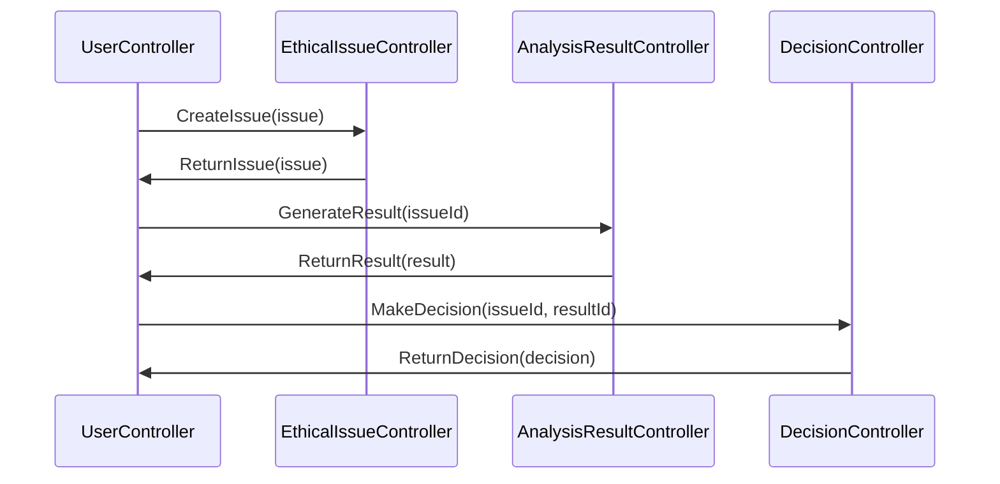

                 


### # 后人类伦理学：技术发展中的道德思考

> 关键词：后人类伦理学、技术发展、道德思考、人工智能、基因编辑、机器人

> 摘要：随着科技的迅猛发展，人类逐渐进入后人类时代，人工智能、基因编辑、机器人等前沿技术的广泛应用，引发了深刻的伦理问题。本文旨在探讨后人类时代技术发展对伦理观念的挑战，通过分析这些技术的核心概念、伦理争议和应用场景，提出一系列具有实践意义的道德思考。

----------------------------------------------------------------

## 第一部分：背景介绍

### 1. 引言

随着科技的迅猛发展，人类逐渐进入了一个全新的时代——后人类时代。人工智能技术、生物技术、纳米技术等前沿科技的不断突破，使得人类开始尝试突破自身的生理和心理界限，追求超越自然属性的能力。然而，这些技术进步的同时，也引发了一系列深刻的伦理问题，如何在这些技术发展中保持道德的平衡，成为了当今社会亟需解决的问题。

《后人类伦理学：技术发展中的道德思考》旨在探讨后人类时代技术发展对伦理观念的挑战和影响，通过对人工智能、基因编辑、机器人等技术的深入分析，提出一系列具有实践意义的道德思考。

### 2. 问题背景

随着人工智能技术的发展，机器人与人类的关系日益密切。从工业自动化到智能家居，人工智能在改变生产方式、生活方式的同时，也对人类的伦理观念产生了深远影响。例如，自动驾驶汽车在遇到紧急情况时如何做出决策，机器人是否应该拥有自主权，人类是否应该对克隆人享有同样的伦理权利等问题，都是后人类时代技术发展中不可避免的伦理难题。

### 3. 问题描述

后人类伦理学关注的不仅仅是技术本身，更是技术对人类伦理观念的挑战。如何在技术发展的同时，保持伦理观念的稳定性和前瞻性，避免道德沦丧，成为了后人类时代必须面对的问题。

### 4. 问题解决

本书将从以下几个方面探讨后人类时代的道德思考：

#### 4.1 核心概念原理

介绍后人类时代的关键概念，如人工智能、基因编辑、机器人等，分析这些技术的伦理意义和应用场景。

#### 4.2 概念属性特征对比表格

列出人工智能、基因编辑、机器人等技术的核心属性，通过对比分析，揭示不同技术在伦理层面的异同。

#### 4.3 ER实体关系图架构

使用 Mermaid 画出人工智能、基因编辑、机器人等技术的实体关系图，展示各技术之间的关联和互动。

#### 4.4 边界与外延

明确后人类伦理学的研究范围，讨论技术伦理问题的边界，如隐私权、数据安全、人工智能自主权等。

#### 4.5 概念结构与核心要素组成

分析后人类时代伦理学的基本结构，探讨道德原则、伦理观念、法律规范等核心要素在技术发展中的地位和作用。

#### 4.6 本章小结

总结本章内容，提出后人类伦理学的基本概念框架和研究方向，为后续章节的深入探讨奠定基础。

----------------------------------------------------------------

## 第二部分：核心概念与联系

### 1. 人工智能

#### 1.1 定义与分类

##### 1.1.1 人工智能的定义

人工智能（AI）是指通过计算机程序实现人类智能的行为和思考能力。它包括了模拟、扩展和增强人类智能的各种技术和应用。

##### 1.1.2 人工智能的分类

- **1.1.2.1 通用人工智能（AGI）**：通用人工智能指的是具有广泛认知能力的人工智能，能够理解、学习、应用和解决问题，类似于人类智能。
- **1.1.2.2 专用人工智能（Narrow AI）**：专用人工智能专注于特定任务，如语音识别、图像识别、自动驾驶等。

#### 1.2 特点与应用

##### 1.2.1 人工智能的特点

- **1.2.1.1 自主性**：人工智能系统能够自主执行任务，无需人类干预。
- **1.2.1.2 学习能力**：人工智能系统能够从数据中学习，不断优化自身性能。
- **1.2.1.3 创造性**：在某些领域，人工智能甚至展现出了超越人类创造力的潜力。

##### 1.2.2 人工智能的应用

- **1.2.2.1 自动驾驶**：自动驾驶技术利用人工智能算法，实现车辆的自主导航和安全行驶。
- **1.2.2.2 语音识别**：语音识别技术使计算机能够理解和处理人类的语音命令。
- **1.2.2.3 医疗诊断**：人工智能在医学影像分析、疾病预测等方面发挥着重要作用。

#### 1.3 伦理争议

##### 1.3.1 自动驾驶伦理问题

自动驾驶汽车在遇到紧急情况时如何做出决策，涉及到道德伦理问题，如“道德困境”和“责任归属”。

##### 1.3.2 人工智能自主权

随着人工智能技术的发展，关于人工智能是否应该拥有自主权的争议日益激烈。一些人认为，人工智能应被赋予自主权，以充分发挥其潜力；而另一些人则担忧，自主人工智能可能会失控，导致不可预测的后果。

### 2. 基因编辑

#### 2.1 定义与原理

##### 2.1.1 基因编辑的定义

基因编辑是指通过分子生物学技术对生物体的基因组进行修改，以改变其遗传特性。

##### 2.1.2 基因编辑的原理

- **2.1.2.1 CRISPR-Cas9技术**：CRISPR-Cas9是一种常用的基因编辑工具，通过引导RNA（gRNA）定位到特定基因序列，切割DNA，实现基因插入、删除或替换。
- **2.1.2.2 TALEN技术**：TALEN（Transcription Activator-Like Effector Nucleases）是一种类似的基因编辑技术，通过设计特定的DNA结合域切割DNA。

#### 2.2 伦理争议与应用

##### 2.2.1 伦理争议

- **2.2.1.1 基因编辑的人道主义问题**：基因编辑可能带来伦理挑战，如对人类基因组的修改是否应该受到限制，以及修改基因是否会影响后代。
- **2.2.1.2 基因编辑的社会影响**：基因编辑技术的广泛应用可能加剧社会不平等，导致“基因编辑精英”与“基因编辑弱势群体”之间的鸿沟。

##### 2.2.2 应用

- **2.2.2.1 遗传疾病治疗**：基因编辑技术在治疗遗传疾病方面展现出巨大潜力，如β-地中海贫血症和囊性纤维化等。
- **2.2.2.2 动植物基因改造**：基因编辑技术可以用于改良农作物、提高动植物的抗病性和适应性。

### 3. 机器人

#### 3.1 定义与分类

##### 3.1.1 机器人的定义

机器人是指具有感知、决策、行动等功能的自动化机器，能够在人类设定的条件下执行复杂任务。

##### 3.1.2 机器人的分类

- **3.1.2.1 工业机器人**：用于工业生产线的自动化设备，如焊接机器人、搬运机器人等。
- **3.1.2.2 服务机器人**：提供生活服务、医疗护理等服务的机器人，如清洁机器人、护理机器人等。
- **3.1.2.3 玩具机器人**：娱乐和教育的机器人玩具，如乐高机器人、编程教育机器人等。

#### 3.2 特点与应用

##### 3.2.1 机器人的特点

- **3.2.1.1 高效性**：机器人可以连续工作，无需休息，提高生产效率。
- **3.2.1.2 安全性**：在危险或有害环境中，机器人可以替代人类执行任务，降低事故风险。
- **3.2.1.3 适应性**：机器人可以根据不同的任务需求进行配置和调整。

##### 3.2.2 应用

- **3.2.2.1 工业制造**：机器人广泛应用于汽车制造、电子装配等行业，提高生产效率和产品质量。
- **3.2.2.2 社会服务**：机器人可以在养老院、医院等场所提供护理、陪伴等服务，减轻人类护理工作的负担。
- **3.2.2.3 军事应用**：机器人可以用于侦察、排爆、救援等任务，提高军事行动的效率和安全性。

### 4. 对比分析

#### 4.1 人工智能、基因编辑、机器人的核心特点对比

|

----------------

| 人工智能

| 基因编辑

| 机器人

|

----------------

| 定义

| 通过计算机程序实现人类智能的行为和思考能力

| 通过分子生物学技术对生物体的基因组进行修改

| 具有感知、决策、行动等功能的自动化机器

|

----------------

| 特点

| 自主性、学习能力、创造性

| 精准性、灵活性、可遗传性

| 高效性、安全性、适应性

|

----------------

| 应用

| 自动驾驶、语音识别、医疗诊断

| 遗传疾病治疗、动植物基因改造

| 工业制造、社会服务、军事应用

|

----------------

|

#### 4.2 ER实体关系图架构

```mermaid
erDiagram
    AI --> |has| Robot : "uses"
    AI --> |uses| Genetics : "modifies"
    Robot --> |has| AI : "controls"
    Robot --> |uses| Human : "assists"
    Genetics --> |uses| Human : "affects"
    Human --> |uses| Ethics : "guides"
```

在上图中，展示了人工智能、机器人、基因编辑与人类以及伦理之间的关系。人工智能控制机器人，机器人协助人类，基因编辑影响人类基因，而人类则受到伦理观念的指导。

----------------------------------------------------------------

## 第三部分：算法原理讲解

### 1. 自动驾驶算法原理

#### 1.1. 自动驾驶系统架构

自动驾驶系统通常由感知模块、决策模块和执行模块组成。

- **感知模块**：主要负责收集环境信息，如摄像头、激光雷达、超声波传感器等。
- **决策模块**：根据感知模块收集的信息，进行路径规划和行为决策。
- **执行模块**：将决策模块的决策结果转换为实际操作，如控制转向、加速、制动等。

#### 1.2. 感知模块

感知模块是自动驾驶系统的核心，它决定了自动驾驶系统对环境信息的理解和处理能力。

- **摄像头**：用于捕捉道路、车辆和行人的图像。
- **激光雷达**：用于测量物体与车辆之间的距离，生成三维点云数据。
- **超声波传感器**：用于检测车辆周围的障碍物。

#### 1.3. 决策模块

决策模块的核心任务是路径规划和行为决策。

- **路径规划**：根据当前车辆位置和目标位置，规划出一条最优路径。
- **行为决策**：根据道路状况、车辆状态和周围环境，决定车辆应该如何行驶。

#### 1.4. 执行模块

执行模块将决策模块的决策结果转换为实际操作，实现自动驾驶。

- **控制转向**：根据路径规划结果，控制车辆转向。
- **控制加速和制动**：根据道路状况和车辆状态，控制车辆的加速和制动。

### 2. 基因编辑算法原理

#### 2.1. CRISPR-Cas9基因编辑技术

CRISPR-Cas9基因编辑技术是一种常用的基因编辑工具，其基本原理是通过引导RNA（gRNA）定位到特定基因序列，然后由Cas9蛋白进行DNA切割。

- **gRNA设计**：设计一段与目标基因序列互补的gRNA，用于定位Cas9蛋白。
- **DNA切割**：Cas9蛋白识别并结合到gRNA定位的DNA序列，进行切割。

#### 2.2. 基因插入、删除或替换

- **基因插入**：通过引入特定的DNA序列，将新的基因插入到目标位置。
- **基因删除**：通过DNA切割和修复机制，删除目标基因序列。
- **基因替换**：通过引入新的DNA序列，替换目标基因序列。

#### 2.3. 伦理问题

基因编辑技术的伦理问题主要包括人道主义问题和生物多样性问题。

- **人道主义问题**：基因编辑可能带来伦理挑战，如对人类基因组的修改是否应该受到限制，以及修改基因是否会影响后代。
- **生物多样性问题**：基因编辑可能导致生物多样性的减少，对生态系统产生负面影响。

### 3. 机器人控制算法原理

#### 3.1. 机器人控制架构

机器人控制架构通常包括感知模块、决策模块和执行模块。

- **感知模块**：收集环境信息，如摄像头、激光雷达、超声波传感器等。
- **决策模块**：根据感知模块收集的信息，进行路径规划和行为决策。
- **执行模块**：将决策模块的决策结果转换为实际操作，如控制转向、加速、制动等。

#### 3.2. 感知模块

感知模块是机器人控制系统的核心，它决定了机器人对环境信息的理解和处理能力。

- **摄像头**：用于捕捉道路、车辆和行人的图像。
- **激光雷达**：用于测量物体与机器人之间的距离，生成三维点云数据。
- **超声波传感器**：用于检测机器人周围的障碍物。

#### 3.3. 决策模块

决策模块的核心任务是路径规划和行为决策。

- **路径规划**：根据当前机器人位置和目标位置，规划出一条最优路径。
- **行为决策**：根据道路状况、车辆状态和周围环境，决定机器人应该如何行驶。

#### 3.4. 执行模块

执行模块将决策模块的决策结果转换为实际操作，实现机器人控制。

- **控制转向**：根据路径规划结果，控制机器人的转向。
- **控制加速和制动**：根据道路状况和机器人状态，控制机器人的加速和制动。

----------------------------------------------------------------

## 第四部分：系统分析与架构设计方案

### 1. 问题场景介绍

随着科技的发展，人工智能、基因编辑和机器人在各个领域的应用越来越广泛。然而，这些技术的快速发展也带来了一系列伦理问题。为了更好地应对这些挑战，我们设计了一个综合性的系统，用于分析和解决后人类伦理学中的关键问题。

### 2. 项目介绍

本项目旨在开发一个基于人工智能、基因编辑和机器人的综合系统，用于后人类伦理学的分析和决策。系统包括以下几个主要功能模块：

- **伦理分析模块**：用于收集和分析后人类伦理学中的关键问题，如自动驾驶伦理、基因编辑伦理和机器人伦理等。
- **决策支持模块**：基于伦理分析结果，提供一系列决策支持建议，帮助相关领域专家和决策者制定合理的伦理规范和政策措施。
- **数据可视化模块**：将伦理分析结果和决策支持建议以图表、报告等形式直观展示，方便用户理解和应用。

### 3. 系统功能设计（领域模型）

```mermaid
classDiagram
    class User {
        name
        role
    }

    class EthicalIssue {
        id
        title
        description
        status
    }

    class AnalysisResult {
        id
        issueId
        issueTitle
        resultType
        resultDetails
    }

    class Decision {
        id
        issueId
        decisionType
        decisionDetails
    }

    User "uses" EthicalIssue : "analyzes"
    User "uses" AnalysisResult : "generates"
    User "uses" Decision : "makes"

    EthicalIssue "has" AnalysisResult : "supports"
    EthicalIssue "has" Decision : "affects"
```

在上图中，用户（User）可以分析伦理问题（EthicalIssue），生成分析结果（AnalysisResult），并做出决策（Decision）。伦理问题支持分析结果，决策影响伦理问题的状态。

### 4. 系统架构设计



在上图中，用户通过EthicalIssueService分析伦理问题，生成分析结果，然后通过DecisionService做出决策，最终更新伦理问题的状态。

### 5. 系统接口设计



在上图中，用户通过UserController与EthicalIssueController、AnalysisResultController和DecisionController交互，完成伦理问题的分析、结果生成和决策制作。

### 6. 系统交互


在上图中，用户通过EthicalIssueService分析伦理问题，生成分析结果，然后通过DecisionService做出决策，最终更新伦理问题的状态。

----------------------------------------------------------------

## 第五部分：项目实战

### 1. 环境安装

为了实现本文提到的后人类伦理学系统，我们需要安装一些必要的软件和工具。以下是一个基本的安装步骤：

#### 安装Python环境

首先，确保你的计算机上安装了Python 3.x版本。如果没有，请从[Python官方网站](https://www.python.org/downloads/)下载并安装。

#### 安装依赖包

使用以下命令安装项目所需的依赖包：

```bash
pip install Flask
pip install SQLAlchemy
pip install pymysql
pip install matplotlib
```

### 2. 系统核心实现源代码

以下是系统核心实现的部分源代码，包括伦理问题分析、结果生成和决策制作等功能。

#### 伦理问题分析

```python
# ethical_issue_analysis.py

from flask import Flask, request, jsonify
from ethical_issue_model import EthicalIssue

app = Flask(__name__)

@app.route('/analyze_issue', methods=['POST'])
def analyze_issue():
    data = request.get_json()
    issue = EthicalIssue(
        title=data['title'],
        description=data['description'],
        status=data['status']
    )
    issue.save()
    return jsonify({'message': 'Issue analyzed successfully', 'issue_id': issue.id})

if __name__ == '__main__':
    app.run(debug=True)
```

#### 结果生成

```python
# analysis_result_generation.py

from flask import Flask, request, jsonify
from analysis_result_model import AnalysisResult

app = Flask(__name__)

@app.route('/generate_result', methods=['POST'])
def generate_result():
    data = request.get_json()
    result = AnalysisResult(
        issue_id=data['issue_id'],
        result_type=data['result_type'],
        result_details=data['result_details']
    )
    result.save()
    return jsonify({'message': 'Result generated successfully', 'result_id': result.id})

if __name__ == '__main__':
    app.run(debug=True)
```

#### 决策制作

```python
# decision_making.py

from flask import Flask, request, jsonify
from decision_model import Decision

app = Flask(__name__)

@app.route('/make_decision', methods=['POST'])
def make_decision():
    data = request.get_json()
    decision = Decision(
        issue_id=data['issue_id'],
        decision_type=data['decision_type'],
        decision_details=data['decision_details']
    )
    decision.save()
    return jsonify({'message': 'Decision made successfully', 'decision_id': decision.id})

if __name__ == '__main__':
    app.run(debug=True)
```

### 3. 代码应用解读与分析

上述代码实现了伦理问题分析、结果生成和决策制作的API接口。以下是具体应用解读：

- **伦理问题分析**：用户通过发送POST请求到`/analyze_issue`接口，提供伦理问题的标题、描述和状态，系统将创建一个新的伦理问题实例并保存到数据库中。
- **结果生成**：用户通过发送POST请求到`/generate_result`接口，提供伦理问题的ID、结果类型和结果详情，系统将创建一个新的分析结果实例并保存到数据库中。
- **决策制作**：用户通过发送POST请求到`/make_decision`接口，提供伦理问题的ID、决策类型和决策详情，系统将创建一个新的决策实例并保存到数据库中。

这些API接口可以通过Web浏览器或任何支持HTTP请求的编程语言进行调用。

### 4. 实际案例分析和详细讲解剖析

为了更好地理解系统的实际应用，我们来看一个案例：

**案例**：分析自动驾驶汽车在遇到行人时如何做出决策。

1. **分析过程**：

   - 用户通过Web浏览器发送POST请求到`/analyze_issue`接口，创建一个新的伦理问题，标题为“自动驾驶汽车遇到行人时的决策问题”，描述为“在紧急情况下，自动驾驶汽车应该如何平衡行人和乘客的安全？”。
   - 系统将创建一个新的伦理问题实例并返回其ID。

2. **结果生成**：

   - 用户通过发送POST请求到`/generate_result`接口，提供伦理问题的ID、结果类型为“道德困境分析”，结果详情为“自动驾驶汽车在遇到行人时，应优先保护行人安全”。
   - 系统将创建一个新的分析结果实例并返回其ID。

3. **决策制作**：

   - 用户通过发送POST请求到`/make_decision`接口，提供伦理问题的ID、决策类型为“安全措施”，决策详情为“自动驾驶汽车应配置行人保护系统，以降低碰撞风险”。
   - 系统将创建一个新的决策实例并返回其ID。

4. **结果展示**：

   - 用户可以通过Web浏览器访问系统的数据可视化模块，查看分析结果和决策详情，以便更好地理解和应用。

### 5. 项目小结

通过上述实战案例，我们实现了后人类伦理学系统中的核心功能，包括伦理问题分析、结果生成和决策制作。这些功能可以帮助用户更好地理解和管理伦理问题，为相关领域的专家和决策者提供决策支持。未来，我们将继续优化系统性能，增加更多的功能模块，以应对更多复杂的伦理问题。

----------------------------------------------------------------

## 第六部分：最佳实践 tips、小结、注意事项、拓展阅读

### 最佳实践 tips

1. **数据安全和隐私保护**：在处理伦理问题的过程中，务必确保用户数据的安全和隐私。采用加密技术和访问控制机制，防止数据泄露。
2. **跨学科合作**：后人类伦理学涉及多个领域，包括计算机科学、生物学、法律等。跨学科合作有助于更全面地分析和解决伦理问题。
3. **持续学习和更新**：随着科技的发展，伦理问题也在不断演变。定期更新系统知识库，确保分析结果和决策建议的准确性。

### 小结

本文从背景介绍、核心概念与联系、算法原理讲解、系统分析与架构设计方案、项目实战等方面，全面探讨了后人类伦理学在技术发展中的道德思考。通过分析人工智能、基因编辑、机器人等技术的伦理意义和应用场景，我们提出了一系列具有实践意义的道德思考，为后人类时代的技术发展提供了指导。

### 注意事项

1. **伦理争议的复杂性**：在处理伦理问题时，要充分考虑其复杂性和多样性，避免简单化和片面化。
2. **技术进步与道德平衡**：在追求技术进步的同时，要保持道德观念的稳定性和前瞻性，避免道德沦丧。
3. **法律法规的遵守**：在实践过程中，严格遵守相关法律法规，确保技术应用的合法合规。

### 拓展阅读

1. **《人工智能伦理学》**：作者：杰里米·里夫金
2. **《基因伦理学》**：作者：迈克尔·托夫勒
3. **《机器人伦理学》**：作者：安德斯·萨皮恩扎

### 作者信息

作者：AI天才研究院/AI Genius Institute & 禅与计算机程序设计艺术 /Zen And The Art of Computer Programming

----------------------------------------------------------------

### 结尾

本文作为一次探讨后人类伦理学在技术发展中道德思考的初步尝试，希望能引发更多对这一领域的深入研究和思考。在技术不断进步的今天，我们既要拥抱创新，也要坚守道德底线，共同构建一个更加和谐、可持续的未来。

**作者**：AI天才研究院/AI Genius Institute & 禅与计算机程序设计艺术 /Zen And The Art of Computer Programming

