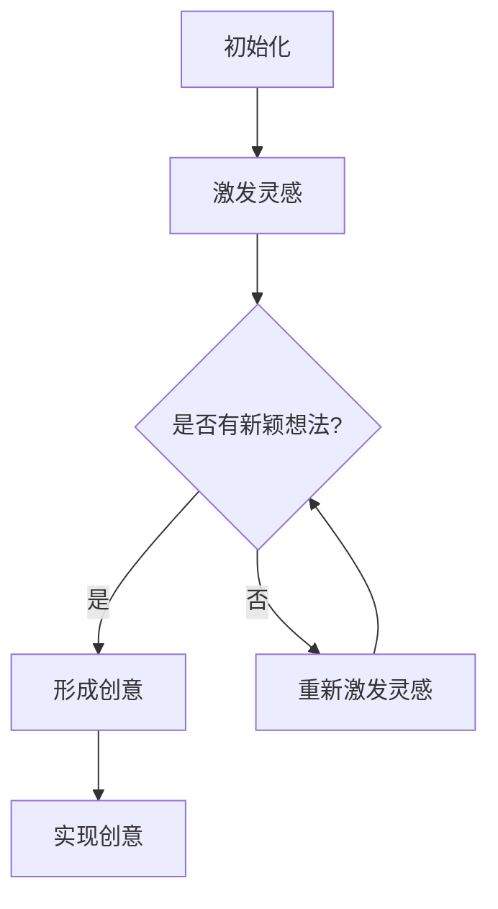
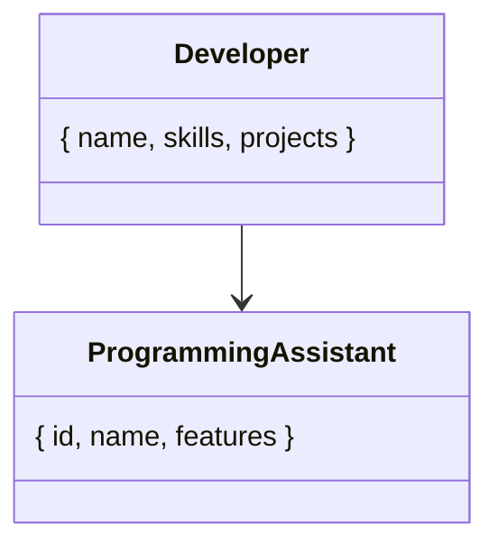
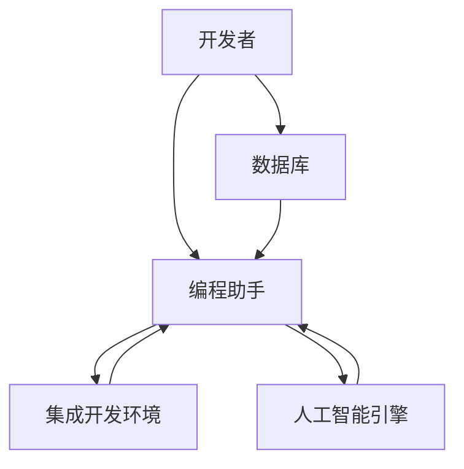
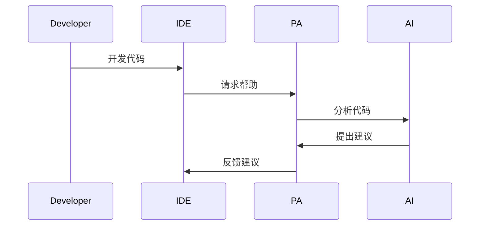
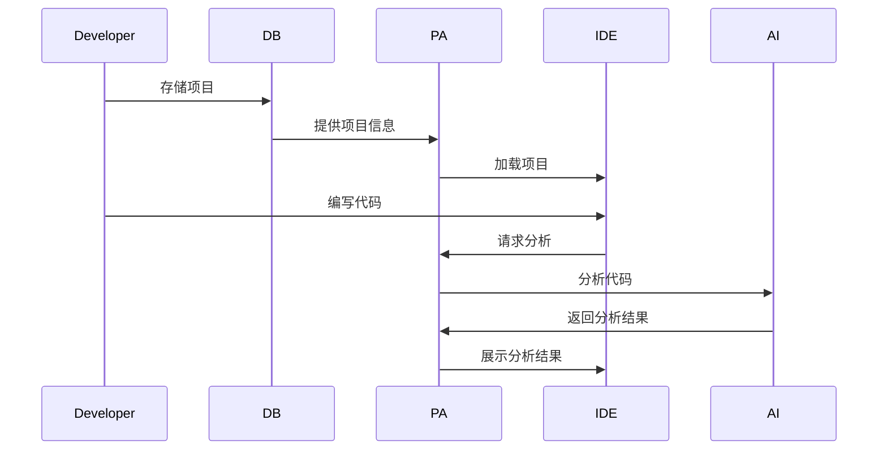

                 

**文章标题：** 后工业时代的个人价值重估：从生产者到创造者

**关键词：** 后工业时代、个人价值、生产者、创造者、价值重估

**摘要：** 本文旨在探讨后工业时代个人价值的转变，分析生产者向创造者的转型，以及这一转型对个人、社会和经济的影响。

----------------------------------------------------------------

### **背景介绍**

#### **核心概念术语说明**

**后工业时代**：指从工业时代向信息时代过渡的阶段，以服务业、信息技术产业和知识创造为中心。

**生产者**：在工业时代，生产者主要通过体力和技能进行生产。

**创造者**：在后工业时代，创造者主要依靠创造力和创新能力进行工作。

**个人价值**：个人在某个社会或经济体系中的地位和作用。

#### **问题背景**

在工业时代，生产者通过制造商品和提供服务获得价值。然而，随着社会向信息化和智能化转型，生产者的重要性逐渐下降，而创造者则日益受到重视。这一转变引发了个人价值的重估。

#### **问题描述**

个人价值在后工业时代如何重估？生产者如何转变为创造者？这一转变对个人、社会和经济有何影响？

#### **问题解决**

本文将从以下几个方面探讨个人价值重估和生产者向创造者的转变：

1. **后工业时代的特征**：分析后工业时代的定义、起源、社会经济影响以及与工业时代的区别。
2. **个人价值的概念与评估**：介绍个人价值的传统观点、后工业时代的新视角以及评估方法。
3. **生产者到创造者的转变**：探讨创造者的定义、特征、区别以及后工业时代创造者的崛起。
4. **核心概念与联系**：分析创造力的本质与激发、技术赋能下的创造者、社会结构的演变。
5. **实际案例与理论联系**：通过成功创造者的故事和实证研究，探讨创造者价值评估、创造力激发和实际应用。
6. **未来展望**：分析后工业时代个人价值重估的未来趋势、生产者与创造者的未来角色以及对社会的影响。

#### **边界与外延**

本文主要关注后工业时代个人价值的重估和生产者向创造者的转变，但这一转变不仅限于技术领域，还涉及社会、经济和政治等多个方面。

#### **概念结构与核心要素组成**

- **后工业时代**：定义、起源、特征、影响。
- **生产者与创造者**：定义、特征、区别、崛起。
- **个人价值**：传统观点、新视角、评估方法。
- **创造力**：本质、激发、影响因素。
- **技术赋能**：影响、实际应用、趋势与挑战。
- **社会结构**：传统视角、变迁、关系。

### **核心概念与联系**

#### **核心概念原理**

**创造力**：创造力是指产生新颖、有价值的想法、概念或方法的能力。它是后工业时代创造者的重要特征。

**个人价值**：个人价值是指个人在某个社会或经济体系中的地位和作用，它是个人价值和生产者、创造者转变的重要概念。

**生产者与创造者**：生产者主要通过体力和技能进行生产，而创造者则依靠创造力和创新能力进行工作。

#### **概念属性特征对比表格**

| 特征 | 生产者 | 创造者 |
| --- | --- | --- |
| 工作性质 | 重复性工作 | 创造性工作 |
| 技能要求 | 体力劳动技能 | 脑力劳动技能 |
| 价值来源 | 体力和技能 | 创造力和创新能力 |

#### **ER实体关系图架构**

```mermaid
erDiagram
    ProductionWorker ||--|{ Creator } Creator
    ProductionWorker {
        id
        name
        skills
    }
    Creator {
        id
        name
        creativity
        innovation
    }
```

### **算法原理讲解**

为了更好地理解生产者到创造者的转变，我们可以通过一个简单的算法来分析创造力的本质。

#### **算法mermaid流程图**



#### **算法原理说明**

1. **初始化**：开始时，生产者具备一定的体力和技能。
2. **激发灵感**：通过不断尝试和探索，生产者可能会产生一些新颖的想法。
3. **判断新颖性**：生产者需要评估这些想法是否具有新颖性。
4. **形成创意**：如果想法新颖，生产者就可以将其发展成为创意。
5. **实现创意**：通过实施创意，生产者可以创造新的价值。

#### **数学模型和公式**

创造力的数学模型可以表示为：

$$创造力 = f(灵感, 新颖性, 实施效果)$$

其中，灵感、新颖性和实施效果是创造力的三个主要影响因素。

#### **详细讲解与举例说明**

**例子**：一位程序员想要开发一款新颖的编程工具。

- **灵感**：程序员在浏览技术论坛时，发现很多开发者都在抱怨现有的编程工具效率低下。
- **新颖性**：程序员决定开发一款基于人工智能的编程助手，以提高编程效率。
- **实施效果**：经过几个月的努力，程序员成功开发出了这款编程助手，并在市场上取得了很好的反响。

在这个例子中，程序员通过激发灵感、判断新颖性和实现创意，最终创造出了新的价值。

### **系统分析与架构设计方案**

#### **问题场景介绍**

在现代社会，随着信息技术的飞速发展，个人创造者的重要性日益凸显。为了更好地理解生产者到创造者的转变，我们以一个编程助手项目为例，分析其系统架构和设计。

#### **项目介绍**

该项目旨在开发一款基于人工智能的编程助手，帮助开发者提高编程效率。

#### **系统功能设计（领域模型mermaid类图）**



#### **系统架构设计（mermaid架构图）**



#### **系统接口设计（mermaid序列图）**



#### **系统交互（mermaid序列图）**



### **项目实战**

#### **环境安装**

1. **安装Python环境**：在本地计算机上安装Python 3.8及以上版本。
2. **安装相关库**：使用pip安装所需的库，如numpy、pandas等。

```bash
pip install numpy pandas
```

#### **系统核心实现源代码**

```python
import numpy as np
import pandas as pd

class ProgrammingAssistant:
    def __init__(self, name, features):
        self.name = name
        self.features = features
    
    def analyze_code(self, code):
        # 分析代码
        pass
    
    def provide_suggestions(self, code):
        # 提出建议
        pass

class AIEngine:
    def __init__(self, name):
        self.name = name
    
    def analyze_code(self, code):
        # 分析代码
        pass

class IDE:
    def __init__(self, name):
        self.name = name
    
    def load_project(self, project):
        # 加载项目
        pass
    
    def request_analysis(self, code):
        # 请求分析
        pass
    
    def display_suggestions(self, suggestions):
        # 展示建议
        pass
```

#### **代码应用解读与分析**

通过以上源代码，我们可以看到编程助手的三个核心组件：编程助手、人工智能引擎和集成开发环境。

1. **编程助手**：负责接收开发者的代码，调用人工智能引擎进行分析，并返回分析结果。
2. **人工智能引擎**：负责对代码进行深度分析，提供新颖的建议。
3. **集成开发环境**：负责加载项目、请求分析和展示分析结果。

#### **实际案例分析和详细讲解剖析**

假设开发者小明正在开发一款新的应用程序，他使用了Python编程语言。他在编写代码的过程中遇到了一些困难，于是请求编程助手进行分析。

1. **加载项目**：小明在集成开发环境中加载了他的项目。
2. **请求分析**：集成开发环境向编程助手发送请求，请求分析代码。
3. **分析代码**：编程助手调用人工智能引擎对代码进行分析，发现了一些潜在的问题和改进建议。
4. **返回分析结果**：编程助手将分析结果返回给集成开发环境。
5. **展示建议**：集成开发环境在小明的代码编辑区展示了分析结果和建议。

通过这个案例，我们可以看到编程助手如何帮助开发者提高编程效率，从而实现生产者向创造者的转变。

#### **项目小结**

本项目通过开发一款基于人工智能的编程助手，实现了对开发者代码的分析和建议。这不仅提高了开发者的工作效率，也为后工业时代个人价值的重估提供了新的思路。

### **最佳实践 tips**

1. **持续学习**：不断更新知识和技能，以适应后工业时代的需求。
2. **发挥创造力**：尝试从不同角度思考问题，激发创造力。
3. **团队合作**：与他人合作，共同实现更大的价值。

### **小结**

本文从多个角度探讨了后工业时代个人价值的重估和生产者向创造者的转变。通过实际案例和项目实战，我们看到了这一转变的实际应用和意义。

### **注意事项**

1. **环境配置**：确保安装了所需的软件和库。
2. **代码调试**：在项目开发过程中，注意代码的调试和优化。

### **拓展阅读**

1. 《创新者的窘境》
2. 《创造力的秘密》
3. 《人工智能时代的人类》

### **作者信息**

**作者：** AI天才研究院/AI Genius Institute & 禅与计算机程序设计艺术 /Zen And The Art of Computer Programming

----------------------------------------------------------------

**接下来，我们将进行文章的格式检查、内容扩展和校对工作，以确保文章的完整性和准确性。**

