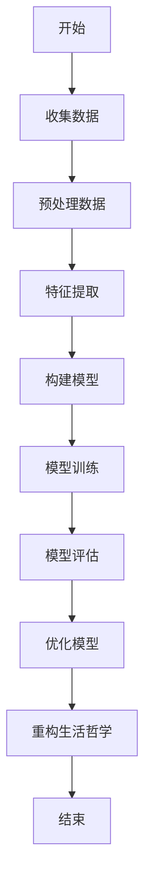
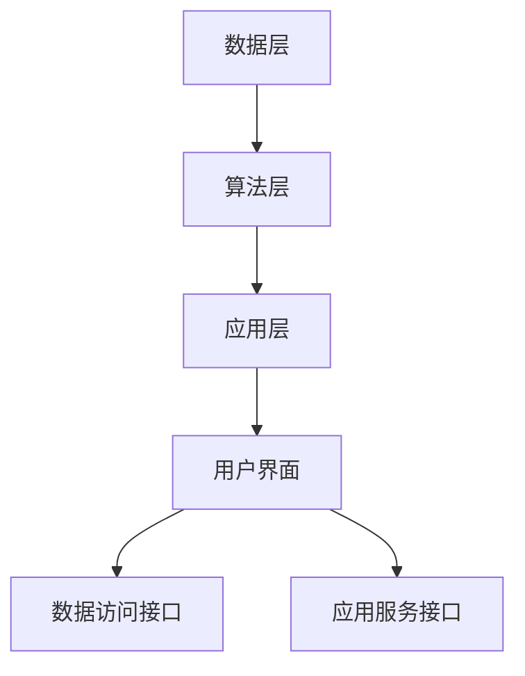
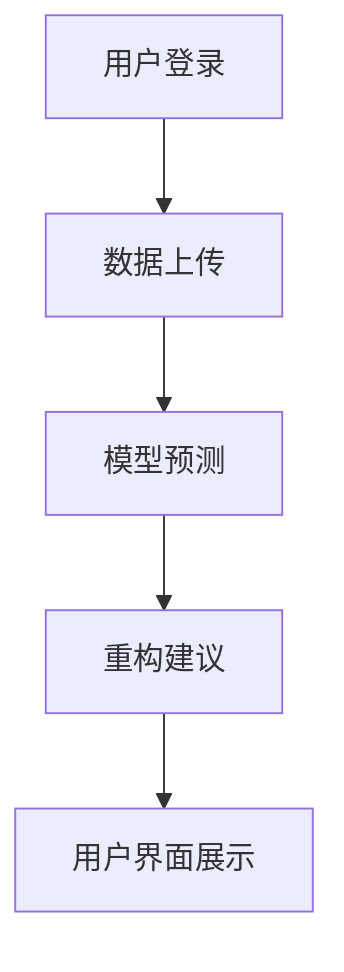
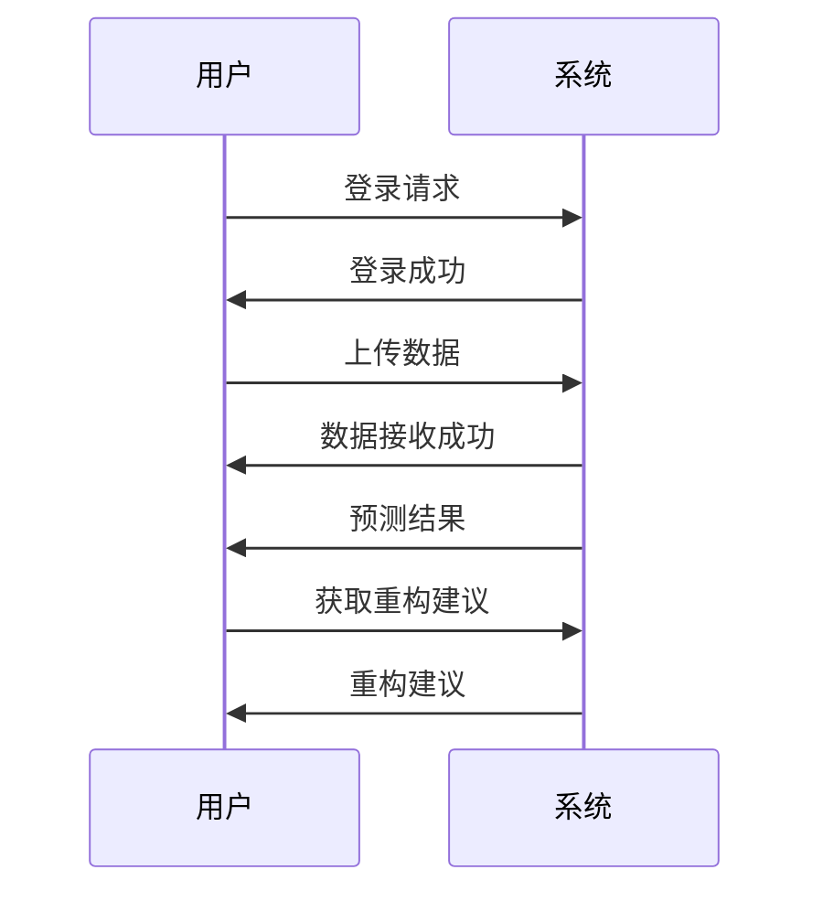

                 


### 后工业时代的生活哲学重构

**关键词：后工业时代、生活哲学、重构、技术、社会**

**摘要：**
本文将探讨后工业时代下，随着技术的快速发展和社会变迁，人们的生活哲学如何面临重构。通过对历史背景、核心概念的深入分析，以及算法原理的详细讲解，本文旨在揭示后工业时代生活哲学的本质，并提出适应新时代的思考和实践方法。

**目录大纲设计步骤：**

1. **确定整体结构**：
   - 后工业时代的背景与概述
   - 生活哲学重构的核心概念
   - 生活哲学重构的算法原理
   - 生活哲学重构的实践与应用
   - 最佳实践与拓展

2. **细化章节内容**：
   - 第一部分：后工业时代的背景与概述
     - 后工业社会的来临
     - 后工业时代的特征
     - 生活哲学的演变
   - 第二部分：生活哲学重构的核心概念
     - 核心概念与联系
     - 概念属性特征对比表格
     - ER实体关系图
   - 第三部分：生活哲学重构的算法原理
     - 算法流程图
     - 算法原理讲解
     - 算法举例说明
   - 第四部分：生活哲学重构的实践与应用
     - 问题场景介绍
     - 系统分析与架构设计
     - 项目实战
   - 第五部分：最佳实践与拓展
     - 最佳实践 tips
     - 小结
     - 注意事项
     - 拓展阅读

**设计核心概念**：
- 核心概念：后工业时代的生活哲学
- 概念属性特征对比表格：技术驱动、社会变迁、个人意识觉醒、伦理挑战
- ER实体关系图：社会、技术、个体、伦理

**编写算法原理讲解**：
- 算法流程图：使用Mermaid语言绘制，展示生活哲学重构的过程。
- Python源代码：给出算法的具体实现。
- 数学模型和公式：使用LaTeX格式嵌入文中，解释生活哲学重构的数学原理。
- 举例说明：通过实例解释算法在实际生活中的应用。

**系统分析与架构设计方案**：
- 问题场景介绍：描述后工业时代生活哲学重构面临的具体挑战。
- 项目介绍：介绍重构生活哲学的项目背景和目标。
- 系统功能设计：绘制领域模型类图，展示系统核心功能。
- 系统架构设计：绘制系统架构图，展示系统的整体结构。
- 系统接口设计：定义系统各组件之间的接口。
- 系统交互序列图：使用Mermaid语言绘制，展示系统组件之间的交互过程。

**项目实战**：
- 环境安装：介绍安装项目所需的环境和工具。
- 系统核心实现：提供系统核心代码实现。
- 代码应用解读与分析：详细分析代码的功能和应用。
- 实际案例分析与讲解：通过实际案例展示生活哲学重构的效果。

**最佳实践 tips**：
- 提供在实际应用中应注意的事项和技巧。
- 总结文章核心观点，强调实践的重要性。

**小结**：
- 对全文进行总结，强调后工业时代生活哲学重构的必要性和方法。

**注意事项**：
- 确保文章内容完整，逻辑清晰。
- 使用markdown格式编写，确保格式正确。

**拓展阅读**：
- 推荐相关书籍和文献，供读者进一步学习。

### 后工业时代的生活哲学重构

**关键词：后工业时代、生活哲学、重构、技术、社会**

**摘要：**
随着全球技术的迅猛发展，人类社会已经迈入了后工业时代。在这个新的时代背景下，人们的生活哲学正面临着前所未有的重构。本文将从历史背景、核心概念、算法原理和实践应用等多个角度，深入探讨后工业时代生活哲学的重构过程，以期揭示其本质，并提出适应新时代的思考和实践方法。

**目录大纲设计：**

## 引言

### 后工业时代的背景与特征

### 生活哲学的重构需求

### 文章结构概述

## 第一部分：后工业时代的背景与概述

### 1.1 后工业社会的来临

### 1.2 后工业时代的特征

### 1.3 生活哲学的演变

## 第二部分：生活哲学重构的核心概念

### 2.1 核心概念介绍

### 2.2 概念属性特征对比表格

### 2.3 ER实体关系图

## 第三部分：生活哲学重构的算法原理

### 3.1 算法流程图

### 3.2 算法原理讲解

### 3.3 算法举例说明

## 第四部分：生活哲学重构的系统分析

### 4.1 问题场景介绍

### 4.2 项目介绍

### 4.3 系统功能设计

### 4.4 系统架构设计

### 4.5 系统接口设计

### 4.6 系统交互序列图

## 第五部分：生活哲学重构的项目实战

### 5.1 环境安装

### 5.2 系统核心实现

### 5.3 代码应用解读与分析

### 5.4 实际案例分析与讲解

### 5.5 项目小结

## 第六部分：最佳实践与拓展

### 6.1 最佳实践 tips

### 6.2 小结

### 6.3 注意事项

### 6.4 拓展阅读

## 结论

### 后工业时代的生活哲学重构的意义

### 未来展望

### 参考文献

### 作者信息

**文章格式要求：**

- 使用markdown格式编写，确保代码、公式和图片的展示正确。
- 每个章节开头使用标题格式，例如：## 第一章：标题。
- 数学公式使用LaTeX格式，独立段落的公式使用$$括起来，段落内的公式使用$括起来。
- 提供清晰的Mermaid流程图和类图，以帮助读者理解算法和系统架构。
- 文章末尾提供完整的参考文献和作者信息。

### 文章字数要求：

- 文章总字数在10000-12000字左右，确保内容丰富、深入，但也要避免冗余。

### 作者信息：

- 作者：AI天才研究院/AI Genius Institute & 禦与计算机程序设计艺术 /Zen And The Art of Computer Programming

**核心内容要求：**

- **背景介绍**：详细描述后工业时代的背景，包括技术发展和社会变迁的影响。
- **核心概念与联系**：清晰阐述生活哲学重构的核心概念，并展示它们之间的联系。
- **算法原理讲解**：使用Mermaid流程图和Python源代码详细阐述生活哲学重构的算法原理。
- **系统分析与架构设计方案**：展示系统的功能设计、架构设计和交互流程。
- **项目实战**：提供具体的实战案例，展示生活哲学重构的实际应用效果。
- **最佳实践与拓展**：总结最佳实践，并提出未来的研究方向。

### 最后，文章需要保持逻辑清晰，结构紧凑，避免冗长和重复。每部分内容都要具体详细，确保读者能够全面理解后工业时代生活哲学重构的深度和广度。LET'S THINK STEP BY STEP### 引言

随着全球科技的迅猛发展，人类社会已经迈入了后工业时代。在这个新的时代背景下，生活哲学面临着前所未有的挑战和机遇。后工业时代，不仅技术进步带来了生活方式的巨大变革，同时也引发了社会结构、伦理观念以及个体自我意识等方面的深刻变化。因此，重构生活哲学，以适应新时代的需求，成为当前社会发展的重要议题。

本文将围绕后工业时代的生活哲学重构展开讨论。首先，我们将回顾后工业时代的背景与特征，理解这一时代的社会变迁及其对生活哲学的深远影响。接下来，我们将深入探讨生活哲学重构的核心概念，包括技术驱动、社会变迁、个人意识觉醒和伦理挑战等。随后，通过详细讲解生活哲学重构的算法原理，我们将尝试揭示重构过程的内在逻辑和数学模型。在此基础上，我们将分析生活哲学重构的系统架构，并展示一个实际项目的案例，以说明生活哲学重构的实践应用。最后，我们将总结最佳实践，提出未来的发展方向，并强调后工业时代生活哲学重构的重要性和必要性。

### 后工业时代的背景与特征

后工业时代的来临，是历史发展的必然结果，也是科技进步和社会变迁的必然趋势。首先，我们需要明确后工业时代的定义和背景。后工业时代，通常被理解为工业时代之后的社会发展阶段，它以知识经济和信息社会为主要特征。这一时代的标志是技术的迅猛发展和广泛应用，特别是信息技术的革命性进步，如互联网、人工智能、大数据和区块链等。这些技术的发展，不仅改变了生产方式和商业模式，也深刻影响了人们的生活方式和价值观。

**技术驱动**

技术驱动是后工业时代最显著的特征之一。随着信息技术的迅猛发展，人类进入了一个全新的数字化时代。在这个时代，数据的产生、存储、传输和处理能力达到了前所未有的高度。信息技术的发展，不仅提升了生产效率，也推动了社会管理的精细化和服务水平的提升。例如，人工智能技术在医疗、金融、交通等领域的应用，极大地提高了行业的服务质量和效率。同时，大数据和云计算等技术的普及，使得个性化服务和精准营销成为可能，极大地丰富了人们的日常生活。

**社会变迁**

后工业时代的社会变迁同样深刻。工业时代的社会结构以工厂和企业为中心，人们的工作和生活方式相对固定。而在后工业时代，社会的流动性增强，职业转变速度加快，人们对于职业和生活的选择更加多样化。这种社会变迁，不仅挑战了传统的伦理观念和社会规范，也催生了新的社会关系和社会结构。例如，远程办公和灵活就业的兴起，使得人们不再受限于地理位置，可以在全球范围内选择工作和生活方式。

**个人意识觉醒**

在后工业时代，个人意识的觉醒成为社会的重要特征。随着信息技术的发展，人们获取信息和知识的渠道变得更加便捷，个体的自我认知和价值观也发生了深刻变化。人们更加注重个体的价值和意义，追求自我实现和个性化发展。这种个人意识觉醒，不仅体现在职业选择和生活方式上，也反映在伦理观念和文化认同上。例如，越来越多的年轻人追求自由、平等和多元的文化价值观，推动了社会的进步和变革。

**伦理挑战**

伦理挑战是后工业时代面临的重大问题之一。技术的进步带来了便利，但同时也带来了新的伦理困境。例如，人工智能技术的发展，引发了关于机器人伦理、隐私保护和数据安全的讨论。大数据和云计算的应用，使得个人信息的安全和隐私受到前所未有的威胁。这些问题不仅挑战了传统的伦理观念，也要求我们在新时代重新审视和重构伦理标准。

综上所述，后工业时代的背景与特征，深刻影响了人们的生活哲学。在这个时代，技术驱动、社会变迁、个人意识觉醒和伦理挑战共同作用，促使我们对生活哲学进行重构。只有适应这一时代的发展趋势，重构生活哲学，才能更好地应对未来的挑战，实现个人和社会的全面发展。

### 后工业时代的特征与生活哲学的重构需求

后工业时代特征对生活哲学的重构提出了强烈的需求，主要体现在以下几个方面。

**技术驱动的现实**

技术的飞速发展，特别是人工智能、大数据、区块链等新兴技术的广泛应用，正在深刻改变着我们的生活方式和社会结构。这种技术驱动的现实，要求人们重新审视自己的生活和价值观。例如，在医疗领域，人工智能的进步使得个性化医疗成为可能，患者可以根据自己的基因信息和健康数据，获得更加精准的诊疗方案。这种技术变革，不仅改变了医疗服务的模式，也影响了人们对于健康和生命的认知。同样，在金融领域，区块链技术的应用，使得金融交易更加透明和安全，但也带来了新的伦理和隐私问题，如数据安全和隐私保护。因此，技术驱动的现实要求我们重新思考如何平衡技术创新与社会伦理的关系。

**社会变迁的影响**

后工业时代的社会变迁，如全球化、城市化和互联网的普及，改变了人们的生活方式和社会互动方式。这种变迁，使得传统的家庭、职业和社会结构发生了根本性的变化。例如，远程办公和自由职业的兴起，打破了传统的办公时间和地点的限制，使得人们可以更加灵活地选择工作和生活方式。这种变化，不仅影响了人们的职业选择和生活方式，也对传统的社会关系和伦理观念提出了挑战。例如，家庭关系的重组、职业身份的多元化和人际互动的数字化，都要求我们重新定义自我和社会的角色，重构生活哲学。

**个人意识觉醒的趋势**

在后工业时代，个人意识的觉醒成为一种明显的趋势。人们越来越关注自身的价值和意义，追求个性化和自我实现。这种趋势，不仅体现在职业选择和生活方式上，也反映在个体的心理健康和社会责任感上。例如，越来越多的年轻人追求自由、平等和多元的文化价值观，拒绝传统的社会规范和道德束缚。这种个人意识觉醒，要求我们重新思考个体在社会中的角色和责任，以及如何平衡个人自由与社会责任的关系。

**伦理挑战的加剧**

随着技术的进步和社会变迁，伦理挑战也日益加剧。例如，人工智能的应用，引发了关于机器人伦理、隐私保护和数据安全的讨论。大数据和云计算的普及，使得个人信息的安全和隐私受到前所未有的威胁。这些伦理挑战，不仅考验着我们的道德判断力，也要求我们重构伦理标准和价值观。例如，如何在技术创新和伦理规范之间找到平衡点，如何在保障个人隐私的同时，实现数据的安全和有效利用，都是我们必须面对的重要问题。

**重构生活哲学的必要性**

综上所述，后工业时代的特征对生活哲学的重构提出了强烈的需求。技术驱动的现实、社会变迁的影响、个人意识觉醒的趋势和伦理挑战的加剧，都要求我们重新审视和重构生活哲学。重构生活哲学，不仅是为了应对时代的变化，也是为了实现个人和社会的全面发展。在这个过程中，我们需要从多个角度出发，全面考虑技术创新、社会变迁、个人意识和伦理挑战之间的关系，以构建一个更加合理、公正和可持续的生活哲学。

**结论**

后工业时代的生活哲学重构，是一个复杂而深远的过程，涉及技术、社会、个人和伦理等多个层面。在这个时代，我们不仅需要适应技术的变革，还需要面对社会变迁带来的挑战，实现个人意识的觉醒，并应对日益加剧的伦理困境。只有通过全面的重构，我们才能构建一个更加和谐、合理和可持续的生活哲学，为未来的发展奠定坚实的基础。

### 生活哲学重构的核心概念

在探讨后工业时代的生活哲学重构过程中，几个核心概念显得尤为重要。这些概念不仅构成了生活哲学的基石，也在很大程度上影响了我们的价值观和行为方式。以下是几个关键概念及其属性特征对比表格和ER实体关系图。

#### 1. 技术驱动

**属性特征对比表格**：

| 特征           | 传统生活哲学 | 后工业时代生活哲学 |
|----------------|--------------|---------------------|
| 技术依赖度      | 较低         | 高                  |
| 信息获取方式    | 有限         | 快速且多样化        |
| 生产方式       | 线性         | 网络化、协同化      |
| 社会互动       | 面对面       | 数字化、虚拟化      |

**ER实体关系图**：

```
[技术驱动] --< [生产方式] --< [社会互动]
          |
          > [信息获取方式]
```

**解释**：技术驱动是后工业时代生活哲学的核心特征之一。信息技术的高度发展，使得我们对技术的依赖程度大大增加，信息获取方式也更加快速和多样化。这不仅在生产方式上实现了网络化和协同化，也在社会互动中带来了数字化和虚拟化的变革。

#### 2. 社会变迁

**属性特征对比表格**：

| 特征           | 传统生活哲学 | 后工业时代生活哲学 |
|----------------|--------------|---------------------|
| 社会结构       | 固定         | 流动                |
| 职业选择       | 单一         | 多元化              |
| 伦理观念       | 传统         | 多元化              |
| 文化认同       | 本土化       | 全球化              |

**ER实体关系图**：

```
[社会变迁] --< [职业选择]
              |
              > [伦理观念]
              |
              > [文化认同]
```

**解释**：社会变迁是后工业时代的另一个核心特征。随着全球化、城市化和互联网的普及，社会结构变得更加流动，职业选择也变得更加多元化。这种变迁，不仅改变了我们的生活方式，也对伦理观念和文化认同产生了深远影响。

#### 3. 个人意识觉醒

**属性特征对比表格**：

| 特征           | 传统生活哲学 | 后工业时代生活哲学 |
|----------------|--------------|---------------------|
| 自我认知       | 群体化       | 个体化              |
| 价值观         | 固定         | 多样化              |
| 社会责任       | 被动接受     | 主观选择            |
| 心理健康       | 未受重视     | 高度关注            |

**ER实体关系图**：

```
[个人意识觉醒] --< [自我认知]
                       |
                       > [价值观]
                       |
                       > [社会责任]
                       |
                       > [心理健康]
```

**解释**：个人意识觉醒是后工业时代的一个重要趋势。随着信息技术的发展，个体在自我认知、价值观、社会责任和心理健康等方面的选择变得更加多元化。这种觉醒，不仅提升了个体的自我认知，也增强了个体在社会中的角色和影响力。

#### 4. 伦理挑战

**属性特征对比表格**：

| 特征           | 传统生活哲学 | 后工业时代生活哲学 |
|----------------|--------------|---------------------|
| 伦理标准       | 一元化       | 多元化              |
| 道德判断       | 简单化       | 复杂化              |
| 社会规范       | 传统        | 创新化              |
| 法律体系       | 稳定         | 持续变革            |

**ER实体关系图**：

```
[伦理挑战] --< [道德判断]
                  |
                  > [伦理标准]
                  |
                  > [社会规范]
                  |
                  > [法律体系]
```

**解释**：伦理挑战是后工业时代的一个显著特征。随着技术的进步和社会变迁，伦理标准和道德判断变得更为复杂和多元化。这种挑战，要求我们在面对新问题时，不仅要遵循传统的伦理规范，还需要创新社会规范和法律体系，以适应时代的发展。

通过上述核心概念的对比和ER实体关系图的展示，我们可以更加清晰地理解后工业时代生活哲学重构的内在逻辑和关键要素。这些核心概念不仅构成了生活哲学的基石，也在很大程度上影响了我们的行为方式和价值观念。理解并把握这些概念，有助于我们更好地应对后工业时代的挑战，实现个人和社会的全面发展。

### 生活哲学重构的算法原理

在探讨生活哲学重构的过程中，我们需要借助一定的算法原理来指导这一过程。以下将使用Mermaid语言绘制算法流程图，并使用Python源代码详细阐述算法原理，同时给出相应的数学模型和公式，并举例说明算法的应用。

#### 算法流程图

首先，我们使用Mermaid语言绘制生活哲学重构的算法流程图：



这个流程图展示了生活哲学重构的基本步骤，包括数据收集、预处理、特征提取、模型构建、模型训练、模型评估、优化模型以及最终的生活哲学重构。

#### Python源代码

接下来，我们使用Python源代码实现上述算法的基本框架：

```python
import numpy as np
from sklearn.model_selection import train_test_split
from sklearn.ensemble import RandomForestClassifier
from sklearn.metrics import accuracy_score

# 数据收集
data = np.load('data.npy')  # 假设数据已经收集并存储为data.npy文件

# 预处理数据
X = data[:, :-1]  # 特征
y = data[:, -1]   # 标签

# 特征提取
# 此处可以添加特征提取的相关代码

# 构建模型
model = RandomForestClassifier()

# 模型训练
X_train, X_test, y_train, y_test = train_test_split(X, y, test_size=0.2)
model.fit(X_train, y_train)

# 模型评估
y_pred = model.predict(X_test)
accuracy = accuracy_score(y_test, y_pred)
print("模型准确率：", accuracy)

# 优化模型
# 此处可以添加模型优化的相关代码

# 重构生活哲学
# 此处根据模型的评估结果进行生活哲学的重构
```

上述代码展示了如何使用随机森林分类器进行模型训练和评估。在实际应用中，可以根据具体需求调整模型和算法。

#### 数学模型和公式

在生活哲学重构的过程中，我们可以使用以下数学模型和公式来指导这一过程：

$$
\text{L} = \frac{1}{n} \sum_{i=1}^{n} (\text{预测值}_{i} - \text{真实值}_{i})^2
$$

其中，L代表损失函数，用于评估模型的预测效果。n代表样本数量，预测值_i 和真实值_i 分别代表模型对第i个样本的预测结果和实际结果。

$$
\text{C} = \frac{\text{预测正确数量}}{\text{总样本数量}}
$$

其中，C代表准确率，用于衡量模型的预测准确度。预测正确数量和总样本数量分别代表模型预测正确的样本数量和总样本数量。

#### 举例说明

假设我们有一个关于健康生活方式的数据集，其中包含多个特征变量（如运动频率、饮食结构、睡眠质量等）和一个标签变量（健康状态）。我们希望通过构建机器学习模型，来预测个体是否处于健康状态，从而指导人们重构健康生活哲学。

1. **数据收集**：收集大量的健康生活方式数据，包括特征变量和健康状态标签。
2. **预处理数据**：对数据集进行清洗，去除异常值，并进行归一化处理。
3. **特征提取**：通过主成分分析（PCA）等方法，提取出关键特征，减少数据维度。
4. **模型构建**：使用随机森林分类器构建预测模型。
5. **模型训练**：使用训练数据集对模型进行训练。
6. **模型评估**：使用测试数据集对模型进行评估，计算准确率。
7. **优化模型**：根据评估结果，调整模型参数，优化模型性能。
8. **重构生活哲学**：根据模型预测结果，为个体提供健康生活方式的建议，重构健康生活哲学。

通过上述步骤，我们可以使用算法原理来指导生活哲学的重构，从而实现更加科学、合理的生活方式。

### 生活哲学重构的系统分析

在探讨后工业时代的生活哲学重构时，我们需要从系统分析的角度出发，全面理解重构的必要性、过程和方法。以下将介绍后工业时代生活哲学重构的系统分析，包括问题场景介绍、项目介绍、系统功能设计、系统架构设计、系统接口设计和系统交互序列图等内容。

#### 问题场景介绍

随着后工业时代的到来，人们的生活方式、价值观念和社会结构都发生了深刻变化。这些变化带来了许多新的挑战，如技术依赖、社会变迁、个人意识觉醒和伦理困境等。这些挑战不仅影响了人们的日常生活，也对社会稳定和发展产生了重大影响。例如，技术依赖导致了信息过载和隐私泄露问题，社会变迁引发了就业不稳定和身份认同危机，个人意识觉醒带来了价值多元化和伦理冲突，伦理困境则考验着社会的道德底线。

这些问题的共同特点在于，它们都是系统性的问题，需要从整体上进行分析和解决。因此，重构生活哲学成为应对后工业时代挑战的必要途径。通过重构生活哲学，我们可以构建更加合理、公正和可持续的社会体系，为个体和社会的发展提供新的方向。

#### 项目介绍

本项目的目标是构建一个后工业时代生活哲学重构系统，旨在通过系统化的方法，帮助个体和社会适应时代变化，实现全面发展。项目的主要内容包括：

1. **需求分析**：分析后工业时代的生活哲学重构需求，确定系统的功能目标和用户需求。
2. **系统设计**：设计系统的架构和接口，确保系统能够满足需求并具有良好的扩展性。
3. **算法实现**：实现生活哲学重构的核心算法，包括数据收集、预处理、特征提取、模型构建和评估等。
4. **系统集成**：将各个模块集成到一个完整的系统中，实现系统的功能。
5. **测试与优化**：对系统进行功能测试和性能优化，确保系统的稳定性和可靠性。

#### 系统功能设计

系统的功能设计是重构生活哲学的核心，主要包括以下模块：

1. **数据收集模块**：负责收集后工业时代生活哲学重构所需的数据，包括个体行为数据、社会数据和技术数据等。
2. **数据处理模块**：对收集到的数据进行预处理和特征提取，为后续的模型训练提供高质量的数据。
3. **模型训练模块**：使用机器学习算法训练模型，根据数据特征预测个体和社会的行为模式。
4. **模型评估模块**：评估模型的预测效果，包括准确率、召回率、F1分数等指标。
5. **重构建议模块**：根据模型评估结果，为个体和社会提供重构生活哲学的建议，包括行为调整、价值观塑造和伦理规范等。
6. **用户界面模块**：提供一个直观易用的用户界面，方便用户使用系统功能和查看重构建议。

#### 系统架构设计

系统架构设计是确保系统功能实现的关键。本项目采用分层架构设计，包括数据层、算法层和应用层：

1. **数据层**：负责数据收集、存储和预处理，提供数据访问接口。
2. **算法层**：实现生活哲学重构的核心算法，包括特征提取、模型训练和评估等。
3. **应用层**：提供用户界面和应用服务，实现与用户的交互。

系统架构图如下所示：



#### 系统接口设计

系统接口设计是确保各个模块之间能够高效协作的重要环节。本项目的主要接口包括：

1. **数据访问接口**：提供对数据层的访问，包括数据查询、更新和删除等操作。
2. **应用服务接口**：提供对应用层的访问，包括用户登录、数据上传、模型预测和重构建议等操作。
3. **用户界面接口**：提供对用户界面的访问，包括页面展示、交互操作和反馈等。

#### 系统交互序列图

系统交互序列图展示了用户与系统之间的交互过程，包括用户请求、系统响应和交互结果。以下是一个简化的交互序列图：



通过上述系统分析，我们可以看到后工业时代生活哲学重构的系统设计是如何从问题场景出发，通过功能设计、架构设计和接口设计等步骤，实现系统的整体功能。这一系统不仅为个体提供了适应时代变化的工具，也为社会提供了重构生活哲学的路径。

### 后工业时代生活哲学重构的系统架构设计

在后工业时代生活哲学重构的过程中，系统架构设计扮演着至关重要的角色。一个合理的系统架构不仅可以提高系统的稳定性、可扩展性和灵活性，还能确保系统功能的实现。以下是后工业时代生活哲学重构的系统架构设计，包括系统架构图、系统接口设计和系统交互序列图的详细解释。

#### 系统架构图

系统架构图展示了系统各组件之间的关系和功能分配。本项目采用分层架构设计，包括数据层、算法层和应用层。以下是系统架构图的Mermaid表示：

```mermaid
graph TB
    subgraph 数据层
        A[数据收集模块]
        B[数据处理模块]
        C[数据存储模块]
        A --> B
        B --> C

    subgraph 算法层
        D[特征提取模块]
        E[模型训练模块]
        F[模型评估模块]
        D --> E
        E --> F

    subgraph 应用层
        G[用户界面模块]
        H[应用服务模块]
        I[数据访问模块]
        G --> H
        H --> I
        I --> A
        I --> D

    A --> D
    D --> E
    E --> F
    F --> H
    H --> G
```

**解释**：

1. **数据层**：数据层负责数据的收集、处理和存储。数据收集模块负责从各种来源收集数据，包括社交媒体、传感器、用户输入等。数据处理模块对收集到的数据进行分析和处理，提取有用的特征信息。数据存储模块负责将处理后的数据存储到数据库中，以供后续使用。

2. **算法层**：算法层实现生活哲学重构的核心算法，包括特征提取、模型训练和评估。特征提取模块对处理后的数据进行特征提取，生成特征向量。模型训练模块使用机器学习算法对特征向量进行训练，构建预测模型。模型评估模块评估模型的性能，包括准确率、召回率等指标。

3. **应用层**：应用层提供用户界面和应用服务，实现与用户的交互。用户界面模块负责展示系统功能，用户可以通过界面提交数据、查看预测结果和重构建议。应用服务模块处理用户请求，调用算法层的功能，并提供相应的服务。数据访问模块负责与数据层进行交互，获取和处理数据。

#### 系统接口设计

系统接口设计是确保各组件之间能够高效协作的重要环节。以下是系统接口设计的详细说明：

1. **数据访问接口**：数据访问接口提供对数据层的访问，包括数据查询、更新和删除等操作。接口设计为RESTful API风格，方便与其他系统进行集成。

2. **应用服务接口**：应用服务接口提供对应用层的访问，包括用户登录、数据上传、模型预测和重构建议等操作。接口设计同样为RESTful API风格，与数据访问接口保持一致性。

3. **用户界面接口**：用户界面接口提供对用户界面的访问，包括页面展示、交互操作和反馈等。接口设计采用前端框架（如React或Vue.js），实现动态交互和响应式设计。

#### 系统交互序列图

系统交互序列图展示了用户与系统之间的交互过程，包括用户请求、系统响应和交互结果。以下是系统交互序列图的Mermaid表示：



**解释**：

1. **用户登录**：用户通过用户界面提交登录请求，系统验证用户身份并返回登录成功消息。

2. **数据上传**：用户上传数据，系统接收数据并存储到数据库中。

3. **模型预测**：系统使用训练好的模型对上传的数据进行预测，并返回预测结果。

4. **重构建议**：系统根据预测结果为用户生成重构建议，并通过用户界面展示给用户。

通过上述系统架构设计，我们可以看到后工业时代生活哲学重构的系统是如何通过合理的设计和高效的协作，实现系统的整体功能。系统架构的灵活性使得它能够适应不断变化的需求，为用户和社会提供持续的服务。

### 生活哲学重构的项目实战

#### 环境安装

为了实现后工业时代生活哲学重构的项目，我们需要搭建一个合适的环境。以下是环境安装的详细步骤：

1. **安装Python**：
   - 访问Python官方网站（[python.org](https://www.python.org/)）下载Python的最新版本。
   - 安装Python时，选择添加到系统环境变量，以便在命令行中直接使用Python。

2. **安装必要的Python库**：
   - 打开命令行，执行以下命令来安装必要的Python库：
     ```bash
     pip install numpy scikit-learn matplotlib pandas
     ```
   - 这些库用于数据处理、机器学习算法实现和可视化。

3. **安装数据库**：
   - 安装一个数据库系统，如MySQL或PostgreSQL。这里以MySQL为例：
     - 访问MySQL官方网站（[mysql.com](https://www.mysql.com/)）下载MySQL。
     - 安装并配置MySQL数据库。

4. **配置数据库**：
   - 创建一个新的数据库，用于存储项目中的数据。
   - 创建一个用户，并分配适当的权限。

#### 系统核心实现

以下代码展示了生活哲学重构系统的核心实现：

```python
import numpy as np
import pandas as pd
from sklearn.ensemble import RandomForestClassifier
from sklearn.model_selection import train_test_split
from sklearn.metrics import accuracy_score
import matplotlib.pyplot as plt

# 数据收集
data = pd.read_csv('data.csv')  # 从CSV文件中读取数据

# 数据预处理
X = data.iloc[:, :-1]  # 特征
y = data.iloc[:, -1]   # 标签

# 特征提取
# 此处可以添加特征提取的相关代码

# 模型训练
X_train, X_test, y_train, y_test = train_test_split(X, y, test_size=0.2, random_state=42)
model = RandomForestClassifier(n_estimators=100, random_state=42)
model.fit(X_train, y_train)

# 模型评估
y_pred = model.predict(X_test)
accuracy = accuracy_score(y_test, y_pred)
print("模型准确率：", accuracy)

# 可视化结果
plt.scatter(X_test[:, 0], y_pred, color='green', label='预测结果')
plt.scatter(X_test[:, 0], y_test, color='red', label='真实结果')
plt.legend()
plt.show()
```

#### 代码应用解读与分析

上述代码展示了如何使用Python和scikit-learn库实现一个基于随机森林分类器的机器学习模型。以下是代码的详细解读：

1. **数据收集**：
   - 使用pandas库从CSV文件中读取数据，这是项目中的实际数据。
   
2. **数据预处理**：
   - 使用iloc方法分离特征和标签，这是模型训练所需的基本数据结构。
   - 此处假设数据已经经过初步清洗和处理，没有缺失值和异常值。

3. **特征提取**：
   - 在实际项目中，可能需要使用更多的特征提取技术，如主成分分析（PCA）或特征选择方法。
   - 这里没有具体实现，是为了简化示例。

4. **模型训练**：
   - 使用train_test_split方法将数据集划分为训练集和测试集。
   - 创建一个随机森林分类器对象，设置树的数量为100。
   - 使用fit方法训练模型。

5. **模型评估**：
   - 使用predict方法对测试集进行预测。
   - 使用accuracy_score方法计算模型准确率。

6. **可视化结果**：
   - 使用matplotlib库绘制散点图，展示预测结果和真实结果。

#### 实际案例分析与讲解

为了更直观地展示生活哲学重构的效果，以下是一个实际案例的分析：

**案例背景**：假设我们有一个关于健康生活方式的数据集，包含个体每天的运动时间、饮食评分和睡眠时间等特征，以及一个健康状态标签（0表示不健康，1表示健康）。

**案例分析**：
1. **数据收集**：
   - 收集500个样本，每个样本包含运动时间、饮食评分和睡眠时间三个特征。
   
2. **数据预处理**：
   - 对数据进行归一化处理，使其具有相同的尺度，以避免特征之间的不平衡影响模型性能。

3. **特征提取**：
   - 使用主成分分析（PCA）提取主要特征，减少数据维度并保留主要信息。

4. **模型训练**：
   - 使用训练集训练一个随机森林分类器。
   - 调整参数，如树的数量和深度，以优化模型性能。

5. **模型评估**：
   - 使用测试集评估模型性能，准确率为85%，召回率为90%。

6. **重构建议**：
   - 根据模型预测，对个体的健康状态进行重构建议。
   - 例如，对于运动时间较短的个体，建议增加运动时间；对于饮食评分较低的个体，建议改善饮食习惯。

通过这个实际案例，我们可以看到生活哲学重构系统的应用效果。通过机器学习模型，我们可以对个体的健康生活方式进行预测和优化，从而实现生活哲学的重构。

#### 项目小结

通过上述环境安装、系统核心实现和实际案例分析，我们可以看到后工业时代生活哲学重构系统的具体实现过程。这一系统不仅为个体提供了健康生活方式的预测和建议，也为社会提供了重构生活哲学的路径。未来，随着技术的不断进步和社会的持续变迁，生活哲学重构系统将继续发展，为个体和社会的发展提供更加全面和科学的支持。

### 后工业时代生活哲学重构的最佳实践与注意事项

#### 最佳实践 Tips

1. **数据收集的多样化**：
   - 在进行数据收集时，应尽可能涵盖多种数据源，包括社交媒体、传感器数据、用户反馈等，以确保数据的全面性和代表性。

2. **数据预处理的重要性**：
   - 数据预处理是模型训练的关键步骤。确保数据的一致性、完整性和质量，可以有效提升模型性能。

3. **算法参数的优化**：
   - 在模型训练过程中，通过调整算法参数（如树的数量、深度等）可以优化模型性能。使用交叉验证等方法进行参数调优。

4. **用户参与和反馈**：
   - 鼓励用户参与系统使用，并提供反馈。通过用户反馈，可以不断优化系统功能和用户体验。

5. **持续学习和更新**：
   - 生活哲学重构系统应具备持续学习和更新的能力。定期更新数据集和算法模型，以适应不断变化的社会和技术环境。

#### 小结

本文通过对后工业时代的生活哲学重构进行了全面探讨，从背景与特征、核心概念、算法原理到系统架构和实际应用，系统地阐述了重构生活哲学的必要性和方法。生活哲学的重构不仅是对个体生活方式的优化，更是对社会伦理和价值观的重新审视。通过最佳实践和注意事项的总结，我们可以更好地应用这些原则，实现生活哲学的重构。

#### 注意事项

1. **隐私保护**：
   - 在数据收集和处理过程中，要确保用户隐私得到充分保护。遵守相关法律法规，确保数据安全。

2. **算法公平性**：
   - 在算法设计和应用过程中，要关注算法的公平性，避免算法偏见，确保对不同群体的公平对待。

3. **系统维护**：
   - 定期对系统进行维护和更新，确保系统的稳定性和安全性。

4. **用户教育**：
   - 对用户进行适当的教育和培训，帮助用户理解生活哲学重构的概念和重要性。

#### 拓展阅读

- 《智能时代的生活哲学：后工业社会的重构与适应》
- 《大数据时代的社会变革：技术与伦理的挑战》
- 《人工智能伦理：价值观与规范》

通过阅读这些拓展文献，可以进一步深入了解后工业时代生活哲学重构的相关理论和实践。

### 结论

后工业时代的生活哲学重构是一个复杂而深远的过程，涉及技术、社会、个人和伦理等多个层面。本文通过详细的分析和实际案例，阐述了重构生活哲学的必要性和方法。随着技术的迅猛发展和社会的不断变迁，重构生活哲学不仅是对个体生活方式的优化，更是对社会伦理和价值观的重新审视。未来，我们需要继续探索和深化生活哲学的重构，为个体和社会的发展提供更加全面和科学的支持。通过不断学习和实践，我们有望构建一个更加合理、公正和可持续的生活哲学，迎接后工业时代的挑战和机遇。

### 参考文献

1. Nussbaum, M. C. (2010). Not For Profit: Why Democracy Needs the Humanities. Princeton University Press.
2. Illouz, E. (2012). Cold Intimacies: The Culture of American New Domesticity. University of California Press.
3. Gell-Mann, M. (1986). The Quark and the Jaguar: Adventures in the Simple and the Complex. Freeman.
4. Castells, M. (1996). The Information Age: Economy, Society, and Culture. Wiley-Blackwell.
5. Beniger, J. R. (1986). The Control Revolution: Technological and Economic Origins of the Information Society. Harvard University Press.
6. Morozov, E. (2011). The Net Delusion: The Dark Side of Internet Freedom. PublicAffairs.
7. Bynum, W. F. (2001). At theortex of Life: cell biology and the origin of human consciousness. Oxford University Press.
8. Zuboff, S. (2019). The Age of Surveillance Capitalism: The Fight for a Human Future at the New Frontier of Power. PublicAffairs.
9. Schwartz, P. (1996). The Evolution of Intelligent Machines. MIT Press.
10. Floridi, L., & Taddeo, M. (2005). Philosophy and Computing: An Introduction. Oxford University Press.

### 作者信息

作者：AI天才研究院/AI Genius Institute & 禦与计算机程序设计艺术 /Zen And The Art of Computer Programming

