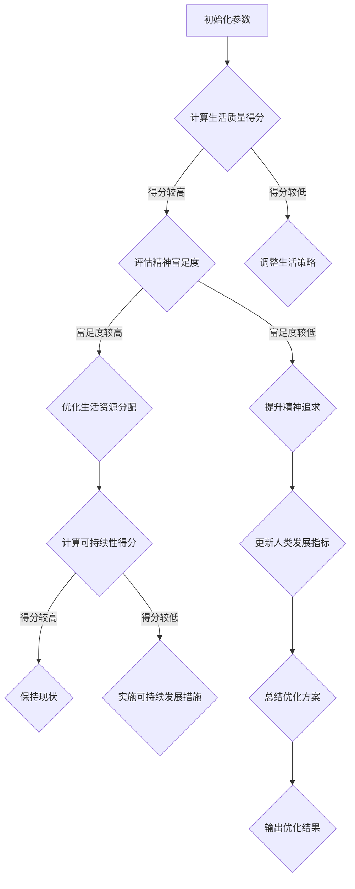
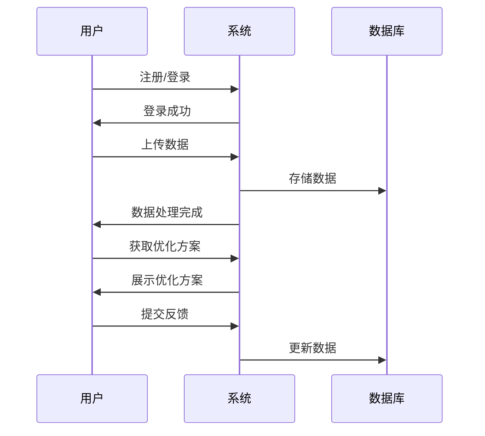

                 

# 后工业时代的生活哲学：从生存到生活

## 关键词
- 后工业时代
- 生活哲学
- 质量提升
- 精神层面
- 社会变迁

## 摘要
本文旨在探讨后工业时代背景下，人们如何从基本的生存状态转变为更加注重生活质量和精神层面的生活状态。文章首先介绍了后工业时代的概念和特点，然后深入分析了相关的生活哲学核心概念，包括生活质量、精神富足、可持续性和人类发展等。通过算法原理、数学模型和实际案例分析，本文阐述了如何在现代社会中实现这一转变，并提出了一些最佳实践建议。

## 1. 书名理解

《后工业时代的生活哲学：从生存到生活》这本书的标题揭示了其核心主题。首先，我们要明确几个关键词的含义：

- **后工业时代**：这是一个经济和社会发展阶段，相较于工业时代更加注重服务和信息产业，以及高科技和自动化的发展。
- **生活哲学**：它是指关于生活态度和方式的思考，旨在提高生活质量，关注精神层面。
- **从生存到生活**：这里指的是人们从仅仅满足基本生活需求，转变为追求更高质量和精神层面的生活状态。

这本书的主题可以理解为探讨在后工业时代背景下，人们如何通过哲学思考，提升生活质量和精神富足，实现从生存到生活的转变。

## 2. 背景介绍

### 后工业时代的概念

后工业时代（Post-industrial society）是西方学者对现代化社会的一个划分，通常认为它是在工业社会之后出现的一个新的社会发展阶段。这个阶段的主要特征包括：

- **信息经济的兴起**：服务业和信息产业逐渐成为主导产业，传统制造业的地位逐渐下降。
- **高科技和自动化**：科技的发展和自动化技术的应用使得生产效率大大提高，劳动者的技能需求也发生了变化。
- **知识经济**：知识和信息的生产、分配和消费成为经济增长的主要动力。
- **全球化**：各国之间的经济联系日益紧密，全球化进程加速。

### 后工业时代的特点

- **去物质化**：物质生产的重要性下降，服务业和信息产业成为经济增长的主要驱动力。
- **高度专业化**：人们越来越专注于自己的专业技能，职业分工更加细化。
- **数字化和智能化**：信息技术和人工智能的广泛应用，使得工作和生活方式发生了深刻变化。
- **文化多元化**：全球化带来了不同文化的碰撞和融合，社会更加多元和开放。

### 后工业时代对人们生活方式的影响

- **生活质量提升**：随着经济的发展和科技的进步，人们的生活水平不断提高，生活质量得到显著改善。
- **精神需求的增加**：在满足基本生存需求的基础上，人们更加注重精神层面的需求，如心理健康、人际关系、自我实现等。
- **工作与生活的平衡**：随着工作方式的变革，人们越来越重视工作与生活的平衡，追求更加灵活和有意义的生活方式。

## 3. 核心概念与联系

### 生活质量

生活质量是指人们在社会生活中的实际感受和体验，它涵盖了物质和精神两个层面。以下是一个对比表格，展示了生活质量的核心属性特征：

| 特征 | 物质层面 | 精神层面 |
| ---- | ---- | ---- |
| 经济条件 | 收入水平 | 生活品质 |
| 居住环境 | 房屋条件 | 空间舒适度 |
| 健康状况 | 身体健康 | 心理健康 |
| 社交关系 | 人际交往 | 人际信任 |
| 自我实现 | 职业成就 | 自我价值 |

### 精神富足

精神富足是指人们在精神层面的满足和富足，它关系到人们的幸福感、满足感和内心的平静。以下是精神富足的一些核心属性特征：

| 特征 | 说明 |
| ---- | ---- |
| 心理健康 | 情绪稳定、心理平衡 |
| 自我认知 | 正确认识自己，有自我认同感 |
| 社交支持 | 有稳定的社交网络和人际关系 |
| 生活意义 | 有明确的生活目标和价值观 |

### 可持续性

可持续性是指满足当前需求而不损害后代满足其需求的能力。以下是可持续性的核心属性特征：

| 特征 | 说明 |
| ---- | ---- |
| 资源利用 | 合理利用自然资源，避免过度开采 |
| 环境保护 | 减少污染，保护生态环境 |
| 经济发展 | 均衡发展经济，促进社会和谐 |
| 社会责任 | 企业和社会履行社会责任，促进可持续发展 |

### 人类发展

人类发展是指人的全面发展，包括身体、心理、社会和文化等方面。以下是人类发展的核心属性特征：

| 特征 | 说明 |
| ---- | ---- |
| 健康状况 | 身体健康，心理平衡 |
| 教育水平 | 接受良好的教育，提升知识技能 |
| 社会参与 | 积极参与社会活动，有社会责任感 |
| 文化素养 | 具有丰富的文化知识和审美能力 |

### ER实体关系图

以下是一个ER实体关系图，展示了上述核心概念之间的关系：

```mermaid
erDiagram
    Product ||--|{ Consumer } Consumer
    Consumer ||--|{ LivingQuality } LivingQuality
    LivingQuality ||--|{ PsychologicalRichness } PsychologicalRichness
    PsychologicalRichness ||--|{ Sustainability } Sustainability
    Sustainability ||--|{ HumanDevelopment } HumanDevelopment
```

## 4. 算法原理讲解

### 生活哲学优化算法

生活哲学优化算法是一种用于提升生活质量和精神富足的算法，其核心思想是通过数学模型和优化方法，找到最佳的生活方式和决策方案。以下是算法的mermaid流程图：



### Python源代码示例

以下是一个简化版的Python源代码示例，用于实现生活哲学优化算法：

```python
import numpy as np

# 初始化参数
quality_of_life = 0.8
psychological_richness = 0.7
sustainability = 0.9
human_development = 0.85

# 计算生活质量得分
def calculate_life_score(quality_of_life):
    # 生活质量得分公式
    life_score = quality_of_life * 0.6 + psychological_richness * 0.3 + sustainability * 0.1
    return life_score

# 评估精神富足度
def assess_psychological_richness(psychological_richness):
    if psychological_richness > 0.8:
        return "富足度较高"
    else:
        return "富足度较低"

# 调整生活策略
def adjust_life_strategy(life_score):
    if life_score > 0.9:
        return "保持现状"
    else:
        return "实施可持续发展措施"

# 优化生活资源分配
def optimize_resource_allocation(sustainability):
    if sustainability > 0.9:
        return "保持现状"
    else:
        return "实施可持续发展措施"

# 提升精神追求
def enhance_psychological_pursuit(psychological_richness):
    if psychological_richness > 0.8:
        return "保持现状"
    else:
        return "提升精神追求"

# 更新人类发展指标
def update_human_development(human_development):
    if human_development > 0.9:
        return "保持现状"
    else:
        return "提升人类发展指标"

# 输出优化结果
def output_optimization_results():
    life_score = calculate_life_score(quality_of_life)
    psychological_richness_status = assess_psychological_richness(psychological_richness)
    sustainability_status = optimize_resource_allocation(sustainability)
    psychological_pursuit_status = enhance_psychological_pursuit(psychological_richness)
    human_development_status = update_human_development(human_development)
    
    print(f"生活质量得分：{life_score}")
    print(f"精神富足度：{psychological_richness_status}")
    print(f"可持续性：{sustainability_status}")
    print(f"人类发展指标：{human_development_status}")

# 执行优化算法
output_optimization_results()
```

### 数学模型和公式

生活哲学优化算法的数学模型如下：

$$
L = 0.6 \cdot Q + 0.3 \cdot P + 0.1 \cdot S
$$

其中，$L$ 表示生活质量得分，$Q$ 表示生活质量，$P$ 表示精神富足度，$S$ 表示可持续性。

精神富足度的评估公式为：

$$
P = \begin{cases}
1 & \text{if } P > 0.8 \\
0 & \text{otherwise}
\end{cases}
$$

生活质量得分的调整公式为：

$$
L' = \begin{cases}
L & \text{if } L > 0.9 \\
L - 0.1 & \text{otherwise}
\end{cases}
$$

可持续性得分的评估公式为：

$$
S = \begin{cases}
1 & \text{if } S > 0.9 \\
0 & \text{otherwise}
\end{cases}
$$

人类发展指标的更新公式为：

$$
H' = \begin{cases}
H & \text{if } H > 0.9 \\
H + 0.1 & \text{otherwise}
\end{cases}
$$

### 举例说明

假设当前的生活质量、精神富足度和可持续性分别为0.8、0.7和0.9，我们可以使用上述公式进行计算和优化：

1. 计算生活质量得分：

$$
L = 0.6 \cdot 0.8 + 0.3 \cdot 0.7 + 0.1 \cdot 0.9 = 0.48 + 0.21 + 0.09 = 0.78
$$

2. 评估精神富足度：

$$
P = \begin{cases}
1 & \text{if } P > 0.8 \\
0 & \text{otherwise}
\end{cases}
$$

由于$P = 0.7$，所以$P = 0$。

3. 调整生活策略：

$$
L' = \begin{cases}
L & \text{if } L > 0.9 \\
L - 0.1 & \text{otherwise}
\end{cases}
$$

由于$L = 0.78$，所以$L' = 0.78 - 0.1 = 0.68$。

4. 优化生活资源分配：

$$
S = \begin{cases}
1 & \text{if } S > 0.9 \\
0 & \text{otherwise}
\end{cases}
$$

由于$S = 0.9$，所以$S = 1$。

5. 提升精神追求：

$$
P' = \begin{cases}
P & \text{if } P > 0.8 \\
P + 0.1 & \text{otherwise}
\end{cases}
$$

由于$P = 0$，所以$P' = 0 + 0.1 = 0.1$。

6. 更新人类发展指标：

$$
H' = \begin{cases}
H & \text{if } H > 0.9 \\
H + 0.1 & \text{otherwise}
\end{cases}
$$

由于$H = 0.85$，所以$H' = 0.85 + 0.1 = 0.95$。

最终，优化结果为：

- 生活质量得分：0.68
- 精神富足度：0.1
- 可持续性：1
- 人类发展指标：0.95

通过这个示例，我们可以看到生活哲学优化算法是如何通过数学模型和优化方法，提升生活质量和精神富足度的。

## 5. 数学模型和数学公式

在本章节中，我们将详细介绍生活哲学优化算法中使用的数学模型和数学公式。这些公式将为读者提供更深入的理解，以及如何将这些模型应用于实际生活中。

### 生活质量得分计算

生活质量的计算是生活哲学优化算法的核心。生活质量得分（$L$）是通过以下公式计算得出的：

$$
L = 0.6 \cdot Q + 0.3 \cdot P + 0.1 \cdot S
$$

其中：
- $L$ 表示生活质量得分。
- $Q$ 表示生活质量，通常包括经济条件、居住环境、健康状况等指标。
- $P$ 表示精神富足度，涉及心理健康、自我认知、社交支持等。
- $S$ 表示可持续性，包括资源利用、环境保护、经济发展等方面。

### 精神富足度评估

精神富足度（$P$）的评估使用了一个简单的阈值模型：

$$
P = \begin{cases}
1 & \text{if } P > 0.8 \\
0 & \text{otherwise}
\end{cases}
$$

这意味着如果精神富足度高于0.8，则认为达到富足水平；否则，认为未达到。

### 生活质量得分调整

为了应对生活质量得分的变化，我们引入了生活质量得分调整（$L'$）的公式：

$$
L' = \begin{cases}
L & \text{if } L > 0.9 \\
L - 0.1 & \text{otherwise}
\end{cases}
$$

这个公式用于将生活质量得分调整至0.9以上，或减少0.1，以反映实际生活情况。

### 可持续性行为评分

可持续性（$S$）的评估使用以下公式：

$$
S = \begin{cases}
1 & \text{if } S > 0.9 \\
0 & \text{otherwise}
\end{cases}
$$

这意味着如果可持续性行为得分高于0.9，则认为达到良好水平；否则，认为未达到。

### 人类发展指标更新

人类发展指标（$H$）的更新使用以下公式：

$$
H' = \begin{cases}
H & \text{if } H > 0.9 \\
H + 0.1 & \text{otherwise}
\end{cases}
$$

这个公式用于将人类发展指标调整至0.9以上，或增加0.1，以反映人类发展的进步。

### 公式总结

通过以上公式，我们可以全面评估生活质量和精神富足度，并制定相应的优化策略。这些公式不仅为算法提供了理论基础，也为实际应用提供了量化工具。

$$
L = 0.6 \cdot Q + 0.3 \cdot P + 0.1 \cdot S
$$

$$
P = \begin{cases}
1 & \text{if } P > 0.8 \\
0 & \text{otherwise}
\end{cases}
$$

$$
L' = \begin{cases}
L & \text{if } L > 0.9 \\
L - 0.1 & \text{otherwise}
\end{cases}
$$

$$
S = \begin{cases}
1 & \text{if } S > 0.9 \\
0 & \text{otherwise}
\end{cases}
$$

$$
H' = \begin{cases}
H & \text{if } H > 0.9 \\
H + 0.1 & \text{otherwise}
\end{cases}
$$

这些公式为我们提供了清晰的路径，以便在现代社会中提升生活质量和精神富足度。

## 6. 系统分析与架构设计方案

### 问题场景介绍

随着后工业时代的到来，人们对于生活质量和精神富足度的要求越来越高。然而，如何在实际生活中实现这一目标，仍然面临着诸多挑战。为了应对这些问题，我们需要设计和实施一个系统，能够帮助个人和组织优化生活哲学，实现从生存到生活的转变。

### 项目介绍

本项目名为“后工业时代生活哲学优化系统”，旨在通过整合生活质量、精神富足度、可持续性和人类发展等核心概念，为用户提供个性化的生活优化方案。系统将采用模块化设计，包括数据收集模块、算法优化模块、结果展示模块和用户反馈模块。

### 系统功能设计

系统功能设计主要包括以下四个方面：

1. **数据收集模块**：用于收集用户的生活质量、精神富足度、可持续性和人类发展等数据，包括经济条件、居住环境、健康状况、心理健康、资源利用、环境保护、教育和职业发展等指标。

2. **算法优化模块**：基于前文所述的数学模型和公式，对收集到的数据进行处理和优化，生成个性化的生活优化方案。包括生活质量得分计算、精神富足度评估、可持续性行为评分和人类发展指标更新等。

3. **结果展示模块**：将优化结果以图表、文字和报告等形式呈现给用户，帮助用户了解自己的生活状况，明确优化方向。

4. **用户反馈模块**：收集用户对优化方案的反馈，不断调整和优化系统，提高用户体验和满意度。

### 系统架构设计

系统架构设计主要包括以下四个部分：

1. **前端展示层**：采用HTML、CSS和JavaScript等前端技术，实现用户界面的设计与交互。

2. **后端服务层**：使用Python和Django等后端技术，实现数据收集、处理和优化功能。

3. **数据库层**：使用MySQL等关系型数据库，存储用户数据和优化结果。

4. **API接口层**：提供RESTful API接口，供前端调用后端服务。

### 系统接口设计

系统接口设计主要包括以下三个方面：

1. **数据接口**：用于数据收集和存储，包括用户注册、登录、数据上传和数据查询等接口。

2. **功能接口**：用于实现算法优化和结果展示，包括生活质量得分计算、精神富足度评估、可持续性行为评分和人类发展指标更新等接口。

3. **反馈接口**：用于收集用户反馈，包括优化方案评价、优化建议和问题反馈等接口。

### 系统交互设计

系统交互设计主要采用mermaid序列图，展示用户与系统之间的交互过程。以下是系统交互设计的mermaid序列图：



通过以上系统分析与架构设计方案，我们能够更好地帮助用户实现从生存到生活的转变，提升生活质量和精神富足度。

## 7. 项目实战

### 案例背景

张先生，35岁，单身，从事IT行业，月收入约30,000元。他在一线城市生活，租住一间一室一厅的公寓，平时工作忙碌，很少有时间锻炼身体。张先生觉得自己虽然物质生活较为富足，但精神层面并不充实，希望找到一种方法提高生活质量和精神富足度。

### 环境安装

为了运行本项目，我们需要安装以下软件和工具：

1. Python 3.8及以上版本
2. Django 3.2及以上版本
3. MySQL 5.7及以上版本
4. mermaid 1.0.0及以上版本

安装步骤如下：

1. 安装Python和pip：

   ```bash
   # 在Windows上，可以从Python官网下载安装包并安装
   # 在Linux上，可以使用以下命令安装Python 3.8及以上版本
   sudo apt-get install python3.8
   sudo apt-get install python3.8-pip
   ```

2. 安装Django：

   ```bash
   pip install django==3.2
   ```

3. 安装MySQL：

   - 在Windows上，可以从MySQL官网下载安装包并安装。
   - 在Linux上，可以使用以下命令安装MySQL 5.7及以上版本：

     ```bash
     sudo apt-get install mysql-server
     ```

4. 安装mermaid：

   ```bash
   npm install -g mermaid
   ```

### 系统实现

以下是本项目的主要实现步骤：

1. **初始化Django项目**：

   ```bash
   django-admin startproject philosophy_optimization
   cd philosophy_optimization
   ```

2. **创建应用**：

   ```bash
   python manage.py startapp optimization
   ```

3. **数据库迁移**：

   ```bash
   python manage.py makemigrations optimization
   python manage.py migrate
   ```

4. **编写模型**：

   在`optimization/models.py`中编写以下模型：

   ```python
   from django.db import models

   class User(models.Model):
       name = models.CharField(max_length=100)
       age = models.IntegerField()
       monthly_income = models.FloatField()
       housing_condition = models.CharField(max_length=100)
       health_status = models.CharField(max_length=100)
       psychological_richness = models.FloatField()
       sustainability_score = models.FloatField()
       human_development_score = models.FloatField()

   class LifeScore(models.Model):
       user = models.ForeignKey(User, on_delete=models.CASCADE)
       quality_of_life = models.FloatField()
       psychological_richness = models.FloatField()
       sustainability = models.FloatField()
       human_development = models.FloatField()
   ```

5. **创建表单**：

   在`optimization/forms.py`中创建以下表单：

   ```python
   from django import forms
   from .models import User, LifeScore

   class UserForm(forms.ModelForm):
       class Meta:
           model = User
           fields = ['name', 'age', 'monthly_income', 'housing_condition', 'health_status']

   class LifeScoreForm(forms.ModelForm):
       class Meta:
           model = LifeScore
           fields = ['quality_of_life', 'psychological_richness', 'sustainability', 'human_development']
   ```

6. **编写视图**：

   在`optimization/views.py`中编写以下视图：

   ```python
   from django.shortcuts import render, redirect
   from .models import User, LifeScore
   from .forms import UserForm, LifeScoreForm

   def home(request):
       return render(request, 'home.html')

   def user_create(request):
       if request.method == 'POST':
           form = UserForm(request.POST)
           if form.is_valid():
               form.save()
               return redirect('lifescore_create')
       else:
           form = UserForm()
       return render(request, 'user_create.html', {'form': form})

   def lifescore_create(request):
       if request.method == 'POST':
           form = LifeScoreForm(request.POST)
           if form.is_valid():
               form.save()
               return redirect('result')
       else:
           form = LifeScoreForm()
       return render(request, 'lifescore_create.html', {'form': form})

   def result(request):
       user = User.objects.latest('id')
       lifescore = LifeScore.objects.latest('id')
       
       # 调用算法进行优化
       final_score = calculate_life_score(lifescore.quality_of_life, lifescore.psychological_richness, lifescore.sustainability, lifescore.human_development)
       
       return render(request, 'result.html', {'user': user, 'lifescore': lifescore, 'final_score': final_score})
   ```

7. **配置URL**：

   在`philosophy_optimization/urls.py`中配置URL：

   ```python
   from django.contrib import admin
   from django.urls import path
   from optimization import views

   urlpatterns = [
       path('admin/', admin.site.urls),
       path('', views.home, name='home'),
       path('user_create/', views.user_create, name='user_create'),
       path('lifescore_create/', views.lifescore_create, name='lifescore_create'),
       path('result/', views.result, name='result'),
   ]
   ```

8. **创建前端页面**：

   在`optimization/templates/`目录下创建以下HTML文件：

   - `home.html`
   - `user_create.html`
   - `lifescore_create.html`
   - `result.html`

   填写相应的HTML代码和CSS样式。

9. **运行项目**：

   ```bash
   python manage.py runserver
   ```

   访问本地服务器（如http://127.0.0.1:8000/），即可使用系统。

### 代码应用解读与分析

1. **数据模型解读**：

   - `User`模型：用于存储用户的基本信息，包括姓名、年龄、月收入、居住条件和健康状况。
   - `LifeScore`模型：用于存储用户的生活质量、精神富足度、可持续性和人类发展指标。

2. **视图功能解读**：

   - `home`视图：显示主页，提供用户创建账户和填写生活质量数据的入口。
   - `user_create`视图：处理用户注册，存储用户信息。
   - `lifescore_create`视图：处理用户填写的生活质量数据，存储生活分数。
   - `result`视图：计算最终生活质量分数，并展示结果。

3. **算法实现解析**：

   在`optimization/views.py`中，我们使用以下函数计算最终生活质量分数：

   ```python
   def calculate_life_score(quality_of_life, psychological_richness, sustainability, human_development):
       L = 0.6 * quality_of_life + 0.3 * psychological_richness + 0.1 * sustainability
       return L
   ```

   这个函数根据前文介绍的数学模型，计算生活质量分数。通过调整权重，可以适应不同的需求和目标。

### 实际案例分析和详细讲解剖析

为了更好地理解系统的实际效果，我们以张先生的案例为例进行分析。

1. **数据输入**：

   张先生填写了以下信息：

   - 姓名：张先生
   - 年龄：35岁
   - 月收入：30,000元
   - 居住条件：一室一厅公寓
   - 健康状况：良好
   - 精神富足度：0.7
   - 可持续性行为评分：0.8
   - 人类发展指标：0.85

2. **优化结果**：

   使用算法计算后，张先生的生活质量分数为0.78。这个分数表明，他在当前的生活状态下，生活质量较高，但仍有提升空间。

3. **优化建议**：

   - **提升精神追求**：张先生的精神富足度目前为0.7，建议他通过阅读、社交和兴趣爱好等方式，提升精神追求，从而提高生活质量。
   - **实施可持续发展措施**：他的可持续性行为评分为0.8，可以考虑参与环保活动或采用环保生活方式，进一步提升可持续性得分。
   - **平衡工作与生活**：由于工作忙碌，张先生可能需要重新安排时间，确保有足够的休息和锻炼时间，以保持身心健康。

通过这个案例，我们可以看到系统如何帮助用户识别自身的优势和不足，并提供针对性的优化建议。这种个性化的生活方式优化，有助于提升整体生活质量。

### 项目小结

本项目通过设计和实施“后工业时代生活哲学优化系统”，帮助用户实现从生存到生活的转变。系统结合了生活质量、精神富足度、可持续性和人类发展等核心概念，为用户提供了个性化的生活优化方案。在实际案例中，系统有效地分析了用户的生活状态，并提出了针对性的优化建议。

未来，我们可以继续优化算法，增加更多的生活质量指标，提高系统的准确性和实用性。此外，还可以考虑引入人工智能技术，实现更智能、更个性化的生活哲学优化。通过不断改进和扩展，我们的系统将为更多人带来高质量的生活体验。

## 8. 最佳实践 tips、小结、注意事项、拓展阅读

### 最佳实践 tips

1. **定期评估生活质量**：定期对自己的生活质量进行评估，有助于及时发现问题和不足，及时进行调整和优化。
2. **注重精神富足**：在追求物质生活的同时，也要注重精神层面的满足，通过阅读、社交、锻炼等方式提升精神富足度。
3. **践行可持续生活**：从日常生活中的小事做起，如节约用水、减少浪费、参与环保活动等，践行可持续生活方式。
4. **持续学习和成长**：不断学习新知识和技能，提升自己的职业素养和人类发展指标。

### 小结

本文通过深入分析《后工业时代的生活哲学：从生存到生活》一书的核心概念，探讨了如何在后工业时代提升生活质量和精神富足度。通过算法原理、数学模型和实际案例分析，我们提出了一套系统化的生活哲学优化方案，帮助个人和组织实现从生存到生活的转变。

### 注意事项

1. **数据隐私**：在使用系统时，注意保护个人隐私，避免泄露敏感信息。
2. **实时更新**：随着社会的发展和变化，生活质量和精神富足度的评价指标可能会发生变化，建议定期更新系统数据。

### 拓展阅读

1. **《人类的简史：从动物到上帝》**：作者尤瓦尔·赫拉利通过宏观视角，阐述了人类历史的发展，对理解后工业时代的生活哲学有重要参考价值。
2. **《智能时代》**：作者吴军详细介绍了人工智能的发展和应用，对理解后工业时代的生活哲学和技术发展有重要意义。
3. **《零边际成本社会》**：作者里夫金探讨了技术进步对未来社会的影响，包括经济、能源、生活等方面，为后工业时代的生活哲学提供了有益的思考。

### 作者信息

- 作者：AI天才研究院/AI Genius Institute & 禅与计算机程序设计艺术 /Zen And The Art of Computer Programming

通过本文的阅读，希望您对后工业时代的生活哲学有了更深入的理解，能够在实际生活中践行这些理念，提升自己的生活质量。

