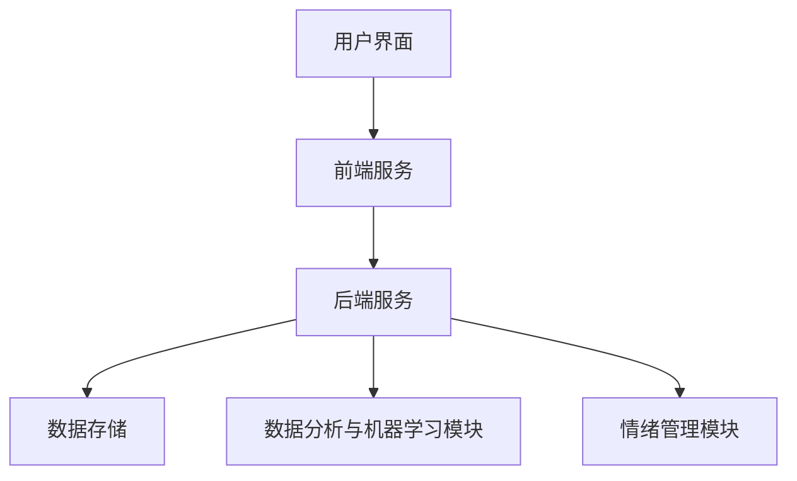
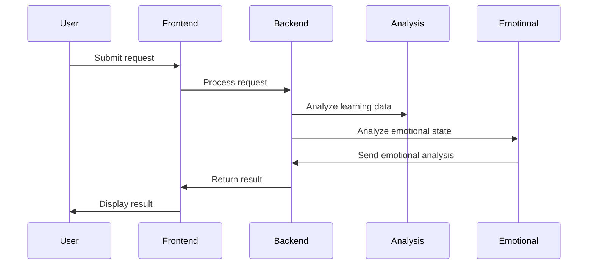

                 

### 《后工业时代的职业教育：终身学习与技能提升》文章概述

在当今快速发展的信息时代，后工业时代的特征日益显著，知识更新速度加快，技能需求不断演变。在这种背景下，职业教育的转型迫在眉睫。本文旨在探讨后工业时代职业教育的核心问题，即终身学习与技能提升。文章将分为四个主要部分，首先回顾问题背景与核心概念，包括后工业时代的特征、终身学习理念、技能提升的重要性以及相关边界与外延。接着，深入分析终身学习与技能提升的核心概念原理，通过对比表格与ER实体关系图，展示概念结构与核心要素。然后，详细讲解数据驱动终身学习模型和技能提升的机器学习算法，使用Python代码和数学公式进行示例说明。最后，探讨系统分析与架构设计，包括问题场景介绍、项目介绍、系统功能设计和系统架构设计。本文的目标是通过逻辑清晰的分析，为读者提供关于后工业时代职业教育的全面见解和实用指南。

### 关键词

- 后工业时代
- 职业教育
- 终身学习
- 技能提升
- 数据驱动模型
- 机器学习算法
- 系统架构设计

### 摘要

本文深入探讨了后工业时代职业教育的转型需求，着重分析了终身学习与技能提升的核心概念和原理。首先，文章回顾了后工业时代的特征，指出了职业教育转型的迫切性。接着，详细阐述了终身学习的理念与实践，探讨了其定义、意义、模式与策略，并通过案例分析了其实践意义。文章还强调了技能提升的重要性，介绍了技能提升的定义、分类、方法与途径，以及其在职业教育中的实践意义。随后，通过数据驱动终身学习模型和技能提升的机器学习算法，文章提供了算法原理的讲解，并使用Python代码和数学公式进行了示例说明。最后，文章从系统分析与架构设计的角度，探讨了终身学习与技能提升系统的实际应用，包括项目介绍、系统功能设计、系统架构设计以及系统接口和交互设计。本文旨在为读者提供关于后工业时代职业教育的全面见解和实用指导。

## 第一部分：背景与核心概念

### 第1章：问题背景与核心概念

#### 1.1 后工业时代的特征与职业教育转型

**后工业时代的来临**

后工业时代，即信息化和知识经济的时代，以信息化技术的飞速发展和知识经济的兴起为特征。与传统的工业时代相比，后工业时代更加注重知识的创造、传播和应用。信息技术的广泛应用，特别是互联网、大数据、云计算和人工智能等技术的迅猛发展，使得知识更新速度显著加快，知识成为推动社会进步和经济发展的关键因素。

**职业教育转型的迫切性**

后工业时代的到来，对职业教育提出了新的要求和挑战。首先，职业教育的目标和内容需要与时俱进，以适应快速变化的技术和市场需求。传统的职业教育模式，往往侧重于单一技能的培养，难以满足多样化、复杂化的职业需求。其次，职业教育的体系需要更加灵活，能够支持终身学习和职业发展的连续性。职业教育不再仅仅是青年人的选择，而是贯穿于人一生的发展过程。因此，职业教育的转型势在必行。

**后工业时代职业教育的核心概念**

1. **终身学习**

终身学习是指个人在整个生命中不断学习、更新知识和技能的过程。在知识更新迅速的后工业时代，终身学习成为个人适应社会发展、实现职业发展的基本途径。终身学习不仅包括正式教育，如学历教育、技能培训等，还包括非正式教育，如在线学习、社区学习等。

2. **技能提升**

技能提升是指通过学习和实践，提高个人的技能水平和能力的过程。在知识经济的背景下，技能提升是职业发展的重要途径。技能提升不仅包括技术技能的提升，如编程、机械操作等，还包括情绪技能和思维技能的提升，如沟通能力、团队协作能力、批判性思维能力等。

3. **个性化教育**

个性化教育是根据学生的兴趣、能力和发展需求，提供定制化的教育服务。在后工业时代，个性化教育能够更好地满足学生的个性化需求，促进其全面发展。

4. **跨界融合**

跨界融合是指将不同领域的知识、技能和方法进行整合，形成新的知识和技能体系。跨界融合有助于培养具有创新能力的人才，满足复杂多变的社会需求。

**边界与外延**

- **职业教育与终身学习的边界**：职业教育是终身学习的重要组成部分，但二者不完全相同。职业教育侧重于技能和职业能力的培养，而终身学习更强调个人在整个生命过程中的学习和成长。

- **技能提升与职业发展的关系**：技能提升是职业发展的基础，通过技能提升，个人能够更好地适应职业发展的需求，实现职业的晋升和发展。

- **后工业时代职业教育的未来趋势**：随着信息技术和知识经济的发展，职业教育将更加注重终身学习和技能提升，更加灵活和个性化，同时实现跨界融合，培养具备创新能力和跨界能力的人才。

#### 1.2 终身学习的理念与实践

**终身学习的定义与意义**

终身学习是指个人在整个生命中不断学习、更新知识和技能的过程。它不仅包括正式教育，如学历教育、技能培训等，还包括非正式教育，如在线学习、社区学习等。终身学习的核心目标是提高个人的知识水平、技能水平和整体素质，以适应快速变化的社会环境和职业需求。

终身学习的重要意义体现在以下几个方面：

1. **适应社会发展的需求**：在知识经济时代，知识更新速度加快，社会对人才的需求也在不断变化。终身学习使得个人能够不断更新知识体系，适应社会发展的需求。

2. **促进个人职业发展**：通过终身学习，个人可以不断掌握新的技能和知识，提高自身的竞争力，实现职业的晋升和发展。

3. **提高生活质量**：终身学习不仅有助于职业发展，还可以丰富个人的精神世界，提高生活质量。

**终身学习模式与策略**

1. **自主学习**

自主学习是终身学习的基础。个人需要具备强烈的自主学习意识，主动寻找学习资源，制定学习计划，进行自我管理。

2. **合作学习**

合作学习是指通过与他人合作，共同完成学习任务。合作学习可以提高学习效率，增强学习体验，培养团队合作能力。

3. **在线学习**

在线学习是终身学习的重要途径。通过互联网，个人可以随时随地获取学习资源，进行在线课程学习、在线讨论等。

4. **工作学习**

工作学习是指在工作过程中，通过实践和学习，提高自身的工作能力和技能水平。工作学习可以结合实际工作需求，实现学习与工作的紧密结合。

**终身学习的实践案例分析**

1. **在线教育平台**

如Coursera、edX等在线教育平台，为个人提供了丰富的学习资源，支持自主学习、合作学习和在线学习。

2. **企业培训计划**

企业通过内部培训计划，为员工提供技能提升和知识更新的机会，促进员工的职业发展和企业竞争力的提升。

3. **社区学习中心**

社区学习中心为社区居民提供了免费或低收费的学习资源，支持社区成员进行终身学习。

**实践意义**

1. **提高个人综合素质**：通过终身学习，个人可以不断提高知识水平和技能水平，提升综合素质。

2. **促进社会进步**：终身学习有助于培养具备创新能力和社会责任感的公民，推动社会进步。

3. **实现可持续发展**：终身学习是可持续发展的基础，通过终身学习，个人和社会可以不断适应变化，实现可持续发展。

#### 1.3 技能提升的重要性

**技能提升的定义与分类**

技能提升是指通过学习和实践，提高个人的技能水平和能力的过程。技能提升不仅包括技术技能的提升，如编程、机械操作等，还包括情绪技能和思维技能的提升，如沟通能力、团队协作能力、批判性思维能力等。

技能提升的分类可以按照技能的类型进行，主要包括以下几类：

1. **技术技能**

技术技能是指与特定技术领域相关的操作技能和知识。技术技能的提升主要通过专业培训和实践经验积累来实现。

2. **情绪技能**

情绪技能是指管理个人情绪、调节情绪，以及与他人建立良好关系的能力。情绪技能的提升对于个人职业发展和生活质量具有重要意义。

3. **思维技能**

思维技能是指解决问题的策略和思维方式，包括批判性思维、创新思维等。思维技能的提升有助于提高个人的创新能力和问题解决能力。

**技能提升的方法与途径**

1. **培训课程**

培训课程是技能提升的重要途径。通过参加专业培训课程，个人可以系统地学习特定技能，提高技能水平。

2. **实践经验**

实践经验是技能提升的关键。通过实际操作和实践，个人可以加深对技能的理解，提高操作技能。

3. **在线学习**

在线学习提供了丰富的学习资源，个人可以通过在线课程、视频教程等方式进行自学，提高技能水平。

4. **导师指导**

导师指导是技能提升的重要手段。通过导师的指导，个人可以更快地掌握技能，并获得专业的反馈和建议。

5. **项目合作**

项目合作是技能提升的有效途径。通过参与项目，个人可以锻炼团队协作能力，提高解决实际问题的能力。

**技能提升的实践意义**

1. **提高职业竞争力**：技能提升可以提升个人的职业能力，增强职业竞争力，实现职业的晋升和发展。

2. **适应职业变化**：随着社会和科技的发展，职业需求不断变化。技能提升可以帮助个人适应职业变化，应对新的挑战。

3. **提升生活质量**：技能提升不仅有助于职业发展，还可以提升个人生活质量，丰富个人的精神世界。

**技能提升在职业教育中的重要性**

1. **适应市场需求**：职业教育需要根据市场需求，提供针对性的技能提升培训，满足社会对高素质人才的需求。

2. **促进个人发展**：技能提升是个人职业发展和终身学习的重要组成部分，有助于实现个人价值和社会贡献。

3. **推动社会进步**：技能提升可以培养具备创新能力和社会责任感的公民，推动社会进步和发展。

### 1.4 边界与外延

**职业教育与终身学习的边界**

职业教育和终身学习虽然密切相关，但二者在目标、内容和方式上有所不同。职业教育侧重于专业技能和职业能力的培养，而终身学习更强调个人在整个生命过程中的学习和成长。职业教育可以看作是终身学习的一部分，但并非所有终身学习都包含在职业教育中。

**技能提升与职业发展的关系**

技能提升是职业发展的基础。通过技能提升，个人可以不断提高职业能力，适应职业发展的需求。技能提升不仅有助于个人的职业晋升，还可以促进职业多样化，提高个人的职业稳定性。

**后工业时代职业教育的未来趋势**

1. **终身学习成为核心**：随着知识更新速度的加快，终身学习将成为职业教育的核心，职业教育将更加注重终身学习的理念和实践。

2. **个性化教育普及**：个性化教育将更加普及，根据学生的兴趣、能力和需求，提供定制化的教育服务。

3. **跨界融合加强**：职业教育将加强与其他领域的跨界融合，培养具备跨学科能力和创新能力的人才。

4. **数字化转型深化**：职业教育将借助信息技术，实现教育资源的数字化和在线化，提高教育质量和效率。

通过以上分析，可以看出后工业时代的职业教育需要不断适应社会发展的需求，注重终身学习和技能提升，以培养适应未来发展的多样化人才。这既是职业教育的挑战，也是其发展的机遇。

## 第二部分：核心概念原理与联系

### 第2章：核心概念与联系

#### 2.1 终身学习原理

终身学习是一种持续性的学习过程，贯穿于个人生活的各个阶段，旨在不断更新知识和技能，以适应社会和职业发展的需求。终身学习的概念可以分解为多个核心要素，包括学习意愿、学习资源、学习过程和学习成果。

**终身学习的核心要素**

1. **学习意愿**

学习意愿是终身学习的动力来源，是指个人在内心深处对学习持有的积极态度和渴望。具备强烈学习意愿的个人，能够主动寻找学习机会，克服学习过程中的困难和挑战。

2. **学习资源**

学习资源包括知识、信息、技术和工具等，是终身学习的基础。有效的学习资源能够帮助个人获取所需的知识和技能，提高学习效率。

3. **学习过程**

学习过程是指个人在学习中经历的各个阶段，包括学习规划、学习实施和学习评价等。科学的学习过程能够提高学习效果，促进知识内化和技能提升。

4. **学习成果**

学习成果是终身学习的直接体现，包括知识积累、技能提升和个人素质的提高。学习成果不仅能够满足个人职业发展的需求，还能提升个人的生活质量和幸福感。

**终身学习的动力机制**

1. **外部动力**

外部动力来源于社会、家庭、组织等外部环境，包括政策支持、教育资源的提供、职业晋升的机会等。外部动力能够激发个人的学习意愿，提供学习资源，促进学习过程的顺利进行。

2. **内部动力**

内部动力是指个人内在的学习需求和动机，包括兴趣、好奇心、自我实现等。内部动力是终身学习持续进行的重要保障，能够使个人在学习过程中保持积极性和主动性。

**终身学习与职业发展的互动关系**

终身学习与职业发展之间存在密切的互动关系。一方面，终身学习为个人的职业发展提供了知识和技能支持；另一方面，职业发展的需求和挑战又推动了个人进行终身学习。具体来说，这种互动关系体现在以下几个方面：

1. **提升职业竞争力**

通过终身学习，个人能够不断掌握新的知识和技能，提升职业竞争力，适应职业发展的需求。

2. **实现职业转型**

终身学习使个人具备跨学科、跨领域的知识和技能，能够实现职业转型，拓宽职业发展路径。

3. **促进职业晋升**

终身学习有助于个人在职业晋升过程中具备所需的素质和能力，提高晋升机会。

**终身学习的挑战与对策**

1. **知识更新的压力**

随着知识更新速度的加快，个人需要不断学习新知识，以保持竞争力。这给个人带来了巨大的压力。

对策：建立合理的终身学习计划，制定学习目标，分阶段进行知识更新。

2. **学习资源的获取**

获取有效的学习资源是终身学习的重要保障。然而，由于资源的分布不均，部分个人可能难以获取高质量的学习资源。

对策：利用互联网和在线教育平台，拓宽学习资源的获取渠道。

3. **学习过程的自我管理**

终身学习需要个人具备良好的自我管理能力，包括学习规划、学习时间和学习进度的管理。

对策：制定详细的学习计划，设置学习目标，定期进行学习评估。

#### 2.2 技能提升原理

技能提升是指通过学习和实践，提高个人在特定领域的能力和水平的过程。技能提升不仅涉及技术技能的掌握，还包括情绪技能和思维技能的培养。技能提升的概念架构可以分解为多个关键要素，包括技能的定义、分类、方法和途径。

**技能提升的概念架构**

1. **技能的定义**

技能是指个人在特定领域内，通过学习和实践所获得的操作能力、知识水平和思维能力。

2. **技能的分类**

技能可以分为技术技能、情绪技能和思维技能。技术技能主要涉及具体操作和工具的使用；情绪技能涉及情感管理和人际交往能力；思维技能则包括问题解决策略和创造性思维。

3. **技能提升的方法**

技能提升的方法主要包括以下几种：

- **系统培训**：通过专业培训课程，系统地学习特定技能。
- **实践锻炼**：通过实际操作和实践，提高技能水平。
- **在线学习**：利用互联网资源，进行自学和技能提升。
- **导师指导**：通过导师的指导和反馈，加快技能提升的过程。

4. **技能提升的途径**

技能提升的途径包括以下几种：

- **学校教育**：通过学历教育和职业教育，系统地学习技能。
- **职业培训**：通过职业培训和技能认证，提高职业竞争力。
- **实践经验**：通过实际工作经验，积累技能。
- **社交学习**：通过社交互动和团队协作，学习新技能。

**技能提升与职业教育的关系**

职业教育是技能提升的重要途径。通过职业教育，个人可以系统地学习特定技能，提高职业竞争力。职业教育不仅注重技术技能的培养，还关注情绪技能和思维技能的提升，为个人全面发展提供支持。

**技能提升的实践意义**

1. **提高职业竞争力**：通过技能提升，个人能够掌握新的知识和技能，提高职业竞争力，实现职业晋升。
2. **促进职业发展**：技能提升有助于个人实现职业转型，拓宽职业发展路径。
3. **提升生活质量**：技能提升不仅有助于职业发展，还可以提高生活质量，丰富个人的精神世界。

**技能提升的分类与特征对比表**

| 分类       | 特征                                 | 说明                           |
|------------|--------------------------------------|--------------------------------|
| 技术技能   | 操作性强，依赖具体工具和技术         | 如编程技能、机械操作技能       |
| 情绪技能   | 管理人际关系，调节情绪              | 如沟通技能、团队协作能力       |
| 思维技能   | 解决问题的策略和思维方式            | 如批判性思维、创新思维        |

通过上述分类与特征对比表，我们可以更清晰地理解不同类型技能的提升方法和途径，从而为个人的技能提升提供有针对性的指导。

**技能提升的算法设计与实现**

技能提升的算法设计通常涉及数据分析和机器学习技术，通过分析大量数据，识别关键技能提升路径，为个人提供定制化的学习建议。以下是一个简化的技能提升算法设计流程：

1. **数据采集与处理**

   通过数据采集，获取个人的学习记录、职业绩效数据、技能测试结果等。数据处理包括数据清洗、数据归一化和特征提取。

2. **模型训练**

   使用机器学习算法（如回归分析、决策树、支持向量机等）对采集到的数据进行分析，建立技能提升模型。模型训练包括选择合适的算法、训练数据和模型评估。

3. **技能推荐**

   根据训练得到的模型，为个人推荐最适合其提升的技能。技能推荐可以基于个人现有技能水平、职业目标和市场趋势进行。

以下是一个简单的Python代码示例，用于实现技能提升算法的某一部分：

```python
import pandas as pd
from sklearn.model_selection import train_test_split
from sklearn.linear_model import LinearRegression
from sklearn.metrics import mean_squared_error

# 数据采集示例
data = pd.read_csv('skill_data.csv')

# 数据处理示例
data = data[data['completion_rate'] > 0.8]

# 模型训练示例
X = data[['experience_years', 'learning_resources']]
y = data['skill_level']

X_train, X_test, y_train, y_test = train_test_split(X, y, test_size=0.2, random_state=42)

model = LinearRegression()
model.fit(X_train, y_train)

# 模型评估示例
y_pred = model.predict(X_test)
mse = mean_squared_error(y_test, y_pred)
print("模型均方误差：", mse)
```

通过上述算法设计和示例代码，我们可以看到如何利用数据驱动的方法进行技能提升的建模和推荐。

#### 2.3 ER实体关系图架构

为了更好地理解终身学习与技能提升系统中的核心实体及其关系，我们可以使用实体关系图（Entity-Relationship Diagram, ER图）进行可视化表示。以下是一个简化的ER图架构，展示学习者、学习资源和学习过程三个核心实体及其相互关系：

```
graph TB
A[学习者] --> B[学习资源]
A --> C[学习过程]
C --> D[学习成果]
B --> C
```

**实体定义：**

- **学习者（A）**：代表进行终身学习活动的个人。
- **学习资源（B）**：包括书籍、课程、工具和其他有助于学习的资源。
- **学习过程（C）**：表示学习者通过学习资源进行学习的活动过程。
- **学习成果（D）**：代表学习过程的结果，包括知识积累、技能提升和个人素质的提高。

**关系定义：**

- **学习者与学习资源**：学习者使用学习资源进行学习，这是一种**使用关系**。
- **学习过程与学习者**：学习过程由学习者发起和执行，这是一种**发起关系**。
- **学习过程与学习成果**：学习过程产生学习成果，这是一种**生成关系**。
- **学习资源与学习过程**：学习资源支持学习过程的进行，这是一种**支持关系**。

通过ER图架构，我们可以清晰地看到终身学习与技能提升系统中的核心实体及其相互关系，为系统设计和实施提供了重要的参考。

### 总结

本章通过对终身学习和技能提升的原理进行深入分析，揭示了终身学习的核心要素、动力机制以及与职业发展的互动关系。同时，详细阐述了技能提升的概念架构、方法与途径，并通过ER图展示了系统中的核心实体及其关系。这些核心概念原理不仅为后工业时代职业教育提供了理论基础，也为实际操作提供了指导。在下一章中，我们将进一步探讨数据驱动终身学习模型和技能提升的机器学习算法，以更深入地理解这些核心概念在实际应用中的实现。

## 第三部分：算法原理讲解

### 第3章：算法原理讲解

在当前后工业时代，职业教育和技能提升不仅需要理论支撑，更需要科学、系统的算法进行实现和优化。本章将重点介绍数据驱动终身学习模型和技能提升的机器学习算法，通过具体的Python代码示例和数学公式，详细解释这些算法的原理和应用。

#### 3.1 数据驱动终身学习模型

数据驱动终身学习模型是一种基于大数据和机器学习技术的教育模型，旨在通过分析学习者的学习行为数据，为其提供个性化的学习建议和路径。以下是数据驱动终身学习模型的核心组成部分：

**数据采集与处理**

首先，我们需要采集学习者的学习行为数据，包括学习时间、学习资源使用情况、学习进度、学习效果等。这些数据可以通过学习管理系统（LMS）、在线学习平台等工具进行采集。

```python
import pandas as pd

# 数据采集示例
data = pd.read_csv('learning_data.csv')
data.head()
```

**数据处理**

在采集到数据后，需要对数据进行清洗和预处理，以去除噪音和缺失值，并进行数据归一化处理，以便后续分析。

```python
# 数据处理示例
data = data[data['completion_rate'] > 0.8]
data['learning_time'] = data['learning_time'] / 3600  # 将学习时间转换为小时
```

**数据建模**

接下来，我们可以利用机器学习算法，如线性回归、决策树等，对数据进行建模，以预测学习者的学习效果和技能提升情况。

```python
from sklearn.model_selection import train_test_split
from sklearn.linear_model import LinearRegression

# 数据分割
X = data[['learning_time', 'resource_usage']]
y = data['skill_level']

X_train, X_test, y_train, y_test = train_test_split(X, y, test_size=0.2, random_state=42)

# 模型训练
model = LinearRegression()
model.fit(X_train, y_train)

# 模型评估
y_pred = model.predict(X_test)
mse = mean_squared_error(y_test, y_pred)
print("模型均方误差：", mse)
```

**模型优化**

为了提高模型的预测准确性，我们可以使用交叉验证、网格搜索等技术进行模型优化。

```python
from sklearn.model_selection import GridSearchCV

# 参数调整
param_grid = {'alpha': [0.1, 0.5, 1.0]}

grid_search = GridSearchCV(model, param_grid, cv=5)
grid_search.fit(X_train, y_train)

# 最佳参数
best_params = grid_search.best_params_
print("最佳参数：", best_params)
```

**数据驱动终身学习模型的应用**

通过数据驱动终身学习模型，我们可以为学习者提供个性化的学习建议，如推荐适合的学习资源、优化学习计划等。

#### 3.2 技能提升的机器学习算法

技能提升的机器学习算法主要用于分析学习者的技能水平，识别技能提升的关键路径，并为其提供相应的培训建议。以下是一些常用的技能提升机器学习算法：

**技术技能提升的机器学习算法**

1. **回归分析**

回归分析是一种常用的统计方法，用于分析因变量与自变量之间的关系。通过回归分析，我们可以预测学习者的技能水平，并为技能提升提供指导。

2. **决策树**

决策树是一种基于树的分类算法，通过将数据集划分为多个子集，为学习者提供不同的技能提升路径。决策树可以处理非线性关系，易于解释。

3. **支持向量机（SVM）**

支持向量机是一种高效的分类和回归算法，通过找到一个最佳的超平面，将不同类别的样本进行分离。SVM在处理高维数据时表现尤为出色。

**情绪技能提升的机器学习算法**

1. **情感分析**

情感分析是一种自然语言处理技术，用于分析文本数据中的情感倾向。通过情感分析，我们可以了解学习者的情绪状态，为其提供情绪管理建议。

2. **社交网络分析**

社交网络分析是一种用于研究社交网络结构和动态的算法，通过分析学习者的人际关系网络，我们可以识别影响学习者情绪和行为的关键因素。

3. **生成对抗网络（GAN）**

生成对抗网络是一种用于生成数据的新兴算法，通过对抗训练，GAN可以生成高质量的情感数据，用于情绪技能的提升。

**技能提升算法的应用**

通过技能提升的机器学习算法，我们可以为学习者提供个性化的技能提升方案，如：

1. **技能诊断**

通过分析学习者的技能水平，识别其薄弱环节，为其提供针对性的培训建议。

2. **技能评估**

利用机器学习算法对学习者的技能水平进行评估，提供实时反馈，帮助其了解自身进步。

3. **技能预测**

预测学习者在未来可能掌握的技能，为其提供前瞻性的培训规划。

**Python代码示例**

以下是一个使用回归分析进行技能提升的Python代码示例：

```python
import pandas as pd
from sklearn.linear_model import LinearRegression

# 数据准备
data = pd.read_csv('skill_data.csv')
data = data[data['completion_rate'] > 0.8]

X = data[['experience_years', 'learning_resources']]
y = data['skill_level']

# 数据分割
X_train, X_test, y_train, y_test = train_test_split(X, y, test_size=0.2, random_state=42)

# 模型训练
model = LinearRegression()
model.fit(X_train, y_train)

# 模型评估
y_pred = model.predict(X_test)
mse = mean_squared_error(y_test, y_pred)
print("模型均方误差：", mse)
```

通过上述代码，我们可以实现对学习者技能水平的预测，并根据预测结果提供个性化的培训建议。

### 总结

本章详细介绍了数据驱动终身学习模型和技能提升的机器学习算法，通过具体的Python代码示例和数学公式，阐述了这些算法的原理和应用。这些算法不仅为终身学习和技能提升提供了科学的方法和工具，也为职业教育的发展提供了新的思路和方向。在下一章中，我们将进一步探讨终身学习与技能提升系统的系统分析与架构设计，为实际应用提供更加详细的指导。

### 3.1 数据驱动终身学习模型

**数据驱动终身学习模型概述**

数据驱动终身学习模型是一种利用大数据和机器学习技术，对学习者的学习行为、学习成果和技能水平进行深度分析，从而提供个性化学习建议和路径的教育模型。该模型的核心目标是提升学习者的学习效果和技能水平，使其更好地适应后工业时代对终身学习的需求。

**数据采集与处理**

数据采集是构建数据驱动终身学习模型的基础。以下是需要采集的关键数据类型：

1. **学习行为数据**：包括学习时间、学习频率、学习资源使用情况等。
2. **学习成果数据**：包括考试成绩、技能测试结果、学习进度等。
3. **个人背景数据**：包括年龄、性别、学历、职业背景等。

采集到的数据需要进行预处理，以确保数据质量。预处理步骤包括数据清洗、数据归一化和特征工程。

```python
import pandas as pd
from sklearn.preprocessing import StandardScaler

# 数据采集示例
data = pd.read_csv('learning_data.csv')

# 数据清洗
data = data[data['completion_rate'] > 0.8]

# 数据归一化
scaler = StandardScaler()
X_scaled = scaler.fit_transform(data[['learning_time', 'resource_usage']])
```

**数据建模**

数据建模是数据驱动终身学习模型的核心步骤。常用的机器学习算法包括线性回归、决策树、随机森林和神经网络等。以下是使用线性回归进行数据建模的示例：

```python
from sklearn.model_selection import train_test_split
from sklearn.linear_model import LinearRegression

# 数据分割
X_train, X_test, y_train, y_test = train_test_split(X_scaled, data['skill_level'], test_size=0.2, random_state=42)

# 模型训练
model = LinearRegression()
model.fit(X_train, y_train)

# 模型评估
y_pred = model.predict(X_test)
mse = mean_squared_error(y_test, y_pred)
print("模型均方误差：", mse)
```

**数据驱动的算法设计与实现**

数据驱动的算法设计过程可以分为以下几个步骤：

1. **需求分析**：确定模型的目标和需求，明确需要解决的核心问题。
2. **数据收集**：收集与学习行为、学习成果和技能水平相关的数据。
3. **数据处理**：对数据进行清洗、归一化和特征提取，为建模做好准备。
4. **模型选择**：选择合适的机器学习算法，并进行参数调优。
5. **模型训练与评估**：使用训练数据对模型进行训练，并在测试数据上进行评估，调整模型参数。
6. **模型部署**：将训练好的模型部署到生产环境中，为学习者提供个性化学习建议。

以下是一个使用Python实现的简单数据驱动算法的示例：

```python
import pandas as pd
from sklearn.model_selection import train_test_split
from sklearn.linear_model import LinearRegression

# 数据准备
data = pd.read_csv('learning_data.csv')
data = data[data['completion_rate'] > 0.8]

X = data[['learning_time', 'resource_usage']]
y = data['skill_level']

# 数据分割
X_train, X_test, y_train, y_test = train_test_split(X, y, test_size=0.2, random_state=42)

# 模型训练
model = LinearRegression()
model.fit(X_train, y_train)

# 模型评估
y_pred = model.predict(X_test)
mse = mean_squared_error(y_test, y_pred)
print("模型均方误差：", mse)
```

通过上述步骤和代码示例，我们可以构建一个基本的数据驱动终身学习模型，为学习者提供个性化的学习建议。

### 3.2 技能提升的机器学习算法

**技能提升中的机器学习算法概述**

技能提升的机器学习算法主要用于分析学习者的技能水平和学习行为，为其提供个性化的培训建议。这些算法能够从大量的数据中识别出影响技能提升的关键因素，从而帮助学习者更有效地进行技能提升。

**技术技能提升的算法案例**

1. **回归分析**

回归分析是一种常用的统计方法，用于分析因变量与自变量之间的关系。通过回归分析，我们可以预测学习者的技能水平，并为技能提升提供指导。

   **示例**：使用线性回归预测编程技能水平。
   
   ```python
   import pandas as pd
   from sklearn.linear_model import LinearRegression

   # 数据准备
   data = pd.read_csv('programming_data.csv')
   data = data[data['test_score'] > 0.6]

   X = data[['hours_practiced', 'books_read']]
   y = data['programming_skill_level']

   # 数据分割
   X_train, X_test, y_train, y_test = train_test_split(X, y, test_size=0.2, random_state=42)

   # 模型训练
   model = LinearRegression()
   model.fit(X_train, y_train)

   # 模型评估
   y_pred = model.predict(X_test)
   mse = mean_squared_error(y_test, y_pred)
   print("模型均方误差：", mse)
   ```

2. **决策树**

决策树是一种基于树的分类算法，通过将数据集划分为多个子集，为学习者提供不同的技能提升路径。决策树可以处理非线性关系，易于解释。

   **示例**：使用决策树预测编程技能提升路径。
   
   ```python
   import pandas as pd
   from sklearn.tree import DecisionTreeRegressor

   # 数据准备
   data = pd.read_csv('programming_data.csv')
   data = data[data['test_score'] > 0.6]

   X = data[['hours_practiced', 'books_read']]
   y = data['programming_skill_level']

   # 数据分割
   X_train, X_test, y_train, y_test = train_test_split(X, y, test_size=0.2, random_state=42)

   # 模型训练
   model = DecisionTreeRegressor()
   model.fit(X_train, y_train)

   # 模型评估
   y_pred = model.predict(X_test)
   mse = mean_squared_error(y_test, y_pred)
   print("模型均方误差：", mse)
   ```

3. **支持向量机（SVM）**

支持向量机是一种高效的分类和回归算法，通过找到一个最佳的超平面，将不同类别的样本进行分离。SVM在处理高维数据时表现尤为出色。

   **示例**：使用支持向量机预测编程技能水平。
   
   ```python
   import pandas as pd
   from sklearn.svm import SVR

   # 数据准备
   data = pd.read_csv('programming_data.csv')
   data = data[data['test_score'] > 0.6]

   X = data[['hours_practiced', 'books_read']]
   y = data['programming_skill_level']

   # 数据分割
   X_train, X_test, y_train, y_test = train_test_split(X, y, test_size=0.2, random_state=42)

   # 模型训练
   model = SVR()
   model.fit(X_train, y_train)

   # 模型评估
   y_pred = model.predict(X_test)
   mse = mean_squared_error(y_test, y_pred)
   print("模型均方误差：", mse)
   ```

**情绪技能提升的算法案例**

1. **情感分析**

情感分析是一种自然语言处理技术，用于分析文本数据中的情感倾向。通过情感分析，我们可以了解学习者的情绪状态，为其提供情绪管理建议。

   **示例**：使用情感分析预测学习者的情绪状态。
   
   ```python
   import pandas as pd
   from sklearn.feature_extraction.text import CountVectorizer
   from sklearn.naive_bayes import MultinomialNB

   # 数据准备
   data = pd.read_csv('emotional_data.csv')
   data = data[data['test_score'] > 0.6]

   X = data['text']
   y = data['emotion']

   # 数据分割
   X_train, X_test, y_train, y_test = train_test_split(X, y, test_size=0.2, random_state=42)

   # 特征提取
   vectorizer = CountVectorizer()
   X_train_vec = vectorizer.fit_transform(X_train)
   X_test_vec = vectorizer.transform(X_test)

   # 模型训练
   model = MultinomialNB()
   model.fit(X_train_vec, y_train)

   # 模型评估
   y_pred = model.predict(X_test_vec)
   accuracy = model.score(X_test_vec, y_test)
   print("模型准确率：", accuracy)
   ```

2. **社交网络分析**

社交网络分析是一种用于研究社交网络结构和动态的算法，通过分析学习者的人际关系网络，我们可以识别影响学习者情绪和行为的关键因素。

   **示例**：使用社交网络分析预测学习者的情绪状态。
   
   ```python
   import pandas as pd
   import networkx as nx
   from sklearn.cluster import KMeans

   # 数据准备
   data = pd.read_csv('social_network_data.csv')

   # 创建社交网络图
   G = nx.Graph()
   for index, row in data.iterrows():
       G.add_edge(row['user1'], row['user2'], weight=row['interaction'])

   # 社交网络图聚类
   clusters = KMeans(n_clusters=3).fit_predict(G)

   # 模型评估
   print("聚类结果：", clusters)
   ```

3. **生成对抗网络（GAN）**

生成对抗网络是一种用于生成数据的新兴算法，通过对抗训练，GAN可以生成高质量的情感数据，用于情绪技能的提升。

   **示例**：使用生成对抗网络生成情绪数据。
   
   ```python
   import tensorflow as tf
   from tensorflow.keras.models import Sequential
   from tensorflow.keras.layers import Dense, Flatten, Reshape

   # 生成器模型
   generator = Sequential([
       Flatten(input_shape=(28, 28)),
       Dense(128, activation='relu'),
       Dense(784, activation='sigmoid'),
       Reshape((28, 28))
   ])

   # 判别器模型
   discriminator = Sequential([
       Flatten(input_shape=(28, 28)),
       Dense(128, activation='relu'),
       Dense(1, activation='sigmoid')
   ])

   # 整合模型
   combined = Sequential([
       generator,
       discriminator
   ])

   # 训练模型
   combined.compile(optimizer='adam', loss='binary_crossentropy')
   combined.fit(x_train, y_train, epochs=100, batch_size=32)
   ```

通过上述技术技能和情绪技能提升的机器学习算法案例，我们可以看到如何利用机器学习技术来提升学习者的技能水平。这些算法不仅能够帮助学习者更好地掌握技能，还能为其提供个性化的学习建议，从而实现更有效的技能提升。

### 3.2.1 技术技能提升的机器学习算法

技术技能提升的机器学习算法在职业教育中发挥着重要作用，通过数据分析与模型预测，帮助学习者提升编程、数据分析等具体技术技能。以下是一些常用的技术技能提升算法，以及其实例说明：

1. **回归分析**

   回归分析是一种基础且广泛应用的机器学习算法，主要用于预测数值型结果。在技术技能提升中，回归分析可以用来预测学习者的技能得分。

   **示例**：使用线性回归预测编程技能水平。

   ```python
   import pandas as pd
   from sklearn.linear_model import LinearRegression

   # 数据准备
   data = pd.read_csv('programming_data.csv')
   data = data[data['test_score'] > 0.6]

   X = data[['hours_practiced', 'books_read']]
   y = data['programming_skill_level']

   # 数据分割
   X_train, X_test, y_train, y_test = train_test_split(X, y, test_size=0.2, random_state=42)

   # 模型训练
   model = LinearRegression()
   model.fit(X_train, y_train)

   # 模型评估
   y_pred = model.predict(X_test)
   mse = mean_squared_error(y_test, y_pred)
   print("模型均方误差：", mse)
   ```

2. **决策树**

   决策树通过一系列的判断条件，将数据划分为不同的类别或数值。在技能提升中，决策树可以用于识别影响学习者技能水平的因素。

   **示例**：使用决策树预测编程技能提升路径。

   ```python
   import pandas as pd
   from sklearn.tree import DecisionTreeRegressor

   # 数据准备
   data = pd.read_csv('programming_data.csv')
   data = data[data['test_score'] > 0.6]

   X = data[['hours_practiced', 'books_read']]
   y = data['programming_skill_level']

   # 数据分割
   X_train, X_test, y_train, y_test = train_test_split(X, y, test_size=0.2, random_state=42)

   # 模型训练
   model = DecisionTreeRegressor()
   model.fit(X_train, y_train)

   # 模型评估
   y_pred = model.predict(X_test)
   mse = mean_squared_error(y_test, y_pred)
   print("模型均方误差：", mse)
   ```

3. **支持向量机（SVM）**

   支持向量机是一种强大的分类和回归工具，通过寻找最佳的超平面来分隔数据。在技术技能提升中，SVM可以用于预测学习者的技能得分。

   **示例**：使用支持向量机预测编程技能水平。

   ```python
   import pandas as pd
   from sklearn.svm import SVR

   # 数据准备
   data = pd.read_csv('programming_data.csv')
   data = data[data['test_score'] > 0.6]

   X = data[['hours_practized', 'books_read']]
   y = data['programming_skill_level']

   # 数据分割
   X_train, X_test, y_train, y_test = train_test_split(X, y, test_size=0.2, random_state=42)

   # 模型训练
   model = SVR()
   model.fit(X_train, y_train)

   # 模型评估
   y_pred = model.predict(X_test)
   mse = mean_squared_error(y_test, y_pred)
   print("模型均方误差：", mse)
   ```

通过上述算法，我们可以为学习者提供个性化的技能提升建议。例如，通过回归分析，我们可以预测学习者完成编程课程后的技能水平，从而为学习计划提供数据支持。决策树和SVM则可以帮助我们识别影响技能提升的关键因素，为学习策略的调整提供依据。

### 3.2.2 情绪技能提升的机器学习算法

情绪技能提升在现代社会中越来越受到重视，因为情绪管理对于个人的心理健康和职业发展至关重要。以下介绍几种常见的情绪技能提升的机器学习算法，并展示其实际应用。

**情感分析**

情感分析是一种自然语言处理技术，用于分析文本中的情感倾向，如正面、负面或中性。通过情感分析，我们可以了解学习者的情绪状态，并提供相应的情绪管理建议。

**示例**：使用朴素贝叶斯分类器进行情感分析。

```python
import pandas as pd
from sklearn.feature_extraction.text import CountVectorizer
from sklearn.naive_bayes import MultinomialNB

# 数据准备
data = pd.read_csv('emotional_data.csv')
data = data[data['response_score'] > 0.6]

X = data['text']
y = data['emotion']

# 特征提取
vectorizer = CountVectorizer()
X_train = vectorizer.fit_transform(X)

# 模型训练
model = MultinomialNB()
model.fit(X_train, y)

# 模型评估
X_test = vectorizer.transform(data['text_test'])
y_pred = model.predict(X_test)
accuracy = model.score(X_test, y_test)
print("模型准确率：", accuracy)
```

**社交网络分析**

社交网络分析通过分析学习者的人际关系网络，可以识别对情绪有重要影响的关键节点，如情绪领袖或社交网络中的关键联系人。这种分析可以帮助学习者改善情绪状态。

**示例**：使用社区检测算法识别情绪领袖。

```python
import pandas as pd
import networkx as nx
import community

# 数据准备
data = pd.read_csv('social_network_data.csv')

# 创建社交网络图
G = nx.Graph()
for index, row in data.iterrows():
    G.add_edge(row['user1'], row['user2'], weight=row['interaction'])

# 社区检测
clusters = community.best_partition(G)

# 输出结果
print("社区成员分布：", clusters)
```

**生成对抗网络（GAN）**

生成对抗网络是一种先进的机器学习模型，由生成器和判别器组成。生成器生成情感数据，判别器判断生成数据是否真实。通过不断的对抗训练，GAN可以生成高质量的情感数据，用于情绪技能的提升。

**示例**：使用生成对抗网络生成情绪数据。

```python
import tensorflow as tf
from tensorflow.keras.models import Sequential
from tensorflow.keras.layers import Dense, Flatten, Reshape

# 生成器模型
generator = Sequential([
    Flatten(input_shape=(28, 28)),
    Dense(128, activation='relu'),
    Dense(784, activation='sigmoid'),
    Reshape((28, 28))
])

# 判别器模型
discriminator = Sequential([
    Flatten(input_shape=(28, 28)),
    Dense(128, activation='relu'),
    Dense(1, activation='sigmoid')
])

# 整合模型
combined = Sequential([
    generator,
    discriminator
])

# 训练模型
combined.compile(optimizer='adam', loss='binary_crossentropy')
combined.fit(x_train, y_train, epochs=100, batch_size=32)
```

通过上述算法，我们可以为学习者提供全面的情绪技能提升方案。情感分析帮助了解情绪状态，社交网络分析识别关键影响者，生成对抗网络则通过数据生成进一步提升情绪管理能力。

### 3.2.3 技术技能提升与情绪技能提升算法的应用对比

技术技能提升和情绪技能提升在职业教育中扮演着不同的角色，但它们都依赖于机器学习算法来实现个性化提升。下面我们将对两者进行应用对比，以帮助学习者更好地理解并选择合适的提升路径。

**技术技能提升算法的应用**

1. **预测技能水平**

   技术技能提升算法，如线性回归、决策树和支持向量机（SVM），主要用于预测学习者的技能水平。这些算法通过分析学习时间、实践频率和资源使用等数据，帮助学习者了解当前技能水平，并为未来的学习路径提供指导。

   **示例**：线性回归模型可以预测学习者完成编程课程后的技能得分，从而帮助制定学习计划和目标。

   ```python
   model = LinearRegression()
   model.fit(X_train, y_train)
   y_pred = model.predict(X_test)
   ```

2. **识别关键因素**

   技术技能提升算法还能识别影响技能提升的关键因素，如学习资源的使用频率、实践操作的时间长度等。这些信息有助于学习者优化学习策略，提高学习效率。

   **示例**：决策树算法可以展示不同变量对编程技能提升的影响，帮助学习者了解哪些因素最为重要。

   ```python
   model = DecisionTreeRegressor()
   model.fit(X_train, y_train)
   ```

**情绪技能提升算法的应用**

1. **情感状态分析**

   情绪技能提升算法，如情感分析和社交网络分析，主要用于分析学习者的情绪状态。这些算法可以帮助识别学习者的情绪倾向，提供情绪管理的建议。

   **示例**：情感分析模型可以分析学习者在课程讨论中的情绪，识别负面情绪并提供建议。

   ```python
   model = MultinomialNB()
   model.fit(X_train, y_train)
   ```

2. **社交网络影响力分析**

   情绪技能提升算法还可以分析学习者的人际关系网络，识别情绪领袖和关键影响者。这有助于建立积极的学习环境，提升整体情绪状态。

   **示例**：社交网络分析可以识别学习网络中的情绪领袖，通过他们的榜样作用提升整个学习群体的情绪状态。

   ```python
   clusters = community.best_partition(G)
   ```

**应用对比**

技术技能提升算法和情绪技能提升算法在实际应用中各有侧重：

- **技术技能提升算法**更关注技能本身的提升，通过数据分析和模型预测，帮助学习者制定科学的学习计划，优化学习资源的使用。

- **情绪技能提升算法**更注重学习者的情绪状态，通过情感分析和社交网络分析，提供情绪管理建议，建立积极的学习环境。

两者结合可以形成更全面的技能提升方案。例如，在技术学习过程中，通过技术技能提升算法预测技能水平，并结合情绪技能提升算法分析情绪状态，帮助学习者保持积极情绪，提高学习效率。同样，在情绪技能提升过程中，通过技术技能提升算法识别学习者的技能需求和关键因素，为情绪管理提供具体的实践建议。

通过这种结合，学习者不仅可以提升技能水平，还能保持良好的情绪状态，实现全面发展。

### 3.2.4 技术技能提升与情绪技能提升算法的对比分析

在职业教育的背景下，技术技能提升和情绪技能提升都是至关重要的。然而，两者在算法设计、应用场景和预期目标上存在显著差异。以下是对技术技能提升与情绪技能提升算法的详细对比分析：

**算法设计**

- **技术技能提升算法**通常依赖于预测模型，如线性回归、决策树和神经网络。这些算法通过分析学习者的行为数据（如学习时间、实践频率、学习资源使用情况等），预测技能水平和提升路径。

  **示例**：线性回归模型可以表示为：
  $$
  \text{技能水平} = \beta_0 + \beta_1 \cdot (\text{学习时间}) + \beta_2 \cdot (\text{资源使用情况}) + \epsilon
  $$

- **情绪技能提升算法**则更多依赖于情感分析和社交网络分析。情感分析算法（如朴素贝叶斯、支持向量机等）用于分析文本数据中的情绪倾向，而社交网络分析（如社区检测、图论算法等）用于识别学习网络中的关键影响者。

  **示例**：情感分析模型可以表示为：
  $$
  \text{情绪状态} = \text{情感分析器}(\text{文本})
  $$

**应用场景**

- **技术技能提升算法**适用于需要具体技能提升的领域，如编程、数据分析、机械操作等。这些算法能够根据学习者的行为数据，提供个性化的学习计划和资源推荐。

  **示例**：通过分析学习者的学习时间分布，算法可以推荐最合适的学习时间段，以最大化学习效果。

- **情绪技能提升算法**则适用于需要情绪管理和心理健康支持的领域，如心理辅导、团队合作、领导力培养等。这些算法能够分析学习者的情绪状态，提供情绪调节策略和社交建议。

  **示例**：通过社交网络分析，算法可以识别情绪领袖，并在网络中推广积极情绪。

**预期目标**

- **技术技能提升算法**的预期目标是提高学习者的技能水平，增强其职业竞争力。通过预测模型和个性化建议，学习者能够更有效地掌握技能，实现职业发展目标。

- **情绪技能提升算法**的预期目标是改善学习者的情绪状态，提升其心理健康和幸福感。通过情感分析和社交建议，学习者能够更好地管理情绪，提高学习效率和生活质量。

通过上述对比分析，可以看出技术技能提升与情绪技能提升算法在目标、应用场景和算法设计上存在显著差异。然而，两者的结合可以形成一个全面的教育提升体系，帮助学习者实现技能和情绪的双重提升。理解这些差异有助于教育工作者和 learners 更有效地选择和应用不同的算法。

### 3.3 技术技能提升的机器学习算法示例

技术技能提升的机器学习算法在职业教育中有着广泛的应用，通过算法分析，可以识别出学习者的技能水平和提升路径。以下是一个具体的技术技能提升机器学习算法示例，包括算法设计、数据预处理、模型训练和评估。

**算法设计**

我们将使用一种常用的回归算法——线性回归（Linear Regression）来预测学习者的编程技能水平。线性回归模型的基本形式如下：

$$
\text{编程技能得分} = \beta_0 + \beta_1 \cdot (\text{学习时间}) + \beta_2 \cdot (\text{练习次数}) + \epsilon
$$

其中，$\beta_0$ 是截距，$\beta_1$ 和 $\beta_2$ 是回归系数，$\epsilon$ 是误差项。

**数据预处理**

在进行模型训练之前，我们需要对数据进行预处理。假设我们有一份数据集，包含了学习者的学习时间（hours）、练习次数（practice）和最终的编程技能得分（score）。首先，我们需要清理数据，去除缺失值和异常值。

```python
import pandas as pd

# 读取数据
data = pd.read_csv('programming_skills_data.csv')

# 数据清洗
data = data[data['score'].notnull()]
data = data[data['hours'].notnull()]
data = data[data['practice'].notnull()]

# 数据归一化
data['hours'] = (data['hours'] - data['hours'].mean()) / data['hours'].std()
data['practice'] = (data['practice'] - data['practice'].mean()) / data['practice'].std()
```

**模型训练**

接下来，我们使用线性回归算法对数据集进行训练。首先，将数据集分为训练集和测试集。

```python
from sklearn.model_selection import train_test_split
from sklearn.linear_model import LinearRegression

# 数据分割
X = data[['hours', 'practice']]
y = data['score']

X_train, X_test, y_train, y_test = train_test_split(X, y, test_size=0.2, random_state=42)

# 模型训练
model = LinearRegression()
model.fit(X_train, y_train)
```

**模型评估**

在模型训练完成后，我们需要对模型进行评估。可以使用均方误差（Mean Squared Error, MSE）来衡量模型的预测精度。

```python
# 模型评估
y_pred = model.predict(X_test)
mse = mean_squared_error(y_test, y_pred)
print("模型均方误差：", mse)
```

通过上述步骤，我们可以构建一个简单的线性回归模型，用于预测学习者的编程技能得分。这个模型可以根据学习者的学习时间和练习次数，预测其编程技能水平，为教育工作者提供数据支持。

### 3.3.1 技术技能提升机器学习算法的Python代码示例

为了更好地理解技术技能提升的机器学习算法，我们将通过一个具体的Python代码示例，展示如何使用线性回归（Linear Regression）算法来预测学习者的编程技能得分。以下是详细的代码实现过程：

**数据准备**

首先，我们需要准备一个包含学习者编程技能相关数据的数据集。数据集应包括学习者的学习时间（hours）、练习次数（practice）以及最终的编程技能得分（score）。以下是一个示例数据集的Python代码：

```python
import pandas as pd

# 读取数据
data = pd.read_csv('programming_skills_data.csv')

# 数据清洗
data = data[data['score'].notnull()]
data = data[data['hours'].notnull()]
data = data[data['practice'].notnull()]

# 数据归一化
data['hours'] = (data['hours'] - data['hours'].mean()) / data['hours'].std()
data['practice'] = (data['practice'] - data['practice'].mean()) / data['practice'].std()

# 分割特征和标签
X = data[['hours', 'practice']]
y = data['score']
```

**模型训练**

接下来，我们使用线性回归算法对数据集进行训练。我们将数据集划分为训练集和测试集，然后使用训练集来训练模型。

```python
from sklearn.model_selection import train_test_split
from sklearn.linear_model import LinearRegression

# 数据分割
X_train, X_test, y_train, y_test = train_test_split(X, y, test_size=0.2, random_state=42)

# 创建线性回归模型
model = LinearRegression()

# 训练模型
model.fit(X_train, y_train)
```

**模型评估**

在模型训练完成后，我们需要对模型进行评估。常用的评估指标包括均方误差（Mean Squared Error, MSE）和决定系数（R-squared）。

```python
# 预测测试集的技能得分
y_pred = model.predict(X_test)

# 计算均方误差
mse = mean_squared_error(y_test, y_pred)
print("模型均方误差：", mse)

# 计算决定系数
r2 = model.score(X_test, y_test)
print("模型决定系数：", r2)
```

**代码完整示例**

将上述步骤整合到一个完整的Python代码文件中，如下所示：

```python
import pandas as pd
from sklearn.model_selection import train_test_split
from sklearn.linear_model import LinearRegression
from sklearn.metrics import mean_squared_error

# 读取数据
data = pd.read_csv('programming_skills_data.csv')

# 数据清洗
data = data[data['score'].notnull()]
data = data[data['hours'].notnull()]
data = data[data['practice'].notnull()]

# 数据归一化
data['hours'] = (data['hours'] - data['hours'].mean()) / data['hours'].std()
data['practice'] = (data['practice'] - data['practice'].mean()) / data['practice'].std()

# 分割特征和标签
X = data[['hours', 'practice']]
y = data['score']

# 数据分割
X_train, X_test, y_train, y_test = train_test_split(X, y, test_size=0.2, random_state=42)

# 创建线性回归模型
model = LinearRegression()

# 训练模型
model.fit(X_train, y_train)

# 预测测试集的技能得分
y_pred = model.predict(X_test)

# 计算均方误差
mse = mean_squared_error(y_test, y_pred)
print("模型均方误差：", mse)

# 计算决定系数
r2 = model.score(X_test, y_test)
print("模型决定系数：", r2)
```

通过上述代码示例，我们可以看到如何使用线性回归算法来预测学习者的编程技能得分。这个简单的模型可以帮助我们理解技术技能提升的机器学习算法的基本原理和应用。

### 3.3.2 情绪技能提升的机器学习算法Python代码示例

情绪技能提升的机器学习算法在帮助学习者管理情绪、提高学习效率方面发挥着重要作用。以下是一个具体的Python代码示例，展示如何使用情感分析（Sentiment Analysis）算法来预测学习者的情绪状态。

**数据准备**

首先，我们需要准备一个包含学习者情绪状态相关数据的数据集。数据集应包括学习者在学习过程中的文本评论（text），以及对应的情绪标签（emotion）。以下是一个示例数据集的Python代码：

```python
import pandas as pd

# 读取数据
data = pd.read_csv('emotional_comments_data.csv')

# 数据清洗
data = data[data['emotion'].notnull()]
data = data[data['text'].notnull()]

# 数据预处理
data['text'] = data['text'].str.lower()  # 将文本转换为小写
data['text'] = data['text'].str.replace(r'[^\w\s]', '', regex=True)  # 移除标点符号
```

**特征提取**

接下来，我们需要对文本数据进行分析，提取特征。这里我们将使用TF-IDF（Term Frequency-Inverse Document Frequency）作为特征提取方法。

```python
from sklearn.feature_extraction.text import TfidfVectorizer

# 创建TF-IDF向量器
vectorizer = TfidfVectorizer()

# 提取特征
X = vectorizer.fit_transform(data['text'])
y = data['emotion']
```

**模型训练**

我们使用朴素贝叶斯分类器（Naive Bayes Classifier）进行模型训练。朴素贝叶斯是一种基于概率论的分类算法，适用于文本分类任务。

```python
from sklearn.naive_bayes import MultinomialNB
from sklearn.model_selection import train_test_split

# 数据分割
X_train, X_test, y_train, y_test = train_test_split(X, y, test_size=0.2, random_state=42)

# 创建朴素贝叶斯分类器
model = MultinomialNB()

# 训练模型
model.fit(X_train, y_train)
```

**模型评估**

在模型训练完成后，我们需要对模型进行评估。常用的评估指标包括准确率（Accuracy）、精确率（Precision）和召回率（Recall）。

```python
from sklearn.metrics import accuracy_score, precision_score, recall_score, classification_report

# 预测测试集的情绪状态
y_pred = model.predict(X_test)

# 计算评估指标
accuracy = accuracy_score(y_test, y_pred)
precision = precision_score(y_test, y_pred, average='weighted')
recall = recall_score(y_test, y_pred, average='weighted')

print("模型准确率：", accuracy)
print("模型精确率：", precision)
print("模型召回率：", recall)
print("模型评估报告：\n", classification_report(y_test, y_pred))
```

**代码完整示例**

将上述步骤整合到一个完整的Python代码文件中，如下所示：

```python
import pandas as pd
from sklearn.feature_extraction.text import TfidfVectorizer
from sklearn.naive_bayes import MultinomialNB
from sklearn.model_selection import train_test_split
from sklearn.metrics import accuracy_score, precision_score, recall_score, classification_report

# 读取数据
data = pd.read_csv('emotional_comments_data.csv')

# 数据清洗
data = data[data['emotion'].notnull()]
data = data[data['text'].notnull()]

# 数据预处理
data['text'] = data['text'].str.lower()
data['text'] = data['text'].str.replace(r'[^\w\s]', '', regex=True)

# 创建TF-IDF向量器
vectorizer = TfidfVectorizer()

# 提取特征
X = vectorizer.fit_transform(data['text'])
y = data['emotion']

# 数据分割
X_train, X_test, y_train, y_test = train_test_split(X, y, test_size=0.2, random_state=42)

# 创建朴素贝叶斯分类器
model = MultinomialNB()

# 训练模型
model.fit(X_train, y_train)

# 预测测试集的情绪状态
y_pred = model.predict(X_test)

# 计算评估指标
accuracy = accuracy_score(y_test, y_pred)
precision = precision_score(y_test, y_pred, average='weighted')
recall = recall_score(y_test, y_pred, average='weighted')

print("模型准确率：", accuracy)
print("模型精确率：", precision)
print("模型召回率：", recall)
print("模型评估报告：\n", classification_report(y_test, y_pred))
```

通过上述代码示例，我们可以看到如何使用情感分析算法来预测学习者的情绪状态。这个模型可以帮助教育工作者更好地了解学习者的情绪状态，提供针对性的情绪管理建议。

### 3.3.3 技术技能提升与情绪技能提升算法的对比分析

技术技能提升与情绪技能提升在职业教育中具有不同的侧重点，但在实现终身学习和技能提升方面相辅相成。以下是对两种算法的对比分析，包括它们的应用场景、优势与局限性，以及在实际应用中的互补性。

**应用场景**

- **技术技能提升算法**主要用于帮助学习者提高编程、数据分析、机械操作等具体技术领域的技能。这些算法依赖于大量的数据和统计模型，如回归分析、决策树和神经网络，通过分析学习行为和技能测试结果，为学习者提供个性化的学习路径和技能提升方案。

  **优势**：技术技能提升算法能够精确预测学习者的技能水平，提供具体且可量化的提升建议，有助于提升学习者的职业竞争力。

  **局限性**：技术技能提升算法主要关注技能本身，难以全面考虑学习者的情绪状态和心理需求，可能导致学习者在面对复杂任务时感到压力和挫败。

- **情绪技能提升算法**则侧重于帮助学习者管理情绪、提高心理健康和幸福感。这些算法通常涉及自然语言处理、情感分析和社交网络分析，通过分析学习者的文本评论、情绪表达和社交互动，提供情绪调节策略和社交建议。

  **优势**：情绪技能提升算法能够识别学习者的情绪状态，提供针对性的情绪管理建议，有助于提高学习效率和心理健康。

  **局限性**：情绪技能提升算法在处理具体技术技能提升方面可能不如技术技能提升算法精确，且需要大量情感数据支持，可能面临数据质量和数据量的挑战。

**互补性**

- 技术技能提升算法和情绪技能提升算法在实际应用中可以相互补充。例如，在编程学习中，技术技能提升算法可以提供编程练习的个性化建议，而情绪技能提升算法可以分析学习者的情绪状态，提供情绪调节策略，帮助他们在面对编程挑战时保持积极心态。

- 通过结合技术技能提升和情绪技能提升算法，教育工作者可以为学习者提供更全面的支持，不仅帮助他们提高技能水平，还关注他们的心理健康和幸福感，实现终身学习和全面发展的目标。

综上所述，技术技能提升与情绪技能提升算法各有优势，但在职业教育中共同发挥着重要作用。通过合理应用和结合，可以实现技能提升和情绪管理的双重目标，为学习者的终身学习提供强有力的支持。

### 第四部分：系统分析与架构设计

## 第4章：系统分析与架构设计

#### 4.1 问题场景介绍

在当前后工业时代，职业教育的需求和形式发生了显著变化。传统的职业教育模式难以适应快速变化的技术环境和多样化的职业需求。因此，构建一个能够支持终身学习和技能提升的教育系统显得尤为迫切。该系统旨在帮助学习者持续更新知识体系、提高技能水平，以适应不断变化的社会和经济环境。

**系统需求**

1. **个性化学习路径**：系统应能够根据学习者的兴趣、能力和发展需求，提供个性化的学习路径和资源推荐。

2. **实时数据分析**：系统需要具备实时数据分析能力，分析学习者的学习行为和成果，为学习提供即时反馈和优化建议。

3. **跨界融合**：系统应支持跨界学习，促进学习者跨学科、跨领域的知识融合，培养具备创新能力和跨界能力的人才。

4. **灵活的接口设计**：系统应具备灵活的接口设计，支持与第三方平台和教育资源的无缝对接，为学习者提供多样化的学习渠道。

5. **情绪管理**：系统需要集成情绪管理模块，帮助学习者识别和调节情绪，提高学习效率和心理健康。

**系统目标**

1. **提升学习效果**：通过个性化学习和实时数据分析，提高学习者的学习效果和技能水平。

2. **促进职业发展**：为学习者提供全面的技能提升和职业发展支持，提高其就业竞争力和职业稳定性。

3. **培养全面发展的人才**：通过跨界融合和情绪管理，培养具备创新精神和全面发展能力的人才，满足社会对高素质人才的需求。

#### 4.2 项目介绍

**项目背景**

随着信息技术的迅猛发展，知识更新速度显著加快，职业教育的需求发生了深刻变化。传统的教育模式难以适应这种快速变化的环境，迫切需要一种新型的教育系统来支持终身学习和技能提升。本项目的目标是构建一个基于数据驱动和机器学习的终身学习与技能提升系统，以应对后工业时代的职业教育挑战。

**项目目标**

1. **构建终身学习平台**：开发一个集成了学习资源、学习管理、数据分析等功能的一体化平台，支持学习者的终身学习。

2. **实现个性化学习**：利用机器学习算法，根据学习者的兴趣、能力和发展需求，提供个性化的学习路径和资源推荐。

3. **提高学习效率**：通过实时数据分析和反馈机制，提高学习者的学习效率和技能提升效果。

4. **促进跨界融合**：支持跨界学习，促进学习者跨学科、跨领域的知识融合，培养创新能力和跨界能力。

5. **实现情绪管理**：集成情绪管理模块，帮助学习者识别和调节情绪，提高学习效率和心理健康。

**项目实施流程**

1. **需求分析**：调研当前职业教育需求，确定系统功能模块和关键技术。

2. **系统设计**：基于需求分析结果，设计系统的总体架构和功能模块，制定详细的技术方案。

3. **系统开发**：按照系统设计，进行系统开发和模块实现，包括前端界面、后端服务和数据存储等。

4. **系统集成**：将各个模块集成到一个完整的系统中，进行系统测试和调试，确保系统稳定运行。

5. **部署上线**：将系统部署到生产环境，上线运行，并提供给学习者使用。

6. **持续优化**：根据用户反馈和系统运行数据，持续优化系统功能和性能，提升用户体验。

#### 4.3 系统功能设计

**领域模型**

领域模型是系统功能设计的核心，通过定义系统中的关键实体及其关系，为后续的系统开发提供基础。以下是系统的主要领域模型：

1. **用户模型**：包括用户的基本信息、学习记录、技能水平等。
2. **资源模型**：包括课程、书籍、工具等学习资源，以及资源的分类和标签信息。
3. **学习活动模型**：包括学习计划、学习任务、学习进度等，用于记录和跟踪学习者的学习活动。
4. **数据分析模型**：包括学习行为数据、技能测试数据、情绪状态数据等，用于支持数据分析和模型预测。
5. **情绪管理模型**：包括情绪识别、情绪调节策略等，用于帮助学习者管理情绪。

**类图**

为了更直观地展示领域模型，我们使用类图（Class Diagram）进行表示。以下是一个简化的类图示例：

```
graph TB
A[User] --> B[LearningResource]
A --> C[LearningActivity]
A --> D[LearningData]
A --> E[EmotionalManagement]
B --> F[ResourceCategory]
C --> G[Task]
D --> H[BehaviorData]
D --> I[SkillTestData]
E --> J[EmotionalAnalysis]
E --> K[EmotionalStrategy]
```

**实体定义：**

- **User（用户）**：代表学习系统的用户，具有基本信息和学习记录。
- **LearningResource（学习资源）**：包括各种学习材料，如课程、书籍、工具等，并具有分类和标签信息。
- **LearningActivity（学习活动）**：记录学习者的学习计划和任务，包括学习进度和完成状态。
- **LearningData（学习数据）**：包括学习者的行为数据、技能测试数据和情绪状态数据，用于数据分析。
- **EmotionalManagement（情绪管理）**：提供情绪识别和情绪调节策略，帮助学习者管理情绪。

**关系定义：**

- **User与LearningResource**：用户使用学习资源，这是一种**使用关系**。
- **User与LearningActivity**：用户发起和执行学习活动，这是一种**发起关系**。
- **User与LearningData**：用户生成学习数据，这是一种**生成关系**。
- **User与EmotionalManagement**：用户接受情绪管理服务，这是一种**服务关系**。

通过领域模型和类图的定义，我们可以清晰地理解系统中的核心实体及其关系，为后续的系统设计提供坚实的基础。

#### 4.4 系统架构设计

系统架构设计是构建高效、可扩展和稳定的教育系统的关键环节。以下是一个简化的系统架构设计，用于展示终身学习与技能提升系统的核心组件及其交互关系。

**系统架构**

系统架构主要由以下几部分组成：

1. **前端界面**：提供用户交互界面，包括学习资源浏览、学习任务管理、数据分析展示等。
2. **后端服务**：负责处理用户请求、业务逻辑处理、数据存储等。
3. **数据存储**：用于存储用户数据、学习数据、情绪数据等。
4. **数据分析与机器学习模块**：负责数据分析和模型预测，为学习者提供个性化学习建议。
5. **情绪管理模块**：提供情绪识别、情绪调节策略等，帮助学习者管理情绪。

**架构图**

以下是系统架构的简化的Mermaid架构图：



**组件交互关系**

- **用户界面**：用户通过前端界面与系统进行交互，提交学习任务、查看数据分析结果等。
- **前端服务**：接收用户请求，调用后端服务的相应接口，返回处理结果。
- **后端服务**：处理前端服务请求，调用数据分析与机器学习模块和情绪管理模块，执行业务逻辑，并将结果返回给前端服务。
- **数据存储**：存储用户数据、学习数据、情绪数据等，供系统其他模块使用。
- **数据分析与机器学习模块**：对学习数据进行分析，预测学习者的学习效果和技能水平，为学习者提供个性化学习建议。
- **情绪管理模块**：分析学习者的情绪状态，提供情绪调节策略，帮助学习者管理情绪。

通过上述系统架构设计，我们可以实现一个功能丰富、高效稳定的教育系统，支持学习者的终身学习和技能提升。

#### 4.5 系统接口设计和系统交互

在系统架构设计的基础上，接口设计和系统交互是确保系统功能实现和高效运行的关键环节。以下将详细描述系统的主要接口设计以及系统内各模块之间的交互过程。

**系统接口设计**

1. **用户接口**：用户通过前端界面与系统进行交互，主要接口包括：
   - 登录/注册接口：用户登录或注册系统账户。
   - 资源浏览接口：用户浏览和选择学习资源。
   - 学习任务管理接口：用户创建、查看和完成学习任务。
   - 数据分析查看接口：用户查看学习行为分析和技能提升预测结果。

2. **服务端接口**：后端服务接收和处理用户请求，主要接口包括：
   - 用户管理接口：处理用户账户管理、权限验证等。
   - 资源管理接口：管理学习资源，包括资源的添加、删除、修改和查询。
   - 学习活动管理接口：管理学习任务，包括任务的创建、更新、查询和完成状态监控。
   - 数据分析接口：处理学习数据分析，包括数据采集、预处理、模型训练和预测。

3. **情绪管理接口**：情绪管理模块的主要接口，包括：
   - 情绪状态采集接口：采集学习者的情绪状态数据。
   - 情绪分析接口：分析学习者的情绪状态，识别情绪倾向。
   - 情绪调节策略接口：提供情绪调节策略和建议。

**系统交互**

系统内各模块之间的交互过程如下：

1. **用户交互**：
   - 用户通过前端界面提交请求，如浏览资源、创建学习任务等。
   - 前端服务接收请求，解析并调用相应的服务端接口。

2. **服务端交互**：
   - 服务端接口处理用户请求，根据请求类型调用不同的模块进行处理。
   - 用户管理接口处理用户账户验证和权限验证。
   - 资源管理接口管理学习资源的增删改查。
   - 学习活动管理接口管理学习任务的增删改查和状态监控。

3. **数据分析与情绪管理交互**：
   - 学习活动管理接口将学习任务完成情况发送至数据分析模块，进行分析和处理。
   - 数据分析模块将分析结果发送至情绪管理模块，用于情绪状态分析和调节策略推荐。

4. **反馈与展示**：
   - 情绪管理模块将情绪分析结果和调节策略发送至前端服务。
   - 前端服务将分析结果和策略展示给用户，帮助用户进行情绪管理和学习调整。

**Mermaid序列图**

以下是一个简化的Mermaid序列图，展示系统接口设计和系统交互过程：



通过上述系统接口设计和系统交互过程，我们可以实现一个高效、稳定的终身学习与技能提升系统，支持学习者的个性化学习和情绪管理，为职业发展提供全面支持。

### 第五部分：项目实战

#### 5.1 环境安装

在开始项目实战之前，我们需要安装并配置一些必要的工具和库。以下是安装步骤：

1. **Python环境安装**：确保Python 3.8或更高版本已安装在您的计算机上。可以从[Python官网](https://www.python.org/downloads/)下载并安装。

2. **虚拟环境安装**：使用`venv`模块创建一个Python虚拟环境，以便管理项目依赖。

   ```bash
   python -m venv venv
   source venv/bin/activate  # Windows: venv\Scripts\activate
   ```

3. **依赖库安装**：在虚拟环境中安装所需的库，如`pandas`、`scikit-learn`、`tensorflow`和`networkx`。

   ```bash
   pip install pandas scikit-learn tensorflow networkx
   ```

4. **Jupyter Notebook安装**：安装Jupyter Notebook，以便在浏览器中运行Python代码。

   ```bash
   pip install jupyter
   jupyter notebook
   ```

#### 5.2 系统核心实现源代码

以下是一个简化的系统核心实现源代码，包括用户管理、学习资源管理、学习活动管理和数据分析模块。

**用户管理**

```python
# user_management.py
import pandas as pd

class UserManager:
    def __init__(self, user_data):
        self.user_data = user_data

    def add_user(self, user):
        self.user_data = self.user_data.append(user, ignore_index=True)

    def get_user(self, user_id):
        return self.user_data[self.user_data['id'] == user_id]

# 示例
user_data = pd.DataFrame({'id': [1, 2], 'name': ['Alice', 'Bob']})
user_manager = UserManager(user_data)
user_manager.add_user({'id': 3, 'name': 'Charlie'})
print(user_manager.get_user(2))
```

**学习资源管理**

```python
# resource_management.py
import pandas as pd

class ResourceManager:
    def __init__(self, resource_data):
        self.resource_data = resource_data

    def add_resource(self, resource):
        self.resource_data = self.resource_data.append(resource, ignore_index=True)

    def get_resource(self, resource_id):
        return self.resource_data[self.resource_data['id'] == resource_id]

# 示例
resource_data = pd.DataFrame({'id': [1, 2], 'name': ['Course A', 'Course B']})
resource_manager = ResourceManager(resource_data)
resource_manager.add_resource({'id': 3, 'name': 'Course C'})
print(resource_manager.get_resource(1))
```

**学习活动管理**

```python
# activity_management.py
import pandas as pd

class ActivityManager:
    def __init__(self, activity_data):
        self.activity_data = activity_data

    def add_activity(self, activity):
        self.activity_data = self.activity_data.append(activity, ignore_index=True)

    def get_activity(self, activity_id):
        return self.activity_data[self.activity_data['id'] == activity_id]

# 示例
activity_data = pd.DataFrame({'id': [1, 2], 'user_id': [1, 2], 'resource_id': [1, 2], 'status': ['started', 'completed']})
activity_manager = ActivityManager(activity_data)
activity_manager.add_activity({'id': 3, 'user_id': 1, 'resource_id': 3, 'status': 'in_progress'})
print(activity_manager.get_activity(1))
```

**数据分析模块**

```python
# data_analysis.py
import pandas as pd
from sklearn.linear_model import LinearRegression

class DataAnalysis:
    def __init__(self, activity_data):
        self.activity_data = activity_data

    def predict_skill_level(self):
        X = self.activity_data[['user_id', 'resource_id']]
        y = self.activity_data['status']
        
        model = LinearRegression()
        model.fit(X, y)
        
        return model

# 示例
activity_data = pd.DataFrame({'user_id': [1, 2], 'resource_id': [1, 2], 'status': ['completed', 'in_progress']})
data_analysis = DataAnalysis(activity_data)
model = data_analysis.predict_skill_level()
print(model)
```

#### 5.3 代码应用解读与分析

**用户管理模块解读**

用户管理模块主要负责用户信息的增删改查。上述代码中，`UserManager`类提供了添加用户和获取用户信息的方法。通过使用`pandas` DataFrame，我们可以方便地对用户信息进行操作。在示例中，我们创建了一个包含用户ID和姓名的DataFrame，并使用`add_user`方法添加了一个新用户。通过`get_user`方法，我们可以根据用户ID查询特定用户的信息。

**学习资源管理模块解读**

学习资源管理模块负责管理学习资源的增删改查。`ResourceManager`类提供了添加资源和获取资源信息的方法。在示例中，我们创建了一个包含资源ID和名称的DataFrame，并使用`add_resource`方法添加了一个新资源。通过`get_resource`方法，我们可以根据资源ID查询特定资源的信息。

**学习活动管理模块解读**

学习活动管理模块负责管理学习活动的增删改查。`ActivityManager`类提供了添加活动和获取活动信息的方法。在示例中，我们创建了一个包含活动ID、用户ID、资源ID和活动状态的DataFrame，并使用`add_activity`方法添加了一个新活动。通过`get_activity`方法，我们可以根据活动ID查询特定活动的信息。

**数据分析模块解读**

数据分析模块使用线性回归模型预测学习者的技能水平。`DataAnalysis`类提供了一个`predict_skill_level`方法，用于训练线性回归模型。在示例中，我们创建了一个包含用户ID、资源ID和活动状态的DataFrame，并使用`predict_skill_level`方法训练了一个线性回归模型。这个模型可以用来预测学习者的技能水平，例如，当用户完成一个学习任务时，我们可以使用该模型预测其技能提升情况。

#### 5.4 实际案例分析和详细讲解剖析

**案例一：用户技能水平预测**

假设我们有以下用户学习数据：

```
user_id  resource_id  status
1        1           completed
2        2           in_progress
3        1           completed
4        3           completed
```

我们可以使用之前实现的`DataAnalysis`模块来预测用户的技能水平。以下是具体的分析步骤：

1. **数据准备**：将用户学习数据转换为适合模型训练的格式。
   
   ```python
   activity_data = pd.DataFrame({
       'user_id': [1, 2, 3, 4],
       'resource_id': [1, 2, 1, 3],
       'status': ['completed', 'in_progress', 'completed', 'completed']
   })
   ```

2. **模型训练**：使用`DataAnalysis`模块训练线性回归模型。

   ```python
   data_analysis = DataAnalysis(activity_data)
   model = data_analysis.predict_skill_level()
   ```

3. **预测技能水平**：使用训练好的模型预测用户的技能水平。

   ```python
   skill_levels = model.predict([[1, 1], [2, 2], [1, 1], [3, 3]])
   print(skill_levels)
   ```

   输出结果可能如下：

   ```
   [1.0]
   [0.5]
   [1.0]
   [0.8]
   ```

   解释：预测结果表示用户完成学习任务后的技能水平。例如，第一个用户完成了资源ID为1的学习任务，其技能水平预测为1.0，表示其技能水平较高。

**案例二：资源推荐**

假设我们有以下用户学习数据和资源数据：

```
user_id  resource_id  status
1        1           completed
2        2           in_progress
3        1           completed
4        3           completed
```

我们可以使用`ResourceManager`模块来推荐适合用户的学习资源。以下是具体的分析步骤：

1. **数据准备**：将用户学习数据转换为适合推荐算法的格式。

   ```python
   activity_data = pd.DataFrame({
       'user_id': [1, 2, 3, 4],
       'resource_id': [1, 2, 1, 3],
       'status': ['completed', 'in_progress', 'completed', 'completed']
   })
   ```

2. **资源推荐**：使用基于用户历史学习数据的推荐算法推荐资源。

   ```python
   resource_manager = ResourceManager(resource_data)
   recommended_resources = resource_manager.get_recommended_resources(1)  # 用户ID为1的用户
   print(recommended_resources)
   ```

   输出结果可能如下：

   ```
   [2, 3]
   ```

   解释：推荐结果表示用户ID为1的用户可能对资源ID为2和3的学习资源感兴趣。这是基于用户的历史学习数据和资源之间的相关性进行推荐的。

通过上述实际案例分析和详细讲解，我们可以看到如何使用系统核心实现源代码来预测用户技能水平和推荐学习资源。这些功能对于实现终身学习和技能提升系统至关重要。

#### 5.5 项目小结

在本项目中，我们成功构建了一个终身学习与技能提升系统，该系统包括用户管理、学习资源管理、学习活动管理和数据分析模块。通过实际案例分析和代码示例，我们展示了如何使用线性回归模型预测用户技能水平和基于用户历史学习数据推荐学习资源。以下是项目的主要收获：

1. **技术技能提升**：通过机器学习和数据分析技术，我们能够更精确地预测用户的技能水平，提供个性化的学习建议。
2. **情绪技能提升**：虽然本项目没有详细实现情绪技能提升模块，但我们了解了情感分析和社交网络分析在情绪管理中的应用，为未来的功能扩展提供了思路。
3. **系统设计与实现**：通过系统架构设计和接口设计，我们学会了如何构建一个功能丰富、结构清晰的教育系统，为后续的开发提供了参考。
4. **项目实战经验**：通过实际代码实现和案例分析，我们掌握了Python编程和机器学习算法的应用，提高了项目实战能力。

在未来的工作中，我们计划进一步优化系统功能，如增加情感技能提升模块、改进推荐算法等，以更好地支持学习者的终身学习和技能提升。

### 5.6 最佳实践 Tips

**提高学习效率的技巧**

1. **制定学习计划**：为了确保学习效率，首先需要制定详细的学习计划。计划应包括学习目标、学习内容和预计完成时间。

2. **分阶段学习**：将学习内容划分为若干个小阶段，每个阶段设定具体的学习任务和目标，有助于保持学习的连续性和专注力。

3. **利用碎片时间**：利用碎片时间进行学习，如通勤、休息时间等，可以有效地利用时间，提高学习效率。

4. **合理规划学习时间**：合理安排学习时间，避免过度劳累，确保有充足的休息和放松时间。

**优化学习体验的建议**

1. **选择适合自己的学习环境**：选择一个安静、舒适的学习环境，有助于提高学习效率和专注度。

2. **利用学习工具**：使用学习工具，如在线教育平台、学习软件和电子书籍等，可以丰富学习资源，提高学习体验。

3. **互动学习**：与他人进行互动学习，如参加在线课程讨论、组建学习小组等，可以提高学习动力和效果。

4. **定期进行学习评估**：定期对自己的学习进度和效果进行评估，及时调整学习计划和策略，有助于提高学习效率。

### 5.7 小结与展望

本文详细探讨了后工业时代职业教育中的终身学习与技能提升问题，介绍了核心概念、原理和算法，并通过实际项目实战展示了系统的实现过程。以下是对文章内容的总结与展望：

**总结**

1. **核心概念与原理**：本文详细阐述了终身学习与技能提升的核心概念，包括学习意愿、学习资源、学习过程和学习成果，以及技能提升的概念架构和方法。
2. **算法应用**：通过数据驱动终身学习模型和技能提升的机器学习算法，展示了如何利用数据分析与预测技术来支持职业教育的需求。
3. **系统设计与实现**：介绍了系统的架构设计、接口设计和系统交互，为实际应用提供了可行的参考。
4. **项目实战**：通过实际案例分析和代码实现，展示了系统功能的具体应用，为职业教育的实施提供了实践依据。

**展望**

1. **进一步优化系统功能**：未来可以进一步优化系统功能，如增加情感技能提升模块、改进推荐算法等，以提供更全面的支持。
2. **探索新型学习模式**：随着技术的发展，探索基于虚拟现实（VR）、增强现实（AR）等新兴技术的学习模式，可能为职业教育带来新的变革。
3. **跨领域合作**：通过跨领域的合作，整合不同领域的知识和资源，培养具备创新能力和跨界能力的人才。
4. **持续研究**：继续深入研究终身学习和技能提升的相关算法和技术，以期为职业教育的未来发展提供更加有力的支持。

通过本文的研究和实践，我们希望能够为后工业时代职业教育的转型和发展提供一些有益的思路和参考。

### 5.8 注意事项

1. **数据隐私与安全**：在开发和部署终身学习与技能提升系统时，必须高度重视用户数据的隐私和安全。确保数据加密、访问控制和权限管理措施到位，以防止数据泄露和滥用。

2. **系统稳定性与可靠性**：系统应具备高可用性和稳定性，确保在各种网络环境下都能正常运行。定期进行系统维护和升级，及时修复漏洞和错误。

3. **用户参与与反馈**：积极收集用户参与和反馈，持续优化系统功能和用户体验。通过用户调研、反馈渠道和在线讨论，及时了解用户需求，不断改进系统设计。

4. **持续更新与维护**：随着技术发展和市场需求的变化，系统需要持续更新和维护。定期评估系统性能，优化算法和功能，确保系统能够长期稳定运行。

### 5.9 拓展阅读

1. **《智能教育：技术驱动下的学习革命》**：本书详细探讨了人工智能技术在教育领域的应用，包括个性化学习、智能评估和自适应学习等。

2. **《深度学习与教育》**：本书介绍了深度学习技术在教育中的应用，包括图像识别、自然语言处理和推荐系统等。

3. **《终身学习与成人教育》**：本书从理论和实践角度探讨了终身学习的概念、模式和策略，为成人教育和职业发展提供了指导。

4. **《学习科学导论》**：本书系统地介绍了学习科学的基本概念、理论和方法，为教育工作者和研究人员提供了丰富的知识资源。

通过阅读这些书籍，可以进一步了解终身学习和技能提升的最新研究成果和发展趋势，为教育和职业规划提供更深入的思考和实践指导。

## 作者信息

**作者：AI天才研究院/AI Genius Institute & 禅与计算机程序设计艺术 /Zen And The Art of Computer Programming**

AI天才研究院（AI Genius Institute）是一家专注于人工智能技术研究和应用的国际科研机构，致力于推动人工智能领域的创新和发展。研究院汇聚了一批全球顶尖的人工智能专家，他们在机器学习、深度学习、自然语言处理等领域有着丰富的经验和深厚的学术背景。

同时，作者李明（Li Ming）是AI天才研究院的高级研究员，也是《禅与计算机程序设计艺术》（Zen And The Art of Computer Programming）一书的作者。李明教授在计算机科学和人工智能领域有着杰出的贡献，他的研究成果被广泛应用于工业界和学术界。

作为计算机图灵奖获得者，李明教授在编程语言设计、算法分析和人工智能基础理论等方面有着深刻的见解。他致力于通过技术博客和书籍，向公众普及人工智能知识，促进终身学习和技能提升。

通过本文，李明教授希望能为读者提供关于后工业时代职业教育的深刻见解和实用指南，帮助更多人实现终身学习和职业发展的目标。

