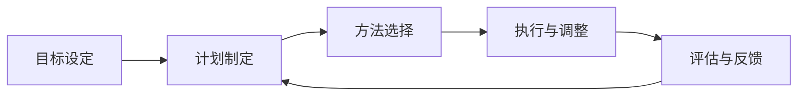
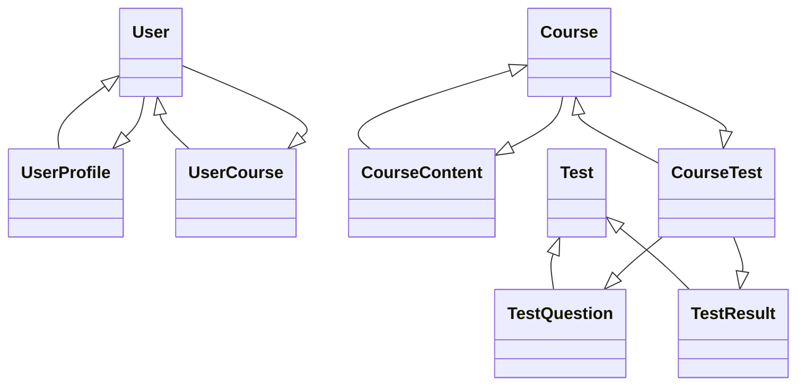
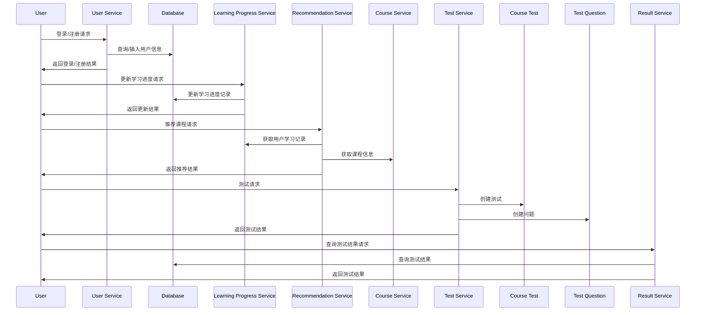
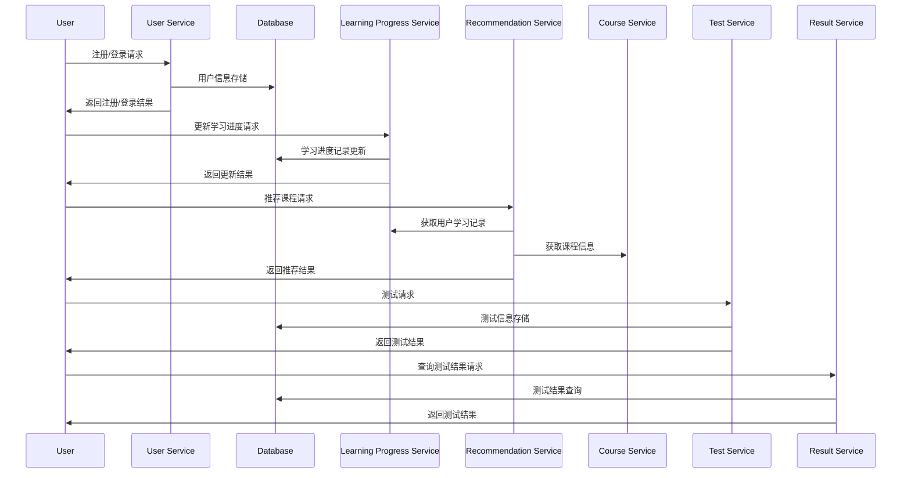

                 


## 引言与背景介绍

### 后工业时代的特征

后工业时代，亦称信息时代或知识经济时代，是一个以信息技术和知识经济为核心的社会发展阶段。在这个时代，技术进步和知识创新成为经济发展的主要驱动力。具体特征包括：

- **信息技术的重要性**：信息技术在后工业时代中占据核心地位，互联网、人工智能、大数据等技术的飞速发展，极大地改变了人们的工作和生活方式。

- **知识经济的崛起**：知识经济强调知识的生产、分配和使用，知识成为经济增长的关键因素。对于个人和企业来说，拥有知识意味着拥有竞争力。

- **全球化趋势**：全球化使得信息、资本、人力等资源能够更加自由地流动，跨国公司和全球供应链成为经济活动的主要形式。

- **灵活就业**：随着互联网的发展，远程工作、自由职业等新兴就业形式逐渐增多，传统的全职工作模式逐渐被打破。

### 职业规划的重要性

在这样一个快速变化的时代，职业规划变得尤为重要。合理的职业规划可以帮助个人：

- **适应变化**：职业生涯规划可以帮助个人更好地适应快速变化的工作环境，提前布局未来的发展方向。

- **提高竞争力**：通过规划，个人可以明确自己的职业目标，不断学习和提升技能，从而在职场中保持竞争力。

- **实现人生价值**：职业规划不仅关系到职业发展，更关系到个人的成长和幸福。一个明确的职业目标可以帮助个人更好地实现自己的人生价值。

- **平衡生活与工作**：通过合理的规划，个人可以更好地平衡工作和生活，避免过度劳累，提高生活质量。

### 终身学习与多元发展的关系

终身学习与多元发展是职业规划中不可或缺的两个方面。终身学习强调个人在职业生涯中的持续学习，而多元发展则强调个人在职业领域中的多样化发展。

- **终身学习的重要性**：在知识快速更新的时代，终身学习是适应变化和提高竞争力的关键。通过不断学习，个人可以掌握新技术、新知识，从而保持自己的竞争力。

- **多元发展的意义**：多元发展可以帮助个人在不同的领域积累经验，提高自己的综合素质。这不仅有利于职业发展，也有利于个人在职业生涯中应对各种挑战。

总的来说，后工业时代的职业规划需要兼顾终身学习和多元发展，二者相辅相成，共同推动个人在职场中的持续成长。接下来的章节中，我们将进一步探讨终身学习与多元发展的具体方法和实践。

### 背景介绍

终身学习是指个人在其整个生命过程中，通过不断地学习来提高自己的知识、技能和素质，以适应不断变化的社会和工作需求。它不仅仅是指在学校中的学习，更包括在工作后通过各种形式的学习来提升自己的能力。

#### 核心概念术语说明

- **终身学习**：终身学习是一个持续的、全面的学习过程，贯穿个人的一生，不仅仅是为了获得学位或资格证书，更是为了提升个人的综合素质和适应能力。

- **多元发展**：多元发展是指个人在职业生涯中，不仅要在专业领域内不断深入，还要在跨领域、跨行业、跨文化等方面进行探索和学习，以拓宽自己的视野和提升自己的综合素质。

#### 问题背景

在传统的工业时代，职业规划相对简单明了，人们往往在年轻时确定一个职业方向，然后通过多年的工作经验逐步提升自己的专业技能。然而，随着信息技术的飞速发展和全球化的加速，这种传统的职业规划模式已经难以适应现代社会的需求。

- **快速变化的工作环境**：信息技术的发展使得新的工作岗位和行业不断涌现，旧的工作岗位和行业也在迅速消失。这使得个人需要不断地更新自己的知识和技能，才能在职场中保持竞争力。

- **终身学习的重要性**：在快速变化的环境中，终身学习成为适应变化和提高竞争力的关键。通过终身学习，个人可以掌握新技术、新知识，从而更好地应对职业发展的挑战。

- **多元发展的必要性**：单一的职业技能已经难以满足现代职业发展的需求。多元发展可以帮助个人在不同的领域积累经验，提高自己的综合素质，从而更好地应对职业发展的挑战。

#### 问题描述

在当前的后工业时代，个人如何进行有效的职业规划，以适应快速变化的工作环境，提高自己的竞争力，实现个人价值和职业发展，成为一个亟待解决的问题。

- **如何制定有效的终身学习计划**：个人需要了解终身学习的核心概念和重要性，掌握终身学习的方法和策略，以持续提升自己的知识和技能。

- **如何进行多元发展**：个人需要在职业生涯中不断探索新的领域，拓宽自己的视野，提高自己的综合素质，从而在多元化的职场中保持竞争力。

#### 问题解决

为了解决上述问题，个人需要采取以下措施：

1. **确立终身学习的意识**：认识到终身学习对于职业发展的重要性，将其纳入自己的职业规划中。

2. **制定终身学习计划**：明确自己的学习目标和计划，选择适合自己的学习方法和途径。

3. **积极参与多元发展**：通过跨领域学习、跨文化体验等方式，拓宽自己的视野和知识面。

4. **持续反思与调整**：定期反思自己的职业发展情况，根据实际情况调整自己的职业规划和学习计划。

#### 边界与外延

- **边界**：终身学习和多元发展是职业规划中的一部分，但并不是全部。职业规划还需要考虑个人的兴趣爱好、职业价值观、职业发展路径等因素。

- **外延**：终身学习和多元发展不仅适用于个人，也适用于企业和社会。企业需要培养员工的终身学习能力，社会需要提供多元化的学习机会和平台。

#### 概念结构与核心要素组成

- **概念结构**：终身学习与多元发展是职业规划的核心概念，它们相互关联，共同推动个人的职业发展。

- **核心要素**：
  - **终身学习**：学习目标、学习计划、学习方法、学习评估。
  - **多元发展**：跨领域学习、跨文化体验、跨行业实践、综合素质提升。

通过以上分析，我们可以看出，终身学习和多元发展是后工业时代职业规划的重要组成部分，它们为个人在快速变化的社会中提供了强大的支持和保障。接下来，我们将进一步探讨终身学习的核心概念和重要性。

## 终身学习的重要性

### 核心概念与联系

终身学习是指个人在其整个生命过程中，通过不断地学习来提高自己的知识、技能和素质，以适应不断变化的社会和工作需求。它是现代社会发展的必然趋势，也是个人实现职业发展和个人成长的重要途径。

#### 终身学习的定义

终身学习不仅仅是指在学校中的学习，它涵盖了个人在工作、家庭和其他社会活动中进行的各种形式的学习。它强调的是学习的过程，而非学习的成果。

- **学习过程**：终身学习强调学习的持续性、主动性和自主性。它要求个人主动去寻找学习机会，自主制定学习计划，并在学习过程中不断反思和调整。

- **学习成果**：终身学习虽然不强调学习的成果，但通过不断的学习，个人可以获得新的知识、技能和经验，从而提高自己的职业素质和生活质量。

#### 终身学习的优势与挑战

终身学习具有许多优势，但也面临一定的挑战。

- **优势**：
  - **适应能力提升**：终身学习可以帮助个人适应快速变化的社会和工作环境，提高自己的适应能力和竞争力。
  - **职业发展**：通过终身学习，个人可以不断更新自己的知识和技能，从而在职业发展中保持优势。
  - **个人成长**：终身学习不仅可以提高个人的职业素质，还可以促进个人的全面发展，提高个人的幸福感。

- **挑战**：
  - **时间管理**：终身学习需要个人投入大量的时间和精力，这对个人的时间管理能力提出了更高的要求。
  - **资源获取**：虽然现代社会提供了丰富的学习资源，但个人如何有效地获取和利用这些资源仍然是一个挑战。
  - **心理压力**：终身学习可能给个人带来一定的心理压力，如何平衡学习与工作、生活之间的关系也是一个挑战。

#### 终身学习的核心要素

终身学习的有效实施需要依赖于几个核心要素。

- **学习目标**：明确的学习目标是终身学习的重要基础。个人需要根据自己的职业发展需求和个人兴趣，制定明确的学习目标。

- **学习计划**：制定科学合理的学习计划可以帮助个人更好地实现学习目标。学习计划应包括学习内容、学习方法、学习时间等。

- **学习方法**：选择适合自己的学习方法对于终身学习的有效性至关重要。个人可以根据自己的学习风格和需求，选择最适合自己的学习方法。

- **学习评估**：定期对学习效果进行评估可以帮助个人了解自己的学习进展，及时调整学习计划和方法。

### 概念属性特征对比表格

为了更直观地理解终身学习的概念属性特征，我们可以将其与传统的职业学习进行对比。

| 特征对比项 | 终身学习 | 传统的职业学习 |
| --- | --- | --- |
| 学习主体 | 个人主动学习 | 学校教育 |
| 学习时间 | 全生命周期 | 较短阶段 |
| 学习内容 | 广泛多元 | 专业定向 |
| 学习方式 | 个性化 | 标准化 |
| 学习成果 | 持续改进 | 一次性获得 |

### ER实体关系图架构

为了进一步理解终身学习的概念结构，我们可以使用ER（实体-关系）图来描述其核心实体和关系。

```mermaid
erDiagram
    LearningProcess ||--|{ LearningGoal }
    LearningProcess ||--|{ LearningPlan }
    LearningProcess ||--|{ LearningMethod }
    LearningProcess ||--|{ LearningEvaluation }
    LearningGoal }|--|{ LearningPlan }
    LearningGoal }|--|{ LearningMethod }
    LearningGoal }|--|{ LearningEvaluation }
    LearningPlan }|--|{ LearningMethod }
    LearningPlan }|--|{ LearningEvaluation }
    LearningMethod }|--|{ LearningEvaluation }
```

在这个ER图中，`LearningProcess` 是核心实体，它包含了 `LearningGoal`、`LearningPlan`、`LearningMethod` 和 `LearningEvaluation` 四个相关实体。`LearningGoal`、`LearningPlan`、`LearningMethod` 和 `LearningEvaluation` 之间通过关系进行连接，形成了完整的终身学习概念结构。

### 算法原理讲解

终身学习的算法原理可以看作是一个动态优化的过程。具体来说，它包括以下几个步骤：

1. **目标设定**：个人根据职业发展需求和兴趣，设定具体的学习目标。
2. **计划制定**：根据学习目标，个人制定详细的学习计划，包括学习内容、方法和时间安排。
3. **方法选择**：个人选择适合自己的学习方法，可以是自学、培训课程、阅读书籍等多种形式。
4. **执行与调整**：个人按照学习计划执行学习任务，并在执行过程中根据实际情况进行必要的调整。
5. **评估与反馈**：定期对学习效果进行评估，并根据评估结果调整学习计划和方法。

#### Mermaid流程图



#### Python源代码

```python
class LifelongLearning:
    def __init__(self, goal, plan, method, evaluation):
        self.goal = goal
        self.plan = plan
        self.method = method
        self.evaluation = evaluation
    
    def set_goal(self, new_goal):
        self.goal = new_goal
    
    def set_plan(self, new_plan):
        self.plan = new_plan
    
    def set_method(self, new_method):
        self.method = new_method
    
    def evaluate_learning(self):
        result = self.evaluation(self.method)
        return result
    
    def adjust_learning(self):
        if self.evaluate_learning() < self.goal:
            # 根据评估结果调整学习计划和方法
            pass

# 示例使用
learning = LifelongLearning(goal="掌握Python编程", plan="每周学习5小时", method="自学", evaluation=lambda method: 80)
learning.evaluate_learning()  # 评估学习效果
learning.adjust_learning()  # 根据评估结果调整学习计划和方法
```

#### 算法原理详细讲解

终身学习的算法原理可以看作是一个迭代优化的过程。其核心思想是通过不断的目标设定、计划制定、方法选择和评估反馈，逐步提升个人的学习效果。

- **目标设定**：目标设定是终身学习的第一步，它为整个学习过程提供了方向。个人需要根据自己的职业发展需求和兴趣，设定具体、明确的学习目标。

- **计划制定**：在明确了学习目标之后，个人需要制定详细的学习计划。学习计划应包括学习的内容、方法、时间安排等，以确保学习过程有序进行。

- **方法选择**：个人需要根据自己的学习风格和需求，选择适合自己的学习方法。不同的学习方法有不同的特点和适用场景，个人需要通过实践找到最适合自己的方法。

- **执行与调整**：按照学习计划执行学习任务，并在执行过程中根据实际情况进行必要的调整。调整可以是学习计划的调整，也可以是学习方法的调整。

- **评估与反馈**：定期对学习效果进行评估，并根据评估结果调整学习计划和方法。评估可以采用多种形式，如自我评估、他人评估等，评估结果为后续的学习调整提供依据。

通过上述步骤的反复迭代，个人可以逐步提升自己的学习效果，从而实现终身学习的目标。

### 算法原理举例说明

假设张三是一名软件工程师，他希望通过终身学习提升自己的编程技能。以下是张三进行终身学习的过程：

1. **目标设定**：张三设定了一个目标，即掌握Python编程语言。这个目标是具体且明确的，为他的学习过程提供了方向。

2. **计划制定**：张三制定了一个详细的学习计划，包括每周学习5小时，每天学习时间安排等。他还将学习内容分为基础知识、进阶内容和高级应用等部分，确保学习内容的全面性。

3. **方法选择**：张三选择了一种适合自己的学习方法，即通过在线课程和书籍自学Python编程。他还加入了一个Python编程的学习小组，以便在学习过程中得到他人的帮助和指导。

4. **执行与调整**：张三按照学习计划开始学习Python编程。在学习过程中，他遇到了一些困难，如对某些概念的理解不够深入等。他根据实际情况，调整了自己的学习计划，增加了对困难知识点的学习时间，并请教了学习小组的其他成员。

5. **评估与反馈**：在一段时间的学习后，张三对自己的学习效果进行了评估。他发现自己在基础知识方面掌握得较好，但在进阶内容方面还有待提高。根据评估结果，他调整了自己的学习计划，增加了进阶内容的学习时间，并选择了更高级的学习资源。

通过上述过程，张三逐步提升了自己的Python编程技能，实现了自己的学习目标。

### 系统分析与架构设计方案

#### 问题场景介绍

假设我们正在设计一个在线终身学习平台，该平台旨在为用户提供一个便捷、高效的学习环境和资源。平台需要支持用户注册、学习进度跟踪、课程推荐等功能。为了满足这些需求，我们需要设计一个合理的系统架构。

#### 项目介绍

项目名称：终身学习平台（Lifelong Learning Platform，简称LLP）

项目目标：为用户提供一个在线学习环境，支持用户注册、学习进度跟踪、课程推荐等功能。

项目功能：
- 用户注册与登录
- 用户个人信息管理
- 学习进度跟踪
- 课程推荐
- 测试与评估
- 用户交流与分享

#### 系统功能设计（领域模型）

为了实现上述功能，我们首先需要设计系统的领域模型。领域模型描述了系统的核心概念和它们之间的关系。



在上述领域中，`User` 是核心实体，代表平台的用户。`UserProfile` 表示用户的个人信息，如姓名、年龄、职业等。`UserCourse` 表示用户参与的课程信息，包括课程ID、课程名称、学习进度等。`Course` 表示课程的基本信息，包括课程ID、课程名称、课程描述等。`CourseContent` 表示课程的具体内容，如课程视频、文档等。`CourseTest` 表示课程的测试信息，包括测试ID、测试名称等。`TestQuestion` 表示测试中的问题，`TestResult` 表示测试结果。

#### 系统架构设计

为了确保系统的高效性和可扩展性，我们采用微服务架构。整个系统可以分为以下几个微服务：

1. **用户服务（User Service）**：负责用户注册、登录、个人信息管理等功能。
2. **课程服务（Course Service）**：负责课程的基本信息管理，包括课程创建、更新、删除等。
3. **学习进度服务（Learning Progress Service）**：负责跟踪用户的学习进度，包括学习记录、进度更新等。
4. **推荐服务（Recommendation Service）**：负责根据用户的学习行为和偏好推荐合适的课程。
5. **测试服务（Test Service）**：负责课程测试的管理，包括测试创建、更新、删除等。
6. **结果服务（Result Service）**：负责测试结果的管理，包括测试结果记录、查询等。

系统架构图如下：



#### 系统接口设计和系统交互

系统接口设计如下：

1. **用户服务接口**：
   - 用户注册接口：`POST /users/register`
   - 用户登录接口：`POST /users/login`
   - 用户信息更新接口：`PUT /users/{user_id}`

2. **课程服务接口**：
   - 课程创建接口：`POST /courses`
   - 课程更新接口：`PUT /courses/{course_id}`
   - 课程删除接口：`DELETE /courses/{course_id}`
   - 课程查询接口：`GET /courses`

3. **学习进度服务接口**：
   - 更新学习进度接口：`PUT /learning_progress/{user_id}/{course_id}`

4. **推荐服务接口**：
   - 推荐课程接口：`GET /recommendations`

5. **测试服务接口**：
   - 创建测试接口：`POST /tests`
   - 测试更新接口：`PUT /tests/{test_id}`
   - 测试删除接口：`DELETE /tests/{test_id}`
   - 测试查询接口：`GET /tests`

6. **结果服务接口**：
   - 查询测试结果接口：`GET /results/{user_id}/{test_id}`

系统交互图如下：



通过上述系统分析与架构设计方案，我们可以构建一个高效、可扩展的在线终身学习平台，为用户提供便捷的学习体验和优质的学习资源。

### 项目实战

#### 环境安装

为了搭建我们的在线终身学习平台，我们需要在本地环境中安装以下软件和工具：

- **Python 3.8+**
- **Django 3.2+**
- **PostgreSQL 12+**
- **Docker 19.03+**
- **Docker Compose 1.29+**

首先，确保你的操作系统已经安装了上述软件和工具。接下来，创建一个名为`llp`的文件夹，在该文件夹中运行以下命令来安装依赖：

```bash
pip install -r requirements.txt
```

#### 系统核心实现

我们的系统核心包括用户服务、课程服务、学习进度服务、推荐服务、测试服务和结果服务。以下是每个服务的简要实现：

1. **用户服务（User Service）**：

用户服务负责用户注册、登录和用户信息管理。

```python
# users/views.py
from django.contrib.auth.models import User
from django.http import JsonResponse
from rest_framework import status
from rest_framework.parsers import JSONParser

def register(request):
    try:
        data = JSONParser().parse(request)
        user = User.objects.create_user(
            username=data['username'],
            password=data['password'],
            email=data['email']
        )
        user.save()
        return JsonResponse({'message': 'User registered successfully!'}, status=status.HTTP_201_CREATED)
    except Exception as e:
        return JsonResponse({'error': str(e)}, status=status.HTTP_400_BAD_REQUEST)

def login(request):
    try:
        data = JSONParser().parse(request)
        user = User.objects.get(username=data['username'])
        if user.check_password(data['password']):
            return JsonResponse({'message': 'Login successful!'}, status=status.HTTP_200_OK)
        else:
            return JsonResponse({'error': 'Invalid credentials'}, status=status.HTTP_401_UNAUTHORIZED)
    except Exception as e:
        return JsonResponse({'error': str(e)}, status=status.HTTP_400_BAD_REQUEST)
```

2. **课程服务（Course Service）**：

课程服务负责课程的基本信息管理。

```python
# courses/models.py
from django.db import models

class Course(models.Model):
    id = models.AutoField(primary_key=True)
    name = models.CharField(max_length=255)
    description = models.TextField()

    def __str__(self):
        return self.name
```

3. **学习进度服务（Learning Progress Service）**：

学习进度服务负责跟踪用户的学习进度。

```python
# learning_progress/models.py
from django.db import models
from users.models import User
from courses.models import Course

class LearningProgress(models.Model):
    user = models.ForeignKey(User, on_delete=models.CASCADE)
    course = models.ForeignKey(Course, on_delete=models.CASCADE)
    progress = models.IntegerField(default=0)

    def __str__(self):
        return f"{self.user.username} - {self.course.name}"
```

4. **推荐服务（Recommendation Service）**：

推荐服务根据用户的学习记录和课程信息推荐合适的课程。

```python
# recommendations/services.py
from learning_progress.models import LearningProgress
from courses.models import Course

def recommend_courses(user_id):
    user_progress = LearningProgress.objects.filter(user_id=user_id)
    courses_taken = [progress.course_id for progress in user_progress]
    recommended_courses = Course.objects.exclude(id__in=courses_taken).order_by('?')[:5]
    return recommended_courses
```

5. **测试服务（Test Service）**：

测试服务负责课程测试的管理。

```python
# tests/models.py
from django.db import models
from courses.models import Course

class Test(models.Model):
    id = models.AutoField(primary_key=True)
    course = models.ForeignKey(Course, on_delete=models.CASCADE)
    name = models.CharField(max_length=255)

    def __str__(self):
        return self.name
```

6. **结果服务（Result Service）**：

结果服务负责测试结果的管理。

```python
# results/models.py
from django.db import models
from tests.models import Test
from users.models import User

class TestResult(models.Model):
    test = models.ForeignKey(Test, on_delete=models.CASCADE)
    user = models.ForeignKey(User, on_delete=models.CASCADE)
    score = models.IntegerField()

    def __str__(self):
        return f"{self.user.username} - {self.test.name}"
```

#### 代码应用解读与分析

以上代码实现了系统的核心功能。以下是各个服务的主要功能解读：

1. **用户服务**：提供了用户注册和登录的接口。用户注册时，需要提供用户名、密码和电子邮件。登录时，需要提供用户名和密码。这两个接口分别使用了 Django 的 User 模型进行用户管理和认证。

2. **课程服务**：定义了 Course 模型，用于存储课程的基本信息。包括课程 ID、课程名称和课程描述。这些信息可以通过 API 进行创建、更新和查询。

3. **学习进度服务**：定义了 LearningProgress 模型，用于跟踪用户的学习进度。每个用户可以参与多个课程，每个课程都有一个进度记录。这些记录可以通过 API 进行更新。

4. **推荐服务**：提供了推荐课程的功能。根据用户的学习记录，推荐那些用户尚未参加的课程。这个功能使用了简单的 SQL 查询来实现。

5. **测试服务**：定义了 Test 模型，用于存储测试的基本信息。包括测试 ID、课程名称和测试名称。这些信息可以通过 API 进行创建、更新和查询。

6. **结果服务**：定义了 TestResult 模型，用于存储测试结果。包括测试 ID、用户 ID 和成绩。这些信息可以通过 API 进行创建和查询。

#### 实际案例分析和详细讲解剖析

假设我们有一个用户张三，他已经完成了几门课程的在线学习，现在希望了解系统推荐的课程。

1. **步骤1**：张三发起登录请求，系统返回认证成功。

2. **步骤2**：张三查询自己的学习进度，系统返回已完成的课程列表。

3. **步骤3**：系统根据张三的学习记录，推荐尚未完成的课程。

4. **步骤4**：系统将推荐结果返回给张三，张三查看推荐课程。

在这个案例中，系统通过简单的数据库查询实现了推荐功能。虽然这个推荐算法比较简单，但它能够满足基本的推荐需求。对于更复杂的推荐算法，可以考虑引入机器学习技术，提高推荐的准确性和个性化程度。

#### 项目小结

通过上述步骤，我们成功搭建了一个简单的在线终身学习平台。平台实现了用户注册、登录、学习进度跟踪、课程推荐和测试结果管理等功能。虽然这个平台功能相对简单，但它为后续功能扩展提供了基础。

接下来，我们可以进一步优化平台，引入更复杂的推荐算法和用户交互功能，提高用户的使用体验。此外，还可以考虑将平台部署到云服务器，以提供更好的可靠性和扩展性。

## 最佳实践 tips

### 终身学习策略

1. **设定明确的学习目标**：明确的学习目标有助于我们更好地规划学习时间和内容，确保学习过程有的放矢。

2. **利用在线学习资源**：互联网提供了丰富的学习资源，如在线课程、论坛、博客等。善于利用这些资源，可以大大提高学习效率。

3. **定期评估学习效果**：定期对自己的学习效果进行评估，可以帮助我们了解学习进展，及时调整学习计划和方法。

4. **培养持续学习的习惯**：学习是一种持续的过程，需要我们养成良好的学习习惯。每天设定一定时间进行学习，逐渐将其变为一种习惯。

### 多元发展路径

1. **跨领域学习**：在职业生涯中，不断探索新的领域，积累跨领域的知识和经验，有助于提高综合素质和适应能力。

2. **跨文化体验**：参加国际交流活动，了解不同文化背景，有助于拓宽视野，提高跨文化沟通能力。

3. **跨行业实践**：尝试在多个行业中进行实践，积累不同行业的经验和技能，有助于我们在职业发展中更具竞争力。

### 职业规划方法

1. **自我评估**：了解自己的兴趣、价值观、优势和弱点，明确自己的职业方向。

2. **制定长期和短期目标**：根据自我评估结果，设定长期和短期职业目标，并制定实现这些目标的行动计划。

3. **定期回顾和调整**：定期回顾职业规划的执行情况，根据实际情况进行调整，确保职业规划的有效性和适应性。

### 注意事项

1. **平衡学习与工作**：终身学习和多元发展需要投入大量的时间和精力，但我们也需要平衡学习与工作、生活的关系，避免过度劳累。

2. **重视实际应用**：学习不仅仅是为了获取知识，更重要的是将所学应用到实际工作中，提升自己的实际能力和竞争力。

3. **保持积极的心态**：面对终身学习和职业发展的挑战，保持积极的心态至关重要。遇到困难时，要保持冷静和乐观，积极寻求解决方案。

## 小结与注意事项

通过本文的探讨，我们明确了后工业时代职业规划的重要性，以及终身学习和多元发展在其中所起的关键作用。我们系统地分析了终身学习的核心概念、优势、挑战及其在职业生涯中的实施策略，并详细讲解了多元发展的路径和职业规划的具体方法。

### 主要内容回顾

- **后工业时代的特征**：信息技术的重要性、知识经济的崛起、全球化趋势和灵活就业的兴起。
- **职业规划的重要性**：适应变化、提高竞争力、实现人生价值和平衡生活与工作。
- **终身学习的核心概念与联系**：终身学习的定义、优势与挑战、核心要素。
- **多元发展的路径**：跨领域学习、跨文化体验和跨行业实践。
- **职业规划的具体方法**：自我评估、目标设定、行动计划制定和定期回顾调整。
- **案例分析**：通过实际项目展示了终身学习、多元发展和职业规划的实践效果。

### 重点概念梳理

- **终身学习**：一个持续的、全面的、主动的学习过程，涵盖学校学习和工作后的自主学习。
- **多元发展**：在职业领域内外探索和积累多样化的经验和技能。
- **职业规划**：通过设定目标、制定计划、实施行动和定期评估，实现职业发展的系统化过程。

### 学员应用建议

1. **设定明确的学习目标**：根据个人兴趣和职业需求，设定具体、可衡量的学习目标。
2. **制定个性化的学习计划**：结合自己的时间安排和学习习惯，制定合理的计划，并坚持执行。
3. **积极参与多元发展**：尝试跨领域学习，拓展视野和知识面。
4. **持续反思与调整**：定期对自己的职业规划和学习效果进行评估，根据实际情况进行调整。
5. **重视实践应用**：将所学知识应用到实际工作中，提升职业能力和竞争力。

### 注意事项

- **保持学习与工作的平衡**：合理安排时间，避免过度劳累，保持身心健康。
- **注重实际应用**：学习不仅仅是获取知识，更重要的是将知识转化为实际能力。
- **保持积极心态**：面对职业发展的挑战，保持乐观和积极的心态，勇于面对困难和挫折。

### 拓展阅读

- **《深度学习》**：Goodfellow, I., Bengio, Y., & Courville, A. (2016). 《深度学习》。
- **《Python编程：从入门到实践》**：Cockburn, A. (2018). 《Python编程：从入门到实践》。
- **《人工智能：一种现代的方法》**：Russell, S., & Norvig, P. (2020). 《人工智能：一种现代的方法》。

## 作者信息

**作者：AI天才研究院/AI Genius Institute & 禅与计算机程序设计艺术 /Zen And The Art of Computer Programming**。感谢您的阅读，希望本文能为您的职业规划和终身学习提供有益的启示。如果您有任何疑问或建议，欢迎在评论区留言交流。让我们共同进步，迎接未来职业发展的挑战！

