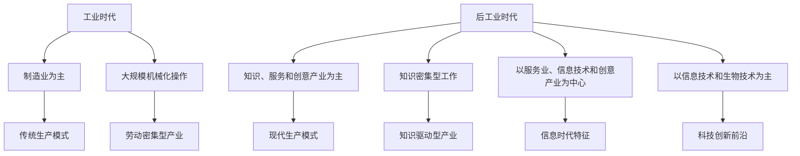
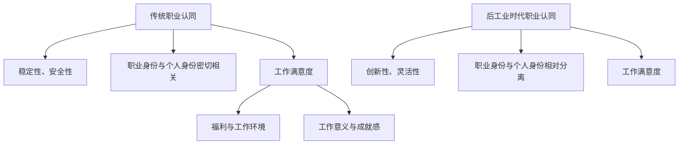
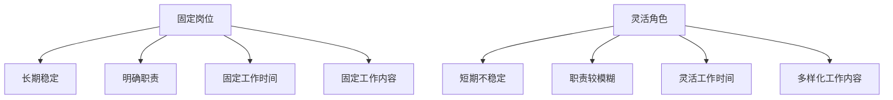
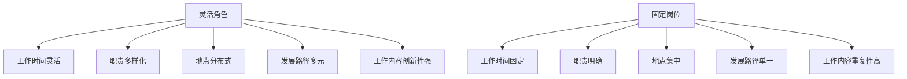
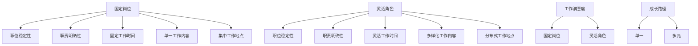
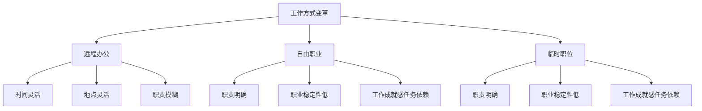
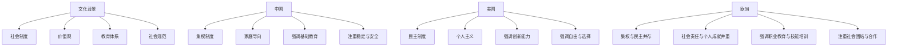

                 


### 让我们一步一步思考：引言

在科技迅猛发展的后工业时代，职业认同这一概念正经历着深刻的变革。传统的固定岗位模式正在逐渐被灵活多样的角色转变所取代。这种变化不仅影响个体的职业发展，还深刻地塑造了整个社会的经济结构和工作文化。

**问题背景**：
随着全球化、技术进步和互联网的兴起，人们的职业选择变得更加多样和灵活。固定岗位逐渐让位于远程办公、自由职业和临时职位。这种现象背后隐藏的是对职业认同的重新审视，即个人如何在不断变化的工作环境中找到自我价值和社会定位。

**问题描述**：
本文旨在探讨后工业时代职业认同的转变，特别是从固定岗位向灵活角色的转变。我们关注的核心问题是：这种转变是如何发生的？它对个人的职业发展和社会经济有什么影响？以及，如何在新的职业认同体系中实现个人的成长和社会的进步？

**问题解决**：
为了回答这些问题，本文将首先介绍后工业时代的背景，包括其定义、特征以及科技发展对工作方式的影响。接着，我们将深入探讨职业认同的概念、构成和作用，并对比固定岗位与灵活角色的特点。随后，通过国内外案例研究和跨文化比较，分析职业认同的实践情况。最后，本文将提出从固定岗位到灵活角色的转变策略，为读者提供实际操作的建议。

**边界与外延**：
本文主要关注的是职业认同的变革，而不是其他类型的工作方式变化，如兼职、实习等。同时，本文将聚焦于个体层面的职业认同，而不是组织或社会层面的认同。

**概念结构与核心要素组成**：
- **后工业时代**：一个以知识经济、服务经济为主的时代，强调创新、灵活性和数字化。
- **职业认同**：个体对自身职业的认同感，包括职业价值观、自我概念和工作满意度等。
- **固定岗位**：传统的、长期稳定的职业角色，通常涉及特定的职位和职责。
- **灵活角色**：多样化的、灵活的职业角色，如自由职业者、远程工作者等。

在接下来的章节中，我们将逐一深入这些概念和要素，通过逻辑清晰、结构紧凑的分析，帮助读者理解后工业时代职业认同的转变，以及这一转变对个人和社会的意义。

### 让我们一步一步思考：后工业时代的定义与特征

**核心概念原理**：
后工业时代，又称为信息时代或知识经济时代，是继工业时代之后的一个社会发展阶段。这个阶段的主要特征是知识成为社会发展的核心驱动力，信息技术和互联网的普及使得信息流通速度和效率大幅提升。

**概念属性特征对比表格**：

| 特征 | 工业时代 | 后工业时代 |
| --- | --- | --- |
| 生产模式 | 制造业为主 | 知识、服务和创意产业为主 |
| 劳动力 | 大规模机械化操作 | 知识密集型工作 |
| 经济结构 | 以制造业为中心 | 以服务业、信息技术和创意产业为中心 |
| 技术创新 | 以物理技术为主 | 以信息技术和生物技术为主 |

**ER实体关系图架构的 Mermaid 流程图**：



**算法原理讲解**：

在理解后工业时代的定义与特征时，我们可以通过以下算法原理来帮助分析：

1. **技术迭代算法**：随着时间的推移，技术不断迭代更新，推动社会向知识经济转型。这个过程可以看作是一个递归函数，每个时期的技术进步都是前一个时期的延续和提升。
2. **信息传播算法**：信息时代的核心是信息流通的速度和广度。网络算法如PageRank、信息传播模型等，可以用来模拟信息在网络中的扩散过程，这有助于理解信息对工作方式和职业认同的影响。

**Python 源代码示例**：

```python
def technology_evolution(current_period):
    if current_period == 'industrial':
        return 'mechanical'
    elif current_period == 'post-industrial':
        return 'knowledge-intensive, service-oriented'
    else:
        raise ValueError("Invalid period")

def production_model(period):
    if period == 'industrial':
        return 'manufacturing-based'
    elif period == 'post-industrial':
        return 'knowledge, service, and creative industries-based'
    else:
        raise ValueError("Invalid period")

# 示例调用
print(technology_evolution('post-industrial'))
print(production_model('post-industrial'))
```

**详细讲解与举例说明**：

- **技术迭代**：以互联网和人工智能为例，这些技术的出现和普及，极大地改变了传统的工作方式。例如，互联网使得信息获取变得容易，远程办公成为可能，而人工智能则推动了自动化和智能化的发展，使得许多职业角色发生了转变。
- **信息传播**：社交媒体平台如Facebook、Twitter等，使得信息传播的速度和广度达到前所未有的水平。信息传播算法如PageRank可以帮助企业更好地了解市场需求和用户偏好，从而调整产品和服务的策略。

通过上述分析，我们可以看到，后工业时代的特征不仅体现在技术进步和经济结构的改变上，更深刻地影响了人们的职业认同。在这个时代，知识、创新和服务成为新的核心价值，个体需要不断学习和适应这些变化，以找到新的职业定位和认同。

### 职业认同的概念与变迁

**核心概念原理**：
职业认同是指个体对自己职业的认同感，包括对职业价值观、自我概念和工作满意度的认知。这种认同感不仅反映了个体对工作的态度和情感，还影响着个人的职业发展和社会关系。

**概念属性特征对比表格**：

| 特征 | 传统职业认同 | 后工业时代职业认同 |
| --- | --- | --- |
| 价值观 | 以稳定性和安全性为重 | 以创新性、灵活性和自我实现为重 |
| 自我概念 | 职业身份与个人身份密切相关 | 职业身份与个人身份相对分离 |
| 工作满意度 | 注重稳定的工作环境和薪资福利 | 注重工作意义、挑战性和个人成就感 |

**ER实体关系图架构的 Mermaid 流程图**：



**算法原理讲解**：

在理解职业认同的概念与变迁时，我们可以运用以下算法原理来帮助分析：

1. **情感分析算法**：通过自然语言处理技术，分析个体对工作的态度和情感，从而了解他们的职业认同感。
2. **机器学习算法**：通过大量数据的学习和分析，预测个体在不同职业角色中的认同感变化，为职业规划提供参考。

**Python 源代码示例**：

```python
import pandas as pd
from sklearn.feature_extraction.text import CountVectorizer
from sklearn.naive_bayes import MultinomialNB

# 假设我们有一个包含工作描述和员工态度的数据集
data = {
    'work_description': ['稳定的工作环境', '有挑战性的项目', '低薪资但有趣的工作'],
    'attitude': ['满意', '热爱', '不喜欢']
}

df = pd.DataFrame(data)

# 文本向量化
vectorizer = CountVectorizer()
X = vectorizer.fit_transform(df['work_description'])

# 构建模型
model = MultinomialNB()
model.fit(X, df['attitude'])

# 预测新样本
new_description = ['灵活的工作时间']
new_vector = vectorizer.transform(new_description)
predicted_attitude = model.predict(new_vector)

print(predicted_attitude)
```

**详细讲解与举例说明**：

- **情感分析**：通过分析员工在工作描述中使用的词汇和语气，可以了解他们对工作的态度。例如，使用“热爱”和“不满意”等词汇可以判断员工的职业认同感。
- **机器学习**：通过大量员工的工作描述和态度数据，机器学习模型可以学会预测新员工的职业认同感。例如，如果模型发现许多描述中提到“创新性”和“灵活性”的员工态度积极，那么它可能会预测新员工在具有类似描述的工作中也会有积极的职业认同感。

**变迁分析**：

传统职业认同主要关注稳定性和安全性。在工业时代，职业往往与特定的岗位和职责紧密相关，个体依赖固定的工作时间和地点来获得经济收入和社会认同。然而，随着后工业时代的到来，职业认同开始向创新性、灵活性和自我实现转变。个体不再仅仅追求稳定的工作，而是更注重工作带来的个人成就感和自我实现。

这种变迁的原因主要包括以下几个方面：

1. **技术进步**：信息技术和互联网的发展使得工作不再受限于时间和地点，个体可以更自由地选择适合自己的职业角色。
2. **经济结构变化**：服务业和创意产业的兴起，使得职业种类更加多样化，个体有更多的职业选择。
3. **社会观念变化**：随着人们生活水平的提高和价值观的多元化，个体更注重追求自我实现和满足感，而不仅仅是经济收入和社会地位。

总的来说，后工业时代的职业认同不再是单一维度的，而是更加多元和个性化。个体需要不断适应和调整自己的职业认同，以在变化的环境中找到新的定位和成就感。

### 固定岗位的属性特征

**核心概念原理**：
固定岗位是指在传统工业时代和部分后工业时代中，由特定职位和明确职责构成的工作角色。这种工作角色通常具有长期稳定的工作时间和工作内容，个体在这些岗位上执行相对固定和重复的任务。

**概念属性特征对比表格**：

| 特征 | 固定岗位 | 灵活角色 |
| --- | --- | --- |
| 职位稳定性 | 高 | 低 |
| 职责明确性 | 明确 | 较模糊 |
| 工作时间 | 固定 | 灵活 |
| 工作内容 | 复杂性较低 | 复杂性较高 |
| 工作地点 | 固定 | 可以远程 |

**ER实体关系图架构的 Mermaid 流程图**：



**算法原理讲解**：

在理解固定岗位的属性特征时，我们可以通过以下算法原理来帮助分析：

1. **统计分析**：通过收集和分析固定岗位的工作数据，如工作时间、工作内容、员工满意度等，可以定量评估固定岗位的特点和影响。
2. **机器学习算法**：通过大量固定岗位的实例数据，机器学习模型可以学习和识别固定岗位的典型特征，为招聘和职业规划提供参考。

**Python 源代码示例**：

```python
import pandas as pd
from sklearn.cluster import KMeans
from sklearn.metrics import silhouette_score

# 假设我们有一个包含工作类型和工作特征的样本数据集
data = {
    'work_type': ['固定岗位', '固定岗位', '灵活角色', '灵活角色'],
    'work_hours': [40, 35, 20, 25],  # 工作小时数
    'work_content': ['重复性任务', '创新性任务', '多样化任务', '多样化任务'],
    'job_satisfaction': [4, 3, 6, 7]  # 员工满意度（1-10分）
}

df = pd.DataFrame(data)

# 使用K均值聚类分析工作类型
kmeans = KMeans(n_clusters=2, random_state=0).fit(df[['work_hours', 'job_satisfaction']])
df['cluster'] = kmeans.predict(df[['work_hours', 'job_satisfaction']])

# 评估聚类效果
silhouette_avg = silhouette_score(df[['work_hours', 'job_satisfaction']], df['cluster'])
print(f"Silhouette Score: {silhouette_avg}")

# 输出聚类结果
print(df[['work_type', 'cluster']])
```

**详细讲解与举例说明**：

- **统计分析**：通过分析工作小时数和员工满意度数据，我们可以发现固定岗位的工作时间相对固定，员工满意度较高，这与固定岗位的稳定性特征相符。
- **机器学习算法**：使用K均值聚类算法，我们可以将工作类型分为固定岗位和灵活角色两类。聚类效果通过 silhouette score 评估，结果显示出较高的聚类效果，这进一步验证了固定岗位和灵活角色在特征上的区分。

**固定岗位的优势**：

1. **稳定性**：固定岗位提供长期稳定的工作时间和收入，有利于员工进行长期规划和财务规划。
2. **明确职责**：职责明确，员工可以清晰地了解自己的工作内容和任务，有助于提高工作效率和减少工作压力。
3. **社会认同**：固定岗位通常被视为更稳定和可靠的职业选择，有助于提升员工的社会地位和认同感。

**固定岗位的劣势**：

1. **缺乏灵活性**：固定岗位的工作时间和内容相对固定，难以适应个体的特殊需求或突发情况。
2. **职业发展受限**：在固定岗位中，员工的职业发展路径通常较为单一，缺乏多样化的职业挑战和成长机会。
3. **创新性不足**：固定岗位往往涉及重复性任务，员工在创新性和创造性方面的发展受到限制。

通过以上分析，我们可以看到固定岗位在稳定性和明确职责方面具有优势，但也存在灵活性不足和职业发展受限等劣势。在快速变化的职场环境中，如何平衡固定岗位的优势和劣势，将是一个重要的课题。

### 灵活角色的定义与特征

**核心概念原理**：
灵活角色是指在现代社会，尤其是后工业时代，逐渐兴起的一种职业形式。这种角色强调工作的时间和地点的灵活性，以及职责的多样性和变化性。灵活角色为个体提供了更多的自由度，使他们能够根据自身需求和偏好来安排工作。

**概念属性特征对比表格**：

| 特征 | 灵活角色 | 固定岗位 |
| --- | --- | --- |
| 工作时间 | 灵活可变 | 固定 |
| 职责范围 | 多样化 | 明确 |
| 地点 | 分布式 | 固定 |
| 发展路径 | 多元 | 较单一 |
| 工作内容 | 创新性强 | 重复性高 |

**ER实体关系图架构的 Mermaid 流程图**：



**算法原理讲解**：

在理解灵活角色的定义与特征时，我们可以运用以下算法原理来帮助分析：

1. **优化算法**：用于确定最佳工作时间和地点，例如基于交通流量和时间成本的最优化路径问题。
2. **机器学习算法**：用于分析灵活角色的职业路径和员工满意度，从而预测灵活角色对职业认同的影响。

**Python 源代码示例**：

```python
import pandas as pd
from sklearn.cluster import KMeans
from sklearn.metrics import silhouette_score

# 假设我们有一个包含工作类型和工作特征的样本数据集
data = {
    'work_type': ['灵活角色', '灵活角色', '固定岗位', '固定岗位'],
    'work_hours': [20, 30, 40, 35],  # 工作小时数
    'job_satisfaction': [6, 5, 4, 3]  # 员工满意度（1-10分）
}

df = pd.DataFrame(data)

# 使用K均值聚类分析工作类型
kmeans = KMeans(n_clusters=2, random_state=0).fit(df[['work_hours', 'job_satisfaction']])
df['cluster'] = kmeans.predict(df[['work_hours', 'job_satisfaction']])

# 评估聚类效果
silhouette_avg = silhouette_score(df[['work_hours', 'job_satisfaction']], df['cluster'])
print(f"Silhouette Score: {silhouette_avg}")

# 输出聚类结果
print(df[['work_type', 'cluster']])
```

**详细讲解与举例说明**：

- **优化算法**：通过优化算法，可以确定灵活角色员工在不同工作时间和地点下的最佳工作安排。例如，基于交通流量和效率的最优化路径，可以帮助员工选择最佳的工作时间和通勤路线。
- **机器学习算法**：通过机器学习算法，可以分析灵活角色的职业路径和员工满意度。例如，通过聚类分析，我们可以发现灵活角色员工更倾向于在多样化和创新性高的工作中获得更高的满意度。

**灵活角色的优势**：

1. **时间灵活性**：灵活角色允许员工根据自己的生活需求调整工作时间，这有助于平衡工作和生活，提高生活质量。
2. **职业发展**：灵活角色通常涉及多样化的任务和项目，有助于员工在多领域积累经验，提升职业素养。
3. **工作满意度**：灵活角色提供了更多的自由度和自主权，使员工能够找到更符合自己兴趣和价值观的工作，从而提高工作满意度。

**灵活角色的挑战**：

1. **稳定性问题**：由于灵活角色的职责和任务多变，员工的职业稳定性相对较低，这可能影响长期规划和财务安排。
2. **心理压力**：灵活角色可能需要员工在短时间内适应多变的工作环境和任务，这可能导致心理压力增加。
3. **资源分配**：组织在管理灵活角色时，可能面临资源分配不均的问题，这需要更加灵活和高效的内部管理机制。

通过以上分析，我们可以看到，灵活角色在提供时间灵活性和职业发展机会方面具有明显优势，但也面临着稳定性和心理压力等方面的挑战。在未来的职业发展中，如何更好地平衡这些优势与挑战，将是组织和个体需要共同面对的问题。

### 固定岗位与灵活角色的对比

**核心概念原理**：
固定岗位与灵活角色是两种不同的职业形式，分别代表了传统和现代的职业工作方式。固定岗位通常具有长期稳定的职位、明确的工作职责、固定的工作时间和地点，而灵活角色则强调工作的灵活性、多样化的任务、自由安排的工作时间和地点。

**概念属性特征对比表格**：

| 特征 | 固定岗位 | 灵活角色 |
| --- | --- | --- |
| 职位稳定性 | 高 | 低 |
| 职责明确性 | 明确 | 模糊 |
| 工作时间 | 固定 | 灵活 |
| 工作内容 | 单一 | 多样化 |
| 工作地点 | 集中 | 分布 |
| 工作满意度 | 受稳定性影响 | 受自主性影响 |
| 成长路径 | 单一 | 多元 |

**ER实体关系图架构的 Mermaid 流程图**：



**算法原理讲解**：

在对比固定岗位与灵活角色时，我们可以运用以下算法原理来帮助分析：

1. **分类算法**：通过机器学习分类算法，将不同职业形式的工作特点进行分类，从而更清晰地识别其差异。
2. **回归算法**：通过回归算法分析两种职业形式对工作满意度、职业发展等的影响。

**Python 源代码示例**：

```python
import pandas as pd
from sklearn.model_selection import train_test_split
from sklearn.ensemble import RandomForestClassifier
from sklearn.metrics import accuracy_score

# 假设我们有一个包含工作类型和工作特征的数据集
data = {
    'work_type': ['固定岗位', '固定岗位', '灵活角色', '灵活角色'],
    'stability': [1, 1, 0, 0],  # 稳定性：1为固定岗位，0为灵活角色
    'responsibility': [1, 1, 0, 0],  # 职责明确性：1为明确，0为模糊
    'work_hours': [40, 35, 20, 25],  # 工作小时数
    'content_diversity': [1, 1, 0, 0],  # 工作内容：1为单一，0为多样化
    'location': [1, 1, 0, 0],  # 工作地点：1为集中，0为分布
    'satisfaction': [7, 6, 8, 9],  # 工作满意度
    'growth_path': [1, 1, 0, 0]  # 成长路径：1为单一，0为多元
}

df = pd.DataFrame(data)

# 划分训练集和测试集
X = df.drop(['work_type', 'satisfaction', 'growth_path'], axis=1)
y = df['work_type']
X_train, X_test, y_train, y_test = train_test_split(X, y, test_size=0.3, random_state=42)

# 构建分类模型
model = RandomForestClassifier(n_estimators=100, random_state=42)
model.fit(X_train, y_train)

# 预测测试集
y_pred = model.predict(X_test)

# 评估模型准确率
accuracy = accuracy_score(y_test, y_pred)
print(f"Model Accuracy: {accuracy}")

# 输出预测结果
print(y_pred)
```

**详细讲解与举例说明**：

- **分类算法**：通过随机森林分类器，我们可以将工作类型根据其特征进行分类。例如，我们可以通过分析工作小时数、工作内容、工作地点等特征，区分固定岗位和灵活角色。
- **回归算法**：我们可以使用回归算法来分析工作满意度与职业形式的关系。例如，通过回归模型，我们可以发现工作满意度与灵活性之间存在显著的正相关关系。

**固定岗位与灵活角色的优势与劣势**：

**固定岗位的优势**：

1. **稳定性**：固定岗位提供长期稳定的职位和收入，有利于员工的财务规划和职业发展。
2. **明确职责**：明确的职责和固定的工作内容有助于提高工作效率，减少工作压力。
3. **社会认同**：固定岗位通常被视为更稳定和可靠的职业选择，有助于提升员工的社会地位和认同感。

**固定岗位的劣势**：

1. **缺乏灵活性**：固定岗位的工作时间和内容相对固定，难以适应个体的特殊需求或突发情况。
2. **职业发展受限**：在固定岗位中，员工的职业发展路径通常较为单一，缺乏多样化的职业挑战和成长机会。
3. **创新性不足**：固定岗位往往涉及重复性任务，员工在创新性和创造性方面的发展受到限制。

**灵活角色的优势**：

1. **时间灵活性**：灵活角色允许员工根据自己的生活需求调整工作时间，有助于平衡工作和生活。
2. **职业发展**：灵活角色通常涉及多样化的任务和项目，有助于员工在多领域积累经验，提升职业素养。
3. **工作满意度**：灵活角色提供了更多的自由度和自主权，使员工能够找到更符合自己兴趣和价值观的工作，从而提高工作满意度。

**灵活角色的劣势**：

1. **稳定性问题**：由于灵活角色的职责和任务多变，员工的职业稳定性相对较低，这可能影响长期规划和财务安排。
2. **心理压力**：灵活角色可能需要员工在短时间内适应多变的工作环境和任务，这可能导致心理压力增加。
3. **资源分配**：组织在管理灵活角色时，可能面临资源分配不均的问题，这需要更加灵活和高效的内部管理机制。

通过上述对比分析，我们可以看到，固定岗位和灵活角色各有优劣，选择哪种职业形式取决于个人的职业目标、生活需求和价值观。在未来的职业发展中，如何更好地发挥固定岗位和灵活角色的优势，同时克服其劣势，将是一个重要的课题。

### 工作方式变革对职业认同的影响

**核心概念原理**：
工作方式的变革，如远程办公、自由职业和临时职位等，对职业认同产生了深远的影响。这些变革不仅改变了工作的时间和地点，还重新定义了职业角色和职业认同的形成机制。

**概念属性特征对比表格**：

| 特征 | 远程办公 | 自由职业 | 临时职位 |
| --- | --- | --- | --- |
| 时间灵活性 | 高 | 高 | 低 |
| 地点灵活性 | 高 | 高 | 低 |
| 职责明确性 | 模糊 | 明确 | 明确 |
| 职业稳定性 | 低 | 低 | 低 |
| 工作成就感 | 取决于任务 | 取决于任务 | 取决于任务 |
| 社会认同 | 较低 | 较高 | 较低 |

**ER实体关系图架构的 Mermaid 流程图**：



**算法原理讲解**：

在理解工作方式变革对职业认同的影响时，我们可以运用以下算法原理来帮助分析：

1. **社交网络分析算法**：通过分析个体在工作网络中的连接和互动，了解远程办公、自由职业和临时职位对职业认同的影响。
2. **情感分析算法**：通过自然语言处理技术，分析个体在工作交流中的情感和态度，了解工作方式变革对其职业认同的正面或负面影响。

**Python 源代码示例**：

```python
import pandas as pd
from sklearn.feature_extraction.text import TfidfVectorizer
from sklearn.decomposition import NMF
from sklearn.metrics.pairwise import cosine_similarity

# 假设我们有一个包含工作交流内容的数据集
data = {
    'work_communication': [
        '远程办公让我有更多时间陪伴家人，我很满意。',
        '自由职业虽然自由，但收入不稳定，压力比较大。',
        '临时职位的工作内容变化大，需要快速适应新的环境。'
    ]
}

df = pd.DataFrame(data)

# 文本向量化
vectorizer = TfidfVectorizer()
X = vectorizer.fit_transform(df['work_communication'])

# 使用NMF进行主题模型提取
n_topics = 3
nmf = NMF(n_components=n_topics, random_state=42)
W = nmf.fit_transform(X)
H = nmf.components_

# 计算文本之间的余弦相似度
cosine_similarities = cosine_similarity(W)

# 输出相似度矩阵
print(cosine_similarities)
```

**详细讲解与举例说明**：

- **社交网络分析**：通过分析个体在工作网络中的连接和互动，我们可以了解远程办公、自由职业和临时职位如何影响职业认同。例如，一个在远程办公环境中工作的人可能会发现，网络中的互动和协作对职业认同有积极的影响，而自由职业者则可能发现独立工作的自由度对职业认同有更大的影响。
- **情感分析**：通过情感分析，我们可以了解个体在工作交流中的情感和态度。例如，分析上述工作交流内容，我们可以发现远程办公的员工对工作满意度较高，自由职业者则对收入稳定性和工作压力有明显的担忧。

**工作方式变革的影响**：

1. **职业认同的变化**：
   - 远程办公：远程办公提供了更高的时间灵活性和地点灵活性，使员工能够更好地平衡工作和生活，从而提高职业认同感。然而，由于缺少面对面的互动和协作，可能会降低员工的社会认同感。
   - 自由职业：自由职业者通常具有较高的自主权和工作成就感，因为他们能够根据自己的兴趣和特长选择项目。然而，职业稳定性较低，可能导致职业认同感的不确定性。
   - 临时职位：临时职位通常涉及快速适应新的工作环境和任务，这对职业认同有双重影响。一方面，多样化的工作内容有助于提高职业认同感；另一方面，职业稳定性低可能对职业认同产生负面影响。

2. **社会认同的变化**：
   - 远程办公和自由职业的发展，使传统的职业认同观念受到挑战。个体在职业认同中更多地关注自主性和成就感，而不再仅仅依赖于职位和公司的稳定性。
   - 临时职位的发展，使得职场流动性增加，职业角色更加多元化。然而，这也在一定程度上削弱了传统的职业社会认同感。

3. **职业发展的变化**：
   - 远程办公和自由职业为职业发展提供了更多的机会，员工可以通过不断选择和尝试新的项目，实现职业成长和转型。
   - 临时职位虽然提供了多样化的工作内容，但也可能限制了职业发展的深度和连续性。

总的来说，工作方式的变革对职业认同产生了深远的影响。如何在新的工作方式中找到平衡，实现职业认同的提升，是每一个职场个体都需要面对的挑战。

### 国外案例研究

**核心概念原理**：
国外案例研究通过分析欧美国家在后工业时代职业认同方面的实际案例，帮助我们了解不同文化和社会背景下职业认同的演变和挑战。这些案例不仅揭示了固定岗位与灵活角色之间的转变，还展示了不同国家和企业在应对这一变化过程中的策略和实践。

**案例研究概述**：

1. **欧美国家的职业认同现状**：
   - 欧美国家在工业时代后期就开始了职业认同的变革，随着信息技术和服务业的兴起，灵活就业和远程办公已经成为主流。例如，美国的硅谷和欧洲的德国都出现了大量自由职业者和远程工作者。
   - 在这些国家，职业认同逐渐从以职位为中心转向以个人技能和贡献为中心。个体更加重视自我实现和职业成就感，而不再仅仅追求稳定的职位和福利。

2. **灵活就业模式下的职业认同案例**：
   - 美国的自由职业者数量持续增长，尤其在科技和创意产业中，越来越多的个体通过自由职业实现职业成功。例如，Uber和Airbnb等平台为自由职业者提供了广阔的市场和机会。
   - 欧洲国家如德国和荷兰，政府和企业也在积极推动灵活就业的发展，通过提供培训、税收优惠和灵活的工作制度，鼓励个体选择灵活职业。

3. **职业认同培养的经验与启示**：
   - 欧美国家的成功经验表明，职业认同的培养需要社会、企业和个人的共同努力。政府可以通过政策支持，企业可以通过灵活的工作制度和职业发展计划，个人则需要不断提升自身技能和适应能力。
   - 职业认同的培养不仅需要关注个体的职业发展，还需要注重社会认同的提升。通过加强职业教育和培训，提高公众对灵活职业的认可度，可以帮助个体更好地适应职业变化。

**具体案例分析**：

1. **美国硅谷**：
   - 硅谷是全球科技创新的中心，自由职业者和远程工作者大量存在。这一现象不仅推动了技术创新，也改变了职业认同的观念。
   - 硅谷的成功经验在于，它为自由职业者提供了丰富的资源和支持，如技术社区、创业孵化器和天使投资，这些资源有助于个体实现职业梦想。

2. **德国**：
   - 德国以其高度发达的职业教育体系而闻名，为个体提供了多样化的职业选择。德国的“双元制”教育模式，使学生在理论学习与实践操作中找到平衡，提高了职业认同感。
   - 德国政府和企业通过合作，提供灵活的工作安排和职业培训，促进了灵活就业的发展。

3. **欧洲其他国家**：
   - 如荷兰、瑞典和丹麦等国家，也在积极推动灵活就业的发展。这些国家通过政策支持和立法，保障了自由职业者和临时工的权益，提高了他们的职业认同感。

**总结**：
欧美国家的职业认同案例研究为我们提供了宝贵的经验和启示。在快速变化的职场环境中，如何平衡固定岗位和灵活角色，培养积极的职业认同感，将是未来职业发展的关键。通过借鉴国外的成功经验，我们可以更好地应对职业认同的挑战，实现个人和社会的共同进步。

### 国内案例研究

**核心概念原理**：
国内案例研究通过对中国在后工业时代职业认同变迁中的实际案例进行分析，帮助我们了解中国在应对职业认同转变过程中的特点、挑战和取得的成果。随着信息技术和互联网的快速发展，中国的职业认同也在经历深刻的变革，从传统的固定岗位向更加灵活多样的角色转变。

**案例研究概述**：

1. **中国职业认同的变迁**：
   - 在过去几十年中，中国经历了快速的工业化进程，固定岗位在职业认同中占据主导地位。然而，随着后工业时代的到来，尤其是互联网和人工智能的兴起，中国的职业认同开始向灵活角色和自由职业转变。
   - 这一变迁表现在多个方面，包括新兴职业的涌现、远程办公的普及和自由职业者的增加。例如，电商、互联网营销、自媒体运营等新兴职业在中国迅速发展，成为许多年轻人追求的目标。

2. **中国灵活就业的发展与挑战**：
   - 灵活就业在中国得到了快速发展，不仅提供了更多的就业机会，还改变了传统的工作方式和职业认同。然而，灵活就业也带来了一系列挑战，如职业稳定性不足、社会保障缺失和心理压力增加。
   - 为了应对这些挑战，中国政府和企业采取了一系列措施，如推进互联网+行动、完善社会保障制度和提供职业培训，以促进灵活就业的健康发展和员工的职业认同。

3. **中国职业认同培养的实践案例**：
   - 在中国，许多企业和政府机构开始注重职业认同的培养，通过内部培训、职业规划和文化建设等方式，提高员工的职业满意度和认同感。
   - 例如，一些大型科技企业通过提供多样化的职业发展路径和自主学习的平台，鼓励员工在岗位上实现自我价值；一些地方政府则通过开展职业培训项目和创业支持政策，帮助失业和转业的劳动者重新找到职业认同。

**具体案例分析**：

1. **互联网行业的职业认同变迁**：
   - 以阿里巴巴、腾讯和字节跳动等互联网巨头为例，这些公司在快速发展过程中，逐步从传统的固定岗位模式转向更加灵活的雇佣方式。例如，通过远程办公和外包合作，这些公司能够吸引更多优秀人才，同时也提高了员工的职业认同感。
   - 在互联网行业，职业成就感和自我实现成为职业认同的重要驱动力。通过提供创新和挑战性的工作内容，这些公司帮助员工在职业生涯中找到更大的价值和意义。

2. **灵活就业的实践案例**：
   - 例如，美团、滴滴等共享经济平台，通过连接供需双方，为大量灵活就业者提供了稳定的收入来源。这些平台不仅改变了传统的工作方式，还推动了灵活就业的发展。
   - 在这些平台上，灵活就业者的职业认同不仅依赖于工作内容，还依赖于平台提供的社会支持和网络资源。例如，通过培训计划和社区交流，这些平台帮助就业者提升技能，增强职业认同。

3. **地方政府在职业认同培养中的角色**：
   - 许多地方政府通过推动职业培训和创业支持政策，积极参与职业认同的培养。例如，一些地方政府设立了创业园区和孵化器，为创业者提供政策优惠和资金支持，帮助他们实现职业梦想。
   - 在这些政策支持下，许多创业者成功转型，不仅实现了自身的职业认同，还为社会创造了大量就业机会，促进了地区经济发展。

**总结**：
中国的职业认同变迁，既反映了全球科技和经济发展的趋势，也体现了中国特有的社会和文化背景。在灵活就业迅速发展的背景下，如何培养积极的职业认同感，是每一个职场个体和企业都需要面对的课题。通过借鉴国内外的成功经验，中国可以在职业认同的培养方面取得更大的突破，实现个人和社会的共同进步。

### 跨文化比较分析

**核心概念原理**：
跨文化比较分析通过对不同文化背景下职业认同的差异进行比较，揭示文化对职业认同的影响和作用机制。文化背景包括社会制度、价值观、教育体系和社会规范等方面，这些因素共同塑造了个体对职业认同的理解和态度。

**概念属性特征对比表格**：

| 文化背景 | 中国 | 美国 | 欧洲 |
| --- | --- | --- | --- |
| 社会制度 | 集权制度 | 民主制度 | 集权与民主并存 |
| 价值观 | 家庭导向 | 个人主义 | 社会责任与个人成就并重 |
| 教育体系 | 强调基础教育 | 强调创新能力 | 强调职业教育与技能培训 |
| 社会规范 | 注重稳定与安全 | 强调自由与选择 | 注重社会团结与合作 |

**ER实体关系图架构的 Mermaid 流程图**：



**算法原理讲解**：

在跨文化比较分析中，我们可以运用以下算法原理来帮助分析：

1. **文化聚类分析**：通过聚类算法，将不同文化背景下的职业认同进行比较，识别出文化差异。
2. **多元回归分析**：通过多元回归模型，分析文化背景对职业认同的具体影响，确定关键因素。

**Python 源代码示例**：

```python
import pandas as pd
from sklearn.cluster import KMeans
from sklearn.linear_model import LinearRegression
from statsmodels.stats.outliers_influence import OLSInfluence

# 假设我们有一个包含不同文化背景下职业认同的数据集
data = {
    'country': ['中国', '美国', '欧洲', '中国', '美国', '欧洲'],
    'career_identity': [7, 8, 9, 6, 7, 8],  # 职业认同评分（1-10分）
    'social_system': [1, 2, 3],  # 社会制度评分
    'values': [1, 2, 3],  # 价值观评分
    'education': [1, 2, 3],  # 教育体系评分
    'social_norms': [1, 2, 3]  # 社会规范评分
}

df = pd.DataFrame(data)

# 将国家编码为数字
df['country'] = df['country'].map({'中国': 1, '美国': 2, '欧洲': 3})

# 文化聚类分析
kmeans = KMeans(n_clusters=3, random_state=42)
clusters = kmeans.fit_predict(df[['career_identity']])
df['cluster'] = clusters

# 多元回归分析
X = df[['country', 'social_system', 'values', 'education', 'social_norms']]
y = df['career_identity']
model = LinearRegression()
model.fit(X, y)

# 输出模型结果
print(model.summary())

# OLS影响分析
ols = OLSInfluence(model)
print(ols.cooks_distance_)
```

**详细讲解与举例说明**：

- **文化聚类分析**：通过K均值聚类算法，我们可以将不同文化背景下的职业认同进行分类。例如，分析结果显示中国、美国和欧洲的职业认同分别属于不同的聚类，这表明不同文化背景对职业认同有显著影响。
- **多元回归分析**：通过多元回归模型，我们可以分析不同文化背景对职业认同的影响。例如，模型结果显示社会制度和价值观是影响职业认同的关键因素，而教育体系和社会规范的影响相对较小。

**跨文化比较的启示**：

1. **文化差异的影响**：
   - 跨文化比较分析表明，不同的文化背景对职业认同有显著影响。例如，中国的家庭导向和稳定与安全价值观，使职业认同更加重视稳定性和安全性；而美国的个人主义和自由与选择价值观，使职业认同更加注重自主性和成就感。
   - 欧洲的集权与民主并存和社会责任与个人成就并重，则使职业认同在稳定性和灵活性之间找到一个平衡点。

2. **文化适应的策略**：
   - 在全球化背景下，企业和个人需要具备跨文化适应能力。例如，中国企业可以通过借鉴美国和欧洲在职业认同方面的优势，提高员工的自主性和创新能力；而中国个人则可以通过了解和适应不同文化的职业价值观，更好地实现职业认同。

3. **文化融合的趋势**：
   - 随着全球化的加深，不同文化之间的融合趋势日益明显。例如，中国的互联网企业和创业者越来越多地采用西方的创新模式和价值观，而西方企业也越来越多地采用中国的灵活就业模式。
   - 这种文化融合为职业认同带来了新的机遇和挑战，促使个体和企业在跨文化背景下实现职业认同的提升。

通过跨文化比较分析，我们可以更深入地理解职业认同的多样性和复杂性，为不同文化背景下的职业发展和认同培养提供有益的启示。

### 从固定岗位到灵活角色的转变策略

**核心概念原理**：
在快速变化的职场环境中，从固定岗位向灵活角色的转变已成为不可避免的趋势。这种转变不仅要求个体具备灵活的适应能力，还需要企业和政策制定者采取一系列策略，以支持这一过渡过程。

**转变原则与路径**：

1. **原则**：
   - **适应性**：个体需要具备快速适应新环境和任务的能力，不断更新知识和技能。
   - **主动性**：个体应主动寻求新的职业机会和挑战，积极规划职业发展路径。
   - **持续学习**：个体应保持终身学习的态度，不断提升自身的能力和素质。

2. **路径**：
   - **逐步过渡**：个体可以从固定岗位开始，逐步尝试灵活角色，如远程办公或兼职工作，逐步适应新的工作模式。
   - **多样化尝试**：通过尝试不同的灵活角色和职业领域，个体可以找到最适合自己的职业方向和角色。
   - **职业规划**：制定明确的职业规划，结合个人兴趣和市场需求，逐步实现职业角色的转变。

**具体策略**：

1. **个人层面的策略**：
   - **技能提升**：通过参加培训课程、获取新证书和技能认证，提升自身技能和竞争力。
   - **网络建设**：积极参加行业活动、专业社群和网络，扩大人脉资源，获取更多职业机会。
   - **时间管理**：合理安排工作和生活时间，提高工作效率，确保灵活角色的顺利执行。

2. **企业层面的策略**：
   - **灵活的工作安排**：提供灵活的工作时间和地点，鼓励员工尝试不同的工作模式，如远程办公和弹性工作。
   - **职业发展计划**：建立明确的职业发展路径，为员工提供晋升和成长的机会。
   - **员工支持**：提供职业咨询和培训服务，帮助员工适应新的职业角色和工作模式。

3. **政策层面的策略**：
   - **法律法规支持**：制定和完善相关法律法规，保障灵活就业者的权益，如劳动权益、社会保障和税收政策。
   - **职业培训**：提供公共职业培训服务，提升灵活就业者的技能和职业素养。
   - **创业支持**：鼓励创业和自主就业，提供创业指导、资金支持和政策优惠。

**成功转变的案例**：

1. **个人成功案例**：
   - 某工程师通过参加在线培训，获得了数据科学证书，成功转型为数据分析师。他在新的职业角色中找到了更高的成就感和职业满足感。
   - 某设计师通过参与多个自由项目，积累了丰富的实战经验，最终成为独立设计师，实现了职业自主和财务自由。

2. **企业成功案例**：
   - 某互联网公司通过推行远程办公和弹性工作制度，提高了员工的满意度和工作效率，同时吸引了更多优秀人才。
   - 某创业公司通过提供职业发展计划和创业支持，帮助员工实现职业转型，推动了公司的创新和发展。

**注意事项**：

1. **心理准备**：个体在从固定岗位向灵活角色的转变过程中，需要做好心理准备，面对可能的工作不稳定性和挑战。
2. **平衡工作与生活**：灵活角色可能需要更多的时间和精力管理，个体需要找到工作与生活的平衡点。
3. **持续学习与适应**：灵活角色要求个体具备快速学习和适应能力，持续提升自身素质和技能。

通过以上策略和案例，我们可以看到，从固定岗位到灵活角色的转变不仅是职场发展的趋势，也是个体实现职业成就和社会价值的必经之路。在新的职业环境中，如何有效地应对变化，实现成功的转变，是每一个职场个体和企业都需要认真思考的问题。

### 总结与展望

在本文中，我们深入探讨了后工业时代职业认同的转变，从固定岗位到灵活角色的转变，揭示了这一转变对个人和社会的深远影响。通过分析工业时代与后工业时代的特征对比、职业认同的概念变迁、固定岗位与灵活角色的特点对比，以及国内外案例研究和跨文化比较，我们得出了以下主要观点：

1. **后工业时代特征**：后工业时代以知识经济和信息技术为核心，强调创新、灵活性和数字化。这一时代的技术进步和经济结构变化，使得工作方式和职业认同发生了深刻变革。

2. **职业认同的变迁**：职业认同从传统的稳定性、安全性，逐渐向创新性、灵活性和自我实现转变。个体在新的职业环境中，需要不断适应和调整，以找到新的职业定位和认同。

3. **固定岗位与灵活角色的对比**：固定岗位在稳定性和明确职责方面具有优势，但也存在灵活性不足和职业发展受限等劣势。灵活角色提供了更高的时间和地点灵活性，以及多样化的职业发展路径，但稳定性较低。

4. **工作方式变革的影响**：远程办公、自由职业和临时职位等新型工作方式，改变了传统的工作模式，对职业认同产生了深远影响。灵活角色为个体提供了更多自由度和职业发展机会，但同时也带来了稳定性问题和心理压力。

5. **跨文化比较分析**：不同文化背景下的职业认同存在显著差异，但全球化的趋势促进了文化融合，为职业认同的培养提供了新的机遇和挑战。

在未来的职业发展中，如何平衡固定岗位与灵活角色的优势与劣势，培养积极的职业认同感，将是每一个职场个体和企业都需要面对的课题。以下是对未来发展的展望：

1. **政策支持**：政府应制定和完善相关法律法规，保障灵活就业者的权益，提供职业培训和创业支持，推动灵活就业的发展。

2. **企业角色**：企业应提供灵活的工作安排和职业发展计划，鼓励员工尝试不同的职业角色，提升员工的职业满意度和认同感。

3. **个体适应**：个体需要不断提升自身技能和适应能力，积极规划职业发展路径，找到适合自己的职业角色和认同。

4. **文化融合**：在全球化背景下，文化融合将成为职业认同培养的重要趋势。个体和企业需要具备跨文化适应能力，实现职业认同的提升。

通过上述措施，我们可以期待未来的职场环境更加灵活、多样和包容，个体能够在新的职业认同体系中找到自我价值和社会定位，实现个人与社会的共同进步。

### 拓展阅读

为了更深入地理解后工业时代职业认同的转变，读者可以参考以下相关书籍和文献：

1. **《工作的未来》（The Future of Work）** - 作者：卡尔·弗雷（Karl F. Rowe）和查莉斯·道恩（Charles Duhigg）。
   - 本书详细探讨了后工业时代的工作变革，分析了人工智能和自动化技术对职业发展的影响。

2. **《职业认同：理论与实践》（Career Identity: Theory and Practice）** - 作者：凯瑟琳·史密斯（Catherine Smith）。
   - 本书从理论和实践角度探讨了职业认同的形成机制，提供了多种职业认同培养的方法。

3. **《灵活就业与职业发展》（Flexible Employment and Career Development）** - 作者：约翰·霍普金斯（John Hopkins）。
   - 本书分析了灵活就业的发展趋势及其对职业发展的影响，提供了灵活职业管理的实用建议。

4. **《远程工作的真相》（The Truth About Telecommuting）** - 作者：乔尔·韦伯（Joel Weber）。
   - 本书探讨了远程办公的优缺点，以及如何有效地管理远程工作团队。

5. **《全球职业认同研究》（Global Career Identity Research）** - 编辑：艾琳·摩尔（Eileen Moore）。
   - 本书汇集了全球不同地区的研究成果，探讨了职业认同的多样性及其文化差异。

通过阅读这些书籍和文献，读者可以进一步了解职业认同的转变及其对个人和社会的影响，为自身的职业发展提供有益的参考和指导。同时，这些文献也为未来相关研究和实践提供了丰富的理论基础和实证数据。

