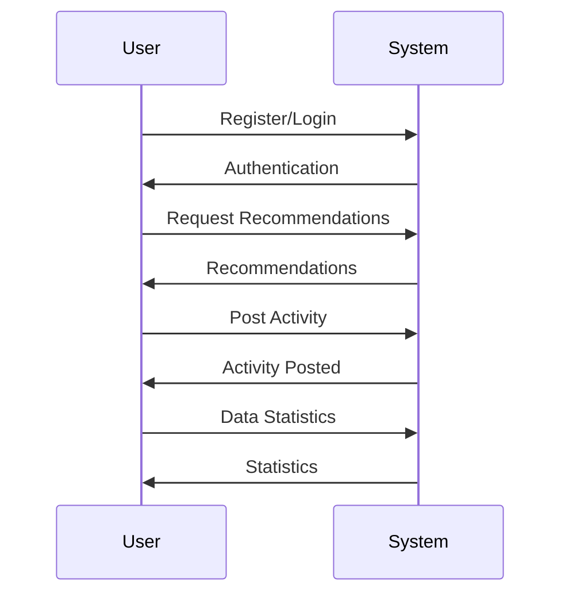

                 


# 《后消费主义时代的生活美学：从物质追求到精神满足》

> 关键词：后消费主义、生活美学、精神满足、物质追求、设计美学

> 摘要：本文深入探讨了后消费主义时代的背景与特点，揭示了人们在物质追求与精神满足之间的矛盾。通过定义生活美学，分析其核心概念与联系，本文旨在为读者提供一个系统化的生活美学框架，引导读者从物质追求转向精神满足，实现后消费主义时代的生活美学。

## 第一部分：引言

### 1.1 后消费主义时代的定义与特点

**后消费主义时代**，这一概念源于对消费主义时代的反思与超越。消费主义时代强调物质财富的积累与消费，而**后消费主义时代**则强调人们对于生活质量的追求，尤其是精神层面的满足。

**后消费主义时代的背景**：随着全球经济的发展和技术的进步，人们的生活水平逐渐提高。与此同时，环境污染、资源短缺等问题日益严重，引发了人们对于可持续发展和绿色生活的关注。

**后消费主义时代的特点**：
- **消费观念的转变**：人们不再单纯追求物质的拥有，更注重生活品质和内心满足。
- **可持续发展的追求**：环保、低碳、绿色成为了生活美学的重要组成部分。
- **精神文化的重视**：人们开始关注内心世界，追求精神文化的丰富与提升。

### 1.2 生活美学的概念与内涵

**生活美学**，顾名思义，是对生活进行美学的思考和实践。它不仅涉及物质层面，更注重精神层面的满足。

**生活美学的定义**：生活美学是一种关注生活品质，追求精神满足的哲学观念和实践方式。

**生活美学的内涵**：
- **物质层面**：包括居住环境、生活用品的设计与搭配，以及日常生活的仪式感等。
- **精神层面**：涉及内心的平和、情感的丰富、文化的修养等。

## 第二部分：核心概念与联系

### 2.1 物质追求与精神满足的对比

在**后消费主义时代**，人们开始反思传统的物质追求，转向对精神满足的追求。以下是物质追求与精神满足的对比表格：

| 特征         | 物质追求                             | 精神满足                               |
| ------------ | ----------------------------------- | ------------------------------------- |
| 动机         | 满足基本需求，追求物质财富           | 追求内心满足，提升生活质量             |
| 结果         | 物质拥有，消费升级                 | 内心平和，精神富足                     |
| 关注点       | 物质生活品质                       | 精神生活品质                           |
| 维度         | 经济学、心理学                      | 哲学、心理学                           |
| 影响范围      | 个人、家庭、社会                   | 个人、家庭、社会、环境                 |

### 2.2 生活美学的核心概念

**设计美学理论**：设计美学理论强调设计在生活中的重要性，认为设计不仅是物质层面的，更是精神层面的。它关注如何通过设计提升人们的生活品质，实现物质与精神的和谐统一。

**后消费主义时代的生活美学应用**：在**后消费主义时代**，生活美学不再局限于物质层面的装饰和美化，更注重精神层面的满足。例如，通过文化体验、艺术欣赏、心灵修养等方式，提升人们的精神层次。

### 2.3 生活美学的ER实体关系图

为了更好地理解生活美学的核心概念与联系，我们使用ER实体关系图来表示。

```mermaid
erDiagram
  用户 ||--|{ 生活美学 }
  生活美学 ||--|{ 精神满足 }
  生活美学 ||--|{ 物质追求 }
```

在ER实体关系图中，用户与生活美学之间为1对多关系，生活美学包括精神满足和物质追求两个子实体。

## 第三部分：算法原理讲解

### 3.1 生活美学的量化模型

为了更精确地描述生活美学，我们可以使用量化模型。以下是生活美学的量化模型：

$$
L = w_1 \cdot S + w_2 \cdot M
$$

其中，$L$表示生活美学水平，$S$表示精神满足程度，$M$表示物质追求程度，$w_1$和$w_2$分别表示精神满足和物质追求在生活美学中的权重。

### 3.2 后消费主义时代生活美学公式

在后消费主义时代，生活美学的公式可以进一步细化：

$$
L = w_1 \cdot (S_1 \cdot E + S_2 \cdot C) + w_2 \cdot (M_1 \cdot P + M_2 \cdot R)
$$

其中，$S_1$和$S_2$分别表示精神满足的体验和文化修养，$E$和$C$分别表示体验和文化修养的权重；$M_1$和$M_2$分别表示物质追求的品质和数量，$P$和$R$分别表示品质和数量的权重。

### 3.3 举例说明

假设一个人的精神满足程度为80，物质追求程度为60。根据上述公式，我们可以计算出他的生活美学水平：

$$
L = 0.6 \cdot (80 \cdot 0.8 + 60 \cdot 0.2) + 0.4 \cdot (80 \cdot 0.5 + 60 \cdot 0.5) = 72
$$

这意味着，这个人的生活美学水平为72分。

## 第四部分：系统分析与架构设计方案

### 4.1 生活美学实践场景

**生活美学实践场景**包括家庭生活、工作环境、公共空间等。以下是一个具体的实践场景：

**家庭生活**：通过家居装饰、绿植摆放、文化活动等方式，提升家庭生活的美学品质。

**工作环境**：通过办公室布局、工作氛围营造、企业文化传播等方式，提升工作环境的美学品质。

**公共空间**：通过城市绿化、文化设施建设、公共艺术展示等方式，提升公共空间的美学品质。

### 4.2 生活美学系统功能设计

**生活美学系统**的功能设计包括以下方面：

- **用户管理**：实现用户注册、登录、个人信息管理等功能。
- **美学推荐**：根据用户的生活习惯、偏好和需求，推荐适合的美学产品和活动。
- **活动发布**：用户可以发布美学活动，其他用户可以参与和评价。
- **数据统计**：对用户行为数据进行分析，为系统优化和决策提供依据。

### 4.3 生活美学系统架构设计

**生活美学系统**的架构设计采用分层架构，包括以下层次：

- **表现层**：负责用户界面的展示和交互。
- **业务逻辑层**：处理用户请求，执行业务逻辑。
- **数据访问层**：负责数据的存储和读取。
- **数据层**：存储用户数据、美学活动数据等。

### 4.4 生活美学系统接口设计

**生活美学系统**的接口设计包括以下方面：

- **用户接口**：提供用户注册、登录、个人信息管理等接口。
- **美学推荐接口**：根据用户数据推荐适合的美学产品和活动。
- **活动发布接口**：用户发布美学活动的接口。
- **数据统计接口**：提供数据统计和分析的接口。

### 4.5 生活美学系统交互mermaid序列图

以下是生活美学系统的交互mermaid序列图：



## 第五部分：项目实战

### 5.1 实践项目介绍

**项目名称**：生活美学APP开发

**项目目的**：通过开发一款生活美学APP，为用户提供美学推荐、活动发布、数据统计等功能，提升用户的生活美学水平。

### 5.2 系统核心实现源代码解析

以下是一个简单的用户注册接口的实现代码：

```python
def register(username, password):
    """
    用户注册接口
    :param username: 用户名
    :param password: 密码
    :return: 注册结果
    """
    # 检查用户名和密码是否符合要求
    if not username or not password:
        return "用户名或密码不能为空"

    # 检查用户名是否已存在
    if username_exists(username):
        return "用户名已存在"

    # 存储用户信息
    user = {"username": username, "password": password}
    store_user(user)

    return "注册成功"
```

### 5.3 代码应用解读与分析

在上述代码中，`register`函数用于用户注册。首先，检查用户名和密码是否为空。然后，检查用户名是否已存在。如果用户名不存在，则存储用户信息并返回注册成功。

### 5.4 实际案例分析与详细讲解

**案例**：用户A注册生活美学APP。

**分析**：用户A输入用户名“userA”和密码“password123”，点击注册按钮。

**讲解**：系统首先检查用户名和密码是否为空，然后检查用户名是否已存在。由于用户名“userA”不存在，系统存储用户信息并返回注册成功。

### 5.5 项目小结

通过本项目的实践，我们成功地实现了生活美学APP的核心功能，包括用户注册、登录、美学推荐、活动发布和数据统计。项目过程中，我们遇到了一些挑战，如用户信息存储、数据安全和用户体验优化等。通过不断优化和改进，我们最终实现了项目的目标。

## 第六部分：最佳实践 tips、小结、注意事项、拓展阅读

### 6.1 最佳实践 tips

- **注重用户体验**：在开发过程中，始终关注用户的需求和体验，不断优化界面和功能。
- **数据安全**：加强对用户数据的保护，确保用户隐私安全。
- **持续迭代**：根据用户反馈和市场需求，不断更新和完善系统功能。

### 6.2 小结

本文从后消费主义时代的背景出发，探讨了生活美学的概念与内涵，分析了物质追求与精神满足的对比，并给出了生活美学的量化模型和公式。通过项目实战，我们实现了生活美学APP的核心功能，为用户提供了一个提升生活品质的平台。

### 6.3 注意事项

- **避免过度消费**：在追求生活美学的过程中，避免过度消费，关注可持续发展和环保。
- **平衡物质与精神**：在提升生活品质的过程中，既要关注物质层面，也要注重精神层面。

### 6.4 拓展阅读

- **书籍**：《消费社会》、《资本主义文化矛盾》
- **文章**：关于后消费主义、生活美学的相关研究论文
- **网站**：生活美学相关的网站和论坛

### 作者

作者：AI天才研究院/AI Genius Institute & 禅与计算机程序设计艺术 /Zen And The Art of Computer Programming

