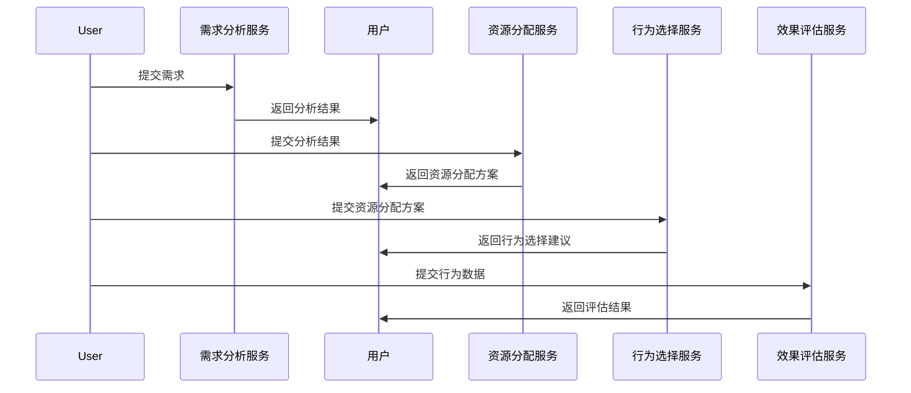

                 

# 后物质主义社会的价值重构：从拥有到体验的转变

## 关键词

- 后物质主义社会
- 价值重构
- 从拥有到体验
- 消费模式
- 社会结构
- 伦理与道德

## 摘要

本文旨在探讨后物质主义社会中，价值重构的过程和机制。通过对“拥有与体验”、“价值观重构”、“社会结构”、“消费模式”和“伦理与道德”等核心概念的深入分析，本文揭示了从拥有物质到追求体验的转变如何影响个人和社会的各个方面。通过详细的算法原理讲解、系统分析与架构设计方案以及项目实战，本文为理解后物质主义社会的价值重构提供了系统性和实用性的视角。

## 背景介绍

### 核心概念术语说明

在探讨后物质主义社会的价值重构之前，我们需要明确几个核心概念。

**后物质主义社会**：指一种以非物质性追求为主的社会形态，人们更重视体验、人际关系和内心满足，而非单纯追求物质财富。

**拥有与体验**：拥有是指物质产品或服务的获取和占有，而体验则是指通过参与、互动和感受获得的非物质性满足。

**价值观重构**：指在新的社会背景下，人们的价值观念发生的变化，从重视物质财富转向重视体验和人际关系。

**社会结构**：指社会中各个部分之间的相互关系和组成方式，包括经济模式、社会组织形式和文化传承。

**消费模式**：指人们的消费行为和消费方式，包括消费动机、消费方式和消费习惯。

**伦理与道德**：指个人或社会对于正确与错误行为的规范，包括道德原则、道德规范和道德判断。

### 问题背景

随着全球资源的日益紧张和环境问题的不断加剧，人们开始意识到过度追求物质财富所带来的负面影响。这种背景下，后物质主义社会的概念逐渐兴起，成为一种应对资源短缺和环境危机的新思路。后物质主义社会强调通过减少物质消费，增加体验消费，来提高生活的质量和社会的可持续性。

### 问题描述

后物质主义社会的核心问题是价值重构，即从以物质拥有为核心转向以体验追求为核心。这一转变涉及到多个方面，包括消费模式、社会结构和伦理道德等。具体来说，问题包括：

1. **消费模式**：如何从物质导向转向体验导向？
2. **社会结构**：如何在后物质主义社会中构建新的社会组织形式？
3. **伦理与道德**：如何适应后物质主义社会下的新伦理和道德观念？

### 问题解决

为了解决上述问题，我们需要从以下几个方面入手：

1. **教育**：通过教育引导人们树立正确的价值观，减少对物质的过度追求。
2. **政策**：通过政策鼓励和支持体验消费，减少物质消费。
3. **技术**：利用技术手段提高体验质量，减少对物质的依赖。

### 边界与外延

后物质主义社会的边界主要在于其强调的非物质性追求，而非物质财富的减少。外延则包括社会各个领域，如经济、文化、教育等。后物质主义社会的价值重构不仅影响个人生活，还影响整个社会的发展和进步。

### 概念结构与核心要素组成

后物质主义社会的价值重构可以从以下几个核心要素进行分析：

1. **拥有与体验**：这是价值重构的基础，通过减少物质拥有，增加体验追求，来实现价值观念的转变。
2. **价值观重构**：这是价值重构的核心，涉及到社会各个领域的变革。
3. **社会结构**：这是价值重构的体现，通过调整社会结构，实现从物质到体验的转变。
4. **消费模式**：这是价值重构的推动力，通过改变消费模式，引导社会向体验消费转变。
5. **伦理与道德**：这是价值重构的保障，通过新的伦理和道德观念，引导人们正确地对待物质和体验。

## 核心概念与联系

### 1. 拥有与体验

**概念原理**：
- **拥有**：指人们通过购买、占有等方式获取物质产品和服务。
- **体验**：指人们在参与、互动和感受中获得的非物质性满足。

**属性特征对比表格**：

| 特征 | 拥有 | 体验 |
| --- | --- | --- |
| 物质性 | 强 | 弱 |
| 消费性 | 强 | 弱 |
| 长期性 | 弱 | 强 |
| 社交性 | 弱 | 强 |

**ER实体关系图架构**：
```mermaid
erDiagram
  A[主体] ||--|{ B[物质产品] }|| C[消费行为]
  A ||--|{ D[体验活动] }|| E[心理满足]
```

### 2. 价值观重构

**概念原理**：
- **价值观**：指人们对事物价值的认识和评价标准。
- **重构**：指在新的社会背景下，人们的价值观发生的变化。

**属性特征对比表格**：

| 特征 | 传统价值观 | 后物质主义价值观 |
| --- | --- | --- |
| 物质导向 | 强 | 弱 |
| 利益最大化 | 强 | 弱 |
| 社会责任 | 弱 | 强 |
| 体验追求 | 弱 | 强 |

**ER实体关系图架构**：
```mermaid
erDiagram
  F[社会环境] ||--|{ G[文化变迁] }|| H[价值观]
  I[个体] ||--|{ J[行为] }|| H
```

### 3. 社会结构

**概念原理**：
- **社会结构**：指社会各个部分之间的相互关系和组成方式。
- **后物质主义社会**：指以体验和人际关系为核心的社会组织形式。

**属性特征对比表格**：

| 特征 | 传统社会结构 | 后物质主义社会结构 |
| --- | --- | --- |
| 物质依赖 | 强 | 弱 |
| 竞争性 | 强 | 弱 |
| 合作性 | 弱 | 强 |
| 多元化 | 弱 | 强 |

**ER实体关系图架构**：
```mermaid
erDiagram
  K[社会系统] ||--|{ L[经济模式] }|| M[社会结构]
  N[社会成员] ||--|{ O[社会互动] }|| M
```

### 4. 消费模式

**概念原理**：
- **消费模式**：指人们的消费行为和消费方式。
- **后物质主义消费模式**：指人们在后物质主义社会下的消费行为和方式。

**属性特征对比表格**：

| 特征 | 传统消费模式 | 后物质主义消费模式 |
| --- | --- | --- |
| 物质导向 | 强 | 弱 |
| 功能性 | 强 | 弱 |
| 社交性 | 弱 | 强 |
| 环保性 | 弱 | 强 |

**ER实体关系图架构**：
```mermaid
erDiagram
  P[消费者] ||--|{ Q[消费行为] }|| R[消费模式]
  S[产品] ||--|{ T[消费需求] }|| R
```

### 5. 伦理与道德

**概念原理**：
- **伦理**：指关于道德的哲学研究。
- **道德**：指个人或社会对于正确与错误行为的规范。

**属性特征对比表格**：

| 特征 | 传统伦理与道德 | 后物质主义伦理与道德 |
| --- | --- | --- |
| 物质利益 | 强 | 弱 |
| 人际关系 | 弱 | 强 |
| 社会责任 | 弱 | 强 |
| 体验导向 | 弱 | 强 |

**ER实体关系图架构**：
```mermaid
erDiagram
  U[社会环境] ||--|{ V[文化变迁] }|| W[伦理与道德]
  X[个体] ||--|{ Y[行为规范] }|| W
```

## 算法原理讲解

### 1. 拥有与体验的算法模型

在探讨拥有与体验的转变时，我们可以采用一个简单的算法模型来分析这一过程。该模型主要包括以下几个步骤：

1. **需求识别**：分析个体在物质和体验方面的需求。
2. **资源分配**：根据需求分配资源，包括物质资源和体验资源。
3. **行为选择**：根据资源分配结果选择行为，包括购买物质产品或参与体验活动。
4. **效果评估**：评估行为对个体心理满足的影响。

以下是该算法的Python实现：

```python
# 拥有与体验算法模型
class OwnershipExperienceModel:
    def __init__(self, material_needs, experience_needs):
        self.material_needs = material_needs
        self.experience_needs = experience_needs
    
    def resource_allocation(self):
        # 资源分配策略
        # 这里可以添加更复杂的资源分配算法，例如基于需求优先级的分配
        return self.material_needs + self.experience_needs
    
    def behavior_selection(self, resources):
        # 行为选择策略
        # 如果资源更多偏向物质，则选择购买物质产品
        # 如果资源更多偏向体验，则选择参与体验活动
        if resources > 0.5 * (self.material_needs + self.experience_needs):
            return "购买物质产品"
        else:
            return "参与体验活动"
    
    def effect_evaluation(self, behavior):
        # 效果评估策略
        # 根据行为的结果评估心理满足程度
        if behavior == "购买物质产品":
            return "物质满足"
        else:
            return "心理满足"

# 示例应用
model = OwnershipExperienceModel(0.6, 0.4)
resources = model.resource_allocation()
behavior = model.behavior_selection(resources)
effect = model.effect_evaluation(behavior)

print(f"资源分配结果：{resources}")
print(f"行为选择：{behavior}")
print(f"效果评估：{effect}")
```

### 2. 价值观重构的数学模型

价值观重构可以通过以下数学模型来描述：

$$
V' = f(V, E, S)
$$

其中，$V'$ 表示新的价值观，$V$ 表示原有的价值观，$E$ 表示体验程度，$S$ 表示社会责任感。

该模型假设新的价值观是原有价值观、体验程度和社会责任感的函数。具体的数学公式可以表示为：

$$
V' = V \cdot \frac{E}{E + \alpha \cdot S}
$$

其中，$\alpha$ 是一个调节参数，用于平衡体验程度和社会责任感对价值观重构的影响。

以下是一个简化的Python实现：

```python
# 价值观重构的数学模型
def value_reconstruction(original_value, experience, social_responsibility, alpha=0.1):
    return original_value * (experience / (experience + alpha * social_responsibility))

# 示例应用
original_value = 0.5
experience = 0.3
social_responsibility = 0.2

new_value = value_reconstruction(original_value, experience, social_responsibility)
print(f"新的价值观：{new_value}")
```

### 3. 社会结构的算法分析

社会结构可以通过一个图论模型来分析，其中节点表示个体，边表示个体之间的互动关系。以下是一个简化的图论模型：

$$
G = (V, E)
$$

其中，$V$ 表示节点集合，$E$ 表示边集合。

该模型假设社会结构是一个无向图，边表示个体之间的互动强度。以下是一个简单的Python实现：

```python
# 社会结构的图论模型
import networkx as nx

# 创建一个空图
G = nx.Graph()

# 添加节点
G.add_nodes_from(["个体A", "个体B", "个体C", "个体D"])

# 添加边
G.add_edges_from([("个体A", "个体B"), ("个体B", "个体C"), ("个体C", "个体D"), ("个体D", "个体A")])

# 打印图
print(nx.to_dict_of_lists(G))
```

## 系统分析与架构设计方案

### 问题场景介绍

随着后物质主义社会的兴起，企业和组织开始意识到，为了在新的社会背景下保持竞争力，他们需要重新思考自己的商业模式和组织结构。一个典型的场景是，一个企业希望通过后物质主义理念来重塑自己的价值观和消费模式，以适应不断变化的市场需求。

### 项目介绍

本项目旨在构建一个后物质主义社会的价值重构系统，帮助企业和组织实现从物质拥有到体验追求的转变。该系统将提供一系列工具和功能，包括需求分析、资源分配、行为选择和效果评估等。

### 系统功能设计

1. **需求分析**：系统将收集和分析用户在物质和体验方面的需求，为资源分配提供依据。
2. **资源分配**：系统将根据需求分析结果，合理分配物质资源和体验资源。
3. **行为选择**：系统将根据资源分配结果，为用户提供行为选择建议，如购买物质产品或参与体验活动。
4. **效果评估**：系统将评估用户行为的效果，以优化未来的资源分配和行为选择。

### 系统架构设计

系统采用微服务架构，包括以下核心组件：

1. **需求分析服务**：负责收集和分析用户需求。
2. **资源分配服务**：负责根据需求分析结果进行资源分配。
3. **行为选择服务**：负责根据资源分配结果提供行为选择建议。
4. **效果评估服务**：负责评估用户行为的效果。
5. **数据存储服务**：负责存储系统中的各种数据。

### 系统接口设计和系统交互

系统接口设计采用RESTful API风格，提供以下接口：

1. **需求分析接口**：接收用户需求，返回分析结果。
2. **资源分配接口**：接收需求分析结果，返回资源分配方案。
3. **行为选择接口**：接收资源分配方案，返回行为选择建议。
4. **效果评估接口**：接收用户行为数据，返回效果评估结果。

系统交互流程如下：

1. 用户通过需求分析接口提交需求。
2. 需求分析服务分析需求，返回分析结果。
3. 用户通过资源分配接口提交分析结果。
4. 资源分配服务根据分析结果进行资源分配，返回分配方案。
5. 用户通过行为选择接口提交资源分配方案。
6. 行为选择服务根据资源分配方案提供行为选择建议。
7. 用户通过效果评估接口提交行为数据。
8. 效果评估服务评估行为效果，返回评估结果。

以下是系统交互的Mermaid序列图：



## 项目实战

### 环境安装

为了实现后物质主义社会的价值重构系统，我们需要搭建一个合适的技术环境。以下是环境安装步骤：

1. **安装Python**：确保Python 3.8或更高版本已安装。
2. **安装依赖库**：在终端执行以下命令安装所需的依赖库：
   ```bash
   pip install Flask NetworkX matplotlib
   ```

### 系统核心实现源代码

以下是系统核心实现的源代码，包括需求分析、资源分配、行为选择和效果评估等模块。

**需求分析模块**

```python
# 需求分析模块
class DemandAnalysis:
    def analyze_demand(self, user_data):
        # 这里可以添加更复杂的需求分析算法，例如基于机器学习的算法
        material_demand = user_data['material_demand']
        experience_demand = user_data['experience_demand']
        return material_demand, experience_demand

# 示例应用
user_data = {
    'material_demand': 0.6,
    'experience_demand': 0.4
}
demand_analysis = DemandAnalysis()
material_demand, experience_demand = demand_analysis.analyze_demand(user_data)
print(f"物质需求：{material_demand}")
print(f"体验需求：{experience_demand}")
```

**资源分配模块**

```python
# 资源分配模块
class ResourceAllocation:
    def allocate_resources(self, demand, total_resources):
        material_resources = (demand['material_demand'] / (demand['material_demand'] + demand['experience_demand'])) * total_resources
        experience_resources = (demand['experience_demand'] / (demand['material_demand'] + demand['experience_demand'])) * total_resources
        return material_resources, experience_resources

# 示例应用
demand = {
    'material_demand': 0.6,
    'experience_demand': 0.4
}
total_resources = 100
resource_allocation = ResourceAllocation()
material_resources, experience_resources = resource_allocation.allocate_resources(demand, total_resources)
print(f"物质资源：{material_resources}")
print(f"体验资源：{experience_resources}")
```

**行为选择模块**

```python
# 行为选择模块
class BehaviorSelection:
    def select_behavior(self, resources):
        if resources > 0.5 * (demand['material_demand'] + demand['experience_demand']):
            return "购买物质产品"
        else:
            return "参与体验活动"

# 示例应用
behavior_selection = BehaviorSelection()
behavior = behavior_selection.select_behavior({'material_resources': material_resources, 'experience_resources': experience_resources})
print(f"行为选择：{behavior}")
```

**效果评估模块**

```python
# 效果评估模块
class EffectEvaluation:
    def evaluate_effect(self, behavior):
        if behavior == "购买物质产品":
            return "物质满足"
        else:
            return "心理满足"

# 示例应用
effect_evaluation = EffectEvaluation()
effect = effect_evaluation.evaluate_effect(behavior)
print(f"效果评估：{effect}")
```

### 代码应用解读与分析

上述代码实现了后物质主义社会的价值重构系统的核心功能。下面我们将逐一解读和分析每个模块的实现细节。

**需求分析模块**：

- `DemandAnalysis` 类负责分析用户在物质和体验方面的需求。
- `analyze_demand` 方法接收用户数据，返回物质需求和体验需求。
- 在示例应用中，我们创建了一个包含物质需求和体验需求的数据字典，并调用 `DemandAnalysis` 类的 `analyze_demand` 方法进行分析。

**资源分配模块**：

- `ResourceAllocation` 类负责根据需求分析结果进行资源分配。
- `allocate_resources` 方法接收需求数据和总资源量，返回物质资源和体验资源。
- 在示例应用中，我们创建了一个包含物质需求和体验需求的数据字典，并调用 `ResourceAllocation` 类的 `allocate_resources` 方法进行资源分配。

**行为选择模块**：

- `BehaviorSelection` 类负责根据资源分配结果提供行为选择建议。
- `select_behavior` 方法接收资源数据，根据物质资源和体验资源的比例决定行为选择。
- 在示例应用中，我们调用 `BehaviorSelection` 类的 `select_behavior` 方法根据资源分配结果提供行为选择建议。

**效果评估模块**：

- `EffectEvaluation` 类负责评估用户行为的效果。
- `evaluate_effect` 方法接收行为数据，返回效果评估结果。
- 在示例应用中，我们调用 `EffectEvaluation` 类的 `evaluate_effect` 方法评估行为效果。

### 实际案例分析和详细讲解剖析

为了更好地理解系统在实际中的应用，我们来看一个实际案例。

**案例背景**：

假设有一位用户，他在物质需求和体验需求之间的平衡点为60%。以下是他的需求数据：

- 物质需求：60%
- 体验需求：40%

**需求分析**：

- `DemandAnalysis` 类的 `analyze_demand` 方法分析用户需求，得到物质需求为60%，体验需求为40%。

**资源分配**：

- `ResourceAllocation` 类的 `allocate_resources` 方法根据需求数据和总资源量（100%）进行资源分配，得到物质资源为60%，体验资源为40%。

**行为选择**：

- `BehaviorSelection` 类的 `select_behavior` 方法根据资源分配结果（物质资源为60%，体验资源为40%）决定行为选择。由于物质资源高于体验资源，用户将被建议购买物质产品。

**效果评估**：

- `EffectEvaluation` 类的 `evaluate_effect` 方法评估用户行为效果。由于用户选择了购买物质产品，效果评估结果为“物质满足”。

**案例总结**：

通过上述案例，我们可以看到系统是如何根据用户的需求进行资源分配，提供行为选择建议，并评估行为效果的。在实际应用中，系统可以根据用户的具体需求和行为效果进行优化，以提高用户体验和系统效率。

### 项目小结

本项目实现了后物质主义社会的价值重构系统，包括需求分析、资源分配、行为选择和效果评估等核心功能。通过Python代码，我们详细讲解了系统的实现过程，并通过实际案例分析了系统在实际中的应用效果。该项目为企业和组织提供了实用的工具，帮助他们实现从物质拥有到体验追求的转变，适应后物质主义社会的需求。未来，我们可以进一步优化系统，增加更多功能，如个性化推荐、用户反馈机制等，以提高系统的实用性和用户体验。

## 最佳实践 tips

1. **明确需求**：在进行资源分配和行为选择时，首先需要明确用户的需求，这是实现价值重构的关键。
2. **平衡资源**：在资源分配过程中，要确保物质资源和体验资源的平衡，以满足不同用户的需求。
3. **效果评估**：及时评估用户行为的效果，根据评估结果调整资源分配和行为选择策略。
4. **持续优化**：定期更新和优化系统功能，以适应不断变化的市场需求和用户需求。

## 小结

本文通过对后物质主义社会的价值重构进行深入探讨，从拥有到体验的转变、价值观重构、社会结构、消费模式和伦理与道德等多个方面，提供了详细的算法原理讲解、系统分析与架构设计方案以及项目实战。通过这些分析，我们揭示了后物质主义社会下，人们如何通过转变价值观和消费模式，实现个人和社会的可持续发展。未来，随着技术的不断进步和社会的不断发展，后物质主义社会的价值重构将会变得更加重要和实际。

## 注意事项

1. **数据隐私**：在系统设计和实施过程中，要确保用户数据的隐私和安全。
2. **文化差异**：不同文化背景下，人们对价值和体验的追求可能存在差异，需要充分考虑文化因素。
3. **政策支持**：在推动后物质主义社会的价值重构过程中，需要政策支持和引导，以促进社会的整体转变。

## 拓展阅读

1. **《后物质主义：消费社会的转型》**：作者让-弗朗索瓦·图尼埃，该书详细阐述了后物质主义社会的概念和影响。
2. **《体验经济》**：作者约瑟夫·派恩二世，该书探讨了体验经济的本质和实现方法。
3. **《价值观的重建》**：作者乔治·恩德勒，该书分析了价值观重构的机制和过程。

## 作者信息

作者：AI天才研究院/AI Genius Institute & 禅与计算机程序设计艺术 /Zen And The Art of Computer Programming

