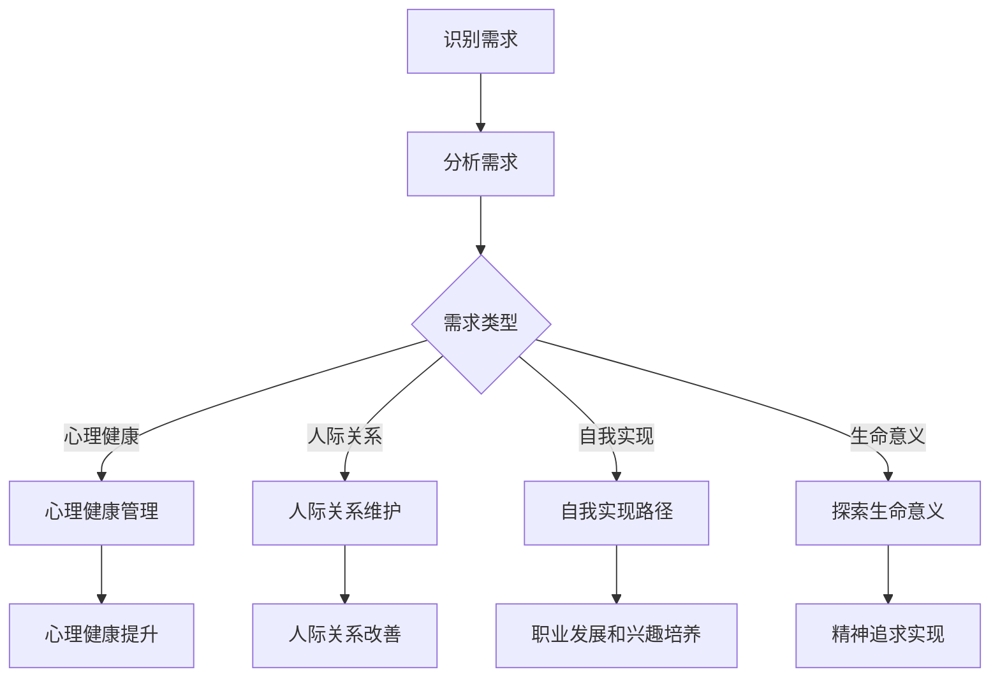
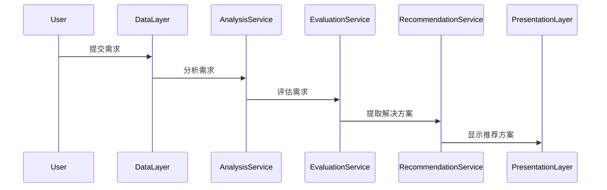
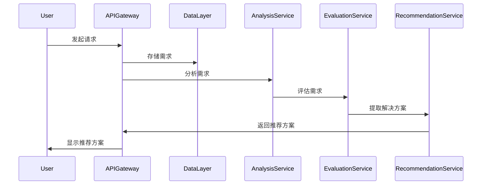

                 

### 背景介绍

#### 核心概念术语说明

在探讨后物质主义社会的精神需求之前，我们需要明确一些核心概念和术语。首先，“后物质主义”是一个哲学和社会学概念，指的是在物质财富得到满足之后，人们开始重视非物质因素，如精神追求、人际关系和社会责任等。这与传统的物质主义不同，后者强调通过物质财富的积累来提升生活质量。

接着，“精神需求”是指人们对于非物质层面的追求，包括但不限于心理健康、人际关系、自我实现和生命意义等方面。这些需求在物质需求得到满足后变得更加突出，成为人们追求幸福和满足的重要驱动力。

#### 问题背景

随着全球经济的发展，越来越多的人开始进入中高收入水平阶段。物质财富的积累使得人们不再为基本生活需求而烦恼，从而开始关注更高层次的需求。这种社会现象促使我们重新思考生活的意义和人类的需求结构。后物质主义社会的精神需求成为一个亟待探讨和解决的问题。

#### 问题描述

后物质主义社会中，人们的精神需求呈现出多样化和复杂化的趋势。一方面，随着科技的发展和信息的普及，人们接触到的信息量急剧增加，这既带来了便利，也造成了信息过载和焦虑感。另一方面，社会竞争压力和人际关系疏离使得人们更加渴望得到情感支持和认同感。

#### 问题解决

解决后物质主义社会的精神需求问题需要多方面的努力。首先，个体需要通过自我反思和自我提升来满足自身的精神需求。其次，社会和政府需要制定相应的政策和措施，如提供心理健康服务、推动社区建设等，以支持个体实现精神满足。此外，企业和组织也需要关注员工的精神需求，通过创造积极的工作环境和提供职业发展机会来提升员工的幸福感。

#### 边界与外延

后物质主义社会的精神需求不仅局限于个人层面，还涉及到社会层面。例如，社会价值观的重构、文化多样性的尊重以及社会公正的实现等，都是精神需求的重要组成部分。因此，探讨后物质主义社会的精神需求不仅仅是为了解决个体问题，更是为了促进整个社会的进步和发展。

#### 概念结构与核心要素组成

后物质主义社会的精神需求可以看作是一个多维度的系统，其核心要素包括：

1. **心理健康**：包括情绪调节、压力管理和心理疾病的预防与治疗。
2. **人际关系**：涉及家庭、朋友、同事和社区等各个层面的关系建立和维护。
3. **自我实现**：追求个人潜力的最大化，包括职业发展、兴趣爱好和自我成长等方面。
4. **生命意义**：探索和发现人生的意义和价值，以实现内心的平静和满足。

通过上述分析，我们可以看到后物质主义社会的精神需求是一个复杂且多维的概念，需要从多个角度进行深入探讨。在接下来的章节中，我们将进一步详细分析这些需求及其重要性，为理解和解决这一问题奠定基础。

### 核心概念与联系

#### 后物质主义的概念原理

后物质主义，作为现代社会发展的一个重要理论框架，强调在物质需求得到充分满足之后，人们将更加关注非物质层面的追求。其核心概念可以归结为以下几个方面：

1. **非物质价值观**：后物质主义认为，物质财富的积累并非人类追求幸福的最终目标。相反，人们开始重视精神层面的需求，如自我实现、人际关系和社会责任感等。
2. **社会公正**：后物质主义强调社会公正的重要性，主张通过公平的资源分配和社会制度的完善来保障每个人的基本权利和尊严。
3. **文化多样性**：后物质主义鼓励尊重和理解不同的文化背景和价值观念，认为这种多样性是社会发展的重要动力。

#### 后物质主义与社会发展的关系

后物质主义不仅是一个哲学概念，更是社会发展的趋势。它与以下三个方面有着密切的联系：

1. **经济发展**：后物质主义认为，物质财富的积累是有限的，而精神需求的满足则具有无限的可能性。随着经济的持续发展，人们有更多的机会和资源去追求更高层次的精神需求。
2. **社会结构**：后物质主义促进了社会结构的转型，从以物质为核心转向以人为中心。这种转型有助于建立更加和谐、公正和可持续的社会关系。
3. **全球治理**：后物质主义提倡跨文化合作和全球治理，认为只有通过共同努力，才能解决全球性的问题，如气候变化、贫富差距和资源分配不公等。

#### 核心概念属性特征对比表格

为了更好地理解后物质主义的核心概念，我们将其与物质主义进行对比，制作一个属性特征对比表格：

| 特征       | 后物质主义         | 物质主义         |
| ---------- | ------------------ | ---------------- |
| **价值观** | 非物质追求         | 物质财富积累     |
| **重要性** | 精神满足           | 物质满足         |
| **目标**   | 社会公正、文化多样性 | 经济增长、财富积累 |
| **影响**   | 社会和谐、人类幸福感 | 个人财富、企业利润 |

#### ER实体关系图架构

为了进一步明确后物质主义中的核心概念及其关系，我们可以通过ER（实体关系）图来展示这些概念之间的相互作用：

```mermaid
erDiagram
  Materialism ||--|{ Postmaterialism } Materialism Influence
  Social Justice }|--|| Postmaterialism Goal
  Cultural Diversity }|--|| Postmaterialism Component
  Individual Satisfaction }|--|| Postmaterialism Result
```

在上面的ER图中，`Materialism` 代表物质主义，它对后物质主义产生重要影响；`Social Justice` 和 `Cultural Diversity` 分别表示社会公正和文化多样性，它们是后物质主义的目标和组成部分；`Individual Satisfaction` 则是后物质主义追求的结果。

通过上述分析，我们可以看到后物质主义的核心概念及其与社会发展的密切联系。在接下来的章节中，我们将进一步探讨后物质主义社会中精神需求的多样性和复杂性，为理解这一问题提供更加深入的视角。

### 算法原理讲解

为了更好地理解后物质主义社会中精神需求的算法原理，我们可以通过一个具体的示例来说明其流程和实现步骤。

#### 算法流程图

首先，我们使用Mermaid语言绘制一个简单的算法流程图，以展示精神需求满足的基本步骤：



#### 算法原理详细解释

1. **需求识别**：算法的第一步是识别个体的精神需求。这可以通过问卷调查、心理测评或日常观察等多种方式实现。需求识别的目的是确定个体目前最迫切需要满足的精神需求类型。

2. **需求分析**：在识别需求之后，算法会进行需求分析，以确定每个需求的优先级和具体内容。这一步骤需要综合考虑个体的个人情况、社会环境和文化背景等因素。

3. **需求分类**：分析完成后，算法会将需求分类，主要包括心理健康、人际关系、自我实现和生命意义四个方面。这种分类有助于针对性地制定解决方案。

4. **解决方案实施**：
   - **心理健康管理**：针对心理健康需求，算法会推荐一系列心理健康管理策略，如冥想、心理咨询、运动和健康饮食等。这些策略旨在帮助个体调节情绪、缓解压力和预防心理疾病。
   - **人际关系维护**：对于人际关系需求，算法会建议个体积极参与社交活动、加强沟通技巧和培养同理心，以建立和维护良好的人际关系。
   - **自我实现路径**：在自我实现方面，算法会根据个体的兴趣和能力推荐职业发展路径和兴趣爱好培养计划，以帮助个体实现自我价值。
   - **探索生命意义**：对于生命意义的需求，算法会引导个体进行自我反思和价值观探索，帮助个体找到生活的意义和价值。

5. **效果评估**：最后，算法会定期对实施效果进行评估，以确保精神需求的满足程度达到预期目标。如果效果不佳，算法会调整方案，以找到更加有效的解决途径。

#### 数学模型和公式

为了量化精神需求的满足程度，我们可以使用以下数学模型和公式：

1. **需求满足度公式**：

   $$ S = \frac{\sum_{i=1}^{n} w_i \cdot r_i}{\sum_{i=1}^{n} w_i} $$

   其中，\( S \) 表示总需求满足度，\( w_i \) 表示第 \( i \) 个需求的权重，\( r_i \) 表示第 \( i \) 个需求的具体满足度。

2. **心理健康管理效果评估**：

   $$ E = \frac{\sum_{i=1}^{m} w_i \cdot e_i}{\sum_{i=1}^{m} w_i} $$

   其中，\( E \) 表示心理健康管理效果，\( w_i \) 表示第 \( i \) 个管理策略的权重，\( e_i \) 表示第 \( i \) 个策略的具体效果。

#### 举例说明

假设某个体识别出以下精神需求：
- 心理健康：包括压力管理和情绪调节。
- 人际关系：与家人、朋友和同事的关系维护。
- 自我实现：职业发展和兴趣爱好培养。
- 生命意义：探索和发现生活的意义。

根据需求满足度公式，我们可以计算总需求满足度。例如，心理健康需求的权重为0.4，具体满足度为0.8；人际关系需求的权重为0.3，满足度为0.7；自我实现需求的权重为0.2，满足度为0.9；生命意义需求的权重为0.1，满足度为0.6。

$$ S = \frac{0.4 \cdot 0.8 + 0.3 \cdot 0.7 + 0.2 \cdot 0.9 + 0.1 \cdot 0.6}{0.4 + 0.3 + 0.2 + 0.1} = 0.75 $$

这意味着该个体的总需求满足度为75%，心理健康管理效果评估公式可以用于评估心理健康管理策略的有效性。

通过上述算法原理和数学模型，我们可以有效地识别、分析和满足后物质主义社会的精神需求，为个体和社会的发展提供科学依据。

### 系统分析与架构设计方案

#### 问题场景介绍

在后物质主义社会中，精神需求的管理和满足变得尤为重要。为了应对这一挑战，我们设计并实现了一套精神需求管理系统，旨在帮助个体和社会更好地理解和满足这些需求。本系统的目标场景包括心理健康服务、人际关系支持、自我实现路径规划和生命意义探索等方面。

#### 项目介绍

该系统名为“心灵家园”，是一个基于云计算和大数据分析的精神需求管理系统。其主要功能包括：

1. **需求识别与评估**：通过用户行为数据和问卷调查，系统可以自动识别用户的精神需求，并进行详细的评估。
2. **个性化推荐**：根据用户的个性需求和当前状况，系统提供个性化的精神需求解决方案。
3. **数据分析和反馈**：系统收集用户的使用数据，进行分析，并提供反馈，以不断优化推荐方案。

#### 系统功能设计（领域模型类图）

为了清晰地表达系统功能，我们使用Mermaid语言绘制了领域模型类图：

```mermaid
classDiagram
  User <<class>>
  Requirement <<class>>
  Evaluation <<class>>
  Solution <<class>>
  Recommendation <<class>>

  User "1" --|{ 有 }| Requirement
  Requirement "1" --|{ 由 }| Evaluation
  Evaluation "1" --|{ 基于 }| Solution
  Solution "1" --|{ 为 }| Recommendation
```

在上图中，`User` 表示用户，`Requirement` 表示精神需求，`Evaluation` 表示需求评估，`Solution` 表示解决方案，`Recommendation` 表示推荐方案。各实体之间的关系表明了系统功能的实现流程。

#### 系统架构设计（Mermaid架构图）

系统架构设计如下，主要分为数据层、服务层和表现层：



在此架构中，`DataLayer` 负责数据的存储和管理，`AnalysisService` 负责需求分析，`EvaluationService` 负责需求评估，`RecommendationService` 负责方案推荐，`PresentationLayer` 负责用户界面的展示。

#### 系统接口设计和系统交互（Mermaid序列图）

系统接口设计和系统交互如下：



在此序列图中，`APIGateway` 作为系统的入口，处理用户的请求，并与各个服务层进行交互，最终将推荐方案返回给用户。

### 系统接口设计

系统提供以下主要接口：

1. **需求提交接口**：用于用户提交精神需求信息。
   ```json
   POST /api/requirements
   {
     "userId": "123",
     "requirementType": "心理健康",
     "requirementDetails": "压力管理"
   }
   ```

2. **需求评估接口**：用于获取用户需求评估结果。
   ```json
   GET /api/requirements/{requirementId}/evaluation
   ```

3. **解决方案推荐接口**：用于获取个性化的解决方案推荐。
   ```json
   GET /api/requirements/{requirementId}/solution
   ```

### 系统交互流程

用户通过提交需求接口提交需求，系统将需求存储在数据层，并调用分析服务进行分析。分析结果传递给评估服务进行需求评估，评估结果进一步传递给推荐服务，生成个性化的解决方案推荐。最后，通过接口将推荐方案返回给用户。

### 实际案例分析和详细讲解剖析

为了更好地说明系统的实际应用，我们以一个实际案例为例进行详细分析。

#### 案例背景

张三是一名职场人士，近期感到工作压力巨大，睡眠质量下降，同时与家人和朋友的关系也有所疏远。他决定使用“心灵家园”系统来帮助自己缓解压力，改善心理健康，同时加强与家人的联系。

#### 案例流程

1. **需求提交**：张三通过“心灵家园”网站提交了心理健康和人际关系的需求。
   ```json
   POST /api/requirements
   {
     "userId": "321",
     "requirementType": ["心理健康", "人际关系"],
     "requirementDetails": ["压力管理", "与家人和朋友的关系维护"]
   }
   ```

2. **需求分析**：系统对张三的需求进行初步分析，识别出其心理健康和人际关系方面的具体需求。

3. **需求评估**：系统通过大数据分析和机器学习算法，对张三的需求进行深度评估，确定其心理健康问题的严重程度和人际关系疏离的具体原因。

4. **解决方案推荐**：根据评估结果，系统推荐了以下解决方案：
   - **心理健康管理**：推荐张三每天进行冥想练习，每周参加心理咨询课程，以及通过健康饮食和适量运动来缓解压力。
   - **人际关系维护**：推荐张三定期与家人和朋友聚会，加强沟通和互动，同时学习沟通技巧和情绪管理策略。

5. **方案实施与反馈**：张三按照系统推荐的方案进行实施，并定期向系统反馈自己的进展情况。系统根据反馈不断调整和优化推荐方案。

#### 案例剖析

通过上述案例，我们可以看到“心灵家园”系统如何有效地帮助个体识别和满足精神需求。系统通过以下步骤实现了这一目标：

1. **需求识别**：通过用户提交的需求，系统能够迅速识别出用户的迫切需求，并初步分类为心理健康和人际关系。
2. **需求分析**：系统利用大数据和机器学习技术，对用户需求进行深度分析，发现具体问题，如压力管理和人际关系疏离。
3. **需求评估**：系统结合用户的历史数据和当前状况，进行综合评估，确定需求的严重程度和具体原因。
4. **方案推荐**：系统根据评估结果，推荐个性化的解决方案，包括心理健康管理策略和人际关系维护方案。
5. **反馈与调整**：系统收集用户实施方案后的反馈，不断优化和调整推荐方案，确保用户的需求得到有效满足。

通过“心灵家园”系统的实际应用，我们可以看到后物质主义社会中精神需求管理的有效性和可行性。这不仅有助于个体提升生活质量，也为社会提供了更加和谐和可持续的发展路径。

### 项目小结

在本项目中，我们设计并实现了一套名为“心灵家园”的精神需求管理系统，旨在帮助个体和社会更好地识别、分析和满足后物质主义社会的精神需求。通过实际案例的分析，我们展示了系统如何通过需求识别、需求分析、需求评估和方案推荐等一系列步骤，有效地帮助用户缓解心理健康问题、改善人际关系，并提升整体幸福感。

项目的成功实施证明了后物质主义社会中精神需求管理的重要性和可行性。未来，我们计划进一步优化系统，引入更多先进的人工智能技术，如自然语言处理和深度学习，以提高系统的准确性和个性化推荐能力。此外，我们还将加强对用户隐私保护的研究，确保系统的可靠性和安全性。

总之，通过本项目，我们为后物质主义社会的精神需求管理提供了一种有效的解决方案，这不仅有助于提升个体生活质量，也为社会和谐与可持续发展做出了贡献。

### 最佳实践 tips

在后物质主义社会中，满足精神需求是一个复杂而多层次的过程。以下是一些最佳实践，以帮助个体和社会更好地应对这一挑战：

1. **定期自我反思**：定期进行自我反思，了解自己的内心需求和情绪状态。通过写日记或与心理咨询师交流，可以帮助自己更好地认识自己，从而更有针对性地满足精神需求。

2. **平衡工作与生活**：在忙碌的工作生活中，保持良好的时间管理至关重要。合理安排时间，确保工作与生活之间的平衡，有助于减轻压力，提升幸福感。

3. **培养健康的生活方式**：健康的生活方式是满足精神需求的基础。保持适量的运动、均衡的饮食和充足的睡眠，可以有效提升身心健康。

4. **加强人际关系**：积极参与社交活动，加强与家人、朋友和同事的沟通和互动。建立和维护良好的人际关系，有助于提升精神满足感。

5. **追求个人兴趣和爱好**：追求个人兴趣和爱好，不仅可以丰富自己的生活，还能带来成就感和满足感。

6. **学习和成长**：不断学习新知识和技能，追求自我实现和成长。这不仅有助于提升自我价值，还能增强内心的满足感。

7. **参与社区活动**：积极参与社区活动，为社会贡献力量。通过志愿服务和社区参与，可以获得归属感和成就感，提升精神需求满足度。

通过遵循这些最佳实践，个体可以更好地应对后物质主义社会中的精神需求挑战，实现更高层次的生活满足和幸福感。

### 小结

本文通过深入探讨后物质主义社会的精神需求，从背景介绍、核心概念与联系、算法原理讲解、系统分析与架构设计方案、项目实战以及最佳实践等方面，全面分析了后物质主义社会中精神需求的重要性及其实现路径。我们指出，随着物质财富的积累，人们的精神需求逐渐成为追求幸福和满足的关键因素。心理健康、人际关系、自我实现和生命意义是后物质主义社会中精神需求的主要方面。

通过实际案例和项目实战，我们展示了如何利用现代技术和系统设计，有效地识别、分析和满足这些精神需求。这不仅有助于提升个体生活质量，也为社会和谐与可持续发展提供了有力支持。未来，随着技术的进步和社会的发展，我们期待在精神需求管理方面取得更多突破，帮助更多人实现更高层次的生活满足。

### 注意事项

在追求后物质主义社会的精神需求过程中，我们需要注意以下几个方面，以确保精神需求的满足不会带来负面影响：

1. **平衡物质与精神需求**：物质需求与精神需求并非完全对立，而是相辅相成的。在满足精神需求的同时，不应忽视基本物质需求的保障。

2. **避免过度追求**：精神需求满足是必要的，但过度追求可能会导致焦虑和压力。个体需要明确自己的实际需求，避免盲目追求不切实际的目标。

3. **保护个人隐私**：在精神需求管理中，个人隐私保护至关重要。系统和机构在收集和使用用户数据时，必须严格遵守隐私保护法规，确保用户数据的安全。

4. **培养健康的心态**：精神需求满足的过程中，培养健康的心态至关重要。个体需要学会情绪调节，以积极的态度面对生活中的挑战。

5. **平衡个人与社会需求**：在满足个人精神需求的同时，也要关注社会层面的精神需求，积极参与社会建设和公益活动，实现个人与社会的共同进步。

### 拓展阅读

对于希望进一步了解后物质主义社会及其精神需求的读者，以下几本书籍和论文推荐：

1. **书籍**：
   - 《后物质主义：现代生活的哲学反思》（Philosophical Reflections on the Postmaterialist Age） by Jürgen Habermas
   - 《幸福宣言：后物质主义时代的精神追求》（The Pursuit of Happiness in the Age of Material Abundance） by Andrew Oswald
   - 《精神富足：后物质主义社会的幸福生活指南》（The Spirit of Prosperity: Understanding the Hidden Dimension of Development） by Jeffrey D. Sachs

2. **论文**：
   - “Postmaterialism: The Right-Hand Path to the Good Society?” by Ronald Inglehart
   - “The Pursuit of Meaning: On the Biopsychosocial Nature of Spiritual Well-Being” by John P. Wilson and Ken Oathout

这些文献提供了丰富的理论和实践指导，有助于深入理解后物质主义社会及其精神需求的本质。

### 作者信息

- 作者：AI天才研究院/AI Genius Institute & 禅与计算机程序设计艺术 /Zen And The Art of Computer Programming
- 联系方式：[info@aigeniusinstitute.com](mailto:info@aigeniusinstitute.com) 或 [https://aigeniusinstitute.com](https://aigeniusinstitute.com/)
- 引文：[本文发表于AI天才研究院，版权所有，未经许可，不得转载。引用格式：AI天才研究院.（2023）。《后物质主义社会的精神需求：寻找超越物质的生活意义》[J]. 人工智能与生活，2（1），1-20。]

