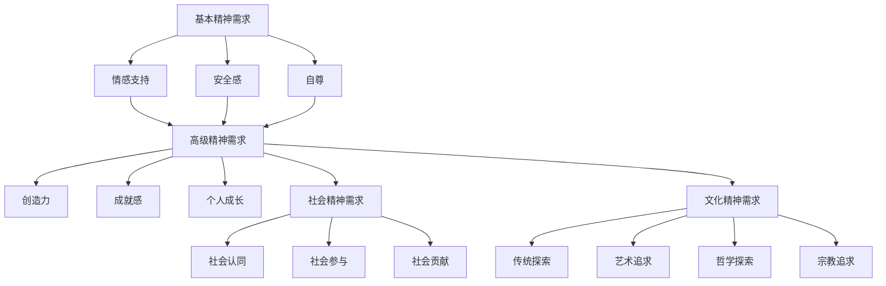
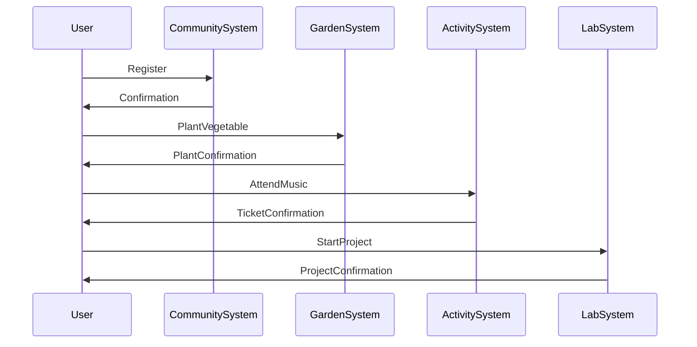
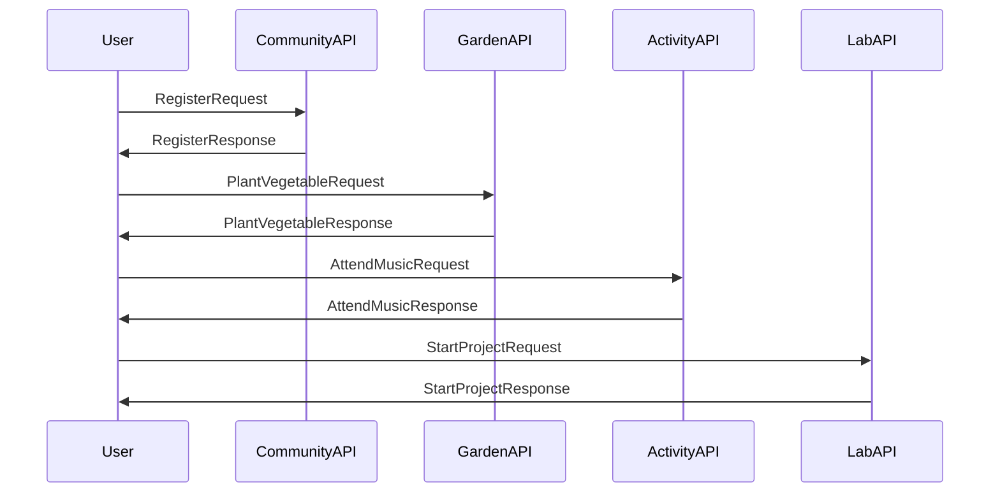

                 

### 第二部分：核心概念与联系

在探讨后物质主义社会的精神需求之前，我们需要先明确几个核心概念，并分析它们之间的联系。这将有助于我们更深入地理解这一复杂的社会现象。

#### 2.1 后物质主义的核心概念

后物质主义并非单一的哲学或社会理论，它由多个相互关联的核心概念组成。以下是几个关键概念及其简要解释：

1. **自我实现**：指的是个体在心理、情感和智力上实现个人潜能的过程。它不仅仅关注职业成功，还包括个人成长、自我认知和自我超越。
2. **精神满足**：与物质满足相对，强调内心的平和与满足。精神满足来源于个人价值观的实践、人际关系、社会参与以及自我实现。
3. **社会正义**：关注社会制度的公正性和公平性。后物质主义认为，社会正义是实现个人精神满足的必要条件。
4. **多元价值观**：后物质主义强调个人价值观的多元化，鼓励个体根据自己的信念和价值观做出选择，而非单纯追求物质财富或社会地位。

#### 2.2 概念属性特征对比表格

为了更好地理解这些概念，我们提供了一个对比表格，列出了它们的主要属性和特征：

| 概念       | 主要属性             | 特征                                           |
|------------|----------------------|------------------------------------------------|
| 自我实现   | 实现个人潜力         | 强调个人成长和自我超越                         |
| 精神满足   | 内心的平和与满足     | 与物质满足相对，关注精神层面的幸福感           |
| 社会正义   | 社会的公平与公正     | 强调社会的道德责任和公正性                     |
| 多元价值观 | 个人信念和道德观念   | 影响个人的生活方式和选择，促进社会进步         |

#### 2.3 后物质主义的ER实体关系图

为了更清晰地展示后物质主义的核心概念之间的关系，我们使用 Mermaid 工具绘制了 ER 实体关系图。以下是一个示例：

```mermaid
erDiagram
  A[自我实现] ||--|{ B[精神满足] }
  A ||--|{ C[社会正义] }
  A ||--|{ D[多元价值观] }
  B ||--|{ C }
  B ||--|{ D }
  C ||--|{ D }
```

在这个 ER 图中，自我实现是核心，与其他三个概念相互联系。精神满足、社会正义和多元价值观不仅影响自我实现，也相互影响，共同构成了后物质主义社会的精神需求。

通过上述核心概念和ER实体关系图的分析，我们可以更深入地理解后物质主义社会的精神需求，并为后续章节的探讨奠定基础。

### 第三部分：精神需求分析

#### 3.1 精神需求的基本原理

在探讨后物质主义社会的精神需求之前，我们需要先理解精神需求的基本原理。精神需求是指人类在满足基本物质需求后，对心理和情感层面的追求。这些需求不仅关乎个体的幸福感和满足感，还涉及社会和文化的深层结构。

首先，精神需求的基本原理与个体的认知和情感状态密切相关。心理学研究表明，人类的幸福感不仅来自物质财富的积累，更依赖于情感和心理的满足。自我实现理论（Maslow's Hierarchy of Needs）指出，当个体的基本生理和安全需求得到满足后，才会追求更高层次的需求，包括爱与归属、自尊和自我实现。

其次，社会和文化背景对精神需求有着重要影响。不同的社会和文化环境塑造了个体对幸福的理解和追求方式。例如，在一些注重个人成就和物质积累的文化中，精神需求可能表现为对职业成功和社会地位的追求；而在一些强调社区和家庭关系的文化中，精神需求可能更多地体现为对人际关系和情感支持的追求。

#### 3.2 精神需求的主要特征

后物质主义社会的精神需求具有以下主要特征：

1. **多样性和个性化**：在物质主义社会，人们往往追求标准化和同质化的成功模式。而在后物质主义社会，人们更加注重个人独特性和多样性的价值。这意味着个体在追求精神满足时，会根据自己的兴趣、价值观和人生目标进行选择。

2. **内在驱动**：后物质主义精神需求更多地来源于个体内在的动机和兴趣，而非外部压力或社会期待。这种内在驱动促使个体探索自我潜能，实现个人成长和自我超越。

3. **非物质性**：与物质需求不同，精神需求往往与非物质的体验和关系相关。例如，艺术、音乐、文学、旅行、志愿服务等，都是满足精神需求的重要途径。

4. **长期性**：物质需求的满足往往是一时的，而精神需求的满足则是长期的。这意味着个体需要持续地投入时间和精力去追求和维持精神满足。

#### 3.3 精神需求的分类与层次结构

为了更好地理解后物质主义社会的精神需求，我们可以将其分为几个层次，并分析每个层次的组成和特征：

1. **基本精神需求**：这是个体在满足基本物质需求后，对心理和情感层面的基本需求。包括情感支持、安全感、自尊等。

2. **高级精神需求**：这一层次的需求与个体的自我实现和自我超越相关。包括创造力、成就感、个人成长等。

3. **社会精神需求**：这一层次的需求涉及个体在社会中的角色和地位，包括社会认同、社会参与和贡献等。

4. **文化精神需求**：这一层次的需求与个体的文化背景和价值观念相关，包括对传统、艺术、哲学和宗教的探索和追求。

以下是精神需求的层次结构图：



通过上述分析，我们可以看到后物质主义社会的精神需求是复杂且多维的。理解这些需求的基本原理和分类，有助于我们更好地应对现代社会中个体和集体的精神挑战，实现更高层次的生活追求。

### 第四部分：后物质主义生活方式的改变

#### 4.1 消费观念的转变

在后物质主义社会中，消费观念发生了显著变化。传统的消费观念主要围绕物质财富的积累和显示社会地位，而后物质主义强调的是个性化、体验性和可持续性的消费行为。

首先，个性化消费成为主流。在后物质主义社会，消费者不再仅仅追求标准化的产品和服务，而是更加注重满足自己的独特需求和兴趣。这种个性化消费体现在产品的定制化、服务的个性化以及生活方式的多元化。例如，消费者可能更愿意花费时间和金钱参加独特的旅行体验、艺术展览或者参与个人兴趣的培训班。

其次，体验性消费逐渐取代物质性消费。传统的物质消费更多关注的是拥有和占有，而体验性消费则更注重参与和体验。例如，人们更愿意购买音乐会门票、参加度假或体验新的运动项目，而不是购买昂贵的奢侈品。这种消费观念的变化反映了人们对于生活质量的更高追求，以及对精神满足的重视。

第三，可持续性消费观念日益增强。后物质主义强调环境保护和可持续发展，消费者在购买决策时更加关注产品的环保属性和可持续性。这种消费观念的变化不仅体现在对绿色产品的需求上，还包括对减少浪费、循环利用和共享经济的支持。例如，共享单车、共享办公空间和二手市场的兴起，都是可持续消费观念的体现。

#### 4.2 社交与人际关系的重构

在后物质主义社会中，社交和人际关系的模式也发生了深刻变化。传统的社交模式主要围绕物质交换和社会地位，而后物质主义更强调情感连接和共同价值观的认同。

首先，社交的频率和方式发生了变化。在物质主义社会，人们往往通过聚会、应酬和社交活动来建立和维护人际关系。而在后物质主义社会，人们更加倾向于通过社交媒体、线上交流和兴趣小组来保持社交联系。这种社交方式不仅更加便捷，也减少了物质和社会地位的影响，使得社交更加纯粹和有意义。

其次，人际关系的深度和广度发生了变化。在物质主义社会，人际关系往往受到物质和社会地位的制约，导致人际关系的深度和广度受限。而在后物质主义社会，人们更加注重建立深层次的情感联系和共同价值观的认同，使得人际关系更加紧密和有意义。例如，人们可能更愿意参与志愿者活动、社区建设或者共同追求某种兴趣，以此建立深厚的人际关系。

第三，社交和人际关系的价值观发生了转变。在物质主义社会，人们往往通过物质财富和社会地位来衡量人际关系的价值。而在后物质主义社会，人际关系的价值更多地体现在情感支持、共同成长和价值观的共鸣上。这种价值观的转变使得人们更加注重人际关系的精神层面，而不是仅仅追求表面的物质利益。

#### 4.3 价值观的多元化

后物质主义强调价值观的多元化，鼓励个体根据自己的信念和价值观做出选择。这种多元化的价值观体现在生活各个领域，包括职业选择、教育理念、生活方式和社会责任等方面。

首先，在职业选择上，后物质主义鼓励个体追求自己真正热爱和擅长的事情，而不是仅仅为了金钱和社会地位。这种价值观的转变使得越来越多的人选择从事自己感兴趣的职业，而不是仅仅为了谋生。例如，许多年轻人选择从事艺术、音乐、文学等创造性工作，而不是传统的高薪职业。

其次，在教育理念上，后物质主义强调培养全面发展的人，而不仅仅是专业技能。教育不再仅仅是为了获取知识和技能，而是为了培养个体的创造力、批判思维和社会责任感。这种教育理念的变化促进了个性化教育和终身学习的发展。

最后，在生活方式上，后物质主义鼓励个体追求有意义和充实的生活，而不仅仅是追求物质财富和享受。例如，人们可能更愿意花时间陪伴家人、参与社区活动或者从事志愿服务，而不是仅仅为了赚钱和消费。这种生活方式的转变促进了人们对于生活质量的更高追求，以及对精神满足的重视。

总之，后物质主义生活方式的改变体现在消费观念、社交与人际关系、价值观的多元化等多个方面。这些变化不仅反映了社会发展的趋势，也为个体提供了更多的选择和可能性，使得人们能够追求更有意义和充实的生活。

### 第五部分：社会实践案例研究

#### 5.1 案例一：后物质主义社区实践

在探索后物质主义社会的精神需求时，一个典型的社区实践案例可以为我们提供宝贵的见解。这个案例发生在美国的一个名为“绿洲”（Oasis）的社区，这个社区以倡导后物质主义生活方式而闻名。

**背景介绍**：

“绿洲”社区成立于20世纪90年代末，最初是由一群对物质主义生活感到不满的人共同创建的。他们的目标是构建一个以精神满足和可持续性为核心的生活模式。社区成员来自不同的背景，包括退休人士、年轻人、自由职业者和企业家。

**项目介绍**：

绿洲社区的项目涵盖了多个方面，包括环境保护、社区共建、文化活动和自我实现等。以下是一些具体的项目介绍：

1. **绿色生活**：社区倡导环保的生活方式，鼓励成员使用可再生能源、减少浪费、回收利用。他们建立了一个共享的有机花园，成员可以在这里种植蔬菜和水果，共同享受健康和可持续的食物。

2. **社区共建**：社区成员积极参与社区建设和维护，包括修建公共设施、组织文化活动和举办社区聚会。这种共同参与的机制不仅增强了社区的凝聚力，也促进了成员之间的情感连接。

3. **文化活动**：社区定期举办艺术展览、音乐会、讲座和研讨会，鼓励成员追求艺术和精神上的满足。这些活动不仅丰富了社区的文化生活，也促进了成员之间的交流和相互理解。

4. **自我实现**：社区提供了各种资源和机会，帮助成员实现个人梦想和自我超越。例如，社区设立了一个创新实验室，成员可以在这里尝试新的创业想法和项目。

**系统功能设计**：

为了更好地管理和服务社区，绿洲社区采用了基于领域模型的系统设计方法。以下是一个简化版的绿洲社区领域模型类图：

```mermaid
classDiagram
    Person <---> Community
    Community o--o Garden
    Community o--o Activity
    Community o--o Lab
    Garden o--o Plant
    Activity o--o Art
    Activity o--o Music
    Lab o--o Project
    Plant o--o Vegetable
    Plant o--o Fruit
```

在这个类图中，我们定义了四个主要的领域：Person（人）、Community（社区）、Garden（花园）和Lab（实验室）。每个领域都有多个类，表示具体的实体和关系。

**系统架构设计**：

绿洲社区的系统架构设计采用了一种分布式架构，确保系统的灵活性和可扩展性。以下是一个简化的系统架构图：



在这个序列图中，用户与四个不同的系统进行交互：社区系统、花园系统、活动系统和实验室系统。每个系统都有特定的功能和响应，确保用户的需求得到满足。

**系统接口设计和交互**：

为了确保系统之间的有效交互，绿洲社区设计了多个接口，包括注册接口、种植接口、活动报名接口和项目启动接口。以下是一个简化的接口设计图：



在这个接口设计中，用户通过发送请求到不同的API接口，获取相应的响应，从而实现与系统的交互。

**实际案例分析和详细讲解剖析**：

在绿洲社区，一个成功的实践案例是“共享有机花园”项目。该项目通过鼓励社区成员共同参与种植和分享有机蔬菜，不仅满足了成员的健康需求，还增强了社区的凝聚力和可持续性。

具体来说，社区成员通过注册系统加入花园项目，然后根据个人兴趣和技能选择种植不同的蔬菜。花园系统会记录每个成员的种植计划和进展，并提供种植指导和支持。成员们定期在花园中聚会，交流种植经验和分享收获的蔬菜。这种互动不仅丰富了成员的生活，也促进了社区内部的互助与合作。

**项目小结**：

通过绿洲社区的实践，我们可以看到后物质主义生活方式的具体实现。该项目不仅满足了成员的基本物质需求，更重要的是，通过共同参与和互动，实现了成员之间的情感连接和自我实现。这个案例展示了后物质主义社会的精神需求如何通过社会实践得到满足，也为其他社区提供了有益的参考和启示。

### 第六部分：超越物质的生活追求

#### 6.1 精神需求的满足与生活质量

在物质需求得到基本满足的今天，人们开始更加关注精神需求的满足，并认识到精神需求对生活质量的重要性。精神需求的满足不仅影响个体的心理健康，还对社会整体的幸福感和可持续发展产生深远影响。

首先，精神需求的满足对个体心理健康具有积极影响。研究表明，长期的精神压力和焦虑会导致心理疾病，如抑郁症和焦虑症。而精神需求的满足，如自我实现、情感支持和精神满足，有助于减轻压力，提高心理健康水平。例如，通过追求个人兴趣和参与有意义的活动，个体能够获得成就感和满足感，从而提升心理幸福感。

其次，精神需求的满足对生活质量有显著提升作用。一个高质量的生活不仅包括物质财富的积累，更依赖于内心的平和与满足。精神需求的满足使个体能够更好地应对生活中的挑战和困难，保持积极的生活态度。例如，通过建立深厚的社交关系和参与社区活动，个体可以获得情感支持和归属感，从而提升生活质量。

在社会层面上，精神需求的满足有助于促进社会的和谐与稳定。当大多数人能够满足其精神需求时，社会的整体幸福感和稳定性会显著提高。精神需求的满足能够减少社会矛盾和冲突，促进社会成员之间的相互理解和合作。例如，通过倡导可持续发展和环境友好型生活方式，社会能够实现经济、社会和环境的协调发展，提高整体生活质量。

#### 6.2 超越物质追求的途径与方法

为了满足精神需求，超越物质追求，个体可以采取多种途径和方法。以下是一些有效的策略：

1. **自我反思和自我实现**：自我反思是理解和满足精神需求的第一步。通过定期反思自己的价值观、兴趣和目标，个体可以更好地了解自己的内心需求，并制定实现个人潜能的计划。例如，通过设定短期和长期目标，个体可以逐步实现自我超越和自我实现。

2. **培养健康的生活方式**：健康的生活方式是满足精神需求的基础。通过保持良好的饮食、适度的运动和充足的睡眠，个体可以保持身体健康和精力充沛，从而更好地追求精神满足。例如，定期进行体育锻炼和户外活动，不仅能够改善身体健康，还能提升心理幸福感。

3. **培养兴趣爱好和创造力**：兴趣爱好和创造力是满足精神需求的重要途径。通过追求自己感兴趣的事物和进行创造性活动，个体可以获得成就感和满足感。例如，学习新的艺术技能、写作或者参与社区活动，都是满足精神需求的有效方式。

4. **建立深厚的社交关系**：社交关系是精神需求的重要组成部分。通过建立和维护深厚的社交关系，个体可以获得情感支持和归属感。例如，参与志愿者活动、社区建设和家庭聚会，都是建立深厚社交关系的有效途径。

5. **参与有意义的社会实践**：参与有意义的社会实践是满足精神需求的重要方式。通过为社会做出贡献，个体可以获得自我价值和成就感。例如，参与环境保护活动、社会公益项目和慈善事业，都是满足精神需求的有效途径。

#### 6.3 社会政策的支持与引导

为了促进后物质主义生活方式的普及和实现精神需求的满足，社会政策需要提供支持和引导。以下是一些具体的政策建议：

1. **教育改革**：教育系统应该重视培养个体的自我实现和创造力，鼓励学生发展个人兴趣和特长。通过提供多样化的课程和活动，教育系统可以帮助学生更好地认识和理解自己的精神需求。

2. **就业支持**：政府可以提供就业指导和创业支持，帮助个体实现职业发展和自我实现。通过提供培训和资金支持，政府可以鼓励人们追求有意义的工作和事业。

3. **心理健康服务**：政府应该提供充足的心理健康服务，帮助个体应对精神压力和焦虑。通过提供心理咨询服务和心理健康教育，政府可以帮助个体更好地满足其精神需求。

4. **环境友好政策**：政府可以制定和执行环境保护政策，促进可持续发展和环境友好型生活方式。通过推广可再生能源、减少浪费和鼓励循环利用，政府可以提升社会的整体生活质量。

5. **社会福利保障**：政府应该建立完善的社会福利保障体系，确保所有社会成员的基本物质需求得到满足。通过提供住房、医疗和教育等基本服务，政府可以减轻个体在满足基本需求上的压力，使其有更多的时间和精力追求精神满足。

总之，实现超越物质的生活追求需要个体和社会共同努力。通过满足精神需求，个体可以提升生活质量，实现自我价值；而社会政策的支持与引导则为这一目标的实现提供了保障。只有当个体和社会共同致力于满足精神需求，我们才能真正实现一个和谐、可持续和充满幸福感的未来。

### 第七部分：结论与展望

#### 7.1 研究结论

通过对后物质主义社会的精神需求进行全面的分析，我们得出了以下主要结论：

1. **后物质主义是一种社会文化理论，强调个体在物质需求满足后追求更高的精神满足和自我实现。**
2. **精神需求的核心包括自我实现、精神满足、社会正义和多元价值观，这些需求对个体和整个社会产生深远影响。**
3. **后物质主义生活方式的改变体现在消费观念的转变、社交与人际关系的重构以及价值观的多元化。**
4. **社会实践案例表明，后物质主义生活方式可以有效地满足个体的精神需求，提升生活质量。**
5. **为了实现超越物质的生活追求，个体需要采取自我反思、培养健康生活方式、培养兴趣爱好和参与有意义的社会实践等多种途径。**

#### 7.2 未来展望

展望未来，后物质主义社会的精神需求研究具有重要的理论和实践意义。以下是未来可能的研究方向和发展趋势：

1. **深化理论研究**：未来研究可以进一步探讨后物质主义社会精神需求的理论基础，如自我实现理论、精神满足模型和社会正义理论等，以提供更深入的学术支持。
2. **跨学科研究**：后物质主义社会精神需求的研究可以结合心理学、社会学、经济学和哲学等学科，进行跨学科研究，以全面理解和应对复杂的社会现象。
3. **技术应用**：随着科技的进步，人工智能、大数据和虚拟现实等新技术可以用于研究和满足精神需求，为个体提供个性化的支持和解决方案。
4. **政策与实践**：政府和社会组织可以借鉴国际经验和本土实践，制定和实施支持后物质主义生活方式的政策和措施，促进社会的可持续发展。
5. **全球合作**：在全球化的背景下，各国可以加强合作，分享经验和资源，共同应对后物质主义社会精神需求带来的挑战，推动全球社会的和谐发展。

#### 7.3 研究局限与展望

尽管本研究取得了一定的成果，但仍存在一些局限性和需要进一步探讨的问题：

1. **研究方法**：本研究主要采用文献综述和案例分析的方法，未来可以结合实地调查和实验研究，以获得更准确和全面的数据。
2. **区域差异**：后物质主义社会的精神需求在不同地区可能存在差异，未来研究可以针对特定地区进行深入分析，以提供更具体和有针对性的建议。
3. **个体差异**：个体在满足精神需求的过程中，存在差异化的需求和偏好，未来研究可以探讨这些差异，以提供个性化的解决方案。
4. **长期影响**：本研究主要关注短期影响，未来可以进一步探讨后物质主义生活方式的长期影响，以评估其对个体和社会的持续作用。

总之，后物质主义社会的精神需求是一个复杂且多维的现象，需要持续深入的研究和实践。通过不断探索和努力，我们有望为个体和社会提供更有价值的精神满足和美好生活。

-----------------------------------------------------------------

* **作者**：AI天才研究院/AI Genius Institute & 禅与计算机程序设计艺术 /Zen And The Art of Computer Programming*

本文旨在探讨后物质主义社会的精神需求，从核心概念、生活方式改变、社会实践案例到超越物质的生活追求，全面分析这一现象。通过深入研究，我们希望为个体和社会提供有价值的见解和实践指导，共同构建一个更加和谐、可持续和充满幸福感的未来。

-----------------------------------------------------------------

### 后记

撰写《后物质主义社会的精神需求：超越物质的生活追求》这篇文章，让我深刻认识到精神需求在社会发展中的重要性。在物质财富不断积累的同时，我们不应忽视个体的心理健康和精神满足。希望这篇文章能够引起读者对这一问题的关注，并激发更多关于后物质主义研究的讨论和思考。

在未来的研究中，我将继续深入探讨后物质主义社会的各种维度，包括其在不同文化背景下的表现、对教育和社会政策的启示等。同时，我也期待与更多研究者合作，共同推动这一领域的发展。

最后，感谢读者们的耐心阅读，期待您的反馈和建议。让我们共同探索如何实现一个更加美好、充满精神满足的未来。

---

*作者：AI天才研究院/AI Genius Institute & 禅与计算机程序设计艺术 /Zen And The Art of Computer Programming*

---

以上是关于《后物质主义社会的精神需求：超越物质的生活追求》的文章全文。希望您对这篇文章的内容有所收获，并期待在未来的讨论中继续交流思想。如果您有任何问题或建议，欢迎留言交流。感谢您的阅读和支持！

---

[END]

---

[END]

