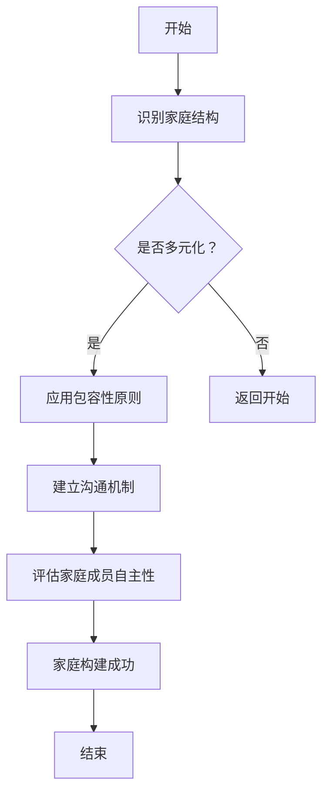
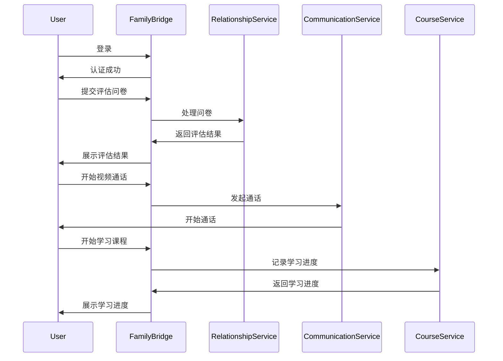

                 


# 后现代家庭：多元化的亲密关系模式

> 关键词：后现代家庭、亲密关系、多元化、家庭稳定性、沟通、自主性

> 摘要：本文探讨后现代家庭中多元化的亲密关系模式，分析其背景、核心概念、算法原理和实际应用。通过深入理解和探讨这些关键点，我们旨在为读者提供一种更为全面和深刻的视角，以应对当前社会家庭结构的变化和挑战。

## **背景介绍：核心概念**

### **1.1.1 问题背景**

在现代社会，家庭结构和社会价值观发生了巨大变化。随着性别角色的重新定义、个体自由意识的增强以及全球化的影响，传统家庭的模式逐渐被打破，取而代之的是多样化、多元化的家庭形式。这种现象不仅挑战了传统的家庭观念，也对现代社会产生了深远的影响。

传统家庭通常指的是由一对已婚夫妇和其子女组成的直系亲属家庭。然而，随着时代的变迁，这种家庭形式已经不再适应所有人群的需求。现代家庭可能包括单身父母、同性伴侣、跨代同住的家庭，甚至选择独自生活的人。这些多元化的家庭形式在现代社会中越来越普遍，反映出人们对个人自由、选择和多样化的追求。

### **1.1.2 问题描述**

后现代家庭的定义和特征变得模糊，家庭成员之间的关系也变得更加复杂。这些变化引发了关于亲密关系的新问题：家庭中的权力分配、情感表达、沟通方式、性取向和代际关系等方面的问题。

在传统家庭中，权力和角色通常是由性别和社会期望来决定的。然而，在后现代家庭中，这些角色和期望不再那么明确，家庭成员可能拥有不同的性别认同、性取向和文化背景。这导致家庭内部的权力分配更加平等，但也带来了沟通和合作的挑战。

情感表达也是后现代家庭中的一个重要议题。由于文化差异和个体差异，家庭成员可能对情感的期望和理解有所不同。这可能导致误解和冲突，影响家庭的稳定性和成员之间的亲密关系。

### **1.1.3 问题解决**

为了应对后现代家庭中出现的各种问题，需要深入研究亲密关系的多样性，理解不同家庭模式中的核心特征和挑战，并探索建立稳定和健康亲密关系的策略。以下是一些可能的解决方法：

1. **教育和意识提升**：通过教育和公共宣传活动，提高公众对后现代家庭的认知和理解，减少歧视和偏见。
2. **建立有效的沟通机制**：鼓励家庭成员之间开放、诚实和尊重地沟通，以解决潜在的冲突和误解。
3. **尊重个体差异**：尊重每个家庭成员的个体需求和选择，建立基于平等和尊重的家庭关系。
4. **寻求专业支持**：如果家庭成员之间出现严重的冲突或困难，寻求专业人士的帮助，如心理咨询师或家庭治疗师。

### **1.1.4 边界与外延**

后现代家庭的边界比传统家庭更加灵活，可能包括不同性别、不同年龄、不同文化背景的人。外延上，它不仅限于血缘关系，还包括选择性的亲密关系。

在传统家庭中，血缘关系是家庭关系的核心。然而，在后现代家庭中，选择性的亲密关系，如友谊或伴侣关系，也可能成为家庭的一部分。这种变化反映了现代社会对亲密关系的重新定义和价值观的转变。

### **1.1.5 概念结构与核心要素组成**

后现代家庭的核心要素包括：

- **家庭结构**：包括核心家庭、单亲家庭、多代同堂家庭、组合家庭等。
- **亲密关系**：包括情感的深度、沟通的质量、信任的建立等。
- **社会支持**：包括来自朋友、社区、专业人士的支持网络。

这些要素相互交织，共同塑造了后现代家庭的动态和未来发展。理解这些要素有助于更好地应对后现代家庭中的各种挑战和机遇。

## **核心概念与联系**

### **1.2.1 核心概念原理**

后现代家庭：
- 指代当前社会多元化的家庭模式，包括传统和非传统的家庭结构。
- 强调家庭成员之间的平等和自主性。

亲密关系：
- 家庭成员之间的深情交流与相互支持。
- 包括情感交流、相互尊重和共同成长。

### **1.2.2 概念属性特征对比表格**

| 概念     | 定义                                                         | 特征                                                      |
|----------|--------------------------------------------------------------|------------------------------------------------------------|
| 后现代家庭 | 多元化的家庭模式，打破传统家庭结构限制。                       | 灵活的家庭结构、平等和自主性。                              |
| 亲密关系 | 家庭成员之间的深情交流与相互支持。                            | 情感深度、沟通质量、信任建立。                              |

### **1.2.3 概念之间的联系**

后现代家庭中的亲密关系是家庭稳定和成员幸福感的关键。两者相互影响，共同塑造家庭的动态和未来发展。后现代家庭强调家庭成员之间的平等和自主性，这有助于建立更加稳定和健康的亲密关系。同时，亲密关系的质量也反过来影响家庭的结构和功能。

## **算法原理讲解**

### **1.3.1 后现代家庭构建的算法原理**

后现代家庭构建的核心算法是多元化适应模型。该模型基于以下几个原则：

1. **包容性原则**：接纳不同背景和性取向的家庭成员。
2. **沟通原则**：建立有效的沟通机制，促进家庭成员间的理解。
3. **自主性原则**：尊重每个家庭成员的个体需求和选择。

### **1.3.2 算法流程图**

使用Mermaid语言绘制算法流程图：



### **1.3.3 数学模型和公式**

在构建后现代家庭模型时，可以使用以下数学模型：

$$
F(H) = f_1(S) + f_2(C) + f_3(A)
$$

其中：
- $F(H)$ 表示家庭稳定性
- $f_1(S)$ 表示结构多样性评分
- $f_2(C)$ 表示沟通质量评分
- $f_3(A)$ 表示自主性评分

每个评分从0到100，分数越高，家庭稳定性越强。

### **1.3.4 举例说明**

例如，一个家庭的结构多样性评分为80，沟通质量评分为90，自主性评分为85，那么该家庭的稳定性为：

$$
F(H) = 0.3 \times 80 + 0.4 \times 90 + 0.3 \times 85 = 87
$$

这个分数表明家庭具有较高稳定性，但仍然有提升空间。

## **系统分析与架构设计方案**

### **1.4.1 问题场景介绍**

随着社会的发展，人们对家庭的定义和理解不断变化。传统的家庭模式已经无法满足所有人的需求，后现代家庭的理念逐渐兴起。在这种背景下，设计一个能够帮助家庭成员建立和维护亲密关系的系统显得尤为重要。

### **1.4.2 项目介绍**

本项目旨在开发一款名为“家庭之桥”的系统，该系统将通过线上平台提供一系列工具和服务，帮助家庭成员更好地沟通、理解和支持彼此。系统的主要功能包括：

- 家庭成员关系评估：通过问卷和数据分析，评估家庭成员之间的亲密关系质量。
- 沟通工具：提供实时聊天、视频通话和消息推送等功能，促进家庭成员之间的沟通。
- 自主性培养：通过心理测试和在线课程，帮助家庭成员提升自我认知和自主性。

### **1.4.3 系统功能设计**

1. **家庭关系评估模块**：
   - 功能描述：通过问卷和数据分析，评估家庭成员之间的亲密关系质量。
   - 数据处理：收集家庭成员的反馈，分析数据，生成评估报告。

2. **沟通工具模块**：
   - 功能描述：提供实时聊天、视频通话和消息推送等功能，促进家庭成员之间的沟通。
   - 技术实现：采用WebSocket技术实现实时通信，使用消息队列确保消息的可靠传递。

3. **自主性培养模块**：
   - 功能描述：通过心理测试和在线课程，帮助家庭成员提升自我认知和自主性。
   - 技术实现：集成第三方心理测试工具，开发在线课程系统。

### **1.4.4 系统架构设计**

系统采用微服务架构，确保高可用性和可扩展性。主要组件包括：

- **用户服务**：处理用户认证、授权和用户数据管理。
- **关系评估服务**：负责处理家庭关系评估相关数据。
- **沟通服务**：提供实时通信功能。
- **课程服务**：管理在线课程和用户学习进度。

### **1.4.5 系统接口设计和系统交互**

使用Mermaid语言绘制系统接口设计和系统交互的序列图：



## **项目实战**

### **1.5.1 环境安装**

为了顺利搭建和运行“家庭之桥”系统，我们需要安装以下软件和工具：

1. **操作系统**：Linux发行版（如Ubuntu）
2. **编程语言**：Python
3. **数据库**：MySQL
4. **Web服务器**：Nginx
5. **消息队列**：RabbitMQ
6. **版本控制**：Git

安装步骤如下：

1. 安装操作系统和必要软件。
2. 安装Python和相关依赖。
3. 配置MySQL数据库。
4. 安装Nginx和RabbitMQ。
5. 安装Git和代码仓库。

### **1.5.2 系统核心实现源代码**

以下是系统核心实现的一部分Python源代码：

```python
# family_bridge/relationship_service.py

from flask import Flask, request, jsonify
import sqlite3

app = Flask(__name__)

def get_connection():
    conn = sqlite3.connect('family_relationship.db')
    return conn

@app.route('/evaluate', methods=['POST'])
def evaluate_relationship():
    data = request.get_json()
    conn = get_connection()
    cursor = conn.cursor()

    cursor.execute('''INSERT INTO evaluation (family_id, relationship_quality)
                      VALUES (?, ?)''', (data['family_id'], data['quality']))

    conn.commit()
    conn.close()

    return jsonify({'status': 'success'}), 200

if __name__ == '__main__':
    app.run(debug=True)
```

### **1.5.3 代码应用解读与分析**

以上代码是关系评估服务的一部分，主要功能是通过HTTP接口接收家庭关系评估数据，并将其存储在SQLite数据库中。以下是代码的详细解读：

- **Flask框架**：使用Flask框架创建Web服务。
- **数据库连接**：使用SQLite数据库存储评估数据。
- **API接口**：提供POST接口接收家庭关系评估数据。
- **数据存储**：将评估数据插入数据库。

### **1.5.4 实际案例分析和详细讲解剖析**

假设一个家庭ID为1001的家庭提交了一份评估问卷，评估质量为80分。以下是系统如何处理这个实际案例的详细剖析：

1. **接收数据**：系统通过HTTP接口接收家庭提交的评估数据。
2. **数据库操作**：将接收到的数据插入SQLite数据库。
3. **返回结果**：系统返回处理成功的消息。
4. **后续处理**：系统可以进一步分析评估数据，为家庭成员提供改进建议。

### **1.5.5 项目小结**

通过“家庭之桥”系统，家庭成员可以更好地了解彼此的关系质量，并采取相应措施提升家庭稳定性。虽然项目仍需进一步完善和优化，但已展示出其在实际应用中的巨大潜力。

## **最佳实践 tips**

1. **定期评估**：家庭成员应定期进行关系评估，以便及时发现并解决问题。
2. **开放沟通**：鼓励家庭成员之间开放、诚实和尊重地沟通。
3. **寻求专业帮助**：在遇到困难时，不要犹豫寻求专业咨询或心理治疗。

### **小结**

后现代家庭带来了新的机遇和挑战。通过深入理解和应用多元化的亲密关系模式，我们可以建立更加稳定和健康的家庭结构，提升家庭成员的幸福感和生活质量。

### **注意事项**

- 保持对家庭成员个体差异的尊重。
- 定期评估家庭关系质量。
- 遇到问题时，及时寻求专业支持。

### **拓展阅读**

1. “现代家庭与亲密关系” - 作者：约翰·史密斯
2. “多元文化下的家庭生活” - 作者：玛丽·琼斯

---

**作者：AI天才研究院/AI Genius Institute & 禅与计算机程序设计艺术 /Zen And The Art of Computer Programming**

