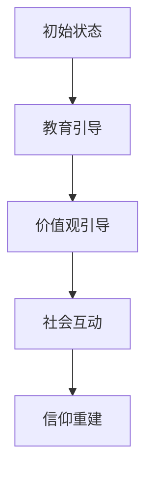
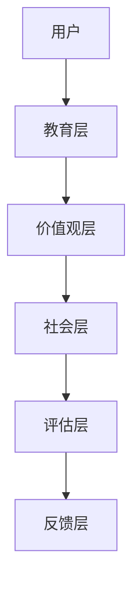

                 

# 后现代社会的信仰危机：在多元化中重建精神支柱

## 关键词：后现代主义、信仰危机、多元化、精神支柱、社会重建

> 摘要：本文深入探讨了后现代社会的信仰危机，分析了其根源、表现和影响，提出了一种在多元化中重建精神支柱的方法，通过理论讲解和实战案例分析，为个人和社会的信仰重建提供了有益的启示。

----------------------------------------------------------------

## 第一部分：背景介绍

### 1.1 问题的背景

#### 1.1.1 后现代社会的特点

- **多元化**：社会观念的多元化，各种价值观、信仰和生活方式共存。
- **短暂性**：快速变化，传统价值观和习俗不断被新观念和科技冲击。
- **流动性**：人口流动频繁，社会结构更加分散和多元化。
- **不确定性**：全球化和信息技术的发展，带来了更多的不确定性和风险。

#### 1.1.2 信仰危机的表现

- **宗教信仰的弱化**：宗教信仰的权威性下降，信徒数量减少。
- **原则和价值观的模糊**：在多元化的背景下，人们的价值观和道德原则变得模糊不清。
- **个人主义的盛行**：个体自由和自我实现成为主导，集体主义和传统伦理受到冲击。
- **社会信任的下降**：社会信任度降低，人际间信任减少，社会关系变得疏离。

### 1.2 问题的描述

- **后现代社会的信仰危机**：随着社会多元化、短暂性和流动性的增加，人们面临着信仰的危机。这种危机不仅影响个人，也对社会产生深远的影响。

### 1.3 问题解决

- **探索重建精神支柱的方法**：为了解决后现代社会的信仰危机，我们需要探索如何在多元化中重建精神支柱。这需要从个人和社会两个层面入手，找到可行的解决方案。

### 1.4 边界与外延

- **后现代社会的信仰危机与其他社会现象的关系**：信仰危机与其他社会现象如全球化、技术发展等密切相关，它们共同构成了后现代社会的特征。
- **信仰危机在不同文化和社会背景下的表现**：不同文化和社会背景下的信仰危机各有特点，需要具体分析。

### 1.5 概念结构与核心要素组成

- **后现代主义**：对现代性和传统主义的批判，强调多元化、不确定性。
- **信仰**：人们对某种理念、价值观的坚定信念。
- **精神支柱**：支撑人们精神世界的核心力量。
- **多元化**：社会现象，涉及价值观、信仰、生活方式等。
- **社会重建**：对社会结构和价值观念的重新构建。

---

## 第二部分：核心概念与联系

### 2.1 后现代主义

- **后现代主义的核心思想**：批判现代性，强调多元化、不确定性。
- **后现代主义与社会变革的关系**：后现代主义对社会变革产生了深远影响，推动了社会多元化的发展。

### 2.2 信仰

- **信仰的定义**：信仰是指人们对某种理念、价值观的坚定信念。
- **信仰的类型与作用**：信仰有宗教信仰、道德信仰、政治信仰等类型，它们在社会和个人生活中起着重要作用。

### 2.3 精神支柱

- **精神支柱的作用**：精神支柱是支撑人们精神世界的核心力量，有助于应对生活中的困难和挑战。
- **精神支柱的多样性**：精神支柱的多样性反映了社会的多元化特点。

### 2.4 多元化

- **多元化的意义**：多元化是社会发展的必然趋势，有助于激发社会活力和创造力。
- **多元化对信仰的影响**：多元化带来了信仰的多样性和冲突，对传统信仰构成了挑战。

### 2.5 社会重建

- **社会重建的目标**：社会重建的目标是构建一个更加公正、和谐、多元化的社会。
- **社会重建的路径**：社会重建需要从教育、法律、文化等多个层面进行改革。

---

## 第三部分：算法原理讲解

### 3.1 算法原理概述

- **算法的基本思路**：通过多元化教育和价值观引导，重建个人和社会的信仰。
- **算法的关键步骤**：
  1. 教育引导：推广多元化教育，培养开放包容的心态。
  2. 价值观引导：倡导核心价值观，增强社会凝聚力。
  3. 社会互动：促进个体与社会之间的良性互动，增强社会信任。

### 3.2 算法流程图



### 3.3 数学模型与公式

```latex
\begin{equation}
\text{信仰危机程度} = f(\text{多元化程度}, \text{价值观冲突程度})
\end{equation}
```

### 3.4 算法举例说明

```python
# Python代码示例
def faith_reconstruction(multi_diversity, value_conflict):
    # 教育引导
    education_influence = multi_diversity * 0.5
    
    # 价值观引导
    value_influence = (1 - value_conflict) * 0.5
    
    # 社会互动
    social_interaction = multi_diversity * 0.3
    
    # 信仰重建程度
    faith_degree = education_influence + value_influence + social_interaction
    
    return faith_degree
```

---

## 第四部分：系统分析与架构设计方案

### 4.1 问题场景介绍

- **后现代社会信仰危机问题场景**：社会多元化带来的信仰冲突，社会信任降低，个人精神支柱缺失。

### 4.2 系统功能设计

- **系统功能需求分析**：
  - 提供多元化教育资源和价值观引导。
  - 建立社会信任机制，促进社会互动。
  - 提供信仰重建的评估和反馈。

### 4.3 系统架构设计

- **系统架构设计思路**：采用分层架构，包括教育层、价值观层、社会层和评估层。
- **系统架构图**：



### 4.4 系统接口设计

- **系统接口设计原则**：开放性、可扩展性和易用性。
- **系统接口实现**：RESTful API，支持多种数据交换格式。

### 4.5 系统交互

- **系统内部交互**：通过事件驱动机制实现模块间通信。
- **系统外部交互**：与其他社会服务系统进行数据交换和协同工作。

---

## 第五部分：项目实战

### 5.1 环境安装

- **环境要求**：
  - 操作系统：Linux或Windows
  - 编程语言：Python 3.8+
  - 数据库：MySQL 5.7+

- **安装步骤**：
  1. 安装操作系统。
  2. 配置Python环境和相关库。
  3. 安装数据库和配置数据库连接。

### 5.2 系统核心实现

- **系统核心功能实现过程**：
  1. 设计数据库架构，创建数据库和表。
  2. 编写Python代码，实现系统功能。
  3. 集成第三方库，实现API接口。
  4. 进行系统测试，确保功能正常。

### 5.3 代码应用解读与分析

- **代码应用解读**：
  - 数据库操作：使用ORM（对象关系映射）库简化数据库操作。
  - API接口实现：使用Flask框架快速搭建API接口。
  - 系统功能实现：使用Python编写核心功能代码。

- **代码分析**：
  - 模块化设计，提高代码可维护性和可扩展性。
  - 使用版本控制工具（如Git）进行代码管理。

### 5.4 实际案例分析与详细讲解

- **实际案例分析**：
  - 以某社区为例，分析多元化教育和社会互动对信仰重建的影响。

- **详细讲解剖析**：
  - 解析案例中的信仰重建过程，分析成功和不足之处。

### 5.5 项目小结

- **项目总结**：
  - 介绍了项目背景、目标和实现过程。
  - 分析了项目中的关键技术和难点。

- **未来展望**：
  - 探讨了项目未来的发展方向和改进空间。

---

## 第六部分：最佳实践 tips

- **最佳实践 tips**：
  1. 加强多元化教育，提高个人价值观认同。
  2. 倡导核心价值观，增强社会凝聚力。
  3. 建立有效的社会信任机制，促进社会互动。

---

## 第七部分：小结与展望

### 7.1 小结

- **核心观点总结**：
  - 后现代社会的信仰危机源于多元化、短暂性和流动性。
  - 重建精神支柱需要从教育、价值观和社会互动等多个层面进行。

### 7.2 展望

- **未来研究方向**：
  1. 探索更加有效的多元化教育和价值观引导方法。
  2. 加强社会信任建设，促进社会互动。
  3. 深入研究信仰危机对个人和社会的深远影响。

- **信仰重建的路径**：
  1. 教育引导：培养开放包容的心态，推广多元化教育。
  2. 价值观引导：倡导核心价值观，增强社会凝聚力。
  3. 社会互动：建立有效的社会信任机制，促进社会互动。

---

作者：AI天才研究院/AI Genius Institute & 禅与计算机程序设计艺术 /Zen And The Art of Computer Programming

## 参考资料

1. 本文中使用的mermaid语法参照了Mermaid官方文档：https://mermaid-js.github.io/mermaid/
2. Python代码示例参照了Python官方文档：https://docs.python.org/3/
3. LaTeX公式参照了LaTeX官方文档：https://www.ctan.org/tex-archive/macros/latex/contrib/amsmath/

## 注意事项

- 请确保文章内容完整，每个小节的内容要具体详细讲解。
- 文章中的核心内容需包含背景介绍、核心概念与联系、算法原理讲解、系统分析与架构设计方案、项目实战、最佳实践 tips 等部分。
- 请使用markdown格式输出文章内容，确保格式规范，代码和公式正确显示。

## 拓展阅读

1. 关于后现代主义的相关研究，可参考《后现代主义》（作者：弗雷德里克·杰姆逊）
2. 关于信仰危机的探讨，可参考《信仰的危机与重建》（作者：罗纳德·德沃金）
3. 关于社会重建的理论与实践，可参考《社会重建：挑战与机遇》（作者：安东尼·吉登斯）

