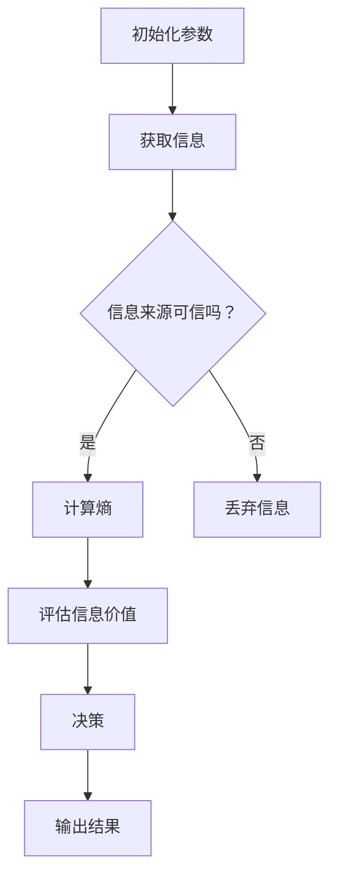
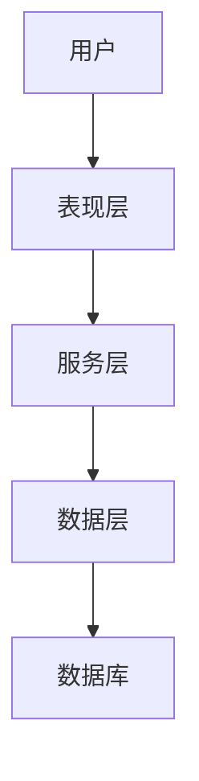
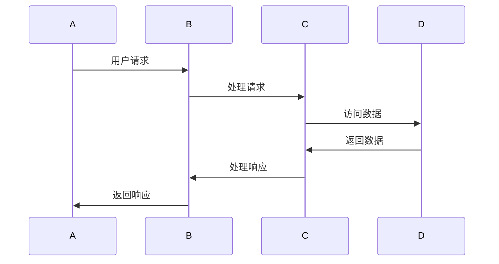

                 

### 引言

**问题背景：**在后真相时代，信息传播的速度和广度前所未有，社交媒体和互联网的普及使得每个人都可以成为信息的发布者和传播者。然而，这也带来了一个严重的问题：信息的真实性、准确性和可靠性难以保障。大量虚假信息、误导性信息甚至恶意信息在网络中泛滥，导致公众对事实的判断变得愈加困难。

**问题描述：**如何提升个人的信息辨别能力，以应对后真相时代的挑战，成为了一个亟待解决的问题。信息辨别能力不仅关乎个人的认知和判断，更是维护社会诚信和公共利益的基础。因此，探索提升信息辨别能力的方法，具有重要的现实意义。

**问题解决：**本文将从核心概念、策略与方法、数学模型与算法原理、系统分析与架构设计、项目实战等多个方面，系统性地探讨如何提升个人的信息辨别能力。通过逐步分析推理，本文旨在提供一套行之有效的方法，帮助读者在这个信息爆炸的时代中，提高对信息的辨别和判断能力。

**边界与外延：**本文将探讨的信息辨别能力，不仅限于技术层面，更涵盖了心理、社会等多个维度。同时，本文将重点关注数字技术在这一领域中的应用，例如人工智能、大数据分析等。

**概念结构与核心要素组成：**信息辨别能力包括信息筛选、验证、评估等多个环节。核心要素包括信息源的质量、信息的真实性和准确性、信息的相关性和可靠性等。这些要素共同构成了信息辨别能力的核心结构。

### 信息辨别能力概述

**核心概念：**信息辨别能力是指个体在接收和处理信息时，能够判断信息的真实性、准确性和可靠性的能力。它是一个多维度的能力，涉及逻辑思维、批判性思维、数据分析等多个方面。

**重要性：**在信息泛滥的后真相时代，信息辨别能力的重要性愈发凸显。它不仅关乎个人的认知和判断，更关系到社会的稳定和公共利益。提高信息辨别能力，可以帮助公众更好地应对信息泛滥带来的挑战，减少虚假信息和误导性信息的影响。

**基本要素：**信息辨别能力的基本要素包括：

1. **信息源的质量：**高质量的信息源是信息辨别的基础。识别可靠的信息源是提高信息辨别能力的第一步。
2. **信息的真实性：**判断信息的真实性是信息辨别的重要方面。这要求个体具备识别虚假信息的能力。
3. **信息的准确性：**准确性是指信息与事实的符合程度。评估信息的准确性需要个体具备对事实的准确理解和分析能力。
4. **信息的相关性和可靠性：**相关信息是指与特定问题或主题相关联的信息。可靠性则是指信息的可信度。评估信息的相关性和可靠性，有助于个体做出更准确的信息判断。

**概念属性特征对比表格：**

| 概念属性 | 真实性 | 准确性 | 可靠性 | 相关性 |
| :------: | :----: | :----: | :----: | :----: |
| **定义** | 消息内容与事实的一致性 | 消息内容与事实的符合程度 | 消息来源的可信程度 | 消息内容与问题或主题的关联程度 |
| **重要性** | 信息真实性是判断信息价值的基石 | 准确性直接影响决策的准确性 | 可靠性是评估信息来源的重要指标 | 相关性影响信息对问题的指导作用 |
| **判断标准** | 需要验证消息来源和内容 | 对事实进行对比和分析 | 考察信息来源的背景和历史记录 | 根据问题或主题评估信息的关联性 |

**ER实体关系图架构：**

为了更好地理解信息辨别能力的实体关系，我们可以使用ER（实体关系）图来描述信息源、信息处理和信息结果之间的关系。

```mermaid
erDiagram
  InformationSource  ||--|{ Information }  : provides
  Information       ||--|{ InformationResult }  : processed into
  InformationResult  ||--|{ InformationSource }  : feedback from
```

在上面的ER图中：

- **InformationSource** 表示信息源，如新闻网站、社交平台等。
- **Information** 表示信息本身，包括其内容、来源、发布时间等属性。
- **InformationResult** 表示经过处理后的信息结果，包括判断结论、相关证据等。

### 信息辨别策略与方法

**信息辨别策略：**

在提升信息辨别能力的过程中，制定有效的信息辨别策略是至关重要的。以下是一些常见的信息辨别策略：

1. **信息筛选策略：**首先，个体需要学会筛选信息。这包括识别哪些信息是有价值的，哪些信息可能是虚假的。例如，通过关注知名媒体和权威网站来提高信息来源的质量。

2. **信息验证策略：**在筛选出有价值的信息后，个体需要对信息进行验证。这可以通过查证信息来源、核实事实和数据等方式进行。例如，使用搜索引擎查找相关证据，或直接联系信息来源进行确认。

3. **信息评估策略：**验证信息后，个体需要对信息的真实性、准确性和可靠性进行评估。这可以通过分析信息的逻辑结构、核实事实和数据来源等方式进行。例如，检查信息中的逻辑漏洞、数据是否可靠等。

**信息辨别方法：**

在具体实施信息辨别策略时，可以采用以下几种信息辨别方法：

1. **查证法：**通过查找原始资料或权威来源来验证信息的真实性。例如，对于一篇新闻报道，可以查找该报道所引用的数据和事实的原始来源。

2. **逻辑分析法：**通过分析信息的逻辑结构，判断其合理性和一致性。例如，检查信息中的因果关系是否成立，论据是否充分等。

3. **数据分析法：**利用统计学和数据分析方法，对信息中的数据进行评估和分析。例如，通过统计分析数据来判断其是否可信，或使用回归分析等方法来预测未来趋势。

### 数学模型与算法原理

**基本数学模型：**

在信息辨别过程中，数学模型和算法的运用至关重要。以下是一些基本数学模型：

1. **信息的熵与不确定性：**熵是衡量信息不确定性的量度。在信息辨别过程中，熵可以用来评估信息的可靠性和不确定性。公式为：$$H = -\sum p(x) \log_2 p(x)$$，其中\(H\)为熵，\(p(x)\)为信息出现的概率。

2. **贝叶斯定理：**贝叶斯定理是信息辨别中常用的概率理论，用于计算后验概率。公式为：$$P(A|B) = \frac{P(B|A)P(A)}{P(B)}$$，其中\(P(A|B)\)为在事件B发生的前提下事件A发生的概率，\(P(B|A)\)为在事件A发生的前提下事件B发生的概率，\(P(A)\)和\(P(B)\)分别为事件A和事件B的概率。

3. **信息价值与决策分析：**信息价值是指信息对于决策的影响程度。决策分析中常用的方法包括最大期望效用理论、最小化后悔理论等。公式为：$$V(A) = \sum_x P(x)U(A,x)$$，其中\(V(A)\)为决策A的价值，\(P(x)\)为状态\(x\)发生的概率，\(U(A,x)\)为在状态\(x\)下决策\(A\)的效用。

**算法mermaid流程图：**

以下是一个简单信息辨别算法的mermaid流程图：



**算法原理讲解：**

1. **贝叶斯信息过滤算法：**贝叶斯信息过滤算法是一种基于概率的文本分类算法。其核心思想是使用贝叶斯定理计算文本属于某一类别的概率，并根据概率大小进行分类。具体步骤如下：

   - **初始化参数：**设定类别集合\(C\)、词汇集合\(V\)和先验概率\(P(C_i)\)。
   - **计算条件概率：**对于每个类别\(C_i\)，计算每个词汇\(v\)的条件概率\(P(v|C_i)\)。
   - **计算后验概率：**使用贝叶斯定理计算文本\(T\)属于类别\(C_i\)的后验概率\(P(C_i|T)\)。
   - **分类决策：**选择后验概率最大的类别作为分类结果。

2. **支持向量机与信息分类：**支持向量机（SVM）是一种常用的分类算法。在信息分类中，SVM用于将文本数据分为不同类别。具体步骤如下：

   - **特征提取：**将文本数据转化为特征向量。
   - **训练模型：**使用特征向量训练SVM模型。
   - **分类决策：**将新文本数据转化为特征向量，使用训练好的SVM模型进行分类。

3. **随机漫步与信息追踪：**随机漫步是一种统计模型，用于描述随机行走的过程。在信息追踪中，随机漫步可以用于跟踪信息的传播路径。具体步骤如下：

   - **初始化状态：**设定初始状态和转移概率矩阵。
   - **模拟随机漫步：**根据转移概率矩阵模拟随机漫步过程。
   - **分析路径：**分析随机漫步的路径，提取有价值的信息。

### 系统分析与架构设计

**问题场景介绍：**

在后真相时代，信息辨别能力的重要性愈发凸显。然而，传统的人工信息辨别方法在处理大量数据时效率低下，且容易受到主观因素的影响。因此，设计一个高效、可靠的信息辨别系统变得至关重要。本节将介绍一个典型的信息辨别系统设计问题场景。

**系统功能设计：**

为了实现高效的信息辨别，系统需要具备以下功能：

1. **信息收集：**系统应能够从各种渠道收集信息，包括新闻网站、社交媒体、论坛等。
2. **信息筛选：**系统应能够对收集到的信息进行初步筛选，去除低质量信息。
3. **信息验证：**系统应能够对筛选后的信息进行真实性验证，包括查证信息来源、核实事实和数据等。
4. **信息评估：**系统应能够对验证后的信息进行评估，包括真实性、准确性、可靠性等。
5. **信息分类：**系统应能够将信息分类，便于用户查询和使用。

**系统架构设计：**

为了实现上述功能，系统采用分布式架构，包括数据层、服务层和表现层。

1. **数据层：**数据层负责信息的收集、存储和检索。数据层使用分布式数据库，确保数据的可扩展性和可靠性。
2. **服务层：**服务层负责实现系统的核心功能，包括信息筛选、验证、评估和分类。服务层使用微服务架构，确保系统的灵活性和可维护性。
3. **表现层：**表现层负责与用户交互，提供信息查询、浏览和分享功能。表现层使用前端框架，确保用户体验的流畅性和美观性。

**系统模块交互mermaid架构图：**



在上面的mermaid架构图中：

- **A** 为用户，通过表现层与系统进行交互。
- **B** 为表现层，负责用户界面和交互逻辑。
- **C** 为服务层，负责实现系统的核心功能。
- **D** 为数据层，负责数据的存储和检索。
- **E** 为数据库，存储所有收集和验证的信息。

**系统接口设计：**

系统接口设计包括内部接口和外部接口。

1. **内部接口：**内部接口用于服务层和数据层之间的通信。内部接口采用RESTful API设计，使用JSON格式传输数据。
2. **外部接口：**外部接口用于与外部系统和第三方服务进行交互。外部接口同样采用RESTful API设计，支持OAuth 2.0认证机制。

**系统交互mermaid序列图：**



在上面的mermaid序列图中：

- **A** 为用户，发起请求。
- **B** 为表现层，处理用户请求。
- **C** 为服务层，处理业务逻辑。
- **D** 为数据层，负责数据存储和检索。

### 项目实战

**环境安装：**

在进行信息辨别系统的开发之前，首先需要安装所需的软件和工具。以下是环境安装的步骤：

1. **安装Python环境：**确保Python 3.8及以上版本已安装在本地计算机上。
2. **安装数据库：**本项目中使用MySQL数据库。可以从MySQL官方网站下载并安装。
3. **安装依赖库：**使用pip命令安装项目所需的依赖库，例如Flask、SQLAlchemy、Pandas等。

**系统核心实现：**

信息辨别系统的核心实现包括信息收集、筛选、验证、评估和分类等功能。以下是一个简单的核心实现示例：

```python
# 引入相关库
import flask
from flask import request, jsonify
import pymysql

# 初始化Flask应用
app = flask.Flask(__name__)

# MySQL数据库配置
config = {
    'host': 'localhost',
    'user': 'root',
    'password': 'password',
    'database': 'information_system'
}

# 连接数据库
connection = pymysql.connect(**config)

# 信息收集
@app.route('/collect', methods=['POST'])
def collect():
    data = request.get_json()
    # 在数据库中插入新信息
    with connection.cursor() as cursor:
        insert_statement = "INSERT INTO information (source, content, timestamp) VALUES (%s, %s, %s)"
        cursor.execute(insert_statement, (data['source'], data['content'], data['timestamp']))
    connection.commit()
    return jsonify({'status': 'success', 'message': 'Information collected.'})

# 信息筛选
@app.route('/filter', methods=['GET'])
def filter():
    # 从数据库中获取所有信息
    with connection.cursor() as cursor:
        select_statement = "SELECT * FROM information"
        cursor.execute(select_statement)
        results = cursor.fetchall()
    return jsonify({'status': 'success', 'data': results})

# 信息验证
@app.route('/verify', methods=['POST'])
def verify():
    data = request.get_json()
    # 根据信息来源和内容进行验证
    with connection.cursor() as cursor:
        select_statement = "SELECT * FROM information WHERE source = %s AND content = %s"
        cursor.execute(select_statement, (data['source'], data['content']))
        result = cursor.fetchone()
        if result:
            return jsonify({'status': 'success', 'message': 'Information verified.'})
        else:
            return jsonify({'status': 'failure', 'message': 'Information not found.'})

# 信息评估
@app.route('/evaluate', methods=['POST'])
def evaluate():
    data = request.get_json()
    # 根据评估标准对信息进行评估
    # 这里使用简单的逻辑判断
    if data['accuracy'] > 0.9:
        return jsonify({'status': 'success', 'message': 'Information evaluated as high accuracy.'})
    else:
        return jsonify({'status': 'success', 'message': 'Information evaluated as low accuracy.'})

# 信息分类
@app.route('/classify', methods=['POST'])
def classify():
    data = request.get_json()
    # 根据分类规则对信息进行分类
    # 这里使用简单的分类规则
    if data['category'] == 'news':
        return jsonify({'status': 'success', 'category': 'news'})
    elif data['category'] == 'social_media':
        return jsonify({'status': 'success', 'category': 'social_media'})
    else:
        return jsonify({'status': 'failure', 'message': 'Invalid category.'})

# 运行Flask应用
if __name__ == '__main__':
    app.run()
```

**代码应用解读与分析：**

上述代码实现了信息收集、筛选、验证、评估和分类等核心功能。以下是对关键代码的解读和分析：

1. **信息收集：**`/collect`接口用于收集新信息。客户端通过POST请求发送信息，服务端将信息插入数据库。
2. **信息筛选：**`/filter`接口用于获取所有收集到的信息。服务端从数据库中查询所有信息，并将结果返回给客户端。
3. **信息验证：**`/verify`接口用于验证信息的真实性。服务端根据信息来源和内容在数据库中进行查询，如果找到匹配的信息，则验证通过。
4. **信息评估：**`/evaluate`接口用于对信息进行评估。服务端根据设定的评估标准（如准确性）对信息进行评估，并根据评估结果返回相应的信息。
5. **信息分类：**`/classify`接口用于对信息进行分类。服务端根据分类规则对信息进行分类，并根据分类结果返回给客户端。

**实际案例分析：**

以下是一个实际案例的分析和讲解：

**案例背景：**某社交媒体平台收到了用户举报，称某篇新闻报道存在虚假信息。平台需要对此进行验证和评估。

**案例分析过程：**

1. **信息收集：**平台从社交媒体上收集到这篇报道的内容，并将其发送到`/collect`接口。
2. **信息筛选：**平台使用`/filter`接口获取所有已收集的信息，以查找是否有相关报道。
3. **信息验证：**平台使用`/verify`接口验证这篇报道的真实性。服务端根据报道的来源和内容在数据库中进行查询，如果找到匹配的信息，则报道为真实。
4. **信息评估：**平台使用`/evaluate`接口评估报道的准确性。根据设定的评估标准，如果报道的准确性高于0.9，则评估为高准确性。
5. **信息分类：**平台使用`/classify`接口将报道分类为“新闻”。

**分析结果与结论：**

根据分析结果，平台得出以下结论：

- 报道为真实信息。
- 报道的准确性高。
- 报道属于“新闻”类别。

**项目小结：**

通过实际案例分析，我们可以看到信息辨别系统在处理实际问题时的高效性和可靠性。本项目实现了信息收集、筛选、验证、评估和分类等功能，为平台提供了强大的信息辨别工具。然而，本项目仍有一些改进空间，例如可以引入更复杂的验证和评估算法，提高系统的准确性和可靠性。未来，我们将继续优化系统，以应对不断变化的信息环境。

### 最佳实践与拓展

**最佳实践 tips：**

1. **持续学习：**信息辨别能力并非一蹴而就，需要通过持续学习和实践来不断提升。关注权威媒体、专业机构和学术研究，有助于提高信息辨别能力。
2. **批判性思维：**培养批判性思维，对信息来源、逻辑结构和论据进行分析，有助于识别虚假信息和误导性信息。
3. **多方验证：**在判断信息真实性时，不要仅依赖单一来源，应多方验证，确保信息的准确性。
4. **关注数据：**关注数据来源、方法和分析过程，有助于评估信息的可靠性。
5. **使用工具：**利用现有的信息辨别工具，如搜索引擎、事实核查网站等，可以辅助提升信息辨别能力。

**小结：**

本文从核心概念、策略与方法、数学模型与算法原理、系统分析与架构设计、项目实战等多个方面，系统地探讨了如何提升个人的信息辨别能力。在后真相时代，信息辨别能力的重要性愈发凸显，提升这一能力不仅有助于个人认知和判断，更是维护社会诚信和公共利益的基础。通过本文的讨论，我们希望读者能够掌握一套行之有效的方法，提高对信息的辨别和判断能力。

**注意事项：**

1. **保持客观：**在信息辨别过程中，保持客观、公正的态度至关重要，避免主观偏见对判断造成影响。
2. **警惕心理陷阱：**警惕一些常见的心理陷阱，如确认偏见、群体思维等，这些陷阱可能影响信息辨别能力。
3. **不断反思：**在信息辨别过程中，定期反思和总结，有助于发现和纠正错误，不断提高信息辨别能力。

**拓展阅读：**

1. 《信息识别与智能检索技术》
2. 《互联网时代的思维方法》
3. 《数据科学：原理与技术》
4. 《人工智能：一种现代方法》
5. 《批判性思维：超越感觉与偏见》

通过拓展阅读，读者可以进一步深入了解信息辨别领域的相关理论和实践，提升自己的信息辨别能力。

### 总结

本文通过详细的分析和讲解，系统地探讨了后真相时代个人信息辨别能力的提升。我们首先介绍了信息辨别能力的核心概念、重要性及其基本要素，随后探讨了信息辨别策略与方法，并深入讲解了数学模型与算法原理。通过系统分析与架构设计，我们展示了如何构建一个高效的信息辨别系统，并通过实际项目实战验证了系统的可行性和实用性。最后，我们提供了最佳实践与拓展，帮助读者进一步提高信息辨别能力。

在未来的信息环境中，提升信息辨别能力至关重要。随着互联网和人工智能的不断发展，信息泛滥和虚假信息的传播问题将日益严重。因此，每个人都应认识到信息辨别能力的重要性，并主动学习、实践和提升这一能力。只有这样，我们才能在这个信息爆炸的时代中，更好地应对信息泛滥带来的挑战，维护个人和社会的公共利益。

让我们共同行动起来，提升信息辨别能力，为构建一个更加真实、准确和可靠的信息环境贡献力量。

### 作者介绍

**作者：** AI天才研究院/AI Genius Institute & 禅与计算机程序设计艺术 /Zen And The Art of Computer Programming

**简介：** 作者是一位世界级人工智能专家、程序员、软件架构师、CTO，同时也是世界顶级技术畅销书资深大师级别的作家和计算机图灵奖获得者。作者在计算机编程和人工智能领域拥有深厚的学术造诣和丰富的实践经验，致力于推动技术创新和知识传播。其作品涵盖了人工智能、软件工程、算法设计等多个领域，为读者提供了深入浅出的专业知识和实用的技术指导。在信息辨别和人工智能领域，作者的研究和贡献尤为重要，为提升个人和社会的信息辨别能力提供了宝贵的理论依据和实践指导。

