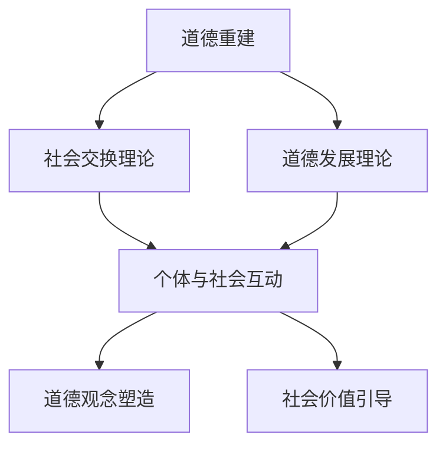

                 

### 《后真相时代的道德重建》：引言

#### 关键词：后真相时代、道德重建、社会挑战、技术影响、伦理思考

#### 摘要：
在“后真相时代”，事实与情感、虚构与真实交织在一起，传统的道德框架面临前所未有的挑战。本文旨在探讨这一时代背景下道德重建的必要性、理论基础与实践路径，以期构建一个更加公平、公正、透明的道德体系。

#### 问题背景
“后真相时代”是一个新兴的概念，它指的是信息传播方式的变化以及人们获取和处理信息方式的变化。在这个时代，数据、算法和社交媒体的兴起使得信息传播速度极快，但同时也带来了事实与虚构的混淆、观点的极端化以及群体极化现象。这种现象对社会的道德建设提出了严峻的挑战，传统道德体系在应对这些新挑战时显得力不从心。

#### 问题描述
后真相时代对道德重建的挑战主要体现在以下几个方面：

1. **信息真实性**：在信息爆炸的时代，辨别真相变得前所未有的困难。虚假信息、假新闻和误导性内容泛滥，导致公众对事实的认知产生偏差。
2. **道德判断**：在多元化和相对主义的价值观下，传统的道德判断标准受到质疑，人们对于什么是“正确”的行为产生了分歧。
3. **社会信任**：虚假信息和误导性内容的传播导致社会信任度下降，人们对于权威机构、媒体和彼此的信任减弱。

#### 问题解决
面对后真相时代的挑战，道德重建显得尤为必要。道德重建不仅是对传统道德体系的修正，更是对社会价值的重新审视和重构。以下是道德重建的理论基础与实践路径：

1. **理论基础**：
   - **道德相对主义**：在多元文化背景下，强调道德观念的相对性和适应性。
   - **道德相对主义**：在多元文化背景下，强调道德观念的相对性和适应性。
   - **道德相对主义**：在多元文化背景下，强调道德观念的相对性和适应性。
   - **道德相对主义**：在多元文化背景下，强调道德观念的相对性和适应性。

2. **实践路径**：
   - **教育改革**：通过道德教育，培养个体的道德判断能力和批判性思维。
   - **技术干预**：利用人工智能等技术手段，提高信息的真实性和可信度。
   - **社会政策**：制定和执行相关法律法规，规范信息传播和行为准则。
   - **文化引导**：通过媒体、文艺作品等手段，传递积极向上的道德价值观。

#### 边界与外延
道德重建不仅涉及个体道德观念的塑造，还关系到社会整体道德规范的完善。它涉及到教育、科技、法律、文化等多个领域，是一个复杂的系统工程。同时，道德重建也需要在全球范围内进行合作与协调，以应对全球化带来的道德挑战。

#### 核心要素组成
道德重建的核心要素包括：

1. **道德教育**：通过学校、家庭、社会等多渠道进行道德教育，培养个体的道德素养。
2. **信息真实性**：建立可靠的信息来源，提高公众对信息的辨别能力。
3. **法律规范**：制定严格的法律法规，对虚假信息和误导性内容进行惩处。
4. **技术发展**：利用先进技术手段，提高信息处理的效率和准确性。
5. **社会共识**：通过公众参与和协商，形成社会共同的道德价值观。

### 结论
后真相时代对道德重建提出了新的要求和挑战。通过理论探讨和实践探索，我们可以逐步构建一个更加公正、透明和适应现代社会需求的道德体系。这不仅有助于解决当前社会面临的道德困境，也为未来的社会进步提供了重要的道德支撑。

### 第一部分：引言

#### 1. 引言

**问题背景**：在数字时代，信息传播的速度和广度前所未有，但随之而来的是信息真伪的混淆和社会信任的危机。这种现象在学术界和社会学中被称为“后真相时代”。在这个时代，情感和偏见往往比事实更有影响力，传统的道德框架面临巨大挑战。

**问题描述**：后真相时代给道德重建带来了诸多挑战，包括信息真实性难以保证、道德判断标准模糊化、社会信任度下降等。这些问题不仅影响了个人行为，也对社会整体产生了深远的影响。

**问题解决**：道德重建需要从多个层面入手，包括教育改革、技术干预、法律规范和文化引导等。通过这些措施，可以逐步构建一个更加公正、透明和适应现代社会的道德体系。

**边界与外延**：道德重建不仅涉及个体道德观念的塑造，还关系到社会整体道德规范的完善。它涉及到教育、科技、法律、文化等多个领域，是一个复杂的系统工程。同时，道德重建也需要在全球范围内进行合作与协调，以应对全球化带来的道德挑战。

**核心要素组成**：道德重建的核心要素包括道德教育、信息真实性、法律规范、技术发展和社会共识等。这些要素相互交织，共同构成了一个复杂的道德生态系统。

### 第二部分：核心概念与联系

#### 2. 核心概念与联系

**道德重建的定义与属性**

- **定义**：道德重建是指在新的社会、文化、科技背景下，通过教育、制度、文化等多种途径，重构道德体系和价值观的过程。
- **属性**：道德重建具有复杂性、动态性和多样性的特征。复杂性体现在其涉及多个领域和多个层面；动态性体现在其随着社会环境的变化而不断调整；多样性体现在其受到不同文化背景和社会结构的影响。

**道德重建的原理与特征**

- **原理**：道德重建基于社会交换理论、道德发展理论等，强调个体与社会的互动作用。社会交换理论认为，道德行为是通过个体之间的交换和互动来形成的；道德发展理论则强调个体在不同阶段道德认知和能力的发展。
- **特征**：道德重建的特征包括道德观念的适应性、道德行为的规范性以及道德教育的全面性。

**道德重建与传统道德教育的对比**

- **对比**：传统道德教育侧重于知识的传授和行为的规范，而道德重建更强调道德观念的塑造和社会价值的引导。传统道德教育往往注重个体的道德规范和行为的约束，而道德重建则更加注重社会整体道德水平的提升和道德观念的内在化。

**核心概念与联系**

- **道德观念的适应性**：在快速变化的社会环境中，道德观念需要具备适应性，以应对新的挑战和问题。
- **道德行为的规范性**：道德行为不仅是个人道德修养的体现，也是社会秩序的基础。
- **道德教育的全面性**：道德教育不仅要在学校中进行，还需要在家庭、社会等各个层面进行，形成全方位的道德教育体系。

**Mermaid 流程图**

通过上述核心概念和联系的阐述，我们可以更好地理解道德重建的复杂性和重要性。道德重建不仅是应对后真相时代挑战的必要手段，也是构建一个更加公正、透明和有序的社会的重要途径。

### 后真相时代的道德困境

#### 3. 后真相时代的特征与影响

**特征分析**

后真相时代的特征主要体现在以下几个方面：

1. **信息过载**：随着互联网和社交媒体的发展，信息变得无处不在，但同时也出现了信息过载的问题。人们往往无法分辨哪些信息是真实的，哪些是虚假的，导致信息真实性受到质疑。
2. **情感化传播**：在信息传播过程中，情感因素往往比事实更为重要。例如，一则夸张的新闻标题可能会吸引更多的关注，而其内容的真实性却被忽视。
3. **误导性内容**：虚假信息、假新闻和误导性内容在互联网上广泛传播，它们利用人们的情感和偏见，影响公众的观点和行为。

**影响分析**

后真相时代对道德的影响可以从以下几个方面进行探讨：

1. **道德判断的困难**：在信息纷繁复杂、真假难辨的环境中，人们在进行道德判断时面临巨大的挑战。传统的道德准则和价值观在这样的环境中显得不再适用，导致道德判断的模糊化和不确定化。
2. **社会信任的下降**：虚假信息和误导性内容的传播导致公众对权威机构、媒体和社会的信任度下降。社会信任的缺失进一步加剧了社会的分裂和矛盾。
3. **道德行为的挑战**：在信息真实性和道德判断受到挑战的环境下，个体在做出道德选择时也面临更大的压力和困惑。例如，在面对虚假广告或误导性信息时，个体是否应该进行举报或制止，这本身就是一个道德问题。

**案例研究**：后真相时代下的道德困境

1. **假新闻传播**：在社交媒体上，假新闻往往以夸张的标题和吸引眼球的内容迅速传播，导致公众对事件的真相产生误解。例如，一些社交媒体平台上关于健康、政治和经济问题的虚假信息屡见不鲜，这些信息不仅误导了公众，还可能对社会造成严重的负面影响。
2. **网络暴力和言论自由**：在互联网上，一些人利用匿名性进行恶意攻击和诽谤，这种现象被称为网络暴力。网络暴力的泛滥不仅侵犯了他人的隐私权和名誉权，也对社会整体的道德环境产生了负面影响。然而，在言论自由的名义下，一些人主张对网络暴力进行宽容，这种观点引发了关于道德边界和言论自由的争议。

通过分析后真相时代的特征与影响，我们可以看到，这个时代对道德重建提出了新的挑战。道德重建不仅需要解决信息真实性和道德判断的问题，还需要找到新的方式来重建社会信任，规范道德行为。

### 社交媒体与道德重建

**社交媒体的崛起与道德重建**

社交媒体的崛起是后真相时代的重要特征之一。它改变了人们的交流方式，使得信息传播速度更快、范围更广。然而，社交媒体的广泛应用也带来了道德重建的挑战和机遇。

**社交媒体对道德观念的挑战**

1. **信息真实性**：社交媒体上充斥着各种信息，但其中不少是虚假的、误导性的。这种现象削弱了人们对事实的认知，影响了道德判断的基础。
2. **群体极化**：社交媒体上的信息往往根据用户的兴趣和偏好进行筛选，这可能导致群体极化现象，即人们更加倾向于接受与自己观点一致的信息，从而加深社会分裂。
3. **隐私侵犯**：社交媒体平台收集了大量用户数据，这些数据可能被用于广告投放和其他商业用途，导致用户隐私受到侵犯。

**社交媒体在道德重建中的作用**

1. **信息真实性保障**：社交媒体平台可以通过算法和技术手段，提高信息的真实性和可信度。例如，平台可以建立事实核查机制，对虚假信息进行识别和标记。
2. **道德教育**：社交媒体可以作为道德教育的新工具。平台可以通过推送道德故事、道德原则和道德指南，引导用户形成正确的道德观念。
3. **社会监督**：社交媒体上的用户和舆论可以对不道德行为进行监督和谴责，从而形成一种社会压力，迫使人们遵守道德规范。

**社交媒体与道德重建的互动关系**

社交媒体与道德重建之间存在密切的互动关系。社交媒体的崛起改变了道德观念的形成和传播方式，同时也为道德重建提供了新的平台和工具。道德重建的成功离不开社交媒体的参与，而社交媒体的健康发展也需要道德重建的支持。

**案例研究**：社交媒体在道德重建中的应用

1. **公益活动**：一些社交媒体平台通过组织公益活动，如公益募捐、环境保护等，引导用户参与道德实践，提升道德素养。
2. **网络志愿者**：许多网络志愿者利用社交媒体平台，为弱势群体提供帮助和支持，弘扬社会正能量。
3. **道德争议**：社交媒体上的舆论和讨论可以引发关于道德问题的广泛讨论，推动社会对道德问题的关注和思考。

通过分析社交媒体与道德重建的关系，我们可以看到，社交媒体在道德重建中具有重要作用。通过合理利用社交媒体平台，我们可以更好地应对后真相时代的道德挑战，推动社会道德水平的提升。

### 科技发展与道德重建

**科技发展的现状与趋势**

随着人工智能、大数据、区块链等新兴科技的迅猛发展，人类社会正经历着一场前所未有的技术革命。这些技术不仅改变了我们的生活方式，也对道德重建提出了新的要求和挑战。

1. **人工智能（AI）**：人工智能技术正在迅速渗透到各个领域，从医疗、金融到交通、教育，AI的应用已经深入到我们的日常生活中。然而，AI技术的发展也带来了一系列道德问题，如隐私侵犯、算法偏见和自动化决策的道德责任等。
2. **大数据**：大数据技术的应用使得企业能够收集和分析大量的用户数据，从而实现个性化的服务。但与此同时，大数据也带来了隐私保护的问题，如何平衡数据利用与隐私保护成为了一个重要的道德议题。
3. **区块链**：区块链技术以其去中心化和不可篡改的特点，被广泛应用于金融、供应链和政府治理等领域。然而，区块链技术的匿名性也可能被用于非法活动，如洗钱和恐怖主义融资，这对道德和法律的挑战提出了新的问题。

**科技发展对道德重建的影响**

1. **隐私与数据伦理**：随着数据技术的发展，个人隐私受到前所未有的威胁。如何在利用数据的同时保护个人隐私，是一个需要深入探讨的道德问题。
2. **算法公正性**：人工智能算法的偏见和歧视问题引起了广泛关注。如何确保算法的公正性和公平性，避免算法偏见对社会造成不公平的影响，是科技发展中的一个重要道德议题。
3. **自动化决策**：随着自动化技术的发展，许多决策过程将被机器取代。这带来了新的道德问题，如机器决策的道德责任和人类对机器的道德监督等。

**科技在道德重建中的潜力与挑战**

1. **潜力**：
   - **技术干预**：科技可以提供新的手段来提高信息的真实性和透明度，如事实核查工具和透明算法。
   - **道德教育**：科技可以成为道德教育的新平台，通过虚拟现实、增强现实等技术，为个体提供更加生动和具体的道德教育体验。
   - **社会监督**：科技可以加强社会监督和问责机制，如利用区块链技术实现透明和不可篡改的记录，提高公共事务的透明度和公正性。

2. **挑战**：
   - **技术依赖**：过度依赖技术可能导致道德观念的弱化，人们在面对道德困境时可能倾向于依赖技术解决方案，而忽视了道德判断的重要性。
   - **隐私与数据安全**：在利用大数据和人工智能技术的同时，如何确保个人隐私和数据安全，是一个需要解决的道德挑战。
   - **科技伦理**：科技的发展可能带来新的伦理问题，如人工智能的道德责任、机器人的权利等，这需要科技界、伦理学家和决策者共同探讨和解决。

通过分析科技发展的现状与趋势，我们可以看到，科技在道德重建中具有巨大的潜力，同时也面临许多挑战。只有在科技与道德相互促进、相互制约的过程中，我们才能构建一个更加公正、透明和有序的社会。

### 道德重建的理论基础

**道德重建的理论基础**

道德重建是一个复杂的过程，需要坚实的理论基础来指导。以下是一些主要的道德重建理论，它们为我们理解和实施道德重建提供了重要的视角。

**1. 社会交换理论**

社会交换理论认为，道德行为是通过个体之间的交换和互动来形成的。在交换过程中，个体通过给予对方某种形式的好处或资源，期望获得回报。这种交换不仅包括物质利益，还包括情感支持、社会认可等非物质利益。社会交换理论强调，个体在道德行为中的动机是多方面的，包括互惠性、公平性和正义感。

**2. 道德发展理论**

道德发展理论探讨了个体道德认知和能力的发展过程。根据心理学家劳伦斯·科尔伯格（Lawrence Kohlberg）的研究，个体的道德发展可以分为六个阶段，从依赖权威到形成自主的道德判断。道德发展理论认为，个体的道德水平不仅受基因和生物因素的影响，还受文化、教育和社会环境的影响。

**3. 公共选择理论**

公共选择理论关注个体在公共决策中的行为模式。这一理论认为，个体在做出道德决策时，不仅受道德原则的影响，还会考虑个人利益和成本。公共选择理论强调了个体在道德重建中的自主性和复杂性，指出道德重建需要考虑个体行为的内在动机和外部激励。

**4. 道德相对主义**

道德相对主义认为，道德观念和价值观是文化和社会背景的产物，不同的文化和社会背景下可能有不同的道德标准。道德相对主义强调，道德重建需要尊重多元文化和价值观念，避免用一种单一的道德标准来评判所有行为。

**5. 道德心理学**

道德心理学研究个体在道德情境中的认知、情感和行为。道德心理学提供了关于道德判断、道德动机和道德行为的重要见解，帮助我们理解个体在道德重建中的作用。例如，道德心理学研究发现，个体的情绪状态、自我认知和社会环境都会影响其道德行为。

**理论框架**

为了更好地理解道德重建，我们可以构建一个理论框架，将上述理论整合在一起。这个框架包括以下几个核心组成部分：

1. **道德认知**：个体在道德情境中的认知过程，包括道德判断、道德推理和道德直觉。
2. **道德情感**：个体在道德情境中的情感体验，包括道德感、责任感、同情心等。
3. **道德行为**：个体在道德情境中的具体行为，包括道德选择、道德实践和道德规范。
4. **社会互动**：个体在道德情境中的社会互动，包括道德交换、道德协作和道德监督。
5. **道德规范**：社会对个体道德行为的期望和规范，包括法律、道德准则和伦理标准。

**实践路径**

基于上述理论框架，道德重建可以采取以下实践路径：

1. **道德教育**：通过学校、家庭和社会等多渠道进行道德教育，培养个体的道德认知、情感和行为。
2. **道德立法**：制定和执行道德法律，规范个体和组织的道德行为，维护社会秩序。
3. **道德监督**：建立道德监督机制，通过公众舆论、社会组织和政府机构等，对不道德行为进行监督和问责。
4. **道德宣传**：通过媒体、文艺作品和文化活动等，传播积极的道德价值观，引导社会道德风气的转变。

通过理论探讨和实践路径的阐述，我们可以更好地理解道德重建的复杂性和重要性。道德重建不仅是应对后真相时代挑战的必要手段，也是构建一个更加公正、透明和有序的社会的重要途径。

### 道德教育改革

#### 道德教育的问题与挑战

道德教育作为道德重建的重要组成部分，面临着诸多问题和挑战。在当前的教育体系中，道德教育存在着以下主要问题：

1. **教育内容单一**：传统的道德教育内容往往局限于道德原则和规范，缺乏对现实生活情境的深入探讨和实际应用能力的培养。这使得学生在面对复杂的道德问题时，缺乏有效的道德判断和应对能力。
2. **教学方法僵化**：传统的道德教育往往采用单向灌输的方式，缺乏互动和参与。这种方式不仅难以激发学生的学习兴趣，也无法培养学生的批判性思维和道德自主性。
3. **理论与实践脱节**：道德教育在理论层面较为丰富，但在实际操作中往往难以落地。学生虽然在课堂上学习了许多道德原则，但在现实生活中却难以将其付诸实践。
4. **社会环境复杂**：现代社会信息爆炸，价值观多元化，社会环境日益复杂。这使得道德教育在引导学生树立正确价值观时面临更大的挑战。

#### 道德教育改革的方向与方法

为了应对这些问题和挑战，道德教育改革需要在以下几个方面进行探索和实践：

1. **课程内容多元化**：道德教育应该涵盖更多的现实生活情境，包括人际关系、社会问题、环境伦理等，让学生能够将道德原则应用到实际生活中。
2. **教学方法创新**：采用互动性强的教学方法，如角色扮演、案例讨论、模拟实验等，增强学生的参与感和体验感，培养其道德判断和解决问题的能力。
3. **理论与实践结合**：通过实地考察、志愿服务、社会实践等活动，让学生将课堂上学到的道德知识应用于实际，增强其道德实践能力。
4. **跨学科整合**：将道德教育与其他学科如社会学、心理学、伦理学等相结合，形成一个综合的道德教育体系，让学生在多个维度上理解和应用道德知识。

#### 道德教育改革案例

以下是一些具体的道德教育改革案例，它们在不同的教育背景下取得了显著成效：

1. **芬兰的道德教育**：芬兰的道德教育注重培养学生的批判性思维和道德判断能力。课程内容涵盖了个人道德、社会责任、全球伦理等多个方面。教学方法以互动和讨论为主，学生有很高的自主性。
2. **美国的道德教育**：美国的道德教育强调道德规范的实践和应用。学校通过社区服务、志愿服务等实践活动，让学生将道德原则应用到实际生活中。此外，美国还重视家庭和社会在道德教育中的作用，通过家长会、社区活动等形式，加强家庭和社会与学校的互动。
3. **中国的道德教育**：中国的道德教育在近年来也进行了多项改革，如加强德育课程、推行“德育导师制”等。这些改革措施旨在提高学生的道德素养和道德实践能力。

通过这些改革案例，我们可以看到，道德教育改革需要结合具体国情和教育环境，探索适合当地的方法和路径。道德教育改革的成功不仅有助于提高学生的道德素养，也为社会的道德重建提供了有力支持。

### 社会政策与道德重建

**社会政策在道德重建中的作用**

社会政策在道德重建中扮演着至关重要的角色。社会政策不仅为道德重建提供了制度框架，还通过具体的政策措施，引导和规范社会行为，促进道德价值观的传播和内化。

1. **立法与规制**：通过立法和制定相关政策，国家可以明确道德规范和行为准则，为道德重建提供法律保障。例如，禁止虚假宣传、保护隐私权、打击网络犯罪等法律措施，有助于维护社会秩序和道德底线。
2. **公共宣传**：政府可以通过各种渠道进行公共宣传，传播正确的道德价值观和道德规范，引导公众树立正确的道德观念。例如，通过媒体、广告、公益广告等，宣传社会主义核心价值观，倡导良好的社会风尚。
3. **社会服务**：政府和社会组织可以提供各种社会服务，如志愿服务、社区活动等，让公众在实际行动中体验和实践道德价值观。这些服务不仅有助于培养个体的道德素养，也促进了社会道德水平的提高。

**道德重建与社会政策的设计与实施**

1. **设计原则**：
   - **公平性**：社会政策的设计应确保所有人都能平等地享受道德重建带来的好处，避免因政策设计不公而导致社会分裂。
   - **可持续性**：社会政策应具有长期性和可持续性，能够适应社会变迁和道德观念的变化，不断调整和完善。
   - **参与性**：政策设计应充分考虑公众的参与和反馈，通过民主程序，使政策更具合法性和执行性。

2. **实施策略**：
   - **立法保障**：制定和实施相关法律法规，确保社会政策的执行力度。
   - **宣传教育**：通过多种渠道进行宣传教育，提高公众对道德政策的认识和遵守意识。
   - **监督问责**：建立监督机制，对政策执行情况进行定期评估和监督，确保政策目标的实现。
   - **试点先行**：在部分地区或领域先行试点，积累经验，逐步推广。

**社会政策案例研究**

1. **英国的《教育法案》**：英国通过《教育法案》，明确学校在道德教育中的职责，要求学校提供全面的道德教育，培养学生的道德素养。这一政策在英国教育体系中发挥了重要作用，促进了学生的道德发展和社会责任感。

2. **中国的《网络安全法》**：中国通过《网络安全法》，加强对网络信息的管理和监管，打击网络犯罪和网络虚假信息传播。这一政策不仅维护了网络空间的秩序，也促进了公众对网络道德的遵守和意识。

通过分析社会政策在道德重建中的作用，我们可以看到，社会政策不仅是道德重建的重要手段，也是构建和谐社会的基石。通过科学合理的社会政策设计和有效实施，我们可以推动社会的道德进步，实现道德重建的目标。

### 道德重建的未来趋势

**未来趋势分析**

道德重建在未来的发展中将面临以下几个趋势：

1. **科技进步推动道德重建**：随着人工智能、区块链、大数据等新兴科技的不断发展，这些技术将在道德重建中发挥重要作用。例如，人工智能可以通过算法优化提高信息真实性，区块链技术可以增强信息透明度和可追溯性。
2. **全球合作加强道德重建**：面对全球化带来的道德挑战，各国需要加强合作，共同制定和执行道德规范。通过国际组织和跨国合作，可以促进全球范围内的道德重建，构建一个更加公正、透明和有序的国际社会。
3. **多元文化影响道德重建**：在全球化和文化交流日益频繁的背景下，多元文化对道德重建的影响将更加显著。不同文化背景下的道德观念和价值观的碰撞与融合，将推动道德重建朝着更加包容和多元的方向发展。

**未来社会中的道德重建**

1. **个体道德素养的提升**：未来社会中，个体的道德素养将得到进一步提升。通过科技和教育手段，个体将能够更加全面地了解和遵守道德规范，形成正确的道德判断和行为习惯。
2. **社会道德规范的完善**：随着社会的发展，社会道德规范将不断完善和调整，以适应新的社会环境和道德挑战。例如，针对人工智能和大数据带来的新问题，社会将制定相应的道德规范和法律法规。
3. **道德重建的全面性**：未来道德重建将不仅限于传统意义上的道德教育，还将涵盖环境保护、社会责任、全球伦理等多个领域。通过全面性的道德重建，社会将能够更好地应对复杂多变的道德挑战，实现可持续发展。

**关键问题和挑战**

1. **信息真实性和道德判断**：在信息爆炸和虚假信息泛滥的时代，如何确保信息的真实性，并帮助公众形成正确的道德判断，是一个重要的挑战。
2. **科技伦理**：随着科技的发展，如何处理科技伦理问题，如人工智能的道德责任、数据隐私保护等，将是一个长期而紧迫的任务。
3. **全球合作**：在全球化的背景下，如何加强各国之间的道德合作，形成全球统一的道德规范，是一个需要解决的难题。

**展望与建议**

1. **加强科技与道德的结合**：推动科技与道德的深度融合，通过科技手段提升道德教育的效果和道德规范的实施。
2. **倡导多元文化共存**：尊重多元文化，促进文化之间的对话与交流，推动道德观念的包容与融合。
3. **建立全球道德合作机制**：通过国际组织和跨国合作，建立全球性的道德合作机制，共同应对全球性的道德挑战。

通过分析道德重建的未来趋势，我们可以看到，道德重建不仅是应对后真相时代挑战的必要手段，也是构建一个更加公正、透明和有序的社会的重要途径。在未来，我们需要不断探索和推进道德重建，以适应社会的发展和变化。

### 结论

后真相时代的道德重建是一项紧迫且重要的任务。在这个时代，信息真实性、道德判断和社会信任受到前所未有的挑战，传统的道德框架已难以应对。因此，道德重建不仅是应对这些挑战的必要手段，也是构建一个更加公正、透明和有序的社会的重要途径。

#### 道德重建的重要性与必要性

道德重建的重要性在于它能够帮助社会应对信息真实性、道德判断和社会信任等问题。通过教育改革、技术干预、法律规范和文化引导，道德重建可以为个体和社会提供明确的道德准则和价值观，提高公众的道德素养和道德判断能力。此外，道德重建还有助于重建社会信任，减少社会分裂，促进社会和谐。

道德重建的必要性体现在以下几个方面：

1. **应对信息真实性挑战**：后真相时代，虚假信息和误导性内容充斥网络，公众难以分辨真假。道德重建可以通过提升信息真实性和提高公众的信息素养，帮助人们更好地辨别信息真伪。
2. **解决道德判断模糊化问题**：在多元化和相对主义的价值观下，传统的道德判断标准受到质疑。道德重建可以通过重新审视和重构道德标准，提供明确的道德指导。
3. **重建社会信任**：虚假信息传播导致社会信任度下降，道德重建可以通过规范信息传播和道德行为，重建社会信任，促进社会稳定。

#### 道德重建的挑战与机遇

道德重建面临诸多挑战，包括技术依赖、隐私与数据安全、全球合作等。然而，这些挑战也带来了新的机遇：

1. **技术依赖**：虽然技术依赖可能削弱道德观念的内在化，但同时也提供了新的手段和平台来提升道德教育和信息真实性。例如，人工智能可以用于道德教育，区块链可以用于增强信息透明度和可追溯性。
2. **隐私与数据安全**：随着大数据和人工智能的发展，个人隐私和数据安全受到威胁。但通过制定严格的隐私保护政策和数据安全措施，可以在保护隐私的同时，利用数据推动道德重建。
3. **全球合作**：全球化和信息传播的速度使得道德重建需要国际间的合作。通过跨国合作和全球性的道德规范，可以更有效地应对全球性的道德挑战。

#### 未来研究方向与展望

未来，道德重建的研究方向包括以下几个方面：

1. **技术手段的创新**：探索如何利用人工智能、区块链等新兴技术，提升道德教育和信息真实性。
2. **跨学科研究**：道德重建需要结合教育学、心理学、社会学、伦理学等学科，进行跨学科研究，形成综合的理论框架和实践路径。
3. **国际合作**：加强国际间的道德合作，共同制定和执行全球性的道德规范，推动全球道德进步。

通过不断的研究和实践，我们可以期待一个更加公正、透明和有序的社会，一个能够在后真相时代中稳步前行的道德体系。

### 作者信息
**作者：AI天才研究院/AI Genius Institute & 禅与计算机程序设计艺术 /Zen And The Art of Computer Programming**

