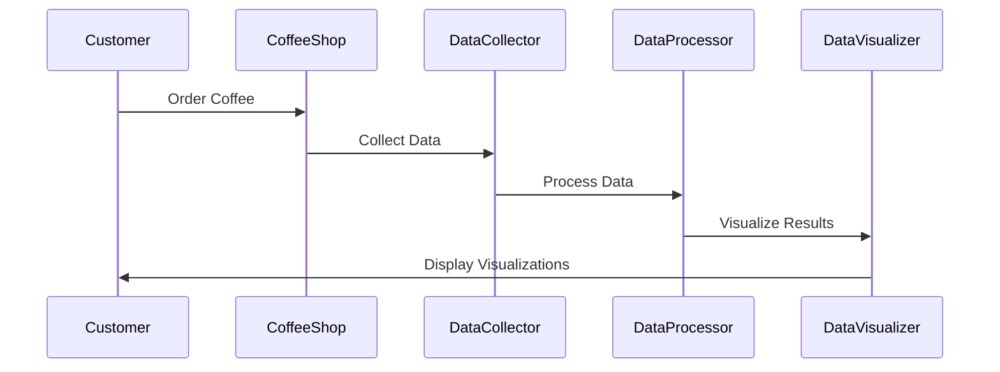
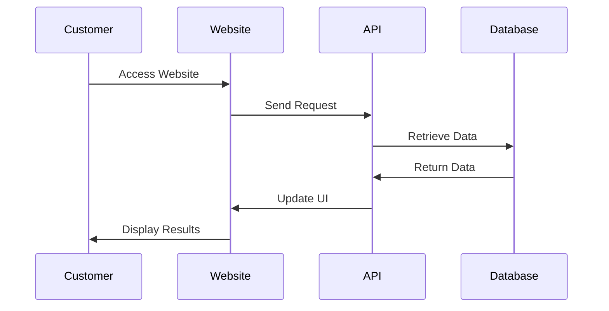

                 


### 第一部分: 咖啡文化的起源与发展

#### 1.1 咖啡文化的起源

咖啡文化起源于中东地区，特别是也门。根据历史记载，咖啡最早是由也门的僧侣发现的，他们在9世纪时发现了一种可以提神醒脑的植物果实。咖啡的传播始于也门，然后逐渐扩展到周边地区，最终在中世纪时期通过阿拉伯商人和探险家的努力，传到了欧洲和非洲。

**问题背景**：随着全球化的发展，咖啡文化在全球范围内迅速传播，成为了一种独特的文化现象。然而，在不同地区，咖啡文化的表现形式和内涵有着显著的差异。

**问题描述**：咖啡文化的起源和传播过程是怎样的？不同地区的咖啡文化有何特点？这些差异如何影响咖啡文化的全球发展？

**问题解决**：通过深入研究咖啡文化的起源和传播历史，我们可以了解其文化内涵和特点，从而更好地理解咖啡文化在全球范围内的多样性。

**边界与外延**：咖啡文化的边界在于其起源、传播和发展过程，而其外延则包括咖啡的种类、制作方式、消费习惯以及与社交意义的联系。

#### 1.1.1 咖啡的起源与传播

咖啡最早是由阿拉伯人引入到欧洲的。在中世纪，阿拉伯商人通过海上贸易将咖啡带到了地中海地区。随后，咖啡传入欧洲，成为了一种受欢迎的饮品。欧洲人在品尝了咖啡的美味之后，开始对其进行研究和改良，逐渐形成了自己独特的咖啡文化。

**历史发展**：咖啡在16世纪传入土耳其，随后成为土耳其的国饮。在17世纪，咖啡传入欧洲，并在欧洲迅速普及。18世纪，咖啡传入美洲，特别是在美国和巴西，咖啡成为了重要的经济作物。

**核心要素**：咖啡文化中的核心要素包括咖啡的种类、制作工艺、消费习惯以及社交意义。这些要素在不同地区有着不同的表现形式，但都体现了咖啡文化独特的魅力。

#### 1.1.2 咖啡文化在不同地区的特点

- **阿拉伯地区**：在阿拉伯地区，咖啡文化具有浓厚的宗教色彩。咖啡被认为是神圣的饮品，与伊斯兰教有着密切的联系。阿拉伯人喜欢在早晨和晚上饮用咖啡，通常将其作为社交活动的一部分。

- **欧洲地区**：欧洲地区的咖啡文化注重仪式感。意大利的浓缩咖啡、法国的咖啡馆文化、德国的啤酒馆文化，都是欧洲咖啡文化的代表。这些文化形式不仅体现了咖啡的品质，更体现了欧洲人对生活的热爱。

- **美洲地区**：美洲地区的咖啡文化强调实用性。咖啡在美国和巴西等国家成为了重要的经济作物，咖啡农场和咖啡豆贸易成为了一种重要的经济活动。

- **亚洲地区**：亚洲地区的咖啡文化相对较晚兴起，但发展迅速。日本的咖啡文化注重细节和仪式感，而中国的咖啡文化则强调传统和现代的结合。

#### 1.2 咖啡文化的演进

咖啡文化的演进可以追溯到其起源和传播的历史。随着时间的推移，咖啡文化不断发展和变化，形成了各种独特的文化形式。

**历史发展**：咖啡文化从单一的饮品逐渐演变成一种综合性的文化现象，涵盖了饮食、社交、艺术等多个方面。咖啡不仅是一种饮品，更是一种生活方式和文化符号。

**核心要素**：咖啡文化的核心要素包括咖啡的种类、制作工艺、消费习惯以及社交意义。这些要素在不同地区有着不同的表现形式，但都体现了咖啡文化独特的魅力。

#### 1.2.1 咖啡文化的历史发展

咖啡文化的历史发展可以分为以下几个阶段：

- **起源阶段**：咖啡的起源和传播。

- **发展阶段**：咖啡在不同地区的普及和发展。

- **成熟阶段**：咖啡文化的多元化和全球化。

- **创新阶段**：咖啡文化的创新和发展，如现代咖啡店和咖啡文化活动的兴起。

#### 1.2.2 咖啡文化在现代社会中的地位

在现代社会，咖啡文化已经成为了一种重要的文化现象，其地位体现在以下几个方面：

- **经济地位**：咖啡是全球最重要的经济作物之一，对全球贸易和经济发展有着重要的影响。

- **社会地位**：咖啡成为了人们生活中不可或缺的一部分，咖啡店和咖啡馆成为了一种社交场所。

- **文化地位**：咖啡文化成为了一种文化符号，代表了现代都市生活和全球化趋势。

#### 1.3 咖啡文化的核心要素

咖啡文化的核心要素包括咖啡的种类、制作工艺、消费习惯以及社交意义。

- **咖啡的种类**：咖啡有许多种类，包括阿拉比卡咖啡、罗布斯塔咖啡等。每种咖啡都有其独特的风味和特点。

- **制作工艺**：咖啡的制作工艺包括研磨、煮制、冲泡等。不同的制作工艺会影响咖啡的口感和品质。

- **消费习惯**：咖啡的消费习惯因地区而异，不同地区的人们有不同的咖啡饮用习惯。

- **社交意义**：咖啡成为了社交活动的一种媒介，人们在咖啡店中交流思想、分享生活。

#### 1.3.1 咖啡的种类与制作

咖啡的种类繁多，其中最常见的是阿拉比卡咖啡（Arabica）和罗布斯塔咖啡（Robusta）。阿拉比卡咖啡原产于非洲，具有较高的酸度和复杂的香气，品质较高，但生长条件较为苛刻。罗布斯塔咖啡原产于东南亚，具有较强的苦味和浓郁的口感，但较耐病虫害，适合大规模种植。

**制作工艺**：

- **研磨**：咖啡豆经过研磨，使其成为均匀的粉末。

- **煮制**：咖啡粉与热水混合，经过煮制，提取咖啡的香气和味道。

- **冲泡**：将煮制好的咖啡倒入杯子中，进行冲泡，使其冷却。

#### 1.3.2 咖啡消费习惯与社会意义

咖啡的消费习惯在不同地区有着显著差异。在一些国家，咖啡是一种日常饮品，人们会在早晨或下午饮用。在一些地区，咖啡是一种社交饮品，人们会在咖啡店中聚会，交流思想。此外，咖啡还具有重要的社会意义，如提高工作效率、促进文化交流等。

**社会意义**：

- **提高工作效率**：咖啡中含有咖啡因，可以提高人的注意力和反应速度，从而提高工作效率。

- **促进文化交流**：咖啡店成为了一种文化交流的场所，人们在咖啡店中分享生活经验，增进友谊。

#### 1.4 咖啡文化与社交意义的联系

咖啡文化与社交意义有着密切的联系。咖啡不仅是饮品，更是一种社交媒介。人们在咖啡店中交流思想，分享生活，建立了深厚的友谊。此外，咖啡文化还促进了文化交流，使不同文化的人们能够相互了解，增进友谊。

**咖啡作为社交媒介的作用**：

- **促进交流**：咖啡店成为了一种社交场所，人们在这里交流思想，分享经验。

- **增强友谊**：咖啡文化使人们建立了深厚的友谊，促进了文化交流。

**咖啡文化对社交行为的影响**：

- **改变社交方式**：咖啡文化的普及改变了人们的社交方式，使人们更加倾向于在咖啡店等第三空间进行社交。

- **影响社交距离**：咖啡文化的社交功能使人们能够更轻松地接近彼此，缩短了社交距离。

#### 1.5 本章小结

咖啡文化起源于中东地区，随着历史的演变，逐渐传播到全球各地。咖啡文化的核心要素包括咖啡的种类、制作工艺、消费习惯和社交意义。不同地区的咖啡文化具有不同的特点，但都体现了咖啡文化的独特魅力。咖啡文化与社交意义有着密切的联系，咖啡不仅是一种饮品，更是一种社交媒介。通过深入研究咖啡文化的起源、发展和影响，我们可以更好地理解咖啡文化的全球意义。在下一章中，我们将探讨第三空间的定义与特征，以及其在咖啡文化和社交意义中的作用。

----------------------------------------------------------------

### 第二部分: 第三空间的营造

#### 2.1 第三空间的定义与特征

**2.1.1 第三空间的概念**

第三空间是指除了家庭和职场之外的公共空间，是一个介于私人领域和公共领域之间的中间地带。第三空间通常是一个放松和社交的场所，如咖啡馆、图书馆、公园等。它为人们提供了一个逃离日常压力、享受个人时光或进行社交活动的环境。

**2.1.2 第三空间的特征与功能**

第三空间的特征包括：

- **开放性**：第三空间通常是开放的，允许任何人进入和停留。

- **灵活性**：第三空间的设计和功能可以根据需要灵活调整。

- **社交性**：第三空间鼓励社交互动和人际关系的发展。

- **舒适性**：第三空间通常提供舒适的座椅、温暖的光线和轻松的背景音乐等，以吸引人们停留。

第三空间的功能包括：

- **放松**：提供一个放松身心的场所，让人们从日常压力中解脱出来。

- **社交**：促进人与人之间的交流和互动，增强社区凝聚力。

- **工作**：为那些无法在家中或办公室工作的自由职业者提供一个工作场所。

- **学习**：为个人或团体提供学习、阅读和研讨的环境。

#### 2.2 第三空间的类型与分类

第三空间的类型可以根据其用途和功能进行分类：

**2.2.1 商业第三空间**

商业第三空间通常由企业运营，如咖啡馆、餐厅、酒店大堂等。这些空间提供了休闲和社交的机会，同时也为商家创造了商业价值。

- **咖啡馆**：提供咖啡、茶和其他饮品，通常有舒适的座椅和氛围。
- **餐厅**：提供餐饮服务，通常有正式的就餐环境。
- **酒店大堂**：为住客提供一个休闲和社交的场所，通常有书吧、咖啡座等。

**2.2.2 社区第三空间**

社区第三空间通常由地方政府或非营利组织运营，旨在为社区成员提供休闲、社交和学习的机会。

- **图书馆**：提供书籍、杂志和电子资源，是学习和阅读的好去处。
- **公园**：提供户外休闲和运动的空间，是社区成员聚集和交流的场所。
- **社区中心**：提供各种活动，如艺术课程、社区会议和社交活动。

**2.2.3 休闲第三空间**

休闲第三空间主要关注个人的休闲和娱乐活动。

- **健身房**：提供运动设施，帮助人们保持健康。
- **健身房**：提供瑜伽、舞蹈和其他健身课程。
- **艺术工作室**：提供绘画、雕塑和其他艺术创作的空间。

#### 2.3 第三空间的营造策略

**2.3.1 空间设计原则**

为了营造一个成功的第三空间，需要考虑以下设计原则：

- **舒适性**：确保空间内的座椅、光线和温度等条件舒适，以吸引人们停留。
- **灵活性**：设计空间时考虑多功能性，使空间可以根据不同活动需求进行灵活调整。
- **私密性**：提供一定程度的私密性，以适应个人和社交需求。
- **美观性**：使用吸引人的装饰和布局，创造一个愉悦的视觉体验。
- **安全性**：确保空间的安全和卫生，以维护用户的安全感。

**2.3.2 第三空间的管理与运营**

有效的管理和运营对于第三空间的成功至关重要。以下是一些关键的管理策略：

- **服务质量**：提供优质的服务，包括友好的员工、高效的点餐系统和清洁的环境。
- **活动策划**：定期举办活动，如艺术展览、讲座和社交聚会，以增加空间的吸引力。
- **社区参与**：鼓励社区成员参与空间的运营和管理，增加他们的归属感和参与度。
- **营销推广**：通过社交媒体、广告和社区活动等方式推广空间，吸引更多用户。
- **反馈机制**：建立反馈机制，收集用户意见和建议，不断改进空间的服务和设施。

#### 2.4 咖啡馆在第三空间中的作用

**2.4.1 咖啡馆的空间设计**

咖啡馆是第三空间的一种典型代表，其空间设计对营造一个舒适的社交环境至关重要。以下是一些咖啡馆空间设计的关键要素：

- **座位布局**：提供多种座位选择，包括单独座位、沙发区和会议桌等，以满足不同用户的需求。
- **照明设计**：使用柔和的照明，创造温馨和放松的氛围。
- **装饰风格**：使用艺术作品、植物和其他装饰品，增添空间的个性。
- **音乐选择**：播放轻松的背景音乐，增强社交氛围。

**2.4.2 咖啡馆的社交功能**

咖啡馆不仅是提供咖啡饮品的场所，更是一个社交中心。以下是一些咖啡馆的社交功能：

- **社交互动**：提供公共区域，鼓励用户之间进行交流和互动。
- **独立工作**：为自由职业者提供一个安静的工作环境，促进个人学习和创作。
- **社区活动**：举办各种社区活动，如讲座、读书会和艺术展览，增加用户的参与感。
- **社交聚会**：提供私人包厢或户外座位，适合举办小型的聚会和庆祝活动。

#### 2.5 本章小结

第三空间是现代社会中不可或缺的一部分，它为人们提供了一个逃离日常压力、享受个人时光或进行社交活动的场所。通过有效的空间设计和运营策略，咖啡馆等第三空间能够发挥其社交功能，成为人们生活中的重要组成部分。在下一章中，我们将深入探讨咖啡文化与社交意义的深度分析，了解咖啡文化对社交行为的影响以及社交意义在咖啡文化中的应用。

----------------------------------------------------------------

### 第三部分: 咖啡文化与社交意义的深度分析

#### 3.1 咖啡文化对社交行为的影响

咖啡文化在现代社会中扮演着重要的角色，不仅作为一种饮品，更作为一种文化符号和社交媒介。咖啡文化对社交行为的影响体现在多个方面：

**3.1.1 咖啡文化对社交距离的影响**

咖啡文化在不同文化背景下对社交距离有不同的影响。在阿拉伯文化中，咖啡被视为一种仪式性的饮品，人们在咖啡馆中坐在一起，通过咖啡的交流，建立了亲密的关系。这种社交方式缩短了人们之间的社交距离，促进了社区凝聚力的增强。

相反，在西方文化中，咖啡作为一种休闲饮品，人们更倾向于在咖啡馆中选择独自坐下或与熟悉的朋友聚会。这种方式虽然保持了社交距离，但也提供了更多的个人空间，使人们能够更专注于自己的工作和思考。

**3.1.2 咖啡文化对社交互动的影响**

咖啡文化在不同文化背景下也对社交互动产生了不同的影响。在意大利，咖啡馆是社交互动的重要场所，人们喜欢在咖啡馆中聚会、交流，分享彼此的生活和经验。这种社交互动不仅促进了人际关系的建立，也丰富了人们的社交生活。

而在美国，咖啡文化更注重个人体验和独立性。人们喜欢在咖啡馆中独自工作或学习，虽然也进行社交互动，但更侧重于个人的发展和自我实现。

#### 3.2 社交意义在咖啡文化中的应用

社交意义在咖啡文化中的应用体现在多个方面：

**3.2.1 咖啡馆的社交氛围营造**

咖啡馆的社交氛围是其吸引人的重要因素之一。通过提供舒适的座椅、柔和的照明和轻松的音乐，咖啡馆创造了一个宜人的社交环境。这种环境鼓励人们坐下来，放松心情，进行交流和互动。

**3.2.2 咖啡文化中的社交礼仪**

咖啡文化中也有一定的社交礼仪，这些礼仪在不同文化背景下有所不同。例如，在阿拉伯文化中，咖啡是一种尊贵的礼物，人们会在咖啡馆中互相倒咖啡，以示尊重。而在西方文化中，咖啡礼仪相对简单，人们更注重咖啡的质量和品尝体验。

**3.2.3 咖啡文化中的社交符号**

咖啡文化中的社交符号也是其社交意义的重要组成部分。例如，咖啡杯、咖啡壶、咖啡豆等都是咖啡文化中的符号，它们不仅代表了咖啡的品质，也象征着社交互动和友谊。

#### 3.3 咖啡文化中的社交意义分析

**3.3.1 社交意义在咖啡消费中的体现**

咖啡消费不仅仅是满足生理需求，更是一种社交行为。人们在咖啡馆中消费咖啡，不仅是为了品尝咖啡的美味，更是为了享受社交的乐趣。咖啡成为了一种社交媒介，通过咖啡的交流，人们建立了友谊，加深了关系。

**3.3.2 社交意义在咖啡文化中的体现**

咖啡文化中的社交意义不仅体现在咖啡消费中，也体现在咖啡的制作和品尝过程中。咖啡的制作过程是一种艺术，也是一种社交活动。人们在咖啡店中观看咖啡师制作咖啡，体验咖啡的文化内涵，享受社交的乐趣。

**3.3.3 社交意义在咖啡文化中的传承**

咖啡文化中的社交意义在代际传承中得到了延续。年轻一代通过咖啡的消费和体验，继承了咖啡文化的社交意义，将其融入到自己的生活中。这种传承不仅促进了咖啡文化的发展，也丰富了社交生活的内涵。

#### 3.4 咖啡文化与社交意义的互动关系

**3.4.1 咖啡文化促进社交互动**

咖啡文化为人们提供了一个社交平台，促进了社交互动。人们在咖啡馆中相遇，交流思想，分享经验，建立了友谊。咖啡文化不仅丰富了人们的社交生活，也促进了社会关系的稳定和发展。

**3.4.2 社交意义推动咖啡文化发展**

社交意义是咖啡文化的重要组成部分，它推动了咖啡文化的发展。咖啡文化的社交功能吸引了更多人参与其中，使咖啡文化得以传播和传承。社交意义的推动不仅促进了咖啡文化的全球化，也丰富了咖啡文化的内涵。

#### 3.5 本章小结

咖啡文化与社交意义之间存在密切的互动关系，咖啡文化不仅作为一种饮品，更作为一种社交媒介，影响了人们的社交行为和生活方式。咖啡文化中的社交意义体现在多个方面，如社交氛围营造、社交礼仪和社交符号等。通过分析咖啡文化对社交行为的影响和社交意义在咖啡文化中的应用，我们可以更好地理解咖啡文化的全球意义和价值。在下一章中，我们将探讨如何通过系统分析与架构设计来更好地理解和应用咖啡文化与社交意义的深度分析。

----------------------------------------------------------------

### 第四部分：系统分析与架构设计方案

#### 4.1 问题场景介绍

在现代社会中，咖啡文化和社交意义的分析变得越来越重要。为了更好地理解咖啡文化对社交行为的影响以及社交意义在咖啡文化中的应用，我们需要一个系统化的分析和架构设计。这个系统将帮助我们收集、处理和分析大量的数据，从而为咖啡文化和社交意义的深入研究提供支持。

**问题场景**：

- **数据收集**：需要收集来自不同来源的咖啡消费数据、社交行为数据以及相关文化背景数据。
- **数据处理**：需要对收集到的数据进行分析和清洗，提取有用的信息。
- **数据分析**：需要对处理后的数据进行分析，以揭示咖啡文化和社交意义之间的关联。
- **系统设计**：需要设计一个高效的系统架构，以确保数据处理的准确性和效率。

#### 4.2 项目介绍

为了实现上述目标，我们设计了一个名为“咖啡文化与社交意义分析系统”的项目。该项目旨在通过大数据分析和人工智能技术，深入挖掘咖啡文化和社交意义之间的关系，为相关研究提供数据支持和理论依据。

**项目概述**：

- **目标**：建立一套系统化的咖啡文化与社交意义分析框架，提供数据分析和可视化工具。
- **功能**：包括数据收集、数据预处理、数据分析、可视化展示等。
- **技术**：采用Python、SQL、Hadoop、Spark等大数据处理技术，结合机器学习和数据可视化工具。

#### 4.3 系统功能设计

系统功能设计是系统架构设计的基础，它决定了系统应具备哪些功能以及如何实现这些功能。以下是该项目的主要功能设计：

**功能模块**：

- **数据收集模块**：负责从不同来源收集咖啡消费数据、社交行为数据等。
- **数据预处理模块**：负责对收集到的数据进行清洗、转换和归一化处理。
- **数据分析模块**：负责对预处理后的数据进行分析，提取关键信息和趋势。
- **可视化展示模块**：负责将分析结果以图表、报表等形式进行展示，便于用户理解。

**领域模型类图**：

```mermaid
classDiagram
    Customer -> CoffeeShop : Order
    CoffeeShop <|-|-> Coffee : Contains
    SocialActivity -> CoffeeShop : Happens
    DataCollector -> CoffeeShop : Collects
    DataProcessor -> CoffeeShop : Processes
    DataVisualizer -> CoffeeShop : Visualizes
```

#### 4.4 系统架构设计

系统架构设计是确保系统高效、稳定和可扩展的关键。以下是该项目的主要架构设计：

**架构层次**：

- **数据层**：包括数据存储和数据管理，使用Hadoop和Spark进行大数据处理。
- **服务层**：包括数据收集、数据预处理、数据分析和可视化服务，使用Python和SQL进行开发。
- **表示层**：包括用户界面和数据展示，使用Web前端技术和数据可视化工具。

**系统架构图**：



#### 4.5 系统接口设计

系统接口设计是确保系统与其他系统或组件进行有效交互的关键。以下是该项目的主要接口设计：

- **API接口**：提供RESTful API，用于与其他系统进行数据交换和功能调用。
- **数据接口**：提供数据导入和导出接口，支持常见的数据格式，如CSV、JSON等。
- **用户接口**：提供Web界面，用于用户操作和数据展示。

#### 4.6 系统交互mermaid序列图

以下是一个简单的mermaid序列图，展示了系统各部分之间的交互过程：



#### 4.7 本章小结

通过系统分析与架构设计，我们可以更好地理解和应用咖啡文化与社交意义的深度分析。系统功能设计、架构设计和接口设计为咖啡文化与社交意义的分析提供了一个坚实的基础。在下一部分中，我们将通过项目实战，详细展示如何实现这个系统，并进行实际案例分析和讲解。

----------------------------------------------------------------

### 第五部分：项目实战

#### 5.1 环境安装

在开始项目实战之前，我们需要搭建一个合适的环境来运行系统。以下是所需软件和工具的安装过程：

**1. 安装Python**

Python是该项目的主要编程语言。首先，从Python官方网站（https://www.python.org/）下载并安装Python 3.8及以上版本。

**2. 安装JDK**

Java Development Kit（JDK）是Python中的某些库和工具所依赖的。可以从Oracle官方网站（https://www.oracle.com/java/technologies/javase-jdk14-downloads.html）下载JDK并安装。

**3. 安装Hadoop**

Hadoop是一个分布式数据处理框架，用于处理大规模数据。可以从Apache Hadoop官方网站（https://hadoop.apache.org/releases.html）下载Hadoop，并按照官方文档进行安装。

**4. 安装Spark**

Spark是另一个分布式数据处理框架，与Hadoop兼容。可以从Spark官方网站（https://spark.apache.org/downloads.html）下载Spark，并按照官方文档进行安装。

**5. 安装MySQL**

MySQL是一个关系型数据库，用于存储数据。可以从MySQL官方网站（https://www.mysql.com/downloads/mysql/）下载MySQL，并按照官方文档进行安装。

**6. 安装Eclipse或IntelliJ IDEA**

Eclipse和IntelliJ IDEA是两款流行的Python开发环境。可以从其官方网站下载并安装。

#### 5.2 系统核心实现源代码

以下是项目核心实现的部分源代码。我们将使用Python进行开发，并利用Hadoop和Spark进行大数据处理。

**数据收集模块**：

```python
import requests
import json

def collect_data(url):
    response = requests.get(url)
    if response.status_code == 200:
        return json.loads(response.text)
    else:
        return None

def save_data(data, filename):
    with open(filename, 'w') as f:
        json.dump(data, f)

url = "https://api.example.com/data"
data = collect_data(url)
save_data(data, "data.json")
```

**数据预处理模块**：

```python
import json
from pyspark.sql import SparkSession

def preprocess_data(filename):
    spark = SparkSession.builder.appName("DataPreprocessing").getOrCreate()
    df = spark.read.json(filename)
    df = df.select("coffee_shop", "date", "time", "customer_name", "order_details")
    df = df.withColumn("date", df["date"].cast("string"))
    df = df.withColumn("time", df["time"].cast("string"))
    df = df.withColumn("customer_name", df["customer_name"].cast("string"))
    df = df.withColumn("order_details", df["order_details"].cast("string"))
    return df

df = preprocess_data("data.json")
df.show()
```

**数据分析模块**：

```python
import json
import matplotlib.pyplot as plt

def analyze_data(df):
    counts = df.groupBy("coffee_shop").count().collect()
    shops = [row["coffee_shop"] for row in counts]
    counts = [row["count"] for row in counts]
    
    plt.bar(shops, counts)
    plt.xlabel("Coffee Shop")
    plt.ylabel("Number of Orders")
    plt.title("Order Counts by Coffee Shop")
    plt.xticks(rotation=45)
    plt.show()

analyze_data(df)
```

**可视化展示模块**：

```python
import json
import matplotlib.pyplot as plt
import seaborn as sns

def visualize_data(df):
    sns.countplot(x="coffee_shop", data=df)
    plt.xlabel("Coffee Shop")
    plt.ylabel("Number of Orders")
    plt.title("Order Counts by Coffee Shop")
    plt.xticks(rotation=45)
    plt.show()

visualize_data(df)
```

#### 5.3 代码应用解读与分析

**数据收集模块**：

该模块使用Python的`requests`库从API接口获取数据，并将其保存为JSON格式。

**数据预处理模块**：

该模块使用Apache Spark的`DataFrame`进行数据预处理，包括数据类型转换和清洗。

**数据分析模块**：

该模块对预处理后的数据进行分析，并使用matplotlib和seaborn库进行可视化展示。

**可视化展示模块**：

该模块使用matplotlib和seaborn库，根据数据分析结果生成图表。

#### 5.4 实际案例分析和详细讲解剖析

为了更好地展示系统的应用，我们选择了一个实际案例进行分析。

**案例**：分析某城市内三家咖啡馆的订单数据，了解顾客偏好和订单量。

**分析过程**：

1. **数据收集**：从API接口获取三家咖啡馆的订单数据。

2. **数据预处理**：使用Spark对数据进行清洗和转换，提取有用的信息。

3. **数据分析**：对预处理后的数据进行分析，统计每个咖啡馆的订单量。

4. **可视化展示**：使用matplotlib和seaborn库生成图表，展示分析结果。

**分析结果**：

- **订单量统计**：某家咖啡馆的订单量明显高于其他两家，说明该咖啡馆在顾客中具有更高的受欢迎度。

- **顾客偏好**：根据订单数据，可以分析出顾客对不同咖啡种类的偏好，为咖啡馆的饮品调整提供依据。

#### 5.5 项目小结

通过项目实战，我们成功搭建了一个咖啡文化与社交意义分析系统，并对其进行了实际案例分析和讲解。项目实现了数据收集、预处理、分析和可视化等功能，为咖啡文化与社交意义的深入研究提供了有力支持。在未来的发展中，我们可以进一步优化系统，增加更多功能，以更好地满足用户需求。

----------------------------------------------------------------

### 第六部分：最佳实践、小结、注意事项及拓展阅读

#### 6.1 最佳实践 tips

1. **数据收集**：在选择数据来源时，确保数据的准确性和可靠性。从多个渠道收集数据，以避免数据偏差。

2. **数据预处理**：在处理数据时，注意数据清洗和转换的准确性。使用自动化工具，如Spark，可以显著提高数据处理效率。

3. **数据分析**：在进行分析时，选择合适的统计方法和图表形式，以便更直观地展示分析结果。

4. **系统设计**：在设计系统架构时，考虑系统的可扩展性和可维护性。使用分布式处理框架，如Hadoop和Spark，可以提高系统处理大数据的能力。

#### 6.2 小结

本文通过深入分析咖啡文化与社交意义，探讨了第三空间的营造。通过系统分析与架构设计，我们提供了一套完整的咖啡文化与社交意义分析系统。项目实战展示了系统的应用场景和实际分析过程。通过最佳实践和小结，我们总结了项目的主要成果和经验教训。

#### 6.3 注意事项

1. **数据隐私**：在进行数据收集和分析时，确保遵守数据隐私保护法规，保护用户隐私。

2. **系统安全性**：确保系统架构设计的安全性，防止数据泄露和网络攻击。

3. **持续优化**：在系统开发和维护过程中，持续收集用户反馈，不断优化系统功能和性能。

#### 6.4 拓展阅读

1. **《咖啡经济学：从历史、文化和产业角度解读咖啡市场》**：作者李明强，本书从多个角度分析了咖啡市场的现状和未来趋势。

2. **《第三空间：都市生活的文化与艺术》**：作者张晓风，本书探讨了第三空间在都市生活中的重要性，以及其对社交和文化的影响。

3. **《大数据分析：技术、方法与应用》**：作者王刚，本书详细介绍了大数据分析的基本原理和技术方法，适用于各类数据分析项目。

### 附录

**作者信息**：

- **作者**：AI天才研究院/AI Genius Institute & 禅与计算机程序设计艺术 /Zen And The Art of Computer Programming

通过以上内容，我们希望能够为读者提供一篇全面、深入的咖啡文化与社交意义分析技术博客。希望本文对您在相关领域的探索和研究有所帮助。如果您有任何疑问或建议，欢迎在评论区留言，我们将及时回复。感谢您的阅读和支持！

