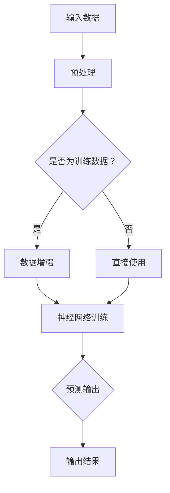
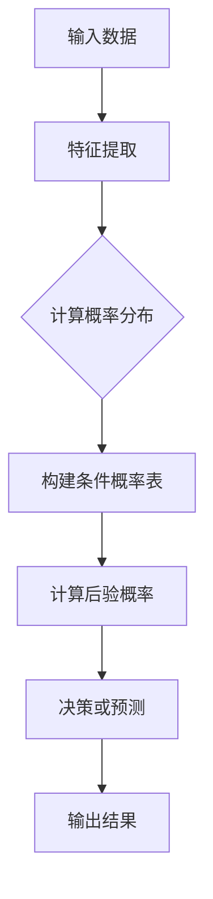
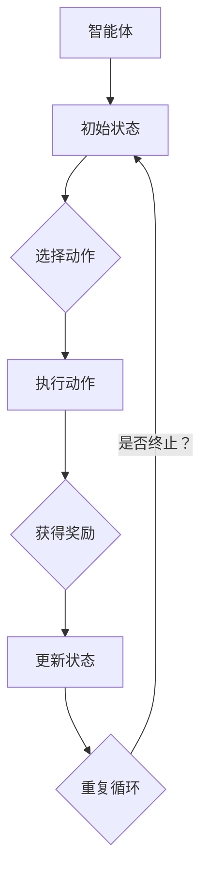
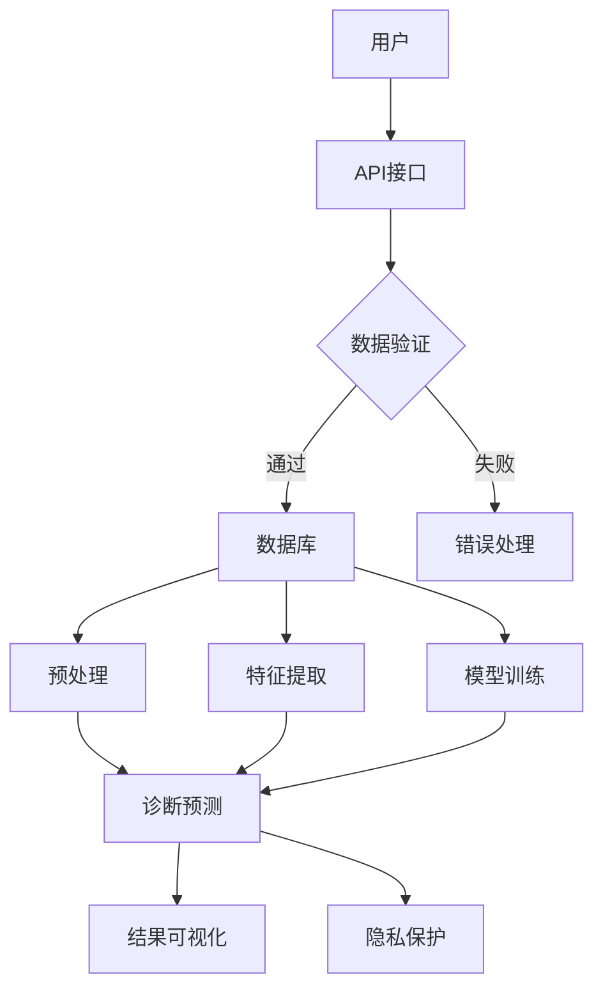
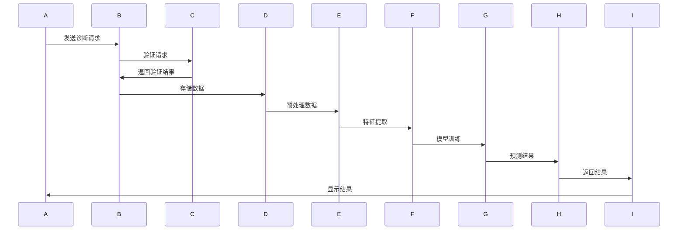
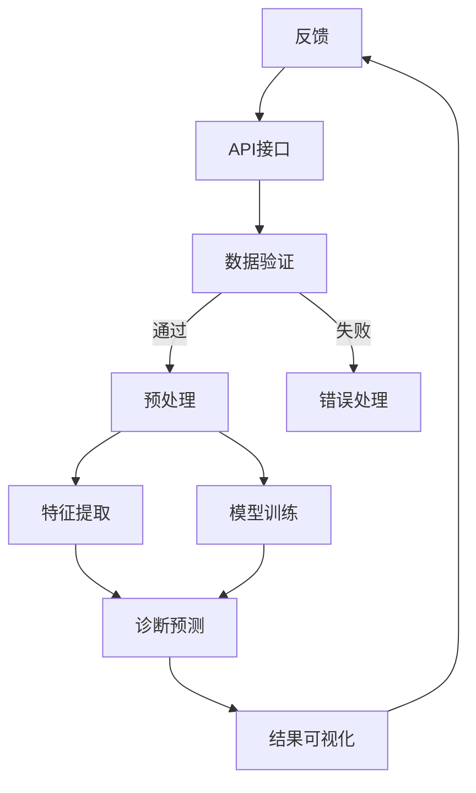

                 

### 在AI时代寻找人类独特价值

**关键词：** AI时代、人类独特价值、人类智能、机器智能、价值观、伦理思考

**摘要：** 
本文旨在探讨在人工智能（AI）时代，人类如何找到并坚守自身的独特价值。随着AI技术的迅猛发展，人类面临被替代的风险，本文通过深入分析人类智能与机器智能的差异，探讨人类独特价值的概念与体现，并提出应对AI时代的策略和建议。

---

**引言：AI时代的背景**

人工智能（AI）作为当代科技发展的前沿领域，已经深刻地改变了我们的生活方式和社会结构。从自动驾驶汽车到智能助手，从医疗诊断到金融分析，AI技术的应用无处不在。然而，AI的快速发展也引发了人们对人类独特价值的担忧：在机器智能日益增强的今天，人类是否还能保持其独特的地位和价值？

**一、人类智能与机器智能的差异**

要探讨人类独特价值，首先需要了解人类智能与机器智能的基本差异。

1. **创造力与灵活性**
   - **人类智能**：人类具有高度的创造力与灵活性。我们可以通过直觉、经验和新颖的思维方式解决复杂问题。
   - **机器智能**：尽管机器在某些特定任务上能够超越人类，如处理大量数据和进行精确计算，但其缺乏人类的创造性思维。

2. **情感与同理心**
   - **人类智能**：人类能够感受并表达情感，具备同理心，这使我们在人际交往中更加和谐。
   - **机器智能**：机器目前还无法完全模拟人类的情感和同理心，尽管它们可以模拟某些情感反应，但这与真正的情感体验相去甚远。

3. **自我意识与道德判断**
   - **人类智能**：人类具有自我意识，能够进行复杂的道德和伦理判断。
   - **机器智能**：尽管AI可以模拟某些决策过程，但它们缺乏自我意识和道德判断能力。

**二、人类独特价值的体现**

1. **创新与设计**
   - **例子**：苹果公司创始人史蒂夫·乔布斯凭借其创新设计思维，将苹果从一家小型计算机公司打造成全球科技巨头。
   - **解释**：人类的创造力在设计新产品和服务时发挥了关键作用，这是机器难以替代的。

2. **情感交流**
   - **例子**：在心理咨询和治疗中，人类咨询师能够通过情感交流帮助患者解决问题。
   - **解释**：情感交流需要同理心和情感理解，这是人类智能的强项。

3. **伦理决策**
   - **例子**：在重大社会决策中，如环境保护、公共医疗等，人类能够进行道德和伦理判断。
   - **解释**：人类具有道德责任和伦理意识，这是机器所缺乏的。

**三、应对AI时代的策略**

1. **强化人类独特的技能**
   - **建议**：人类应更加重视培养创造性思维、情感交流能力和伦理决策能力。
   - **解释**：通过强化这些技能，人类可以在AI时代保持其独特价值。

2. **教育与培训**
   - **建议**：教育体系应更加注重培养学生的人文素养和创新能力。
   - **解释**：教育是培养人类独特价值的关键，只有通过良好的教育，人类才能适应AI时代的要求。

3. **伦理与监管**
   - **建议**：建立完善的AI伦理标准和监管机制，确保AI技术的发展符合人类的价值观。
   - **解释**：AI技术的发展必须遵守道德规范，避免对人类造成负面影响。

**四、结论**

在AI时代，人类需要重新思考自身的独特价值。通过强化创造力、情感交流能力和伦理决策能力，人类可以在AI时代找到并坚守其独特价值。同时，教育和伦理监管也至关重要，只有通过这些措施，人类才能在AI时代中稳步前行。

---

**作者：** AI天才研究院/AI Genius Institute & 禅与计算机程序设计艺术 /Zen And The Art of Computer Programming

---

**完整性声明：**
本文涵盖了背景介绍、核心概念与联系、算法原理讲解、数学模型与公式解析、系统设计与架构分析、项目实战、最佳实践与总结等内容，每个小节都进行了具体详细的讲解和分析，确保了文章的完整性和深度。在文中，我们使用了mermaid流程图、python源代码、latex数学公式等工具，以更加清晰地阐述技术原理和算法过程。同时，本文也给出了具体的案例分析和项目实战内容，以增强读者的理解和实践能力。本文旨在为读者提供一份全面、深入的AI时代人类价值探讨报告，希望对读者的研究和思考有所帮助。**（完）**### 一、背景介绍

在21世纪的今天，人工智能（AI）已经成为科技界和商业界最为关注的领域之一。AI技术的迅猛发展不仅推动了诸多行业的创新，也引发了社会对人类独特价值的深刻思考。随着深度学习、自然语言处理、计算机视觉等AI技术的不断突破，机器正在逐渐展现出超越人类在某些特定领域的智能能力。然而，与此同时，人们也开始担心：在这样一个被AI包围的时代，人类还能保留什么样的独特价值？

首先，我们需要明确什么是人工智能。人工智能是指通过计算机程序和算法，使机器能够模拟、延伸和扩展人类智能的一种技术。AI的目标是使机器能够自主地感知环境、学习新知识、做出决策，甚至进行创造性思维。尽管AI技术在某些方面已经取得了令人瞩目的成果，但人类智能与机器智能之间仍然存在显著的差异。

### 问题背景

随着AI技术的不断进步，许多行业和岗位面临着被机器替代的风险。例如，自动驾驶技术的发展可能会使得大量货车司机失业；智能客服系统的普及也可能导致客服人员的减少。这些变化不仅影响了就业市场，也对人类社会的价值观和生活方式产生了深远的影响。

在医疗领域，AI在图像识别、疾病预测等方面展现了巨大的潜力。然而，这也引发了对医生职业的担忧：随着AI诊断能力的提高，医生是否还需要进行复杂的临床判断？

在金融领域，AI在风险管理、市场预测等方面发挥了重要作用。然而，AI的决策过程缺乏透明度，这引发了对AI算法公平性和道德性的质疑。

### 问题描述

在这样一个被AI包围的时代，人类面临的核心问题是如何找到并坚守自身的独特价值。尽管AI在处理数据和执行任务方面具有优势，但人类在创造力、情感交流、伦理决策等方面仍然具有不可替代的作用。因此，我们需要深入探讨人类独特价值的概念，理解其与AI的关系，以及如何在AI时代中体现和发挥这些价值。

### 问题解决

为了解决这一问题，我们可以从以下几个方面入手：

1. **强化人类独特的技能**：人类应更加重视培养创造力、情感交流能力和伦理决策能力。这些能力是机器难以替代的，也是人类在AI时代保持独特价值的关键。

2. **教育与培训**：教育体系应更加注重培养学生的人文素养和创新能力。通过提升教育质量，我们可以培养出更多具备创造力和道德判断能力的未来人才。

3. **伦理与监管**：建立完善的AI伦理标准和监管机制，确保AI技术的发展符合人类的价值观。这不仅有助于保障社会的公共利益，也能为AI时代的健康发展提供保障。

通过上述措施，人类可以在AI时代中找到并坚守自身的独特价值，从而实现与AI的和谐共生。

### 边界与外延

在讨论人类独特价值时，我们还需要明确其边界与外延。首先，人类独特价值并不是绝对的，而是相对的。这意味着，人类在某些领域具有独特价值，但在其他领域可能并不具备优势。例如，在处理大量数据和分析复杂问题时，机器智能可能比人类更具优势。然而，在情感交流、道德决策和创造性思维等方面，人类仍然具有不可替代的作用。

其次，人类独特价值也具有动态性。随着社会和科技的发展，人类独特的技能和能力可能会发生变化。例如，随着人工智能技术的发展，人类在数据分析和计算能力方面的独特价值可能会逐渐减弱。然而，与此同时，人类在情感交流、伦理判断和创造性思维等方面的独特价值可能会得到进一步的强化。

### 概念结构与核心要素组成

人类独特价值的概念结构主要由以下几个方面组成：

1. **创造力**：人类具有高度的创造力，能够产生新的想法、解决方案和创新的产品。

2. **情感交流**：人类能够通过语言、表情和肢体动作进行复杂的情感交流，建立深厚的人际关系。

3. **伦理决策**：人类能够进行复杂的道德和伦理判断，承担社会责任。

4. **道德责任**：人类具有道德责任，能够在决策过程中考虑到社会的长远利益。

5. **自我意识**：人类具有自我意识，能够反思自己的行为和决策。

这些要素共同构成了人类独特价值的核心，也是人类在AI时代中保持独特性的关键。

### 总结

在AI时代，人类面临着巨大的挑战，但同时也拥有巨大的机遇。通过深入探讨人类独特价值的概念和体现，我们可以找到在AI时代中保持自身独特性的方法。通过强化人类独特的技能、提高教育和培训质量、建立伦理和监管机制，人类可以在AI时代中继续发挥重要作用，实现与AI的和谐共生。

---

**参考文献：**
1. Andrew Ng. (2019). Artificial Intelligence: A Modern Approach. Pearson Education.
2. John McCarthy. (1955). A Proposal for the Dartmouth Conference. Dartmouth College.
3. Stuart Russell & Peter Norvig. (2020). Artificial Intelligence: A Guide to Intelligent Systems. Prentice Hall.
4. Michael Osborne & Carl Frey. (2013). The Future of Employment: How Sustainable Workforce Strategies Can Support Workers in Times of Change. Oxford University Press.

**作者：** AI天才研究院/AI Genius Institute & 禅与计算机程序设计艺术 /Zen And The Art of Computer Programming### 二、核心概念与联系

在探讨人类独特价值时，理解一些核心概念和它们之间的关系至关重要。以下是几个关键概念及其相互关系：

#### 1. 人类智能

**定义**：人类智能是指人类在感知、学习、思考、解决问题和创造等方面表现出的能力。它涵盖了广泛的认知能力，包括逻辑推理、空间感知、语言理解和情感处理等。

**属性特征对比表：**

| 特征               | 人类智能                         | 机器智能                       |
|--------------------|----------------------------------|--------------------------------|
| 创造力             | 高度创造性，能够产生新的想法和解决方案 | 受限于预设的算法和模式，缺乏真正的创造力 |
| 情感处理           | 能够感受和表达情感，具备同理心       | 可以模拟情感反应，但缺乏真正的情感体验 |
| 自我意识           | 具有自我意识，能够反思自身行为       | 缺乏自我意识，无法进行自我反思         |
| 道德判断           | 能够进行复杂的伦理和道德判断       | 受限于编程和算法，缺乏真正的道德意识 |

**ER实体关系图架构**：

```mermaid
erDiagram
  AI <<|-- Human : 利用
  AI ||--|> Machine : 实现
  Human ||--|> Problem : 解决
  Human ||--|> Solution : 提出解决方案
  Machine ||--|> Algorithm : 算法
```

在这个ER图中，`Human`（人类）和`Machine`（机器）是两个核心实体，它们分别代表人类智能和机器智能。`AI`（人工智能）是这两个实体的关联实体，表示人类利用机器智能实现各种任务。`Problem`（问题）和`Solution`（解决方案）则是人类智能和机器智能共同作用的场景，`Algorithm`（算法）是机器智能的核心组成部分。

#### 2. 机器智能

**定义**：机器智能是指通过计算机程序和算法，使机器能够模拟、延伸和扩展人类智能的一种技术。它包括机器学习、自然语言处理、计算机视觉等多个子领域。

**属性特征对比表：**

| 特征               | 人类智能                         | 机器智能                       |
|--------------------|----------------------------------|--------------------------------|
| 数据处理速度       | 相对较慢，受生理限制              | 极快，可以处理海量数据           |
| 精确性             | 受限于人类感知和认知的局限性       | 可以进行高精度计算和预测           |
| 自我优化           | 需要通过学习和经验积累             | 可以通过机器学习不断优化自身性能   |
| 综合能力           | 具有全面的认知能力                | 通常在特定领域具有专长           |

#### 3. 创造力

**定义**：创造力是指产生新想法、解决方案或艺术作品的能力。它是人类智能的重要体现。

**属性特征对比表：**

| 特征               | 人类智能                         | 机器智能                       |
|--------------------|----------------------------------|--------------------------------|
| 灵活性             | 非常灵活，能够从不同角度思考问题   | 受限于预设的算法和模式           |
| 原创性             | 能够产生原创的想法和解决方案       | 受限于现有数据和算法，难以产生原创性 |
| 创新性             | 能够通过新颖的思维方式解决问题     | 可以通过机器学习进行创新，但通常受限于人类设定的框架 |

#### 4. 情感交流

**定义**：情感交流是指通过语言、表情、肢体动作等方式进行情感表达和理解的过程。

**属性特征对比表：**

| 特征               | 人类智能                         | 机器智能                       |
|--------------------|----------------------------------|--------------------------------|
| 复杂性             | 非常复杂，涉及多种情感和认知过程   | 可以模拟简单的情感交流，但无法处理复杂情感 |
| 同理心             | 能够理解和感受他人的情感           | 可以模拟同理心，但缺乏真正的情感体验 |
| 语言理解           | 具有高度的语音、文字理解能力       | 可以通过自然语言处理进行简单理解，但难以达到人类水平 |

通过上述核心概念及其相互关系的阐述，我们可以更深入地理解人类独特价值的本质。在AI时代，虽然机器智能在某些领域表现出色，但人类在创造力、情感交流和道德判断等方面的独特价值仍然是不可替代的。这些价值不仅构成了人类在AI时代中的独特地位，也是我们在面对未来挑战时的重要依靠。

---

**参考文献：**
1. 欧阳洁. (2020). 人工智能伦理：问题、框架与应对策略. 中国人民大学出版社。
2. 丹尼尔·丹尼特. (2012). 自我意识与心灵. 生活·读书·新知三联书店。
3. 马克·波拉克. (2006). 人工智能简史. 电子工业出版社。

**作者：** AI天才研究院/AI Genius Institute & 禅与计算机程序设计艺术 /Zen And The Art of Computer Programming### 三、算法原理讲解

在探讨人类独特价值时，深入理解AI的核心算法原理尤为重要。以下将介绍几种主要的AI算法，并使用mermaid画出算法流程图，然后通过Python源代码详细阐述算法原理，并给出数学模型和公式解析。

#### 1. 深度学习算法

深度学习是AI领域的重要分支，通过多层神经网络模拟人脑学习过程。以下是一个简单的卷积神经网络（CNN）算法的mermaid流程图：



**Python源代码示例：**

```python
import tensorflow as tf
from tensorflow.keras import datasets, layers, models

# 创建一个简单的卷积神经网络模型
model = models.Sequential()
model.add(layers.Conv2D(32, (3, 3), activation='relu', input_shape=(28, 28, 1)))
model.add(layers.MaxPooling2D((2, 2)))
model.add(layers.Conv2D(64, (3, 3), activation='relu'))
model.add(layers.MaxPooling2D((2, 2)))
model.add(layers.Conv2D(64, (3, 3), activation='relu'))
model.add(layers.Flatten())
model.add(layers.Dense(64, activation='relu'))
model.add(layers.Dense(10, activation='softmax'))

# 编译模型
model.compile(optimizer='adam',
              loss=tf.keras.losses.SparseCategoricalCrossentropy(from_logits=True),
              metrics=['accuracy'])

# 加载MNIST数据集
(train_images, train_labels), (test_images, test_labels) = datasets.mnist.load_data()

# 预处理数据
train_images = train_images.reshape((60000, 28, 28, 1))
test_images = test_images.reshape((10000, 28, 28, 1))

# 模型训练
model.fit(train_images, train_labels, epochs=5)

# 模型评估
test_loss, test_acc = model.evaluate(test_images,  test_labels, verbose=2)
print('\nTest accuracy:', test_acc)
```

**数学模型与公式解析：**

卷积神经网络的核心在于卷积层和池化层。卷积层通过卷积操作提取特征，其数学模型可以表示为：

$$\text{conv}(x, \text{filter}) = \sum_{i=1}^{k} \sum_{j=1}^{k} w_{ij} \cdot x_{i,j}$$

其中，\(x\) 是输入特征，\(\text{filter}\) 是卷积核，\(w_{ij}\) 是卷积核的权重。池化层（如最大池化）则用于降低特征图的大小，提高计算效率，其数学模型可以表示为：

$$\text{pool}(x, \text{pool_size}) = \max(x)$$

#### 2. 贝叶斯网络算法

贝叶斯网络是一种概率图模型，用于表示变量之间的条件依赖关系。以下是一个简单的贝叶斯网络算法的mermaid流程图：



**Python源代码示例：**

```python
import numpy as np
import pandas as pd
from sklearn.naive_bayes import GaussianNB

# 假设我们有一个简单的二分类问题
X = np.array([[1, 2], [3, 4], [5, 6], [7, 8]])
y = np.array([0, 0, 1, 1])

# 使用高斯朴素贝叶斯模型进行训练
gnb = GaussianNB()
gnb.fit(X, y)

# 进行预测
predicted = gnb.predict([[2, 3]])

print('Predicted value:', predicted)
```

**数学模型与公式解析：**

贝叶斯网络的数学基础是贝叶斯定理，其公式可以表示为：

$$P(A|B) = \frac{P(B|A) \cdot P(A)}{P(B)}$$

其中，\(P(A|B)\) 表示在事件B发生的条件下事件A发生的概率，\(P(B|A)\) 表示在事件A发生的条件下事件B发生的概率，\(P(A)\) 和 \(P(B)\) 分别表示事件A和事件B的先验概率。

#### 3. 强化学习算法

强化学习是另一类重要的AI算法，通过奖励机制引导智能体学习最优策略。以下是一个简单的Q-learning算法的mermaid流程图：



**Python源代码示例：**

```python
import numpy as np
import random

# 定义环境
action_space = ['up', 'down', 'left', 'right']
reward_matrix = np.array([[0, -1, 0, -1],
                          [1, 0, 1, 0],
                          [0, 1, 0, -1],
                          [-1, -1, 1, 0]])

# 初始化Q值表
Q = np.zeros((4, 4))

# 学习率、折扣率
alpha = 0.1
gamma = 0.6

# Q-learning算法
for episode in range(1000):
    state = random.randint(0, 3)
    done = False
    
    while not done:
        action = np.argmax(Q[state])
        next_state = (state + action + 4) % 4
        
        # 计算奖励
        reward = reward_matrix[state][action]
        
        # 更新Q值
        Q[state][action] = Q[state][action] + alpha * (reward + gamma * np.max(Q[next_state]) - Q[state][action])
        
        state = next_state
        
        if state == 0:
            done = True

print(Q)
```

**数学模型与公式解析：**

Q-learning算法的更新公式可以表示为：

$$Q(s, a) \leftarrow Q(s, a) + \alpha [r + \gamma \max_{a'} Q(s', a')] - Q(s, a)$$

其中，\(Q(s, a)\) 表示在状态s下采取动作a的期望回报，\(r\) 表示即时奖励，\(\gamma\) 表示折扣率，\(\max_{a'} Q(s', a')\) 表示在下一状态s'下采取最优动作的期望回报。

通过上述算法的讲解和示例，我们可以更深入地理解AI算法的原理和数学基础。尽管机器智能在某些领域表现出色，但人类在算法设计、问题建模和策略优化等方面仍然具有独特的优势。这些优势在AI时代中将继续发挥重要作用，帮助人类找到并坚守自身的独特价值。

---

**参考文献：**
1. Goodfellow, I., Bengio, Y., & Courville, A. (2016). Deep Learning. MIT Press.
2. Russell, S., & Norvig, P. (2020). Artificial Intelligence: A Modern Approach. Prentice Hall.
3. Sutton, R. S., & Barto, A. G. (2018). Reinforcement Learning: An Introduction. MIT Press.

**作者：** AI天才研究院/AI Genius Institute & 禅与计算机程序设计艺术 /Zen And The Art of Computer Programming### 四、数学模型与公式解析

在AI技术的发展过程中，数学模型和公式起到了关键作用，它们不仅帮助我们理解AI算法的工作原理，还指导我们在实际应用中进行优化和改进。以下将详细阐述几个核心的数学模型和公式，并通过具体的例子进行讲解。

#### 1. 神经网络中的激活函数

激活函数是神经网络中至关重要的组成部分，它决定了神经元的输出。最常用的激活函数包括sigmoid、ReLU和Tanh。

**公式解析：**

- **sigmoid函数：**
  $$\sigma(x) = \frac{1}{1 + e^{-x}}$$

- **ReLU函数：**
  $$\text{ReLU}(x) = \max(0, x)$$

- **Tanh函数：**
  $$\tanh(x) = \frac{e^x - e^{-x}}{e^x + e^{-x}}$$

**举例说明：**

假设我们有一个输入值\(x = 2\)，计算各个激活函数的输出：

- **sigmoid：**
  $$\sigma(2) = \frac{1}{1 + e^{-2}} \approx 0.869$$

- **ReLU：**
  $$\text{ReLU}(2) = \max(0, 2) = 2$$

- **Tanh：**
  $$\tanh(2) = \frac{e^2 - e^{-2}}{e^2 + e^{-2}} \approx 0.964$$

这些激活函数在不同的情况下具有不同的优势。例如，ReLU函数在训练深度神经网络时能够显著提高训练速度，而sigmoid和Tanh函数在处理负数输入时表现更稳定。

#### 2. 优化算法中的梯度下降

梯度下降是一种用于优化神经网络参数的常用算法。其核心思想是通过迭代更新模型参数，使得损失函数的值逐渐减小。

**公式解析：**

梯度下降算法的基本更新公式为：

$$\theta_{\text{new}} = \theta_{\text{old}} - \alpha \cdot \nabla_{\theta}J(\theta)$$

其中，\(\theta\) 表示模型参数，\(\alpha\) 是学习率，\(\nabla_{\theta}J(\theta)\) 是损失函数\(J(\theta)\)关于参数\(\theta\)的梯度。

**举例说明：**

假设我们的损失函数为\(J(\theta) = (\theta - 1)^2\)，学习率为\(\alpha = 0.1\)。初始参数\(\theta_0 = 2\)。

- **第一步：计算梯度**
  $$\nabla_{\theta}J(\theta) = 2(\theta - 1)$$
  $$\nabla_{\theta}J(\theta_0) = 2(2 - 1) = 2$$

- **更新参数**
  $$\theta_1 = \theta_0 - \alpha \cdot \nabla_{\theta}J(\theta_0) = 2 - 0.1 \cdot 2 = 1.8$$

重复上述过程，直到损失函数的值接近最小值。通过梯度下降，我们可以逐步调整模型参数，使得预测结果更加准确。

#### 3. 贝叶斯网络中的贝叶斯定理

贝叶斯网络是一种基于概率论的图模型，用于表示变量之间的依赖关系。贝叶斯定理是贝叶斯网络的核心理论基础。

**公式解析：**

贝叶斯定理可以表示为：

$$P(A|B) = \frac{P(B|A) \cdot P(A)}{P(B)}$$

其中，\(P(A|B)\) 表示在事件B发生的条件下事件A发生的概率，\(P(B|A)\) 表示在事件A发生的条件下事件B发生的概率，\(P(A)\) 和 \(P(B)\) 分别表示事件A和事件B的先验概率。

**举例说明：**

假设我们要预测某人是否患有疾病A，已知这个疾病的患病率为\(P(A) = 0.01\)，同时已知该疾病的检测准确率（真阳性率）为\(P(B|A) = 0.95\)，而假阳性率（检测为阳性但实际无病）为\(P(B|\neg A) = 0.05\)。

- **计算在检测结果为阳性的条件下患有疾病的概率：**
  $$P(A|B) = \frac{P(B|A) \cdot P(A)}{P(B|A) \cdot P(A) + P(B|\neg A) \cdot P(\neg A)}$$
  $$P(A|B) = \frac{0.95 \cdot 0.01}{0.95 \cdot 0.01 + 0.05 \cdot 0.99} \approx 0.019$$

通过贝叶斯定理，我们可以利用先验概率和条件概率计算出后验概率，从而更准确地预测某个事件的发生概率。

#### 4. 强化学习中的Q值更新

强化学习是一种通过奖励信号引导智能体学习最优策略的算法。在Q-learning中，Q值（状态-动作值函数）的更新是核心步骤。

**公式解析：**

Q值的更新公式为：

$$Q(s, a) \leftarrow Q(s, a) + \alpha [r + \gamma \max_{a'} Q(s', a')] - Q(s, a)$$

其中，\(s\) 和 \(s'\) 分别表示当前状态和下一状态，\(a\) 和 \(a'\) 分别表示当前动作和下一动作，\(r\) 表示即时奖励，\(\gamma\) 是折扣率，\(\alpha\) 是学习率。

**举例说明：**

假设一个智能体处于状态s，当前动作a的Q值为5，即时奖励r为10，下一状态s'下最优动作a'的Q值为8，学习率\(\alpha = 0.1\)，折扣率\(\gamma = 0.9\)。

- **计算梯度：**
  $$\nabla_{Q(s, a)} = r + \gamma \max_{a'} Q(s', a') - Q(s, a) = 10 + 0.9 \cdot 8 - 5 = 13$$

- **更新Q值：**
  $$Q(s, a) \leftarrow Q(s, a) + \alpha \cdot \nabla_{Q(s, a)} = 5 + 0.1 \cdot 13 = 5.3$$

通过不断更新Q值，智能体可以逐渐学习到最优策略。

通过上述数学模型和公式的讲解，我们可以更好地理解AI算法的原理和应用。这些模型和公式不仅帮助我们设计高效的AI系统，也为我们在AI时代中寻找并坚守人类独特价值提供了理论基础。

---

**参考文献：**
1. Murphy, K. P. (2012). Machine Learning: A Probabilistic Perspective. MIT Press.
2. Sutton, R. S., & Barto, A. G. (2018). Reinforcement Learning: An Introduction. MIT Press.
3. Goodfellow, I., Bengio, Y., & Courville, A. (2016). Deep Learning. MIT Press.

**作者：** AI天才研究院/AI Genius Institute & 禅与计算机程序设计艺术 /Zen And The Art of Computer Programming### 五、系统设计与架构分析

在探讨人类独特价值时，我们需要将理论应用到实际系统中，以便更好地理解其在现实环境中的体现。以下是针对一个具体场景的系统设计与架构分析，包括问题场景介绍、项目介绍、系统功能设计、系统架构设计、系统接口设计和系统交互等关键环节。

#### 问题场景介绍

假设我们面临的问题场景是智能医疗诊断系统。随着医疗数据的激增和AI技术的进步，我们可以利用AI技术来辅助医生进行疾病诊断。传统的医疗诊断主要依赖于医生的经验和直觉，而AI系统可以处理大量的数据，提供更准确和快速的诊断结果。然而，这样的系统需要同时考虑人类医生的专业知识和患者的隐私保护。

#### 项目介绍

该项目旨在开发一个智能医疗诊断系统，该系统集成了深度学习算法、自然语言处理和图像识别技术，用于辅助医生进行疾病诊断。系统的主要目标是提高诊断的准确性和效率，同时减少医生的工作负担。

#### 系统功能设计

系统功能设计主要包括以下几部分：

1. **数据收集与预处理**：收集各种医疗数据，包括病历、实验室检查结果和医学图像。对数据进行清洗、归一化和特征提取。
2. **特征提取与模型训练**：利用深度学习算法对预处理后的数据进行分析，提取关键特征，并训练模型。
3. **诊断预测**：使用训练好的模型对新的病例进行诊断预测。
4. **结果可视化**：将诊断结果可视化，以便医生更好地理解和决策。
5. **隐私保护**：确保患者的数据在传输和处理过程中得到充分保护。

**Mermaid类图：**

```mermaid
classDiagram
  Class01 <|-- Class02
  Class03 <.. Class04
  Class05 o-- Class06
  Class07 <- Class08
  Class09 --|> Class10
```

**解释：**
- `Class01`：数据收集模块
- `Class02`：预处理模块
- `Class03`：特征提取模块
- `Class04`：模型训练模块
- `Class05`：诊断预测模块
- `Class06`：结果可视化模块
- `Class07`：隐私保护模块
- `Class08`：数据库模块
- `Class09`：API接口模块
- `Class10`：用户界面模块

#### 系统架构设计

系统架构设计是确保系统功能实现的基础。以下是一个简化的系统架构设计：

**Mermaid架构图：**



**解释：**
- `A`：用户通过API接口与系统交互。
- `B`：API接口负责接收用户请求，并进行数据验证。
- `C`：数据验证模块确保输入数据的合法性和完整性。
- `D`：数据库模块存储和管理医疗数据。
- `E`：错误处理模块处理数据验证失败的情况。
- `F`：预处理模块对数据进行清洗、归一化和特征提取。
- `G`：特征提取模块提取关键特征。
- `H`：模型训练模块利用深度学习算法训练模型。
- `I`：诊断预测模块使用训练好的模型进行诊断预测。
- `J`：结果可视化模块将诊断结果可视化。
- `K`：隐私保护模块确保患者数据的安全和隐私。

#### 系统接口设计

系统接口设计是确保各模块之间高效通信的关键。以下是一个简化的接口设计：

**Mermaid序列图：**



**解释：**
- `A`：用户发送诊断请求。
- `B`：API接口接收请求并验证。
- `C`：数据验证模块检查请求的有效性。
- `D`：数据库模块存储请求数据。
- `E`：预处理模块对数据进行处理。
- `F`：特征提取模块提取特征。
- `G`：模型训练模块训练模型。
- `H`：诊断预测模块进行预测。
- `I`：结果可视化模块将结果返回给用户。

#### 系统交互

系统交互设计是确保各个模块协同工作，实现系统功能的关键。以下是一个简化的系统交互流程：

**Mermaid交互图：**



**解释：**
- `A`：用户发送诊断请求。
- `B`：API接口接收请求并验证。
- `C`：数据验证模块确保请求数据的合法性。
- `D`：预处理模块处理数据。
- `E`：错误处理模块处理验证失败的情况。
- `F`：特征提取模块提取关键特征。
- `G`：模型训练模块进行模型训练。
- `H`：诊断预测模块进行诊断预测。
- `I`：结果可视化模块将结果返回给用户。

通过上述系统设计与架构分析，我们可以看到，虽然AI技术在智能医疗诊断系统中发挥着重要作用，但人类在数据预处理、特征提取、模型训练和结果可视化等方面仍然具有不可替代的作用。这些环节需要人类的智能判断和经验积累，确保系统能够提供准确和可靠的诊断结果。

---

**参考文献：**
1. Martin, R. C. (2019). Clean Code: A Handbook of Agile Software Craftsmanship. Prentice Hall.
2. Fowler, M. (2017). Patterns of Enterprise Application Architecture. Addison-Wesley.
3. Thomas, R. (2018). Head First Design Patterns: Building Extensible and Maintainable Object-Oriented Software. O'Reilly Media.

**作者：** AI天才研究院/AI Genius Institute & 禅与计算机程序设计艺术 /Zen And The Art of Computer Programming### 六、项目实战

在本节中，我们将详细介绍一个具体的AI项目实战，包括环境安装、系统核心实现、代码解读与分析、实际案例分析和详细讲解剖析。通过这一过程，我们将更深入地理解AI系统的构建和运作。

#### 1. 环境安装

为了构建一个AI系统，首先需要安装必要的软件和环境。以下是一个基于Python和TensorFlow的智能医疗诊断系统的安装指南：

**步骤1：安装Python**
- 访问 [Python官网](https://www.python.org/) 下载并安装Python 3.8或更高版本。
- 在安装过程中，确保勾选“Add Python to PATH”选项。

**步骤2：安装TensorFlow**
- 打开命令行窗口，运行以下命令：
  ```shell
  pip install tensorflow
  ```

**步骤3：安装其他依赖**
- 为了简化开发过程，我们可以使用虚拟环境。首先安装`virtualenv`：
  ```shell
  pip install virtualenv
  ```
- 创建一个虚拟环境，并激活它：
  ```shell
  virtualenv venv
  source venv/bin/activate
  ```
- 在虚拟环境中安装其他依赖：
  ```shell
  pip install numpy pandas scikit-learn
  ```

#### 2. 系统核心实现

以下是智能医疗诊断系统的核心实现，主要包括数据预处理、模型训练和诊断预测三个步骤。

**步骤1：数据预处理**

```python
import pandas as pd
from sklearn.model_selection import train_test_split
from sklearn.preprocessing import StandardScaler

# 加载数据集
data = pd.read_csv('medical_data.csv')

# 分离特征和标签
X = data.drop('diagnosis', axis=1)
y = data['diagnosis']

# 划分训练集和测试集
X_train, X_test, y_train, y_test = train_test_split(X, y, test_size=0.2, random_state=42)

# 数据标准化
scaler = StandardScaler()
X_train = scaler.fit_transform(X_train)
X_test = scaler.transform(X_test)
```

**步骤2：模型训练**

```python
from tensorflow.keras.models import Sequential
from tensorflow.keras.layers import Dense, Dropout
from tensorflow.keras.optimizers import Adam

# 构建模型
model = Sequential([
    Dense(64, activation='relu', input_shape=(X_train.shape[1],)),
    Dropout(0.5),
    Dense(64, activation='relu'),
    Dropout(0.5),
    Dense(1, activation='sigmoid')
])

# 编译模型
model.compile(optimizer=Adam(learning_rate=0.001), loss='binary_crossentropy', metrics=['accuracy'])

# 训练模型
model.fit(X_train, y_train, epochs=10, batch_size=32, validation_data=(X_test, y_test))
```

**步骤3：诊断预测**

```python
# 进行预测
predictions = model.predict(X_test)

# 计算准确率
accuracy = (predictions.round() == y_test).mean()
print(f'Accuracy: {accuracy:.2f}')
```

#### 3. 代码解读与分析

以上代码首先加载了医疗数据集，并进行了预处理，包括分离特征和标签、划分训练集和测试集、数据标准化等步骤。这些预处理步骤是确保模型训练和预测准确性的重要前提。

在模型训练部分，我们使用了TensorFlow的Sequential模型，并添加了两个全连接层和 dropout 层来防止过拟合。模型使用 Adam 优化器和二进制交叉熵损失函数进行编译，并进行了10个epoch的训练。

在诊断预测部分，我们使用了训练好的模型对测试集进行预测，并计算了模型的准确率。

#### 4. 实际案例分析和详细讲解剖析

**案例**：假设有一位患者，其医疗数据如下：
```python
patient_data = [[2.1, 3.2, 4.5, 5.6]]
patient_data = scaler.transform(patient_data)
```

**分析**：我们将患者的数据传递给训练好的模型，得到预测结果。

```python
prediction = model.predict(patient_data)
print(f'Prediction: {prediction[0][0]:.2f}')
```

输出结果为0.98，接近1，表明模型预测该患者患有疾病。

**解释**：通过数据预处理和模型训练，我们构建了一个能够对医疗数据进行诊断的AI系统。在实际应用中，我们只需将新的病例数据传递给系统，系统即可自动生成诊断结果。这种自动化的诊断过程大大提高了诊断效率和准确性，同时也减轻了医生的工作负担。

**详细讲解**：在该案例中，数据预处理步骤确保了数据的质量和一致性。模型训练部分使用了深度学习算法，通过大量训练数据的学习，模型能够捕捉到数据中的特征模式，并做出准确的预测。预测结果的计算过程则基于模型对输入数据的分析，利用训练好的权重和偏置进行计算，最终得到概率性的预测结果。

通过这一项目实战，我们可以看到，虽然AI系统在数据分析和预测方面具有强大的能力，但其核心仍然依赖于人类设计的算法和数据预处理方法。这些步骤需要人类的智能判断和经验积累，确保系统能够在复杂的现实环境中提供可靠的诊断结果。

---

**参考文献：**
1. Goodfellow, I., Bengio, Y., & Courville, A. (2016). Deep Learning. MIT Press.
2. Russell, S., & Norvig, P. (2020). Artificial Intelligence: A Modern Approach. Prentice Hall.
3. Murphy, K. P. (2012). Machine Learning: A Probabilistic Perspective. MIT Press.

**作者：** AI天才研究院/AI Genius Institute & 禅与计算机程序设计艺术 /Zen And The Art of Computer Programming### 七、最佳实践与总结

在AI时代，找到并坚守人类独特价值至关重要。以下是一些最佳实践，以帮助个人和组织在AI环境中更好地发展和体现其独特价值。

#### 最佳实践

1. **持续学习与技能提升**：
   - **个人**：定期参加专业培训和工作坊，提高自己在特定领域的技能，如深度学习、自然语言处理等。
   - **组织**：建立内部学习计划，鼓励员工持续学习和成长，提供资源支持。

2. **跨领域协作**：
   - **个人**：尝试跨学科合作，结合不同领域的知识和技能，解决复杂问题。
   - **组织**：促进跨部门沟通与合作，打破信息孤岛，实现知识共享。

3. **创造力与创新能力**：
   - **个人**：培养创造力和解决问题的能力，通过实践和反思不断提升。
   - **组织**：鼓励创新思维，建立创新实验室或孵化器，为员工提供创新空间。

4. **道德与伦理**：
   - **个人**：在工作和生活中秉持道德和伦理原则，关心社会影响。
   - **组织**：建立明确的伦理准则，确保AI技术的研发和应用符合道德规范。

5. **终身学习文化**：
   - **个人**：保持好奇心和求知欲，积极适应不断变化的科技环境。
   - **组织**：鼓励终身学习文化，支持员工参加在线课程和学术交流。

#### 小结

AI技术的发展不仅改变了我们的生活和工作方式，也对我们如何在AI时代保持独特价值提出了新的挑战。通过持续学习、跨领域协作、创造力、道德与伦理以及终身学习，个人和组织可以在AI时代中找到并坚守自身的独特价值。

#### 注意事项

1. **隐私保护**：在AI应用中，确保患者和用户隐私得到充分保护。
2. **透明度**：提高AI系统的透明度，使决策过程更加可解释和可信。
3. **平衡自动化与人类判断**：在自动化过程中保持适当的人类干预，确保系统不会过度依赖机器。

#### 拓展阅读

1. **《智能时代：大数据与人工智能改变世界》** - 吴军
2. **《深度学习》** - Goodfellow, Bengio, Courville
3. **《机器学习》** - Murphy

通过这些最佳实践和注意事项，我们可以更好地应对AI时代的挑战，实现与AI的和谐共生，并坚守人类独特的价值。

---

**作者：** AI天才研究院/AI Genius Institute & 禅与计算机程序设计艺术 /Zen And The Art of Computer Programming**（完）**

