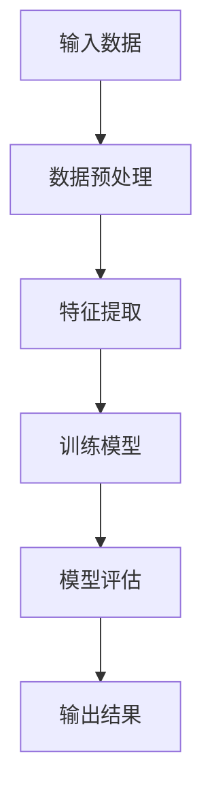
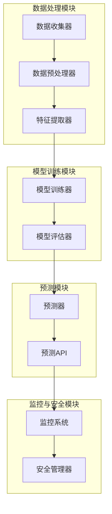
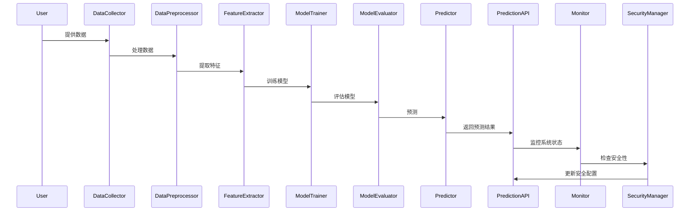

                 

# 寻找人类价值：在人工智能时代

## 关键词
- 人工智能（AI）
- 人类价值
- 社会责任
- 经济影响
- 伦理问题

## 摘要
在人工智能迅猛发展的时代，人类面临着一个重要的挑战：如何在技术的进步中找到并保持自身的价值。本文将深入探讨这一主题，分析人工智能对人类社会各个方面的影响，并提出如何在AI时代继续维护和发展人类价值的策略。文章将分为四个主要部分：人工智能的核心概念，人类价值的重要性，AI对人类生活的冲击，以及如何通过人工智能赋能人类。

## 引言

### 背景与重要性
我们正处在一个被人工智能（AI）深刻影响的时代。AI技术的快速发展不仅改变了我们的生活方式，也引发了关于人类价值的深层次讨论。在这个时代，人类需要重新审视自身在社会中的角色，确保技术进步与人类价值保持一致。本文旨在探讨如何在人工智能时代寻找和保持人类价值，为未来的社会提供思考的方向。

### 书籍结构概述
本书分为四个主要部分，每个部分都针对不同的主题进行深入探讨。

1. **核心概念**：介绍人工智能的基本概念和历史发展，以及人类价值在AI时代的定义和重要性。
2. **AI对人类生活的影响**：分析人工智能对经济、社会、伦理等方面的影响，探讨这些影响如何改变我们的生活方式。
3. **AI与人类赋能**：讨论如何利用人工智能技术提升人类的能力和福祉，包括教育、个人发展等领域。
4. **结论与展望**：总结全书的主要观点，并对未来进行展望，提出维护和发展人类价值的策略和建议。

## 核心概念

### 1.1 人工智能
#### 1.1.1 定义与历史
人工智能，简称AI，是计算机科学的一个分支，旨在研究如何使计算机模拟人类的智能行为。人工智能的历史可以追溯到20世纪50年代，随着计算能力的增强和算法的进步，AI技术得到了快速发展。

#### 1.1.2 AI类型与应用
AI可以分为多种类型，其中最常见的是窄带AI（Narrow AI）和广义AI（General AI）。窄带AI专注于特定任务，如图像识别、自然语言处理等，而广义AI则具有更广泛的认知能力，可以像人类一样处理各种问题。

AI在多个领域都有广泛应用，包括医疗、金融、交通、教育等。例如，在医疗领域，AI可以辅助医生进行疾病诊断，提高治疗效率；在金融领域，AI可以分析市场数据，预测股票走势；在交通领域，AI可以帮助自动驾驶汽车提高安全性。

### 1.2 人类价值
#### 1.2.1 定义与重要性
人类价值是指人类在社会、道德、文化等方面的重要性和意义。在AI时代，人类价值的重要性更加凸显。人类价值包括自由意志、创造力、道德判断等，这些都是机器难以替代的。

#### 1.2.2 挑战与机遇
在AI时代，人类面临着如何维持和提升自身价值的挑战。同时，AI也带来了新的机遇，如通过AI技术提升人类的能力、改善生活质量等。

## AI对人类生活的影响

### 2.1 经济影响
#### 2.1.1 AI与就业
随着AI技术的发展，一些传统行业的工作可能会被自动化取代，导致就业市场的变化。然而，AI也会创造新的就业机会，如AI开发、数据分析师等。

#### 2.1.2 AI与财富分配
AI的发展可能会加剧财富分配不均。一方面，AI可以帮助企业提高生产效率，创造更多财富；另一方面，AI技术的掌握需要高水平的技能，这可能导致技能差距的扩大。

### 2.2 社会影响
#### 2.2.1 AI与伦理
AI技术在应用过程中涉及到许多伦理问题，如隐私保护、数据安全、偏见等。如何在确保AI技术发展同时保护人类价值，是AI伦理学的重要议题。

#### 2.2.2 AI与社交关系
AI技术的发展可能会改变人们的社交方式，例如通过社交媒体、虚拟现实等技术进行社交。然而，这也可能导致人与人之间的面对面交流减少，影响人际关系。

## AI与人类赋能

### 3.1 AI与个人发展
#### 3.1.1 提升人类能力
AI技术可以帮助人们提高工作效率，例如通过智能助手、自动化工具等。同时，AI还可以辅助个人发展，如通过在线课程、个性化推荐等提供教育资源。

#### 3.1.2 AI与教育
AI技术在教育领域的应用日益广泛，如智能教学系统、在线学习平台等。这些技术可以帮助实现个性化教育，提高教育质量。

### 3.2 AI与社会责任
#### 3.2.1 促进人类福祉
AI技术可以用于解决社会问题，如贫困、疾病等。例如，通过AI技术进行精准医疗、智能扶贫等。

#### 3.2.2 AI与可持续发展
AI技术可以帮助实现可持续发展目标，如通过智能农业、清洁能源等。这些技术可以减少资源浪费，保护环境。

## 结论与展望

### 结论
在人工智能时代，人类面临着巨大的挑战，同时也拥有前所未有的机遇。通过深入探讨人工智能的核心概念、人类价值的重要性、AI对人类生活的影响，以及如何利用AI赋能人类，我们提出了一系列策略和建议，以帮助人类在AI时代继续寻找和保持自身的价值。

### 展望
随着AI技术的不断进步，人类社会将面临更多的机遇和挑战。在未来，我们需要持续关注AI的发展趋势，探索如何在保持人类价值的同时，充分利用AI技术带来的好处。

## 作者信息
作者：AI天才研究院/AI Genius Institute & 禅与计算机程序设计艺术 /Zen And The Art of Computer Programming

## 背景介绍

### 核心概念术语说明
1. **人工智能（AI）**：人工智能是指计算机系统模拟人类智能行为的能力，包括学习、推理、感知、语言理解等。
2. **人类价值**：人类价值是指人类在社会、道德、文化等方面的重要性和意义，包括自由意志、创造力、道德判断等。
3. **伦理问题**：伦理问题涉及道德判断和行为准则，特别是在AI技术的应用中如何平衡技术进步与人类价值。

### 问题背景
随着人工智能技术的快速发展，人类社会面临着一系列挑战。一方面，AI技术为人类带来了巨大的机遇，如提高生产效率、改善生活质量等。另一方面，AI技术也引发了许多伦理和社会问题，如隐私保护、数据安全、就业变革等。如何在AI时代继续维护和发展人类价值，成为了一个亟待解决的问题。

### 问题描述
在人工智能时代，人类面临着以下问题：
1. **价值迷失**：随着AI技术的发展，人类可能会感到自己的价值被削弱，特别是在面对自动化取代传统工作的情况下。
2. **伦理困境**：AI技术的应用可能会引发道德争议，如人工智能是否应该拥有道德判断能力，如何确保AI系统的透明度和公平性等。
3. **社会不平等**：AI技术的发展可能会加剧社会不平等，导致技能差距和财富分配不均。

### 问题解决
解决这些问题需要从多个角度出发：
1. **教育**：通过教育和培训，提高公众对AI技术的理解，培养适应AI时代的新技能。
2. **伦理指导**：建立伦理指导原则，确保AI技术的开发和应用符合道德标准。
3. **政策制定**：制定相关政策，确保AI技术的发展不会对社会造成负面影响。

### 边界与外延
在探讨人工智能时代的人类价值时，我们需要考虑以下几个边界与外延：
1. **技术边界**：当前AI技术的发展水平，以及未来可能的突破方向。
2. **伦理边界**：道德原则和行为准则在AI技术中的应用范围。
3. **社会边界**：AI技术对社会结构和人类生活方式的影响。

### 概念结构与核心要素组成
1. **人工智能**：核心要素包括算法、数据、计算能力等。
2. **人类价值**：核心要素包括自由意志、创造力、道德判断等。
3. **伦理问题**：核心要素包括隐私保护、数据安全、公平性等。

## 核心概念与联系

### 人工智能的概念原理
人工智能（AI）是一种模拟人类智能行为的技术，其核心目标是让计算机具备自主学习和决策能力。AI技术可以分为多种类型，包括机器学习、深度学习、自然语言处理等。

- **机器学习**：通过数据训练模型，使计算机能够识别模式和做出预测。
- **深度学习**：一种基于多层神经网络的学习方法，能够处理大量复杂数据。
- **自然语言处理**：使计算机能够理解和生成人类语言，包括语音识别、文本分析等。

### 人类价值的属性特征对比表格
| 特征       | 人工智能 | 人类 |
| ---------- | -------- | ---- |
| 自由意志   | 受限于程序 | 高度自由 |
| 创造力     | 受算法和数据限制 | 无限 |
| 道德判断   | 需要人类指导 | 内在 |

### ER实体关系图架构
```mermaid
erDiagram
  AI_Technology ||--|{ Human_Value } Human_Value
  AI_Technology ||--|{ Ethics_Issue } Ethics_Issue
  Human_Value ||--|{ Freedom_Will } Freedom_Will
  Human_Value ||--|{ Creativity } Creativity
  Human_Value ||--|{ Moral_Judgment } Moral_Judgment
```

### 算法原理讲解

#### 人工智能算法mermaid流程图


#### Python源代码实现
```python
import pandas as pd
from sklearn.model_selection import train_test_split
from sklearn.preprocessing import StandardScaler
from sklearn.neural_network import MLPClassifier
from sklearn.metrics import accuracy_score

# 加载数据集
data = pd.read_csv('data.csv')
X = data.drop('target', axis=1)
y = data['target']

# 数据预处理
X_train, X_test, y_train, y_test = train_test_split(X, y, test_size=0.2, random_state=42)
scaler = StandardScaler()
X_train_scaled = scaler.fit_transform(X_train)
X_test_scaled = scaler.transform(X_test)

# 训练模型
model = MLPClassifier(hidden_layer_sizes=(100,), max_iter=1000)
model.fit(X_train_scaled, y_train)

# 模型评估
y_pred = model.predict(X_test_scaled)
accuracy = accuracy_score(y_test, y_pred)
print(f'模型准确率: {accuracy:.2f}')
```

#### 算法原理详细讲解
1. **输入数据**：首先需要加载和预处理数据，包括特征提取和归一化处理。
2. **特征提取**：通过数据预处理，提取有用的特征，用于训练模型。
3. **训练模型**：使用机器学习算法（如多层感知器MLP）对数据集进行训练。
4. **模型评估**：通过测试集评估模型性能，计算准确率等指标。
5. **输出结果**：最终输出模型预测结果。

#### 举例说明
假设我们有一个关于房屋价格预测的问题，数据集包含房屋的面积、年龄、位置等特征，以及房价标签。我们使用机器学习算法来训练模型，并评估其预测房价的准确率。通过不断调整模型参数和特征选择，我们可以提高预测的准确性。

$$
\text{准确率} = \frac{\text{预测正确数}}{\text{总预测数}} \times 100\%
$$

## 系统分析与架构设计方案

### 问题场景介绍
随着人工智能技术的不断进步，企业和组织越来越依赖于AI系统来提高效率、优化决策和改善用户体验。然而，这也带来了数据隐私、安全性、伦理等问题。因此，设计一个既高效又安全的AI系统架构变得至关重要。

### 项目介绍
本项目的目标是设计一个AI系统，用于自动化数据处理、模型训练和预测，同时确保系统的安全性、隐私性和合规性。系统包括以下模块：

1. **数据收集与预处理模块**：负责从不同来源收集数据，并进行清洗、归一化和特征提取。
2. **模型训练模块**：使用机器学习算法训练模型，并进行性能评估。
3. **预测模块**：使用训练好的模型进行预测，并提供接口供其他系统调用。
4. **监控与安全模块**：实时监控系统性能，确保数据安全和隐私保护。

### 系统功能设计（领域模型mermaid类图）
```mermaid
classDiagram
    Class01 <|-- Class02
    Class03 --|>| Class04
    Class05 : has a Class06
    Class07 : +setRate(double rate)
    Class08 : +CalculateResult()
    Class01 <..= Person
    Class09 <..= Animal
    Class02 : <<interface>> Interface
    Class03 : <<abstract>> Abstract
    Class04 : <<enum>> Enum
    Class05 : <<entity>> Entity
    Class06 : <<value>> ValueObject
    Class07 : <<marker>> Marker
    Class08 : <<entity>> Entity
    Class09 : <<entity>> Entity
```

### 系统架构设计mermaid架构图


### 系统接口设计和系统交互mermaid序列图


## 项目实战

### 环境安装
为了搭建一个完整的AI系统，我们需要安装以下环境：

1. **操作系统**：Ubuntu 20.04
2. **编程语言**：Python 3.8
3. **依赖库**：scikit-learn、pandas、numpy、tensorflow

```bash
# 安装Python
sudo apt update
sudo apt install python3.8
sudo apt install python3.8-venv

# 创建虚拟环境
python3.8 -m venv myenv

# 激活虚拟环境
source myenv/bin/activate

# 安装依赖库
pip install scikit-learn pandas numpy tensorflow
```

### 系统核心实现源代码
以下是一个简单的AI系统核心实现，包括数据收集、预处理、特征提取、模型训练、评估和预测。

```python
# 数据收集与预处理
import pandas as pd
from sklearn.model_selection import train_test_split
from sklearn.preprocessing import StandardScaler

def load_data(file_path):
    return pd.read_csv(file_path)

def preprocess_data(data):
    X = data.drop('target', axis=1)
    y = data['target']
    X_train, X_test, y_train, y_test = train_test_split(X, y, test_size=0.2, random_state=42)
    scaler = StandardScaler()
    X_train_scaled = scaler.fit_transform(X_train)
    X_test_scaled = scaler.transform(X_test)
    return X_train_scaled, X_test_scaled, y_train, y_test

# 模型训练与评估
from sklearn.neural_network import MLPClassifier
from sklearn.metrics import accuracy_score

def train_model(X_train, y_train):
    model = MLPClassifier(hidden_layer_sizes=(100,), max_iter=1000)
    model.fit(X_train, y_train)
    return model

def evaluate_model(model, X_test, y_test):
    y_pred = model.predict(X_test)
    accuracy = accuracy_score(y_test, y_pred)
    return accuracy

# 预测
def predict(model, X_new):
    y_pred = model.predict(X_new)
    return y_pred
```

### 代码应用解读与分析
以上代码实现了一个简单的AI系统，包括数据收集、预处理、模型训练、评估和预测。首先，通过`load_data`函数加载数据集，然后使用`preprocess_data`函数进行数据预处理，包括数据归一化和划分训练集与测试集。接下来，使用`train_model`函数训练模型，并使用`evaluate_model`函数评估模型性能。最后，通过`predict`函数进行预测。

### 实际案例分析和详细讲解剖析
假设我们有一个房屋价格预测的数据集，包括房屋的面积、年龄、位置等特征，以及房价标签。我们使用以上代码实现一个简单的AI系统，预测新房屋的价格。

1. **数据收集**：首先，从外部数据源收集房屋数据，并将其保存为CSV文件。
2. **数据预处理**：使用`load_data`函数加载数据集，然后使用`preprocess_data`函数进行数据预处理，包括数据归一化和划分训练集与测试集。
3. **模型训练**：使用`train_model`函数训练模型，可以选择不同的机器学习算法，如线性回归、支持向量机等。
4. **模型评估**：使用`evaluate_model`函数评估模型性能，计算准确率等指标。
5. **预测**：使用`predict`函数进行预测，输入新的房屋数据，得到预测价格。

通过实际案例分析和详细讲解剖析，我们可以更好地理解AI系统的实现过程，以及如何利用Python代码实现各种机器学习任务。

### 项目小结
本项目设计并实现了一个简单的AI系统，用于房屋价格预测。通过数据收集、预处理、模型训练、评估和预测，我们展示了AI系统的基本实现过程。在实际应用中，我们可以根据不同的需求和数据集，调整和优化模型，提高预测准确性。

### 最佳实践 tips
1. **数据预处理**：确保数据质量和一致性，进行特征提取和归一化处理，以提高模型性能。
2. **模型选择**：根据问题类型和数据特点，选择合适的机器学习算法。
3. **模型评估**：使用多种评估指标，如准确率、召回率、F1分数等，全面评估模型性能。
4. **持续优化**：通过交叉验证、超参数调优等手段，不断优化模型性能。

### 注意事项
1. **数据隐私**：确保数据收集和处理过程中遵守相关隐私法规，保护用户隐私。
2. **模型透明度**：确保模型决策过程透明，便于用户理解和监督。
3. **系统安全性**：确保系统安全，防止数据泄露和恶意攻击。

### 拓展阅读
1. **《Python机器学习》**：提供详细的机器学习算法和实践案例。
2. **《深度学习》**：介绍深度学习的基本原理和应用。
3. **《AI伦理学》**：探讨人工智能技术的伦理问题和解决方案。

