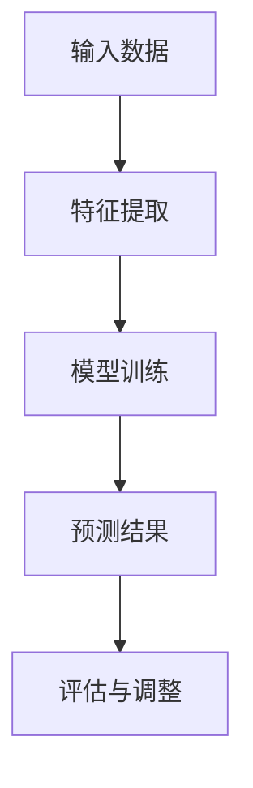

                 

**目录大纲结构如下：**

# 在人工智能时代重新审视人类价值

> 关键词：人工智能、人类价值、伦理学、社会影响、未来趋势

> 摘要：本文将深入探讨人工智能时代人类价值的重新审视，包括核心概念的定义、人工智能对社会和伦理的影响，以及未来人类价值的展望。文章将通过逻辑清晰的章节结构，逐步分析人工智能对人类社会的挑战与机遇，并提出相应的解决方案和建议。

## 引言

### 1.1 人工智能时代的到来

### 1.2 人类价值的重新审视

### 1.3 文章的目的和结构

## 第一节：核心概念与联系

### 2.1 人类价值的定义

#### 2.1.1 文化价值

#### 2.1.2 伦理价值

#### 2.1.3 社会价值

### 2.2 人工智能的基本概念

#### 2.2.1 人工智能的发展历程

#### 2.2.2 人工智能的分类

### 2.3 关系图

## 第二节：理论原理与数学模型

### 3.1 人工智能的理论原理

#### 3.1.1 机器学习的原理

#### 3.1.2 深度学习的原理

### 3.2 伦理学的基本原理

#### 3.2.1 伦理学的起源与发展

#### 3.2.2 人工智能伦理学的挑战

### 3.3 数学模型

#### 3.3.1 机器学习的数学模型

#### 3.3.2 深度学习的数学模型

## 第三节：系统分析与架构设计

### 4.1 问题场景介绍

### 4.2 项目介绍

### 4.3 系统功能设计

### 4.4 系统架构设计

### 4.5 系统接口设计与系统交互

## 第四节：项目实战

### 4.6 环境安装

### 4.7 系统核心实现

### 4.8 代码应用解读与分析

### 4.9 实际案例分析

### 4.10 项目小结

## 第五节：最佳实践与展望

### 5.1 最佳实践

### 5.2 未来展望

### 5.3 注意事项

### 5.4 拓展阅读

## 结论

### 6.1 文章总结

### 6.2 对未来人工智能时代的期待

### 6.3 作者信息

---

**Step 2: Writing the Content**

Once the directory outline is set, the next step is to write the content for each section. Below are the placeholders and a brief overview of what each section might include.

**Introduction**

- **1.1 人工智能时代的到来**：介绍人工智能技术发展的背景和当前的应用情况。
- **1.2 人类价值的重新审视**：探讨在人工智能时代，人类价值观面临的变化和挑战。
- **1.3 文章的目的和结构**：明确文章的目标和结构，为读者提供清晰的阅读指南。

**第一节：核心概念与联系**

- **2.1 人类价值的定义**：详细解释文化价值、伦理价值和社会价值的概念。
- **2.2 人工智能的基本概念**：介绍人工智能的发展历程、分类和应用。
- **2.3 关系图**：使用Mermaid绘制人类价值和人工智能概念的ER图。

**第二节：理论原理与数学模型**

- **3.1 人工智能的理论原理**：分析机器学习和深度学习的基本原理。
- **3.2 伦理学的基本原理**：讨论伦理学的基本原则和人工智能伦理学的挑战。
- **3.3 数学模型**：运用LaTeX和Mermaid介绍机器学习和深度学习的数学模型。

**第三节：系统分析与架构设计**

- **4.1 问题场景介绍**：描述与人工智能相关的问题场景。
- **4.2 项目介绍**：介绍一个具体的项目或案例。
- **4.3 系统功能设计**：使用Mermaid绘制领域模型图。
- **4.4 系统架构设计**：使用Mermaid绘制系统架构图。
- **4.5 系统接口设计与系统交互**：介绍系统接口设计和交互流程。

**第四节：项目实战**

- **4.6 环境安装**：说明如何安装项目所需的环境。
- **4.7 系统核心实现**：提供系统的核心实现源代码。
- **4.8 代码应用解读与分析**：解读系统代码并分析其应用。
- **4.9 实际案例分析**：介绍实际案例并进行分析。
- **4.10 项目小结**：总结项目的经验和教训。

**第五节：最佳实践与展望**

- **5.1 最佳实践**：提供在人工智能时代下实践的最佳建议。
- **5.2 未来展望**：探讨人工智能的未来发展趋势。
- **5.3 注意事项**：提醒读者在实践中的注意事项。
- **5.4 拓展阅读**：推荐相关阅读材料。

**结论**

- **6.1 文章总结**：概括文章的主要观点。
- **6.2 对未来人工智能时代的期待**：表达对人工智能未来的期待。
- **6.3 作者信息**：介绍作者的身份和背景。

---

**Step 3: Writing in Markdown Format**

With the content structured, the next step is to write the actual article in Markdown format. This will involve formatting text, adding images, code snippets, and using Mermaid for diagrams. Below are some examples of how certain sections might be formatted in Markdown.

**Example of a Markdown Section with LaTeX and Mermaid**

```markdown
## 第二节：理论原理与数学模型

### 3.1 人工智能的理论原理

在人工智能的理论原理部分，我们将讨论机器学习的原理。

#### 3.1.1 机器学习的原理

机器学习是一种使计算机通过数据学习并做出决策的方法。其基本原理包括：

$$
P(A|B) = \frac{P(B|A)P(A)}{P(B)}
$$

这称为贝叶斯定理，用于在已知部分信息的情况下更新概率估计。

使用Mermaid，我们可以绘制一个简单的机器学习流程图：



通过这个流程，我们可以看到机器学习的基本步骤。
```

In this Markdown section, the LaTeX equation is enclosed within `$$` for display style and `$` for inline style. The Mermaid diagram is placed directly in the Markdown text, with no need for external files.

---

**Final Step: Review and Edit**

After writing the entire article in Markdown format, the final step is to review and edit the content for accuracy, clarity, and coherence. This may involve multiple iterations of refining paragraphs, checking diagrams for correctness, and ensuring that all LaTeX and Mermaid code is properly formatted and executes as intended.

**Note:** The actual content for each section will require detailed research and thoughtful consideration to ensure it meets the requirements outlined in the initial task. This response provides a framework and examples to guide the writing process.

