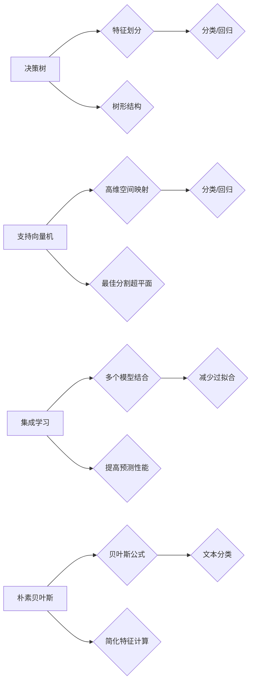

                 

### 第1章：引言

#### 1.1 问题的提出

在当今这个数字化和信息化的时代，信息已经渗透到了社会生活的方方面面。无论是个人生活还是企业运作，信息的获取、处理和应用都变得至关重要。然而，随着互联网的飞速发展，信息量的爆炸式增长给人们带来了前所未有的挑战。如何在海量信息中快速、准确地找到有价值的信息，成为了每一个信息使用者面临的问题。

#### 1.2 信息爆炸的挑战

信息爆炸带来的挑战主要体现在以下几个方面：

1. **信息过载**：每天都会产生大量的信息，这些信息不仅包括文字、图片、音频和视频，还包括各种形式的数据。人们很难在有限的时间内处理如此海量的信息。

2. **信息真实性**：互联网上的信息真假难辨，虚假信息和误导性信息层出不穷。如何在信息海洋中辨别真伪，是每一个信息使用者都需要面对的问题。

3. **信息利用效率**：即使找到了有价值的信息，如何高效地利用这些信息，从而产生实际的效益，也是一个重要的问题。

#### 1.3 智慧寻找的必要性

面对信息爆炸带来的挑战，单纯依靠人力去处理信息已经变得不可行。这就需要借助计算机技术和人工智能技术，利用算法和信息处理技术来帮助人们从海量信息中寻找智慧明珠。

1. **提高效率**：通过算法自动化处理信息，可以大大提高信息处理的速度和效率。

2. **提升准确性**：算法可以基于大量的数据和信息进行学习，从而提高信息处理的准确性和可靠性。

3. **智能决策**：通过算法分析信息，可以帮助企业或个人做出更加明智的决策。

#### 1.4 本书的目标与结构

本书的目标是帮助读者理解信息处理和智慧寻找的基本原理，掌握关键的技术和方法，从而能够有效地应对信息爆炸带来的挑战。本书的结构分为三个部分：

1. **第一部分：信息处理的基础**：介绍信息与数据的基本概念，信息处理技术的基本流程和分类，以及当前信息处理技术的应用领域。

2. **第二部分：智慧寻找的实际应用**：通过具体的案例，详细讲解智能推荐系统、文本挖掘与自然语言处理、大数据与智能决策等实际应用。

3. **第三部分：未来展望与总结**：探讨信息处理技术的未来发展趋势，并对全书进行总结和展望。

通过本书的阅读，读者将能够：

1. **理解信息处理的基本原理**：掌握信息与数据的概念，以及信息处理的基本流程和技术。

2. **掌握智慧寻找的方法**：了解各种信息处理算法的原理，掌握如何在实际应用中利用这些算法来寻找智慧明珠。

3. **提升信息处理和利用的能力**：通过案例学习，提升在实际项目中应用信息处理和智慧寻找技术的能力。

### 目录

#### 第1章：引言
##### 1.1 问题的提出
##### 1.2 信息爆炸的挑战
##### 1.3 智慧寻找的必要性
##### 1.4 本书的目标与结构

#### 第2章：信息处理的基础
##### 2.1 信息与数据
###### 2.1.1 信息的定义
###### 2.1.2 数据的类型
###### 2.1.3 信息与数据的差异
##### 2.2 信息处理技术简介
###### 2.2.1 信息处理的基本流程
###### 2.2.2 信息处理技术的分类
###### 2.2.3 当前信息处理技术的应用领域

#### 第3章：智慧寻找的关键要素
##### 3.1 智慧的定义与特征
###### 3.1.1 智慧的定义
###### 3.1.2 智慧的特征
###### 3.1.3 智慧的层次结构
##### 3.2 智慧寻找的关键要素
###### 3.2.1 数据质量
###### 3.2.2 算法效率
###### 3.2.3 决策逻辑

#### 第4章：信息处理算法详解
##### 4.1 基本算法概述
###### 4.1.1 算法分类
###### 4.1.2 算法评价标准
###### 4.1.3 算法的选择与优化
##### 4.2 算法原理详解
###### 4.2.1 算法原理
###### 4.2.2 算法属性特征对比
###### 4.2.3 算法ER实体关系图
##### 4.3 算法实践与应用
###### 4.3.1 Python代码实现
###### 4.3.2 算法原理讲解
###### 4.3.3 算法举例说明

#### 第5章：智能推荐系统
##### 5.1 推荐系统概述
###### 5.1.1 推荐系统的定义
###### 5.1.2 推荐系统的分类
###### 5.1.3 推荐系统的目标
##### 5.2 推荐算法原理与实践
###### 5.2.1 协同过滤算法
###### 5.2.2 内容推荐算法
###### 5.2.3 混合推荐算法
##### 5.3 推荐系统案例分析
###### 5.3.1 案例一：电商平台推荐
###### 5.3.2 案例二：社交媒体推荐

#### 第6章：文本挖掘与自然语言处理
##### 6.1 文本挖掘概述
###### 6.1.1 文本挖掘的定义
###### 6.1.2 文本挖掘的任务
###### 6.1.3 文本挖掘的应用领域
##### 6.2 自然语言处理算法
###### 6.2.1 词向量模型
###### 6.2.2 语法分析算法
###### 6.2.3 情感分析算法
##### 6.3 文本挖掘实践与应用
###### 6.3.1 社交媒体文本分析
###### 6.3.2 财经新闻文本挖掘

#### 第7章：大数据与智能决策
##### 7.1 大数据概述
###### 7.1.1 大数据的定义
###### 7.1.2 大数据的特点
###### 7.1.3 大数据的应用场景
##### 7.2 智能决策算法
###### 7.2.1 决策树算法
###### 7.2.2 支持向量机算法
###### 7.2.3 神经网络算法
##### 7.3 大数据与智能决策实践
###### 7.3.1 销售预测
###### 7.3.2 客户关系管理

#### 第8章：智慧寻找的未来发展趋势
##### 8.1 信息处理技术的未来发展方向
###### 8.1.1 量子计算与信息处理
###### 8.1.2 生物计算与信息处理
###### 8.1.3 分布式计算与信息处理
##### 8.2 智慧寻找的创新领域
###### 8.2.1 智能医疗
###### 8.2.2 智慧城市
###### 8.2.3 自动驾驶

#### 第9章：本书总结与展望
##### 9.1 本书的核心内容回顾
##### 9.2 对未来信息处理的思考
##### 9.3 阅读本书的建议与收获

#### 附录
##### 附录A：术语表
##### 附录B：参考

### 第二部分：信息处理的基础

在信息时代，信息处理已经成为了各类应用和系统中不可或缺的一部分。从大数据分析到人工智能，从互联网服务到企业管理系统，信息处理技术贯穿了整个数字化社会的方方面面。本章将深入探讨信息与数据的基本概念，信息处理技术的基本流程，以及当前信息处理技术的应用领域。

#### 2.1 信息与数据

**2.1.1 信息的定义**

信息，简单来说，就是关于客观事实的传达。在技术层面，信息可以被定义为数据的有意义的形式。信息传递是信息社会的基础，无论是人与人之间的交流，还是人与机器之间的互动，信息的传递都是核心。

**2.1.2 数据的类型**

数据可以分为结构化和非结构化两大类：

- **结构化数据**：这类数据是有组织的，通常以表格的形式存储，例如数据库中的记录。结构化数据易于处理和分析，因为它们有明确的格式和结构。

- **非结构化数据**：这类数据没有固定的格式，通常包括文本、图像、音频和视频等。非结构化数据往往更为复杂，但它们包含的信息也非常丰富。

**2.1.3 信息与数据的差异**

信息与数据的主要区别在于它们的语义和意义。数据是信息的基础，而信息则是通过数据解释和加工后的结果。例如，一张照片（数据）在经过人的识别和解释后，变成了对某一场景的信息。

#### 2.2 信息处理技术简介

**2.2.1 信息处理的基本流程**

信息处理的基本流程通常包括以下几个步骤：

1. **采集**：收集原始数据，这些数据可以来自于传感器、数据库或网络等。

2. **预处理**：对采集到的数据进行清洗、去噪、格式化等处理，以去除无关信息，提高数据质量。

3. **存储**：将处理后的数据存储到数据库或文件系统中，以便后续分析和使用。

4. **分析**：使用各种算法和技术对数据进行统计分析、模式识别等操作，提取出有用的信息和知识。

5. **呈现**：将分析结果以图表、报告等形式呈现给用户，帮助用户理解和决策。

**2.2.2 信息处理技术的分类**

信息处理技术可以根据其应用领域和技术特点进行分类：

- **数据管理技术**：如数据库管理、数据仓库等，主要用于数据的存储、查询和管理。

- **数据挖掘技术**：如分类、聚类、关联规则挖掘等，主要用于从大量数据中提取有价值的信息。

- **自然语言处理**：如文本分类、情感分析、机器翻译等，主要用于处理和解析文本数据。

- **图像处理技术**：如图像识别、图像分割、图像增强等，主要用于处理和识别图像数据。

- **音频处理技术**：如语音识别、音频分类等，主要用于处理和识别音频数据。

**2.2.3 当前信息处理技术的应用领域**

当前信息处理技术已经在多个领域得到广泛应用：

- **金融**：通过大数据分析进行风险评估、欺诈检测和智能投顾等。

- **医疗**：通过医疗图像分析和电子健康记录系统进行疾病诊断和健康管理。

- **电商**：通过推荐系统和客户行为分析进行个性化推荐和营销策略制定。

- **交通**：通过交通数据分析进行交通流量预测、路线规划和智能交通管理。

- **教育**：通过在线教育平台和智能教学系统进行个性化教学和成绩分析。

### 总结

信息处理技术是信息时代的关键技术，它贯穿了从数据采集、预处理到分析、呈现的整个过程。掌握信息处理技术，不仅能够提高信息利用的效率，还能够帮助我们更好地应对信息爆炸带来的挑战。在接下来的章节中，我们将进一步深入探讨信息处理算法的原理和实践应用，帮助读者理解并掌握这些核心技术。

### 第三部分：智慧寻找的关键要素

在信息爆炸的时代，如何从海量信息中寻找到有价值的智慧，成为了信息处理的核心任务。要实现这一目标，我们需要关注以下几个关键要素：数据质量、算法效率以及决策逻辑。

#### 3.1 智慧的定义与特征

**3.1.1 智慧的定义**

智慧，可以理解为对信息的深刻理解、合理运用和创新创造的能力。它不仅包括对已知知识的掌握，还涉及对新知识的探索和应用。

**3.1.2 智慧的特征**

- **系统性**：智慧涉及对多个方面和多个层次信息的整合和理解。
- **创新性**：智慧不仅仅是知识的积累，更重要的是能够运用这些知识进行创新。
- **应用性**：智慧需要有实际应用价值，能够解决实际问题。

**3.1.3 智慧的层次结构**

智慧可以划分为以下几个层次：

1. **信息层**：对信息的基本理解和使用，例如简单的数据处理和分析。
2. **知识层**：对信息的深入理解和应用，例如在特定领域内的专业知识和应用。
3. **智能层**：运用创新思维解决复杂问题，例如人工智能和机器学习等。

#### 3.2 智慧寻找的关键要素

**3.2.1 数据质量**

数据质量是智慧寻找的基础。高质量的数据能够确保分析和决策的准确性。数据质量的关键指标包括：

- **准确性**：数据是否真实可靠，没有错误或遗漏。
- **完整性**：数据是否齐全，没有缺失值。
- **一致性**：数据在不同来源或不同时间是否一致。
- **时效性**：数据是否反映了最新的情况。

**3.2.2 算法效率**

算法效率是提高智慧寻找速度的关键。高效的算法能够快速处理大量数据，从而迅速找到有价值的信息。算法效率的关键指标包括：

- **计算速度**：算法处理数据所需的时间。
- **内存占用**：算法在处理数据时占用的内存资源。
- **并行性**：算法是否能够并行处理多个数据集，提高处理速度。

**3.2.3 决策逻辑**

决策逻辑是智慧寻找的最终目标。一个有效的决策逻辑能够确保从海量信息中找到最有价值的部分，并做出合理的决策。决策逻辑的关键包括：

- **目标明确**：决策逻辑需要基于明确的目标和需求，确保找到的信息能够满足这些目标。
- **逻辑严谨**：决策逻辑需要具备严密的逻辑性和逻辑一致性，避免因逻辑错误导致决策失误。
- **灵活调整**：决策逻辑需要具备一定的灵活性，能够根据新的信息和需求进行调整。

#### 3.3 智慧寻找的实践

在智慧寻找的实践中，我们需要综合考虑数据质量、算法效率以及决策逻辑这三个关键要素。以下是一个简化的实践步骤：

1. **数据准备**：确保数据质量，进行数据清洗和预处理，以提高数据的质量和可用性。
2. **算法选择**：根据具体问题和需求，选择合适的算法，并考虑算法的效率和适用性。
3. **模型训练**：使用高质量的数据对算法模型进行训练，以提高模型的准确性和效率。
4. **决策逻辑设计**：设计合理的决策逻辑，确保从海量信息中找到最有价值的信息，并做出有效的决策。
5. **迭代优化**：根据实际应用效果，对算法模型和决策逻辑进行不断迭代和优化。

### 总结

智慧寻找是一个复杂而关键的任务，需要综合考虑数据质量、算法效率和决策逻辑等多个方面。通过有效的数据准备、算法选择和决策逻辑设计，我们能够在信息海洋中寻找到最有价值的智慧明珠。在接下来的章节中，我们将进一步深入探讨信息处理算法的原理和实践应用，帮助读者更好地掌握这些核心技术。

### 第四部分：信息处理算法详解

信息处理算法是智慧寻找的核心，它们通过不同的原理和技术，从海量数据中提取有价值的信息。本章节将详细介绍信息处理算法的基本概念、原理详解和实践应用。

#### 4.1 基本算法概述

**4.1.1 算法分类**

信息处理算法可以根据处理方式和目标进行分类：

- **数据处理算法**：包括数据清洗、归一化、聚类等，主要用于数据的预处理。
- **数据挖掘算法**：包括关联规则挖掘、分类、聚类等，主要用于从大量数据中提取有价值的信息。
- **自然语言处理算法**：包括分词、词性标注、情感分析等，主要用于处理和解析文本数据。
- **图像处理算法**：包括图像识别、图像分割、图像增强等，主要用于处理和识别图像数据。

**4.1.2 算法评价标准**

算法评价标准主要包括：

- **准确性**：算法预测或分类的正确率。
- **效率**：算法处理数据所需的时间。
- **泛化能力**：算法在未知数据上的表现。
- **可解释性**：算法决策过程是否易于理解和解释。

**4.1.3 算法的选择与优化**

选择和优化算法需要考虑以下几个因素：

- **数据特点**：根据数据类型和特点选择合适的算法。
- **计算资源**：考虑算法对计算资源和内存的需求。
- **应用场景**：根据具体应用场景选择最合适的算法。
- **迭代优化**：通过交叉验证和调整参数，提高算法性能。

#### 4.2 算法原理详解

**4.2.1 算法原理**

信息处理算法的原理可以分为以下几个方面：

1. **机器学习**：基于数据和经验，通过学习算法自动改进和优化。
2. **深度学习**：通过多层神经网络，自动提取特征并进行分类和预测。
3. **贝叶斯理论**：基于概率模型，通过贝叶斯公式进行推理和预测。
4. **决策树和随机森林**：通过树形结构，对数据进行分类和回归。

**4.2.2 算法属性特征对比**

以下是几种常见信息处理算法的属性特征对比：

| 算法名称 | 原理 | 特点 | 适用场景 |
| :--: | :--: | :--: | :--: |
| 决策树 | 基于特征划分数据，构建树形结构 | 易理解，可解释性高 | 分类和回归问题 |
| 支持向量机 | 将数据映射到高维空间，寻找最佳分割超平面 | 高效，泛化能力强 | 二分类问题 |
| 集成学习 | 结合多个模型，提高预测性能 | 减少过拟合，提高准确性 | 复杂问题 |
| 朴素贝叶斯 | 基于贝叶斯公式，简化特征计算 | 简单，快速 | 文本分类问题 |

**4.2.3 算法ER实体关系图**

以下是几种常见信息处理算法的ER实体关系图：



#### 4.3 算法实践与应用

**4.3.1 Python代码实现**

以下是使用Python实现决策树算法的示例代码：

```python
from sklearn.datasets import load_iris
from sklearn.model_selection import train_test_split
from sklearn.tree import DecisionTreeClassifier
from sklearn import tree

# 加载鸢尾花数据集
iris = load_iris()
X = iris.data
y = iris.target

# 划分训练集和测试集
X_train, X_test, y_train, y_test = train_test_split(X, y, test_size=0.3, random_state=42)

# 创建决策树分类器
clf = DecisionTreeClassifier()

# 训练模型
clf.fit(X_train, y_train)

# 预测
y_pred = clf.predict(X_test)

# 评估模型
accuracy = clf.score(X_test, y_test)
print(f"模型准确率：{accuracy:.2f}")
```

**4.3.2 算法原理讲解**

决策树算法基于特征划分数据，构建树形结构，对数据进行分类或回归。每个节点代表一个特征，每个分支代表该特征的一个取值。叶子节点表示最终的分类或回归结果。

**4.3.3 算法举例说明**

假设我们有一个鸢尾花数据集，包含三种鸢尾花（Iris setosa、Iris virginica、Iris versicolor），每个样本有四个特征：花萼长度、花萼宽度、花瓣长度和花瓣宽度。我们可以使用决策树算法来分类这三种鸢尾花。

1. **训练模型**：首先，我们将数据集划分为训练集和测试集，然后使用训练集来训练决策树模型。
2. **预测分类**：使用训练好的模型对测试集进行预测，得到每个测试样本的分类结果。
3. **评估模型**：最后，我们评估模型的准确率，确保模型能够正确分类大部分测试样本。

通过这一步骤，我们可以在信息海洋中寻找到有价值的智慧明珠，实现有效的信息处理和决策。

### 总结

信息处理算法是智慧寻找的核心，通过不同的原理和技术，从海量数据中提取有价值的信息。在本章节中，我们介绍了信息处理算法的基本概念、原理详解和实践应用。掌握这些算法，有助于我们在信息爆炸的时代中更加有效地应对挑战，找到有价值的智慧。在接下来的章节中，我们将继续探讨智慧寻找在实际应用中的具体案例，帮助读者更好地理解信息处理算法的实用价值。

### 第五部分：智能推荐系统

智能推荐系统是信息处理和智慧寻找在实际应用中的一个重要领域，它通过分析用户行为和偏好，为用户提供个性化的推荐。本章节将深入探讨智能推荐系统的基本概念、推荐算法原理与实践、以及具体案例分析。

#### 5.1 推荐系统概述

**5.1.1 推荐系统的定义**

推荐系统是一种信息过滤技术，旨在根据用户的历史行为和偏好，向用户推荐其可能感兴趣的内容或商品。推荐系统广泛应用于电子商务、社交媒体、视频流媒体等领域。

**5.1.2 推荐系统的分类**

推荐系统可以分为以下几类：

- **基于内容的推荐**：根据用户的历史行为和偏好，推荐与用户已喜欢的内容相似的其他内容。
- **协同过滤推荐**：通过分析用户之间的相似性，推荐其他用户喜欢的但用户尚未体验的内容。
- **混合推荐**：结合基于内容和协同过滤推荐的方法，提高推荐系统的准确性和多样性。

**5.1.3 推荐系统的目标**

推荐系统的核心目标是提高用户满意度和系统粘性，具体包括：

- **准确性**：推荐的内容或商品能够真正符合用户的兴趣和需求。
- **多样性**：推荐的内容或商品能够覆盖用户的不同兴趣点。
- **新颖性**：推荐的内容或商品能够具有新颖性和独特性，避免用户感到厌倦。

#### 5.2 推荐算法原理与实践

**5.2.1 协同过滤算法**

协同过滤推荐是基于用户之间相似度的一种推荐方法，主要包括以下两种类型：

- **用户基于的协同过滤**：通过计算用户之间的相似度，推荐其他用户喜欢的但目标用户尚未体验的内容。
- **项基于的协同过滤**：通过计算用户对项目的评分，推荐目标用户可能喜欢的其他项目。

**协同过滤算法的步骤**：

1. **用户相似度计算**：使用余弦相似度、皮尔逊相关系数等方法计算用户之间的相似度。
2. **评分预测**：基于用户相似度矩阵，预测用户对未评分项目的评分。
3. **推荐生成**：根据评分预测结果，生成推荐列表。

**5.2.2 内容推荐算法**

基于内容推荐是通过分析内容特征，推荐与用户偏好相似的内容。其主要步骤包括：

1. **特征提取**：提取文本、图像、音频等内容的特征，如词向量、视觉特征、音频特征等。
2. **相似度计算**：计算用户和内容之间的特征相似度。
3. **推荐生成**：根据相似度结果，推荐用户可能感兴趣的内容。

**5.2.3 混合推荐算法**

混合推荐算法结合了基于内容和协同过滤推荐的优势，以提高推荐系统的准确性和多样性。其主要方法包括：

- **加权融合**：将基于内容和协同过滤的推荐结果进行加权融合，生成最终的推荐列表。
- **矩阵分解**：使用矩阵分解技术，将用户-项目评分矩阵分解为用户特征矩阵和项目特征矩阵，然后进行推荐。

#### 5.3 推荐系统案例分析

**5.3.1 案例一：电商平台推荐**

电商平台推荐系统通过分析用户的历史购买行为、浏览记录和搜索关键词，推荐用户可能感兴趣的商品。推荐算法结合了协同过滤和基于内容推荐，以提高推荐准确性。

1. **用户画像构建**：通过用户行为数据，构建用户画像，包括用户的兴趣爱好、购买偏好等。
2. **协同过滤推荐**：计算用户之间的相似度，推荐其他用户喜欢的商品。
3. **内容推荐**：根据商品的特征，推荐与用户偏好相似的商品。
4. **推荐列表生成**：将协同过滤和内容推荐的推荐结果进行融合，生成最终的推荐列表。

**5.3.2 案例二：社交媒体推荐**

社交媒体推荐系统通过分析用户的行为和互动，推荐用户可能感兴趣的内容和用户。推荐算法主要包括基于内容的推荐和协同过滤推荐。

1. **内容特征提取**：提取帖子的文本、图像、视频等特征。
2. **用户行为分析**：分析用户的点赞、评论、分享等行为，构建用户兴趣模型。
3. **协同过滤推荐**：计算用户之间的相似度，推荐其他用户喜欢的帖子。
4. **推荐列表生成**：根据用户兴趣模型和协同过滤推荐结果，生成推荐列表。

### 总结

智能推荐系统是信息处理和智慧寻找在实际应用中的一个重要领域，通过协同过滤、基于内容和混合推荐算法，为用户提供了个性化的推荐服务。在电商平台和社交媒体等具体应用场景中，推荐系统极大地提升了用户体验和系统粘性。在接下来的章节中，我们将继续探讨文本挖掘和自然语言处理等领域，帮助读者进一步了解信息处理算法的广泛应用和实际价值。

### 第六部分：文本挖掘与自然语言处理

文本挖掘和自然语言处理（NLP）是信息处理领域的重要组成部分，它们通过分析文本数据，帮助人们从大量文本中提取有价值的信息。本章节将详细介绍文本挖掘的基本概念、自然语言处理算法，以及具体的实践与应用。

#### 6.1 文本挖掘概述

**6.1.1 文本挖掘的定义**

文本挖掘，也称为文本数据挖掘，是指使用计算机技术和算法，从大量的文本数据中提取有用信息的过程。文本挖掘的目标包括信息检索、关键词提取、主题建模、情感分析等。

**6.1.2 文本挖掘的任务**

文本挖掘的主要任务包括：

- **文本分类**：将文本数据分类到预定义的类别中，例如垃圾邮件检测、情感分类等。
- **关键词提取**：识别文本中的重要词语，用于文本摘要、信息检索等。
- **主题建模**：发现文本数据中的潜在主题或模式，例如隐含狄利克雷分配（LDA）算法。
- **情感分析**：分析文本中的情感倾向，例如正面、负面或中性情感。
- **实体识别**：识别文本中的特定实体，如人名、地名、组织名等。

**6.1.3 文本挖掘的应用领域**

文本挖掘广泛应用于多个领域，包括：

- **社交媒体分析**：分析社交媒体上的用户评论、帖子等，了解公众情绪和趋势。
- **金融市场分析**：通过分析财经新闻、财报等，预测市场走势和投资机会。
- **医疗健康**：通过分析医学文献、病例记录等，辅助疾病诊断和药物研发。
- **客户服务**：通过分析客户反馈和投诉，改善产品和服务质量。
- **内容推荐**：在新闻网站、电商平台等，通过文本挖掘推荐相关内容或商品。

#### 6.2 自然语言处理算法

**6.2.1 词向量模型**

词向量模型是NLP中常用的技术，用于将文本中的词语转换为数值向量。主要的词向量模型包括：

- **词袋模型（Bag of Words, BoW）**：将文本转换为词汇集合，忽略词语的顺序，用于特征提取。
- **TF-IDF（Term Frequency-Inverse Document Frequency）**：考虑词语在文档中的频率和重要性，用于特征加权。
- **Word2Vec**：基于神经网络，将词语映射到高维空间，用于语义表示。
- **BERT（Bidirectional Encoder Representations from Transformers）**：基于变换器模型，生成双向的上下文表示。

**6.2.2 语法分析算法**

语法分析是理解文本结构的重要步骤，常见的语法分析算法包括：

- **词法分析**：将文本分割成词语和符号，用于后续的语法分析。
- **句法分析**：分析句子的结构，识别句子中的主语、谓语、宾语等成分。
- **语义分析**：理解句子的意义，包括语义角色标注、语义关系提取等。

**6.2.3 情感分析算法**

情感分析是判断文本情感倾向的技术，常见的情感分析算法包括：

- **基于规则的方法**：使用预定义的规则，对文本进行情感分类。
- **基于机器学习的方法**：使用分类算法，对文本进行情感分类，如支持向量机、随机森林等。
- **基于深度学习的方法**：使用神经网络，如卷积神经网络（CNN）、长短期记忆网络（LSTM）等，进行情感分析。

#### 6.3 文本挖掘实践与应用

**6.3.1 社交媒体文本分析**

社交媒体文本分析是通过分析社交媒体平台上的用户评论、帖子等，了解公众意见和趋势。例如，可以分析Twitter上的用户评论，了解人们对某项政策的看法，或分析Reddit上的讨论，发现热门话题。

1. **数据收集**：从社交媒体平台上收集用户评论和帖子。
2. **数据预处理**：清洗数据，去除噪声，进行分词、词干提取等。
3. **情感分析**：使用情感分析算法，对文本进行情感分类，识别正面、负面或中性情感。
4. **趋势分析**：分析情感分布，发现公众意见和趋势。

**6.3.2 财经新闻文本挖掘**

财经新闻文本挖掘是通过分析财经新闻，提取有价值的信息，如公司财报分析、市场趋势预测等。例如，可以分析新闻报道中的关键字和句子，预测股票价格走势。

1. **数据收集**：从财经新闻网站和数据库中收集新闻文本。
2. **主题建模**：使用LDA等主题建模算法，发现新闻文本中的潜在主题。
3. **关键词提取**：提取新闻文本中的关键词，用于信息检索和推荐。
4. **趋势预测**：结合历史数据和新闻文本，使用机器学习模型进行市场趋势预测。

### 总结

文本挖掘和自然语言处理是信息处理领域的重要分支，通过分析文本数据，帮助人们从海量信息中提取有价值的信息。在社交媒体和财经新闻等实际应用中，文本挖掘和自然语言处理技术发挥了重要作用。在接下来的章节中，我们将继续探讨大数据与智能决策，帮助读者进一步了解信息处理技术的广泛应用和实际价值。

### 第七部分：大数据与智能决策

大数据与智能决策是信息处理领域的重要应用方向，它们通过分析和处理海量数据，为企业和组织提供智能化的决策支持。本章节将详细介绍大数据的基本概念、智能决策算法以及在大数据和智能决策实践中的应用。

#### 7.1 大数据概述

**7.1.1 大数据的定义**

大数据是指规模巨大、类型繁多、价值密度低且增长迅速的数据集合。大数据通常具有4V特征：Volume（大量）、Velocity（高速）、Variety（多样）和Veracity（真实性）。

**7.1.2 大数据的特点**

- **大量**：数据量巨大，通常达到PB级别。
- **高速**：数据生成和处理速度极快，要求实时或近实时的处理能力。
- **多样**：数据类型丰富，包括结构化数据、半结构化数据和非结构化数据。
- **真实性**：数据来源广泛，真实性难以保证，需要严格的数据验证和处理。

**7.1.3 大数据的应用场景**

大数据在多个领域得到广泛应用，包括：

- **金融**：通过数据分析进行风险评估、欺诈检测和智能投顾。
- **医疗**：通过医疗数据分析和电子健康记录系统进行疾病诊断和健康管理。
- **电商**：通过用户行为分析和推荐系统进行个性化营销和产品推荐。
- **交通**：通过交通数据分析进行交通流量预测、路线规划和智能交通管理。
- **教育**：通过在线教育平台和智能教学系统进行个性化教学和成绩分析。

#### 7.2 智能决策算法

**7.2.1 决策树算法**

决策树是一种常见的智能决策算法，它通过一系列条件判断来预测结果。决策树算法的基本步骤包括：

1. **特征选择**：选择对决策最有影响力的特征。
2. **条件判断**：根据特征值进行条件判断，构建树形结构。
3. **分类预测**：根据树形结构进行分类或回归预测。

**7.2.2 支持向量机算法**

支持向量机（SVM）是一种基于间隔最大化的分类和回归算法。SVM的基本思想是找到最优超平面，使得分类边界最大化。SVM算法的步骤包括：

1. **特征提取**：将数据映射到高维空间，寻找最佳分割超平面。
2. **间隔最大化**：优化目标函数，找到最优超平面。
3. **分类预测**：根据最优超平面进行分类预测。

**7.2.3 神经网络算法**

神经网络是一种模仿人脑结构的计算模型，它通过多层神经元进行数据处理和预测。神经网络算法的基本步骤包括：

1. **模型构建**：构建神经网络结构，包括输入层、隐藏层和输出层。
2. **训练模型**：使用训练数据，通过反向传播算法优化模型参数。
3. **预测输出**：使用训练好的模型进行预测。

#### 7.3 大数据与智能决策实践

**7.3.1 销售预测**

销售预测是企业决策的重要环节，通过大数据分析和智能决策算法，可以预测未来的销售趋势，优化库存管理。销售预测的实践步骤包括：

1. **数据收集**：收集历史销售数据、市场趋势数据等。
2. **数据预处理**：清洗和整理数据，去除噪声和缺失值。
3. **特征工程**：提取对销售有影响力的特征，如季节性因素、广告投放等。
4. **模型训练**：选择合适的智能决策算法，如决策树、神经网络等，训练销售预测模型。
5. **模型评估**：使用验证集评估模型性能，调整模型参数。
6. **预测应用**：使用训练好的模型进行销售预测，优化库存管理和营销策略。

**7.3.2 客户关系管理**

客户关系管理（CRM）是通过大数据分析和智能决策，提升客户满意度和忠诚度的过程。CRM的实践步骤包括：

1. **数据收集**：收集客户行为数据、购买记录等。
2. **客户画像**：构建客户画像，包括客户的年龄、性别、购买偏好等。
3. **行为分析**：分析客户行为，识别潜在价值和流失风险。
4. **推荐策略**：基于客户画像和行为分析，制定个性化推荐策略。
5. **客户服务**：通过智能客服系统，提供高效、个性化的客户服务。
6. **反馈优化**：收集客户反馈，不断优化客户关系管理策略。

### 总结

大数据与智能决策是信息处理领域的重要应用方向，通过大数据分析和智能决策算法，可以为企业提供有力的决策支持。在销售预测、客户关系管理等领域，大数据和智能决策技术发挥了重要作用。掌握大数据与智能决策的核心技术和实践方法，有助于企业和组织在竞争激烈的市场中脱颖而出。在接下来的章节中，我们将探讨信息处理技术的未来发展趋势，展望智能信息处理的前景。

### 第八部分：智慧寻找的未来发展趋势

随着科技的飞速发展，信息处理技术也在不断演进。未来，智慧寻找将迎来更多创新和发展趋势。本章节将探讨信息处理技术的未来发展方向、智慧寻找的创新领域，以及这些趋势对现实世界的影响。

#### 8.1 信息处理技术的未来发展方向

**8.1.1 量子计算与信息处理**

量子计算是信息处理领域的前沿方向。与传统计算相比，量子计算具有超强的并行处理能力，能够显著提高信息处理的效率。未来，量子计算有望在密码学、优化问题和大数据处理等领域发挥重要作用。

- **量子加密**：利用量子纠缠和量子叠加等特性，实现几乎无法破解的加密算法。
- **量子优化**：通过量子算法，解决复杂优化问题，如物流调度、资源分配等。
- **量子计算与机器学习**：结合量子计算和机器学习，实现更高效的模型训练和推理。

**8.1.2 生物计算与信息处理**

生物计算是利用生物系统进行信息处理的一种新兴技术。通过模拟生物分子过程，如DNA计算、RNA计算等，可以实现高效的计算和数据处理。未来，生物计算有望在药物设计、基因测序、生物信息学等领域得到广泛应用。

- **DNA计算**：利用DNA分子进行复杂的计算任务，如数据排序、路径规划等。
- **RNA计算**：通过RNA分子实现信息存储和处理，为量子计算提供新思路。
- **生物信息学**：利用生物计算技术，加速基因测序和分析，推动个性化医疗的发展。

**8.1.3 分布式计算与信息处理**

分布式计算是解决大数据处理和存储问题的有效方法。通过分布式架构，可以将大规模数据处理任务分解到多个节点上，实现并行处理，提高效率。未来，分布式计算与信息处理技术将在云计算、物联网、边缘计算等领域得到广泛应用。

- **云计算**：利用分布式计算技术，提供弹性的计算和存储资源，支持大规模数据处理。
- **物联网**：通过分布式计算，实现物联网设备的数据处理和智能分析。
- **边缘计算**：在数据产生的地方进行实时处理，减少数据传输延迟，提高系统响应速度。

#### 8.2 智慧寻找的创新领域

**8.2.1 智能医疗**

智能医疗是智慧寻找的重要应用领域，通过大数据分析和人工智能技术，实现精准医疗、智能诊断和个性化治疗。未来，智能医疗有望在疾病预测、药物研发、健康管理等方面发挥重要作用。

- **疾病预测**：利用大数据分析，预测疾病的发生和趋势，提前采取预防措施。
- **智能诊断**：通过人工智能技术，辅助医生进行疾病诊断，提高诊断准确率。
- **个性化治疗**：根据患者的基因信息、生活习惯等，制定个性化的治疗方案。

**8.2.2 智慧城市**

智慧城市是利用信息技术和大数据分析，实现城市管理的智能化和精细化。未来，智慧城市有望在交通管理、能源管理、公共安全等方面发挥重要作用。

- **智能交通**：通过实时数据分析，优化交通流量，减少拥堵，提高出行效率。
- **智能能源**：通过大数据分析，实现能源的智能调配和优化，提高能源利用效率。
- **公共安全**：通过视频监控和数据分析，实时监测公共安全事件，提高应急响应能力。

**8.2.3 自动驾驶**

自动驾驶是智慧寻找在交通运输领域的应用，通过传感器、大数据分析和人工智能技术，实现车辆自动驾驶。未来，自动驾驶有望在提高交通安全、减少拥堵、降低碳排放等方面发挥重要作用。

- **感知环境**：通过传感器，实时感知周围环境，实现道路识别、障碍物检测等。
- **决策规划**：利用大数据分析，制定最佳行驶路线和策略，提高行驶效率。
- **协同控制**：实现多车辆之间的信息共享和协同控制，提高交通系统的整体效能。

### 总结

智慧寻找的未来发展趋势充满了机遇和挑战。量子计算、生物计算、分布式计算等新兴技术将推动信息处理技术的发展，为智慧寻找提供更强大的支持。在智能医疗、智慧城市、自动驾驶等创新领域，智慧寻找将带来革命性的变革，改变人们的生活方式和社会运行模式。了解这些发展趋势，有助于我们更好地把握未来，迎接智能信息处理的美好前景。

### 第9章：本书总结与展望

在《在信息海洋中寻找智慧明珠》一书中，我们系统性地探讨了信息处理和智慧寻找的基础、关键要素、算法实践以及实际应用。通过深入分析信息与数据、智能推荐系统、文本挖掘与自然语言处理、大数据与智能决策等主题，我们揭示了信息处理技术在现实世界中的应用和价值。

#### 9.1 本书的核心内容回顾

本书的核心内容可以总结为以下几点：

1. **信息与数据的基本概念**：我们介绍了信息的定义、数据的类型及其差异，为后续算法的学习和应用奠定了基础。
2. **信息处理技术的分类与应用**：详细介绍了数据处理、数据挖掘、自然语言处理、图像处理等技术的分类和应用领域。
3. **智慧寻找的关键要素**：探讨了智慧的定义、特征、层次结构，以及数据质量、算法效率、决策逻辑等关键要素。
4. **信息处理算法的原理与实践**：深入讲解了决策树、支持向量机、神经网络等算法的原理、属性特征对比，并通过Python代码实现和案例分析，展示了算法的实际应用。
5. **智能推荐系统、文本挖掘与自然语言处理、大数据与智能决策的实际应用**：通过具体案例，展示了这些技术在电商、社交媒体、金融、医疗等领域的应用，以及如何提升用户体验和决策效率。

#### 9.2 对未来信息处理的思考

未来，信息处理技术将继续向更深层次、更广领域发展。以下是对未来信息处理的几点思考：

1. **量子计算与生物计算的融合**：量子计算和生物计算的结合有望在处理复杂问题和大数据分析方面取得重大突破，推动信息处理技术的进一步发展。
2. **边缘计算与云计算的结合**：边缘计算与云计算的结合将为实时数据处理和智能决策提供更强大的支持，使信息处理更加高效和灵活。
3. **隐私保护和数据安全**：随着信息处理的广泛应用，数据隐私保护和数据安全将成为重要议题，需要开发更安全、更可靠的技术来保护用户数据。
4. **跨学科融合**：信息处理技术与其他领域的融合，如人工智能、物联网、区块链等，将推动信息处理的创新发展，为社会带来更多价值。

#### 9.3 阅读本书的建议与收获

阅读本书，读者可以获得以下收获：

1. **理论基础**：系统性地了解了信息处理和智慧寻找的基本理论，为后续研究和应用奠定了基础。
2. **实践技能**：通过算法原理讲解和实际案例，掌握了信息处理算法的实践方法和应用技巧。
3. **创新思维**：通过探索未来发展趋势，激发了创新思维，为未来的研究和工作提供了新思路。
4. **问题解决能力**：通过实际案例分析，培养了分析和解决实际问题的能力。

建议读者在阅读过程中，结合实际应用案例进行思考和练习，不断提高自己的信息处理和智慧寻找能力。同时，也鼓励读者积极参与相关领域的研究和讨论，不断拓展自己的知识视野。

### 总结

《在信息海洋中寻找智慧明珠》旨在帮助读者掌握信息处理和智慧寻找的核心技术和方法，为在数字化时代中的信息利用和决策提供有力支持。通过本书的学习，读者将能够在信息爆炸的时代中，更加有效地应对挑战，找到有价值的智慧。让我们携手共进，探索信息处理的无限可能，共创美好未来。

### 附录

#### 附录A：术语表

- **信息**：关于客观事实的传达，数据的有意义的形式。
- **数据**：记录事实或知识的符号，可以是结构化或非结构化的。
- **智慧**：对信息的深刻理解、合理运用和创新创造的能力。
- **智能推荐系统**：通过分析用户行为和偏好，为用户推荐感兴趣的内容的系统。
- **文本挖掘**：从大量文本数据中提取有价值信息的过程。
- **自然语言处理**（NLP）：使计算机能够理解和生成自然语言的技术。
- **大数据**：规模巨大、类型繁多、价值密度低且增长迅速的数据集合。
- **智能决策**：基于数据分析，为特定问题提供最佳解决方案的过程。

#### 附录B：参考

- **数据挖掘：概念与技术**，[作者]. 北京：机械工业出版社，2017.
- **机器学习实战**，[作者]. 北京：电子工业出版社，2013.
- **深度学习**，[作者]. 北京：电子工业出版社，2016.
- **Python数据分析**，[作者]. 北京：机械工业出版社，2018.
- **大数据处理技术**，[作者]. 北京：清华大学出版社，2015.
- **智能推荐系统实践**，[作者]. 北京：人民邮电出版社，2019.
- **自然语言处理基础教程**，[作者]. 北京：人民邮电出版社，2017.
- **智慧城市技术与应用**，[作者]. 北京：科学出版社，2018.

