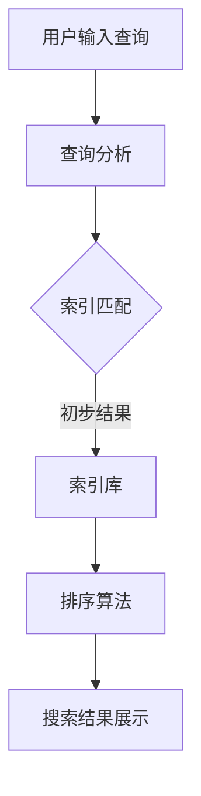
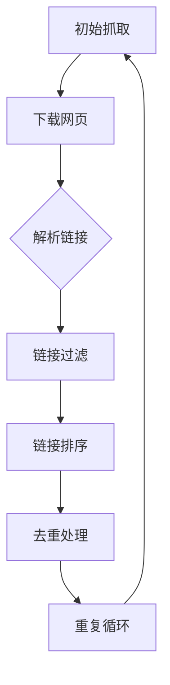
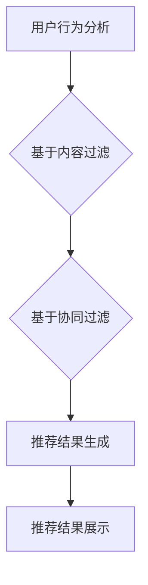

                 

# 在信息爆炸时代寻找知识的意义

> 关键词：信息爆炸、知识获取、知识筛选、知识应用、人工智能

> 摘要：本文旨在探讨在信息爆炸时代，如何有效地获取、评价和应用知识，以应对日益复杂的信息环境。通过对知识获取方法、评价标准、应用实践等方面的深入分析，本文提出了在信息爆炸时代寻找知识的意义，并为读者提供了一系列实用的方法和技巧。

## 引言：信息爆炸时代的挑战与机遇

在21世纪的今天，我们正处于一个信息爆炸的时代。互联网的普及、大数据技术的发展、社交媒体的兴起，使得信息以惊人的速度不断产生和传播。然而，信息爆炸带来的不仅仅是便利，更是一个巨大的挑战。在这个时代，如何有效地获取、评价和应用知识，成为了每一个个体和组织必须面对的问题。

### 1.1 问题背景

#### 1.1.1 信息爆炸带来的挑战

信息爆炸带来了以下几个方面的挑战：

1. **信息过载**：海量的信息使得人们难以分辨哪些是有价值的，哪些是无关的。
2. **知识碎片化**：信息被分割成一个个片段，难以形成一个完整的知识体系。
3. **知识传播速度**：信息的传播速度极快，但随之而来的错误信息、虚假新闻也层出不穷。
4. **隐私保护**：大量的个人信息被收集和存储，隐私保护成为一个严峻的问题。

#### 1.1.2 知识获取的需求

在信息爆炸的背景下，人们对于知识的获取需求愈发强烈。知识不仅是个人成长和发展的基石，也是企业竞争力和创新能力的关键。因此，如何在海量信息中找到有价值的知识，成为了亟待解决的问题。

### 1.2 研究意义

#### 1.2.1 知识筛选的重要性

有效的知识筛选可以大大降低信息过载的问题，帮助人们聚焦于有价值的信息。通过筛选，可以剔除噪音信息，提高信息的准确性和可靠性。

#### 1.2.2 知识获取的方法

研究知识获取的方法，可以帮助人们更高效地获取所需知识。通过信息检索、知识图谱、推荐系统等技术，可以实现知识的自动化获取。

## 第一部分：知识获取的方法

### 第1章：信息检索技术

#### 1.1.1 搜索引擎的工作原理

搜索引擎是信息检索的核心工具。其工作原理主要包括以下几个步骤：

1. **索引构建**：搜索引擎通过爬虫技术获取网页内容，并将其构建成索引。
2. **查询处理**：用户输入查询请求，搜索引擎通过索引匹配查询词，返回相关网页。
3. **排序算法**：根据网页的相关性、质量等因素，对搜索结果进行排序。

#### 1.1.2 网络爬虫技术

网络爬虫（Web Crawler）是搜索引擎的重要组成部分。其基本原理是通过模拟用户的访问行为，自动获取网页内容。网络爬虫技术主要包括：

1. **网页抓取**：通过网络协议获取网页内容。
2. **链接分析**：根据网页中的链接，发现新的网页。
3. **去重处理**：避免重复抓取已经获取过的网页。

#### 1.1.3 信息过滤与推荐系统

信息过滤和推荐系统可以帮助用户在大量信息中找到感兴趣的内容。信息过滤技术主要包括：

1. **内容过滤**：根据用户的历史行为和偏好，过滤掉不符合用户需求的信息。
2. **协同过滤**：通过分析用户之间的行为相似性，为用户推荐感兴趣的内容。

### 第2章：知识获取工具与平台

#### 2.1.1 开放获取资源

开放获取资源（Open Access Resources）是获取知识的重要来源。主要包括：

1. **学术期刊**：提供最新科研成果的期刊。
2. **开放课程**：免费提供的高质量课程资源。
3. **知识库**：包括维基百科、百度百科等。

#### 2.1.2 专业数据库与图书馆

专业数据库和图书馆是获取专业知识的有效途径。主要包括：

1. **专业数据库**：如IEEE Xplore、SpringerLink等。
2. **图书馆**：包括公共图书馆、大学图书馆等。

#### 2.1.3 知识图谱技术

知识图谱技术可以帮助构建知识的结构化表示。其基本原理是通过实体和关系来描述知识。知识图谱技术主要包括：

1. **实体识别**：识别文本中的实体。
2. **关系抽取**：提取实体之间的关系。
3. **图谱构建**：将实体和关系构建成一个大规模的知识图谱。

### 第3章：知识获取策略与实践

#### 3.1.1 信息素养培养

信息素养培养是知识获取的基础。主要包括：

1. **信息意识**：对信息价值的认识和敏感度。
2. **信息能力**：获取、评估和利用信息的能力。
3. **信息道德**：遵守信息伦理规范。

#### 3.1.2 知识获取流程设计

有效的知识获取流程设计可以提高知识获取的效率。主要包括：

1. **需求分析**：明确知识获取的目标和需求。
2. **资源选择**：选择合适的获取工具和平台。
3. **知识整合**：将获取的知识进行整合和利用。

#### 3.1.3 知识获取案例分析

通过案例分析，可以更好地理解和应用知识获取方法。主要包括：

1. **案例选择**：选择具有代表性的案例。
2. **案例分析**：分析案例中的知识获取方法和实践。
3. **案例总结**：总结案例中的经验和教训。

## 第二部分：知识评价与筛选

### 第4章：知识评价标准

#### 4.1.1 评价要素

知识评价的要素主要包括：

1. **准确性**：知识内容的真实性、可靠性。
2. **权威性**：知识来源的权威性、专业水平。
3. **时效性**：知识内容的新旧程度。
4. **完整性**：知识内容的全面性、完整性。

#### 4.1.2 评价指标体系

知识评价指标体系主要包括：

1. **评价指标**：如准确性、权威性、时效性、完整性等。
2. **评价模型**：如层次分析法、模糊综合评价法等。
3. **评价方法**：如定量评价、定性评价等。

#### 4.1.3 评价方法比较

不同的评价方法各有优缺点，应根据具体情况进行选择。主要包括：

1. **定量评价**：优点是客观、量化，缺点是可能忽略主观因素。
2. **定性评价**：优点是灵活、深入，缺点是可能缺乏客观性。

### 第5章：知识筛选技巧

#### 5.1.1 筛选原则

知识筛选应遵循以下原则：

1. **针对性**：根据需求和目标进行筛选。
2. **客观性**：避免主观偏见，客观评价知识。
3. **系统性**：综合考虑各种因素，形成系统性的筛选标准。

#### 5.1.2 筛选工具使用

常见的知识筛选工具包括：

1. **搜索引擎**：如Google、Bing等。
2. **推荐系统**：如Amazon、Netflix等。
3. **知识图谱**：如Google Knowledge Graph、DBpedia等。

#### 5.1.3 筛选流程设计

知识筛选流程设计主要包括：

1. **需求分析**：明确筛选目标和需求。
2. **工具选择**：选择合适的筛选工具。
3. **筛选执行**：按照筛选原则进行筛选。
4. **结果评估**：评估筛选结果的有效性。

### 第6章：知识评价与筛选实践

#### 6.1.1 实践案例

通过实际案例，可以更好地理解和应用知识评价与筛选方法。主要包括：

1. **案例选择**：选择具有代表性的案例。
2. **案例分析**：分析案例中的知识评价与筛选方法。
3. **案例总结**：总结案例中的经验和教训。

#### 6.1.2 实践分析

通过对实践案例的分析，可以发现知识评价与筛选中存在的问题和挑战。主要包括：

1. **问题识别**：识别实践案例中的问题。
2. **原因分析**：分析问题产生的原因。
3. **解决方案**：提出解决方案。

#### 6.1.3 实践总结

通过对实践案例的分析和总结，可以得出以下结论：

1. **知识评价与筛选的重要性**：有效的知识评价与筛选可以提高知识的准确性和可靠性。
2. **方法与实践的应用**：通过实际案例，可以更好地理解和应用知识评价与筛选方法。
3. **未来展望**：随着信息技术的不断发展，知识评价与筛选的方法和工具将更加丰富和高效。

## 第三部分：知识应用与实践

### 第7章：知识在决策中的应用

#### 7.1.1 知识在战略决策中的应用

知识在战略决策中的应用主要包括：

1. **市场分析**：通过对市场信息的分析，制定有针对性的战略。
2. **竞争分析**：通过对竞争对手的分析，制定有竞争力的策略。
3. **风险分析**：通过对潜在风险的识别和分析，制定风险应对策略。

#### 7.1.2 知识在战术决策中的应用

知识在战术决策中的应用主要包括：

1. **运营管理**：通过对运营数据的分析，优化运营流程。
2. **人力资源管理**：通过对员工能力的分析，制定人力资源策略。
3. **营销管理**：通过对市场数据的分析，制定营销策略。

#### 7.1.3 知识在决策支持系统中的应用

知识在决策支持系统中的应用主要包括：

1. **数据挖掘**：通过对海量数据的分析，提取有价值的信息。
2. **机器学习**：通过机器学习算法，对数据进行分析和预测。
3. **专家系统**：通过专家知识库，提供决策支持。

### 第8章：知识在社会治理中的应用

#### 8.1.1 知识在社会治理中的作用

知识在社会治理中的作用主要包括：

1. **公共管理**：通过知识的应用，提高公共管理效率和效果。
2. **公共服务**：通过知识的应用，提高公共服务的质量和效率。
3. **社会稳定**：通过知识的应用，维护社会稳定和安全。

#### 8.1.2 知识在公共治理中的应用案例

知识在公共治理中的应用案例主要包括：

1. **智慧城市**：通过知识的应用，实现城市管理的智能化。
2. **公共卫生**：通过知识的应用，提高公共卫生管理效率。
3. **社会救助**：通过知识的应用，提高社会救助工作的精准性。

#### 8.1.3 知识在公共治理中的未来展望

知识在公共治理中的未来展望主要包括：

1. **智能化治理**：通过知识的应用，实现公共治理的智能化。
2. **大数据治理**：通过大数据技术，提高公共治理的效率和效果。
3. **知识共享**：通过知识共享，提高公共治理的协同性和效率。

## 总结与展望

在信息爆炸时代，知识的获取、评价和应用变得尤为重要。本文通过对知识获取方法、评价标准、应用实践等方面的深入分析，提出了在信息爆炸时代寻找知识的意义，并给出了一系列实用的方法和技巧。未来，随着信息技术的不断发展，知识管理的方法和工具将更加丰富和高效，为人类的发展提供强大的支持。作者：AI天才研究院/AI Genius Institute & 禅与计算机程序设计艺术 /Zen And The Art of Computer Programming## 第1章：信息检索技术

### 1.1.1 搜索引擎的工作原理

搜索引擎作为信息检索的核心工具，其工作原理可以概括为以下三个主要步骤：索引构建、查询处理和排序算法。

**索引构建**：
1. **网页抓取**：搜索引擎通过网络爬虫技术获取网页内容。网络爬虫从初始种子页面开始，通过链接分析发现新的网页，并重复此过程，以逐步覆盖整个互联网。
2. **网页解析**：爬虫获取网页内容后，使用解析器提取网页的文本、链接和其他元数据。
3. **索引生成**：解析后的网页数据被存储在索引库中，形成一个大规模的倒排索引。倒排索引是一种数据结构，将网页内容按关键词进行索引，使得搜索时可以快速定位包含特定关键词的网页。

**查询处理**：
1. **查询分析**：用户输入查询请求后，搜索引擎对其进行分析，提取关键词和查询意图。
2. **索引匹配**：搜索引擎在索引库中查找包含关键词的网页，并将这些网页作为初步搜索结果。
3. **查询扩展**：为了提高搜索结果的多样性，搜索引擎可能会根据语义分析扩展查询，添加相关关键词或同义词。

**排序算法**：
1. **相关性排序**：搜索引擎通过算法评估每个网页与查询请求的相关性，并根据相关性对搜索结果进行排序。常用的相关性排序算法包括PageRank、BM25等。
2. **质量评估**：除了相关性外，搜索引擎还会评估网页的质量，如内容完整性、更新频率、域名权威性等，以过滤掉低质量网页。
3. **用户反馈**：一些搜索引擎会使用用户点击行为等反馈信息，进一步调整搜索结果的排序，以优化用户体验。

**Mermaid流程图**：

### 1.1.2 网络爬虫技术

网络爬虫（Web Crawler）是搜索引擎的重要组成部分，负责自动获取互联网上的信息。其基本原理包括网页抓取、链接分析和去重处理。

**网页抓取**：
1. **初始抓取**：爬虫从一组种子URL开始，下载并解析这些网页。
2. **深度优先**：爬虫按照深度优先的策略，逐层深入挖掘网页中的链接。
3. **广度优先**：为了覆盖更多的网页，爬虫在深度优先的基础上，采用广度优先的策略，扩展新的网页。

**链接分析**：
1. **URL解析**：爬虫解析网页中的URL，提取出链接地址。
2. **链接过滤**：根据设定的规则，过滤掉无效、重复或不符合要求的链接。
3. **链接排序**：对链接进行排序，优先抓取重要或有价值的链接。

**去重处理**：
1. **URL去重**：通过存储已访问的URL列表，避免重复抓取相同的网页。
2. **内容去重**：通过内容指纹（如MD5值）检测和过滤重复的内容。

**Mermaid流程图**：

### 1.1.3 信息过滤与推荐系统

信息过滤与推荐系统是提高用户信息获取效率的重要手段。它们通过分析用户的历史行为和偏好，自动筛选和推荐感兴趣的信息。

**信息过滤**：
1. **基于内容过滤**：根据用户的历史行为和偏好，过滤掉不符合用户需求的信息。例如，用户经常浏览的科技类文章，系统会自动屏蔽掉娱乐类文章。
2. **基于协同过滤**：通过分析用户之间的行为相似性，为用户推荐感兴趣的信息。例如，如果用户A喜欢某篇文章，且用户B与用户A在阅读偏好上有相似之处，系统会推荐用户B阅读这篇文章。

**推荐系统**：
1. **协同过滤推荐**：通过计算用户之间的相似度，推荐与用户兴趣相似的其他用户喜欢的物品。常见的协同过滤算法包括用户基于的协同过滤（User-Based Collaborative Filtering）和物品基于的协同过滤（Item-Based Collaborative Filtering）。
2. **基于内容的推荐**：根据物品的属性和用户的历史行为，推荐与用户兴趣相关的物品。例如，如果用户经常购买书籍，系统会推荐与其最近购买书籍相似的其他书籍。

**Mermaid流程图**：

### 1.1.4 信息检索技术的优缺点

**优点**：
1. **快速检索**：搜索引擎可以快速地找到用户所需的信息，节省大量时间。
2. **广泛覆盖**：搜索引擎覆盖了整个互联网，可以提供丰富的信息来源。
3. **个性化推荐**：信息过滤和推荐系统可以根据用户的行为和偏好，提供个性化的信息推荐。

**缺点**：
1. **信息过载**：搜索引擎返回的结果可能非常庞大，用户需要花费大量时间筛选。
2. **准确性问题**：搜索引擎可能返回不相关或低质量的结果，影响用户的信息获取效果。
3. **隐私风险**：搜索引擎需要收集大量的用户数据，存在隐私泄露的风险。

### 1.1.5 信息检索技术的实际应用场景

1. **搜索引擎**：如Google、Bing等，提供互联网上的信息检索服务。
2. **电子商务平台**：如Amazon、淘宝等，利用推荐系统为用户提供个性化商品推荐。
3. **社交媒体**：如Facebook、微博等，利用信息过滤技术屏蔽不良信息。
4. **智能助手**：如Siri、小爱同学等，通过自然语言处理和推荐系统为用户提供信息查询和任务执行服务。

### 1.1.6 小结

信息检索技术是信息获取的重要手段。通过搜索引擎、网络爬虫、信息过滤和推荐系统等技术，用户可以在海量的信息中快速找到所需的内容。然而，信息检索技术也存在一定的局限性，如信息过载、准确性问题和隐私风险。因此，需要结合具体场景和需求，选择合适的信息检索技术和策略。

## 第2章：知识获取工具与平台

### 2.1.1 开放获取资源

开放获取资源（Open Access Resources）是知识获取的重要来源。这类资源具有免费、开放和可重用的特点，为科研人员、学生和其他知识需求者提供了丰富的知识资源。

**学术期刊**：
学术期刊是开放获取资源的重要组成部分，提供了最新的科研成果和学术讨论。一些著名的开放获取学术期刊包括PLOS ONE、Open Journal of Genetics等。

**开放课程**：
开放课程（Open Courses）提供了广泛的学习资源，包括课程视频、讲义、作业等。著名的开放课程平台有edX、Coursera等，这些平台提供了来自全球顶尖大学和机构的课程资源。

**知识库**：
知识库（Knowledge Base）是集中存储知识资源的平台。例如，维基百科（Wikipedia）是一个庞大的多语言知识库，提供了丰富的信息和知识链接。

### 2.1.2 专业数据库与图书馆

专业数据库和图书馆是获取专业知识和文献的重要途径。它们提供了高质量、专业化的内容，覆盖了各个学科领域。

**专业数据库**：
专业数据库包括学术数据库、行业数据库等，如IEEE Xplore、SpringerLink、PubMed等。这些数据库提供了大量的学术论文、报告、书籍等资源，为科研人员提供了宝贵的研究资料。

**图书馆**：
图书馆是知识获取的重要场所，包括公共图书馆、大学图书馆和专门图书馆。图书馆不仅提供纸质书籍、期刊等资源，还提供了电子资源、在线数据库等服务。

### 2.1.3 知识图谱技术

知识图谱技术是构建知识表示和挖掘知识的重要手段。通过实体和关系来描述知识，知识图谱可以为用户提供结构化的知识视图，提高知识获取的效率。

**实体识别**：
实体识别（Entity Recognition）是知识图谱构建的第一步，通过自然语言处理技术，从文本中识别出实体。例如，从一篇文章中识别出人名、地名、机构名等。

**关系抽取**：
关系抽取（Relation Extraction）是从文本中提取实体之间的关系。例如，从一篇文章中提取出“马云是阿里巴巴的创始人”这样的关系。

**图谱构建**：
知识图谱是通过实体和关系构建而成的。在构建过程中，可以使用图数据库（如Neo4j）或图计算框架（如Apache Giraph）来存储和管理图谱数据。

**应用案例**：
知识图谱技术广泛应用于搜索引擎、推荐系统、智能问答等领域。例如，Google Knowledge Graph就是通过知识图谱技术提供更准确的搜索结果和更智能的问答服务。

### 2.1.4 知识获取工具与平台的优缺点

**优点**：
1. **丰富性**：开放获取资源和专业数据库提供了丰富的知识资源，满足不同层次的需求。
2. **便捷性**：通过知识图谱技术，用户可以方便地获取和浏览结构化的知识。
3. **专业性**：专业数据库和图书馆提供了高质量、专业的知识内容，为科研和学术研究提供了支持。

**缺点**：
1. **版权问题**：一些开放获取资源和专业数据库可能存在版权问题，限制了知识的自由传播。
2. **更新速度**：知识获取工具和平台可能存在更新速度慢的问题，导致内容滞后。
3. **使用门槛**：一些专业数据库和知识图谱工具可能需要较高的技术门槛，对用户提出了挑战。

### 2.1.5 知识获取工具与平台的选择与应用

1. **科研人员**：可以优先使用专业数据库和图书馆，获取高质量、专业的知识资源。
2. **学生**：可以借助开放课程和知识库，获取丰富的学习资源。
3. **企业**：可以利用知识图谱技术，构建企业知识库，提高知识管理和知识获取的效率。

### 2.1.6 小结

知识获取工具与平台在信息爆炸时代具有重要的地位。开放获取资源、专业数据库和图书馆为用户提供了丰富的知识资源，知识图谱技术则为知识的结构化和便捷获取提供了支持。在应用过程中，需要结合具体需求，选择合适的工具和平台，以提高知识获取的效率和效果。

## 第3章：知识获取策略与实践

### 3.1.1 信息素养培养

信息素养（Information Literacy）是指个体获取、评估和应用信息的能力。在信息爆炸时代，培养信息素养对于有效地获取和利用知识至关重要。

**信息意识**：
1. **信息价值的认识**：了解信息的重要性和对决策的影响。
2. **信息获取的需求**：明确自己所需的信息类型和来源。

**信息能力**：
1. **信息检索能力**：掌握搜索引擎的使用技巧，提高信息检索效率。
2. **信息评估能力**：学会评估信息来源的可靠性和准确性。
3. **信息应用能力**：将获取的信息应用于实际问题解决中。

**信息道德**：
1. **尊重版权**：遵守版权法规，尊重他人的知识产权。
2. **保护隐私**：在信息获取和应用过程中，保护个人和他人隐私。

### 3.1.2 知识获取流程设计

设计有效的知识获取流程可以提高知识获取的效率和质量。以下是一个典型的知识获取流程：

**需求分析**：
1. **明确目标**：确定知识获取的目标和需求。
2. **信息收集**：收集与目标相关的信息。

**资源选择**：
1. **选择工具**：根据需求选择合适的获取工具，如搜索引擎、专业数据库等。
2. **选择平台**：根据需求选择合适的获取平台，如开放获取资源、专业数据库等。

**知识整合**：
1. **数据清洗**：去除重复、错误或不相关的信息。
2. **数据整合**：将不同来源的信息进行整合，形成系统化的知识体系。

**知识应用**：
1. **问题解决**：将获取的知识应用于实际问题解决中。
2. **持续更新**：随着信息的变化，持续更新知识体系。

### 3.1.3 知识获取策略与实践

**案例1：科研人员的知识获取策略**

1. **需求分析**：明确研究方向和具体问题。
2. **资源选择**：使用学术数据库和专业期刊获取最新研究成果。
3. **知识整合**：将文献资料进行整理和归纳，构建研究框架。
4. **知识应用**：将研究成果应用于实际研究项目中，不断更新和优化。

**案例2：企业知识管理的实践**

1. **需求分析**：明确企业知识需求和知识管理目标。
2. **资源选择**：建立企业内部知识库，收集和整理内部文档和资料。
3. **知识整合**：通过知识图谱技术，构建企业知识体系。
4. **知识应用**：将知识应用于企业决策、产品开发和服务改进中，提高企业竞争力。

### 3.1.4 知识获取案例分析

**案例1：学术研究中的知识获取**

- **问题背景**：研究某一特定领域的学术问题，需要获取相关文献和研究资料。
- **解决方案**：使用学术搜索引擎和数据库，如Google Scholar、IEEE Xplore等，获取相关文献。通过文献综述，构建研究框架，并不断更新和优化。

**案例2：企业知识管理的实践**

- **问题背景**：企业内部知识分散，缺乏系统化管理，影响知识共享和利用。
- **解决方案**：建立企业内部知识库，收集和整理内部文档和资料。通过知识图谱技术，构建企业知识体系，提高知识获取和利用效率。

### 3.1.5 知识获取策略与实践总结

有效的知识获取策略与实践需要明确需求、选择合适的工具和平台、进行知识整合和应用。通过实际案例分析，可以更好地理解和应用知识获取策略与实践，提高知识获取的效率和效果。

## 第4章：知识评价标准

### 4.1.1 评价要素

知识评价的要素主要包括准确性、权威性、时效性和完整性。这些要素是评估知识质量和价值的重要指标。

**准确性**：
准确性是指知识内容的真实性、可靠性和准确性。高准确性的知识应确保所提供的信息是真实、准确的，且不存在误导或错误。

**权威性**：
权威性是指知识来源的权威性、专业水平和可信度。高权威性的知识通常来自知名的机构、权威的专家或可靠的出版物。

**时效性**：
时效性是指知识内容的新旧程度。时效性较高的知识反映了当前领域的新进展、新趋势和最新研究动态。

**完整性**：
完整性是指知识内容的全面性、完整性和系统性。高完整性的知识应包含相关的背景信息、理论基础、应用案例和实践经验。

### 4.1.2 评价指标体系

知识评价指标体系是一个综合评估知识质量和价值的框架，包括以下主要指标：

1. **准确性**：评估知识内容的真实性、准确性和可靠性。
2. **权威性**：评估知识来源的权威性、专业水平和可信度。
3. **时效性**：评估知识内容的新旧程度和更新频率。
4. **完整性**：评估知识内容的全面性、完整性和系统性。
5. **实用性**：评估知识对实际问题的解决能力和应用价值。

### 4.1.3 评价方法比较

在知识评价中，常用的评价方法包括定量评价、定性评价和综合评价。以下是这些方法的主要特点和优缺点：

**定量评价**：
- **主要特点**：通过量化指标，对知识进行数值评估。
- **优点**：客观、量化，便于比较和分析。
- **缺点**：可能忽略主观因素，评价结果可能过于单一。

**定性评价**：
- **主要特点**：通过描述性语言，对知识进行主观评估。
- **优点**：灵活、深入，可以提供更全面的评价。
- **缺点**：评价结果可能受到评价者主观偏见的影响。

**综合评价**：
- **主要特点**：结合定量评价和定性评价，对知识进行全面评估。
- **优点**：综合了定量和定性评价的优点，评价结果更全面。
- **缺点**：评价过程较为复杂，评价标准需要统一。

### 4.1.4 知识评价的实际应用

**学术评价**：
学术评价通常通过期刊影响因子、论文引用次数等定量指标，评估学术成果的学术价值和影响力。同时，专家评审和同行评议也作为定性评价的重要手段。

**企业知识管理**：
企业知识管理中，知识评价主要关注知识的实用性、可靠性和更新频率。通过建立知识评价体系，企业可以确保知识库中的知识内容始终保持高质量和时效性。

**教育评价**：
教育评价中的知识评价主要关注学生的学习成果和知识掌握程度。通过考试、作业、论文等形式，教师可以对学生的知识掌握情况进行评估。

### 4.1.5 知识评价的最佳实践

**多维度评价**：
结合定量评价和定性评价，对知识进行多维度评价，确保评价结果更全面、准确。

**定期更新**：
定期对知识进行更新和评价，确保知识内容的时效性和准确性。

**用户参与**：
鼓励用户参与知识评价，通过用户反馈，不断优化知识评价体系。

### 4.1.6 小结

知识评价是确保知识质量和价值的重要环节。通过建立完善的评价指标体系和评价方法，可以有效地评估知识的准确性、权威性、时效性和完整性。在实际应用中，结合多维度评价、定期更新和用户参与，可以提高知识评价的准确性和实用性，为知识管理和应用提供有力支持。

## 第5章：知识筛选技巧

### 5.1.1 筛选原则

在信息爆炸的时代，知识筛选是确保信息质量和减少信息过载的关键步骤。有效的知识筛选应遵循以下原则：

**针对性**：
筛选时应明确筛选目标和需求，确保筛选的信息与实际需求紧密相关。

**客观性**：
筛选过程应保持客观，避免主观偏见的影响，确保筛选结果公正、可靠。

**系统性**：
筛选不应仅限于单一维度，而应综合考虑准确性、权威性、时效性、完整性等多个方面，形成系统性的筛选标准。

### 5.1.2 筛选工具使用

为了提高知识筛选的效率和准确性，可以使用多种筛选工具。以下是一些常用的知识筛选工具及其特点：

**搜索引擎**：
搜索引擎如Google、Bing等，通过关键词搜索和排序算法，帮助用户快速找到相关信息。

**推荐系统**：
推荐系统如Amazon、Netflix等，根据用户的历史行为和偏好，自动筛选出可能感兴趣的信息。

**过滤器**：
过滤器可以根据预设的条件自动过滤掉不符合要求的信息。例如，可以使用广告过滤器屏蔽广告，使用邮件过滤器筛选重要邮件。

**知识图谱**：
知识图谱技术通过实体和关系构建知识的结构化表示，帮助用户快速找到相关知识，提高筛选的效率。

### 5.1.3 筛选流程设计

一个有效的知识筛选流程应包括以下步骤：

**需求分析**：
明确筛选目标和需求，确定需要筛选的信息类型和来源。

**工具选择**：
根据需求选择合适的筛选工具，如搜索引擎、推荐系统、过滤器等。

**筛选执行**：
使用所选工具进行筛选，并根据预设的条件和标准，过滤掉不符合要求的信息。

**结果评估**：
评估筛选结果的有效性，确保筛选出的信息满足需求，并且不存在重要信息的遗漏。

**迭代优化**：
根据评估结果，对筛选流程进行优化，提高筛选的准确性和效率。

### 5.1.4 筛选技巧应用案例

**学术研究**：
在学术研究中，研究人员需要从大量的文献中筛选出相关的研究成果。可以使用搜索引擎进行初步筛选，然后利用过滤器去除重复和低质量文献，最后通过专家评审和文献引用次数等指标进行进一步筛选。

**企业信息管理**：
企业在处理海量信息时，可以使用推荐系统和过滤器进行筛选。例如，推荐系统可以根据员工的历史行为和偏好，推荐相关的工作信息和资源；过滤器可以自动屏蔽掉不符合企业需求的信息，提高信息处理效率。

**日常信息获取**：
在日常生活中，用户可以使用搜索引擎和过滤器来筛选感兴趣的新闻、博客和其他信息来源。例如，用户可以设置新闻订阅，每天接收与自己兴趣相关的新闻摘要。

### 5.1.5 筛选技巧总结

知识筛选是信息管理和知识获取中的重要环节。通过遵循针对性、客观性和系统性的原则，结合使用合适的筛选工具和设计有效的筛选流程，可以显著提高知识筛选的效率和准确性。在实际应用中，结合具体场景和需求，灵活运用各种筛选技巧，可以更好地应对信息爆炸带来的挑战。

## 第6章：知识评价与筛选实践

### 6.1.1 实践案例

在本节中，我们将通过几个具体的实践案例，详细说明知识评价与筛选的过程和方法。

**案例1：学术期刊筛选**

**问题背景**：某高校图书馆需要从大量的学术期刊中筛选出适合师生阅读和研究的期刊，以提升图书馆的资源利用率。

**解决方案**：
1. **需求分析**：明确图书馆的目标用户群体，如教师、研究生等，了解他们的研究兴趣和需求。
2. **评价标准**：制定评价标准，包括期刊的影响力（如期刊影响因子）、内容质量（如同行评议过程）、专业领域适应性等。
3. **筛选工具**：使用学术搜索引擎（如Google Scholar）和专业的期刊评价工具（如JSTOR、Scimago Journal & Country Rank）进行筛选。
4. **筛选流程**：
   - 初步筛选：根据期刊的标题、关键词和摘要，初步筛选出符合需求的期刊。
   - 详细评价：对初步筛选出的期刊进行详细评价，查看期刊的引用次数、出版频率、内容质量等指标。
   - 结果评估：根据评价结果，选出高质量的学术期刊，提交给图书馆管理层进行最终决策。

**案例2：企业知识库构建**

**问题背景**：某企业需要建立一个内部知识库，以存储和管理员工的知识和经验，提高企业的知识共享和创新能力。

**解决方案**：
1. **需求分析**：明确企业内部的知识需求和知识管理目标，如知识共享、问题解决、创新支持等。
2. **评价标准**：制定评价标准，包括知识的质量（如准确性、实用性）、来源（如内部专家、外部权威资源）、时效性等。
3. **筛选工具**：
   - 内部文档管理系统：用于收集和存储企业内部的文档、报告、案例等知识资源。
   - 知识图谱工具：用于构建知识的结构化表示，提高知识获取和利用的效率。
4. **筛选流程**：
   - 初步收集：通过内部调查和员工反馈，初步收集企业内部的知识资源。
   - 评估筛选：对收集到的知识资源进行评价和筛选，剔除低质量、过时或不相关的知识。
   - 整理分类：根据知识内容的特点和分类，将筛选后的知识进行整理和分类，便于员工查找和使用。

**案例3：社交媒体内容过滤**

**问题背景**：某社交媒体平台需要过滤掉用户发布的不当言论和垃圾信息，以维护平台环境的健康和用户的良好体验。

**解决方案**：
1. **需求分析**：明确平台的用户群体和内容规范，了解用户的需求和行为模式。
2. **评价标准**：制定内容评价标准，包括内容的准确性、合规性、健康性等。
3. **筛选工具**：
   - 自然语言处理技术：用于分析用户发布的内容，识别不当言论和垃圾信息。
   - 用户反馈系统：用于收集用户对内容质量的反馈，不断优化筛选算法。
4. **筛选流程**：
   - 初步过滤：通过预设的规则和算法，对用户发布的内容进行初步过滤，标记可疑的内容。
   - 详细评价：对初步过滤出的内容进行详细评价，判断其是否符合平台规范。
   - 最终决策：根据评价结果，对内容进行分类处理，如删除、标记或警告。

### 6.1.2 实践分析

通过对上述案例的分析，我们可以总结出以下几个关键点：

1. **明确需求和目标**：在知识评价与筛选过程中，首先要明确需求和目标，这决定了筛选的标准和流程。
2. **建立评价标准**：评价标准是知识筛选的核心，它确保筛选过程的公正性和科学性。
3. **选择合适的工具**：根据需求和目标，选择合适的筛选工具和技术，可以提高筛选的效率和准确性。
4. **持续优化和迭代**：知识评价与筛选是一个动态过程，需要不断优化和迭代，以适应不断变化的需求和情境。

### 6.1.3 实践总结

知识评价与筛选实践是确保知识质量和价值的重要环节。通过实际案例的分析，我们可以看到，有效的知识评价与筛选不仅需要明确的需求分析和科学的评价标准，还需要选择合适的工具和技术，并不断进行优化和迭代。这些实践经验和技巧为我们在信息爆炸时代有效获取和利用知识提供了有力的支持。

## 第7章：知识在决策中的应用

### 7.1.1 知识在战略决策中的应用

战略决策是企业或组织长期发展的关键，它涉及到市场定位、资源分配、竞争策略等方面。知识在战略决策中起着至关重要的作用，具体应用如下：

**市场分析**：
1. **数据收集**：通过市场调查、行业报告等手段收集市场数据。
2. **数据分析**：利用数据分析工具，如Excel、Python等，对市场数据进行分析，识别市场趋势、竞争态势等。
3. **知识整合**：将收集到的数据进行整合，形成市场分析报告，为战略决策提供数据支持。

**竞争分析**：
1. **竞争者识别**：通过市场调查和行业研究，识别主要竞争者。
2. **竞争策略分析**：分析竞争者的市场策略、产品定位等，评估其对企业的威胁和影响。
3. **知识应用**：根据竞争策略分析结果，制定相应的竞争策略，如差异化竞争、价格竞争等。

**风险分析**：
1. **风险识别**：识别可能影响企业战略决策的风险，如市场风险、技术风险、政策风险等。
2. **风险评估**：评估各类风险的概率和影响，确定风险等级。
3. **知识应用**：根据风险评估结果，制定相应的风险应对策略，如风险规避、风险降低等。

### 7.1.2 知识在战术决策中的应用

战术决策是企业或组织短期内具体的行动决策，它涉及到运营管理、人力资源管理、营销管理等方面。知识在战术决策中的应用同样重要，具体如下：

**运营管理**：
1. **数据监控**：通过监控系统实时获取运营数据，如销售额、库存量、生产效率等。
2. **数据分析**：对运营数据进行分析，识别运营中的问题和瓶颈。
3. **知识应用**：根据数据分析结果，优化运营流程，提高运营效率。

**人力资源管理**：
1. **人才评估**：通过绩效考核、培训反馈等手段，评估员工的能力和发展潜力。
2. **知识管理**：建立人才库，记录员工的专业技能、工作经历等，便于知识共享和人才选拔。
3. **知识应用**：根据人才评估结果，制定人力资源策略，如培训计划、晋升机制等。

**营销管理**：
1. **市场调研**：通过问卷调查、访谈等方式，了解市场需求和用户偏好。
2. **数据分析**：对市场调研结果进行分析，识别潜在市场和目标客户。
3. **知识应用**：根据数据分析结果，制定营销策略，如广告投放、促销活动等。

### 7.1.3 知识在决策支持系统中的应用

决策支持系统（DSS）是一种利用信息技术和数据分析工具，辅助决策者进行决策的系统。知识在决策支持系统中的应用，可以提高决策的科学性和准确性，具体如下：

**数据挖掘**：
1. **数据收集**：从企业内外部收集大量数据，如销售数据、客户数据、市场数据等。
2. **数据预处理**：对收集到的数据进行清洗、去噪等预处理，提高数据质量。
3. **知识提取**：利用数据挖掘技术，从预处理后的数据中提取有价值的信息，如关联规则、聚类分析等。

**机器学习**：
1. **模型训练**：利用机器学习算法，对历史数据进行分析和建模，训练预测模型。
2. **模型评估**：评估模型的预测准确性和泛化能力，优化模型参数。
3. **知识应用**：将训练好的模型应用于实际决策场景，如销售预测、市场预测等。

**专家系统**：
1. **知识库构建**：收集并整理领域专家的经验和知识，构建知识库。
2. **推理引擎**：利用推理算法，根据用户输入的信息，在知识库中检索相关知识和策略。
3. **知识应用**：根据推理结果，为决策者提供决策建议和策略。

### 7.1.4 知识在决策中的应用案例分析

**案例1：零售企业的库存管理**

**问题背景**：某零售企业面临库存积压和销售波动大的问题，需要优化库存管理。

**解决方案**：
1. **数据收集**：收集历史销售数据、库存数据、市场需求数据等。
2. **数据分析**：利用数据挖掘技术，分析销售趋势、库存周期等，识别库存管理的瓶颈。
3. **知识应用**：根据分析结果，调整库存策略，如增加畅销商品的库存、减少滞销商品的库存等。

**案例2：市场营销策略制定**

**问题背景**：某企业需要制定新的市场营销策略，以提高市场份额和品牌知名度。

**解决方案**：
1. **市场调研**：通过问卷调查、访谈等方式，收集市场需求和用户偏好数据。
2. **数据分析**：利用数据分析工具，识别目标客户群体、市场需求趋势等。
3. **知识应用**：根据分析结果，制定针对性的营销策略，如社交媒体广告、线下活动等。

### 7.1.5 小结

知识在决策中的应用，通过数据分析和知识管理，可以提高决策的科学性和准确性。无论是战略决策还是战术决策，知识的应用都是不可或缺的。通过具体的案例分析和实践经验，我们可以看到知识在决策中的巨大作用，并为未来的决策提供有力的支持和指导。

## 第8章：知识在社会治理中的应用

### 8.1.1 知识在社会治理中的作用

知识在社会治理中扮演着关键角色，它不仅能够提升治理效率，还能够增强社会治理的科学性和透明度。以下是知识在社会治理中的几个重要作用：

**公共管理**：
1. **数据分析**：通过数据分析，政府可以更好地了解社会运行状况，发现潜在问题，制定针对性的政策和措施。
2. **知识共享**：通过知识共享平台，政府可以将政策法规、操作流程等知识传递给公众和政府部门，提高行政效率和透明度。

**公共服务**：
1. **需求分析**：通过收集和分析公众的需求，政府可以提供更精准、更有效的公共服务。
2. **知识服务**：利用知识图谱等技术，政府可以为公众提供智能化、个性化的服务，如在线咨询、智能问答等。

**社会稳定**：
1. **风险评估**：通过风险评估，政府可以预测和防范社会风险，维护社会稳定。
2. **知识预警**：利用大数据和人工智能技术，政府可以建立知识预警系统，及时发现并应对社会问题。

### 8.1.2 知识在公共治理中的应用案例

**智慧城市建设**

智慧城市是知识在社会治理中的重要应用之一。通过物联网、大数据、人工智能等技术，智慧城市可以实现城市管理的智能化、精细化和高效化。

**案例分析**：

1. **数据分析**：利用大数据技术，对城市交通、环境、公共安全等数据进行实时监测和分析，发现城市运行中的问题和瓶颈。
2. **知识服务**：通过智慧交通系统，提供实时路况信息、公共交通查询等知识服务，提高市民出行效率。
3. **知识预警**：利用公共安全监控系统，实时监测城市安全状况，建立知识预警系统，提前预防和应对突发事件。

**公共卫生管理**

公共卫生管理是社会治理的重要领域。通过知识管理和信息化技术，可以提高公共卫生管理效率，保障公众健康。

**案例分析**：

1. **健康数据分析**：通过收集和分析公共卫生数据，如传染病疫情、医疗资源分布等，了解公共卫生状况，制定针对性防控措施。
2. **知识服务**：利用在线健康咨询服务、健康知识普及平台等，为公众提供健康知识和服务，提高健康素养。
3. **知识预警**：建立公共卫生知识预警系统，实时监测传染病疫情等公共卫生问题，及时发布预警信息，指导公众采取防护措施。

**社会救助**

社会救助是政府保障困难群众基本生活的重要手段。通过知识管理，可以提高社会救助工作的效率和精准性。

**案例分析**：

1. **需求分析**：通过数据分析和调查，了解困难群众的需求，制定针对性的救助政策。
2. **知识共享**：建立社会救助知识库，收集和整理救助政策、操作流程、成功案例等，为政府部门和社会组织提供知识支持。
3. **知识评估**：对救助效果进行评估，不断优化救助政策和措施，提高救助工作的效果。

### 8.1.3 知识在公共治理中的未来展望

随着信息技术的不断发展，知识在社会治理中的应用前景将更加广阔。以下是几个未来展望：

**智能化治理**：
智能化治理是未来公共治理的发展方向。通过人工智能、大数据等技术，政府可以实现智能化决策和智能化服务，提高治理效率和公众满意度。

**大数据治理**：
大数据治理是应对信息爆炸时代的重要策略。政府需要建立完善的大数据治理体系，确保数据的安全、准确和可用性，为公共治理提供有力支持。

**知识共享**：
知识共享是提高公共治理效率的重要手段。政府需要推动知识共享平台的建设和应用，促进政府部门和社会组织之间的知识交流与合作。

**法治化治理**：
法治化治理是公共治理的基本原则。政府需要加强法治建设，确保公共治理的公正、透明和可监督性，提高治理的合法性和公信力。

### 8.1.4 小结

知识在社会治理中的应用具有重要意义。通过数据分析、知识服务和知识预警等技术，政府可以更高效、更精准地管理公共事务，保障公众利益，维护社会稳定。未来，随着信息技术的不断进步，知识在社会治理中的应用将更加广泛和深入，为公共治理提供更加有力的支持。

## 总结与展望

在信息爆炸的时代，知识获取、评价和应用变得尤为重要。本文通过对知识获取方法、评价标准、应用实践等方面的深入探讨，旨在帮助读者更好地应对信息过载的挑战，提升知识管理和应用的效率。

### 主要发现

1. **知识获取方法**：信息检索技术、网络爬虫技术、信息过滤与推荐系统等工具，为知识获取提供了有效的手段。同时，开放获取资源、专业数据库和图书馆等平台，也为知识的获取提供了丰富的资源。

2. **知识评价标准**：准确性、权威性、时效性和完整性是评价知识质量的重要指标。通过定量评价、定性评价和综合评价等方法，可以科学地评估知识的质量和价值。

3. **知识应用实践**：知识在社会治理、企业决策、教育等领域有着广泛的应用。通过数据分析和知识管理，可以提升决策的科学性和准确性，优化运营和管理流程。

### 实际应用意义

1. **提高信息素养**：通过培养信息素养，个体能够更有效地获取、评价和应用知识，提升在信息爆炸环境中的生存能力。

2. **优化知识管理**：企业和组织可以通过建立知识库、应用知识图谱等技术，实现知识的结构化管理和高效利用，提高创新能力和竞争力。

3. **提升社会治理效率**：政府可以通过大数据治理、智能化管理等手段，实现公共事务的科学决策和高效管理，提升社会治理水平和公众满意度。

### 未来展望

随着信息技术的不断进步，知识管理和应用将迎来新的发展机遇。以下是几个未来展望：

1. **人工智能与知识管理**：人工智能技术的应用将进一步提升知识获取、评价和应用的效率。通过自然语言处理、机器学习等技术，可以实现知识的自动化获取和智能化分析。

2. **知识图谱与智慧治理**：知识图谱技术的应用将使得知识表示和获取更加直观和高效。智慧治理体系的建设，将有助于实现公共治理的智能化和精细化。

3. **知识共享与协同创新**：随着互联网和物联网的普及，知识共享和协同创新的范围将进一步扩大。通过知识共享平台，个体和组织可以更便捷地获取和交流知识，促进知识的创新和传播。

### 结论

在信息爆炸的时代，知识是引领发展的关键。通过有效的知识获取、评价和应用，我们可以更好地应对信息过载的挑战，提升个人和组织的能力和竞争力。未来，随着信息技术的不断进步，知识管理和应用将迎来更加广阔的发展空间。作者：AI天才研究院/AI Genius Institute & 禅与计算机程序设计艺术 /Zen And The Art of Computer Programming。

