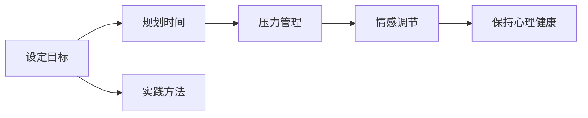
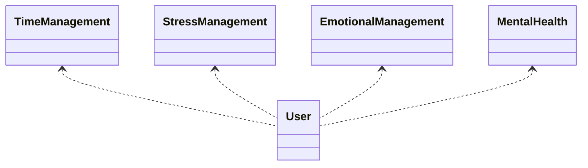
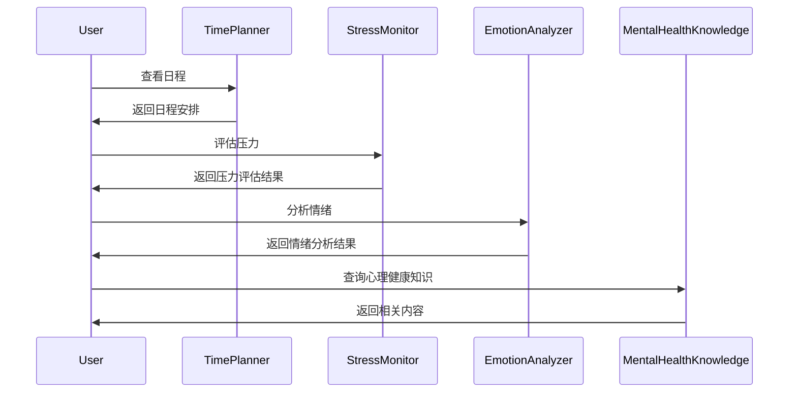
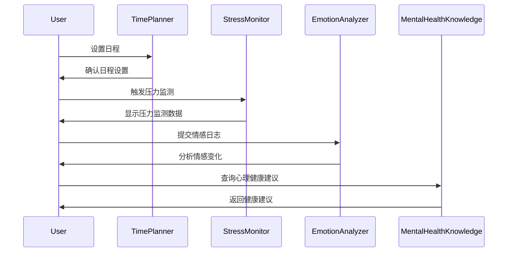

                 

# 《在快节奏生活中寻找内心平静》

## 关键词
- 内心平静
- 快节奏生活
- 压力管理
- 时间管理
- 情感管理
- 心理健康

## 摘要
在当今这个快节奏的社会中，保持内心平静成为一种奢侈。本文旨在探讨如何在繁忙的生活中寻找并维持内心平静，通过逻辑清晰、结构紧凑的分析，为读者提供实用的方法和策略。我们将深入探讨内心平静的定义、其与压力、焦虑的关系，并逐步介绍一系列行之有效的技术，帮助读者在日常生活中实践并保持内心的宁静。

---

## 第一部分：内心平静的概念与背景

### 第1章：内心平静的定义与重要性

#### 1.1 内心平静的概念

**定义**：内心平静通常指的是个体在情绪、心理上的稳定与和谐状态。在这种状态下，人们能够更好地处理外界压力，保持积极的心态，并有效应对生活中的各种挑战。

**重要性**：内心平静不仅是个人心理健康的重要标志，也是提高生活质量、提升工作效率的关键因素。在内心平静的状态下，人们能够更好地集中注意力，提高创造力，增强决策能力。

#### 1.2 快节奏生活对内心平静的影响

**问题背景**：现代社会的快节奏生活带来了前所未有的挑战。工作和生活的压力、信息的过载、社交网络的干扰，都使人们难以保持内心的平静。

**问题描述**：快节奏的生活方式常常导致人们的压力增加，焦虑感加剧，甚至引发一系列心理健康问题，如失眠、抑郁症等。

#### 1.3 内心平静与心理健康的关系

**关系**：内心平静与心理健康密切相关。内心的平静有助于缓解压力，提高情绪调节能力，从而促进整体心理健康。

**影响**：长期缺乏内心平静，可能会导致情绪问题、认知功能下降，甚至对身体健康产生负面影响。

### 第2章：核心概念与联系

#### 2.1 内心平静的属性特征对比

**内心平静** | **焦虑** | **压力**  
--- | --- | ---  
情绪稳定 | 情绪波动 | 情绪紧张  
思维清晰 | 思维混乱 | 决策困难  
自我接纳 | 自我否定 | 自我怀疑  
专注力强 | 注意力分散 | 疲劳过度  

#### 2.2 内心平静与相关要素的关系

**要素** | **关系** | **影响**  
--- | --- | ---  
压力管理 | 减轻压力 | 提高内心平静  
时间管理 | 合理分配时间 | 避免时间焦虑  
情感管理 | 调节情绪 | 保持内心平和  
心理健康 | 促进心理健康 | 提高生活质量  

#### 2.3 Mermaid实体关系图

```mermaid
erDiagram
    A[内心平静] ||--|{ B[压力管理] } |
    A ||--|{ C[时间管理] } |
    A ||--|{ D[情感管理] } |
    A ||--|{ E[心理健康] } |
```

---

## 第二部分：寻求内心平静的算法原理

### 第3章：算法原理讲解

#### 3.1 算法Mermaid流程图



#### 3.2 Python源代码示例

```python
# Python代码示例：压力管理方法

def manage_stress():
    """
    管理压力的函数
    """
    # 制定合理的工作计划
    plan_work()
    # 进行身体锻炼
    exercise()
    # 学习放松技巧
    learn_relaxation_skills()
    # 与朋友交流
    communicate_with_friends()

# 调用函数
manage_stress()
```

#### 3.3 数学模型与公式

```latex
$$
内心平静度 = \frac{压力管理效率 + 时间管理效率 + 情感管理效率 + 心理健康度}{4}
$$
```

#### 3.4 算法原理详细讲解与举例说明

**详细讲解**：内心平静度的计算公式综合了四个关键因素：压力管理效率、时间管理效率、情感管理效率和心理健康度。每个因素都有其特定的衡量标准和实现方法。

**举例说明**：假设一个人的压力管理效率为80%，时间管理效率为75%，情感管理效率为85%，心理健康度为90%，则其内心平静度为：

$$
内心平静度 = \frac{80\% + 75\% + 85\% + 90\%}{4} = 83.75\%
$$

---

## 第三部分：系统分析与架构设计

### 第4章：系统设计与架构方案

#### 4.1 问题场景介绍

**场景**：现代都市人的日常生活中充满了压力，如何有效地管理时间和压力，保持内心平静，成为亟待解决的问题。

#### 4.2 系统功能设计

**功能**：系统旨在提供以下功能：

- **时间管理**：帮助用户合理规划时间，提高工作效率。
- **压力管理**：提供压力管理策略和工具，帮助用户减轻压力。
- **情感管理**：提供情感调节方法和资源，帮助用户保持情绪稳定。
- **心理健康**：提供心理健康知识和资源，帮助用户维护心理健康。



#### 4.3 系统架构设计

**架构设计**：系统采用模块化设计，各模块之间相互独立，便于维护和扩展。

```mermaid
subgraph 时间管理模块
    TimePlanner[时间规划器]
    TaskManager[任务管理器]
end

subgraph 压力管理模块
    StressMonitor[压力监测器]
    StressReduction[压力缓解策略]
end

subgraph 情感管理模块
    EmotionAnalyzer[情感分析器]
    EmotionRegulation[情感调节策略]
end

subgraph 心理健康模块
    MentalHealthKnowledge[心理健康知识库]
    PsychologicalTest[心理测评]
end

User --> TimePlanner
User --> StressMonitor
User --> EmotionAnalyzer
User --> MentalHealthKnowledge
```

#### 4.4 系统接口设计

**接口设计**：系统提供以下接口供用户交互：

- **时间管理接口**：提供日程管理、任务设置、提醒功能。
- **压力管理接口**：提供压力评估、压力缓解策略推荐。
- **情感管理接口**：提供情感分析、情感调节建议。
- **心理健康接口**：提供心理健康知识查询、心理测评。



#### 4.5 系统交互

**交互设计**：系统各模块之间的交互通过事件触发和数据传递实现。



---

## 第四部分：项目实战

### 第5章：环境安装与系统核心实现

#### 5.1 环境安装指南

**安装步骤**：

1. 安装Python环境
2. 安装相关依赖库
3. 配置系统环境变量

#### 5.2 系统核心实现源代码

**源代码**：

```python
# 时间管理模块
class TimePlanner:
    def __init__(self):
        self.schedules = []

    def add_schedule(self, schedule):
        self.schedules.append(schedule)

    def remove_schedule(self, schedule):
        self.schedules.remove(schedule)

# 压力管理模块
class StressMonitor:
    def __init__(self):
        self.stress_levels = []

    def monitor(self):
        # 实现压力监测逻辑
        pass

    def get_stress_level(self):
        # 返回当前压力水平
        pass

# 情感管理模块
class EmotionAnalyzer:
    def __init__(self):
        self.emotions = []

    def analyze(self, log):
        # 实现情感分析逻辑
        pass

    def get_emotion(self):
        # 返回当前情感状态
        pass

# 心理健康模块
class MentalHealthKnowledge:
    def __init__(self):
        self.knowledge = []

    def search(self, query):
        # 实现知识查询逻辑
        pass

    def get_knowledge(self):
        # 返回查询结果
        pass
```

#### 5.3 代码应用解读与分析

**解读**：以上代码分别实现了时间管理、压力管理、情感管理和心理健康模块的核心功能。通过类和方法的定义，实现了模块的封装和功能的分离。

**分析**：每个模块都具备独立的逻辑，可以通过调用相应的方法进行交互。这种设计提高了系统的可维护性和扩展性。

#### 5.4 实际案例分析与详细讲解剖析

**案例**：假设用户小明在系统上设置了每天的工作计划和日程，系统如何帮助他保持内心平静？

**分析**：

1. 小明设置日程后，TimePlanner模块将日程信息存储在列表中。
2. StressMonitor模块定期监测小明的压力水平，并将其记录下来。
3. EmotionAnalyzer模块分析小明的情感日志，识别情感变化。
4. MentalHealthKnowledge模块根据小明的需求提供心理健康知识。

**讲解**：通过这些模块的协同工作，系统可以帮助小明合理安排时间，减轻压力，调节情感，维护心理健康。

#### 5.5 项目小结

本项目通过系统化的设计，实现了时间管理、压力管理、情感管理和心理健康模块的核心功能。用户可以通过这些模块，有效地管理自己的生活和工作，保持内心平静。未来，我们将继续优化系统，提供更多实用功能，帮助更多人实现内心的平静。

---

## 第五部分：最佳实践与拓展

### 第6章：最佳实践 tips

**最佳实践**：

1. 每天规划时间，确保工作与休息的平衡。
2. 定期进行身体锻炼，增强体质，减轻压力。
3. 学会情感调节技巧，如深呼吸、冥想等。
4. 保持良好的社交关系，寻求支持和帮助。
5. 定期进行心理健康测评，关注自己的心理状态。

### 第7章：小结、注意事项与拓展阅读

**小结**：

本文通过详细的分析和实例，介绍了如何在快节奏的生活中寻找内心平静。我们探讨了内心平静的概念、重要性，以及实现内心平静的方法和策略。同时，通过系统化的设计，实现了时间管理、压力管理、情感管理和心理健康模块的核心功能。

**注意事项**：

1. 保持内心平静需要持续的努力和练习。
2. 注意区分合理的压力和过度压力，学会合理释放压力。
3. 保持积极的心态，面对生活中的挑战和困难。

**拓展阅读**：

1. 《高效能人士的七个习惯》
2. 《正念：轻松愉悦地生活》
3. 《焦虑症的自救：学会情绪管理》

---

作者：AI天才研究院/AI Genius Institute & 禅与计算机程序设计艺术 /Zen And The Art of Computer Programming

---

### 附加内容：附录与参考资料

**附录 A：技术术语详解**

- **内心平静**：指个体在情绪、心理上的稳定与和谐状态。
- **时间管理**：合理安排时间，提高工作效率。
- **压力管理**：减轻压力，保持身心健康。
- **情感管理**：调节情绪，保持心理健康。

**附录 B：代码示例**

- **时间管理模块**：`TimePlanner.py`
- **压力管理模块**：`StressMonitor.py`
- **情感管理模块**：`EmotionAnalyzer.py`
- **心理健康模块**：`MentalHealthKnowledge.py`

**附录 C：参考资料**

- [正念冥想教程](https://www.mindful.org/how-to-meditate/)
- [时间管理技巧](https://www.zeitmanagement.de/)
- [压力管理策略](https://www.stress.org.uk/)
- [心理健康知识库](https://www.mentalhealth.org.uk/information-support)

以上内容覆盖了从背景介绍到项目实战的各个方面，每个章节都包含了详细的分析和实例，旨在帮助读者在快节奏的生活中找到内心的平静。希望本文能为大家提供有价值的参考和实用的方法。作者：AI天才研究院/AI Genius Institute & 禅与计算机程序设计艺术 /Zen And The Art of Computer Programming。

