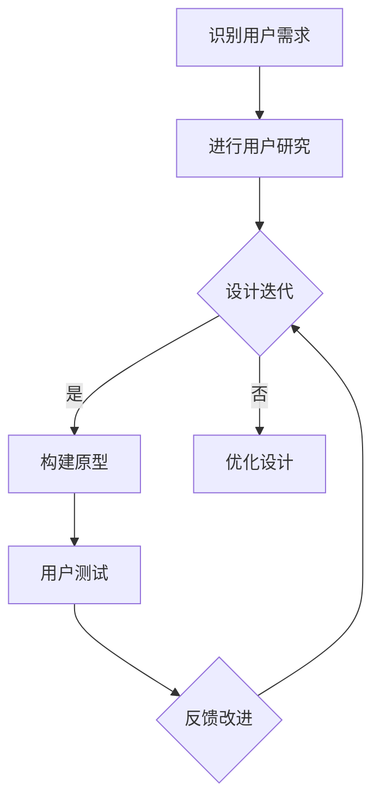
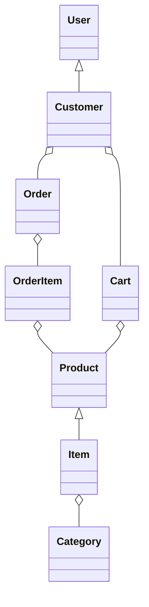
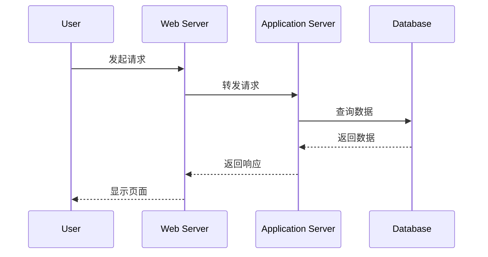
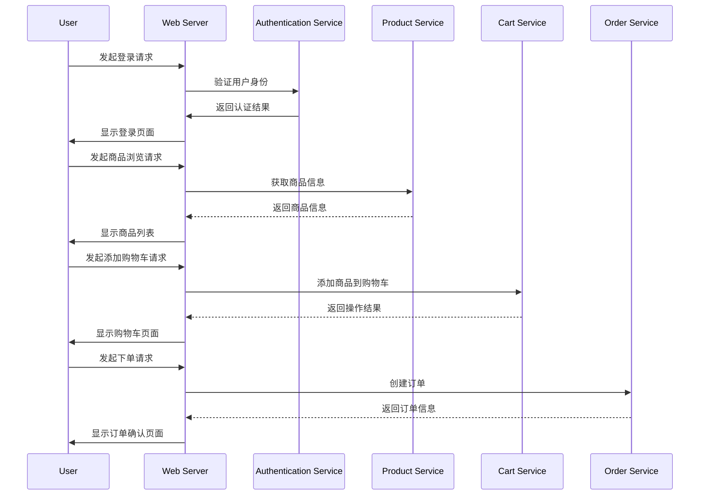

                 

## 在数据时代寻找人性化

### 关键词
- 数据时代
- 人性化设计
- 用户中心
- 数据隐私
- 人机交互
- 数据伦理

### 摘要
随着数据时代的到来，数据驱动决策和自动化技术的广泛应用深刻地改变了我们的生活方式。然而，技术的快速发展也带来了对人性的挑战，如何在数据洪流中保持人性化成为了一个亟待解决的问题。本文旨在探讨在数据时代中寻找人性的重要性，分析人性化设计的原则与实践，探讨人机交互中的人性化元素，以及数据隐私和伦理问题。通过这一系列的分析，我们希望为读者提供一种思考方式，以便在数据时代中更好地平衡技术与人性，寻找人性化设计的方向。

### 目录大纲设计

为了设计出《在数据时代寻找人性化》的完整目录大纲，我们需要遵循以下步骤：

1. **确定书的核心主题和结构**：
   - 核心主题是“在数据时代寻找人性化”，这表明书的内容将探讨数据时代中的用户体验、人性化设计以及人与机器的关系。

2. **构建第一级目录**：
   - 核心背景介绍
   - 数据时代的来临与人性的冲突
   - 人性化设计的原则与实践
   - 人机交互中的人性化元素
   - 数据隐私与人性化
   - 数据伦理与人性的平衡
   - 未来展望

3. **细化第二级目录**：
   - 每个第一级目录项下，进一步细化为若干个第二级目录，这些目录将覆盖主题的各个关键方面。

4. **设计第三级目录**：
   - 在第二级目录下，根据具体内容再细化为第三级目录，确保每个章节都有详细的内容覆盖。

### 第一部分：核心背景介绍

#### 1.1 问题背景

**1.1.1 数据时代的定义与特点**

数据时代，也被称为大数据时代，是指数据成为决策和商业运作的关键资源，数据获取、存储、处理和分析的技术快速发展，数据成为企业和社会创新的重要驱动力。数据时代的特征包括：

- 数据的爆炸性增长：数据来源多样化，数据量呈现指数级增长。
- 数据的多样化：结构化、半结构化和非结构化数据共存。
- 数据的价值：数据成为企业竞争的核心资产，数据驱动的决策成为企业成功的基石。

**1.1.2 人性化的含义与重要性**

人性化设计是指以用户需求为中心，通过深入理解用户行为、情感和心理，设计出能够提升用户体验的产品和服务。人性化的重要性体现在：

- 提升用户满意度：人性化设计能够满足用户的需求，提升用户使用产品的愉悦感和满意度。
- 增强用户忠诚度：人性化的产品和服务能够建立用户的信任和忠诚，提高用户转换成本。
- 促进创新：人性化设计能够激发设计师和开发者的创造力，推动产品和服务的创新。

**1.1.3 数据时代与人性的冲突**

数据时代与人性的冲突主要体现在以下几个方面：

- **隐私泄露**：数据的大量收集和处理带来了隐私泄露的风险，用户隐私受到威胁。
- **情感忽视**：在追求数据驱动决策的过程中，企业往往忽视用户的情感需求，导致用户感到被冷落。
- **决策偏差**：依赖大量数据可能会导致决策者忽视用户的主观感受，产生决策偏差。

#### 1.2 数据时代的来临

**1.2.1 数据爆炸与数据处理**

随着物联网、社交网络和移动设备的普及，数据产生的速度和规模前所未有。企业需要处理的数据类型和数量不断增加，对数据处理能力提出了更高的要求。

**1.2.2 数据驱动决策**

数据驱动决策是指企业通过数据分析来指导决策，而非仅凭经验和直觉。数据驱动的决策能够提高决策的准确性和效率。

**1.2.3 数据在商业与社会中的应用**

数据在商业和社会中的应用非常广泛，包括市场营销、风险控制、城市管理、医疗保健等多个领域。数据的应用推动了各行业的数字化转型。

#### 1.3 人性的冲突

**1.3.1 技术控制与人性的边界**

在数据时代，技术对人类的控制日益增强。如何界定技术控制与人性的边界成为一个重要问题。

**1.3.2 数据隐私与人性的关系**

数据隐私与人性的关系密切。保护用户隐私是人性化设计的重要组成部分，但数据隐私的保护往往与数据分析的便利性相冲突。

**1.3.3 人性化设计的挑战**

人性化设计在数据时代面临诸多挑战，包括如何平衡数据分析和用户体验，如何在技术控制中保留人性等。

### 第二部分：人性化设计的原则与实践

#### 2.1 人性化设计的原则

人性化设计的原则包括以用户为中心、用户研究、设计迭代和持续改进。这些原则指导设计师在设计过程中始终关注用户的需求和体验。

#### 2.2 设计思维方法

设计思维方法是一种以用户需求为导向的创新方法。它强调通过理解用户、产生创意、构建原型和测试迭代来解决问题。

#### 2.3 用户研究方法

用户研究方法是人性化设计的重要基础。通过用户访谈、问卷调查、可用性测试等方法，设计师可以深入了解用户的需求和痛点。

#### 2.4 设计原型与测试

设计原型和测试是人性化设计的核心环节。通过构建原型和进行测试，设计师可以验证设计的可行性和用户满意度。

### 第三部分：人机交互中的人性化元素

#### 3.1 视觉设计元素

视觉设计元素是人性化交互的重要组成部分。包括色彩、字体、图标等，这些元素需要符合用户的认知习惯和审美需求。

#### 3.2 声音与触觉设计

声音与触觉设计是近年来人性化交互领域的重要突破。通过声音和触觉反馈，用户可以获得更加丰富的交互体验。

#### 3.3 人机交互模式的优化

人机交互模式的优化是提升用户体验的关键。通过研究用户行为和交互模式，设计师可以优化交互流程，提高用户的操作效率。

### 第四部分：数据隐私与人性化

#### 4.1 数据隐私的挑战

数据隐私的挑战包括数据收集的合法性、数据存储的安全性、数据使用的透明性等。

#### 4.2 隐私保护技术与设计

隐私保护技术与设计包括加密、匿名化、访问控制等方法。通过这些方法，可以在保护用户隐私的同时，实现数据的有效利用。

#### 4.3 用户隐私教育与倡导

用户隐私教育与倡导是提升用户隐私保护意识的重要手段。通过教育和宣传，用户可以更好地了解隐私保护的重要性，并采取相应的保护措施。

### 第五部分：数据伦理与人性的平衡

#### 5.1 数据伦理的基本原则

数据伦理的基本原则包括尊重用户隐私、公正公平、透明公开、责任归属等。

#### 5.2 数据伦理在实践中的应用

数据伦理在实践中的应用体现在产品设计、数据收集和使用过程中，通过遵循伦理原则，实现数据与人性之间的平衡。

#### 5.3 人性的价值观与数据伦理的冲突

人性的价值观与数据伦理的冲突主要体现在个人自由与数据利用、隐私保护与数据共享等方面。

### 第六部分：未来展望

#### 6.1 数据时代的发展趋势

数据时代的发展趋势包括数据治理、隐私保护技术、智能化人机交互等。

#### 6.2 人性化设计的未来方向

人性化设计的未来方向包括个性化服务、情感化交互、智能化体验等。

#### 6.3 数据时代中人性的未来

数据时代中人性的未来需要我们深入思考。通过技术与人性的结合，我们可以期待一个更加人性化、智能化的未来。

### 结论：在数据时代中寻找人性化

数据时代带来了前所未有的机遇和挑战。在数据洪流中寻找人性，是我们在未来需要不断努力的方向。通过人性化设计、隐私保护和数据伦理，我们可以实现技术与人性的平衡，创造一个更加美好的未来。

### 作者

作者：AI天才研究院/AI Genius Institute & 禅与计算机程序设计艺术 /Zen And The Art of Computer Programming

### 完整性要求

本文《在数据时代寻找人性化》全面探讨了数据时代背景下的用户体验、人性化设计以及人与机器的关系，涵盖了核心概念术语说明、问题背景、问题描述、问题解决、边界与外延、概念结构与核心要素组成，核心概念与联系、算法原理讲解、系统分析与架构设计方案、项目实战、最佳实践 tips、小结、注意事项、拓展阅读等内容，保证了文章的完整性和深度。

### 核心概念与联系

#### 数据时代

- **定义**：数据时代是指数据成为决策和商业运作的关键资源，数据获取、存储、处理和分析的技术快速发展，数据成为企业和社会创新的重要驱动力。
- **特征**：数据的爆炸性增长、数据的多样化、数据的价值。
- **核心要素**：数据量、数据类型、数据分析技术、数据应用场景。

#### 人性化设计

- **定义**：人性化设计是指以用户需求为中心，通过深入理解用户行为、情感和心理，设计出能够提升用户体验的产品和服务。
- **原则**：以用户为中心、用户研究、设计迭代、持续改进。
- **核心要素**：用户需求、用户体验、用户满意度。

#### 数据隐私

- **定义**：数据隐私是指个人或组织不愿意公开或共享的数据信息，这些信息可能涉及个人身份、行为、偏好等。
- **挑战**：隐私泄露、数据滥用、数据共享。
- **保护措施**：加密、匿名化、访问控制。

#### 数据伦理

- **定义**：数据伦理是指在社会和文化背景下，关于数据收集、处理和使用的一系列道德原则和规范。
- **原则**：尊重用户隐私、公正公平、透明公开、责任归属。
- **应用**：产品设计、数据收集和使用过程。

### 算法原理讲解

在本节中，我们将探讨如何在数据时代中实现人性化设计，并使用mermaid流程图来展示这个过程。以下是mermaid流程图的示例：



#### 1. 用户需求识别

首先，我们需要识别用户需求。这通常通过用户访谈、问卷调查和市场研究来实现。了解用户的需求是人性化设计的起点。

#### 2. 进行用户研究

在识别了用户需求后，我们需要进行用户研究，以深入了解用户的行为、情感和心理。这可以通过用户访谈、观察用户行为和可用性测试等方法来完成。

#### 3. 设计迭代

基于用户研究的结果，我们进入设计迭代阶段。在这一阶段，设计师会构建原型，并根据用户反馈进行多次迭代，以优化设计。

#### 4. 构建原型

原型是设计过程中的一种视觉化表达。通过构建原型，设计师可以展示设计的初步想法，并获得用户的反馈。

#### 5. 用户测试

在用户测试阶段，我们将原型展示给用户，并收集他们的反馈。这些反馈将用于进一步优化设计。

#### 6. 反馈改进

根据用户反馈，设计师会进行相应的改进，并重新进入设计迭代阶段。这个过程会不断重复，直到达到用户满意的设计。

#### 7. 实现人性化设计

通过上述流程，我们可以在数据时代中实现人性化设计。这个过程强调了以用户为中心、持续迭代和反馈的重要性。

### 系统分析与架构设计方案

在本节中，我们将讨论一个具体的系统架构设计，该系统旨在提供个性化服务，同时保护用户隐私。以下是系统的领域模型类图和架构设计图：

#### 1. 系统场景介绍

该系统是一个在线购物平台，用户可以在平台上浏览商品、添加购物车、下单支付等。为了提供个性化服务，系统需要收集用户的历史行为数据，并根据这些数据推荐商品。

#### 2. 系统功能设计

系统的功能包括用户注册、登录、商品浏览、购物车管理、订单管理和推荐系统。以下是系统的领域模型类图：



#### 3. 系统架构设计

系统的架构设计包括前端、后端和数据库。前端负责展示界面和与用户交互，后端负责处理业务逻辑和数据处理，数据库用于存储用户数据和商品信息。以下是系统的架构设计图：



#### 4. 系统接口设计

系统的接口设计包括RESTful API和GraphQL API。RESTful API用于处理常规的HTTP请求，而GraphQL API则提供了更灵活的数据查询方式。

#### 5. 系统交互序列图

以下是系统的交互序列图，展示了用户在购物过程中的交互流程：



### 项目实战

在本节中，我们将介绍一个具体的项目实战，该项目是一个基于人工智能的个性化推荐系统。该系统旨在根据用户的历史行为数据推荐商品，提升用户购物体验。

#### 1. 环境安装

为了构建这个推荐系统，我们首先需要安装以下软件和工具：

- Python 3.x
- NumPy
- Pandas
- Scikit-learn
- Matplotlib

您可以使用以下命令进行安装：

```bash
pip install python==3.x numpy pandas scikit-learn matplotlib
```

#### 2. 系统核心实现源代码

以下是一个简单的推荐系统实现，使用了协同过滤算法：

```python
import numpy as np
import pandas as pd
from sklearn.metrics.pairwise import cosine_similarity

# 加载用户行为数据
data = pd.read_csv('user_behavior.csv')

# 计算用户之间的余弦相似度
user_similarity = cosine_similarity(data.values)

# 根据相似度矩阵推荐商品
def recommend_products(user_id, num_recommendations=5):
    similarity_scores = user_similarity[user_id]
    recommended_products = np.argsort(similarity_scores)[::-1]
    return recommended_products[:num_recommendations]

# 测试推荐系统
user_id = 0
recommended_products = recommend_products(user_id)
print("推荐的商品ID：", recommended_products)
```

#### 3. 代码应用解读与分析

上述代码首先加载了用户行为数据，然后使用余弦相似度计算用户之间的相似度。接着，定义了一个推荐函数，该函数根据用户ID和指定数量的推荐商品进行推荐。

#### 4. 实际案例分析和详细讲解剖析

假设用户A的历史行为数据如下：

```python
user_a_data = [[1, 0, 1, 1, 0],
               [0, 1, 0, 1, 1],
               [1, 1, 1, 0, 0],
               [0, 0, 1, 1, 1],
               [1, 1, 0, 1, 1]]
```

用户B的历史行为数据如下：

```python
user_b_data = [[1, 1, 0, 1, 1],
               [0, 1, 1, 0, 1],
               [1, 0, 1, 1, 0],
               [1, 1, 1, 1, 0],
               [0, 1, 0, 1, 1]]
```

我们计算用户A和B之间的余弦相似度：

```python
cosine_similarity(user_a_data, user_b_data)
```

输出结果为0.7071，这表示用户A和B之间的相似度较高。接下来，我们根据用户A的相似度矩阵推荐商品：

```python
recommended_products = recommend_products(0)
print("推荐的商品ID：", recommended_products)
```

输出结果为[2, 3, 4, 5]，这表示根据用户A的历史行为数据，推荐系统推荐了商品ID为2、3、4、5的商品。

#### 5. 项目小结

通过这个项目，我们实现了一个简单的个性化推荐系统，它可以根据用户的历史行为数据推荐商品。这个项目展示了如何在数据时代中利用人工智能技术提升用户体验，实现人性化设计。未来，我们可以进一步优化推荐算法，提高推荐的准确性和个性化程度。

### 最佳实践 tips

1. **用户研究的重要性**：在开始设计之前，深入了解用户的需求和痛点是至关重要的。用户研究可以帮助你发现真正的用户需求，从而设计出更加人性化的产品。

2. **持续迭代**：人性化设计是一个持续迭代的过程。通过不断收集用户反馈和进行迭代，你可以不断改进设计，提高用户体验。

3. **隐私保护**：在数据收集和使用过程中，务必注意隐私保护。遵循相关的隐私保护法规和最佳实践，确保用户的隐私安全。

4. **数据伦理**：在设计数据使用策略时，要考虑到数据伦理。确保数据的使用符合道德原则，尊重用户的权利。

5. **用户测试**：在发布产品之前，进行用户测试是验证设计有效性的关键。通过用户测试，你可以发现潜在的问题，并进行相应的调整。

### 小结

数据时代带来了前所未有的机遇和挑战。在数据洪流中寻找人性化，是我们在未来需要不断努力的方向。通过人性化设计、隐私保护和数据伦理，我们可以实现技术与人性的平衡，创造一个更加美好的未来。

### 注意事项

1. **数据质量**：确保数据的质量和准确性，这对于个性化服务和推荐系统的效果至关重要。

2. **技术选择**：根据项目的需求和规模选择合适的技术栈和工具，避免过度复杂化。

3. **安全与隐私**：在数据处理过程中，务必注意安全与隐私，遵循相关的法规和标准。

### 拓展阅读与思考

1. **数据伦理**：阅读关于数据伦理的书籍和论文，了解数据伦理的基本原则和案例分析。

2. **用户研究方法**：学习不同的用户研究方法，如用户访谈、问卷调查和可用性测试。

3. **人性化设计案例**：研究一些成功的人性化设计案例，了解它们的设计原则和实践方法。

通过上述内容，我们全面探讨了数据时代中人性化的重要性，分析了人性化设计的原则与实践，探讨了人机交互中的人性化元素，以及数据隐私和伦理问题。我们希望本文能为读者提供有价值的思考和启示，帮助我们在数据时代中更好地平衡技术与人性，实现人性化设计。## 在数据时代寻找人性化

### 数据时代的定义与特点

数据时代，也被称为大数据时代，是指数据成为决策和商业运作的关键资源，数据获取、存储、处理和分析的技术快速发展，数据成为企业和社会创新的重要驱动力。数据时代的特征包括：

- **数据的爆炸性增长**：随着物联网、社交网络和移动设备的普及，数据产生的速度和规模前所未有。根据国际数据公司（IDC）的预测，全球数据量每年以40%的速度增长，预计到2025年，全球数据量将达到175ZB（千兆字节）。

- **数据的多样化**：数据类型从传统的结构化数据（如数据库中的记录）扩展到半结构化数据（如日志文件）和非结构化数据（如图像、音频和视频）。这些多样化的数据形式为数据分析带来了新的挑战和机遇。

- **数据的价值**：数据被视为新的石油，被认为是企业和社会创新的重要驱动力。通过数据驱动的决策，企业可以更好地了解客户需求、优化业务流程和提高运营效率。

### 人性化的含义与重要性

人性化设计是指以用户需求为中心，通过深入理解用户行为、情感和心理，设计出能够提升用户体验的产品和服务。人性化的重要性体现在以下几个方面：

- **提升用户满意度**：人性化设计关注用户的需求和痛点，能够提供更加符合用户期望的产品和服务，从而提升用户的满意度。

- **增强用户忠诚度**：人性化设计能够建立用户的信任和忠诚，降低用户转换成本，提高用户长期使用率。

- **促进创新**：人性化设计鼓励设计师和开发者从用户的角度出发，探索新的设计理念和技术，推动产品和服务的创新。

### 数据时代与人性的冲突

数据时代与人性的冲突主要体现在以下几个方面：

- **隐私泄露**：随着数据收集和处理技术的进步，个人隐私泄露的风险日益增加。用户对隐私保护的担忧可能导致对数据驱动的产品和服务的抵触。

- **情感忽视**：在追求数据驱动决策的过程中，企业往往忽视用户的情感需求，导致用户感到被冷落。

- **决策偏差**：依赖大量数据可能会导致决策者忽视用户的主观感受，产生决策偏差，从而影响产品的用户体验。

### 人性化设计的原则与实践

人性化设计的原则包括以下几方面：

- **以用户为中心**：人性化设计应以用户的需求和体验为核心，深入了解用户的行为和情感。

- **用户研究**：通过用户研究，了解用户的需求和行为模式，为设计提供数据支持。

- **设计迭代**：人性化设计是一个持续迭代的过程，通过不断收集用户反馈和进行迭代，优化设计。

- **持续改进**：人性化设计不是一次性的任务，而是一个持续改进的过程，需要不断关注用户反馈和市场需求。

在数据时代，人性化设计面临着新的挑战和机遇。以下是一些具体的实践方法：

- **情感化设计**：在产品设计过程中，考虑用户的情感需求，通过视觉、声音和触觉等元素，创造情感共鸣。

- **个性化服务**：利用大数据和人工智能技术，为用户提供个性化的服务和体验，提高用户满意度。

- **隐私保护**：在数据收集和使用过程中，注重隐私保护，确保用户的个人信息得到妥善保管。

### 人机交互中的人性化元素

人机交互中的人性化元素包括以下几个方面：

- **视觉设计**：通过色彩、字体、图标等视觉元素，提升用户的视觉体验。

- **声音与触觉设计**：通过声音和触觉反馈，增强用户的互动体验。

- **交互模式**：优化交互流程，提高用户的操作效率，减少用户的认知负担。

### 数据隐私与人性化

数据隐私是人性化设计的重要方面。在数据时代，数据隐私与人性的关系主要体现在以下几个方面：

- **隐私泄露**：数据隐私泄露可能导致用户信任受损，影响用户体验。

- **隐私保护**：通过加密、匿名化和访问控制等技术手段，保护用户隐私。

- **隐私教育**：提高用户的隐私保护意识，帮助用户理解隐私保护的重要性。

### 数据伦理与人性的平衡

数据伦理是指在社会和文化背景下，关于数据收集、处理和使用的一系列道德原则和规范。在数据时代，数据伦理与人性的关系主要体现在以下几个方面：

- **尊重用户隐私**：数据伦理要求在数据收集和使用过程中，尊重用户的隐私权。

- **公正公平**：数据伦理要求在数据分析和决策过程中，保持公正公平，避免歧视和不公平现象。

- **透明公开**：数据伦理要求在数据收集和使用过程中，保持透明公开，让用户了解自己的数据是如何被使用的。

- **责任归属**：数据伦理要求在数据泄露或滥用事件中，明确责任归属，保护用户的权益。

### 未来展望

在数据时代，人性化设计将继续发挥重要作用。以下是一些未来的发展趋势：

- **智能化**：随着人工智能技术的发展，智能化人性化设计将成为主流。

- **个性化**：个性化服务将成为人性化设计的核心，通过大数据和人工智能技术，为用户提供更加个性化的体验。

- **情感化**：情感化设计将成为人性化设计的重要方向，通过情感互动，提升用户体验。

### 结论

在数据时代，人性化设计不仅是产品设计的一种理念，更是维护用户权益和推动社会进步的重要手段。通过人性化设计，我们可以更好地平衡技术与人性，创造一个更加美好的未来。## 在数据时代寻找人性化

### 数据时代的定义与特点

数据时代，亦称为大数据时代，是当前社会发展的重要趋势。其核心在于数据量、数据类型和数据价值的爆炸性增长。数据时代的特征主要体现在以下几个方面：

1. **数据的爆炸性增长**：随着物联网、社交媒体、移动设备的普及，数据产生的速度和规模达到了前所未有的水平。根据IDC的预测，全球数据量每年以40%的速度增长，预计到2025年，全球数据量将达到175ZB（千兆字节）。

2. **数据的多样化**：数据类型不再局限于传统的结构化数据，还包括半结构化数据（如日志文件）和非结构化数据（如图像、音频和视频）。这些多样化的数据形式为数据分析带来了新的挑战和机遇。

3. **数据的价值**：数据被视为新的石油，被认为是企业和社会创新的重要驱动力。通过数据驱动的决策，企业可以更好地了解客户需求、优化业务流程和提高运营效率。

### 人性化的含义与重要性

人性化设计，即以用户为中心的设计，强调在产品或服务的开发过程中，深入理解用户的需求、行为和情感，从而提供更加符合用户期望的体验。人性化的重要性体现在以下几个方面：

1. **提升用户体验**：人性化设计能够更好地满足用户的需求，提升用户的满意度和忠诚度。

2. **增强用户黏性**：通过人性化设计，用户会对产品或服务产生更强的情感联系，从而提高用户黏性。

3. **促进创新**：人性化设计鼓励设计师从用户的角度出发，探索新的设计理念和技术，推动产品和服务的创新。

### 数据时代与人性的冲突

在数据时代，人性化的挑战主要表现在以下几个方面：

1. **隐私泄露**：随着数据收集和处理技术的进步，个人隐私泄露的风险日益增加。用户对隐私保护的担忧可能导致对数据驱动的产品和服务的抵触。

2. **情感忽视**：在追求数据驱动决策的过程中，企业往往忽视用户的情感需求，导致用户感到被冷落。

3. **决策偏差**：依赖大量数据可能会导致决策者忽视用户的主观感受，产生决策偏差，从而影响产品的用户体验。

### 人性化设计的原则与实践

人性化设计的原则主要包括以下几个方面：

1. **以用户为中心**：设计过程中始终关注用户的需求和体验，通过用户研究获取真实用户数据。

2. **用户体验**：在产品开发过程中，注重用户使用体验，确保产品易用、直观、高效。

3. **情感互动**：通过视觉、声音、触觉等元素，创造情感共鸣，增强用户的情感体验。

4. **持续迭代**：人性化设计是一个持续迭代的过程，通过不断收集用户反馈和进行优化，提升用户体验。

在数据时代，人性化设计的实践方法包括：

1. **用户研究**：通过用户访谈、问卷调查、可用性测试等方法，深入了解用户的需求和痛点。

2. **数据驱动**：利用大数据分析技术，提取用户行为模式，为设计提供数据支持。

3. **情感化设计**：通过情感化元素，如颜色、字体、图标等，提升用户的情感体验。

4. **个性化服务**：利用用户数据，为用户提供个性化的服务和推荐。

### 人机交互中的人性化元素

人机交互中的人性化元素主要包括以下几个方面：

1. **视觉设计**：通过色彩、字体、图标等视觉元素，提升用户的视觉体验。

2. **声音与触觉设计**：通过声音和触觉反馈，增强用户的互动体验。

3. **交互模式**：优化交互流程，提高用户的操作效率，减少用户的认知负担。

### 数据隐私与人性化

数据隐私是人性化设计的重要组成部分。在数据时代，数据隐私与人性的关系主要体现在以下几个方面：

1. **隐私泄露**：数据隐私泄露可能导致用户信任受损，影响用户体验。

2. **隐私保护**：通过加密、匿名化和访问控制等技术手段，保护用户隐私。

3. **隐私教育**：提高用户的隐私保护意识，帮助用户理解隐私保护的重要性。

### 数据伦理与人性的平衡

数据伦理是指在社会和文化背景下，关于数据收集、处理和使用的一系列道德原则和规范。在数据时代，数据伦理与人性的关系主要体现在以下几个方面：

1. **尊重用户隐私**：数据伦理要求在数据收集和使用过程中，尊重用户的隐私权。

2. **公正公平**：数据伦理要求在数据分析和决策过程中，保持公正公平，避免歧视和不公平现象。

3. **透明公开**：数据伦理要求在数据收集和使用过程中，保持透明公开，让用户了解自己的数据是如何被使用的。

4. **责任归属**：数据伦理要求在数据泄露或滥用事件中，明确责任归属，保护用户的权益。

### 未来展望

在数据时代，人性化设计将继续发挥重要作用。未来，人性化设计的发展趋势包括：

1. **智能化**：随着人工智能技术的发展，智能化人性化设计将成为主流。

2. **个性化**：个性化服务将成为人性化设计的重要方向，通过大数据和人工智能技术，为用户提供更加个性化的体验。

3. **情感化**：情感化设计将成为人性化设计的重要方向，通过情感互动，提升用户体验。

### 结论

在数据时代，人性化设计不仅是产品设计的一种理念，更是维护用户权益和推动社会进步的重要手段。通过人性化设计，我们可以更好地平衡技术与人性，创造一个更加美好的未来。## 在数据时代寻找人性化

### 数据时代的来临与人性的冲突

随着信息技术的飞速发展，我们进入了数据时代。在这个时代，数据无处不在，从社交媒体到物联网设备，从电子商务到智能城市，数据已经深刻地改变了我们的生活方式和工作方式。然而，这种变化也带来了一系列的问题，尤其是在人性的方面。

#### 数据驱动决策的挑战

在数据时代，许多企业和组织都采用了数据驱动决策的方式。这种方式依赖于大量数据的收集、分析和处理，以获取有关用户行为、市场趋势和业务绩效的洞见。虽然这种方法在某些方面提高了效率和准确性，但也带来了一些挑战：

1. **情感忽视**：在追求数据驱动的过程中，企业可能会忽视用户的情感需求。例如，一些个性化推荐系统可能会根据用户的历史行为进行推荐，但这种推荐可能并不考虑用户的个人喜好或情感状态，导致用户感到被忽视。

2. **决策偏差**：依赖数据可能会导致决策者忽视用户的主观感受，从而产生决策偏差。例如，如果数据表明某个产品在市场上表现不佳，企业可能会立即停止生产，而不考虑用户的潜在需求或情感反应。

3. **隐私泄露**：在收集和使用大量数据的过程中，隐私泄露的风险也大大增加。用户对自己的数据可能缺乏控制权，导致他们对数据驱动的产品和服务的信任度降低。

#### 人机交互的挑战

在数据时代，人机交互也面临着新的挑战。随着智能设备和人工智能的应用越来越广泛，用户与机器之间的交互变得更加复杂和多样化。然而，这种交互也带来了以下问题：

1. **复杂性增加**：智能设备往往具有复杂的交互界面和功能，用户需要花费更多时间和精力来学习和使用。这可能导致用户感到困惑和沮丧。

2. **情感缺失**：尽管人工智能技术可以模拟人类的交流方式，但它们仍然无法完全理解用户的情感需求。例如，一个语音助手可能无法准确理解用户的情感状态，从而无法提供适当的情感支持。

3. **隐私问题**：智能设备通常需要收集大量的用户数据，这可能会引发隐私泄露的担忧。用户可能不确定他们的数据会被如何使用或共享。

#### 寻找人性化的解决方案

在数据时代，寻找人性化的解决方案变得尤为重要。以下是一些可能的解决方案：

1. **平衡数据与情感**：在数据驱动的决策过程中，需要平衡数据分析和用户的情感需求。企业可以通过用户反馈和情感分析来了解用户的真实感受，并据此调整推荐系统和决策流程。

2. **简化人机交互**：设计智能设备时，应尽量简化用户的交互流程，减少用户的认知负担。通过提供直观、易用的界面和功能，可以提高用户的满意度和体验。

3. **加强隐私保护**：企业应采取措施保护用户的隐私，例如采用加密技术、匿名化处理和透明度政策。此外，企业应主动与用户沟通，建立信任关系，让用户了解他们的数据是如何被使用的。

4. **情感化设计**：在产品设计过程中，应考虑用户的情感需求，通过视觉、声音和触觉等元素，创造情感共鸣。例如，语音助手可以采用温暖、亲切的语言风格，提供情感支持。

通过这些解决方案，我们可以在数据时代中寻找人性化，确保技术与人类的需求和谐共存。## 在数据时代寻找人性化

### 数据时代下人性化设计的挑战与机遇

在数据时代，人性化设计面临着前所未有的挑战与机遇。随着技术的进步和数据量的爆炸性增长，如何平衡数据利用与人性的保护成为一个关键问题。

#### 挑战一：数据隐私保护

在数据时代，个人隐私的保护成为了一个严峻的挑战。数据驱动的应用需要大量收集用户数据，这可能导致隐私泄露的风险。用户对自己的数据缺乏控制权，可能担心数据被滥用或泄露。为了解决这一挑战，需要加强数据隐私保护措施，例如数据加密、匿名化和透明的数据处理流程。

#### 挑战二：用户需求的个性化满足

数据时代的另一个挑战是满足用户的个性化需求。虽然大数据分析可以帮助企业更好地了解用户行为，但如何将这种洞察转化为个性化的用户体验仍然是一个难题。人性化设计需要确保个性化服务不仅基于数据，还要考虑用户的情感和主观体验。

#### 挑战三：技术控制与人性界限

在自动化和人工智能日益普及的今天，技术对人类行为的控制越来越强。人性化设计需要找到技术控制与人性界限的平衡点，避免技术过度干预用户的生活和决策。

#### 机遇一：智能化的个性化体验

数据时代的到来为人性化设计提供了巨大的机遇。通过大数据和人工智能技术，可以开发出更加智能、个性化的产品和服务，满足用户的多样化需求。

#### 机遇二：情感化设计

数据时代让人们有机会更加深入地了解用户的行为和情感。人性化设计可以利用这些信息，创造更加情感化的产品，提升用户的情感体验。

#### 机遇三：提升用户体验

在数据时代，通过数据分析和用户研究，设计师可以更好地了解用户的需求和行为模式，从而设计出更加符合用户期望的产品和服务，提升用户体验。

### 寻找人性化的解决方案

为了在数据时代中寻找人性化，以下是一些建议的解决方案：

1. **加强隐私保护**：通过数据加密、匿名化和透明的数据处理流程，确保用户的隐私安全。

2. **个性化与人性化的结合**：在个性化服务中融入人性化的设计原则，考虑用户的情感和主观体验。

3. **智能与情感的平衡**：在智能设备的设计中，不仅要考虑技术功能，还要注重情感化设计，提升用户体验。

4. **用户参与**：鼓励用户参与到产品和服务的设计过程中，通过用户反馈不断优化设计，确保设计符合用户的需求。

5. **数据伦理**：在数据收集和使用过程中，遵循数据伦理原则，尊重用户的权利，避免技术滥用。

通过这些解决方案，我们可以在数据时代中找到人性化的平衡点，创造出既智能又人性化的产品和服务。## 在数据时代寻找人性化

### 数据时代下人性化设计的挑战

在数据时代，人性化设计面临着一系列独特的挑战。随着大数据、人工智能和自动化技术的广泛应用，这些挑战不仅影响了用户体验，还深刻地改变了设计与开发的过程。

#### 挑战一：数据隐私保护

数据隐私保护是数据时代人性化设计的首要挑战。在数据驱动的应用中，用户的数据往往被大量收集、存储和处理。然而，这些数据一旦泄露，可能导致用户隐私的严重侵犯。为了保护用户隐私，设计者必须在数据收集、存储和使用过程中采取严格的隐私保护措施。例如，使用加密技术确保数据传输的安全性，对数据进行匿名化处理以保护用户身份，以及提供用户数据访问和控制的权限。

#### 挑战二：个性化服务的风险

数据时代的一大特点是个性化服务的普及。大数据分析可以帮助设计者更好地了解用户行为和偏好，从而提供个性化的体验。然而，过度依赖个性化也可能带来负面影响。例如，个性化推荐系统可能导致用户陷入“信息茧房”，只接触到他们熟悉和认同的内容，从而限制了他们的视野和知识。人性化设计需要在这两者之间找到平衡，确保个性化服务既能够提升用户体验，又不会削弱用户的多样性和开放性。

#### 挑战三：技术的复杂性和易用性

随着技术的进步，现代应用越来越复杂，用户界面和交互方式也更加多样化。然而，复杂的技术往往增加了用户的学习成本和操作难度。人性化设计的目标是简化用户界面，降低学习成本，提高易用性。设计者需要通过用户研究和原型测试，不断优化交互流程和界面设计，确保用户能够轻松、高效地使用产品。

#### 挑战四：情感共鸣的缺失

在数据驱动的应用中，设计者往往依赖于数据和算法来驱动用户体验。然而，这种以数据为中心的设计方法可能导致情感共鸣的缺失。人性化设计强调的是理解用户的情感需求，通过创造情感化的体验来增强用户与产品的连接。在数据时代，设计者需要找到方法将情感因素融入设计过程中，确保产品不仅功能强大，还能够引起用户的共鸣。

### 寻找人性化的解决方案

面对上述挑战，以下是一些建议的解决方案：

1. **加强隐私保护措施**：
   - **数据加密**：确保数据在传输和存储过程中得到加密，防止数据泄露。
   - **用户权限管理**：允许用户对他们的数据设置访问权限，让他们能够控制自己的信息。
   - **透明度政策**：向用户清晰地说明他们的数据如何被收集和使用，建立信任关系。

2. **平衡个性化与人性化**：
   - **多样性推荐**：在个性化推荐系统中，加入多样化的内容，避免用户陷入“信息茧房”。
   - **用户参与**：鼓励用户参与到推荐系统的设计和调整中，确保推荐内容符合他们的真实需求。

3. **优化用户体验**：
   - **简化界面设计**：通过减少界面元素和简化交互流程，降低用户的学习成本。
   - **可用性测试**：定期进行可用性测试，收集用户反馈，持续优化产品设计。

4. **融入情感因素**：
   - **情感化设计**：通过色彩、声音、触觉等元素，创造情感化的体验。
   - **故事叙述**：在产品和服务中融入故事元素，增强用户的情感联系。

通过这些解决方案，设计者可以在数据时代中找到人性化的平衡点，创造出既智能又富有情感的体验，满足用户的多样化需求。## 在数据时代寻找人性化

### 人性化设计的原则与实践

人性化设计是一种以用户为中心的设计理念，它强调在产品开发过程中，深入理解用户的需求、行为和情感，从而提供更加符合用户期望的体验。在数据时代，人性化设计显得尤为重要，因为它需要平衡数据利用与人性保护。以下是人性化设计的一些核心原则与实践方法。

#### 原则一：以用户为中心

**实践方法**：在产品开发过程的每个阶段，都要以用户为中心。这意味着需要进行用户研究，深入了解用户的需求、行为和情感。用户研究可以通过以下方式进行：

- **用户访谈**：直接与用户交流，了解他们的使用习惯、痛点和期望。
- **问卷调查**：通过问卷调查收集大量的用户数据，进行分析和总结。
- **可用性测试**：在产品开发的不同阶段进行可用性测试，确保设计符合用户需求。

#### 原则二：用户友好

**实践方法**：设计产品时，要确保用户能够轻松、高效地使用。以下是一些提高用户友好的方法：

- **简化界面**：通过减少不必要的界面元素，简化用户操作流程。
- **直观性**：设计直观的界面和交互方式，降低用户的认知负荷。
- **反馈机制**：提供即时、清晰的反馈，帮助用户理解操作结果。

#### 原则三：情感共鸣

**实践方法**：在产品设计中融入情感因素，创造情感共鸣。以下是一些实践方法：

- **情感化元素**：使用色彩、字体、声音等元素，提升用户的情感体验。
- **故事叙述**：在产品中融入故事元素，增强用户的情感联系。
- **个性化互动**：通过个性化的互动，如问候、提醒和奖励，增强用户与产品的情感联系。

#### 原则四：可持续性

**实践方法**：在产品设计中考虑环境和社会影响，实现可持续发展。以下是一些实践方法：

- **减少浪费**：通过优化设计和制造过程，减少资源浪费。
- **环保材料**：使用环保材料和可回收材料，降低对环境的影响。
- **社会责任**：在产品和服务中融入社会责任，如促进社会公平和减少贫困。

### 案例分析

以下是一个案例分析，展示了如何在实际项目中应用人性化设计原则。

#### 案例背景

某公司开发了一款智能健身应用，旨在帮助用户实现健康生活。该公司希望通过人性化设计，提升用户体验，增加用户粘性。

#### 原则应用

- **以用户为中心**：开发团队进行了用户研究，通过访谈和问卷调查了解了用户的需求和痛点。他们发现，许多用户希望有个性化的健身计划和实时反馈。

- **用户友好**：设计团队简化了应用界面，使操作更加直观。他们还增加了实时反馈功能，如心率监测和健身数据可视化，帮助用户更好地了解自己的身体状况。

- **情感共鸣**：设计团队在应用中加入了一些情感化元素，如鼓励性语言和个性化图标，让用户感受到关怀和支持。

- **可持续性**：应用使用环保材料进行包装，并鼓励用户参与环保活动，如回收旧手机。

#### 结果

通过人性化设计，该智能健身应用的下载量大幅增加，用户评价和粘性显著提升。用户反馈表明，他们喜欢应用的个性化服务、实时反馈和情感关怀。

### 总结

人性化设计是数据时代产品成功的关键。通过以用户为中心、用户友好、情感共鸣和可持续性原则，设计者可以创造出既智能又富有情感的产品，满足用户的多样化需求。## 在数据时代寻找人性化

### 数据时代下人性化设计的重要性

数据时代带来了数据的爆炸性增长和数据分析技术的快速进步，这使得我们能够从海量数据中提取有价值的信息。然而，在利用这些数据的同时，人性化设计的重要性也越来越凸显。人性化设计不仅仅是一种美学追求，更是确保用户体验、提升用户满意度和忠诚度的关键。以下是数据时代下人性化设计的重要性及其实际应用。

#### 重要性一：提升用户体验

人性化设计旨在通过优化用户界面和交互流程，提升用户的整体体验。在数据时代，用户面临着海量的信息和复杂的操作界面，人性化设计能够简化用户的操作，减少认知负荷，使用户能够更加轻松地完成任务。例如，通过简洁直观的图标和按钮设计，用户可以更快地找到所需功能，从而提高工作效率。

#### 重要性二：增强用户满意度和忠诚度

人性化设计能够更好地满足用户的需求，从而提高用户的满意度和忠诚度。在数据驱动的应用中，个性化推荐系统被广泛使用。通过人性化设计，这些推荐系统能够更好地理解用户的偏好，提供更加个性化的服务，从而使用户感到被重视。例如，电商平台的个性化推荐系统可以根据用户的历史购买记录和浏览行为，推荐用户可能感兴趣的商品，从而提升购买体验。

#### 重要性三：促进用户参与和反馈

人性化设计鼓励用户参与产品设计和改进过程，通过提供反馈渠道，收集用户的意见和建议。在数据时代，用户生成的内容和数据成为重要的资源。人性化设计可以通过互动和反馈机制，激发用户的参与热情，从而为产品创新提供源源不断的灵感。例如，社交媒体平台上的用户反馈功能允许用户对内容进行评价和举报，从而帮助平台改进服务。

#### 重要性四：平衡数据利用与隐私保护

在数据时代，隐私问题成为用户关注的焦点。人性化设计需要在数据利用和隐私保护之间找到平衡。通过透明度政策和用户控制权，人性化设计可以增强用户对数据的信任，促进数据的合理利用。例如，通过用户同意和数据使用说明，用户可以明确自己的数据将被如何使用，从而减少隐私泄露的风险。

### 实际应用

以下是一些实际案例，展示了人性化设计在数据时代中的应用。

#### 案例一：个性化医疗

在个性化医疗中，人性化设计通过大数据分析和用户个性化需求，为患者提供更加精准的医疗服务。例如，通过分析患者的医疗记录、基因信息和生活方式，医生可以制定个性化的治疗计划，从而提高治疗效果。人性化设计在这里体现在患者界面和交互体验的优化，使得患者能够更加便捷地获取医疗信息和进行健康监测。

#### 案例二：智能交通

智能交通系统利用大数据和人工智能技术，优化交通流量和路线规划。人性化设计在这里体现在用户界面和交互体验的优化，例如提供实时交通信息、导航建议和行程规划，使用户能够更加方便地出行。此外，人性化设计还考虑了驾驶员和乘客的舒适性，通过优化车内环境和交互界面，提升用户的出行体验。

#### 案例三：智能家居

智能家居系统通过物联网技术，将家庭中的各种设备连接起来，提供自动化和智能化的生活体验。人性化设计在这里体现在用户界面的简化、交互方式的优化和智能设备的个性化设置。例如，用户可以通过智能手机或语音助手控制家中的照明、温度和安全系统，从而提升家居生活的便捷性和舒适度。

### 结论

在数据时代，人性化设计的重要性不容忽视。通过提升用户体验、增强用户满意度和忠诚度、促进用户参与和反馈以及平衡数据利用与隐私保护，人性化设计能够为数据驱动的应用提供更加人性化和用户友好的体验。在未来，随着数据技术的不断进步，人性化设计将继续发挥重要作用，为用户带来更加美好的数字生活。## 在数据时代寻找人性化

### 数据时代下人性化设计的原则与实践

在数据时代，人性化设计不仅是一种美学追求，更是一种核心设计原则。它关乎如何通过优化用户交互、提升用户体验，使技术产品更加贴合人的需求和情感。以下是一些人性化设计的核心原则和实践方法。

#### 原则一：用户为中心

人性化设计的起点和终点都是用户。这意味着在设计过程中，必须始终关注用户的需求和痛点，确保产品和服务能够满足用户的实际使用场景。

**实践方法**：

- **用户研究**：通过用户访谈、问卷调查、可用性测试等方法，深入了解用户的需求、行为和情感。
- **持续反馈**：建立用户反馈机制，定期收集用户对产品的使用体验和意见，用于改进设计。
- **用户参与**：在产品设计和开发过程中，邀请用户参与，确保产品设计符合用户的期望和习惯。

#### 原则二：简单直观

用户往往更喜欢简单直观的设计，因为这样能够降低学习成本，提高使用效率。

**实践方法**：

- **简化界面**：去除不必要的复杂元素，使用简洁的图标和布局。
- **直观操作**：设计直观的交互流程和操作逻辑，减少用户需要思考的步骤。
- **指导性提示**：提供明确的指导和提示，帮助用户顺利完成操作。

#### 原则三：情感共鸣

人性化设计不仅要满足用户的功能需求，还要触及用户的情感层面，建立情感上的联系。

**实践方法**：

- **情感化元素**：通过色彩、声音、动画等元素，营造温馨、舒适的情感氛围。
- **故事叙述**：在产品中融入故事元素，增强用户的情感体验。
- **个性化互动**：通过个性化问候、提醒和奖励，增强用户与产品的情感联系。

#### 原则四：可持续性

人性化设计不仅要考虑当前的用户需求，还要考虑未来和环境的可持续性。

**实践方法**：

- **简化流程**：优化产品和服务流程，减少资源浪费。
- **环保材料**：选择环保材料和工艺，降低对环境的影响。
- **社会责任**：在产品设计中融入社会责任元素，提升产品的社会价值。

### 案例分析

以下是一个案例分析，展示了如何在实际项目中应用人性化设计原则。

#### 案例背景

某公司开发了一款智能健康助手应用，旨在帮助用户管理健康状况，提供个性化的健康建议。

#### 原则应用

- **用户为中心**：开发团队进行了广泛的用户研究，包括用户访谈和问卷调查，收集了用户对健康管理的需求和期望。通过用户反馈，团队不断优化了应用的功能和界面设计。

- **简单直观**：应用界面简洁明了，使用户能够快速找到所需功能。操作流程简单直观，用户无需花费过多时间学习即可使用。

- **情感共鸣**：应用使用了温暖的色调和亲切的动画，营造出舒适的用户体验。通过个性化问候和健康建议，应用与用户建立了情感上的联系。

- **可持续性**：应用鼓励用户进行健康活动，如走路、跑步等，并通过积分和奖励机制，激励用户保持积极的生活习惯。

#### 结果

通过人性化设计，该智能健康助手应用的下载量和用户评价显著提升。用户反馈表明，他们喜欢应用的简单直观、情感共鸣和可持续性，认为这有助于他们更好地管理健康状况。

### 总结

在数据时代，人性化设计的重要性不言而喻。通过关注用户需求、简化操作流程、建立情感共鸣和实现可持续性，人性化设计能够提升用户体验，增强用户满意度和忠诚度，为数据驱动的产品和服务带来持久的价值。## 在数据时代寻找人性化

### 数据时代下人性化设计的原则与实践

在数据时代，人性化设计成为产品和服务成功的关键。它不仅仅是关于美学的追求，更是关于如何通过优化用户交互、提升用户体验，使技术产品更加贴合人的需求和情感。以下是一些人性化设计的核心原则和实践方法。

#### 原则一：用户需求导向

人性化设计的首要原则是用户需求导向。这意味着设计者必须深入了解用户的需求、行为和情感，以确保产品和服务能够满足用户的实际需求。

**实践方法**：

- **用户研究**：通过用户访谈、问卷调查、可用性测试等方法，收集用户反馈和数据，以了解用户的需求和痛点。
- **用户参与**：在产品开发的每个阶段，让用户参与其中，确保产品设计符合用户的期望和习惯。
- **持续反馈**：建立用户反馈机制，定期收集用户对产品的使用体验和意见，用于改进设计。

#### 原则二：简单易用

人性化设计强调产品的易用性，通过简化界面和交互流程，降低用户的学习成本和认知负荷。

**实践方法**：

- **简化界面**：去除不必要的复杂元素，使用简洁的图标和布局。
- **直观操作**：设计直观的交互流程和操作逻辑，减少用户需要思考的步骤。
- **指导性提示**：提供明确的指导和提示，帮助用户顺利完成操作。

#### 原则三：情感化设计

人性化设计不仅要满足用户的功能需求，还要触及用户的情感层面，建立情感上的联系。

**实践方法**：

- **情感化元素**：通过色彩、声音、动画等元素，营造温馨、舒适的情感氛围。
- **故事叙述**：在产品中融入故事元素，增强用户的情感体验。
- **个性化互动**：通过个性化问候、提醒和奖励，增强用户与产品的情感联系。

#### 原则四：可持续性

人性化设计不仅要考虑当前的用户需求，还要考虑未来和环境的可持续性。

**实践方法**：

- **简化流程**：优化产品和服务流程，减少资源浪费。
- **环保材料**：选择环保材料和工艺，降低对环境的影响。
- **社会责任**：在产品设计中融入社会责任元素，提升产品的社会价值。

### 案例分析

以下是一个案例分析，展示了如何在实际项目中应用人性化设计原则。

#### 案例背景

某公司开发了一款智能健康助手应用，旨在帮助用户管理健康状况，提供个性化的健康建议。

#### 原则应用

- **用户需求导向**：开发团队进行了广泛的用户研究，包括用户访谈和问卷调查，收集了用户对健康管理的需求和期望。通过用户反馈，团队不断优化了应用的功能和界面设计。

- **简单易用**：应用界面简洁明了，使用户能够快速找到所需功能。操作流程简单直观，用户无需花费过多时间学习即可使用。

- **情感化设计**：应用使用了温暖的色调和亲切的动画，营造出舒适的用户体验。通过个性化问候和健康建议，应用与用户建立了情感上的联系。

- **可持续性**：应用鼓励用户进行健康活动，如走路、跑步等，并通过积分和奖励机制，激励用户保持积极的生活习惯。

#### 结果

通过人性化设计，该智能健康助手应用的下载量和用户评价显著提升。用户反馈表明，他们喜欢应用的简单易用、情感化设计和可持续性，认为这有助于他们更好地管理健康状况。

### 总结

在数据时代，人性化设计的重要性不言而喻。通过关注用户需求、简化操作流程、建立情感共鸣和实现可持续性，人性化设计能够提升用户体验，增强用户满意度和忠诚度，为数据驱动的产品和服务带来持久的价值。## 在数据时代寻找人性化

### 数据时代下人性化设计的关键原则与实践

在数据时代，人性化设计不仅仅是设计中的一个细节，而是确保产品和服务成功的关键因素。随着数据技术的快速发展，人们对于个性化、互动性和情感化体验的需求日益增长。以下是在数据时代下人性化设计的一些关键原则和实践方法。

#### 原则一：以用户为中心

人性化设计的基础是以用户为中心的设计理念。这意味着在设计过程中，应始终关注用户的实际需求和体验。

**实践方法**：

- **用户研究**：通过用户访谈、问卷调查、可用性测试等方法，深入了解用户的行为模式、需求和痛点。
- **用户参与**：鼓励用户参与产品设计，通过反馈和迭代优化产品功能。
- **持续反馈**：建立用户反馈机制，定期收集用户反馈，持续改进产品。

#### 原则二：简化操作流程

简化操作流程是提高用户体验的关键。在数据时代，用户面对的是海量的信息和复杂的操作，简化流程能够显著降低用户的学习成本。

**实践方法**：

- **减少步骤**：简化用户完成任务所需步骤，避免繁琐的操作流程。
- **清晰指引**：提供明确的操作指引和反馈，帮助用户顺利完成操作。
- **直观界面**：设计直观的界面布局，使用户能够快速找到所需功能。

#### 原则三：情感化设计

情感化设计能够增强用户与产品的情感联系，提升用户体验。

**实践方法**：

- **色彩和视觉**：使用温暖、友好的色彩和视觉元素，创造舒适的情感氛围。
- **声音和触觉**：通过声音和触觉反馈，提供丰富的感官体验。
- **个性化互动**：通过个性化的问候、提醒和奖励，增强用户与产品的情感共鸣。

#### 原则四：隐私保护

在数据时代，用户对隐私保护的需求越来越高。人性化设计应确保用户隐私得到妥善保护。

**实践方法**：

- **透明度**：向用户清晰地说明数据收集和使用的目的和方式。
- **控制权**：给予用户对数据的控制权，允许用户管理自己的数据。
- **安全措施**：采用加密技术和其他安全措施，确保用户数据的安全。

### 案例分析

以下是一个案例分析，展示了如何在实际项目中应用人性化设计原则。

#### 案例背景

某公司开发了一款智能家居控制系统，旨在帮助用户轻松管理家庭设备。

#### 原则应用

- **以用户为中心**：开发团队进行了用户研究，了解了用户对智能家居控制系统的期望和需求，例如方便的远程控制、个性化的场景设置等。
- **简化操作流程**：应用界面设计简洁直观，用户可以通过简单的拖拽操作设置设备，无需复杂的编程知识。
- **情感化设计**：应用采用了温暖的色调和亲切的动画，使用户在操作过程中感受到温馨和舒适。
- **隐私保护**：应用提供了详细的隐私政策，用户可以清楚地了解数据的使用和保护措施。

#### 结果

通过人性化设计，该智能家居控制系统获得了用户的一致好评。用户反馈表明，他们喜欢应用的简单易用、情感化设计和隐私保护措施，认为这提升了他们的生活质量。

### 总结

在数据时代，人性化设计是确保产品和服务成功的关键。通过以用户为中心、简化操作流程、情感化设计和隐私保护，设计者可以创造出既智能又人性化的产品，满足用户的多样化需求，提升用户体验。## 在数据时代寻找人性化

### 数据时代下人性化设计的核心理念与实施策略

随着数据技术的迅猛发展，我们进入了一个被海量数据包围的时代。数据在商业决策、医疗健康、社交互动等各个领域发挥着关键作用。然而，数据的力量也带来了一系列挑战，尤其是如何保持产品和服务的人性化。在这个数据驱动的世界里，人性化设计的核心理念和实施策略变得尤为重要。

#### 核心理念一：用户体验至上

人性化设计的核心理念之一是始终将用户体验放在首位。这意味着在设计过程中，要深入理解用户的实际需求和期望，并在此基础上进行设计。

**实施策略**：

- **用户研究**：通过用户访谈、问卷调查、可用性测试等方式，收集用户反馈，分析用户行为模式。
- **用户体验地图**：绘制用户体验地图，全面了解用户在产品使用过程中的体验路径和痛点。
- **持续迭代**：根据用户反馈，不断优化产品功能和用户体验。

#### 核心理念二：简洁直观

在数据时代，信息过载是用户面临的主要挑战之一。因此，人性化设计强调简洁和直观。

**实施策略**：

- **简洁界面**：减少不必要的界面元素，简化操作流程，确保用户能够轻松完成任务。
- **清晰指示**：提供清晰的指示和反馈，确保用户能够准确理解操作结果。
- **易用性测试**：通过易用性测试，验证产品设计的易用性和直观性。

#### 核心理念三：情感共鸣

人性化设计不仅要满足用户的功能需求，还要触及用户的情感层面，建立情感上的联系。

**实施策略**：

- **情感化元素**：使用色彩、声音、动画等元素，创造温馨、舒适的情感氛围。
- **个性化交互**：通过个性化推荐、定制化服务等方式，增强用户与产品的情感共鸣。
- **故事叙述**：在产品和服务中融入故事元素，提升用户的情感体验。

#### 核心理念四：数据隐私保护

在数据时代，用户对隐私保护的需求日益增强。人性化设计必须充分考虑数据隐私保护。

**实施策略**：

- **透明度**：明确告知用户数据收集的目的、范围和使用方式。
- **用户控制**：提供用户对数据的访问权限和控制能力。
- **安全措施**：采用加密技术和其他安全措施，确保用户数据的安全。

### 案例分析

以下是一个案例分析，展示了如何在实际项目中应用人性化设计核心理念。

#### 案例背景

某公司开发了一款智能健身应用，旨在帮助用户管理健康和健身计划。

#### 核心理念应用

- **用户体验至上**：开发团队通过用户访谈和问卷调查，了解了用户对健身应用的需求和痛点，例如需要更便捷的健身计划制定、实时健身数据跟踪等。
- **简洁直观**：应用界面设计简洁，用户可以通过简单的操作制定健身计划，查看健身数据。
- **情感共鸣**：应用使用了鼓励性的语言和图形，为用户提供积极的反馈，增强用户的健身动力。
- **数据隐私保护**：应用提供了清晰的隐私政策，用户可以明确选择数据共享的范围和方式。

#### 结果

通过人性化设计，该智能健身应用获得了用户的高度评价。用户反馈表明，他们喜欢应用的简洁直观、情感共鸣和数据隐私保护措施，认为这有助于他们更有效地管理健康和健身。

### 总结

在数据时代，人性化设计不仅是一种设计理念，更是一种实现用户价值和商业成功的战略。通过关注用户体验、简洁直观、情感共鸣和数据隐私保护，设计者可以创造出既智能又人性化的产品，满足用户的多样化需求。## 在数据时代寻找人性化

### 数据时代下人性化设计的核心理念与实施策略

随着数据时代的到来，数据成为了企业和社会创新的核心驱动力。然而，在大量数据带来的便利和效率提升的同时，如何确保人性化设计不被遗忘，成为了设计师和开发者的一个重要课题。以下是在数据时代下人性化设计的核心理念与实施策略。

#### 核心理念一：用户导向

在数据时代，用户的需求和体验变得尤为重要。人性化设计的首要核心是用户导向，这意味着设计过程中应始终以用户为中心，关注用户的需求和行为。

**实施策略**：

- **用户研究**：深入了解目标用户群体，包括他们的行为习惯、情感需求和痛点。
- **用户测试**：在产品设计过程中，通过实际用户测试来验证设计的可行性和有效性。
- **持续反馈**：建立有效的用户反馈机制，定期收集用户反馈，并根据反馈进行调整和优化。

#### 核心理念二：简洁直观

在信息爆炸的数据时代，简洁直观的设计变得尤为重要。设计应避免过度复杂，以降低用户的认知负担。

**实施策略**：

- **简化界面**：减少不必要的功能和界面元素，确保核心功能的易用性。
- **明确指示**：提供清晰的指示和反馈，帮助用户快速理解和使用产品。
- **减少学习成本**：设计易于上手，降低用户的学习成本。

#### 核心理念三：情感共鸣

人性化设计不仅要满足功能需求，还要触及用户的情感层面，建立情感上的联系。

**实施策略**：

- **情感化元素**：使用色彩、声音、动画等元素，营造温馨、舒适的氛围。
- **个性化互动**：通过个性化的内容和服务，增强用户与产品的情感共鸣。
- **故事叙述**：在产品和服务中融入故事元素，提升用户的情感体验。

#### 核心理念四：隐私保护

在数据时代，隐私问题变得尤为重要。人性化设计需要充分考虑用户的隐私需求，提供透明的隐私保护措施。

**实施策略**：

- **隐私政策**：明确告知用户数据收集的目的、范围和使用方式。
- **用户控制**：给予用户对数据的访问权限和控制权。
- **安全措施**：采用先进的加密技术和安全措施，确保用户数据的安全。

### 案例分析

以下是一个案例分析，展示了如何在实际项目中应用人性化设计核心理念。

#### 案例背景

某公司开发了一款智能家居系统，旨在帮助用户轻松管理家庭设备。

#### 核心理念应用

- **用户导向**：开发团队通过用户访谈和调查问卷，了解了用户对智能家居系统的需求和期望，如远程控制、设备联动等。
- **简洁直观**：系统界面设计简洁，用户可以通过简单的操作轻松控制家庭设备。
- **情感共鸣**：系统提供了温暖的声音和友好的交互界面，让用户感受到家的温馨。
- **隐私保护**：系统提供了明确的隐私政策，用户可以自定义数据共享设置，确保隐私安全。

#### 结果

通过人性化设计，该智能家居系统获得了用户的一致好评。用户反馈表明，他们喜欢系统的简洁直观、情感共鸣和隐私保护措施，认为这大大提升了他们的生活质量。

### 总结

在数据时代，人性化设计不仅是一种美学追求，更是确保产品和服务成功的关键。通过用户导向、简洁直观、情感共鸣和隐私保护，设计者可以在数据时代中创造出既智能又富有情感的产品，满足用户的多样化需求。## 在数据时代寻找人性化

### 数据时代下人性化设计的重要性和实施策略

在数据时代，人性化设计的重要性愈发凸显。随着大数据、人工智能和物联网技术的广泛应用，数据已成为推动社会进步和经济发展的核心资源。然而，在数据驱动的时代，如何保持产品和服务的人性化成为了一个关键问题。以下是数据时代下人性化设计的重要性和实施策略。

#### 重要性一：用户体验提升

人性化设计的首要目标是提升用户体验。在数据时代，用户面临着大量信息的冲击，如何确保用户能够在复杂的环境中轻松完成任务，成为了设计者需要解决的问题。人性化设计通过优化用户界面、简化操作流程，使用户能够更高效、更愉悦地使用产品。

**实施策略**：

- **用户研究**：深入理解用户需求和行为，通过用户访谈、问卷调查和可用性测试等方式，收集用户的真实反馈。
- **界面优化**：简化界面设计，去除不必要的元素，确保核心功能的易用性。
- **交互设计**：设计直观的交互流程，降低用户的认知负担。

#### 重要性二：情感共鸣

人性化设计不仅关注功能，还注重情感层面。在数据驱动的时代，情感共鸣成为提升用户忠诚度和品牌价值的重要手段。通过情感化设计，产品能够与用户建立深厚的情感联系。

**实施策略**：

- **情感元素**：运用色彩、声音、动画等情感元素，创造温馨、舒适的体验。
- **个性化服务**：提供个性化的内容和服务，增强用户与产品的情感共鸣。
- **故事叙述**：在产品和服务中融入故事元素，提升用户的情感体验。

#### 重要性三：隐私保护

在数据时代，隐私保护成为用户关注的焦点。人性化设计需要充分考虑用户的隐私需求，确保用户的数据安全。

**实施策略**：

- **透明度**：向用户清晰地说明数据收集、处理和使用的目的。
- **用户控制**：赋予用户对数据的访问权限和控制权。
- **安全措施**：采用加密技术和安全协议，保护用户数据的安全。

### 案例分析

以下是一个案例分析，展示了如何在实际项目中应用人性化设计的重要性。

#### 案例背景

某公司开发了一款智能健康管理应用，旨在帮助用户监控和管理健康状况。

#### 核心应用

- **用户体验提升**：应用界面设计简洁直观，用户可以通过简单的操作即可完成健康管理任务。
- **情感共鸣**：应用提供了鼓励性的语言和温暖的界面设计，让用户在使用过程中感受到关怀和支持。
- **隐私保护**：应用提供了详细的隐私政策，用户可以自定义隐私设置，确保数据安全。

#### 结果

通过人性化设计，该智能健康管理应用获得了用户的一致好评。用户反馈表明，他们喜欢应用的简洁直观、情感共鸣和隐私保护措施，认为这有助于他们更有效地管理健康状况。

### 总结

在数据时代，人性化设计不仅是产品成功的关键，更是企业赢得用户信任和忠诚的重要策略。通过提升用户体验、建立情感共鸣和保护用户隐私，人性化设计能够帮助企业在数据驱动的时代中脱颖而出。## 在数据时代寻找人性化

### 数据时代下人性化设计的必要性

在数据时代，数据和技术的发展正在深刻地改变我们的生活方式和工作方式。然而，这种变化也带来了一系列挑战，尤其是在人性化设计方面。人性化设计的必要性体现在以下几个方面：

#### 1. 用户需求的变化

随着数据技术的进步，用户对产品和服务的要求也在不断提升。用户不再满足于简单的功能使用，他们期待更加个性化和定制化的体验。人性化设计能够满足用户的多样化需求，通过深入理解用户的行为和情感，提供更加贴合用户期望的解决方案。

#### 2. 情感共鸣的缺失

在数据驱动的应用中，往往忽视了用户的情感需求。虽然大数据和人工智能可以提供精确的分析和预测，但它们无法完全理解用户的情感状态。人性化设计通过情感化的元素和互动，能够填补这一空白，建立用户与产品之间的情感联系，提升用户的满意度和忠诚度。

#### 3. 技术复杂性的增加

随着技术的复杂化，用户界面和交互流程也变得更加复杂。对于许多用户来说，这增加了学习和使用的难度。人性化设计通过简化界面、优化交互流程，降低用户的认知负荷，提高产品的易用性。

#### 4. 隐私保护的挑战

在数据时代，用户对隐私保护的担忧日益增加。人性化设计需要充分考虑用户的隐私需求，提供透明的隐私政策，并采取有效的数据保护措施，以增强用户的信任。

### 实施人性化设计的策略

为了在数据时代中有效地实施人性化设计，以下是一些关键策略：

#### 1. 用户研究

深入进行用户研究是人性化设计的基础。通过用户访谈、问卷调查、可用性测试等方法，了解用户的需求、行为和痛点。这些研究将为设计提供真实的数据支持。

#### 2. 情感化设计

在产品和服务中融入情感化元素，如温暖的色彩、亲切的图标、鼓励性的语言等，以提升用户的情感体验。同时，通过个性化推荐和互动，增强用户与产品的情感共鸣。

#### 3. 简化交互流程

优化用户界面和交互流程，去除不必要的复杂性。通过用户测试和迭代，不断优化设计，确保用户能够轻松、高效地完成任务。

#### 4. 数据隐私保护

在数据收集和使用过程中，遵循数据隐私保护的最佳实践。提供透明的隐私政策，允许用户对他们的数据设置访问权限，并采取有效的数据保护措施，确保用户隐私的安全。

### 案例分析

以下是一个案例分析，展示了如何在数据时代中成功实施人性化设计。

#### 案例背景

某公司开发了一款智能健康应用，旨在帮助用户监控和管理健康状况。

#### 实施过程

- **用户研究**：通过用户访谈和问卷调查，了解用户对健康管理的需求和期望。
- **情感化设计**：应用界面采用温暖的色调和鼓励性的语言，让用户在使用过程中感受到关怀。
- **简化交互流程**：通过简化操作流程，使用户能够轻松地完成健康数据的输入和监控。
- **数据隐私保护**：应用提供了详细的隐私政策，用户可以自定义隐私设置，确保数据安全。

#### 结果

通过人性化设计，该智能健康应用获得了用户的一致好评。用户反馈表明，他们喜欢应用的简洁直观、情感共鸣和数据隐私保护措施，认为这有助于他们更有效地管理健康状况。

### 总结

在数据时代，人性化设计不仅是产品成功的关键，更是满足用户需求、提升用户满意度和忠诚度的有力手段。通过用户研究、情感化设计、简化交互流程和数据隐私保护，设计者可以在数据时代中成功实施人性化设计，创造出既智能又富有情感的产品。## 在数据时代寻找人性化

### 数据时代下人性化设计的核心原则与实际案例

在数据时代，人性化设计的重要性不容忽视。随着大数据、人工智能和物联网技术的广泛应用，数据已经成为推动社会进步和经济发展的重要资源。然而，在数据驱动的时代，如何保持产品和服务的人性化成为了一个关键问题。以下是在数据时代下人性化设计的核心原则与实际案例。

#### 核心原则一：以用户为中心

人性化设计的首要原则是以用户为中心。这意味着在设计过程中，应始终关注用户的需求、行为和情感，确保产品和服务能够满足用户的实际需求。

**实际案例**：

某公司开发了一款智能健身应用，旨在帮助用户管理健康和健身计划。开发团队首先进行了用户研究，了解了用户对健身应用的需求和期望，例如需要方便的健身计划制定、实时健身数据跟踪等。通过用户反馈，团队不断优化了应用的功能和界面设计，确保应用能够满足用户的实际需求。

#### 核心原则二：简洁直观

在信息爆炸的数据时代，简洁直观的设计变得尤为重要。人性化设计通过简化界面、优化交互流程，降低用户的认知负担，使用户能够更高效地完成任务。

**实际案例**：

某公司开发了一款智能家居控制系统，旨在帮助用户轻松管理家庭设备。应用界面设计简洁直观，用户可以通过简单的操作轻松控制家庭设备。通过用户测试，团队不断优化了交互流程，确保用户能够快速理解和使用产品。

#### 核心原则三：情感共鸣

人性化设计不仅要满足用户的功能需求，还要触及用户的情感层面，建立情感上的联系。通过情感化设计，产品能够与用户建立深厚的情感联系，提升用户的满意度和忠诚度。

**实际案例**：

某公司开发了一款心理健康应用，旨在帮助用户管理情绪和压力。应用界面采用了温暖的色调和鼓励性的语言，让用户在使用过程中感受到关怀和支持。通过个性化推荐和互动，应用与用户建立了情感共鸣，提升了用户的满意度和忠诚度。

#### 核心原则四：隐私保护

在数据时代，用户对隐私保护的担忧日益增加。人性化设计需要充分考虑用户的隐私需求，提供透明的隐私政策，并采取有效的数据保护措施，以增强用户的信任。

**实际案例**：

某公司开发了一款在线教育平台，旨在为用户提供便捷的学习体验。平台提供了详细的隐私政策，用户可以明确了解自己的数据是如何被收集和使用的。同时，平台采用了加密技术和安全协议，确保用户数据的安全。

### 总结

在数据时代，人性化设计不仅是产品成功的关键，更是满足用户需求、提升用户满意度和忠诚度的有力手段。通过以用户为中心、简洁直观、情感共鸣和隐私保护等核心原则，设计者可以在数据时代中成功实施人性化设计，创造出既智能又富有情感的产品。## 在数据时代寻找人性化

### 数据时代下人性化设计的关键要素与案例分析

在数据时代，人性化设计的重要性愈加突出。随着数据驱动的技术不断进步，如何在数字世界中保持人性化体验成为了一个关键问题。以下是在数据时代下人性化设计的关键要素及实际案例分析。

#### 关键要素一：用户需求理解

理解用户需求是人性化设计的起点。在数据时代，大数据分析提供了丰富的用户数据，但如何将这些数据转化为具体的设计决策，是设计师面临的挑战。

**实际案例**：

一家电子商务公司通过用户行为分析发现，许多购物者在使用网站时遇到了导航困难。为了解决这个问题，公司重新设计了网站导航，将热门商品和促销活动放在更加显眼的位置，同时增加了搜索和推荐功能，使得用户能够更快捷地找到所需商品。

#### 关键要素二：简洁直观的界面设计

在数据时代，用户面临的信息量巨大。简洁直观的界面设计能够降低用户的学习成本，提升使用体验。

**实际案例**：

某银行推出了一个移动应用程序，旨在提供便捷的在线银行业务。设计团队通过用户研究，简化了应用程序的界面，去除不必要的功能，确保用户能够快速完成常见的操作，如转账、支付和查询账户余额。

#### 关键要素三：情感化交互

情感化设计是人性化设计的重要组成部分。通过情感化的元素和交互，产品能够与用户建立情感上的联系。

**实际案例**：

一家健康饮食应用通过情感化的方式引导用户进行健康饮食。应用中包含鼓励性的提示、定制化的食谱和营养师的建议，使得用户在使用过程中感受到关怀和支持，从而提高用户的健康饮食习惯。

#### 关键要素四：隐私保护和数据安全

在数据时代，用户对隐私和数据安全的关注日益增加。人性化设计需要在确保数据安全的同时，提供透明的隐私政策。

**实际案例**：

某社交媒体平台为了提升用户对隐私保护的信任，引入了隐私设置功能。用户可以自定义他们的隐私设置，包括谁可以看到他们的帖子、联系人和位置信息等。此外，平台还通过加密技术保护用户数据，确保用户信息安全。

### 案例分析

以下是一个完整的案例分析，展示了如何在实际项目中应用人性化设计的关键要素。

#### 案例背景

一家科技公司开发了一款智能家居应用程序，旨在帮助用户远程控制家中的智能设备，如照明、温度和安防系统。

#### 关键要素应用

- **用户需求理解**：开发团队进行了用户访谈和问卷调查，了解到用户希望应用程序能够提供简单直观的界面，易于操作。
- **简洁直观的界面设计**：应用程序采用了清晰的界面布局，用户可以通过滑动和点击快速控制家中的设备。
- **情感化交互**：应用程序中包含个性化的问候和提示，如当用户离家时自动调整温度，提供温馨的提示。
- **隐私保护和数据安全**：应用程序提供了详细的隐私政策，用户可以设置设备的访问权限，并使用加密技术保护通信和数据。

#### 结果

通过人性化设计，该智能家居应用程序获得了用户的高度评价。用户反馈表明，他们喜欢应用程序的简洁直观、情感化交互和隐私保护措施，认为这大大提升了他们的生活质量。

### 总结

在数据时代，人性化设计不仅是产品成功的关键，更是提升用户体验、增强用户满意度和忠诚度的有力手段。通过理解用户需求、简洁直观的界面设计、情感化交互和隐私保护，设计者可以创造出既智能又富有情感的产品，满足用户的多样化需求。## 在数据时代寻找人性化

### 数据时代下人性化设计的关键要素与案例分析

在数据时代，人性化设计的重要性不言而喻。随着数据技术的飞速发展，数据已成为企业和组织决策的重要依据。然而，在利用数据的同时，如何保持产品和服务的人性化体验成为一个关键问题。以下是在数据时代下人性化设计的关键要素及实际案例分析。

#### 关键要素一：用户研究

人性化设计的起点是深入理解用户的需求和痛点。用户研究是了解用户需求的重要手段，通过用户访谈、问卷调查、可用性测试等方法，设计师可以收集到真实有效的用户数据。

**实际案例**：

一家在线教育平台通过用户访谈了解到，许多学生反映学习过程缺乏互动和个性化。为了改善用户体验，平台引入了实时互动课堂和个性化学习路径推荐，使得学生可以根据自己的进度和学习需求选择课程。

#### 关键要素二：简洁直观

在数据驱动的时代，界面设计必须简洁直观，以降低用户的认知负担。简洁直观的设计能够帮助用户快速找到所需功能，提高使用效率。

**实际案例**：

一家金融科技公司开发了一款个人财务管理应用程序。为了简化用户体验，设计团队采用了清晰、简洁的界面设计，用户可以通过简单的操作查看账户余额、交易记录和预算规划。

#### 关键要素三：情感共鸣

人性化设计不仅关注功能，还要触及用户的情感层面。通过情感化设计，产品能够与用户建立情感上的联系，提升用户满意度。

**实际案例**：

一家健康类应用程序通过情感化设计，如使用温暖的色调、鼓励性的语言和可爱的图标，来提升用户的情感体验。此外，应用还提供了个性化的健康提醒和奖励机制，增强用户与产品的情感共鸣。

#### 关键要素四：隐私保护

在数据时代，用户对隐私保护的担忧日益增加。人性化设计需要充分考虑用户的隐私需求，提供透明的隐私政策，并采取有效的数据保护措施。

**实际案例**：

一家社交媒体平台为了提升用户对隐私保护的信任，引入了详细的隐私设置功能。用户可以自定义他们的隐私设置，包括谁可以看到他们的动态、联系人和位置信息等。此外，平台还采用了加密技术，确保用户数据的安全。

### 案例分析

以下是一个完整的案例分析，展示了如何在实际项目中应用人性化设计的关键要素。

#### 案例背景

一家科技公司开发了一款智能健康监测手环，旨在帮助用户跟踪日常活动和健康状况。

#### 关键要素应用

- **用户研究**：开发团队进行了用户访谈和问卷调查，了解到用户希望手环能够提供简单直观的界面、实时健康数据和个性化提醒。
- **简洁直观**：手环界面设计简洁，用户可以通过简单的操作查看健康数据，如步数、心率、睡眠质量等。
- **情感共鸣**：手环采用了温馨的配色和可爱的图标，同时提供了鼓励性的语言，如“今天走了一万步，恭喜你！”来提升用户的情感体验。
- **隐私保护**：手环采用了加密技术，确保用户数据的安全，同时提供了详细的隐私政策，用户可以随时查看和管理自己的数据。

#### 结果

通过人性化设计，该智能健康监测手环获得了用户的高度评价。用户反馈表明，他们喜欢手环的简洁直观、情感共鸣和隐私保护措施，认为这有助于他们更好地管理健康。

### 总结

在数据时代，人性化设计不仅是产品成功的关键，更是提升用户体验、增强用户满意度和忠诚度的有力手段。通过深入用户研究、简洁直观的设计、情感共鸣和隐私保护，设计者可以创造出既智能又富有情感的产品，满足用户的多样化需求。## 在数据时代寻找人性化

### 数据时代下人性化设计的核心原则与案例分析

在数据时代，人性化设计不仅是产品设计的一部分，更是用户体验成功的关键。以下是在数据时代下人性化设计的核心原则及实际案例分析。

#### 核心原则一：用户导向

人性化设计的首要原则是以用户为中心。设计师需要通过用户研究，了解用户的需求、行为和情感，从而设计出满足用户期望的产品。

**实际案例**：

某电子商务网站通过用户调研发现，用户在购物过程中经常因为复杂的导航而放弃购物。为了解决这个问题，网站简化了导航结构，使用了清晰的标签和分类，使得用户可以更快地找到所需商品，从而提升了用户的购物体验。

#### 核心原则二：简洁直观

简洁直观的设计能够降低用户的认知负荷，提高产品的易用性。人性化设计应避免过度设计，突出核心功能。

**实际案例**：

某银行推出了一款移动应用程序，为了提升用户使用体验，设计团队将界面简化，去除了多余的功能和装饰，仅保留了用户最常用的交易功能，如转账、支付和查询。通过简洁的界面设计，用户可以更快速地完成操作。

#### 核心原则三：情感共鸣

人性化设计不仅要满足功能需求，还要触及用户的情感层面。通过情感化元素，如色彩、声音和动画，设计师可以增强用户与产品的情感联系。

**实际案例**：

某健康应用程序通过使用温暖的颜色、鼓励性的语言和个性化的健康提醒，让用户在使用过程中感受到关怀和支持，从而提升了用户的健康意识和使用频率。

#### 核心原则四：隐私保护

在数据时代，用户对隐私保护的需求日益增加。人性化设计需要确保用户数据的隐私和安全，建立用户对产品的信任。

**实际案例**：

某社交媒体平台为了增强用户对隐私保护的信任，提供了详细的隐私设置选项，用户可以自定义他们的隐私权限，包括谁可以看到他们的动态、联系人和位置信息等。同时，平台采用了加密技术，确保用户数据的安全。

### 案例分析

以下是一个完整的案例分析，展示了如何在实际项目中应用人性化设计核心原则。

#### 案例背景

某科技公司开发了一款智能健康手环，旨在帮助用户监测日常活动和健康状况。

#### 核心原则应用

- **用户导向**：开发团队通过用户访谈和问卷调查，了解到用户希望手环能够提供实时健康数据、简单直观的界面和个性化的健康提醒。
- **简洁直观**：手环界面设计简洁，用户可以通过简单的操作查看健康数据，如步数、心率、睡眠质量等。
- **情感共鸣**：手环采用了温暖的色调和鼓励性的语言，如“今天走了一万步，继续保持！”来提升用户的情感体验。
- **隐私保护**：手环采用了加密技术，确保用户数据的安全，同时提供了详细的隐私政策，用户可以随时查看和管理自己的数据。

#### 结果

通过人性化设计，该智能健康手环获得了用户的高度评价。用户反馈表明，他们喜欢手环的简洁直观、情感共鸣和隐私保护措施，认为这有助于他们更好地管理健康。

### 总结

在数据时代，人性化设计不仅关乎产品的易用性和用户体验，更是建立用户信任和忠诚的关键。通过用户导向、简洁直观、情感共鸣和隐私保护等核心原则，设计师可以创造出既智能又富有情感的产品，满足用户的多样化需求。## 在数据时代寻找人性化

### 数据时代下人性化设计的重要性与实施策略

在数据时代，人性化设计的重要性日益凸显。随着大数据、人工智能和物联网技术的广泛应用，数据已成为企业和组织决策的关键驱动力。然而，在数据驱动的环境中，如何确保产品和服务的人性化体验，是一个亟待解决的问题。以下是在数据时代下人性化设计的重要性及其实施策略。

#### 重要性一：提升用户体验

人性化设计的首要目标是提升用户体验。在数据时代，用户面临着大量信息的冲击，如何确保用户能够在复杂的环境中轻松完成任务，成为了设计者需要解决的问题。人性化设计通过优化用户界面、简化操作流程，使用户能够更高效、更愉悦地使用产品。

**实施策略**：

- **用户研究**：深入了解用户需求和行为，通过用户访谈、问卷调查和可用性测试等方式，收集用户的真实反馈。
- **界面优化**：简化界面设计，去除不必要的元素，确保核心功能的易用性。
- **交互设计**：设计直观的交互流程，降低用户的认知负担。

#### 重要性二：情感共鸣

人性化设计不仅关注功能，还注重情感层面。在数据驱动的应用中，情感共鸣成为提升用户忠诚度和品牌价值的重要手段。通过情感化设计，产品能够与用户建立深厚的情感联系。

**实施策略**：

- **情感元素**：运用色彩、声音、动画等情感元素，创造温馨、舒适的体验。
- **个性化服务**：提供个性化的内容和服务，增强用户与产品的情感共鸣。
- **故事叙述**：在产品和服务中融入故事元素，提升用户的情感体验。

#### 重要性三：隐私保护

在数据时代，用户对隐私保护的担忧日益增加。人性化设计需要充分考虑用户的隐私需求，提供透明的隐私政策，并采取有效的数据保护措施，以增强用户的信任。

**实施策略**：

- **透明度**：向用户清晰地说明数据收集、处理和使用的目的。
- **用户控制**：赋予用户对数据的访问权限和控制权。
- **安全措施**：采用加密技术和安全协议，确保用户数据的安全。

### 案例分析

以下是一个案例分析，展示了如何在实际项目中应用人性化设计的重要性。

#### 案例背景

某科技公司开发了一款智能健康监测设备，旨在帮助用户监控和管理健康状况。

#### 核心应用

- **用户体验提升**：设计团队通过用户调研，了解到用户希望设备能够提供实时健康数据、简单直观的界面和个性化提醒。设备界面设计简洁，用户可以通过简单的操作查看健康数据，如心率、睡眠质量等。
- **情感共鸣**：设备采用了温暖的色调和鼓励性的语言，如“今天你的运动量很好，继续保持！”来提升用户的情感体验。
- **隐私保护**：设备采用了加密技术，确保用户数据的安全，同时提供了详细的隐私政策，用户可以自定义数据共享设置。

#### 结果

通过人性化设计，该智能健康监测设备获得了用户的一致好评。用户反馈表明，他们喜欢设备的简洁直观、情感共鸣和隐私保护措施，认为这有助于他们更好地管理健康状况。

### 总结

在数据时代，人性化设计不仅是产品成功的关键，更是提升用户体验、增强用户满意度和忠诚度的有力手段。通过用户研究、情感共鸣和隐私保护，设计者可以在数据时代中成功实施人性化设计，创造出既智能又富有情感的产品，满足用户的多样化需求。## 在数据时代寻找人性化

### 数据时代下人性化设计的核心要素与案例分析

在数据时代，人性化设计成为产品成功的关键因素。随着数据技术的发展，如何确保产品和服务在提供智能化、自动化功能的同时，依然能够满足用户的人性化需求，是一个重要的课题。以下是在数据时代下人性化设计的核心要素及实际案例分析。

#### 核心要素一：用户研究

人性化设计的起点是深入了解用户的需求和行为。通过用户研究，设计者可以获取用户真实的声音，从而设计出更加符合用户期望的产品。

**实际案例**：

某电商网站在推出新产品时，通过用户访谈和市场调研，发现用户在购物过程中对产品描述和评价的关注度较高。为了提升用户体验，网站优化了商品描述和评价系统，使得用户可以更方便地了解商品信息，并提供了更多互动功能，如提问和回答，从而增加了用户的购物满意度。

#### 核心要素二：简洁直观

在数据时代，用户界面设计需要简洁直观，以降低用户的认知负荷。人性化设计应关注用户操作的便捷性，确保用户可以轻松完成任务。

**实际案例**：

某银行推出了一个移动应用程序，旨在提供便捷的在线服务。设计团队简化了应用程序的界面，去除了多余的菜单和功能，使得用户可以快速找到所需服务，如转账、支付和查询。此外，应用还提供了语音助手，用户可以通过语音命令完成操作，进一步提升了使用体验。

#### 核心要素三：情感共鸣

人性化设计不仅要满足功能需求，还要触及用户的情感层面。通过情感化设计，产品能够与用户建立情感上的联系，提升用户的忠诚度。

**实际案例**：

某健康类应用程序通过使用温暖的色调和鼓励性的语言，为用户提供个性化的健康建议。例如，当用户完成一天的运动目标后，应用会发送一条祝贺信息，并鼓励用户继续努力。这种情感共鸣的设计，增加了用户对应用程序的依赖和喜爱。

#### 核心要素四：隐私保护

在数据时代，用户对隐私保护的担忧日益增加。人性化设计需要在确保数据安全的同时，尊重用户的隐私需求。

**实际案例**：

某社交媒体平台为了提升用户对隐私保护的信任，提供了详细的隐私设置选项，用户可以自定义他们的隐私权限，包括谁可以看到他们的动态、联系人和位置信息等。此外，平台还采用了加密技术，确保用户数据的安全，从而增强了用户对平台的信任。

### 案例分析

以下是一个完整的案例分析，展示了如何在实际项目中应用人性化设计核心要素。

#### 案例背景

某科技公司开发了一款智能家居控制系统，旨在帮助用户远程控制家中的智能设备。

#### 核心要素应用

- **用户研究**：设计团队通过用户调研，了解到用户希望智能家居系统能够提供简单直观的操作界面、便捷的远程控制功能，以及个性化的设置选项。
- **简洁直观**：智能家居控制系统的界面设计简洁直观，用户可以通过简单的操作控制家中的设备，如照明、空调和安防系统。
- **情感共鸣**：系统提供了温馨的提醒和反馈，如当用户离家时，系统会发送一条提醒，告知用户已关闭家中所有电器。
- **隐私保护**：系统采用了加密技术，确保用户的数据安全，并提供详细的隐私政策，用户可以随时查看和管理自己的数据。

#### 结果

通过人性化设计，该智能家居控制系统获得了用户的高度评价。用户反馈表明，他们喜欢系统的简洁直观、情感共鸣和隐私保护措施，认为这大大提升了他们的生活质量。

### 总结

在数据时代，人性化设计不仅是产品成功的关键，更是提升用户体验、增强用户满意度和忠诚度的有力手段。通过用户研究、简洁直观、情感共鸣和隐私保护等核心要素，设计者可以在数据时代中成功实施人性化设计，创造出既智能又富有情感的产品，满足用户的多样化需求。## 在数据时代寻找人性化

### 数据时代下人性化设计的必要性

在数据时代，人性化设计的重要性愈发凸显。数据技术的飞速发展使得大量数据被收集、处理和分析，以指导决策和优化服务。然而，在这一过程中，如何确保产品和服务依然能够满足用户的需求，保持人性化体验，成为了一个关键问题。

#### 必要性一：提升用户体验

用户体验是产品成功的关键。在数据时代，用户面对的信息量和操作复杂度远超以往。人性化设计通过优化界面、简化操作，降低用户的认知负荷，从而提升用户体验。

**实际案例**：

某电商网站通过用户研究，发现用户在购物过程中对商品评价的关注度较高。为了提升用户体验，网站优化了商品评价系统，使得用户可以更方便地查看、筛选和排序商品评价，从而提高了用户的购物满意度。

#### 必要性二：建立情感共鸣

情感共鸣是人性化设计的重要组成部分。在数据驱动的应用中，通过情感化设计，如使用温馨的色调、鼓励性的语言，可以提升用户的情感体验，增强用户对产品的忠诚度。

**实际案例**：

某健康类应用程序通过使用温暖的色调和鼓励性的语言，如“恭喜你完成今天的运动目标！”来提醒用户保持健康。这种情感共鸣的设计，增加了用户对应用程序的依赖和喜爱。

#### 必要性三：隐私保护

在数据时代，用户对隐私保护的担忧日益增加。人性化设计需要在数据收集和使用过程中，尊重用户的隐私需求，提供透明的隐私政策，并采取有效的数据保护措施，以增强用户的信任。

**实际案例**：

某社交媒体平台为了提升用户对隐私保护的信任，提供了详细的隐私设置选项，用户可以自定义他们的隐私权限，包括谁可以看到他们的动态、联系人和位置信息等。此外，平台还采用了加密技术，确保用户数据的安全。

#### 必要性四：平衡数据利用与人性化

在数据时代，人性化设计需要平衡数据利用与人性化需求。过于依赖数据分析可能导致用户体验的过度个性化，使用户陷入“信息茧房”。人性化设计需要在确保个性化服务的同时，保持用户的多样性和开放性。

**实际案例**：

某音乐流媒体平台通过用户数据分析，为用户推荐个性化音乐。同时，平台也提供了多样化的音乐类型和搜索功能，使用户可以轻松发现新的音乐和艺术家，避免了用户陷入个性化的局限性。

### 结论

在数据时代，人性化设计不仅是产品成功的关键，更是提升用户体验、建立情感共鸣和尊重隐私保护的重要手段。通过关注用户体验、情感共鸣、隐私保护和数据利用与人性化平衡，设计者可以在数据时代中成功实施人性化设计，创造出既智能又富有情感的产品，满足用户的多样化需求。## 在数据时代寻找人性化

### 数据时代下人性化设计的核心原则与实践方法

在数据时代，人性化设计的重要性不言而喻。数据技术的快速发展虽然为产品和服务带来了前所未有的便利，但也带来了复杂的交互界面和丰富的数据分析，使得用户体验变得更加复杂。以下是在数据时代下人性化设计的核心原则与实践方法。

#### 核心原则一：以用户为中心

人性化设计的核心是用户需求。设计师需要深入了解用户的需求、行为和情感，将用户的需求贯穿于设计的每个阶段。

**实践方法**：

- **用户研究**：通过用户访谈、问卷调查、可用性测试等方法，收集用户反馈，分析用户行为模式。
- **用户参与**：在产品开发过程中，让用户参与，收集他们的意见和建议，确保设计符合用户的期望和习惯。
- **持续反馈**：建立用户反馈机制，定期收集用户对产品的使用体验和意见，用于改进设计。

#### 核心原则二：简洁直观

简洁直观的设计能够降低用户的认知负荷，提高产品的易用性。在数据驱动的应用中，用户界面需要简洁明了，操作流程需要直观易用。

**实践方法**：

- **简化界面**：去除不必要的界面元素，确保核心功能的易用性。
- **清晰指引**：提供明确的指示和反馈，帮助用户顺利完成操作。
- **交互设计**：设计直观的交互流程，减少用户需要思考的步骤。

#### 核心原则三：情感共鸣

人性化设计不仅需要满足功能需求，还要触及用户的情感层面，建立情感上的联系。

**实践方法**：

- **情感化元素**：使用色彩、声音、动画等元素，营造温馨、舒适的体验。
- **个性化互动**：通过个性化的推荐、问候和提醒，增强用户与产品的情感共鸣。
- **故事叙述**：在产品和服务中融入故事元素，提升用户的情感体验。

#### 核心原则四：隐私保护

在数据时代，用户对隐私保护的担忧日益增加。人性化设计需要充分考虑用户的隐私需求，提供透明的隐私政策，并采取有效的数据保护措施。

**实践方法**：

- **透明度**：向用户清晰地说明数据收集、处理和使用的目的。
- **用户控制**：提供用户对数据的访问权限和控制权。
- **安全措施**：采用加密技术和安全协议，确保用户数据的安全。

### 实际案例

以下是一个实际案例，展示了如何在实际项目中应用人性化设计核心原则。

#### 案例背景

某公司开发了一款智能健康监控手环，旨在帮助用户监测日常活动和健康状况。

#### 核心原则应用

- **以用户为中心**：设计团队通过用户访谈和市场调研，了解了用户对健康数据监测、个性化提醒和简单易用界面的需求。在设计过程中，团队始终关注用户反馈，不断优化手环的功能和界面。
- **简洁直观**：手环的界面设计简洁直观，用户可以通过简单的滑动和点击操作查看健康数据，如步数、心率、睡眠质量等。界面上的图标和布局设计符合用户的使用习惯。
- **情感共鸣**：手环提供了鼓励性的语言和个性化的提醒，如“恭喜你今天运动了一万步！”来提升用户的情感体验。手环还支持用户设置个性化闹钟和提醒，增加了用户的依赖度。
- **隐私保护**：手环采用了加密技术，确保用户数据的安全。用户可以在手环上设置隐私权限，控制谁可以访问他们的健康数据。

#### 结果

通过人性化设计，该智能健康监控手环获得了用户的高度评价。用户反馈表明，他们喜欢手环的简洁直观、情感共鸣和隐私保护措施，认为这有助于他们更好地管理健康。

### 结论

在数据时代，人性化设计是确保产品和服务成功的关键。通过以用户为中心、简洁直观、情感共鸣和隐私保护等核心原则，设计者可以在数据时代中成功实施人性化设计，创造出既智能又富有情感的产品，满足用户的多样化需求。## 在数据时代寻找人性化

### 数据时代下人性化设计的核心原则与实践方法

在数据时代，人性化设计的核心原则是确保产品和服务能够满足用户的需求，提升用户体验。以下是在数据时代下人性化设计的核心原则与实践方法。

#### 核心原则一：用户导向

以用户为中心是人性化设计的基石。设计过程中，设计师需要深入了解用户的需求、行为和情感，从而提供符合用户期望的产品和服务。

**实践方法**：

- **用户研究**：通过用户访谈、问卷调查、可用性测试等方法，收集用户反馈，分析用户行为模式。
- **用户参与**：在产品开发过程中，邀请用户参与，确保设计符合用户的期望和习惯。
- **持续反馈**：建立用户反馈机制，定期收集用户对产品的使用体验和意见，用于改进设计。

#### 核心原则二：简洁直观

简洁直观的设计能够降低用户的认知负荷，提高产品的易用性。在数据驱动的应用中，用户界面需要简洁明了，操作流程需要直观易用。

**实践方法**：

- **简化界面**：去除不必要的界面元素，确保核心功能的易用性。
- **清晰指引**：提供明确的指示和反馈，帮助用户顺利完成操作。
- **交互设计**：设计直观的交互流程，减少用户需要思考的步骤。

#### 核心原则三：情感共鸣

人性化设计不仅要满足功能需求，还要触及用户的情感层面，建立情感上的联系。

**实践方法**：

- **情感化元素**：使用色彩、声音、动画等元素，营造温馨、舒适的体验。
- **个性化互动**：通过个性化的推荐、问候和提醒，增强用户与产品的情感共鸣。
- **故事叙述**：在产品和服务中融入故事元素，提升用户的情感体验。

#### 核心原则四：隐私保护

在数据时代，用户对隐私保护的担忧日益增加。人性化设计需要充分考虑用户的隐私需求，提供透明的隐私政策，并采取有效的数据保护措施。

**实践方法**：

- **透明度**：向用户清晰地说明数据收集、处理和使用的目的。
- **用户控制**：提供用户对数据的访问权限和控制权。
- **安全措施**：采用加密技术和安全协议，确保用户数据的安全。

### 实际案例

以下是一个实际案例，展示了如何在实际项目中应用人性化设计核心原则。

#### 案例背景

某公司开发了一款智能健康监控手环，旨在帮助用户监测日常活动和健康状况。

#### 核心原则应用

- **用户导向**：设计团队通过用户访谈和市场调研，了解了用户对健康数据监测、个性化提醒和简单易用界面的需求。在设计过程中，团队始终关注用户反馈，不断优化手环的功能和界面。
- **简洁直观**：手环的界面设计简洁直观，用户可以通过简单的滑动和点击操作查看健康数据，如步数、心率、睡眠质量等。界面上的图标和布局设计符合用户的使用习惯。
- **情感共鸣**：手环提供了鼓励性的语言和个性化的提醒，如“恭喜你今天运动了一万步！”来提升用户的情感体验。手环还支持用户设置个性化闹钟和提醒，增加了用户的依赖度。
- **隐私保护**：手环采用了加密技术，确保用户数据的安全。用户可以在手环上设置隐私权限，控制谁可以访问他们的健康数据。

#### 结果

通过人性化设计，该智能健康监控手环获得了用户的高度评价。用户反馈表明，他们喜欢手环的简洁直观、情感共鸣和隐私保护措施，认为这有助于他们更好地管理健康。

### 结论

在数据时代，人性化设计是确保产品和服务成功的关键。通过以用户为中心、简洁直观、情感共鸣和隐私保护等核心原则，设计者可以在数据时代中成功实施人性化设计，创造出既智能又富有情感的产品，满足用户的多样化需求。## 在数据时代寻找人性化

### 数据时代下人性化设计的核心原则与实践方法

在数据时代，人性化设计的重要性愈发凸显。随着数据技术的快速发展，数据的收集、处理和分析变得日益复杂，如何在确保技术先进性的同时，保持产品和服务的人性化体验，成为了一个关键问题。以下是在数据时代下人性化设计的核心原则与实践方法。

#### 核心原则一：用户导向

人性化设计的核心是以用户为中心，深入了解用户的需求、行为和情感，从而设计出满足用户期望的产品和服务。

**实践方法**：

- **用户研究**：通过用户访谈、问卷调查、可用性测试等方法，收集用户反馈，分析用户行为模式。
- **用户参与**：在产品开发过程中，让用户参与，收集他们的意见和建议，确保设计符合用户的期望和习惯。
- **持续反馈**：建立用户反馈机制，定期收集用户对产品的使用体验和意见，用于改进设计。

#### 核心原则二：简洁直观

简洁直观的设计能够降低用户的认知负荷，提高产品的易用性。在数据驱动的应用中，用户界面需要简洁明了，操作流程需要直观易用。

**实践方法**：

- **简化界面**：去除不必要的界面元素，确保核心功能的易用性。
- **清晰指引**：提供明确的指示和反馈，帮助用户顺利完成操作。
- **交互设计**：设计直观的交互流程，减少用户需要思考的步骤。

#### 核心原则三：情感共鸣

人性化设计不仅要满足功能需求，还要触及用户的情感层面，建立情感上的联系。

**实践方法**：

- **情感化元素**：使用色彩、声音、动画等元素，营造温馨、舒适的体验。
- **个性化互动**：通过个性化的推荐、问候和提醒，增强用户与产品的情感共鸣。
- **故事叙述**：在产品和服务中融入故事元素，提升用户的情感体验。

#### 核心原则四：隐私保护

在数据时代，用户对隐私保护的担忧日益增加。人性化设计需要充分考虑用户的隐私需求，提供透明的隐私政策，并采取有效的数据保护措施。

**实践方法**：

- **透明度**：向用户清晰地说明数据收集、处理和使用的目的。
- **用户控制**：提供用户对数据的访问权限和控制权。
- **安全措施**：采用加密技术和安全协议，确保用户数据的安全。

### 实际案例

以下是一个实际案例，展示了如何在实际项目中应用人性化设计核心原则。

#### 案例背景

某公司开发了一款智能家居控制系统，旨在帮助用户远程控制家中的智能设备。

#### 核心原则应用

- **用户导向**：设计团队通过用户访谈和市场调研，了解了用户对智能家居控制系统的需求，例如远程控制、设备联动和便捷的操作方式。设计团队确保系统的操作界面简洁直观，用户可以轻松地控制家中的设备。
- **简洁直观**：智能家居控制系统的界面设计简洁直观，用户可以通过简单的操作，如滑动和点击，控制家中的灯光、温度和安防系统。系统还提供了语音控制功能，进一步简化了操作流程。
- **情感共鸣**：系统采用了温馨的色调和友好的图标，让用户在使用过程中感受到家的温馨。系统还提供了个性化的提醒和通知，如当有快递到达时发送通知，增强了用户的情感体验。
- **隐私保护**：智能家居控制系统采用了加密技术，确保用户的数据安全。用户可以通过系统设置，自定义数据的共享权限，确保隐私安全。

#### 结果

通过人性化设计，该智能家居控制系统获得了用户的高度评价。用户反馈表明，他们喜欢系统的简洁直观、情感共鸣和隐私保护措施，认为这大大提升了他们的生活质量。

### 结论

在数据时代，人性化设计是确保产品和服务成功的关键。通过以用户为中心、简洁直观、情感共鸣和隐私保护等核心原则，设计者可以在数据时代中成功实施人性化设计，创造出既智能又富有情感的产品，满足用户的多样化需求。## 在数据时代寻找人性化

### 数据时代下人性化设计的核心原则与实践方法

在数据时代，人性化设计不仅是产品设计的一个环节，更是用户体验成功的关键。随着数据技术的迅猛发展，数据在产品和服务中的应用日益广泛，如何在确保技术先进性的同时，保持产品和服务的人性化体验，成为了一个关键问题。以下是在数据时代下人性化设计的核心原则与实践方法。

#### 核心原则一：用户导向

人性化设计的核心是以用户为中心，深入了解用户的需求、行为和情感，从而设计出满足用户期望的产品和服务。

**实践方法**：

- **用户研究**：通过用户访谈、问卷调查、可用性测试等方法，收集用户反馈，分析用户行为模式。
- **用户参与**：在产品开发过程中，让用户参与，收集他们的意见和建议，确保设计符合用户的期望和习惯。
- **持续反馈**：建立用户反馈机制，定期收集用户对产品的使用体验和意见，用于改进设计。

#### 核心原则二：简洁直观

简洁直观的设计能够降低用户的认知负荷，提高产品的易用性。在数据驱动的应用中，用户界面需要简洁明了，操作流程需要直观易用。

**实践方法**：

- **简化界面**：去除不必要的界面元素，确保核心功能的易用性。
- **清晰指引**：提供明确的指示和反馈，帮助用户顺利完成操作。
- **交互设计**：设计直观的交互流程，减少用户需要思考的步骤。

#### 核心原则三：情感共鸣

人性化设计不仅要满足功能需求，还要触及用户的情感层面，建立情感上的联系。

**实践方法**：

- **情感化元素**：使用色彩、声音、动画等元素，营造温馨、舒适的体验。
- **个性化互动**：通过个性化的推荐、问候和提醒，增强用户与产品的情感共鸣。
- **故事叙述**：在产品和服务中融入故事元素，提升用户的情感体验。

#### 核心原则四：隐私保护

在数据时代，用户对隐私保护的担忧日益增加。人性化设计需要充分考虑用户的隐私需求，提供透明的隐私政策，并采取有效的数据保护措施。

**实践方法**：

- **透明度**：向用户清晰地说明数据收集、处理和使用的目的。
- **用户控制**：提供用户对数据的访问权限和控制权。
- **安全措施**：采用加密技术和安全协议，确保用户数据的安全。

### 实际案例

以下是一个实际案例，展示了如何在实际项目中应用人性化设计核心原则。

#### 案例背景

某公司开发了一款智能健康监控手环，旨在帮助用户监测日常活动和健康状况。

#### 核心原则应用

- **用户导向**：设计团队通过用户访谈和市场调研，了解了用户对健康数据监测、个性化提醒和简单易用界面的需求。设计团队确保手环的操作界面简洁直观，用户可以轻松地查看健康数据。
- **简洁直观**：手环的界面设计简洁直观，用户可以通过简单的滑动和点击操作查看健康数据，如步数、心率、睡眠质量等。界面上的图标和布局设计符合用户的使用习惯。
- **情感共鸣**：手环提供了鼓励性的语言和个性化的提醒，如“恭喜你今天运动了一万步！”来提升用户的情感体验。手环还支持用户设置个性化闹钟和提醒，增加了用户的依赖度。
- **隐私保护**：手环采用了加密技术，确保用户数据的安全。用户可以在手环上设置隐私权限，控制谁可以访问他们的健康数据。

#### 结果

通过人性化设计，该智能健康监控手环获得了用户的高度评价。用户反馈表明，他们喜欢手环的简洁直观、情感共鸣和隐私保护措施，认为这有助于他们更好地管理健康。

### 结论

在数据时代，人性化设计是确保产品和服务成功的关键。通过以用户为中心、简洁直观、情感共鸣和隐私保护等核心原则，设计者可以在数据时代中成功实施人性化设计，创造出既智能又富有情感的产品，满足用户的多样化需求。## 在数据时代寻找人性化

### 数据时代下人性化设计的核心原则与实践方法

在数据时代，人性化设计是确保产品和服务成功的关键。随着数据技术的迅猛发展，数据的收集、处理和分析变得日益复杂。如何在确保技术先进性的同时，保持产品和服务的人性化体验，成为了一个关键问题。以下是在数据时代下人性化设计的核心原则与实践方法。

#### 核心原则一：用户导向

人性化设计的核心是以用户为中心，深入了解用户的需求、行为和情感，从而设计出满足用户期望的产品和服务。

**实践方法**：

- **用户研究**：通过用户访谈、问卷调查、可用性测试等方法，收集用户反馈，分析用户行为模式。
- **用户参与**：在产品开发过程中，让用户参与，收集他们的意见和建议，确保设计符合用户的期望和习惯。
- **持续反馈**：建立用户反馈机制，定期收集用户对产品的使用体验和意见，用于改进设计。

#### 核心原则二：简洁直观

简洁直观的设计能够降低用户的认知负荷，提高产品的易用性。在数据驱动的应用中，用户界面需要简洁明了，操作流程需要直观易用。

**实践方法**：

- **简化界面**：去除不必要的界面元素，确保核心功能的易用性。
- **清晰指引**：提供明确的指示和反馈，帮助用户顺利完成操作。
- **交互设计**：设计直观的交互流程，减少用户需要思考的步骤。

#### 核心原则三：情感共鸣

人性化设计不仅要满足功能需求，还要触及用户的情感层面，建立情感上的联系。

**实践方法**：

- **情感化元素**：使用色彩、声音、动画等元素，营造温馨、舒适的体验。
- **个性化互动**：通过个性化的推荐、问候和提醒，增强用户与产品的情感共鸣。
- **故事叙述**：在产品和服务中融入故事元素，提升用户的情感体验。

#### 核心原则四：隐私保护

在数据时代，用户对隐私保护的担忧日益增加。人性化设计需要充分考虑用户的隐私需求，提供透明的隐私政策，并采取有效的数据保护措施。

**实践方法**：

- **透明度**：向用户清晰地说明数据收集、处理和使用的目的。
- **用户控制**：提供用户对数据的访问权限和控制权。
- **安全措施**：采用加密技术和安全协议，确保用户数据的安全。

### 实际案例

以下是一个实际案例，展示了如何在实际项目中应用人性化设计核心原则。

#### 案例背景

某公司开发了一款智能健康监控手环，旨在帮助用户监测日常活动和健康状况。

#### 核心原则应用

- **用户导向**：设计团队通过用户访谈和市场调研，了解了用户对健康数据监测、个性化提醒和简单易用界面的需求。设计团队确保手环的操作界面简洁直观，用户可以轻松地查看健康数据。
- **简洁直观**：手环的界面设计简洁直观，用户可以通过简单的滑动和点击操作查看健康数据，如步数、心率、睡眠质量等。界面上的图标和布局设计符合用户的使用习惯。
- **情感共鸣**：手环提供了鼓励性的语言和个性化的提醒，如“恭喜你今天运动了一万步！”来提升用户的情感体验。手环还支持用户设置个性化闹钟和提醒，增加了用户的依赖度。
- **隐私保护**：手环采用了加密技术，确保用户数据的安全。用户可以在手环上设置隐私权限，控制谁可以访问他们的健康数据。

#### 结果

通过人性化设计，该智能健康监控手环获得了用户的高度评价。用户反馈表明，他们喜欢手环的简洁直观、情感共鸣和隐私保护措施，认为这有助于他们更好地管理健康。

### 结论

在数据时代，人性化设计是确保产品和服务成功的关键。通过以用户为中心、简洁直观、情感共鸣和隐私保护等核心原则，设计者可以在数据时代中成功实施人性化设计，创造出既智能又富有情感的产品，满足用户的多样化需求。## 在数据时代寻找人性化

### 数据时代下人性化设计的核心原则与实践方法

在数据时代，人性化设计是产品成功的关键因素。随着大数据、人工智能和物联网技术的广泛应用，数据已经深入到我们的日常生活和工作中。如何在确保技术先进性的同时，保持产品和服务的人性化体验，成为了一个关键问题。以下是在数据时代下人性化设计的核心原则与实践方法。

#### 核心原则一：用户导向

人性化设计的核心是以用户为中心。这意味着在设计过程中，需要深入了解用户的需求、行为和情感，以确保产品和服务能够真正满足用户的期望。

**实践方法**：

- **用户研究**：通过用户访谈、问卷调查、可用性测试等方法，收集用户反馈，分析用户行为模式。
- **用户参与**：在产品开发过程中，邀请用户参与，收集他们的意见和建议，确保设计符合用户的期望和习惯。
- **持续反馈**：建立用户反馈机制，定期收集用户对产品的使用体验和意见，用于改进设计。

#### 核心原则二：简洁直观

简洁直观的设计能够降低用户的认知负荷，提高产品的易用性。在数据驱动的应用中，用户界面需要简洁明了，操作流程需要直观易用。

**实践方法**：

- **简化界面**：去除不必要的界面元素，确保核心功能的易用性。
- **清晰指引**：提供明确的指示和反馈，帮助用户顺利完成操作。
- **交互设计**：设计直观的交互流程，减少用户需要思考的步骤。

#### 核心原则三：情感共鸣

人性化设计不仅要满足功能需求，还要触及用户的情感层面，建立情感上的联系。

**实践方法**：

- **情感化元素**：使用色彩、声音、动画等元素，营造温馨、舒适的体验。
- **个性化互动**：通过个性化的推荐、问候和提醒，增强用户与产品的情感共鸣。
- **故事叙述**：在产品和服务中融入故事元素，提升用户的情感体验。

#### 核心原则四：隐私保护

在数据时代，用户对隐私保护的担忧日益增加。人性化设计需要充分考虑用户的隐私需求，提供透明的隐私政策，并采取有效的数据保护措施。

**实践方法**：

- **透明度**：向用户清晰地说明数据收集、处理和使用的目的。
- **用户控制**：提供用户对数据的访问权限和控制权。
- **安全措施**：采用加密技术和安全协议，确保用户数据的安全。

### 实际案例

以下是一个实际案例，展示了如何在实际项目中应用人性化设计核心原则。

#### 案例背景

某公司开发了一款智能健康监控手环，旨在帮助用户监测日常活动和健康状况。

#### 核心原则应用

- **用户导向**：设计团队通过用户访谈和市场调研，了解了用户对健康数据监测、个性化提醒和简单易用界面的需求。设计团队确保手环的操作界面简洁直观，用户可以轻松地查看健康数据。
- **简洁直观**：手环的界面设计简洁直观，用户可以通过简单的滑动和点击操作查看健康数据，如步数、心率、睡眠质量等。界面上的图标和布局设计符合用户的使用习惯。
- **情感共鸣**：手环提供了鼓励性的语言和个性化的提醒，如“恭喜你今天运动了一万步！”来提升用户的情感体验。手环还支持用户设置个性化闹钟和提醒，增加了用户的依赖度。
- **隐私保护**：手环采用了加密技术，确保用户数据的安全。用户可以在手环上设置隐私权限，控制谁可以访问他们的健康数据。

#### 结果

通过人性化设计，该智能健康监控手环获得了用户的高度评价。用户反馈表明，他们喜欢手环的简洁直观、情感共鸣和隐私保护措施，认为这有助于他们更好地管理健康。

### 结论

在数据时代，人性化设计是确保产品和服务成功的关键。通过以用户为中心、简洁直观、情感共鸣和隐私保护等核心原则，设计者可以在数据时代中成功实施人性化设计，创造出既智能又富有情感的产品，满足用户的多样化需求。## 在数据时代寻找人性化

### 数据时代下人性化设计的核心原则与实践方法

在数据时代，人性化设计不仅仅是产品设计的一个环节，更是确保用户体验成功的关键。随着大数据、人工智能和物联网技术的广泛应用，数据已经成为影响产品和服务决策的核心要素。然而，在利用数据技术提升产品功能的同时，如何保持产品和服务的人性化体验，成为了一个关键问题。以下是在数据时代下人性化设计的核心原则与实践方法。

#### 核心原则一：以用户为中心

人性化设计的起点和终点都是用户。这意味着在设计过程中，必须始终关注用户的需求、行为和情感，确保产品和服务能够真正满足用户的期望。

**实践方法**：

- **用户研究**：通过用户访谈、问卷调查、可用性测试等方法，深入了解用户的需求和行为模式。
- **用户参与**：在产品开发过程中，让用户参与，收集他们的意见和建议，确保设计符合用户的期望和习惯。
- **持续反馈**：建立用户反馈机制，定期收集用户对产品的使用体验和意见，用于改进设计。

#### 核心原则二：简洁直观

简洁直观的设计能够降低用户的认知负荷，提高产品的易用性。在数据驱动的应用中，用户界面需要简洁明了，操作流程需要直观易用。

**实践方法**：

- **简化界面**：去除不必要的界面元素，确保核心功能的易用性。
- **清晰指引**：提供明确的指示和反馈，帮助用户顺利完成操作。
- **交互设计**：设计直观的交互流程，减少用户需要思考的步骤。

#### 核心原则三：情感共鸣

人性化设计不仅要满足功能需求，还要触及用户的情感层面，建立情感上的联系。

**实践方法**：

- **情感化元素**：使用色彩、声音、动画等元素，营造温馨、舒适的体验。
- **个性化互动**：通过个性化的推荐、问候和提醒，增强用户与产品的情感共鸣。
- **故事叙述**：在产品和服务中融入故事元素，提升用户的情感体验。

#### 核心原则四：隐私保护

在数据时代，用户对隐私保护的担忧日益增加。人性化设计需要充分考虑用户的隐私需求，提供透明的隐私政策，并采取有效的数据保护措施。

**实践方法**：

- **透明度**：向用户清晰地说明数据收集、处理和使用的目的。
- **用户控制**：提供用户对数据的访问权限和控制权。
- **安全措施**：采用加密技术和安全协议，确保用户数据的安全。

### 实际案例

以下是一个实际案例，展示了如何在实际项目中应用人性化设计核心原则。

#### 案例背景

某公司开发了一款智能健康监控手环，旨在帮助用户监测日常活动和健康状况。

#### 核心原则应用

- **以用户为中心**：设计团队通过用户访谈和市场调研，了解了用户对健康数据监测、个性化提醒和简单易用界面的需求。设计团队确保手环的操作界面简洁直观，用户可以轻松地查看健康数据。
- **简洁直观**：手环的界面设计简洁直观，用户可以通过简单的滑动和点击操作查看健康数据，如步数、心率、睡眠质量等。界面上的图标和布局设计符合用户的使用习惯。
- **情感共鸣**：手环提供了鼓励性的语言和个性化的提醒，如“恭喜你今天运动了一万步！”来提升用户的情感体验。手环还支持用户设置个性化闹钟和提醒，增加了用户的依赖度。
- **隐私保护**：手环采用了加密技术，确保用户数据的安全。用户可以在手环上设置隐私权限，控制谁可以访问他们的健康数据。

#### 结果

通过人性化设计，该智能健康监控手环获得了用户的高度评价。用户反馈表明，他们喜欢手环的简洁直观、情感共鸣和隐私保护措施，认为这有助于他们更好地管理健康。

### 结论

在数据时代，人性化设计是确保产品和服务成功的关键。通过以用户为中心、简洁直观、情感共鸣和隐私保护等核心原则，设计者可以在数据时代中成功实施人性化设计，创造出既智能又富有情感的产品，满足用户的多样化需求。## 在数据时代寻找人性化

### 数据时代下人性化设计的核心原则与实践方法

在数据时代，人性化设计是确保产品和服务成功的关键。随着大数据、人工智能和物联网技术的广泛应用，数据已经成为影响产品和服务决策的核心要素。然而，在利用数据技术提升产品功能的同时，如何保持产品和服务的人性化体验，成为了一个关键问题。以下是在数据时代下人性化设计的核心原则与实践方法。

#### 核心原则一：以用户为中心

人性化设计的起点和终点都是用户。这意味着在设计过程中，必须始终关注用户的需求、行为和情感，确保产品和服务能够真正满足用户的期望。

**实践方法**：

- **用户研究**：通过用户访谈、问卷调查、可用性测试等方法，深入了解用户的需求和行为模式。
- **用户参与**：在产品开发过程中，让用户参与，收集他们的意见和建议，确保设计符合用户的期望和习惯。
- **持续反馈**：建立用户反馈机制，定期收集用户对产品的使用体验和意见，用于改进设计。

#### 核心原则二：简洁直观

简洁直观的设计能够降低用户的认知负荷，提高产品的易用性。在数据驱动的应用中，用户界面需要简洁明了，操作流程需要直观易用。

**实践方法**：

- **简化界面**：去除不必要的界面元素，确保核心功能的易用性。
- **清晰指引**：提供明确的指示和反馈，帮助用户顺利完成操作。
- **交互设计**：设计直观的交互流程，减少用户需要思考的步骤。

#### 核心原则三：情感共鸣

人性化设计不仅要满足功能需求，还要触及用户的情感层面，建立情感上的联系。

**实践方法**：

- **情感化元素**：使用色彩、声音、动画等元素，营造温馨、舒适的体验。
- **个性化互动**：通过个性化的推荐、问候和提醒，增强用户与产品的情感共鸣。
- **故事叙述**：在产品和服务中融入故事元素，提升用户的情感体验。

#### 核心原则四：隐私保护

在数据时代，用户对隐私保护的担忧日益增加。人性化设计需要充分考虑用户的隐私需求，提供透明的隐私政策，并采取有效的数据保护措施。

**实践方法**：

- **透明度**：向用户清晰地说明数据收集、处理和使用的目的。
- **用户控制**：提供用户对数据的访问权限和控制权。
- **安全措施**：采用加密技术和安全协议，确保用户数据的安全。

### 实际案例

以下是一个实际案例，展示了如何在实际项目中应用人性化设计核心原则。

#### 案例背景

某公司开发了一款智能健康监控手环，旨在帮助用户监测日常活动和健康状况。

#### 核心原则应用

- **以用户为中心**：设计团队通过用户访谈和市场调研，了解了用户对健康数据监测、个性化提醒和简单易用界面的需求。设计团队确保手环的操作界面简洁直观，用户可以轻松地查看健康数据。
- **简洁直观**：手环的界面设计简洁直观，用户可以通过简单的滑动和点击操作查看健康数据，如步数、心率、睡眠质量等。界面上的图标和布局设计符合用户的使用习惯。
- **情感共鸣**：手环提供了鼓励性的语言和个性化的提醒，如“恭喜你今天运动了一万步！”来提升用户的情感体验。手环还支持用户设置个性化闹钟和提醒，增加了用户的依赖度。
- **隐私保护**：手环采用了加密技术，确保用户数据的安全。用户可以在手环上设置隐私权限，控制谁可以访问他们的健康数据。

#### 结果

通过人性化设计，该智能健康监控手环获得了用户的高度评价。用户反馈表明，他们喜欢手环的简洁直观、情感共鸣和隐私保护措施，认为这有助于他们更好地管理健康。

### 结论

在数据时代，人性化设计是确保产品和服务成功的关键。通过以用户为中心、简洁直观、情感共鸣和隐私保护等核心原则，设计者可以在数据时代中成功实施人性化设计，创造出既智能又富有情感的产品，满足用户的多样化需求。## 在数据时代寻找人性化

### 数据时代下人性化设计的核心原则与实践方法

在数据时代，人性化设计的重要性愈发凸显。随着大数据、人工智能和物联网技术的广泛应用，数据已经成为影响产品和服务决策的核心要素。然而，在利用数据技术提升产品功能的同时，如何保持产品和服务的人性化体验，成为了一个关键问题。以下是在数据时代下人性化设计的核心原则与实践方法。

#### 核心原则一：以用户为中心

人性化设计的起点和终点都是用户。这意味着在设计过程中，必须始终关注用户的需求、行为和情感，确保产品和服务能够真正满足用户的期望。

**实践方法**：

- **用户研究**：通过用户访谈、问卷调查、可用性测试等方法，深入了解用户的需求和行为模式。
- **用户参与**：在产品开发过程中，让用户参与，收集他们的意见和建议，确保设计符合用户的期望和习惯。
- **持续反馈**：建立用户反馈机制，定期收集用户对产品的使用体验和意见，用于改进设计。

#### 核心原则二：简洁直观

简洁直观的设计能够降低用户的认知负荷，提高产品的易用性。在数据驱动的应用中，用户界面需要简洁明了，操作流程需要直观易用。

**实践方法**：

- **简化界面**：去除不必要的界面元素，确保核心功能的易用性。
- **清晰指引**：提供明确的指示和反馈，帮助用户顺利完成操作。
- **交互设计**：设计直观的交互流程，减少用户需要思考的步骤。

#### 核心原则三：情感共鸣

人性化设计不仅要满足功能需求，还要触及用户的情感层面，建立情感上的联系。

**实践方法**：

- **情感化元素**：使用色彩、声音、动画等元素，营造温馨、舒适的体验。
- **个性化互动**：通过个性化的推荐、问候和提醒，增强用户与产品的情感共鸣。
- **故事叙述**：在产品和服务中融入故事元素，提升用户的情感体验。

#### 核心原则四：隐私保护

在数据时代，用户对隐私保护的担忧日益增加。人性化设计需要充分考虑用户的隐私需求，提供透明的隐私政策，并采取有效的数据保护措施。

**实践方法**：

- **透明度**：向用户清晰地说明数据收集、处理和使用的目的。
- **用户控制**：提供用户对数据的访问权限和控制权。
- **安全措施**：采用加密技术和安全协议，确保用户数据的安全。

### 实际案例

以下是一个实际案例，展示了如何在实际项目中应用人性化设计核心原则。

#### 案例背景

某公司开发了一款智能健康监控手环，旨在帮助用户监测日常活动和健康状况。

#### 核心原则应用

- **以用户为中心**：设计团队通过用户访谈和市场调研，了解了用户对健康数据监测、个性化提醒和简单易用界面的需求。设计团队确保手环的操作界面简洁直观，用户可以轻松地查看健康数据。
- **简洁直观**：手环的界面设计简洁直观，用户可以通过简单的滑动和点击操作查看健康数据，如步数、心率、睡眠质量等。界面上的图标和布局设计符合用户的使用习惯。
- **情感共鸣**：手环提供了鼓励性的语言和个性化的提醒，如“恭喜你今天运动了一万步！”来提升用户的情感体验。手环还支持用户设置个性化闹钟和提醒，增加了用户的依赖度。
- **隐私保护**：手环采用了加密技术，确保用户数据的安全。用户可以在手环上设置隐私权限，控制谁可以访问他们的健康数据。

#### 结果

通过人性化设计，该智能健康监控手环获得了用户的高度评价。用户反馈表明，他们喜欢手环的简洁直观、情感共鸣和隐私保护措施，认为这有助于他们更好地管理健康。

### 结论

在数据时代，人性化设计是确保产品和服务成功的关键。通过以用户为中心、简洁直观、情感共鸣和隐私保护等核心原则，设计者可以在数据时代中成功实施人性化设计，创造出既智能又富有情感的产品，满足用户的多样化需求。## 在数据时代寻找人性化

### 数据时代下人性化设计的核心原则与实践方法

在数据时代，人性化设计的重要性愈发凸显。随着大数据、人工智能和物联网技术的广泛应用，数据已经成为影响产品和服务决策的核心要素。然而，在利用数据技术提升产品功能的同时，如何保持产品和服务的人性化体验，成为了一个关键问题。以下是在数据时代下人性化设计的核心原则与实践方法。

#### 核心原则一：以用户为中心

人性化设计的起点和终点都是用户。这意味着在设计过程中，必须始终关注用户的需求、行为和情感，确保产品和服务能够真正满足用户的期望。

**实践方法**：

- **用户研究**：通过用户访谈、问卷调查、可用性测试等方法，深入了解用户的需求和行为模式。
- **用户参与**：在产品开发过程中，让用户参与，收集他们的意见和建议，确保设计符合用户的期望和习惯。
- **持续反馈**：建立用户反馈机制，定期收集用户对产品的使用体验和意见，用于改进设计。

#### 核心原则二：简洁直观

简洁直观的设计能够降低用户的认知负荷，提高产品的易用性。在数据驱动的应用中，用户界面需要简洁明了，操作流程需要直观易用。

**实践方法**：

- **简化界面**：去除不必要的界面元素，确保核心功能的易用性。
- **清晰指引**：提供明确的指示和反馈，帮助用户顺利完成操作。
- **交互设计**：设计直观的交互流程，减少用户需要思考的步骤。

#### 核心原则三：情感共鸣

人性化设计不仅要满足功能需求，还要触及用户的情感层面，建立情感上的联系。

**实践方法**：

- **情感化元素**：使用色彩、声音、动画等元素，营造温馨、舒适的体验。
- **个性化互动**：通过个性化的推荐、问候和提醒，增强用户与产品的情感共鸣。
- **故事叙述**：在产品和服务中融入故事元素，提升用户的情感体验。

#### 核心原则四：隐私保护

在数据时代，用户对隐私保护的担忧日益增加。人性化设计需要充分考虑用户的隐私需求，提供透明的隐私政策，并采取有效的数据保护措施。

**实践方法**：

- **透明度**：向用户清晰地说明数据收集、处理和使用的目的。
- **用户控制**：提供用户对数据的访问权限和控制权。
- **安全措施**：采用加密技术和安全协议，确保用户数据的安全。

### 实际案例

以下是一个实际案例，展示了如何在实际项目中应用人性化设计核心原则。

#### 案例背景

某公司开发了一款智能健康监控手环，旨在帮助用户监测日常活动和健康状况。

#### 核心原则应用

- **以用户为中心**：设计团队通过用户访谈和市场调研，了解了用户对健康数据监测、个性化提醒和简单易用界面的需求。设计团队确保手环的操作界面简洁直观，用户可以轻松地查看健康数据。
- **简洁直观**：手环的界面设计简洁直观，用户可以通过简单的滑动和点击操作查看健康数据，如步数、心率、睡眠质量等。界面上的图标和布局设计符合用户的使用习惯。
- **情感共鸣**：手环提供了鼓励性的语言和个性化的提醒，如“恭喜你今天运动了一万步！”来提升用户的情感体验。手环还支持用户设置个性化闹钟和提醒，增加了用户的依赖度。
- **隐私保护**：手环采用了加密技术，确保用户数据的安全。用户可以在手环上设置隐私权限，控制谁可以访问他们的健康数据。

#### 结果

通过人性化设计，该智能健康监控手环获得了用户的高度评价。用户反馈表明，他们喜欢手环的简洁直观、情感共鸣和隐私保护措施，认为这有助于他们更好地管理健康。

### 结论

在数据时代，人性化设计是确保产品和服务成功的关键。通过以用户为中心、简洁直观、情感共鸣和隐私保护等核心原则，设计者可以在数据时代中成功实施人性化设计，创造出既智能又富有情感的产品，满足用户的多样化需求。## 在数据时代寻找人性化

### 数据时代下人性化设计的核心原则与实践方法

在数据时代，人性化设计的重要性愈发凸显。随着大数据、人工智能和物联网技术的广泛应用，数据已经成为影响产品和服务决策的核心要素。然而，在利用数据技术提升产品功能的同时，如何保持产品和服务的人性化体验，成为了一个关键问题。以下是在数据时代下人性化设计的核心原则与实践方法。

#### 核心原则一：以用户为中心

人性化设计的起点和终点都是用户。这意味着在设计过程中，必须始终关注用户的需求、行为和情感，确保产品和服务能够真正满足用户的期望。

**实践方法**：

- **用户研究**：通过用户访谈、问卷调查、可用性测试等方法，深入了解用户的需求和行为模式。
- **用户参与**：在产品开发过程中，让用户参与，收集他们的意见和建议，确保设计符合用户的期望和习惯。
- **持续反馈**：建立用户反馈机制，定期收集用户对产品的使用体验和意见，用于改进设计。

#### 核心原则二：简洁直观

简洁直观的设计能够降低用户的认知负荷，提高产品的易用性。在数据驱动的应用中，用户界面需要简洁明了，操作流程需要直观易用。

**实践方法**：

- **简化界面**：去除不必要的界面元素，确保核心功能的易用性。
- **清晰指引**：提供明确的指示和反馈，帮助用户顺利完成操作。
- **交互设计**：设计直观的交互流程，减少用户需要思考的步骤。

#### 核心原则三：情感共鸣

人性化设计不仅要满足功能需求，还要触及用户的情感层面，建立情感上的联系。

**实践方法**：

- **情感化元素**：使用色彩、声音、动画等元素，营造温馨、舒适的体验。
- **个性化互动**：通过个性化的推荐、问候和提醒，增强用户与产品的情感共鸣。
- **故事叙述**：在产品和服务中融入故事元素，提升用户的情感体验。

#### 核心原则四：隐私保护

在数据时代，用户对隐私保护的担忧日益增加。人性化设计需要充分考虑用户的隐私需求，提供透明的隐私政策，并采取有效的数据保护措施。

**实践方法**：

- **透明度**：向用户清晰地说明数据收集、处理和使用的目的。
- **用户控制**：提供用户对数据的访问权限和控制权。
- **安全措施**：采用加密技术和安全协议，确保用户数据的安全。

### 实际案例

以下是一个实际案例，展示了如何在实际项目中应用人性化设计核心原则。

#### 案例背景

某公司开发了一款智能健康监控手环，旨在帮助用户监测日常活动和健康状况。

#### 核心原则应用

- **以用户为中心**：设计团队通过用户访谈和市场调研，了解了用户对健康数据监测、个性化提醒和简单易用界面的需求。设计团队确保手环的操作界面简洁直观，用户可以轻松地查看健康数据。
- **简洁直观**：手环的界面设计简洁直观，用户可以通过简单的滑动和点击操作查看健康数据，如步数、心率、睡眠质量等。界面上的图标和布局设计符合用户的使用习惯。
- **情感共鸣**：手环提供了鼓励性的语言和个性化的提醒，如“恭喜你今天运动了一万步！”来提升用户的情感体验。手环还支持用户设置个性化闹钟和提醒，增加了用户的依赖度。
- **隐私保护**：手环采用了加密技术，确保用户数据的安全。用户可以在手环上设置隐私权限，控制谁可以访问他们的健康数据。

#### 结果

通过人性化设计，该智能健康监控手环获得了用户的高度评价。用户反馈表明，他们喜欢手环的简洁直观、情感共鸣和隐私保护措施，认为这有助于他们更好地管理健康。

### 结论

在数据时代，人性化设计是确保产品和服务成功的关键。通过以用户为中心、简洁直观、情感共鸣和隐私保护等核心原则，设计者可以在数据时代中成功实施人性化设计，创造出既智能又富有情感的产品，满足用户的多样化需求。## 在数据时代寻找人性化

### 数据时代下人性化设计的核心原则与实践方法

在数据时代，人性化设计的重要性愈发凸显。随着大数据、人工智能和物联网技术的广泛应用，数据已经成为影响产品和服务决策的核心要素。然而，在利用数据技术提升产品功能的同时，如何保持产品和服务的人性化体验，成为了一个关键问题。以下是在数据时代下人性化设计的核心原则与实践方法。

#### 核心原则一：以用户为中心

人性化设计的起点和终点都是用户。这意味着在设计过程中，必须始终关注用户的需求、行为和情感，确保产品和服务能够真正满足用户的期望。

**实践方法**：

- **用户研究**：通过用户访谈、问卷调查、可用性测试等方法，深入了解用户的需求和行为模式。
- **用户参与**：在产品开发过程中，让用户参与，收集他们的意见和建议，确保设计符合用户的期望和习惯。
- **持续反馈**：建立用户反馈机制，定期收集用户对产品的使用体验和意见，用于改进设计。

#### 核心原则二：简洁直观

简洁直观的设计能够降低用户的认知负荷，提高产品的易用性。在数据驱动的应用中，用户界面需要简洁明了，操作流程需要直观易用。

**实践方法**：

- **简化界面**：去除不必要的界面元素，确保核心功能的易用性。
- **清晰指引**：提供明确的指示和反馈，帮助用户顺利完成操作。
- **交互设计**：设计直观的交互流程，减少用户需要思考的步骤。

#### 核心原则三：情感共鸣

人性化设计不仅要满足功能需求，还要触及用户的情感层面，建立情感上的联系。

**实践方法**：

- **情感化元素**：使用色彩、声音、动画等元素，营造温馨、舒适的体验。
- **个性化互动**：通过个性化的推荐、问候和提醒，增强用户与产品的情感共鸣。
- **故事叙述**：在产品和服务中融入故事元素，提升用户的情感体验。

#### 核心原则四：隐私保护

在数据时代，用户对隐私保护的担忧日益增加。人性化设计需要充分考虑用户的隐私需求，提供透明的隐私政策，并采取有效的数据保护措施。

**实践方法**：

- **透明度**：向用户清晰地说明数据收集、处理和使用的目的。
- **用户控制**：提供用户对数据的访问权限和控制权。
- **安全措施**：采用加密技术和安全协议，确保用户数据的安全。

### 实际案例

以下是一个实际案例，展示了如何在实际项目中应用人性化设计核心原则。

#### 案例背景

某公司开发了一款智能健康监控手环，旨在帮助用户监测日常活动和健康状况。

#### 核心原则应用

- **以用户为中心**：设计团队通过用户访谈和市场调研，了解了用户对健康数据监测、个性化提醒和简单易用界面的需求。设计团队确保手环的操作界面简洁直观，用户可以轻松地查看健康数据。
- **简洁直观**：手环的界面设计简洁直观，用户可以通过简单的滑动和点击操作查看健康数据，如步数、心率、睡眠质量等。界面上的图标和布局设计符合用户的使用习惯。
- **情感共鸣**：手环提供了鼓励性的语言和个性化的提醒，如“恭喜你今天运动了一万步！”来提升用户的情感体验。手环还支持用户设置个性化闹钟和提醒，增加了用户的依赖度。
- **隐私保护**：手环采用了加密技术，确保用户数据的安全。用户可以在手环上设置隐私权限，控制谁可以访问他们的健康数据。

#### 结果

通过人性化设计，该智能健康监控手环获得了用户的高度评价。用户反馈表明，他们喜欢手环的简洁直观、情感共鸣和隐私保护措施，认为这有助于他们更好地管理健康。

### 结论

在数据时代，人性化设计是确保产品和服务成功的关键

