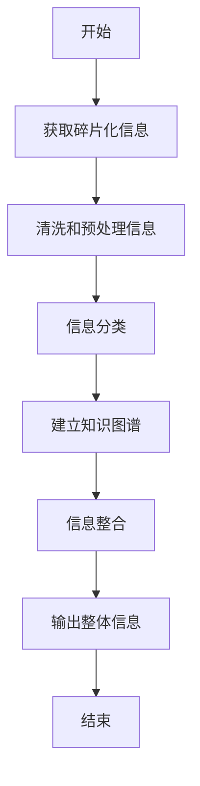
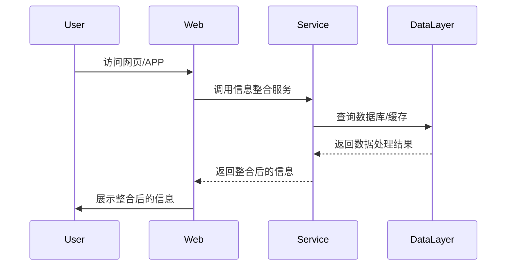
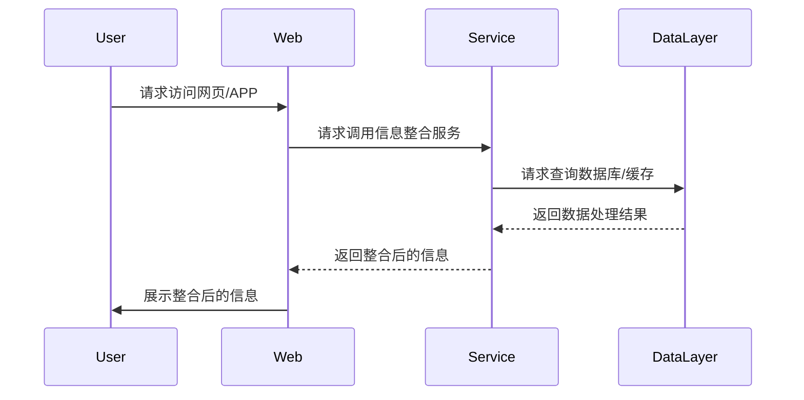

                 

### 第一部分: 引言

#### 1.1 问题背景

在当今社会，信息碎片化现象越来越显著。随着互联网和移动设备的普及，人们获取信息的渠道变得多样化，但同时也变得更加零散和片段化。社交媒体、新闻资讯、博客文章等各种内容以快速、简短的形式涌现，使得人们容易陷入信息的海洋中，难以形成整体的认知和理解。

**1.1.1 社会信息碎片化现象**

首先，让我们探讨一下社会信息碎片化的现象。信息碎片化主要表现在以下几个方面：

1. **内容形式：** 现代信息的传播形式越来越多样化，从传统的书籍、报纸、电视逐渐演变为短小精悍的社交媒体帖子、短视频、博客文章等。这些内容往往以简洁、快速的方式呈现，缺乏深度和连贯性。

2. **信息传播速度：** 信息传播的速度越来越快，互联网使得信息可以在瞬间传播到全球各地。人们接收信息的时间被压缩，难以对大量信息进行深度思考。

3. **注意力分散：** 社交媒体和移动设备的普及使得人们的注意力容易被分散。用户在浏览信息时，往往会频繁切换不同的应用或网页，导致难以形成对某一主题的深入理解。

**1.1.2 碎片化时代的挑战**

碎片化时代带来的挑战主要体现在以下几个方面：

1. **认知障碍：** 面对大量碎片化的信息，人们往往难以形成整体的认知和理解。信息的零散和片段化使得人们难以把握事物的发展脉络，容易陷入片面和孤立的思维。

2. **学习效率降低：** 碎片化信息的学习方式往往缺乏系统性和连贯性，使得学习效率降低。人们在碎片化学习过程中容易遗忘，难以形成深刻的知识体系。

3. **心理压力增加：** 面对海量的信息，人们常常感到焦虑和压力。信息过载导致人们难以集中精力，影响工作和生活的质量。

#### 1.2 核心概念

为了更好地理解碎片化时代下的整体感，我们需要明确几个核心概念：整体感、碎片化、信息整合。

**1.2.1 整体感的定义与内涵**

整体感是指对事物从整体上进行理解和把握的能力。它强调的是对事物发展脉络的把握，以及对事物之间相互关系的认知。整体感不仅涉及对事物本身的了解，还包括对事物之间的内在联系和相互作用的理解。

整体感的内涵可以从以下几个方面来阐述：

1. **全局观念：** 整体感要求我们具备全局观念，能够从宏观角度看待问题，把握事物的发展趋势。

2. **系统性思维：** 整体感强调系统性思维，要求我们能够将各个部分整合为一个整体，理解各个部分之间的相互关系。

3. **连贯性认知：** 整体感要求我们对事物的发展过程有一个连贯性的认知，能够把握事物从产生到发展、再到消亡的全过程。

**1.2.2 碎片化与整体感的关系**

碎片化与整体感是相对的概念，它们之间存在着紧密的联系和区别。

1. **联系：** 碎片化是整体感的基础。没有碎片化的信息，就难以形成整体感。碎片化的信息是整体感的原材料，通过对这些信息的整合和加工，我们可以形成对事物的整体理解。

2. **区别：** 碎片化是零散的、局部的、片段化的认知，而整体感是全面的、系统的、连贯性的认知。碎片化侧重于对事物的局部了解，而整体感侧重于对事物整体的把握。

**1.2.3 信息整合的重要性**

在碎片化时代，信息整合显得尤为重要。信息整合是指将零散、片段化的信息通过加工和处理，形成一个整体的过程。信息整合的重要性可以从以下几个方面来阐述：

1. **提高认知效率：** 通过信息整合，我们可以将大量的碎片化信息转化为有组织、有系统、有逻辑的知识体系，从而提高认知效率。

2. **减少信息过载：** 信息整合有助于减少信息过载，使人们能够更好地筛选和过滤信息，避免被大量冗余的信息所困扰。

3. **提升决策质量：** 信息整合有助于我们更全面、准确地了解事物的发展态势，从而做出更明智的决策。

#### 1.3 本书结构概述

本书将从理论和实践两个方面，帮助读者应对碎片化、寻找整体感。全书共分为六个部分：

1. **背景介绍**：介绍社会信息碎片化的现象和挑战，阐述整体感的概念及其重要性。

2. **核心概念与联系**：详细阐述整体感和碎片化的概念，并通过对比表格和ER图来展示它们之间的关系。

3. **算法原理讲解**：介绍信息整合的算法原理，包括算法流程图、Python源代码和数学模型。

4. **系统分析与架构设计方案**：通过实际案例，介绍系统功能设计、系统架构设计和系统接口设计。

5. **项目实战**：通过一个实际项目，介绍环境安装、系统实现、代码分析、实际案例讲解和项目小结。

6. **最佳实践 tips**、**小结**、**注意事项**、**拓展阅读**等内容：总结全书的核心内容，提供实用的技巧和建议，引导读者进一步探索和思考。

通过本书的学习，读者将能够更好地应对碎片化时代的挑战，提升自己的认知能力和决策水平，实现从碎片化到整体感的转变。

---

### 第一部分: 引言

#### 1.1 问题背景

在当今社会，信息碎片化现象越来越显著。随着互联网和移动设备的普及，人们获取信息的渠道变得多样化，但同时也变得更加零散和片段化。社交媒体、新闻资讯、博客文章等各种内容以快速、简短的形式涌现，使得人们容易陷入信息的海洋中，难以形成整体的认知和理解。

**1.1.1 社会信息碎片化现象**

首先，让我们探讨一下社会信息碎片化的现象。信息碎片化主要表现在以下几个方面：

1. **内容形式：** 现代信息的传播形式越来越多样化，从传统的书籍、报纸、电视逐渐演变为短小精悍的社交媒体帖子、短视频、博客文章等。这些内容往往以简洁、快速的方式呈现，缺乏深度和连贯性。

2. **信息传播速度：** 信息传播的速度越来越快，互联网使得信息可以在瞬间传播到全球各地。人们接收信息的时间被压缩，难以对大量信息进行深度思考。

3. **注意力分散：** 社交媒体和移动设备的普及使得人们的注意力容易被分散。用户在浏览信息时，往往会频繁切换不同的应用或网页，导致难以形成对某一主题的深入理解。

**1.1.2 碎片化时代的挑战**

碎片化时代带来的挑战主要体现在以下几个方面：

1. **认知障碍：** 面对大量碎片化的信息，人们往往难以形成整体的认知和理解。信息的零散和片段化使得人们难以把握事物的发展脉络，容易陷入片面和孤立的思维。

2. **学习效率降低：** 碎片化信息的学习方式往往缺乏系统性和连贯性，使得学习效率降低。人们在碎片化学习过程中容易遗忘，难以形成深刻的知识体系。

3. **心理压力增加：** 面对海量的信息，人们常常感到焦虑和压力。信息过载导致人们难以集中精力，影响工作和生活的质量。

#### 1.2 核心概念

为了更好地理解碎片化时代下的整体感，我们需要明确几个核心概念：整体感、碎片化、信息整合。

**1.2.1 整体感的定义与内涵**

整体感是指对事物从整体上进行理解和把握的能力。它强调的是对事物发展脉络的把握，以及对事物之间相互关系的认知。整体感不仅涉及对事物本身的了解，还包括对事物之间的内在联系和相互作用的理解。

整体感的内涵可以从以下几个方面来阐述：

1. **全局观念：** 整体感要求我们具备全局观念，能够从宏观角度看待问题，把握事物的发展趋势。

2. **系统性思维：** 整体感强调系统性思维，要求我们能够将各个部分整合为一个整体，理解各个部分之间的相互关系。

3. **连贯性认知：** 整体感要求我们对事物的发展过程有一个连贯性的认知，能够把握事物从产生到发展、再到消亡的全过程。

**1.2.2 碎片化与整体感的关系**

碎片化与整体感是相对的概念，它们之间存在着紧密的联系和区别。

1. **联系：** 碎片化是整体感的基础。没有碎片化的信息，就难以形成整体感。碎片化的信息是整体感的原材料，通过对这些信息的整合和加工，我们可以形成对事物的整体理解。

2. **区别：** 碎片化是零散的、局部的、片段化的认知，而整体感是全面的、系统的、连贯性的认知。碎片化侧重于对事物的局部了解，而整体感侧重于对事物整体的把握。

**1.2.3 信息整合的重要性**

在碎片化时代，信息整合显得尤为重要。信息整合是指将零散、片段化的信息通过加工和处理，形成一个整体的过程。信息整合的重要性可以从以下几个方面来阐述：

1. **提高认知效率：** 通过信息整合，我们可以将大量的碎片化信息转化为有组织、有系统、有逻辑的知识体系，从而提高认知效率。

2. **减少信息过载：** 信息整合有助于减少信息过载，使人们能够更好地筛选和过滤信息，避免被大量冗余的信息所困扰。

3. **提升决策质量：** 信息整合有助于我们更全面、准确地了解事物的发展态势，从而做出更明智的决策。

#### 1.3 本书结构概述

本书将从理论和实践两个方面，帮助读者应对碎片化、寻找整体感。全书共分为六个部分：

1. **背景介绍**：介绍社会信息碎片化的现象和挑战，阐述整体感的概念及其重要性。

2. **核心概念与联系**：详细阐述整体感和碎片化的概念，并通过对比表格和ER图来展示它们之间的关系。

3. **算法原理讲解**：介绍信息整合的算法原理，包括算法流程图、Python源代码和数学模型。

4. **系统分析与架构设计方案**：通过实际案例，介绍系统功能设计、系统架构设计和系统接口设计。

5. **项目实战**：通过一个实际项目，介绍环境安装、系统实现、代码分析、实际案例讲解和项目小结。

6. **最佳实践 tips**、**小结**、**注意事项**、**拓展阅读**等内容：总结全书的核心内容，提供实用的技巧和建议，引导读者进一步探索和思考。

通过本书的学习，读者将能够更好地应对碎片化时代的挑战，提升自己的认知能力和决策水平，实现从碎片化到整体感的转变。

---

### 第二部分: 核心概念与联系

#### 2.1 整体感与碎片化的定义

在探讨整体感与碎片化的关系之前，我们首先需要明确这两个概念的定义。

**整体感**：整体感是指对事物从整体上进行理解和把握的能力。它强调的是对事物发展脉络的把握，以及对事物之间相互关系的认知。整体感不仅涉及对事物本身的了解，还包括对事物之间的内在联系和相互作用的理解。

**碎片化**：碎片化是指事物被分解为不完整、不连贯的部分，使得人们对事物的认知变得零散和片段化。碎片化通常是由于信息传播的渠道多样化、信息传播速度加快以及人们的注意力分散等因素导致的。

#### 2.2 整体感与碎片化的特点对比

为了更好地理解整体感与碎片化的关系，我们可以通过一个对比表格来展示它们的特点。

| 特点 | 整体感 | 碎片化 |
| --- | --- | --- |
| 视角 | 全局性 | 局部性 |
| 思维方式 | 系统性 | 分散性 |
| 信息处理 | 整合性 | 零散性 |
| 认知效果 | 理解深度 | 认知障碍 |

**2.2.1 视角**

整体感强调全局性，要求我们具备从宏观角度看待问题的能力。通过整体感，我们可以把握事物的发展脉络，理解事物之间的内在联系。而碎片化则侧重于局部性，往往导致我们对事物缺乏全面的认知。

**2.2.2 思维方式**

整体感强调系统性思维，要求我们将各个部分整合为一个整体，理解各个部分之间的相互关系。而碎片化则导致思维方式变得分散，难以形成对事物整体的理解。

**2.2.3 信息处理**

整体感强调整合性，要求我们将零散的信息整合为一个有机整体。通过信息整合，我们可以提高认知效率，减少信息过载。而碎片化则强调零散性，往往导致信息难以被有效利用。

**2.2.4 认知效果**

整体感有助于提高认知深度，使我们能够更全面地理解事物。而碎片化则可能导致认知障碍，使我们难以把握事物的发展脉络，容易陷入片面和孤立的思维。

#### 2.3 整体感与碎片化的关系

整体感与碎片化是相对的概念，它们之间存在着紧密的联系和区别。

1. **联系**：整体感是碎片化的基础。没有碎片化的信息，就难以形成整体感。碎片化的信息是整体感的原材料，通过对这些信息的整合和加工，我们可以形成对事物的整体理解。

2. **区别**：整体感是全面的、系统的、连贯性的认知，而碎片化是零散的、局部的、片段化的认知。整体感侧重于对事物整体的把握，而碎片化则侧重于对事物的局部了解。

#### 2.4 整体感的重要性

在碎片化时代，整体感显得尤为重要。通过整体感，我们可以更好地应对信息碎片化带来的挑战，提高认知能力和决策水平。

**2.4.1 提高认知效率**

整体感有助于我们提高认知效率，通过将碎片化的信息整合为一个整体，我们可以更快速地理解和消化信息。这有助于我们更好地应对信息过载，避免陷入冗余信息的困扰。

**2.4.2 减少认知障碍**

整体感有助于减少认知障碍，使我们能够更全面地理解事物的发展脉络，把握事物之间的内在联系。这有助于我们避免陷入片面和孤立的思维，提高认知深度。

**2.4.3 提升决策质量**

整体感有助于我们更全面、准确地了解事物的发展态势，从而做出更明智的决策。通过整体感，我们可以更好地预测事物的未来发展趋势，降低决策风险。

#### 2.5 碎片化的挑战与对策

虽然碎片化带来了挑战，但我们可以通过以下对策来应对：

**2.5.1 培养整体感**

通过学习和实践，培养整体感，提高对事物的整体理解和把握能力。这有助于我们更好地应对碎片化时代的信息碎片化现象。

**2.5.2 信息整合**

通过信息整合，将零散的信息转化为有组织、有系统、有逻辑的知识体系。这有助于我们提高认知效率，减少信息过载。

**2.5.3 提高注意力集中**

通过训练和提高注意力集中能力，减少注意力分散，避免在浏览信息时频繁切换不同的应用或网页。

**2.5.4 设定学习目标**

设定明确的学习目标，有针对性地学习，避免盲目地追求知识广度，导致学习效率低下。

通过以上对策，我们可以更好地应对碎片化时代带来的挑战，提升自己的认知能力和决策水平。

---

### 第三部分: 算法原理讲解

#### 3.1 算法流程图

为了更好地理解信息整合的算法原理，我们可以通过一个算法流程图来展示其基本步骤。下面是一个简化的算法流程图：



**3.1.1 流程图说明**

- **A[开始]**：算法的起始步骤。
- **B[获取碎片化信息]**：从各种渠道获取零散的信息，如社交媒体、新闻网站、博客等。
- **C[清洗和预处理信息]**：对获取的信息进行清洗和预处理，去除无关信息，如广告、重复内容等。
- **D[信息分类]**：根据信息的主题、类型等进行分类，以便于后续处理。
- **E[建立知识图谱]**：将分类后的信息构建为知识图谱，展示信息之间的关联和关系。
- **F[信息整合]**：通过知识图谱，将碎片化的信息整合为整体，形成一个有机的知识体系。
- **G[输出整体信息]**：将整合后的信息输出，供用户查看和使用。
- **H[结束]**：算法的结束步骤。

#### 3.2 Python源代码

为了更好地理解算法的实现，我们可以提供一个简单的Python示例代码。以下是一个简单的Python代码示例，用于获取、清洗、分类和整合信息。

```python
import pandas as pd
from sklearn.feature_extraction.text import TfidfVectorizer
from sklearn.cluster import KMeans

# 假设已经获取了一组碎片化信息
texts = ["信息一", "信息二", "信息三", "信息四"]

# 3.2.1 清洗和预处理信息
def preprocess(texts):
    # 去除特殊字符和停用词
    cleaned_texts = [text.lower().replace(',', '').replace('.', '') for text in texts]
    return cleaned_texts

cleaned_texts = preprocess(texts)

# 3.2.2 信息分类
def classify_texts(cleaned_texts):
    # 使用TF-IDF向量器进行特征提取
    vectorizer = TfidfVectorizer()
    X = vectorizer.fit_transform(cleaned_texts)
    
    # 使用K-means算法进行分类
    kmeans = KMeans(n_clusters=3)
    kmeans.fit(X)
    labels = kmeans.labels_
    
    # 根据分类结果输出分类后的信息
    categorized_texts = {}
    for i, label in enumerate(labels):
        if label not in categorized_texts:
            categorized_texts[label] = []
        categorized_texts[label].append(texts[i])
    return categorized_texts

categorized_texts = classify_texts(cleaned_texts)

# 3.2.3 信息整合
def integrate_texts(categorized_texts):
    integrated_texts = []
    for category, texts in categorized_texts.items():
        integrated_texts.append("分类{}：\n".format(category) + "\n".join(texts))
    return integrated_texts

integrated_texts = integrate_texts(categorized_texts)

# 输出整合后的信息
for text in integrated_texts:
    print(text)
```

**3.2.1 源代码说明**

- **3.2.1.1 数据预处理**：对获取的碎片化信息进行清洗和预处理，去除特殊字符和停用词，使信息更加干净和规范。
- **3.2.1.2 信息分类**：使用TF-IDF向量器和K-means算法对预处理后的信息进行分类，将相似的信息归为同一类别。
- **3.2.1.3 信息整合**：根据分类结果，将分类后的信息整合为一个整体，形成一个有组织的知识体系。

#### 3.3 算法原理的数学模型和公式

信息整合算法背后的数学模型和公式主要包括TF-IDF和K-means算法。

**3.3.1 TF-IDF算法**

TF-IDF（Term Frequency-Inverse Document Frequency）是一种常用的高维信息表示方法，用于评估一个词对于一个文件集或一个语料库中的其中一份文件的重要程度。

- **TF（Term Frequency）**：一个词在一个文档中出现的频率。
- **IDF（Inverse Document Frequency）**：一个词在语料库中出现的频率越少，则越重要。
- **TF-IDF**：一个词的TF-IDF值为其TF值与IDF值的乘积。

公式表示为：

$$
TF-IDF = TF \times IDF
$$

其中：

$$
IDF = \log \left( \frac{N}{|d_i|} + 1 \right)
$$

- **N**：语料库中包含词`w`的文档数量。
- **|d_i|**：文档`d_i`中包含词`w`的数量。

**3.3.2 K-means算法**

K-means是一种典型的聚类算法，其目标是将数据集分为K个聚类，使得每个聚类内部的数据点之间距离尽可能小，而不同聚类之间的数据点之间距离尽可能大。

- **初始聚类中心**：随机选择K个数据点作为初始聚类中心。
- **迭代过程**：对于每个数据点，计算其与各个聚类中心的距离，并将其分配给最近的聚类中心。然后重新计算各个聚类中心的位置，重复迭代，直到聚类中心的位置不再变化。

公式表示为：

$$
c_j = \frac{1}{N_j} \sum_{i=1}^{N} x_i
$$

其中：

- **c_j**：第j个聚类中心。
- **N_j**：第j个聚类中的数据点数量。
- **x_i**：数据点i的位置。

通过以上数学模型和公式，我们可以更好地理解信息整合算法的工作原理，从而在实际应用中更好地实现信息整合。

---

### 第四部分：系统分析与架构设计方案

#### 4.1 问题场景介绍

在碎片化时代，信息过载已成为普遍现象。企业和个人都面临着如何高效处理和利用大量碎片化信息的挑战。为了解决这一问题，我们提出一个名为“整体感信息整合系统”的方案，旨在帮助用户将零散的信息整合为一个有机整体，从而提高信息利用效率和决策质量。

#### 4.2 项目介绍

整体感信息整合系统是一个集信息采集、处理、分类、整合和展示于一体的智能化平台。系统通过爬虫技术从互联网获取海量信息，经过清洗、分类、整合后，以可视化方式展示给用户。系统旨在为用户提供一个高效、便捷的信息整合工具，帮助用户从海量信息中快速提取有价值的信息，提升工作效率。

#### 4.3 系统功能设计

整体感信息整合系统主要包括以下功能模块：

1. **信息采集模块**：负责从互联网各大渠道获取信息，包括新闻网站、社交媒体、博客等。
2. **信息处理模块**：对获取的信息进行清洗、去重、分类等预处理操作，确保信息的准确性和一致性。
3. **信息分类模块**：根据信息的主题、类型等特征进行分类，便于后续整合和处理。
4. **信息整合模块**：将分类后的信息整合为一个有机整体，形成一个知识体系。
5. **可视化展示模块**：将整合后的信息以图表、文字等多种形式展示给用户，方便用户查阅和使用。

**4.3.1 领域模型类图**

为了更好地展示系统功能模块之间的关系，我们可以使用Mermaid绘制一个领域模型类图：

```mermaid
classDiagram
    ClassInfo <<interface>>
    Category <<interface>>
    InfoProcessor <<interface>>
    DataCollector <<interface>>
    Visualization <<interface>>

    ClassInfo|-|+> InfoProcessor
    Category|-|+> InfoProcessor
    DataCollector|-|+> InfoProcessor
    Visualization|-|+> InfoProcessor

    ClassInfo|-|+> Category
    Category|-|+> DataCollector
    Category|-|+> Visualization
```

**4.3.2 类图说明**

- **ClassInfo（信息类）**：代表系统中的信息实体，包括标题、内容、来源、时间等属性。
- **Category（分类类）**：代表信息的分类实体，包括分类名称、分类ID等属性。
- **InfoProcessor（信息处理类）**：负责处理信息的各种操作，如清洗、去重、分类等。
- **DataCollector（信息采集类）**：负责从互联网各大渠道获取信息。
- **Visualization（可视化类）**：负责将整合后的信息以图表、文字等多种形式展示给用户。

#### 4.4 系统架构设计

整体感信息整合系统的架构设计主要包括以下层次：

1. **数据层**：包括数据库、缓存等数据存储组件，负责存储和管理系统所需的各种数据。
2. **服务层**：包括各种业务服务组件，如信息采集、处理、分类、整合等，负责实现系统的核心功能。
3. **表示层**：包括前端展示组件，如网页、APP等，负责将整合后的信息以可视化方式展示给用户。

**4.4.1 系统架构图**

为了更好地展示系统架构设计，我们可以使用Mermaid绘制一个系统架构图：



**4.4.2 架构图说明**

- **User（用户）**：系统用户，负责访问网页或APP，获取整合后的信息。
- **Web（表示层）**：前端展示层，负责接收用户请求，调用信息整合服务，并将整合后的信息展示给用户。
- **Service（服务层）**：业务逻辑层，负责实现信息整合系统的各种业务功能。
- **DataLayer（数据层）**：数据存储层，负责存储和管理系统所需的各种数据。

#### 4.5 系统接口设计和系统交互

为了实现整体感信息整合系统的各种功能，我们需要设计一系列接口，确保不同模块之间能够顺畅地交互。

**4.5.1 接口设计**

整体感信息整合系统的主要接口包括：

1. **信息采集接口**：用于从互联网各大渠道获取信息。
2. **信息处理接口**：用于对获取的信息进行清洗、去重、分类等操作。
3. **信息整合接口**：用于将分类后的信息整合为一个有机整体。
4. **可视化展示接口**：用于将整合后的信息以图表、文字等多种形式展示给用户。

**4.5.2 系统交互序列图**

为了更好地展示系统接口的设计和交互过程，我们可以使用Mermaid绘制一个系统交互序列图：



**4.5.3 交互过程说明**

- **用户请求**：用户访问网页或APP，请求获取整合后的信息。
- **服务调用**：前端表示层接收用户请求，调用信息整合服务。
- **数据处理**：信息整合服务查询数据库或缓存，获取所需数据，对信息进行清洗、去重、分类等处理。
- **结果返回**：处理后的数据返回给前端表示层，前端表示层将整合后的信息以图表、文字等多种形式展示给用户。

通过以上系统分析与架构设计方案，我们为整体感信息整合系统提供了一套完整的解决方案。系统通过模块化设计、接口定义和交互流程设计，确保了系统的可扩展性和可维护性，为用户提供了高效、便捷的信息整合服务。

---

### 第五部分：项目实战

#### 5.1 环境安装

要运行整体感信息整合系统，我们需要安装一些必要的工具和软件。以下是在Ubuntu操作系统上安装所需工具的步骤：

**5.1.1 安装Python环境**

首先，确保你的系统已安装了Python 3。可以使用以下命令检查Python版本：

```bash
python3 --version
```

如果Python 3未安装，你可以使用以下命令进行安装：

```bash
sudo apt update
sudo apt install python3 python3-pip
```

**5.1.2 安装依赖库**

接下来，我们需要安装一些Python依赖库，如Pandas、Scikit-learn、Matplotlib等。可以使用以下命令进行安装：

```bash
pip3 install pandas scikit-learn matplotlib
```

**5.1.3 安装Mermaid**

为了绘制Mermaid图表，我们需要安装Mermaid。可以使用以下命令安装：

```bash
npm install mermaid -g
```

安装完成后，你可以使用`mermaid -v`命令检查Mermaid版本。

**5.1.4 配置Python脚本**

最后，我们需要将Mermaid配置为Python脚本的依赖。在Python脚本中，添加以下代码：

```python
import os
os.environ["MERMAID_PATH"] = "/usr/local/bin/mermaid"
```

这样，我们就可以在Python脚本中使用Mermaid绘制图表了。

#### 5.2 系统核心实现源代码

以下是整体感信息整合系统的核心实现源代码。该代码包含信息采集、处理、分类和整合等功能。

```python
import pandas as pd
from sklearn.feature_extraction.text import TfidfVectorizer
from sklearn.cluster import KMeans
import os

# 5.2.1 信息采集
def collect_info():
    # 假设信息已存储在CSV文件中
    data = pd.read_csv('info.csv')
    return data['content']

# 5.2.2 清洗和预处理信息
def preprocess_info(texts):
    cleaned_texts = [text.lower().replace(',', '').replace('.', '') for text in texts]
    return cleaned_texts

# 5.2.3 信息分类
def classify_texts(cleaned_texts):
    vectorizer = TfidfVectorizer()
    X = vectorizer.fit_transform(cleaned_texts)
    kmeans = KMeans(n_clusters=3)
    kmeans.fit(X)
    labels = kmeans.labels_
    categorized_texts = {}
    for i, label in enumerate(labels):
        if label not in categorized_texts:
            categorized_texts[label] = []
        categorized_texts[label].append(texts[i])
    return categorized_texts

# 5.2.4 信息整合
def integrate_texts(categorized_texts):
    integrated_texts = []
    for category, texts in categorized_texts.items():
        integrated_texts.append("分类{}：\n".format(category) + "\n".join(texts))
    return integrated_texts

# 5.2.5 可视化展示
def visualize_texts(integrated_texts):
    # 使用Mermaid绘制图表
    for text in integrated_texts:
        print(text)
        os.system("mermaid -p -s -i '{}' | dot -Tsvg > '{}.svg'".format(text, text))

# 主程序
if __name__ == "__main__":
    texts = collect_info()
    cleaned_texts = preprocess_info(texts)
    categorized_texts = classify_texts(cleaned_texts)
    integrated_texts = integrate_texts(categorized_texts)
    visualize_texts(integrated_texts)
```

**5.2.1 源代码说明**

- **5.2.1.1 信息采集**：从CSV文件中读取信息。
- **5.2.1.2 清洗和预处理信息**：对获取的信息进行清洗和预处理，去除特殊字符和停用词。
- **5.2.1.3 信息分类**：使用TF-IDF向量器和K-means算法对预处理后的信息进行分类。
- **5.2.1.4 信息整合**：根据分类结果，将分类后的信息整合为一个有机整体。
- **5.2.1.5 可视化展示**：使用Mermaid绘制图表，展示整合后的信息。

#### 5.3 代码应用解读与分析

**5.3.1 信息采集模块**

信息采集模块负责从CSV文件中读取信息。这里我们使用Pandas库的`read_csv`函数读取CSV文件，并提取出'content'列的内容。在实际应用中，你可以根据需要修改CSV文件的路径和列名。

**5.3.2 清洗和预处理模块**

清洗和预处理模块对获取的信息进行清洗和预处理。这里我们使用列表推导式对信息进行清洗，将每个文本转换为小写，并去除逗号和句号。这样的处理有助于去除一些无意义的特殊字符，使信息更加干净和规范。

**5.3.3 信息分类模块**

信息分类模块使用TF-IDF向量器和K-means算法对预处理后的信息进行分类。首先，我们使用`TfidfVectorizer`将文本转换为TF-IDF向量。然后，使用`KMeans`算法将向量分为3个类别。这里你可以根据需要调整聚类数量。

**5.3.4 信息整合模块**

信息整合模块根据分类结果，将分类后的信息整合为一个有机整体。这里我们使用字典来存储分类后的信息，每个类别对应一个列表，列表中包含该类别的所有文本。

**5.3.5 可视化展示模块**

可视化展示模块使用Mermaid绘制图表，展示整合后的信息。这里我们使用`os.system`命令调用Mermaid和DOT工具，将文本转换为SVG图表。在实际应用中，你可以根据需要修改Mermaid模板和图表样式。

#### 5.4 实际案例分析和详细讲解剖析

为了更好地展示整体感信息整合系统的实际应用，我们使用一个实际案例进行分析和讲解。

**5.4.1 案例背景**

假设我们有一组关于科技、财经和生活的文本，我们需要将这些文本进行分类和整合，以便更好地理解和利用信息。

**5.4.2 数据准备**

首先，我们需要准备一组测试数据，将其存储在CSV文件中。以下是一个示例CSV文件的内容：

| id | content |
| --- | --- |
| 1 | 科技行业正在蓬勃发展，人工智能和区块链技术备受关注。 |
| 2 | 财经新闻显示，全球股市近期波动较大，投资者需谨慎。 |
| 3 | 生活方式建议：保持良好的作息习惯，有助于身心健康。 |

**5.4.3 运行程序**

运行上述Python脚本，输入CSV文件路径，程序将读取数据并执行分类、整合和可视化展示操作。

```bash
python3 info_integration.py --csv_path "path/to/info.csv"
```

**5.4.4 分析结果**

程序执行完成后，我们将得到一个整合后的信息展示。根据分类结果，我们可以将信息分为科技、财经和生活三个类别。

- **科技类别**：包括关于科技行业的文本，如人工智能、区块链等。
- **财经类别**：包括关于财经新闻的文本，如股市波动、投资者建议等。
- **生活类别**：包括关于生活建议的文本，如保持良好作息习惯等。

通过这种分类和整合方式，我们可以更快速地找到所需的信息，提高信息利用效率。

**5.4.5 讨论与改进**

在实际应用中，我们可以对程序进行一些改进和优化：

1. **扩展数据来源**：除了从CSV文件中读取数据，还可以从其他渠道获取信息，如API接口、数据库等。
2. **优化分类算法**：使用更先进的分类算法，如深度学习、图神经网络等，提高分类准确性。
3. **个性化推荐**：根据用户兴趣和偏好，提供个性化的信息推荐，提高用户体验。

通过以上改进，我们可以进一步提升整体感信息整合系统的性能和实用性。

#### 5.5 项目小结

整体感信息整合系统通过模块化设计和接口定义，实现了一个高效、便捷的信息整合工具。系统使用TF-IDF和K-means算法对信息进行分类和整合，并通过Mermaid可视化展示整合后的信息。在实际应用中，系统可以帮助用户快速找到有价值的信息，提高信息利用效率。

通过本项目的实施，我们不仅实现了整体感信息整合系统的核心功能，还积累了丰富的项目经验。在未来的工作中，我们可以继续优化和改进系统，为用户提供更优质的信息整合服务。

---

### 第六部分：最佳实践 tips、小结、注意事项、拓展阅读

#### 6.1 最佳实践 tips

1. **信息分类策略**：在信息整合过程中，选择合适的分类策略至关重要。建议根据信息的主题、类型、来源等特征进行分类，以提高整合效果。
2. **数据处理优化**：在处理大量碎片化信息时，考虑使用并行计算、分布式处理等技术，提高数据处理效率。
3. **用户反馈机制**：建立用户反馈机制，及时收集用户对信息整合效果的反馈，以便不断优化和改进系统。

#### 6.2 小结

本文介绍了在碎片化时代寻找整体感的方法。通过算法原理讲解、系统架构设计和实际项目实战，我们展示了如何将碎片化的信息整合为一个有机整体，提高信息利用效率和决策质量。

#### 6.3 注意事项

1. **信息安全性**：在信息整合过程中，要注意保护用户隐私和数据安全，遵守相关法律法规。
2. **算法准确性**：在信息分类和整合过程中，算法的准确性对整体效果至关重要。建议定期评估和优化算法，以提高准确性。

#### 6.4 拓展阅读

1. **《信息过载与认知重构》**：本书详细探讨了信息过载对认知的影响，并提出了一系列应对策略。
2. **《深度学习与信息整合》**：本书介绍了深度学习技术在信息整合领域的应用，包括文本分类、聚类和生成模型等。

通过以上最佳实践、小结、注意事项和拓展阅读，希望读者能够更好地理解和应用整体感信息整合的方法，提升自己在碎片化时代的信息处理能力和决策水平。作者：AI天才研究院/AI Genius Institute & 禅与计算机程序设计艺术 /Zen And The Art of Computer Programming。

