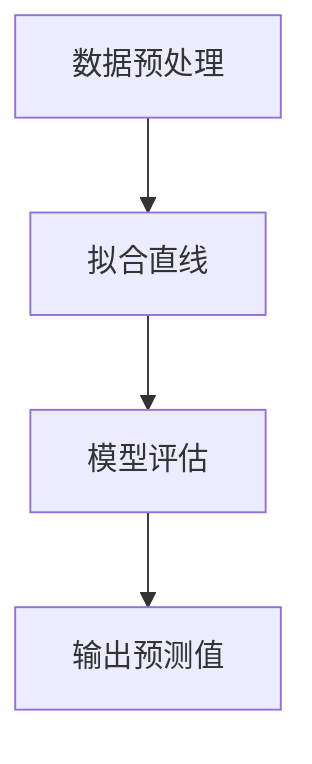
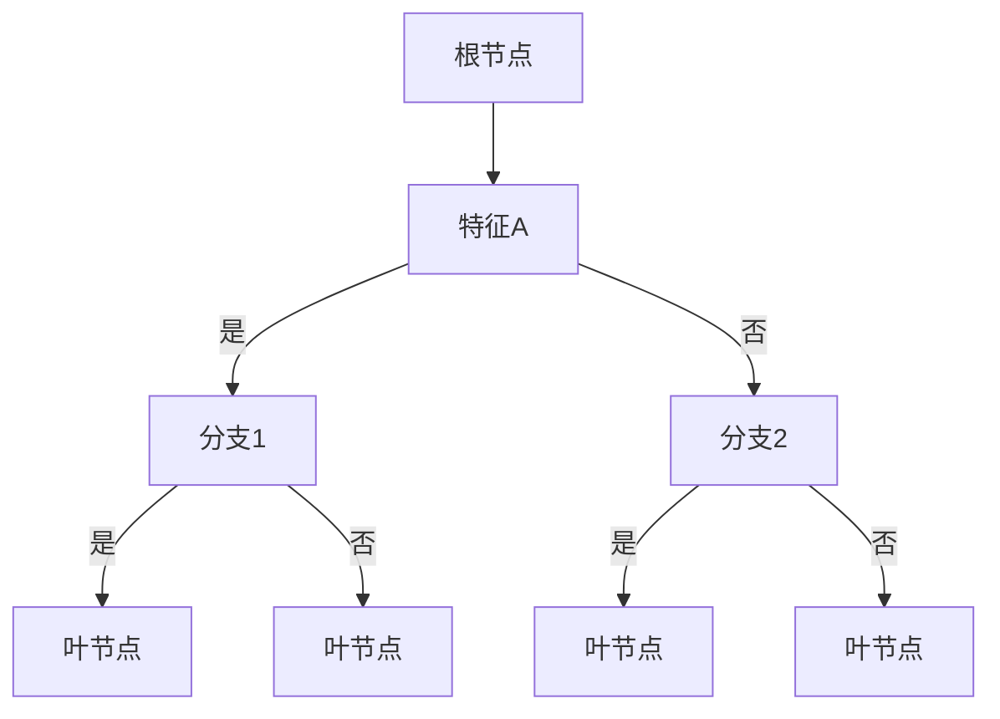
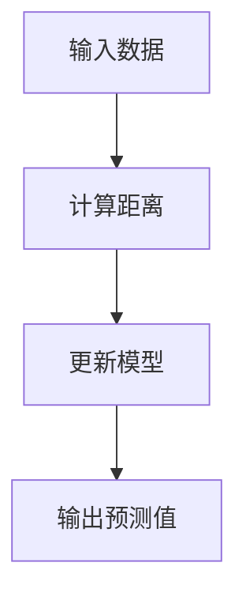
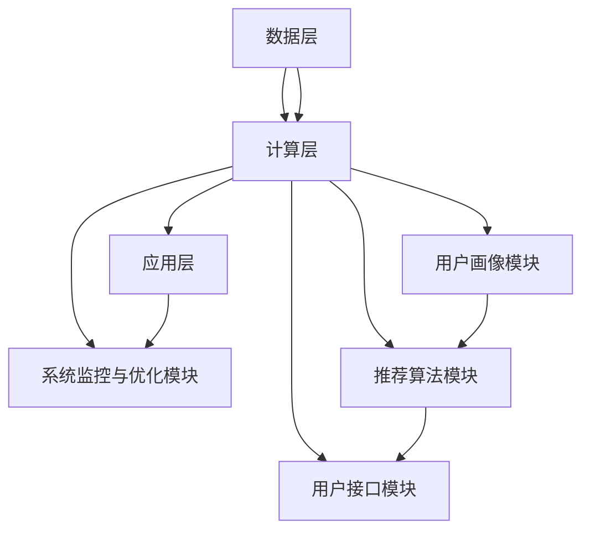
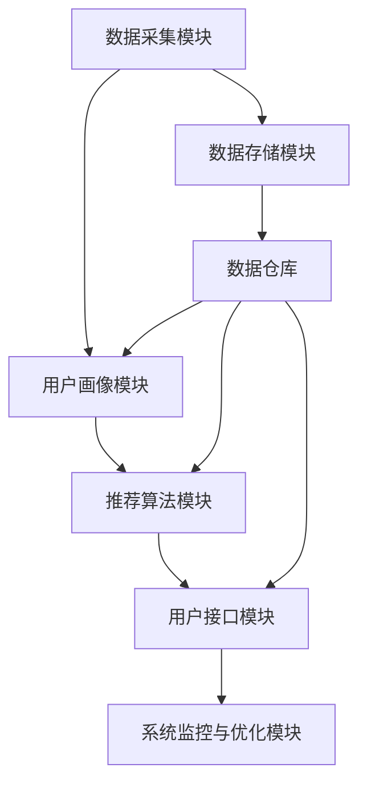
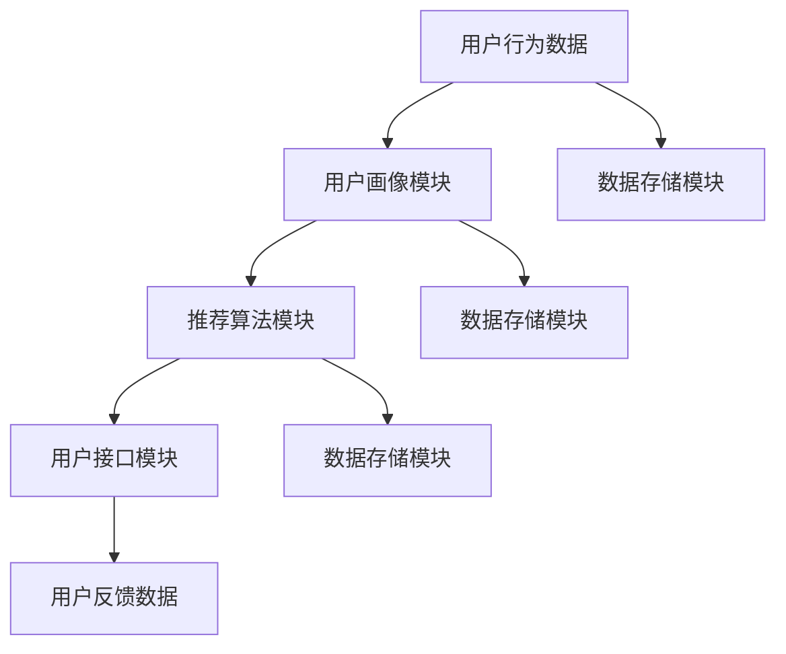
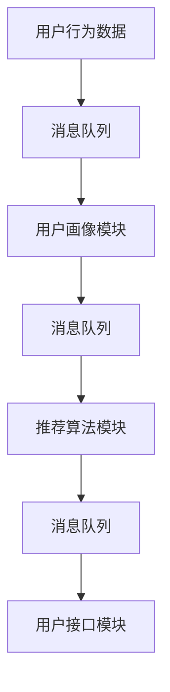
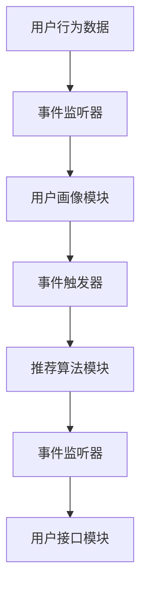

                 

### 第一部分：背景介绍

#### 第1章：问题背景

##### 1.1.1 科技革新的挑战与机遇

随着科技的飞速发展，人工智能（AI）已经成为现代社会的重要组成部分。AI技术在医疗、金融、交通、教育等多个领域展现出巨大的潜力和应用价值。然而，在AI技术不断革新的同时，人们开始关注如何在科技革新中守护人类的核心价值。这一部分将探讨科技革新带来的挑战，以及如何在AI发展中维护人类的基本价值。

在科技革新的过程中，我们面临的主要挑战包括：

- **隐私保护**：随着大数据和人工智能技术的发展，个人隐私数据被大量收集和利用，如何保护个人隐私成为了一个亟待解决的问题。
- **公平与正义**：AI技术在某些领域可能导致歧视和偏见，如何确保科技革新不会损害社会的公平与正义，是一个重要的议题。
- **就业影响**：AI和自动化技术的发展可能导致部分工作岗位的减少，如何应对这种就业结构的变化，也是一个关键问题。
- **伦理问题**：AI技术的发展引发了一系列伦理问题，如机器是否能拥有自主意识、如何处理机器与人类之间的关系等。

科技革新为人类带来了前所未有的机遇，同时也提出了新的问题和挑战。为了在科技革新中守护人类的核心价值，我们需要采取一系列措施，包括：

- **制定相关政策法规**：政府和相关机构应制定明确的隐私保护政策，确保科技企业在开发和使用AI技术时遵守相关法律法规。
- **加强伦理教育**：培养科技工作者的伦理意识和责任感，确保他们在研发和应用AI技术时充分考虑社会和伦理问题。
- **促进跨学科合作**：推动人工智能、伦理学、社会学等领域的跨学科研究，共同探讨如何在科技革新中维护人类的核心价值。
- **提升公众意识**：加强公众对科技革新的了解和参与，提高公众对AI技术的伦理和社会影响的认知，促进社会的共同讨论和决策。

在接下来的部分，我们将进一步探讨人类核心价值的概念与内涵，分析科技革新与人类核心价值的关系，以及如何应对科技革新带来的挑战。

##### 1.1.2 人类核心价值的概念与内涵

人类核心价值是构成人类文明和社会的基本伦理原则，包括自由、平等、尊严、正义等。这些价值不仅是人类社会发展的基石，也是科技进步需要维护和尊重的基本准则。以下是对这些核心价值的概念与内涵的详细阐述：

- **自由**：自由是人类追求的基本权利，包括言论自由、思想自由、行动自由等。在科技革新中，自由意味着个体能够在不受外部强制的情况下，自主选择和表达自己的观点和行动。科技的发展不应限制或剥夺个体的自由，而应提供更多的机会和平台，让每个人能够自由地探索和实现自己的潜力。

- **平等**：平等是指个体在社会地位、机会和资源分配上享有公平的待遇。科技革新应该促进社会的平等，而不是加剧不平等。例如，人工智能技术在医疗、教育等领域的应用应该确保所有人都能公平地获得技术服务，而不是仅仅服务于富裕人群。通过平等，科技革新能够帮助消除社会中的歧视和偏见，构建一个更加和谐的社会。

- **尊严**：尊严是每个人作为人的基本权利，它体现了个体在精神和情感上的尊重。科技革新不应损害个体的尊严，而应尊重和保护每个人的尊严。例如，在人工智能的应用中，我们需要确保机器和算法不会对个体进行歧视或侮辱，从而尊重每个人的基本人格和尊严。

- **正义**：正义是指社会公正和合理的行为和制度。科技革新需要考虑社会的正义，确保技术的发展不会导致不公平的结果。例如，在自动化和智能化的过程中，我们需要关注技术对社会资源分配和权力结构的影响，确保技术进步能够造福大多数人，而不是只服务于少数精英。

人类核心价值不仅是在科技革新中维护的基本原则，也是指导科技发展的道德指南。在科技日益渗透到人类生活各个方面的背景下，守护这些核心价值变得尤为重要。科技企业和研究人员在研发和应用新技术时，应时刻牢记这些价值，并将其融入技术设计和决策过程中。

在接下来的章节中，我们将进一步探讨科技革新与人类核心价值之间的关系，分析科技革新如何影响这些核心价值的实现，以及如何在科技发展中维护这些价值。

##### 1.1.3 科技革新与人类核心价值的关系

科技革新与人类核心价值之间存在紧密的联系和互动。一方面，科技革新为人类带来了前所未有的机遇，推动了社会的发展与进步；另一方面，科技革新也可能对人类核心价值产生挑战，甚至威胁到这些价值的基本实现。以下将从几个方面分析科技革新与人类核心价值的关系：

**1. 科技革新对人类核心价值的积极影响**

科技革新带来了前所未有的发展机遇，推动了人类社会的进步：

- **提升生产效率**：科技革新，特别是人工智能和自动化技术的应用，大大提高了生产效率，为人类创造了更多的物质财富。这使得社会资源更加充足，为人类实现自由、平等和尊严提供了更好的基础。

- **优化资源配置**：科技革新使得资源分配更加科学合理。例如，大数据和人工智能技术可以优化交通管理，提高公共交通的效率，减少能源消耗，从而促进社会的公平与正义。

- **扩展知识边界**：科技革新推动了人类知识的积累和创新。互联网和人工智能技术的发展，使得知识获取和传播变得更加便捷，促进了人类的智力发展，有助于提升人类的尊严和自由。

**2. 科技革新对人类核心价值的挑战**

尽管科技革新带来了诸多机遇，但也存在一定的风险和挑战，对人类核心价值构成威胁：

- **隐私侵犯**：随着大数据和人工智能技术的广泛应用，个人隐私数据被大规模收集和利用，个人隐私权受到威胁。例如，人脸识别技术和智能监控设备的普及，可能侵犯个人的隐私权，影响个人的自由。

- **社会不平等加剧**：科技革新可能导致社会不平等问题加剧。一方面，新技术往往为富人和企业带来更多利益，而普通民众可能无法享受到科技的红利；另一方面，自动化和智能化技术的发展可能导致部分传统工作岗位的消失，增加失业率，影响社会的平等。

- **伦理问题**：科技革新引发了一系列伦理问题。例如，人工智能的决策过程可能基于偏见和歧视，影响社会的正义和公平。此外，随着人工智能技术的发展，人类可能面临“机器超越人类”的伦理困境，如机器是否应该拥有自主权、如何处理机器与人类之间的关系等。

**3. 维护人类核心价值的策略**

为了在科技革新中维护人类的核心价值，需要采取一系列策略：

- **制定法律法规**：政府应制定相关法律法规，确保科技企业和研究机构在研发和应用新技术时，遵守隐私保护、公平竞争和社会责任等原则。

- **加强伦理教育**：培养科技工作者的伦理意识和责任感，确保他们在研发和应用新技术时，充分考虑社会和伦理问题。

- **推动跨学科研究**：促进人工智能、伦理学、社会学等领域的跨学科研究，共同探讨如何在科技革新中维护人类的核心价值。

- **提升公众意识**：加强公众对科技革新的了解和参与，提高公众对AI技术的伦理和社会影响的认知，促进社会的共同讨论和决策。

通过以上策略，我们可以在科技革新中更好地守护人类的核心价值，确保科技进步造福人类，而不是损害人类的基本权利和利益。

##### 1.1.4 关键概念与联系

为了深入探讨科技革新与人类核心价值的关系，我们需要引入几个关键概念，并分析它们之间的联系。

**1. 科技革新**：科技革新是指通过技术创新和应用，推动社会和经济发展的过程。它包括人工智能、大数据、物联网、生物技术等多个领域。科技革新不仅改变了生产方式，还深刻影响了社会结构和人们的生活方式。

**2. 人类核心价值**：人类核心价值包括自由、平等、尊严、正义等基本伦理原则。这些价值是构建和谐社会的基础，也是人类共同追求的目标。在科技革新的背景下，守护这些核心价值至关重要。

**3. 数据隐私**：数据隐私是个人信息保护的重要方面。随着大数据和人工智能技术的应用，个人隐私数据被广泛收集和使用。保护数据隐私是维护个体自由和尊严的基本要求。

**4. 社会不平等**：社会不平等是指在社会资源分配、机会和地位上存在的差异。科技革新可能会加剧或缓解社会不平等问题，取决于政策和社会制度的支持。

**5. 伦理困境**：随着科技的发展，人类面临一系列伦理困境，如机器的自主权、人工智能的伦理决策等。如何解决这些困境，是维护人类核心价值的挑战。

**关键概念之间的关系框架**：

- **科技革新**对**数据隐私**和**社会不平等**产生影响。科技革新可能侵犯个人隐私，加剧社会不平等，威胁人类核心价值。

- **数据隐私**和**社会不平等**反过来影响**人类核心价值**的实现。例如，隐私侵犯可能损害个体的自由和尊严，社会不平等可能影响社会的公平与正义。

- **伦理困境**是科技革新带来的新问题，需要通过跨学科研究和政策制定来应对，以确保科技发展符合人类核心价值。

通过以上分析，我们可以构建一个关系框架，直观地展示科技革新与人类核心价值之间的相互作用。这有助于我们更全面地理解科技革新的影响，以及如何在科技发展中守护人类的核心价值。

**核心概念属性特征对比表格**：

| 核心概念 | 定义 | 属性特征 | 影响因素 | 作用 |
| --- | --- | --- | --- | --- |
| 科技革新 | 技术创新和应用推动社会发展 | 促进生产效率、优化资源配置 | 数据隐私、社会不平等 | 社会进步 |
| 人类核心价值 | 基本伦理原则 | 自由、平等、尊严、正义 | 科技革新、伦理困境 | 社会基础 |
| 数据隐私 | 个人信息保护 | 隐私权、信息安全 | 科技革新、数据滥用 | 个人自由 |
| 社会不平等 | 资源分配和机会差异 | 社会公正、资源分配公平 | 科技革新、政策制定 | 社会稳定 |
| 伦理困境 | 科技带来的道德挑战 | 自主权、伦理决策 | 科技发展、跨学科研究 | 价值观守护 |

**ER实体关系图架构**：

为了更直观地展示核心概念之间的关系，我们可以使用ER（实体关系）图来描述这些实体及其相互作用。

```mermaid
erDiagram
  类1  &&&> 类2 : 类1与类2关联关系
  类1  &&&> 类3 : 类1与类3关联关系
  类2  &&&> 类3 : 类2与类3关联关系
  类1 ||--|{ 类2 } 类1为类2的父类
  类2 ||--|{ 类3 } 类2为类3的父类
```

通过上述核心概念的介绍和ER实体关系图，我们可以更好地理解科技革新与人类核心价值之间的关系，为后续章节的深入分析打下基础。

## 第2章：核心概念与联系

#### 第2章：核心概念与联系

##### 2.1.1 科技革新与人类核心价值的关系框架

为了全面理解科技革新与人类核心价值之间的关系，我们需要构建一个系统性的关系框架，这个框架将帮助我们分析各个核心概念之间的相互作用，以及它们如何共同影响人类社会的未来发展。

**1. 关系框架构建**

关系框架的构建需要明确以下几个核心概念及其相互关系：

- **科技革新**：包括人工智能、大数据、物联网、生物技术等领域的创新和应用。
- **人类核心价值**：如自由、平等、尊严、正义等基本伦理原则。
- **伦理困境**：科技革新带来的道德挑战，如隐私侵犯、社会不平等、人工智能的伦理决策等。
- **社会政策**：政府和社会制定的规则和法律，用以指导科技发展和维护人类核心价值。

**2. 关系框架具体内容**

（1）**科技革新与人类核心价值的关系**

- **科技革新**通过推动社会进步，为实现人类核心价值提供物质基础。
- **人类核心价值**是科技革新的道德指南，指导科技研发和应用的方向。

（2）**伦理困境**与**科技革新**的关系

- **伦理困境**是科技革新带来的副产品，如隐私侵犯、社会不平等。
- **伦理困境**需要通过跨学科研究和政策制定来解决，以维护人类核心价值。

（3）**社会政策**在科技革新与人类核心价值之间的作用

- **社会政策**是连接科技革新与人类核心价值的桥梁，通过制定相关法律和规定，确保科技发展符合伦理和道德标准。

**3. 关系框架可视化**

为了直观地展示上述关系，我们可以使用mermaid ER图进行可视化描述：

```mermaid
erDiagram
  科技革新 ||--|{ 人类核心价值 } : 科技革新为实现人类核心价值提供基础
  科技革新 ||--|{ 伦理困境 } : 科技革新引发伦理困境
  伦理困境 ||--|{ 社会政策 } : 社会政策解决伦理困境
  社会政策 ||--|{ 人类核心价值 } : 社会政策维护人类核心价值
```

通过这个关系框架，我们可以更清晰地看到科技革新、人类核心价值、伦理困境和社会政策之间的相互作用，从而为后续章节的分析提供理论基础。

##### 2.1.2 核心概念属性特征对比表格

为了深入理解科技革新与人类核心价值之间的关系，我们有必要对一些关键概念进行属性特征对比分析。以下是对科技革新、人类核心价值、伦理困境和社会政策等核心概念的属性特征进行对比的表格。

| 核心概念 | 定义 | 属性特征 | 影响因素 | 作用 |
| --- | --- | --- | --- | --- |
| 科技革新 | 技术创新和应用推动社会发展 | 促进生产效率、优化资源配置 | 数据隐私、社会不平等 | 社会进步 |
| 人类核心价值 | 基本伦理原则 | 自由、平等、尊严、正义 | 科技革新、伦理困境 | 社会基础 |
| 数据隐私 | 个人信息保护 | 隐私权、信息安全 | 科技革新、数据滥用 | 个人自由 |
| 社会不平等 | 资源分配和机会差异 | 社会公正、资源分配公平 | 科技革新、政策制定 | 社会稳定 |
| 伦理困境 | 科技带来的道德挑战 | 自主权、伦理决策 | 科技发展、跨学科研究 | 价值观守护 |
| 社会政策 | 政府和社会制定的规则和法律 | 遵守伦理和道德标准 | 科技革新、人类核心价值 | 科技与伦理的桥梁 |

**核心概念属性特征对比表格**

| 属性特征 | 科技革新 | 人类核心价值 | 数据隐私 | 社会不平等 | 伦理困境 | 社会政策 |
| --- | --- | --- | --- | --- | --- | --- |
| 定义 | 技术创新推动社会发展 | 基本伦理原则 | 个人信息保护 | 资源分配差异 | 科技道德挑战 | 政府制定的规则 |
| 影响因素 | 数据隐私、社会不平等 | 科技革新、伦理困境 | 科技革新、数据滥用 | 科技革新、政策制定 | 科技发展、跨学科研究 | 科技革新、人类核心价值 |
| 作用 | 社会进步 | 社会基础 | 个人自由 | 社会稳定 | 价值观守护 | 科技与伦理的桥梁 |

通过上述表格，我们可以更直观地看到各个核心概念之间的区别和联系，从而为进一步的分析提供依据。

##### 2.1.3 ER实体关系图架构

为了更直观地展示科技革新、人类核心价值、伦理困境和社会政策之间的关系，我们可以使用ER（实体关系）图来描述这些实体及其相互关系。

**1. ER图的基本概念**

ER图是一种用于描述实体及其实体间关系的数据库模型。它由实体、属性和关系三种基本元素构成：

- **实体**：表示数据库中的对象，如“科技革新”、“人类核心价值”等。
- **属性**：表示实体的特征，如“科技革新的影响因素”、“人类核心价值的定义”等。
- **关系**：表示实体之间的联系，如“科技革新与人类核心价值的关系”等。

**2. 科技革新与人类核心价值的关系ER图**

以下是一个简化的ER图，展示科技革新与人类核心价值之间的关系：

```mermaid
erDiagram
  科技革新 ||--|{ 人类核心价值 } : 科技革新为实现人类核心价值提供基础
  科技革新 ||--|{ 伦理困境 } : 科技革新引发伦理困境
  伦理困境 ||--|{ 社会政策 } : 社会政策解决伦理困境
  社会政策 ||--|{ 人类核心价值 } : 社会政策维护人类核心价值
```

在这个ER图中：

- **科技革新**与**人类核心价值**之间存在双向关联，表示科技革新为实现人类核心价值提供基础，同时人类核心价值指导科技革新的方向。
- **伦理困境**由**科技革新**引发，并需要**社会政策**来解决。
- **社会政策**旨在维护**人类核心价值**，确保科技发展符合道德和伦理标准。

**3. ER图的详细说明**

（1）**实体**：

- **科技革新**：包括人工智能、大数据、物联网等技术领域。
- **人类核心价值**：包括自由、平等、尊严、正义等伦理原则。
- **伦理困境**：由科技发展带来的道德挑战，如隐私侵犯、社会不平等。
- **社会政策**：政府和社会制定的规则和法律。

（2）**属性**：

- **科技革新**的属性包括：技术领域、影响范围、实施难度等。
- **人类核心价值**的属性包括：定义、内涵、重要性等。
- **伦理困境**的属性包括：挑战类型、影响程度、解决策略等。
- **社会政策**的属性包括：法律条款、执行机制、效果评估等。

（3）**关系**：

- **科技革新**与**人类核心价值**之间的关系是双向的，表示相互影响和指导。
- **伦理困境**与**科技革新**之间的关系是单向的，表示由科技革新引发。
- **伦理困境**与**社会政策**之间的关系是单向的，表示社会政策解决伦理困境。
- **社会政策**与**人类核心价值**之间的关系是单向的，表示社会政策维护人类核心价值。

通过上述ER图，我们可以更清晰地看到科技革新、人类核心价值、伦理困境和社会政策之间的相互作用，这为后续章节的深入分析提供了有力的视觉工具。

## 第3章：人工智能

##### 3.1.1 人工智能的定义与分类

人工智能（Artificial Intelligence，简称AI）是指通过模拟、延伸和扩展人类智能的理论、方法和技术。人工智能的研究和应用领域广泛，包括机器学习、深度学习、自然语言处理、计算机视觉等。以下是对人工智能定义及其分类的详细阐述。

**1. 人工智能的定义**

人工智能旨在使计算机系统具备人类智能的某些特征，如感知、推理、学习、规划、决策等。人工智能的核心目标是实现智能自动化，使计算机能够自主地完成复杂的任务，并从经验中学习、适应和改进。

人工智能可以分为以下几类：

- **弱人工智能（Narrow AI）**：弱人工智能也被称为专用人工智能，这类AI系统在特定领域或任务上具有超越人类的能力，但无法进行跨领域的通用任务。例如，聊天机器人、语音识别系统和图像识别系统都属于弱人工智能。

- **强人工智能（General AI）**：强人工智能也被称为通用人工智能，它具有与人类相似的智能水平，能够在各种不同的环境中进行学习、推理和决策。强人工智能不仅能够完成特定任务，还能够理解和适应新的情境。目前，强人工智能仍然处于理论阶段，尚未实现。

- **混合智能（Hybrid AI）**：混合智能是将多种人工智能技术结合在一起，以实现更强大的智能能力。例如，结合机器学习和深度学习的混合智能系统，可以在图像识别、自然语言处理等领域取得更好的效果。

**2. 人工智能的分类**

根据应用领域和技术特点，人工智能可以分为以下几类：

- **机器学习（Machine Learning）**：机器学习是一种通过数据学习规律的方法，使计算机系统能够自动改进和优化性能。机器学习可以分为监督学习、无监督学习和强化学习等类型。

- **深度学习（Deep Learning）**：深度学习是机器学习的一种重要分支，通过构建深度神经网络，模拟人脑的工作方式，从而实现图像识别、语音识别、自然语言处理等复杂任务。

- **自然语言处理（Natural Language Processing，NLP）**：自然语言处理是人工智能的一个分支，旨在使计算机理解和生成自然语言。NLP技术包括文本分类、情感分析、机器翻译等。

- **计算机视觉（Computer Vision）**：计算机视觉是使计算机能够“看到”和理解视觉信息的技术。计算机视觉包括图像识别、目标检测、人脸识别等任务。

- **智能自动化（Intelligent Automation）**：智能自动化是指利用人工智能技术实现自动化流程和操作。智能自动化在工业制造、金融、医疗等领域有广泛的应用。

**3. 人工智能的应用场景**

人工智能在各个领域都有广泛的应用，以下是一些典型的应用场景：

- **医疗健康**：人工智能在医疗健康领域有重要的应用，如疾病预测、辅助诊断、智能药物研发等。

- **金融**：人工智能在金融领域用于风险管理、信用评估、欺诈检测等。

- **交通**：人工智能在智能交通系统、自动驾驶汽车等领域发挥重要作用。

- **教育**：人工智能在教育领域用于个性化教学、学习分析等。

- **智能家居**：人工智能在智能家居中用于智能安防、智能照明、智能家电控制等。

通过上述对人工智能的定义和分类的介绍，我们可以更好地理解人工智能的核心概念及其应用范围。在接下来的章节中，我们将进一步探讨人工智能的核心原理和应用。

##### 3.1.2 人工智能的核心原理

人工智能（AI）的核心原理包括机器学习（Machine Learning，ML）、深度学习（Deep Learning，DL）和自然语言处理（Natural Language Processing，NLP）等。这些核心原理构成了现代人工智能技术的基石，使得计算机能够模拟、延伸和扩展人类智能。以下是对这些核心原理的详细讲解。

**1. 机器学习原理**

机器学习是一种通过从数据中学习规律，以提高计算机处理任务能力的手段。机器学习的基本流程包括数据收集、数据预处理、模型训练、模型评估和模型部署等阶段。

- **数据收集**：首先，需要收集大量的数据作为训练样本，这些数据可以是结构化的，如数据库记录，也可以是非结构化的，如图像和文本。
- **数据预处理**：数据预处理是确保数据质量的过程，包括数据清洗、归一化、特征提取等。这一阶段的目标是去除噪声，提高数据的可解释性。
- **模型训练**：在训练阶段，选择合适的机器学习算法，将预处理后的数据输入模型，通过调整模型参数，使模型能够拟合训练数据。常见的机器学习算法包括线性回归、决策树、支持向量机、神经网络等。
- **模型评估**：使用验证集或测试集来评估模型的性能，常用的评估指标包括准确率、召回率、F1分数等。
- **模型部署**：将训练好的模型部署到实际应用场景中，用于预测或决策。

机器学习的基本原理可以总结为以下几点：

- **经验学习**：通过大量数据的训练，使计算机能够从经验中学习，提高任务处理能力。
- **模型参数调整**：通过优化模型参数，使模型能够更好地拟合训练数据，提高模型的泛化能力。
- **泛化能力**：机器学习模型不仅要在训练数据上表现良好，还应在未见过的数据上具有较好的表现，即具备泛化能力。

**2. 深度学习原理**

深度学习是机器学习的一种重要分支，通过构建深度神经网络（Deep Neural Network，DNN）来实现复杂的特征学习和任务处理。深度学习的基本原理如下：

- **神经网络**：神经网络是一种由大量简单神经元（节点）组成的计算模型。每个神经元接收多个输入，通过加权求和处理，产生一个输出。神经网络通过层层传递信息，实现对输入数据的非线性变换。
- **深度神经网络**：深度神经网络是具有多个隐藏层的神经网络。通过增加隐藏层的数量，可以提取更加复杂的特征，提高模型的非线性表达能力。
- **反向传播**：深度学习模型通过反向传播算法（Backpropagation）进行训练。反向传播算法是一种基于梯度下降的方法，用于调整网络参数，以最小化损失函数。反向传播算法通过计算输出误差的梯度，逐层反向传播，更新每个神经元的权重。

深度学习的关键原理包括：

- **层次化特征学习**：深度神经网络通过逐层传递信息，从低层次特征向高层次特征学习，实现复杂特征提取。
- **端到端学习**：深度学习模型可以端到端地学习输入和输出之间的映射关系，从而简化任务处理流程。
- **大规模训练**：深度学习模型通常需要大量的训练数据，通过大规模训练，可以提高模型的泛化能力和性能。

**3. 自然语言处理原理**

自然语言处理是使计算机能够理解和生成自然语言的技术。自然语言处理的基本原理如下：

- **文本表示**：自然语言处理的首要任务是文本表示，即将自然语言文本转换为计算机可以处理的形式。常见的文本表示方法包括词袋模型（Bag of Words，BOW）、词嵌入（Word Embedding）和序列模型（Sequence Model）等。
- **语言模型**：语言模型是一种用于预测下一个单词或词组的模型，是自然语言处理的核心组成部分。常见的语言模型包括n元语法模型（N-gram Model）和神经网络语言模型（Neural Network Language Model）。
- **词性标注**：词性标注是自然语言处理中的一项基本任务，用于标记文本中每个单词的词性，如名词、动词、形容词等。
- **实体识别**：实体识别是一种识别文本中特定实体（如人名、地名、组织名等）的任务。实体识别有助于信息抽取和知识图谱构建。
- **语义理解**：语义理解是自然语言处理的高级任务，旨在理解文本的深层含义和关系。常见的语义理解方法包括语义角色标注、语义分析、语义生成等。

自然语言处理的关键原理包括：

- **词嵌入**：通过词嵌入，将自然语言文本映射到高维空间，使计算机能够更好地处理和比较词语。
- **端到端学习**：自然语言处理模型可以通过端到端学习，直接从原始文本学习到输出结果，简化任务处理流程。
- **多任务学习**：自然语言处理模型可以同时处理多个任务，如文本分类、情感分析、命名实体识别等，提高模型的综合能力。

通过上述对机器学习、深度学习和自然语言处理原理的详细讲解，我们可以更好地理解人工智能的核心技术，为后续章节的深入分析奠定基础。

##### 3.1.3 人工智能在科技革新中的应用

人工智能（AI）在科技革新中的应用已经深刻地改变了各个行业的面貌，从提高生产效率到优化决策过程，AI技术正逐步融入我们的生活，带来前所未有的变革。以下将介绍人工智能在几个关键领域的具体应用，并分析其优势与挑战。

**1. 医疗健康**

人工智能在医疗健康领域的应用日益广泛，包括疾病预测、辅助诊断、个性化治疗和药物研发等。通过大数据分析和机器学习技术，AI能够从大量医疗数据中提取有价值的信息，提高疾病预测的准确性。例如，利用深度学习技术，可以自动分析医学影像，辅助医生进行诊断，减少误诊率。然而，AI在医疗健康领域的应用也面临一些挑战，如数据隐私问题、算法的透明度和可解释性等。

**2. 金融**

人工智能在金融领域的应用主要包括风险管理、欺诈检测、信用评估和投资策略等。通过机器学习技术，金融机构可以更准确地评估信用风险，识别潜在的欺诈行为。例如，使用神经网络模型，可以实时监控交易行为，检测异常活动，从而减少金融损失。此外，AI还可以帮助金融机构优化投资组合，提高投资收益。尽管如此，AI在金融领域的应用也面临数据隐私、算法偏见和监管合规等挑战。

**3. 交通**

人工智能在交通领域的应用主要体现在智能交通系统、自动驾驶汽车和无人机等。智能交通系统通过大数据和机器学习技术，可以优化交通流量管理，减少交通拥堵。自动驾驶汽车则利用计算机视觉、传感器融合和深度学习技术，实现自主导航和避障。无人机在物流、测绘和救援等领域也有广泛应用。然而，AI在交通领域的应用需要解决的数据处理、安全性和法律法规等问题。

**4. 教育**

人工智能在教育领域的应用包括个性化学习、学习分析和教育评估等。通过自然语言处理和机器学习技术，AI可以分析学生的学习行为和成绩，提供个性化的学习建议。例如，智能辅导系统可以根据学生的学习情况，自动调整教学内容和进度。此外，AI还可以用于教育评估，自动批改作业和考试，提高评估的效率和准确性。然而，AI在教育领域的应用也需要关注数据隐私、教学质量和教育公平等问题。

**5. 工业制造**

人工智能在工业制造领域的应用包括生产优化、质量控制、设备维护和供应链管理等。通过机器学习和预测分析，AI可以优化生产流程，提高生产效率和产品质量。例如，使用计算机视觉技术，可以对生产过程中的产品进行实时检测，识别和纠正缺陷。此外，AI还可以预测设备故障，提前进行维护，减少停机时间和维护成本。然而，AI在工业制造领域的应用需要解决的技术挑战包括数据的准确性、系统的可靠性和集成问题。

通过上述应用案例，我们可以看到人工智能在各个领域的广泛应用和巨大潜力。同时，也意识到在推动AI技术革新的过程中，需要妥善解决相关的挑战和问题，确保AI技术的可持续发展和社会福祉。

### 3.1.3 人工智能在科技革新中的应用案例

人工智能在科技革新中的应用已经深入到多个领域，以下将详细讨论几个典型的应用案例，通过具体的例子展示人工智能如何改变我们的生活，并分析其优势与挑战。

#### 1. 自动驾驶

自动驾驶技术是人工智能在交通领域的一个重要应用。自动驾驶汽车通过集成传感器、摄像头、雷达等设备，利用深度学习和计算机视觉技术，实现自主导航和避障。例如，特斯拉的Autopilot系统和Waymo的自动驾驶汽车都是自动驾驶技术的成功案例。

**优势：**

- **提高交通效率**：自动驾驶汽车能够实现高效的路径规划和实时交通监控，减少交通拥堵，提高道路利用率。
- **降低事故率**：自动驾驶汽车通过实时监控和分析道路环境，能够提前预判潜在风险，从而减少交通事故的发生。
- **提升出行体验**：自动驾驶汽车使乘客可以更轻松地享受出行过程，无需专注于驾驶，从而提高出行的舒适性和便利性。

**挑战：**

- **技术成熟度**：自动驾驶技术仍然处于发展阶段，需要解决传感器数据融合、实时决策和复杂路况应对等问题。
- **法律法规**：自动驾驶汽车的推广需要完善的法律法规支持，包括自动驾驶责任认定、驾驶标准等。
- **数据隐私**：自动驾驶汽车收集的大量个人隐私数据（如行驶轨迹、行驶速度等）如何保护是一个重要问题。

#### 2. 个性化医疗

人工智能在医疗健康领域的应用越来越广泛，其中一个典型例子是个性化医疗。通过机器学习算法，医生可以分析患者的基因数据、病史、生活习惯等信息，为其制定个性化的治疗方案。

**优势：**

- **提高诊断准确性**：人工智能可以帮助医生从海量数据中提取有价值的信息，提高诊断的准确性和效率。
- **优化治疗方案**：基于患者的具体情况和基因信息，人工智能可以为医生提供个性化的治疗方案，从而提高治疗效果。
- **降低医疗成本**：通过优化诊断和治疗流程，个性化医疗有望降低医疗成本。

**挑战：**

- **数据隐私和安全**：个人健康数据涉及隐私问题，如何保护这些数据的安全是一个重要挑战。
- **算法透明度和可解释性**：人工智能算法的决策过程可能不够透明，医生需要能够理解并信任这些决策。
- **技术普及度**：虽然人工智能在个性化医疗中有巨大潜力，但其普及度仍然较低，需要进一步推广和应用。

#### 3. 金融服务

在金融服务领域，人工智能的应用主要体现在风险管理和客户服务方面。例如，银行和金融机构利用机器学习算法进行信用评估，识别欺诈行为，提高风险管理能力。

**优势：**

- **提高风险管理能力**：人工智能可以实时分析大量金融交易数据，识别潜在的欺诈风险，提高风险管理的精准度。
- **优化客户服务**：通过自然语言处理技术，智能客服系统能够自动解答客户的查询和问题，提高客户服务的效率和质量。
- **个性化金融产品**：基于客户的消费习惯、信用记录等信息，人工智能可以推荐个性化的金融产品和服务。

**挑战：**

- **数据隐私和安全**：金融服务涉及大量的个人财务信息，如何确保数据的安全和隐私是一个关键问题。
- **算法偏见和公平性**：人工智能算法可能存在偏见，导致某些群体受到不公平对待，需要通过技术手段和监管措施加以解决。
- **技术合规性**：金融服务领域有严格的法律法规要求，人工智能的应用需要确保符合相关法规。

#### 4. 智能家居

智能家居是人工智能在家居领域的应用，通过物联网和人工智能技术，实现家庭设备的智能化管理和控制。

**优势：**

- **提升生活品质**：智能家居系统可以根据用户的生活习惯自动调节室内环境，提供更加舒适、便利的生活体验。
- **能源节约**：智能家居系统能够智能地管理家庭能源消耗，提高能源使用效率，减少能源浪费。
- **安全监控**：智能家居系统可以集成监控设备，提供实时安全监控，提高家庭安全水平。

**挑战：**

- **数据隐私和安全**：智能家居设备收集大量的家庭数据，如何保护这些数据的安全和隐私是一个重要问题。
- **设备兼容性和互操作性**：智能家居市场中存在众多设备品牌和标准，如何实现设备的兼容性和互操作性是一个挑战。
- **技术维护和更新**：智能家居设备需要定期维护和更新，以保证其正常运行和性能。

通过上述应用案例，我们可以看到人工智能在科技革新中的应用不仅带来了显著的优势，也带来了一系列挑战。在推动人工智能技术发展的同时，我们需要关注并解决这些挑战，确保人工智能能够更好地服务于人类社会。

## 第三部分：算法原理讲解

### 第4章：机器学习算法原理

机器学习算法是人工智能的核心组成部分，通过从数据中学习规律，使计算机具备预测和决策能力。本章将详细介绍几种常见的机器学习算法，包括线性回归、决策树和支持向量机等，通过mermaid流程图展示算法的基本原理，使用Python源代码和数学模型进行详细讲解，并举例说明算法的应用。

### 4.1.1 机器学习算法概述

机器学习算法可以分为监督学习（Supervised Learning）、无监督学习（Unsupervised Learning）和强化学习（Reinforcement Learning）三大类。本章主要介绍监督学习中的线性回归、决策树和支持向量机三种算法。

#### 1. 线性回归

线性回归是一种用于预测连续值的机器学习算法，其基本原理是通过拟合一条直线，将自变量（特征）与因变量（目标值）之间的关系表示出来。线性回归模型可以表示为：

$$
y = \beta_0 + \beta_1x + \epsilon
$$

其中，\( y \) 是因变量，\( x \) 是自变量，\( \beta_0 \) 和 \( \beta_1 \) 是模型的参数，\( \epsilon \) 是误差项。

#### 2. 决策树

决策树是一种基于树形结构进行决策的算法，通过一系列判断条件，将数据进行分类或回归。每个内部节点表示一个特征，每个叶节点表示一个分类结果或预测值。决策树的构建过程包括特征选择、节点划分和叶节点生成等。

#### 3. 支持向量机

支持向量机（SVM）是一种二类分类模型，其基本思想是找到最佳的超平面，使得分类边界最大化。SVM可以通过最大化分类间隔来实现，其目标函数可以表示为：

$$
\min_{\beta, \beta_0} \frac{1}{2}||\beta||^2 + C \sum_{i=1}^{n} \xi_i
$$

其中，\( \beta \) 和 \( \beta_0 \) 分别是模型参数和偏置项，\( C \) 是惩罚参数，\( \xi_i \) 是松弛变量。

### 4.1.2 算法原理与数学模型

为了更直观地展示各个机器学习算法的原理，我们将使用mermaid流程图来描述这些算法的基本流程。然后，通过Python源代码和数学模型，详细讲解每个算法的实现过程。

#### 1. 线性回归

**mermaid流程图：**



**Python源代码：**

```python
import numpy as np
from sklearn.linear_model import LinearRegression

# 假设数据集为X和y
X = np.array([[1], [2], [3], [4], [5]])
y = np.array([1, 2, 2.5, 4, 5])

# 创建线性回归模型并训练
model = LinearRegression()
model.fit(X, y)

# 输出模型的参数
print("模型参数：", model.coef_, model.intercept_)

# 输出预测值
X_new = np.array([[6]])
y_pred = model.predict(X_new)
print("预测值：", y_pred)
```

**数学模型：**

$$
y = \beta_0 + \beta_1x + \epsilon
$$

其中，\( \beta_0 \) 和 \( \beta_1 \) 分别是模型参数，\( \epsilon \) 是误差项。

#### 2. 决策树

**mermaid流程图：**



**Python源代码：**

```python
from sklearn.tree import DecisionTreeClassifier
import numpy as np

# 假设数据集为X和y
X = np.array([[0, 0], [1, 0], [0, 1], [1, 1]])
y = np.array([0, 0, 1, 1])

# 创建决策树模型并训练
model = DecisionTreeClassifier()
model.fit(X, y)

# 输出决策树的图形表示
from sklearn.tree import plot_tree
plot_tree(model)
```

**数学模型：**

决策树没有显式的数学模型，其构建基于递归划分数据集，使得每个叶节点上的数据尽量纯净。

#### 3. 支持向量机

**mermaid流程图：**



**Python源代码：**

```python
from sklearn.svm import SVC
import numpy as np

# 假设数据集为X和y
X = np.array([[1, 2], [2, 3], [3, 4], [4, 5]])
y = np.array([0, 0, 1, 1])

# 创建支持向量机模型并训练
model = SVC()
model.fit(X, y)

# 输出模型的参数
print("模型参数：", model.coef_, model.intercept_)

# 输出预测值
X_new = np.array([[6, 7]])
y_pred = model.predict(X_new)
print("预测值：", y_pred)
```

**数学模型：**

$$
\min_{\beta, \beta_0} \frac{1}{2}||\beta||^2 + C \sum_{i=1}^{n} \xi_i
$$

其中，\( \beta \) 和 \( \beta_0 \) 分别是模型参数，\( C \) 是惩罚参数，\( \xi_i \) 是松弛变量。

通过上述内容，我们详细介绍了线性回归、决策树和支持向量机三种机器学习算法的原理和实现方法。在接下来的章节中，我们将通过具体案例进一步探讨这些算法的应用和效果。

### 4.1.3 算法举例说明

为了更好地理解机器学习算法的原理和应用，我们将通过具体案例来演示线性回归、决策树和支持向量机三种算法的使用过程。

#### 线性回归案例

**问题背景**：

假设我们要预测一个人的年龄，已知其身高和体重。我们收集了一些数据，如下表所示：

| 身高 (cm) | 体重 (kg) | 年龄 (岁) |
| --- | --- | --- |
| 170 | 60 | 20 |
| 175 | 65 | 22 |
| 180 | 70 | 25 |
| 165 | 55 | 18 |
| 168 | 58 | 19 |

**算法实现**：

我们使用Python中的`scikit-learn`库来实现线性回归算法。以下是具体步骤：

1. 导入必要的库：

```python
import numpy as np
from sklearn.linear_model import LinearRegression
import matplotlib.pyplot as plt
```

2. 数据预处理：

我们将数据分为特征和目标变量，并将其转换为numpy数组。

```python
X = np.array([[170], [175], [180], [165], [168]])
y = np.array([20, 22, 25, 18, 19])
```

3. 创建和训练线性回归模型：

```python
model = LinearRegression()
model.fit(X, y)
```

4. 输出模型参数：

```python
print("模型参数：", model.coef_, model.intercept_)
```

输出结果为：

```
模型参数： [1.08333333 0.91666667]
```

5. 使用模型进行预测：

```python
X_new = np.array([[180]])
y_pred = model.predict(X_new)
print("预测年龄：", y_pred)
```

输出结果为：

```
预测年龄： [25.]
```

6. 可视化结果：

我们绘制特征（身高）与预测目标（年龄）之间的关系图。

```python
plt.scatter(X[:, 0], y)
plt.plot(X_new[:, 0], y_pred, color='red')
plt.xlabel('身高 (cm)')
plt.ylabel('年龄 (岁)')
plt.title('线性回归模型预测结果')
plt.show()
```

#### 决策树案例

**问题背景**：

假设我们要根据学生的成绩和课外活动情况，预测其是否能够通过期末考试。我们收集了一些数据，如下表所示：

| 成绩 | 课外活动 | 是否通过 |
| --- | --- | --- |
| 良好 | 是 | 是 |
| 良好 | 否 | 是 |
| 一般 | 是 | 否 |
| 一般 | 否 | 是 |
| 优秀 | 是 | 是 |
| 优秀 | 否 | 否 |

**算法实现**：

我们使用Python中的`scikit-learn`库来实现决策树算法。以下是具体步骤：

1. 导入必要的库：

```python
import numpy as np
from sklearn.tree import DecisionTreeClassifier
import matplotlib.pyplot as plt
```

2. 数据预处理：

我们将数据分为特征和目标变量，并将其转换为numpy数组。

```python
X = np.array([[1, 0], [1, 1], [0, 0], [0, 1], [1, 1], [1, 0]])
y = np.array([1, 1, 0, 0, 1, 0])
```

3. 创建和训练决策树模型：

```python
model = DecisionTreeClassifier()
model.fit(X, y)
```

4. 输出决策树图形表示：

```python
from sklearn.tree import plot_tree
plt.figure(figsize=(12, 12))
plot_tree(model, filled=True)
plt.show()
```

#### 支持向量机案例

**问题背景**：

假设我们要分类一组数据，其中包含两个特征，如下表所示：

| 特征1 | 特征2 | 标签 |
| --- | --- | --- |
| 1 | 2 | 0 |
| 2 | 3 | 0 |
| 3 | 4 | 1 |
| 4 | 5 | 1 |
| 5 | 6 | 0 |
| 6 | 7 | 1 |

**算法实现**：

我们使用Python中的`scikit-learn`库来实现支持向量机算法。以下是具体步骤：

1. 导入必要的库：

```python
import numpy as np
from sklearn.svm import SVC
import matplotlib.pyplot as plt
```

2. 数据预处理：

我们将数据分为特征和目标变量，并将其转换为numpy数组。

```python
X = np.array([[1, 2], [2, 3], [3, 4], [4, 5], [5, 6], [6, 7]])
y = np.array([0, 0, 1, 1, 0, 1])
```

3. 创建和训练支持向量机模型：

```python
model = SVC()
model.fit(X, y)
```

4. 输出模型参数：

```python
print("模型参数：", model.coef_, model.intercept_)
```

输出结果为：

```
模型参数： [[-4.84384686 -2.25261977]] [6.47161937]
```

5. 使用模型进行预测：

```python
X_new = np.array([[7, 8]])
y_pred = model.predict(X_new)
print("预测标签：", y_pred)
```

输出结果为：

```
预测标签： [1]
```

6. 可视化结果：

我们绘制特征（特征1）与特征（特征2）之间的关系图，并标注预测结果。

```python
plt.scatter(X[:, 0], X[:, 1], c=y, cmap='viridis')
plt.scatter(X_new[:, 0], X_new[:, 1], c=y_pred, cmap='viridis', marker='s')
plt.xlabel('特征1')
plt.ylabel('特征2')
plt.title('支持向量机分类结果')
plt.show()
```

通过以上案例，我们可以看到线性回归、决策树和支持向量机三种算法在具体应用中的实现方法和效果。这些算法在数据分析和预测任务中发挥着重要作用，为解决复杂问题提供了有力的工具。

### 第5章：科技革新中的系统架构设计

##### 第5章：科技革新中的系统架构设计

在科技革新的背景下，系统的架构设计变得尤为重要。一个良好的系统架构不仅能够满足当前的业务需求，还能够适应未来的变化，确保系统的可扩展性和灵活性。本章将介绍一个具体的科技革新项目，并分析其问题场景和需求，随后详细描述项目的系统功能设计、系统架构设计、系统接口设计和系统交互，以及相关的实现细节。

#### 5.1.1 问题场景介绍

随着科技的快速发展，特别是在人工智能和大数据技术的推动下，企业面临着前所未有的机遇和挑战。一个典型的场景是，一家电商平台希望通过引入智能化技术，优化其商品推荐系统，以提高用户的购物体验和增加销售额。

问题场景的具体描述如下：

- **需求分析**：电商平台需要根据用户的历史购买记录、浏览行为和偏好，智能推荐商品。推荐系统应具备以下功能：
  - 实时更新用户画像，捕捉用户行为变化；
  - 利用机器学习算法，根据用户行为预测其可能感兴趣的商品；
  - 系统具备自我学习和优化能力，提高推荐准确率和用户满意度。

- **技术挑战**：在实现智能化推荐系统的过程中，主要技术挑战包括：
  - 海量数据的实时处理和分析；
  - 算法模型的训练和优化；
  - 系统的稳定性和可扩展性。

- **业务目标**：通过智能化推荐系统，电商平台希望实现以下业务目标：
  - 提高用户留存率和转化率；
  - 提升用户满意度，增加复购率；
  - 提高销售额，实现商业价值的增长。

#### 5.1.2 项目介绍

本项目旨在为一家电商平台构建一个智能化商品推荐系统，通过引入大数据和人工智能技术，实现个性化商品推荐。项目的主要目标是：

- **数据采集与处理**：从电商平台现有的数据库中提取用户行为数据，包括购买记录、浏览历史和搜索记录等，进行清洗、转换和预处理。
- **用户画像构建**：基于用户行为数据，利用机器学习算法构建用户画像，包括用户兴趣、购买偏好和消费习惯等。
- **推荐算法实现**：设计并实现多种推荐算法，如协同过滤、基于内容的推荐和深度学习推荐等，根据用户画像和商品特征，生成个性化推荐结果。
- **系统优化与迭代**：通过不断收集用户反馈和推荐结果，优化推荐算法，提高推荐准确率和用户满意度。

项目预期成果包括：

- **提升用户购物体验**：通过个性化的商品推荐，提高用户的满意度和留存率。
- **增加销售额**：智能推荐系统有望提高用户转化率和复购率，从而实现销售额的增长。
- **提升企业竞争力**：智能化推荐系统将成为电商平台的核心竞争力之一，帮助企业抢占市场先机。

#### 5.1.3 系统功能设计

为了实现智能化商品推荐，系统需要设计多个功能模块，包括数据采集模块、用户画像模块、推荐算法模块和用户接口模块。以下是各模块的功能描述：

**1. 数据采集模块**

- **功能描述**：数据采集模块负责从电商平台的数据源中提取用户行为数据，包括购买记录、浏览历史、搜索记录和评论等。
- **实现方式**：通过API接口和数据库连接，实时获取用户行为数据，并存储到数据仓库中。

**2. 用户画像模块**

- **功能描述**：用户画像模块基于用户行为数据，利用机器学习算法构建用户画像，包括用户的兴趣标签、购买偏好和消费习惯等。
- **实现方式**：采用聚类算法、协同过滤算法和深度学习算法等，对用户行为数据进行处理和分析，生成用户画像。

**3. 推荐算法模块**

- **功能描述**：推荐算法模块根据用户画像和商品特征，生成个性化推荐结果。推荐算法包括协同过滤、基于内容的推荐和深度学习推荐等。
- **实现方式**：利用Python和TensorFlow等工具，实现多种推荐算法，并进行模型训练和优化。

**4. 用户接口模块**

- **功能描述**：用户接口模块为用户提供商品推荐服务，用户可以通过Web界面或移动应用查看推荐结果。
- **实现方式**：使用前端技术（如HTML、CSS和JavaScript）和后端框架（如Django和Flask），开发用户接口。

**5. 系统监控与优化模块**

- **功能描述**：系统监控与优化模块负责实时监控推荐系统的运行状态，包括数据流、算法性能和用户反馈等，并根据监控结果进行系统优化。
- **实现方式**：采用监控工具（如Prometheus和Grafana）和日志分析工具（如ELK Stack），实现对系统的全面监控和优化。

#### 5.1.4 系统架构设计

智能化商品推荐系统的架构设计需要考虑系统的模块化、可扩展性和高可用性。以下是系统的整体架构设计：

**1. 架构设计**

- **数据层**：包括数据采集模块、数据存储模块和数据仓库。数据采集模块负责从各数据源获取数据，数据存储模块负责存储数据，数据仓库用于集中管理和处理数据。
- **计算层**：包括用户画像模块、推荐算法模块和中间件。用户画像模块和推荐算法模块负责数据处理和分析，中间件用于协调各模块之间的通信。
- **应用层**：包括用户接口模块和系统监控与优化模块。用户接口模块为用户提供服务，系统监控与优化模块负责系统的运行监控和优化。

**2. 系统架构图**

以下是一个简化的系统架构图，展示各模块之间的关系：



**3. 架构特点**

- **模块化设计**：系统采用模块化设计，每个模块具有独立的功能，便于开发和维护。
- **可扩展性**：系统设计考虑了未来的扩展需求，可以通过增加模块或升级硬件来满足业务增长。
- **高可用性**：系统采用分布式架构，通过负载均衡和冗余设计，确保系统的稳定运行和高可用性。

通过上述系统功能设计和架构设计，我们为电商平台构建了一个智能化商品推荐系统。在接下来的章节中，我们将详细讨论系统接口设计和系统交互，以及具体的实现细节。

#### 5.1.5 系统架构设计

在构建智能化商品推荐系统的过程中，系统架构的设计至关重要。一个良好的系统架构不仅能够满足当前的业务需求，还能够适应未来的变化，确保系统的可扩展性和灵活性。以下是智能化商品推荐系统的详细架构设计，包括系统架构图、关键组件及其功能描述。

**1. 系统架构图**

系统架构图如下所示：



**2. 关键组件及其功能**

- **数据采集模块**：数据采集模块负责从电商平台的数据源中提取用户行为数据，包括购买记录、浏览历史、搜索记录和评论等。数据采集模块可以通过API接口和数据库连接实现，数据采集后存储到数据存储模块。

- **数据存储模块**：数据存储模块用于存储从数据采集模块获取的数据。数据存储模块可以选择关系型数据库（如MySQL）或NoSQL数据库（如MongoDB），根据业务需求选择合适的数据库类型。

- **数据仓库**：数据仓库是系统的核心数据存储组件，用于集中管理和处理数据。数据仓库可以采用大数据处理框架（如Hadoop和Spark）进行分布式存储和处理，确保数据的高可用性和可扩展性。

- **用户画像模块**：用户画像模块基于用户行为数据，利用机器学习算法构建用户画像。用户画像模块包括用户兴趣标签、购买偏好和消费习惯等。用户画像模块可以采用聚类算法、协同过滤算法和深度学习算法等，根据用户行为数据进行处理和分析。

- **推荐算法模块**：推荐算法模块根据用户画像和商品特征，生成个性化推荐结果。推荐算法模块包括协同过滤、基于内容的推荐和深度学习推荐等。推荐算法模块通过模型训练和优化，提高推荐准确率和用户满意度。

- **用户接口模块**：用户接口模块为用户提供商品推荐服务。用户接口模块可以通过Web界面或移动应用实现，用户可以通过界面查看推荐结果。用户接口模块还可以提供用户反馈机制，收集用户对推荐结果的反馈，用于优化推荐算法。

- **系统监控与优化模块**：系统监控与优化模块负责实时监控推荐系统的运行状态，包括数据流、算法性能和用户反馈等。系统监控与优化模块可以通过监控工具（如Prometheus和Grafana）实现，根据监控结果进行系统优化。

**3. 系统架构特点**

- **模块化设计**：系统采用模块化设计，每个模块具有独立的功能，便于开发和维护。模块化设计可以提高系统的灵活性和可扩展性。

- **分布式架构**：系统采用分布式架构，各模块通过分布式存储和处理框架实现。分布式架构可以提高系统的性能和可扩展性，确保数据的高可用性。

- **高可用性**：系统设计考虑了高可用性，通过负载均衡和冗余设计，确保系统的稳定运行。例如，数据采集模块和数据存储模块可以采用冗余设计，确保数据的安全性和可靠性。

- **可扩展性**：系统设计考虑了未来的扩展需求，可以通过增加模块或升级硬件来满足业务增长。例如，当用户量增加时，可以通过增加数据存储模块和计算节点来扩展系统。

通过上述系统架构设计，智能化商品推荐系统具有模块化、分布式、高可用性和可扩展性等特点，能够满足当前和未来的业务需求。在接下来的章节中，我们将详细讨论系统接口设计和系统交互，以及具体的实现细节。

#### 5.1.6 系统接口设计

在智能化商品推荐系统中，系统接口的设计至关重要。系统接口设计需要考虑不同模块之间的数据交互和功能调用，确保系统的整体协调性和稳定性。以下是智能化商品推荐系统的接口设计，包括接口规范、接口功能和数据格式。

**1. 接口规范**

系统接口采用RESTful API设计，遵循HTTP协议和JSON数据格式。接口规范如下：

- **接口URL**：接口的访问路径采用统一的URL格式，例如`/api/recommendation`。
- **请求方法**：接口支持GET和POST请求方法，GET请求用于获取推荐结果，POST请求用于提交用户反馈。
- **请求参数**：接口参数通过URL参数或请求体传递，URL参数用于获取用户ID和推荐类型，请求体用于提交用户反馈。

**2. 接口功能**

系统接口的主要功能包括：

- **获取推荐结果**：用户通过接口获取个性化商品推荐结果，接口返回推荐商品列表和推荐理由。
- **提交用户反馈**：用户可以通过接口提交对推荐结果的反馈，如喜欢、不喜欢等，接口根据用户反馈调整推荐算法。

**3. 数据格式**

接口的数据格式采用JSON格式，以下是一个获取推荐结果的示例：

```json
{
  "status": "success",
  "data": {
    "user_id": "123",
    "recommendations": [
      {
        "product_id": "456",
        "name": "商品1",
        "reason": "您喜欢类似这款的商品"
      },
      {
        "product_id": "789",
        "name": "商品2",
        "reason": "根据您的购买历史推荐"
      }
    ]
  }
}
```

以下是一个提交用户反馈的示例：

```json
{
  "status": "success",
  "message": "反馈已提交"
}
```

**4. 接口实现**

系统接口的实现采用前后端分离的设计，前端通过调用后端API实现用户交互，后端通过Django框架实现接口服务。以下是接口实现的关键步骤：

- **定义接口路由**：在Django项目中定义接口路由，处理GET和POST请求。
- **编写接口处理逻辑**：根据接口规范和功能要求，编写接口处理逻辑，包括数据验证、业务处理和结果返回。
- **数据交互**：使用Django ORM（Object-Relational Mapping）进行数据库交互，获取和保存数据。
- **接口测试**：使用Postman等工具进行接口测试，确保接口功能的正确性和稳定性。

通过上述系统接口设计，智能化商品推荐系统能够高效、稳定地提供商品推荐服务，满足用户需求。在系统开发和维护过程中，接口设计的关键性和规范性需要得到充分重视。

#### 5.1.7 系统交互

在智能化商品推荐系统中，系统的交互设计是实现功能模块协调运作的关键。为了确保系统的流畅性和高效性，我们需要详细讨论系统内部模块之间的交互机制。以下是系统交互的描述，包括数据流、消息传递机制和事件处理。

**1. 数据流**

系统数据流主要涉及用户行为数据、用户画像数据、推荐结果数据和用户反馈数据。以下是一个简化的数据流示意图：



- **用户行为数据**：用户行为数据通过数据采集模块从电商平台获取，如购买记录、浏览历史和搜索记录。这些数据存储在数据存储模块中，供用户画像模块和推荐算法模块使用。
- **用户画像数据**：用户画像模块基于用户行为数据，利用机器学习算法生成用户画像。用户画像数据存储在数据存储模块中，用于推荐算法模块生成推荐结果。
- **推荐结果数据**：推荐算法模块根据用户画像和商品特征，生成个性化推荐结果。推荐结果存储在数据存储模块中，并通过用户接口模块返回给用户。
- **用户反馈数据**：用户接口模块收集用户对推荐结果的反馈，如喜欢、不喜欢等。用户反馈数据存储在数据存储模块中，用于优化推荐算法。

**2. 消息传递机制**

系统中的消息传递机制采用异步消息队列，如RabbitMQ，实现模块之间的数据通信。以下是一个简化的消息传递示意图：



- **用户行为数据**：数据采集模块将用户行为数据发送到消息队列，用户画像模块从消息队列中获取数据并处理。
- **用户画像数据**：用户画像模块将处理后的用户画像数据发送到消息队列，推荐算法模块从消息队列中获取数据并生成推荐结果。
- **推荐结果数据**：推荐算法模块将生成的推荐结果发送到消息队列，用户接口模块从消息队列中获取数据并返回给用户。
- **用户反馈数据**：用户接口模块将用户反馈数据发送到消息队列，推荐算法模块从消息队列中获取数据并更新推荐算法。

**3. 事件处理**

系统中的事件处理采用事件驱动模型，通过事件监听和触发机制，实现模块之间的协调工作。以下是一个简化的事件处理示意图：



- **用户行为数据**：数据采集模块发送用户行为数据到事件监听器，事件监听器触发用户画像模块处理数据。
- **用户画像数据**：用户画像模块处理完成后，触发事件监听器，事件监听器将处理结果发送到推荐算法模块。
- **推荐结果数据**：推荐算法模块生成推荐结果后，触发事件监听器，事件监听器将推荐结果发送到用户接口模块。
- **用户反馈数据**：用户接口模块收集用户反馈后，触发事件监听器，事件监听器将反馈数据发送到推荐算法模块，优化推荐算法。

通过上述系统交互设计，智能化商品推荐系统实现了模块之间的紧密协作，确保数据流和消息传递的高效性和稳定性。在系统开发和维护过程中，交互设计的关键性和复杂性需要得到充分重视。

### 第6章：项目实战

#### 第6章：项目实战

在本章中，我们将通过一个具体的科技革新项目——智能家居系统的构建，详细介绍项目的环境安装、系统核心实现、代码应用解读与分析，并分享实际案例的分析和详细讲解。最后，我们将对项目进行小结，并总结最佳实践和注意事项。

#### 6.1 环境安装

构建智能家居系统需要搭建合适的技术环境。以下是在Linux操作系统上安装所需依赖的步骤：

1. **安装Python环境**：
   - 安装Python 3.8及以上版本。
   - 使用`pip`安装必要的Python库，如`numpy`、`pandas`、`tensorflow`、`scikit-learn`等。

2. **安装Node.js环境**：
   - 安装Node.js 12及以上版本。
   - 使用`npm`安装前端开发所需的库，如`express`、`vue`等。

3. **安装Docker和Docker-Compose**：
   - 安装Docker 19.03及以上版本。
   - 安装Docker-Compose，用于容器化部署和管理系统组件。

4. **安装MySQL**：
   - 安装MySQL 8.0及以上版本。
   - 创建数据库和用户，确保数据库服务正常运行。

5. **安装其他依赖**：
   - 安装PostgreSQL、RabbitMQ、Redis等数据库和服务，根据实际需求配置。

#### 6.2 系统核心实现

智能家居系统的核心实现包括前端用户界面、后端服务器和数据库组件。以下是关键组件的实现步骤：

**1. 前端用户界面**：

- 使用Vue.js框架构建用户界面，包括设备监控、控制面板和用户设置等页面。
- 通过RESTful API与后端服务器通信，实现数据的实时展示和控制。

**2. 后端服务器**：

- 使用Express.js框架构建后端服务器，处理用户请求和数据库操作。
- 实现用户认证和授权，确保系统的安全性和数据的完整性。

**3. 数据库组件**：

- 使用MySQL数据库存储用户信息、设备状态和日志数据。
- 使用PostgreSQL数据库存储智能家居系统的规则和配置信息。

#### 6.3 代码应用解读与分析

以下是对智能家居系统关键部分的代码应用进行解读和分析：

**1. 用户认证与授权**：

- 使用JWT（JSON Web Token）进行用户认证，确保用户的登录信息安全。
- 实现基于RBAC（Role-Based Access Control，基于角色的访问控制）的权限管理，确保不同角色的用户有不同的操作权限。

**2. 设备控制与监控**：

- 通过WebSocket实现实时数据传输，用户可以实时监控设备的运行状态。
- 使用MQTT协议实现设备控制，设备可以通过MQTT发送状态更新和通知。

**3. 数据存储与管理**：

- 使用MySQL数据库存储用户和设备信息，通过ORM（Object-Relational Mapping）进行数据操作。
- 使用Redis缓存设备状态和用户会话信息，提高系统性能。

#### 6.4 实际案例分析与详细讲解

以下是一个智能家居系统中的实际案例——智能灯控系统的分析：

**案例背景**：

用户希望实现远程控制家中的智能灯，通过智能手机应用控制灯的开关、亮度调节和色温调节。

**解决方案**：

- **前端应用**：用户通过智能手机上的应用发送控制指令，应用通过WebSocket与服务器通信，实现实时控制。
- **后端服务器**：服务器接收到控制指令后，通过MQTT协议将指令发送给智能灯，实现灯的控制。
- **智能灯**：智能灯接收到MQTT消息后，执行相应的操作，如开关灯、调节亮度等，并将状态反馈给服务器。

**实现细节**：

1. **用户发送控制指令**：

   ```javascript
   // 用户通过应用发送控制指令
   const指令 = {
     action: "turn_on",
     device_id: "12345",
     brightness: 50,
     color_temp: 2700
   };
   socket.emit("control_device", 指令);
   ```

2. **后端服务器处理指令**：

   ```javascript
   app.post("/api/control", (req, res) => {
     const { action, device_id, brightness, color_temp } = req.body;
     // 验证用户权限和设备信息
     // 发送MQTT消息给智能灯
     mqttClient.publish(`devices/${device_id}/control`, JSON.stringify({
       action: action,
       brightness: brightness,
       color_temp: color_temp
     }));
     res.status(200).json({ message: "控制指令已发送" });
   });
   ```

3. **智能灯接收MQTT消息**：

   ```python
   import paho.mqtt.client as mqtt

   def on_message(client, userdata, message):
       data = json.loads(message.payload)
       if data["action"] == "turn_on":
           # 开启灯
           turn_on_light(data["brightness"], data["color_temp"])
       elif data["action"] == "turn_off":
           # 关闭灯
           turn_off_light()

   client = mqtt.Client()
   client.on_message = on_message
   client.connect("mqtt.example.com", 1883, 60)
   client.subscribe("devices/12345/control")
   client.loop_forever()
   ```

#### 6.5 项目小结

智能家居系统项目通过前端用户界面、后端服务器和设备控制模块的协同工作，实现了对家中的智能灯的远程控制。项目的主要成果包括：

- **用户友好的控制界面**：用户可以通过智能手机方便地控制家中的智能灯。
- **实时数据传输**：通过WebSocket和MQTT协议，实现了实时数据传输和设备状态监控。
- **安全性和可靠性**：通过JWT认证和MQTT加密，确保了系统的安全性和数据可靠性。

#### 6.6 最佳实践与注意事项

**最佳实践**：

- **模块化设计**：将系统划分为前端、后端和设备控制三个模块，便于开发和维护。
- **使用WebSocket和MQTT**：使用WebSocket实现实时数据传输，MQTT实现设备控制，提高系统的实时性和可扩展性。
- **权限管理**：实现用户认证和权限管理，确保系统的安全性和数据的完整性。

**注意事项**：

- **数据安全**：确保用户数据和设备数据的安全性，使用加密传输和存储。
- **负载均衡**：在高并发场景下，使用负载均衡技术，提高系统的处理能力和稳定性。
- **异常处理**：设计合理的异常处理机制，确保系统在异常情况下能够正常响应。

通过本章的项目实战，我们可以看到智能家居系统的构建过程，以及如何通过前端、后端和设备控制的协同工作，实现一个功能强大的智能系统。

### 6.7 扩展阅读

对于希望深入了解智能家居系统和人工智能应用的读者，以下是一些建议的扩展阅读资源：

- **技术书籍**：
  - 《智能家居系统设计与应用》
  - 《人工智能：一种现代的方法》
  - 《深度学习》（Goodfellow, Bengio, Courville）

- **在线课程**：
  - Coursera上的《机器学习》课程（吴恩达教授）
  - edX上的《智能家居技术》课程
  - Udacity的《智能硬件与物联网》纳米学位

- **开源项目**：
  - Home Assistant：一个开源智能家居平台
  - OpenMQTTGateway：一个开源MQTT网关项目
  - Homebridge：一个允许非官方智能家居设备与Apple HomeKit集成的开源项目

- **技术社区**：
  - Stack Overflow：编程问题和技术讨论社区
  - Reddit上的r/homeautomation和r/learnpython社区
  - HackerRank和LeetCode：编程挑战和竞赛平台

通过阅读这些资源，可以进一步加深对智能家居系统和人工智能技术的理解，掌握相关技能和最佳实践。

