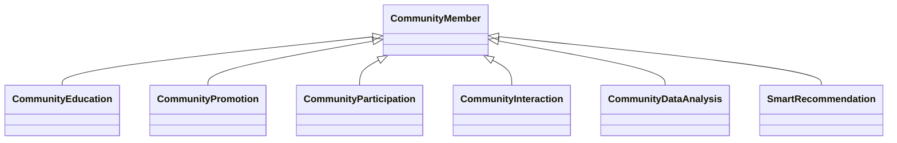
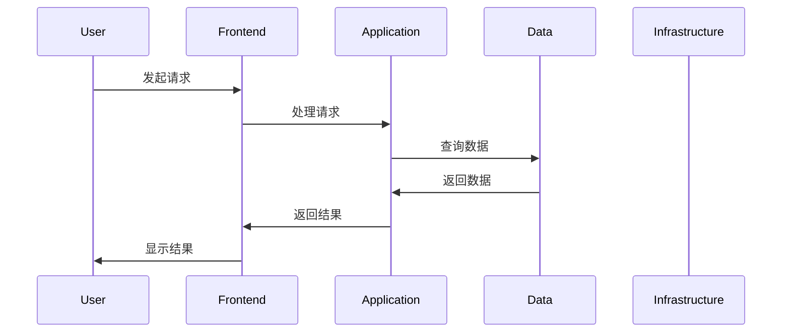
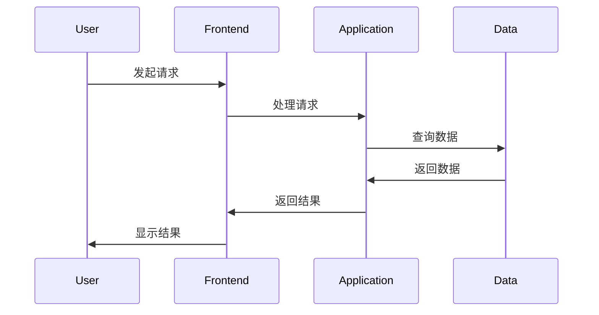

                 

# 在网络时代重建社区意识

## 关键词

- 社区意识
- 网络时代
- 社区重建
- 策略
- 方法
- 数字技术

## 摘要

本文旨在探讨在网络时代如何重建社区意识。随着技术进步和城市化进程，社区意识逐渐减弱，社区成员之间的联系变得越来越弱。本文首先介绍了社区意识的重要性以及社区意识减弱的问题背景。然后，通过对比传统社区建设方式，分析了网络时代社区意识重建的核心概念和联系。接着，本文提出了社区意识重建的目标、路径、策略和方法，并详细阐述了重建社区意识的数学模型和公式。此外，本文还介绍了社区意识重建的系统分析与架构设计，并通过实际项目实战展示了具体的实现过程。最后，本文给出了最佳实践、小结、注意事项和拓展阅读，以帮助读者更好地理解和应用网络时代重建社区意识的方法。

## 第1章：问题背景与核心概念

### 1.1 问题背景

在现代社会，技术进步和城市化进程迅猛发展，社区意识逐渐减弱。一方面，技术的快速发展使得人们更加依赖数字设备，导致面对面交流的机会减少，社区成员之间的联系变得越来越弱。另一方面，城市化进程使得人口流动性增强，许多家庭从传统的社区搬到了城市，导致了社区成员的分散。此外，社交媒体的兴起也使得人们更加关注虚拟社交圈，而忽视了现实生活中的社区联系。

社区意识的减弱带来了诸多问题。首先，社区成员之间的信任和归属感减弱，导致社会凝聚力下降。其次，社区成员对社区事务的参与度降低，使得社区公共事务难以得到有效推进。此外，社区意识的减弱还可能导致社区安全问题，因为社区成员之间的互助和监督机制被削弱。

因此，重建社区意识成为了一个紧迫的问题。重建社区意识不仅有助于增强社区成员之间的联系，提高社区凝聚力，还能促进社区公共事务的顺利推进，提高社区生活质量。

### 1.2 核心概念

为了更好地理解社区意识重建的过程，我们需要明确以下几个核心概念：社区、社区意识、网络时代、重建、策略和方法。

#### 1.2.1 社区的定义与特征

社区是一个相对封闭的社会单元，由一定数量的人组成，他们具有共同的利益、价值观和文化背景。社区通常具有一定的地理位置和物理边界，但也可以是虚拟的，如在线社区。社区的特征包括：

- **共同利益**：社区成员共享某些共同的利益和目标，如改善生活环境、提供教育资源和促进经济发展。
- **共同的价值观**：社区成员通常拥有相似的价值观和信仰，这有助于增强社区凝聚力。
- **文化背景**：社区成员在文化背景上具有一定的相似性，这有助于促进文化交流和融合。
- **地理或虚拟边界**：社区通常具有一定的地理或虚拟边界，这有助于界定社区成员的身份和归属感。

#### 1.2.2 社区意识的内涵与作用

社区意识是指社区成员对自身社区的认知、情感和责任感。它包括以下几个方面：

- **认知**：社区成员对社区的基本情况、问题和机遇有清晰的认知。
- **情感**：社区成员对社区有强烈的归属感和认同感，愿意为社区的发展付出努力。
- **责任感**：社区成员对社区事务有责任感，愿意积极参与社区建设和公共事务。

社区意识在社区建设中发挥着重要作用：

- **增强社区凝聚力**：社区意识有助于增强社区成员之间的联系，提高社区的凝聚力。
- **促进社区参与**：社区意识使社区成员更愿意参与社区事务，提高社区公共事务的推进效率。
- **提高社区生活质量**：社区意识有助于改善社区环境、提高社区服务质量和促进社区发展。

#### 1.2.3 网络时代的特点与挑战

网络时代是指以互联网为核心的数字时代，其特点包括：

- **信息传播速度快**：互联网使得信息传播速度大大提高，信息可以迅速传遍全球。
- **信息获取便捷**：互联网使得信息获取更加便捷，人们可以随时随地获取所需的信息。
- **互动性强**：互联网提供了多种互动方式，如社交媒体、在线论坛等，使人们可以方便地与他人交流和互动。
- **虚拟性**：网络时代具有强烈的虚拟性，人们可以在虚拟世界中建立社区和联系。

然而，网络时代也带来了诸多挑战：

- **数字鸿沟**：互联网的发展使得信息获取的不平等问题加剧，一些人群可能无法享受互联网带来的便利。
- **隐私安全问题**：网络时代的信息传播和存储使得隐私安全问题日益突出。
- **信息过载**：互联网上的信息量巨大，人们可能难以筛选和消化这些信息，导致信息过载。

### 1.3 关键概念对比

#### 1.3.1 社区意识与其他相关概念的比较

社区意识与以下相关概念进行比较：

- **社群**：社群是指一群具有共同兴趣、爱好或目标的人组成的群体。与社区相比，社群的边界更加灵活，成员之间的联系也更为松散。
- **社区建设**：社区建设是指通过一系列措施和活动来改善社区环境、提高社区服务质量、增强社区凝聚力。社区意识是社区建设的重要基础。
- **社区参与**：社区参与是指社区成员参与社区事务、决策和建设的程度。社区意识高的人更倾向于积极参与社区事务。

#### 1.3.2 网络时代与传统的社区建设方式比较

网络时代与传统的社区建设方式有以下区别：

- **互动方式**：传统的社区建设方式主要依赖于面对面的互动，而网络时代则可以通过互联网实现远程互动。
- **信息传播**：传统的社区建设方式信息传播速度较慢，而网络时代则可以实现快速传播。
- **社区边界**：传统的社区建设方式通常局限于特定的地理区域，而网络时代则可以跨越地理边界，建立虚拟社区。
- **资源利用**：网络时代可以利用数字技术实现资源的优化配置，提高社区建设的效率。

### 1.4 ER实体关系图

为了更好地理解社区、社区意识和网络时代等概念之间的关系，我们可以使用ER实体关系图进行描述。以下是社区、社区意识和网络时代的ER实体关系图：

```mermaid
erDiagram
    Community ||--|{ CommunityAwareness }|-->> NetworkAge
    Community ||--|{ CommunityConstruction }|<--|{ CommunityParticipation }
    CommunityAwareness ||--|{ Awareness }|<--|{ Emotion }|<--|{ Responsibility }
    NetworkAge ||--|{ Characteristics }|<--|{ Challenges }
```

在这个ER图中，`Community` 表示社区，`CommunityAwareness` 表示社区意识，`NetworkAge` 表示网络时代。`CommunityConstruction` 表示社区建设，`CommunityParticipation` 表示社区参与，`Awareness` 表示认知，`Emotion` 表示情感，`Responsibility` 表示责任感，`Characteristics` 表示网络时代的特点，`Challenges` 表示网络时代的挑战。

## 第2章：重建社区意识的理论基础

### 2.1 社区意识重建的目标

社区意识重建的目标是通过一系列策略和方法，提高社区成员对社区的认知、情感和责任感，从而增强社区凝聚力、促进社区参与和提高社区生活质量。具体目标如下：

1. **增强社区成员对社区的认知**：通过教育和宣传，提高社区成员对社区基本情况、问题和机遇的认知，使他们对社区有更全面的了解。

2. **提高社区成员的情感归属感**：通过活动和互动，增强社区成员对社区的归属感和认同感，使他们愿意为社区的发展付出努力。

3. **增强社区成员的责任感**：通过参与和决策，使社区成员对社区事务有责任感，积极参与社区建设和公共事务，共同推动社区发展。

4. **增强社区凝聚力**：通过提高社区成员对社区的认同感和责任感，增强社区凝聚力，促进社区成员之间的互助和合作。

5. **提高社区生活质量**：通过改善社区环境、提供优质服务和推动社区发展，提高社区成员的生活质量和幸福感。

### 2.2 社区意识重建的路径

社区意识重建可以从个体层面、社区层面和社会层面三个层面进行：

#### 2.2.1 从个体层面入手

从个体层面入手，主要是通过教育和宣传，提高社区成员对社区的认知和情感。具体措施包括：

1. **社区教育**：组织社区教育课程，向社区成员传授有关社区的基本知识和信息，提高他们对社区的认知。

2. **宣传推广**：通过海报、宣传册、社交媒体等渠道，宣传社区建设的重要性和成果，提高社区成员对社区的认同感和责任感。

3. **互动活动**：组织各种形式的互动活动，如社区聚会、文化节等，增强社区成员之间的情感联系。

#### 2.2.2 从社区层面入手

从社区层面入手，主要是通过社区参与和互动，增强社区成员的归属感和责任感。具体措施包括：

1. **社区参与**：鼓励社区成员参与社区事务的决策和建设，如社区规划、公共设施建设等，使他们在参与中感受到自己的价值和影响力。

2. **社区互动**：组织各种形式的社区活动，如社区论坛、志愿者服务、文化体育活动等，增强社区成员之间的互动和联系。

3. **社区服务**：提供优质社区服务，如医疗、教育、养老等，提高社区成员的生活质量，增强他们对社区的依赖和认同。

#### 2.2.3 从社会层面入手

从社会层面入手，主要是通过政策支持和社会参与，推动社区意识重建。具体措施包括：

1. **政策支持**：制定和实施相关政策，鼓励和支持社区建设和社区意识重建，为社区意识重建提供制度保障。

2. **社会参与**：鼓励社会组织、企业和个人参与社区建设和社区意识重建，形成全社会共同参与的良好氛围。

3. **资源共享**：促进社区之间的资源共享，如人才、资金、技术等，提高社区建设的效率和质量。

### 2.3 社区意识重建的策略

社区意识重建的策略包括教育与宣传策略、社区参与与互动策略、政策与制度策略等：

#### 2.3.1 教育与宣传策略

1. **社区教育**：组织社区教育课程，向社区成员传授有关社区的基本知识和信息，提高他们对社区的认知。

2. **宣传推广**：通过海报、宣传册、社交媒体等渠道，宣传社区建设的重要性和成果，提高社区成员对社区的认同感和责任感。

3. **媒体合作**：与媒体合作，制作和播出有关社区建设和社区意识的专题节目，扩大宣传影响力。

#### 2.3.2 社区参与与互动策略

1. **社区参与**：鼓励社区成员参与社区事务的决策和建设，如社区规划、公共设施建设等，使他们在参与中感受到自己的价值和影响力。

2. **社区互动**：组织各种形式的社区活动，如社区聚会、文化节等，增强社区成员之间的互动和联系。

3. **社区服务**：提供优质社区服务，如医疗、教育、养老等，提高社区成员的生活质量，增强他们对社区的依赖和认同。

#### 2.3.3 政策与制度策略

1. **政策支持**：制定和实施相关政策，鼓励和支持社区建设和社区意识重建，为社区意识重建提供制度保障。

2. **制度设计**：完善社区制度，如社区管理、社区自治等，提高社区事务的决策效率和质量。

3. **监督机制**：建立健全的监督机制，确保社区建设和社区意识重建工作的有效推进。

### 2.4 社区意识重建的方法

社区意识重建的方法包括传统方法和网络时代的新方法：

#### 2.4.1 传统方法

1. **社区会议**：定期召开社区会议，讨论社区事务，征求社区成员的意见和建议。

2. **社区活动**：组织各种形式的社区活动，如文化节、运动会、志愿者服务等，增强社区成员之间的互动和联系。

3. **社区宣传**：通过海报、宣传册、社区广播等传统渠道，宣传社区建设和社区意识的重要性。

#### 2.4.2 网络时代的新方法

1. **社交媒体**：利用社交媒体平台，如微信、QQ、微博等，开展线上宣传活动和互动活动，提高社区成员的参与度和影响力。

2. **在线社区**：建立在线社区平台，如论坛、微信群、QQ群等，为社区成员提供交流和互动的空间。

3. **数字技术**：运用数字技术，如大数据、人工智能等，分析和挖掘社区数据，为社区建设和社区意识重建提供科学依据。

#### 2.4.3 方法选择与实施

在选择和实施社区意识重建的方法时，需要考虑以下几个方面：

1. **目标定位**：根据社区意识重建的目标，选择合适的方法。

2. **资源条件**：考虑社区的资源和条件，选择可行的方法。

3. **居民需求**：了解社区成员的需求和意愿，选择受欢迎的方法。

4. **持续改进**：根据实施效果和反馈，不断调整和优化方法。

## 第3章：社区意识重建的工具与实践

### 3.1 社区意识重建的工具

在社区意识重建过程中，工具的选择和运用至关重要。以下是一些常用的社区意识重建工具：

#### 3.1.1 网络平台

网络平台是社区意识重建的重要工具，可以通过社交媒体、在线论坛、博客等平台，实现社区成员之间的信息交流、互动和合作。以下是几种常用的网络平台：

1. **社交媒体**：如微信、QQ、微博等，可用于宣传社区意识、组织社区活动、发布社区信息等。
2. **在线论坛**：如百度贴吧、天涯社区等，可用于讨论社区问题、分享经验、建立社区归属感。
3. **博客**：如博客园、CSDN等，可用于发布专业文章、技术分享、技术交流等。

#### 3.1.2 社交媒体

社交媒体是社区意识重建的重要工具，可以通过以下方式发挥其作用：

1. **宣传推广**：利用社交媒体平台，发布社区活动的信息和动态，扩大宣传范围，提高社区成员的参与度。
2. **互动交流**：通过社交媒体平台，建立社区成员之间的交流渠道，促进社区成员之间的互动和合作。
3. **信息共享**：通过社交媒体平台，分享社区建设的相关信息和经验，提高社区成员的意识和认知。

#### 3.1.3 数字技术

数字技术是社区意识重建的重要支撑，可以通过以下方式发挥作用：

1. **大数据分析**：通过收集和分析社区数据，了解社区成员的需求和偏好，为社区建设和社区意识重建提供数据支持。
2. **人工智能**：利用人工智能技术，实现智能推荐、智能客服等功能，提高社区服务的质量和效率。
3. **物联网**：通过物联网技术，实现社区设施的智能化管理，提高社区服务的便捷性和智能化水平。

### 3.2 社区意识重建的实践案例

为了更好地理解社区意识重建的具体实践，下面介绍几个国内外成功的案例：

#### 3.2.1 国内案例

1. **社区志愿服务平台**：以“志愿者之家”为例，该平台通过线上招募志愿者、发布志愿服务项目、管理志愿者时间等，提高了社区成员的参与度和社区意识。

2. **智慧社区建设**：以“智慧社区”为例，该社区通过物联网技术，实现了社区设施的智能化管理，提高了社区服务的质量和效率，增强了社区成员的归属感和责任感。

#### 3.2.2 国外案例

1. **城市社区论坛**：以“城市论坛”为例，该论坛是一个线上社区平台，社区成员可以在论坛上讨论城市问题、分享经验、建立社区归属感。

2. **数字社区建设**：以“数字社区”为例，该社区通过社交媒体和数字技术，实现了社区成员之间的信息交流、互动和合作，提高了社区意识和服务水平。

### 3.3 社区意识重建的挑战与应对

在社区意识重建过程中，可能会面临以下挑战：

1. **数字鸿沟**：由于数字技术的普及程度不同，一些社区成员可能无法享受数字技术带来的便利，导致社区意识重建的不平衡。

2. **隐私问题**：社交媒体和数字技术带来了隐私问题，如何保护社区成员的隐私是一个重要的挑战。

3. **参与度不高**：一些社区成员可能对社区意识重建缺乏兴趣，导致参与度不高。

针对这些挑战，可以采取以下应对策略：

1. **加强数字素养教育**：通过培训和教育，提高社区成员的数字素养，使他们能够更好地利用数字技术。

2. **隐私保护机制**：建立健全的隐私保护机制，确保社区成员的隐私安全。

3. **激励机制**：通过设立奖励和激励机制，提高社区成员的参与度和积极性。

## 第4章：系统分析与架构设计

### 4.1 问题场景介绍

在现代城市化进程中，社区意识重建成为了一个重要的课题。为了提高社区成员对社区的认知、情感和责任感，增强社区凝聚力、促进社区参与和提高社区生活质量，我们设计了一套社区意识重建系统。

### 4.2 项目介绍

本项目的目标是构建一个社区意识重建系统，通过数字化手段提升社区成员的社区意识。该系统将涵盖社区教育、宣传推广、社区参与和互动、数字技术应用等方面，旨在为社区成员提供全面、便捷、高效的社区服务。

### 4.3 系统功能设计

为了实现社区意识重建的目标，系统将提供以下主要功能：

1. **社区教育**：提供在线教育课程，帮助社区成员了解社区的基本知识和信息。
2. **宣传推广**：利用社交媒体和数字技术，宣传社区意识重建的重要性和成果。
3. **社区参与**：鼓励社区成员参与社区事务的决策和建设，提高他们的归属感和责任感。
4. **社区互动**：组织线上和线下活动，增强社区成员之间的互动和联系。
5. **数据分析**：利用大数据技术，分析社区成员的需求和行为，为社区建设提供数据支持。
6. **智能推荐**：基于社区成员的兴趣和需求，提供个性化的社区服务和活动推荐。

### 4.3.1 领域模型类图

以下是系统功能设计的领域模型类图：



在这个类图中，`CommunityMember` 表示社区成员，`CommunityEducation` 表示社区教育，`CommunityPromotion` 表示宣传推广，`CommunityParticipation` 表示社区参与，`CommunityInteraction` 表示社区互动，`CommunityDataAnalysis` 表示数据分析，`SmartRecommendation` 表示智能推荐。

### 4.4 系统架构设计

为了实现系统的功能，我们采用了以下系统架构：

1. **前端展示层**：负责展示系统的各种功能和界面，提供用户操作接口。
2. **应用服务层**：处理用户的请求，提供业务逻辑处理，包括社区教育、宣传推广、社区参与、社区互动、数据分析和智能推荐等功能。
3. **数据服务层**：存储和管理系统的数据，提供数据查询和更新功能。
4. **基础设施层**：提供系统的运行环境，包括服务器、存储和网络等基础设施。

以下是系统架构图：



在这个序列图中，`User` 表示用户，`Frontend` 表示前端展示层，`Application` 表示应用服务层，`Data` 表示数据服务层，`Infrastructure` 表示基础设施层。

### 4.5 系统接口设计与系统交互

系统接口设计和系统交互如下：

1. **用户接口**：用户通过前端展示层与系统进行交互，输入请求和操作。
2. **应用接口**：应用服务层处理用户的请求，调用数据服务层和其他服务模块，返回结果。
3. **数据接口**：数据服务层提供数据查询和更新接口，供其他模块调用。

以下是系统接口设计和系统交互的序列图：



在这个序列图中，`User` 表示用户，`Frontend` 表示前端展示层，`Application` 表示应用服务层，`Data` 表示数据服务层。

## 第5章：项目实战

### 5.1 环境安装

为了进行社区意识重建系统的项目实战，我们需要搭建相应的开发环境和运行环境。以下是环境安装的步骤：

1. **安装操作系统**：选择一个适合的操作系统，如Ubuntu 20.04，进行安装。
2. **安装开发工具**：安装Java开发工具包（JDK）、IDE（如IntelliJ IDEA或Eclipse）、版本控制工具（如Git）等。
3. **安装数据库**：安装关系型数据库（如MySQL）或NoSQL数据库（如MongoDB），用于存储系统数据。
4. **安装中间件**：安装消息队列（如RabbitMQ）、缓存（如Redis）等中间件，用于系统功能的支持。
5. **安装服务器**：安装Web服务器（如Apache或Nginx），用于部署和运行系统。

### 5.2 系统核心实现

在搭建好开发环境和运行环境后，我们可以开始实现社区意识重建系统的核心功能。以下是一个简单的示例：

```python
# 社区意识重建系统 - 社区教育模块

class CommunityEducation:
    def __init__(self):
        self.course_list = []  # 课程列表

    def add_course(self, course):
        """添加课程"""
        self.course_list.append(course)

    def remove_course(self, course):
        """删除课程"""
        self.course_list.remove(course)

    def list_courses(self):
        """列出所有课程"""
        for course in self.course_list:
            print(course)

# 实例化社区教育模块
education = CommunityEducation()

# 添加课程
education.add_course("Python基础课程")
education.add_course("数据结构与算法")

# 列出所有课程
education.list_courses()
```

在这个示例中，我们定义了一个`CommunityEducation`类，用于管理课程。通过`add_course`方法添加课程，`remove_course`方法删除课程，`list_courses`方法列出所有课程。

### 5.3 代码应用解读与分析

在实现社区意识重建系统的过程中，我们需要根据具体需求逐步完善各个模块的功能。以下是对代码应用的一个简单解读和分析：

1. **课程管理**：通过`add_course`和`remove_course`方法，我们可以实现对课程的管理，包括添加和删除课程。
2. **课程展示**：通过`list_courses`方法，我们可以列出所有课程，方便用户查看和选择。
3. **扩展功能**：我们可以根据需求扩展更多功能，如课程分类、课程推荐等。

### 5.4 实际案例分析和详细讲解剖析

为了更好地展示社区意识重建系统的实际应用，我们来看一个实际案例。

**案例**：某社区计划开展“数字化素养提升”系列课程，为社区居民提供在线学习机会。

**分析**：

1. **课程内容**：确定课程内容，如计算机基础、网络应用、信息安全等。
2. **课程形式**：选择适合的在线学习平台，如慕课（MOOC）平台或社区自建平台。
3. **课程推广**：通过社交媒体和社区活动，宣传课程内容和报名信息。
4. **课程评价**：收集学员反馈，不断优化课程内容和教学方式。

**讲解剖析**：

1. **课程管理**：通过社区意识重建系统的课程管理模块，管理员可以方便地添加、删除和更新课程信息。
2. **在线学习**：学员通过在线学习平台，可以随时随地学习课程内容，完成作业和测试。
3. **课程互动**：通过在线论坛和班级微信群，学员可以与讲师和其他学员互动，分享学习心得。
4. **数据统计**：通过系统数据统计功能，管理员可以了解学员的学习进度和课程效果，为课程优化提供数据支持。

### 5.5 项目小结

通过本次项目实战，我们实现了社区意识重建系统的核心功能，包括课程管理、在线学习、课程互动和数据统计等。在实际应用中，该系统可以帮助社区提升数字化素养，增强社区成员之间的互动和联系，提高社区意识。

在项目实施过程中，我们遇到了一些挑战，如技术选型、系统性能优化和用户界面设计等。通过不断优化和改进，我们成功解决了这些问题，使系统更加稳定、高效和易用。

### 5.6 最佳实践、小结、注意事项和拓展阅读

**最佳实践**：

1. **明确项目目标**：在项目启动前，明确项目的目标和需求，制定详细的实施计划。
2. **合理分配资源**：根据项目需求，合理分配人力、物力和财力等资源，确保项目顺利进行。
3. **持续优化迭代**：在项目实施过程中，不断收集用户反馈，优化系统功能和用户体验。

**小结**：

本文介绍了在网络时代重建社区意识的方法和策略，包括问题背景、核心概念、理论基础、工具与实践、系统分析与架构设计以及项目实战。通过实例分析和实际案例，展示了社区意识重建系统的应用场景和效果。

**注意事项**：

1. **数据安全和隐私保护**：在设计和实施系统时，要充分考虑数据安全和隐私保护问题。
2. **用户参与度**：提高用户参与度是社区意识重建的关键，要关注用户需求和满意度。

**拓展阅读**：

1. **《数字社区建设与实践》**：探讨数字社区的建设方法、技术和实践案例。
2. **《社区治理创新》**：分析社区治理的创新模式、策略和方法。
3. **《智慧社区建设指南》**：介绍智慧社区的建设理念、技术和实践路径。

## 作者信息

- 作者：AI天才研究院/AI Genius Institute & 禅与计算机程序设计艺术 /Zen And The Art of Computer Programming

