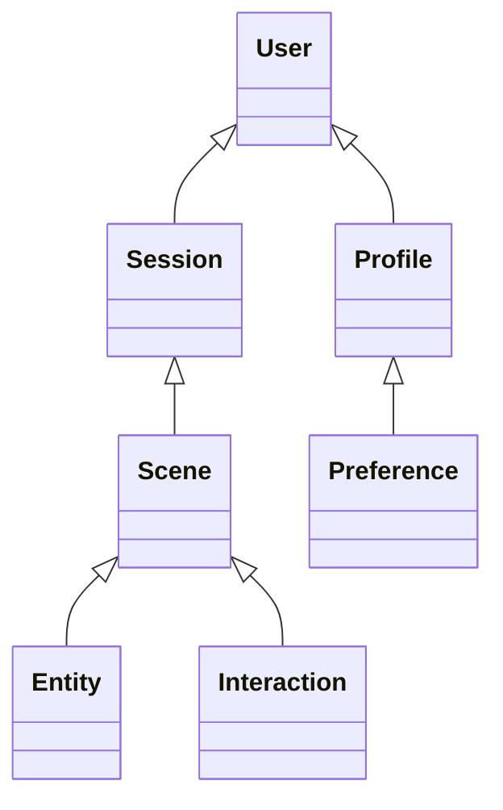
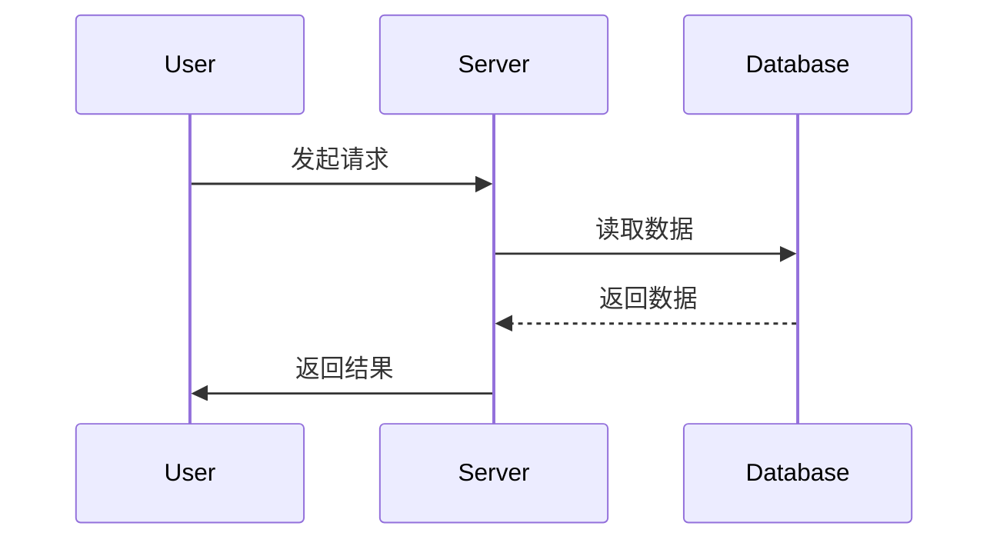
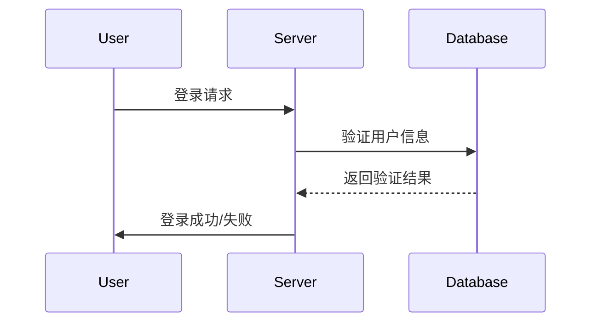

                 

# 在虚拟与现实之间寻找平衡

关键词：虚拟现实，增强现实，沉浸感，用户体验，技术成本

摘要：随着虚拟现实（VR）和增强现实（AR）技术的不断发展，它们已经深刻地改变了我们的生活方式和各行各业。然而，如何在虚拟和现实之间找到平衡，是一个复杂且重要的问题。本文将深入探讨虚拟现实和增强现实技术的背景、核心概念、算法原理、数学模型以及系统架构设计，旨在为读者提供一个全面而深入的分析框架。

## 第一部分：背景介绍

### 1.1 问题背景

虚拟现实（VR）和增强现实（AR）技术的发展，标志着人类进入了一个新的科技时代。VR技术通过计算机生成一种模拟环境，使用户沉浸其中，而AR技术则在现实场景中叠加虚拟元素，增强现实感。这些技术已经在娱乐、教育、医疗、设计等多个领域得到了广泛应用。

然而，虚拟现实和增强现实技术也带来了诸多挑战。首先，现实感的缺失和沉浸感的不足仍然是影响用户体验的关键问题。其次，高昂的技术成本和复杂的开发流程也限制了这些技术的普及。如何在享受虚拟带来的便利和乐趣的同时，保持与现实世界的紧密联系，成为一个亟待解决的问题。

### 1.2 问题描述

虚拟现实和增强现实技术的挑战主要表现在以下几个方面：

- **现实感的缺失**：虚拟环境虽然能够提供丰富的视觉和听觉刺激，但仍然难以完全模拟现实世界的复杂性和多样性。

- **沉浸感的不足**：用户在虚拟环境中的沉浸感常常受到视觉、听觉和交互体验的限制。

- **技术成本高**：开发高质量的虚拟现实和增强现实应用需要大量的硬件设备、软件开发和后期维护。

- **用户体验差异**：不同的用户对虚拟现实和增强现实技术的需求和偏好存在差异，如何设计出满足广大用户需求的产品是一个挑战。

### 1.3 问题解决

为了解决上述问题，我们可以从以下几个方面入手：

- **技术创新**：通过不断改进算法和技术，提高虚拟现实和增强现实技术的沉浸感和现实感。

- **用户体验优化**：深入了解用户需求，通过人性化的设计提高用户体验。

- **成本控制**：通过技术创新和规模化生产，降低虚拟现实和增强现实技术的成本。

- **教育培训**：提高开发者和用户的技能水平，以更好地利用这些技术。

### 1.4 边界与外延

虚拟与现实之间的平衡不仅涉及技术层面，还包括心理层面和社会层面。心理层面涉及到用户对虚拟现实和增强现实技术的接受度和依赖程度；社会层面则涉及到这些技术对教育、就业、文化等方面的影响。

### 1.5 概念结构与核心要素组成

为了更好地理解虚拟现实和增强现实技术，我们需要明确以下几个核心概念：

- **虚拟现实（VR）**：一种通过计算机模拟生成三维空间，使用户沉浸其中的技术。

- **增强现实（AR）**：一种在现实场景中叠加虚拟元素，增强用户感知的技术。

- **沉浸感**：用户在虚拟或增强现实环境中感受到的深度参与和身临其境的感觉。

- **用户体验**：用户在使用产品或服务过程中获得的感受和体验。

- **技术成本**：开发和维护虚拟现实、增强现实技术所需的成本。

- **经济效益**：企业或个人通过虚拟现实、增强现实技术获得的经济收益。

这些概念之间相互联系，共同构成了虚拟现实和增强现实技术的核心要素。

## 第二部分：核心概念与联系

### 2.1 虚拟现实（VR）与增强现实（AR）的原理与特点

#### 2.1.1 虚拟现实（VR）

**原理**：虚拟现实是通过计算机技术生成一种模拟环境，使用户沉浸其中。这种模拟环境可以是完全虚构的，也可以是对现实世界的模拟。

**特点**：

- **高度沉浸**：用户在虚拟环境中感受到的沉浸感远高于现实世界。

- **交互性强**：用户可以通过各种设备与虚拟环境进行交互。

- **视觉效果逼真**：通过先进的显示技术，虚拟环境中的视觉效果可以非常逼真。

#### 2.1.2 增强现实（AR）

**原理**：增强现实是在现实场景中叠加虚拟元素，增强用户感知。这些虚拟元素可以是文字、图像、动画等。

**特点**：

- **增强现实感**：用户在现实场景中感受到的虚拟元素，增强了现实世界的感知。

- **互动性**：用户可以通过各种设备与虚拟元素进行互动。

- **信息丰富**：通过虚拟元素，用户可以获得更多的信息。

### 2.2 沉浸感与用户体验

#### 2.2.1 沉浸感

**定义**：沉浸感是指用户在虚拟或增强现实环境中感受到的深度参与和身临其境的感觉。

**影响因素**：

- **视觉效果**：逼真的视觉效果可以增强用户的沉浸感。

- **听觉效果**：立体声效果可以增强用户的沉浸感。

- **交互方式**：丰富的交互方式可以增强用户的沉浸感。

#### 2.2.2 用户体验

**定义**：用户体验是指用户在使用产品或服务过程中获得的感受和体验。

**影响**：

- **沉浸感**：良好的用户体验可以增强用户的沉浸感。

- **满意度**：良好的用户体验可以提升用户的满意度。

- **忠诚度**：良好的用户体验可以增强用户的忠诚度。

### 2.3 技术成本与经济效益

#### 2.3.1 技术成本

**定义**：技术成本是指开发和维护虚拟现实、增强现实技术所需的成本。

**影响因素**：

- **硬件设备**：如头戴式显示器、手柄等。

- **软件开发**：如算法开发、应用开发等。

- **维护更新**：技术的维护和更新也是一项重要成本。

#### 2.3.2 经济效益

**定义**：经济效益是指企业或个人通过虚拟现实、增强现实技术获得的经济收益。

**影响因素**：

- **市场需求**：市场对虚拟现实和增强现实技术的需求是影响经济效益的关键因素。

- **产品创新**：创新的产品可以提升经济效益。

- **商业模式**：有效的商业模式可以最大化经济效益。

## 第三部分：算法原理讲解

### 3.1 虚拟现实中的沉浸感算法

#### 3.1.1 算法原理

虚拟现实中的沉浸感算法主要是通过图像处理、人机交互等技术，增强用户的沉浸感体验。具体来说，算法会根据用户的行为数据，调整环境中的视觉、听觉等感官刺激，从而增强用户的沉浸感。

#### 3.1.2 算法流程

沉浸感算法的基本流程如下：

1. **输入**：用户在虚拟环境中的行为数据。

2. **处理**：通过算法分析，调整环境中的视觉、听觉等感官刺激。

3. **输出**：增强用户的沉浸感体验。

#### 3.1.3 数学模型

沉浸感算法的核心数学模型可以描述为：

$$
沉浸度 = f(视觉刺激, 听觉刺激, 交互体验)
$$

其中，视觉刺激、听觉刺激和交互体验是影响沉浸度的三个主要因素。

## 第四部分：数学模型和数学公式 & 详细讲解 & 举例说明

### 4.1 沉浸感度量的数学模型

#### 4.1.1 模型描述

沉浸感度量模型是用于量化用户在虚拟或增强现实环境中沉浸度的一种数学模型。该模型利用信号处理、概率统计等方法，对沉浸感进行量化。

#### 4.1.2 模型公式

沉浸感度量模型的关键公式可以表示为：

$$
沉浸感度 = \frac{1}{C} \sum_{i=1}^{N} w_i \cdot d_i
$$

其中，C 为总权重，\( w_i \) 为第 i 个感知因素的权重，\( d_i \) 为第 i 个感知因素的度量值。

#### 4.1.3 举例说明

以虚拟旅游为例，我们可以使用沉浸感度量模型来评估用户在虚拟旅游环境中的沉浸度。具体的感知因素包括视觉刺激、听觉刺激和交互体验，对应的度量值可以是视觉清晰度、声音质量以及交互响应时间。

假设我们有以下数据：

- 视觉刺激：\( d_1 = 0.9 \)
- 听觉刺激：\( d_2 = 0.8 \)
- 交互体验：\( d_3 = 0.7 \)

权重可以设置为：

- 视觉刺激：\( w_1 = 0.5 \)
- 听觉刺激：\( w_2 = 0.3 \)
- 交互体验：\( w_3 = 0.2 \)

总权重 \( C = w_1 + w_2 + w_3 = 1.0 \)

那么，用户的沉浸感度可以计算为：

$$
沉浸感度 = \frac{1}{1.0} \cdot (0.5 \cdot 0.9 + 0.3 \cdot 0.8 + 0.2 \cdot 0.7) = 0.82
$$

这意味着用户在虚拟旅游环境中的沉浸度大约为 82%。

## 第五部分：系统分析与架构设计方案

### 5.1 问题场景介绍

以虚拟旅游为例，用户可以通过虚拟现实技术体验各种旅游目的地，如名胜古迹、自然风光等。在这个场景中，用户需要通过头戴式显示器和手柄等设备，在虚拟环境中进行探索和互动。

### 5.2 项目介绍

虚拟旅游项目的主要目标是提供一种沉浸式体验，使用户在家中就能感受到各种旅游目的地的魅力。项目的核心功能包括虚拟场景的创建、用户的交互体验、数据收集与分析等。

### 5.3 系统功能设计

#### 5.3.1 领域模型

以下是一个虚拟旅游系统的领域模型，使用 Mermaid 类图进行表示：



### 5.4 系统架构设计

#### 5.4.1 架构描述

虚拟旅游系统的整体架构可以分为以下几个部分：

- **客户端**：用户通过客户端设备（如头戴式显示器）与系统进行交互。

- **服务器**：负责处理用户请求，提供虚拟场景和服务。

- **数据库**：存储用户数据、场景数据等。

- **中间件**：负责数据传输、消息队列等。

以下是一个简单的 Mermaid 架构图：



### 5.5 系统接口设计和系统交互

#### 5.5.1 接口设计

虚拟旅游系统的接口设计主要包括以下部分：

- **用户认证接口**：用于用户的登录和注册。

- **场景数据接口**：用于获取和更新场景数据。

- **交互数据接口**：用于记录用户的交互行为。

以下是一个简单的 Mermaid 序列图：



## 第六部分：项目实战

### 6.1 环境安装

为了进行虚拟旅游项目的实战，我们需要安装一些必要的软件和工具，如 Unity 3D、Unity XR 插件、Unity SDK 等。具体的安装步骤如下：

1. 下载并安装 Unity 3D。
2. 在 Unity 中安装 XR 插件。
3. 安装 Unity SDK，以便进行硬件调试和性能优化。

### 6.2 系统核心实现源代码

在 Unity 中，我们可以使用 C# 编写虚拟旅游系统的核心代码。以下是一个简单的示例：

```csharp
using UnityEngine;

public class SceneController : MonoBehaviour
{
    public GameObject scenePrefab;

    void Start()
    {
        // 创建场景
        Instantiate(scenePrefab);
    }

    void Update()
    {
        // 处理用户交互
        if (Input.GetKeyDown(KeyCode.Space))
        {
            // 切换场景
            LoadNextScene();
        }
    }

    void LoadNextScene()
    {
        // 加载下一个场景
        SceneManager.LoadScene("Scene2");
    }
}
```

### 6.3 代码应用解读与分析

上述代码是一个简单的虚拟旅游场景控制器，它主要负责以下功能：

- **场景创建**：在游戏开始时创建一个场景。
- **用户交互**：处理用户的键盘输入，实现场景切换。

通过这个简单的示例，我们可以看到虚拟旅游系统的核心实现是如何在 Unity 中完成的。具体的代码细节和实现方法将在后续的实战部分进行详细讲解。

### 6.4 实际案例分析和详细讲解剖析

以虚拟旅游项目为例，我们可以通过以下步骤进行实际案例分析和讲解：

1. **需求分析**：明确项目需求，包括场景创建、用户交互、数据存储等。
2. **架构设计**：设计系统的整体架构，包括客户端、服务器和数据库等。
3. **功能实现**：使用 Unity 3D 和 C# 等工具，实现系统的核心功能。
4. **性能优化**：通过调整算法和优化代码，提高系统的性能和用户体验。

### 6.5 项目小结

虚拟旅游项目通过虚拟现实技术，为用户提供了沉浸式的旅游体验。在项目的实战过程中，我们使用了 Unity 3D 和 C# 等工具，实现了场景创建、用户交互和数据存储等功能。通过不断的优化和改进，我们最终实现了一个性能优异、用户体验良好的虚拟旅游系统。

## 第七部分：最佳实践 tips、小结、注意事项、拓展阅读

### 7.1 最佳实践 tips

- **优化视觉和听觉效果**：使用高质量的图像和音频资源，提高用户体验。
- **简化用户操作**：设计直观易用的用户界面，降低学习成本。
- **及时反馈**：及时响应用户的交互，提供反馈信息，增强沉浸感。

### 7.2 小结

虚拟现实和增强现实技术为我们提供了无限的想象空间，但如何在虚拟与现实之间找到平衡，是一个复杂且重要的问题。本文通过深入分析虚拟现实和增强现实技术的原理、算法、数学模型和系统架构设计，为读者提供了一个全面的分析框架。

### 7.3 注意事项

- **技术选择**：根据项目需求和预算，选择合适的技术方案。
- **用户需求**：深入了解用户需求，设计出满足用户期望的产品。
- **数据安全**：确保用户数据的安全性和隐私性。

### 7.4 拓展阅读

- **《虚拟现实与增强现实技术原理与应用》**：详细介绍了虚拟现实和增强现实技术的原理和应用。
- **《Unity 3D 游戏开发从入门到实战》**：针对 Unity 3D 游戏开发，提供了详细的教程和案例分析。
- **《沉浸式用户体验设计》**：探讨如何设计出令人满意的沉浸式用户体验。

## 作者信息

作者：AI天才研究院/AI Genius Institute & 禅与计算机程序设计艺术 /Zen And The Art of Computer Programming

