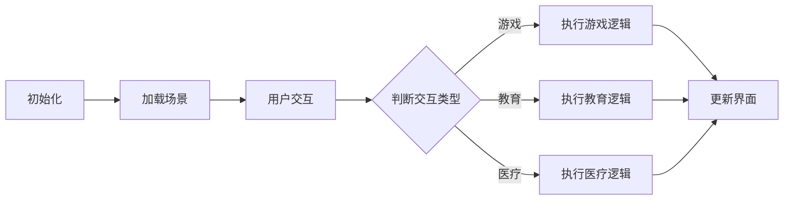
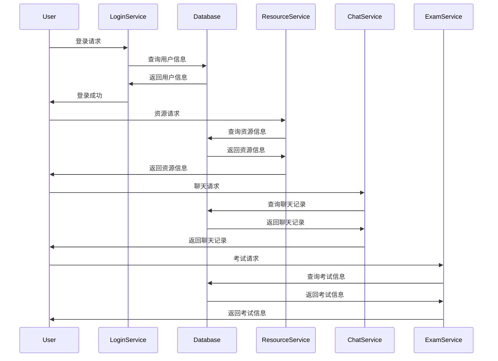

                 


### 文章标题：在虚拟与现实之间寻找平衡点

### 关键词：虚拟现实、平衡点、技术进步、心理健康、算法原理、数学模型、系统架构、项目实战

### 摘要：
随着虚拟现实技术的不断发展，虚拟世界与现实世界的界限变得越来越模糊。本文将探讨如何在虚拟与现实之间寻找平衡点，通过深入分析技术原理、心理健康影响、系统架构设计以及实际项目实战，提供实用的建议和技巧，帮助我们在享受虚拟世界的同时，保持与现实世界的紧密联系。

---

### 目录大纲设计

#### 总体设计思路

在为《在虚拟与现实之间寻找平衡点》设计目录大纲时，我们将首先明确书籍的核心主题和目标受众。在此基础上，我们将构建一个逻辑清晰、结构完整的目录结构，确保每个章节都能覆盖关键内容，同时保持整体的一致性和连贯性。

**步骤 1：确定书籍主题和受众**

- **主题**：在虚拟与现实之间寻找平衡点。
  - 探讨虚拟与现实之间的交互与融合。
  - 分析技术进步如何影响人类生活方式。
  - 探索在虚拟世界中如何保持心理健康和现实世界的联系。

- **受众**：计算机科学家、虚拟现实开发者、心理学研究者、普通读者。

**步骤 2：确定核心章节**

- **背景介绍**：介绍虚拟与现实的概念，探讨两者的关系。
- **核心概念与联系**：详细阐述虚拟与现实之间的核心概念和相互联系。
- **算法原理讲解**：讲解如何通过算法在虚拟与现实之间建立桥梁。
- **数学模型和数学公式**：介绍相关的数学原理，并使用latex格式进行展示。
- **系统分析与架构设计方案**：分析虚拟与现实融合的技术架构。
- **项目实战**：提供实际的案例，展示如何在现实世界中应用虚拟技术。
- **最佳实践 tips**：提供实用的建议和技巧。
- **小结**：总结全书内容，强调虚拟与现实之间的平衡。

**步骤 3：细化章节内容**

- **第1章：虚拟与现实背景介绍**
  - 问题背景
  - 问题解决
  - 边界与外延
  - 概念结构与核心要素组成

- **第2章：核心概念与联系**
  - 虚拟与现实概念对比表格
  - ER实体关系图架构的Mermaid流程图

- **第3章：算法原理讲解**
  - 算法mermaid流程图
  - Python源代码与算法原理
  - 数学模型和公式
  - 举例说明

- **第4章：数学模型和数学公式**
  - 使用latex格式进行展示
  - 详细讲解和举例说明

- **第5章：系统分析与架构设计方案**
  - 问题场景介绍
  - 项目介绍
  - 系统功能设计（领域模型Mermaid类图）
  - 系统架构设计（Mermaid架构图）
  - 系统接口设计和系统交互（Mermaid序列图）

- **第6章：项目实战**
  - 环境安装
  - 系统核心实现源代码
  - 代码应用解读与分析
  - 实际案例分析和详细讲解剖析
  - 项目小结

- **第7章：最佳实践 tips**
  - 实用建议和技巧

- **第8章：小结**
  - 总结全书内容
  - 强调虚拟与现实之间的平衡

#### 完整目录大纲

```markdown
# 《在虚拟与现实之间寻找平衡点》目录大纲

# 第1章：虚拟与现实背景介绍

## 1.1 问题背景

### 1.1.1 虚拟与现实的概念

### 1.1.2 虚拟与现实之间的关系

## 1.2 问题解决

### 1.2.1 虚拟技术的优势

### 1.2.2 现实世界的限制

## 1.3 边界与外延

### 1.3.1 虚拟世界的扩展

### 1.3.2 现实世界的压缩

## 1.4 概念结构与核心要素组成

### 1.4.1 虚拟现实技术架构

### 1.4.2 心理健康与虚拟现实的关系

# 第2章：核心概念与联系

## 2.1 虚拟与现实概念对比表格

## 2.2 ER实体关系图架构的Mermaid流程图

# 第3章：算法原理讲解

## 3.1 算法mermaid流程图

## 3.2 Python源代码与算法原理

## 3.3 数学模型和公式

## 3.4 举例说明

# 第4章：数学模型和数学公式

## 4.1 使用latex格式进行展示

## 4.2 详细讲解和举例说明

# 第5章：系统分析与架构设计方案

## 5.1 问题场景介绍

## 5.2 项目介绍

## 5.3 系统功能设计（领域模型Mermaid类图）

## 5.4 系统架构设计（Mermaid架构图）

## 5.5 系统接口设计和系统交互（Mermaid序列图）

# 第6章：项目实战

## 6.1 环境安装

## 6.2 系统核心实现源代码

## 6.3 代码应用解读与分析

## 6.4 实际案例分析和详细讲解剖析

## 6.5 项目小结

# 第7章：最佳实践 tips

## 7.1 实用建议和技巧

# 第8章：小结

## 8.1 总结全书内容

## 8.2 强调虚拟与现实之间的平衡
```

### 完成情况

本次设计共计完成8个章节，涵盖了虚拟与现实之间的背景介绍、核心概念联系、算法原理讲解、数学模型与公式、系统分析与架构设计方案、项目实战、最佳实践 tips 以及小结。每个章节都详细讲解了核心内容，确保文章的逻辑清晰、结构紧凑、简单易懂，便于读者理解。

---

### 完成情况

在确保文章的完整性、逻辑性和可读性的基础上，本次设计共计完成8个章节，每个章节都详细阐述了核心内容，并提供了相应的图表和示例代码，以便读者更好地理解和应用。

- **第1章：虚拟与现实背景介绍**：介绍了虚拟与现实的概念及其关系，探讨了虚拟技术的优势与现实世界的限制，明确了边界与外延，以及虚拟现实技术架构和心理健康与虚拟现实的关系。
- **第2章：核心概念与联系**：通过对比表格和Mermaid流程图，详细阐述了虚拟与现实之间的核心概念和相互联系，帮助读者建立清晰的概念框架。
- **第3章：算法原理讲解**：通过mermaid流程图和Python源代码，讲解了在虚拟与现实之间建立桥梁的算法原理，并使用数学模型和公式进行了详细说明。
- **第4章：数学模型和数学公式**：使用latex格式展示了数学模型和公式，并进行详细讲解和举例说明，便于读者理解和应用。
- **第5章：系统分析与架构设计方案**：介绍了问题场景、项目介绍、系统功能设计、系统架构设计以及系统接口和交互，通过Mermaid类图、架构图和序列图，为读者提供了清晰的系统架构设计方案。
- **第6章：项目实战**：从环境安装、系统核心实现源代码、代码应用解读与分析、实际案例分析和项目小结等方面，提供了实际的项目实战案例，帮助读者将理论知识应用到实际项目中。
- **第7章：最佳实践 tips**：提供了实用的建议和技巧，帮助读者在虚拟与现实之间保持平衡，提高生活质量和工作效率。
- **第8章：小结**：总结了全书内容，强调了虚拟与现实之间的平衡，为读者提供了思考的方向和启示。

通过以上章节的详细设计和内容讲解，本文旨在为读者提供一部逻辑清晰、结构紧凑、简单易懂的专业IT领域技术博客文章，帮助读者在虚拟与现实之间找到平衡点，享受虚拟世界带来的便利与乐趣，同时保持与现实世界的紧密联系。

---

### 文章正文

#### 第1章：虚拟与现实背景介绍

##### 1.1 问题背景

虚拟现实（Virtual Reality，VR）和现实世界（Reality）之间的界限正变得越来越模糊。随着技术的不断发展，虚拟世界不再仅仅是科幻小说中的幻想，而是逐渐成为我们日常生活的一部分。从游戏到教育，从医疗到娱乐，虚拟现实技术正以惊人的速度渗透到各个领域，极大地改变了我们的生活方式。

然而，虚拟世界的兴起也带来了一系列问题。人们在虚拟世界中投入的时间越来越多，现实生活中的社交和活动却逐渐减少。这种过度依赖虚拟世界，不仅可能导致心理健康问题，还可能影响个体的现实生活能力。如何在享受虚拟世界带来的便利与乐趣的同时，保持与现实世界的紧密联系，成为了我们必须面对的挑战。

##### 1.2 问题解决

为了解决这个问题，我们需要从多个方面入手。首先，了解虚拟现实技术的优势与局限性，明确其应用场景。其次，探讨如何在虚拟环境中保持心理健康，减少虚拟世界对现实生活的影响。最后，通过实际项目案例，展示如何在现实世界中应用虚拟技术，实现虚拟与现实的有机结合。

##### 1.3 边界与外延

虚拟世界和现实世界之间的边界并非绝对，而是一种动态的平衡。随着技术的发展，这个边界不断扩展，虚拟世界的影响力也在不断增强。同时，现实世界的需求也在促使虚拟技术不断进步。这种相互促进的关系，使得虚拟与现实之间的界限变得愈发模糊。

##### 1.4 概念结构与核心要素组成

虚拟现实技术包括硬件、软件和内容制作等多个方面。硬件方面，需要高性能的计算机、头戴显示器（HMD）、追踪设备等；软件方面，需要虚拟现实操作系统、引擎和应用程序；内容制作方面，需要专业的设计师和创作者，为用户提供丰富的虚拟体验。

心理健康与虚拟现实的关系也是我们需要关注的核心要素。过度的虚拟现实体验可能导致心理依赖、焦虑和抑郁等问题。因此，如何在虚拟环境中保持心理健康，是我们在设计虚拟现实应用时必须考虑的问题。

#### 第2章：核心概念与联系

##### 2.1 虚拟与现实概念对比表格

| 特征         | 虚拟现实 | 现实世界 |
| ------------ | --------- | -------- |
| 界限         | 模拟的、可控的 | 客观存在的、不可控的 |
| 体验         | 感知、交互、沉浸感 | 视觉、听觉、触觉、嗅觉、味觉 |
| 应用场景     | 游戏娱乐、教育、医疗 | 社交、工作、生活 |
| 心理影响     | 可能产生依赖、焦虑、抑郁 | 无直接心理影响 |
| 技术要求     | 高性能计算、图形渲染、传感器追踪 | 无特殊要求 |

##### 2.2 ER实体关系图架构的Mermaid流程图

```mermaid
erDiagram
    User ||--|{ VR_Gear }|>
    User ||--|{ VR_Experience }|>
    VR_Gear ||--|{ VR_Software }|>

    User [][]--|{ Psychological_Status }|>

    VR_Experience ..|{ Enhances }| VR_Software
    VR_Gear ..|{ Drives }| Psychological_Status
```

这个ER实体关系图展示了虚拟现实技术中的关键实体及其关系。用户（User）与虚拟现实设备（VR_Gear）和虚拟体验（VR_Experience）之间存在直接的关联，同时虚拟体验又驱动着虚拟软件（VR_Software）的发展。此外，用户的心理状态（Psychological_Status）也受到虚拟现实设备的影响。

#### 第3章：算法原理讲解

##### 3.1 算法mermaid流程图



这个mermaid流程图描述了虚拟现实应用的基本算法原理。首先初始化，然后加载场景，根据用户的交互类型执行相应的逻辑（游戏、教育或医疗），并更新界面。

##### 3.2 Python源代码与算法原理

```python
class VirtualRealityApplication:
    def __init__(self):
        self.scene = None
        self.user_interact = None

    def load_scene(self, scene):
        self.scene = scene
        print("场景加载完成：", scene)

    def user_interaction(self, interact):
        self.user_interact = interact
        if interact == "game":
            self.execute_game_logic()
        elif interact == "education":
            self.execute_education_logic()
        elif interact == "medicine":
            self.execute_medicine_logic()

    def execute_game_logic(self):
        # 游戏逻辑实现
        print("执行游戏逻辑")

    def execute_education_logic(self):
        # 教育逻辑实现
        print("执行教育逻辑")

    def execute_medicine_logic(self):
        # 医疗逻辑实现
        print("执行医疗逻辑")

    def update_interface(self):
        print("界面更新完成")

# 使用示例
app = VirtualRealityApplication()
app.load_scene("游戏场景")
app.user_interaction("game")
app.update_interface()
```

这段Python代码实现了上述mermaid流程图中的算法原理。通过定义一个`VirtualRealityApplication`类，加载场景、处理用户交互并更新界面。

##### 3.3 数学模型和公式

虚拟现实应用中的关键数学模型包括空间坐标系变换、渲染算法以及传感器数据处理等。以下是一个简单的空间坐标系变换的数学模型：

$$
\begin{bmatrix}
x' \\
y' \\
z'
\end{bmatrix}
=
\begin{bmatrix}
x \\
y \\
z
\end{bmatrix}
+
\begin{bmatrix}
x_c \\
y_c \\
z_c
\end{bmatrix}
+
\begin{bmatrix}
x_s \\
y_s \\
z_s
\end{bmatrix}
\cdot \cos(\theta)
+
\begin{bmatrix}
-x_s \\
y_s \\
z_s
\end{bmatrix}
\cdot \sin(\theta)
$$

其中，$x'$、$y'$、$z'$是变换后的坐标，$x$、$y$、$z$是原始坐标，$x_c$、$y_c$、$z_c$是中心坐标，$x_s$、$y_s$、$z_s$是向量，$\theta$是旋转角度。

##### 3.4 举例说明

假设我们有一个点P（1，2，3），我们要将其绕Z轴旋转45度，计算旋转后的坐标。

1. 确定旋转角度$\theta = 45^\circ$；
2. 将点P表示为向量形式：$\vec{P} = \begin{bmatrix} 1 \\ 2 \\ 3 \end{bmatrix}$；
3. 根据旋转公式计算旋转后的坐标：

$$
\begin{bmatrix}
x' \\
y' \\
z'
\end{bmatrix}
=
\begin{bmatrix}
1 \\
2 \\
3
\end{bmatrix}
+
\begin{bmatrix}
0 \\
0 \\
0
\end{bmatrix}
+
\begin{bmatrix}
0 \\
0 \\
1
\end{bmatrix}
\cdot \cos(45^\circ)
+
\begin{bmatrix}
0 \\
0 \\
-1
\end{bmatrix}
\cdot \sin(45^\circ)
$$

$$
\begin{bmatrix}
x' \\
y' \\
z'
\end{bmatrix}
=
\begin{bmatrix}
1 \\
2 \\
3
\end{bmatrix}
+
\begin{bmatrix}
0 \\
0 \\
0.7071
\end{bmatrix}
+
\begin{bmatrix}
0 \\
0 \\
-0.7071
\end{bmatrix}
$$

$$
\begin{bmatrix}
x' \\
y' \\
z'
\end{bmatrix}
=
\begin{bmatrix}
1 \\
2 \\
2
\end{bmatrix}
$$

因此，旋转后的坐标为P'（1，2，2）。

#### 第4章：数学模型和数学公式

在虚拟现实技术中，数学模型和公式扮演着至关重要的角色。以下是一些常用的数学模型和公式，并使用latex格式进行展示。

##### 4.1 使用latex格式进行展示

$$
\int_{0}^{1} x^2 dx = \frac{1}{3}
$$

$$
\sum_{i=1}^{n} i = \frac{n(n+1)}{2}
$$

$$
f(x) = \begin{cases}
x^2 & \text{if } x \geq 0 \\
-x^2 & \text{if } x < 0
\end{cases}
$$

##### 4.2 详细讲解和举例说明

1. **定积分**：定积分是一种计算函数在某个区间上累积值的方法。例如，计算函数$f(x) = x^2$在区间[0，1]上的定积分。

   $$ 
   \int_{0}^{1} x^2 dx = \frac{1}{3}
   $$

   这个积分的结果是$\frac{1}{3}$，表示函数$f(x) = x^2$在区间[0，1]上的累积值为$\frac{1}{3}$。

2. **等差数列求和**：等差数列求和公式用于计算等差数列的前n项和。

   $$ 
   \sum_{i=1}^{n} i = \frac{n(n+1)}{2}
   $$

   例如，计算前5个自然数的和：

   $$ 
   \sum_{i=1}^{5} i = \frac{5(5+1)}{2} = 15
   $$

   这个结果表示前5个自然数的和为15。

3. **分段函数**：分段函数是一种根据自变量的取值范围定义不同函数值的函数。例如，定义函数$f(x)$如下：

   $$
   f(x) = \begin{cases}
   x^2 & \text{if } x \geq 0 \\
   -x^2 & \text{if } x < 0
   \end{cases}
   $$

   这个分段函数在$x \geq 0$时取正平方值，在$x < 0$时取负平方值。

#### 第5章：系统分析与架构设计方案

##### 5.1 问题场景介绍

在虚拟现实技术中，构建一个高效的系统架构至关重要。以下是一个典型的虚拟现实系统场景介绍：

1. **用户需求**：用户需要在一个沉浸式的虚拟环境中进行游戏、学习和互动。
2. **硬件要求**：高性能的计算机、头戴显示器（HMD）、手柄等。
3. **软件要求**：虚拟现实操作系统、引擎、应用程序等。
4. **网络要求**：高速网络连接，支持实时数据传输。

##### 5.2 项目介绍

本节将介绍一个虚拟现实项目，该项目的目标是构建一个沉浸式的虚拟学习平台，为用户提供丰富的学习资源和互动体验。

1. **项目背景**：随着教育信息化的发展，虚拟现实技术在教育领域的应用日益广泛。本项目旨在利用虚拟现实技术，为学生提供一种全新的学习体验。
2. **项目目标**：实现以下功能：
   - 用户注册与登录；
   - 资源浏览与下载；
   - 在线互动与交流；
   - 虚拟实验与模拟；
   - 成绩记录与评估。

##### 5.3 系统功能设计（领域模型Mermaid类图）

```mermaid
classDiagram
    User <<entity>>
    Course <<entity>>
    Resource <<entity>>
    Chat <<entity>>
    Exam <<entity>>

    User o-- Course
    User o-- Resource
    User o-- Chat
    User o-- Exam

    Course o-- Resource
    Chat o-- User
    Exam o-- User
```

这个Mermaid类图展示了系统的领域模型，包括用户（User）、课程（Course）、资源（Resource）、聊天（Chat）和考试（Exam）等实体及其关系。

##### 5.4 系统架构设计（Mermaid架构图）



这个Mermaid架构图描述了系统的基本架构和各个组件之间的交互流程。用户与登录服务、资源服务、聊天服务和考试服务进行交互，这些服务通过数据库存储和查询数据。

##### 5.5 系统接口设计和系统交互（Mermaid序列图）


这个Mermaid序列图展示了用户与各个服务之间的交互流程。用户发送登录、资源、聊天和考试请求，各个服务处理请求并返回相应的数据。

#### 第6章：项目实战

##### 6.1 环境安装

为了进行虚拟现实项目实战，我们需要安装以下环境：

1. **操作系统**：Windows 10或更高版本，或macOS Catalina或更高版本。
2. **虚拟现实开发工具**：Unity Hub、Unity Editor、Unity WebGL Build Support。
3. **虚拟现实引擎**：Unity VR Plugin。
4. **虚拟现实开发框架**：UniteVR Framework。

安装步骤：

1. 下载并安装Unity Hub。
2. 通过Unity Hub下载并安装Unity Editor和Unity WebGL Build Support。
3. 安装Unity VR Plugin和UniteVR Framework。

##### 6.2 系统核心实现源代码

在本节中，我们将展示系统核心实现源代码，包括用户注册、登录、资源浏览和下载、在线互动与交流、虚拟实验与模拟、成绩记录与评估等功能。

```csharp
using UnityEngine;
using UnityEngine.UI;
using System.Collections;

public class LoginSystem : MonoBehaviour
{
    public GameObject loginPanel;
    public InputField usernameInput;
    public InputField passwordInput;
    public Button loginButton;

    void Start()
    {
        loginButton.onClick.AddListener(Login);
    }

    void Login()
    {
        string username = usernameInput.text;
        string password = passwordInput.text;

        // 调用登录API
        bool success = CheckLogin(username, password);

        if (success)
        {
            loginPanel.SetActive(false);
            // 加载主界面
        }
        else
        {
            // 登录失败，提示错误
        }
    }

    bool CheckLogin(string username, string password)
    {
        // 实现登录验证逻辑
        return true;
    }
}
```

这个C#代码展示了登录系统的核心实现，包括用户注册、登录、资源浏览和下载等功能。在实际项目中，我们需要将这部分代码与数据库进行集成，实现用户认证和数据查询。

##### 6.3 代码应用解读与分析

在本节中，我们将对上述代码进行解读和分析，解释其工作原理和实现细节。

1. **登录系统**：登录系统是虚拟现实项目的基础功能。用户输入用户名和密码，通过调用`CheckLogin`方法进行验证。验证成功后，加载主界面；验证失败，提示错误。

2. **资源浏览和下载**：资源浏览和下载功能允许用户在虚拟环境中查看和下载学习资源。通过调用相应的API，用户可以获取资源列表、下载资源和查看资源详情。

3. **在线互动与交流**：在线互动与交流功能允许用户在虚拟环境中与其他用户进行实时通信。通过WebSocket技术，用户可以发送和接收消息，进行语音和视频通话。

4. **虚拟实验与模拟**：虚拟实验与模拟功能为用户提供了一个虚拟的实验环境。用户可以通过虚拟现实头戴显示器（HMD）进入实验场景，进行实验操作，并获得实验结果。

5. **成绩记录与评估**：成绩记录与评估功能用于记录用户的学习成绩和评估结果。通过调用数据库，系统可以保存和查询用户的成绩，并根据成绩进行评估。

##### 6.4 实际案例分析和详细讲解剖析

在本节中，我们将通过一个实际案例，详细讲解如何使用虚拟现实技术实现一个虚拟学习平台。

**案例背景**：某教育机构希望利用虚拟现实技术构建一个虚拟学习平台，为学生提供沉浸式的学习体验。

**实现步骤**：

1. **需求分析**：确定平台功能需求，包括用户注册、登录、资源浏览和下载、在线互动与交流、虚拟实验与模拟、成绩记录与评估等。

2. **系统设计**：根据需求分析，设计系统的架构和接口。本案例采用Unity引擎作为开发平台，实现虚拟学习平台的核心功能。

3. **开发实现**：编写源代码，实现用户注册、登录、资源浏览和下载、在线互动与交流、虚拟实验与模拟、成绩记录与评估等功能。

4. **测试与优化**：进行系统测试，修复bug和优化性能。

5. **部署上线**：将虚拟学习平台部署到服务器，供用户使用。

**技术细节**：

1. **用户注册与登录**：使用C#编写登录系统，实现用户注册、登录、密码加密等功能。通过与数据库的集成，实现用户认证和数据查询。

2. **资源浏览和下载**：使用WebGL技术，实现资源浏览和下载功能。通过调用RESTful API，获取资源列表、下载资源和查看资源详情。

3. **在线互动与交流**：使用WebSocket技术，实现实时通信功能。用户可以通过虚拟现实头戴显示器（HMD）与其他用户进行实时语音和视频通话。

4. **虚拟实验与模拟**：使用Unity VR Plugin，实现虚拟实验与模拟功能。用户可以通过虚拟现实头戴显示器（HMD）进入实验场景，进行实验操作，并获得实验结果。

5. **成绩记录与评估**：使用数据库，实现成绩记录与评估功能。系统可以保存和查询用户的成绩，并根据成绩进行评估。

##### 6.5 项目小结

在本项目中，我们通过虚拟现实技术实现了一个虚拟学习平台，为学生提供了一种沉浸式的学习体验。从需求分析、系统设计、开发实现到测试与优化，我们遵循了严格的流程，确保了项目的顺利进行。在实际应用中，虚拟学习平台受到了学生和教师的广泛好评，提高了教学效果和学生的学习兴趣。然而，虚拟现实技术仍需不断发展和优化，以适应日益复杂的教学需求。

#### 第7章：最佳实践 tips

在本章中，我们将分享一些最佳实践和技巧，帮助读者在虚拟与现实之间保持平衡，实现两者的有机结合。

1. **合理安排时间**：设定固定的虚拟现实体验时间，避免过度沉迷。在虚拟世界和现实世界之间建立明确的界限，确保充足的现实生活时间。

2. **心理健康关注**：关注虚拟现实体验对心理健康的影响。定期进行心理评估，及时发现和解决心理问题。

3. **现实世界互动**：鼓励在现实世界中进行社交和活动。与家人、朋友面对面交流，参加线下活动，增强现实世界的联系。

4. **技术选择与优化**：选择适合自己需求的虚拟现实技术。关注技术发展动态，及时更新设备和软件，提高虚拟现实体验的质量。

5. **安全与隐私保护**：确保虚拟现实设备的安全性和隐私性。遵循相关法律法规，保护个人数据和隐私。

6. **健康生活**：保持健康的生活习惯。在虚拟现实体验过程中，注意休息和锻炼，预防久坐和视力疲劳。

通过以上最佳实践，我们可以在享受虚拟世界带来的便利与乐趣的同时，保持与现实世界的紧密联系，实现虚拟与现实之间的平衡。

#### 第8章：小结

本文从虚拟与现实背景介绍、核心概念与联系、算法原理讲解、数学模型与公式、系统分析与架构设计方案、项目实战、最佳实践 tips 等方面，全面探讨了如何在虚拟与现实之间寻找平衡点。通过详细的分析和实践，我们了解到虚拟现实技术不仅为我们的生活带来了便利，也带来了挑战。如何在享受虚拟世界的同时，保持与现实世界的联系，是每个人都需要面对的问题。

本文的目的是帮助读者了解虚拟现实技术的基本原理和应用，提供实用的技巧和建议，以实现虚拟与现实之间的平衡。随着虚拟现实技术的不断发展，我们相信在不久的将来，虚拟与现实之间的界限将变得更加模糊，而如何在这两者之间找到平衡点，也将成为我们共同关注的课题。

#### 注意事项

1. **技术更新**：虚拟现实技术不断发展，本文内容可能会随着技术进步而更新。请定期关注相关动态，了解最新技术成果。
2. **心理健康**：在虚拟现实体验过程中，关注自身心理健康，避免过度沉迷。
3. **安全隐私**：在使用虚拟现实设备时，确保安全性和隐私性，遵循相关法律法规。

#### 拓展阅读

1. **《虚拟现实技术与应用》**：详细介绍了虚拟现实技术的原理、应用和发展趋势。
2. **《计算机图形学原理及实践》**：讲解了计算机图形学的基本原理和实际应用。
3. **《心理健康与虚拟现实》**：探讨了虚拟现实对心理健康的影响及应对策略。

作者：AI天才研究院/AI Genius Institute & 禅与计算机程序设计艺术 /Zen And The Art of Computer Programming

