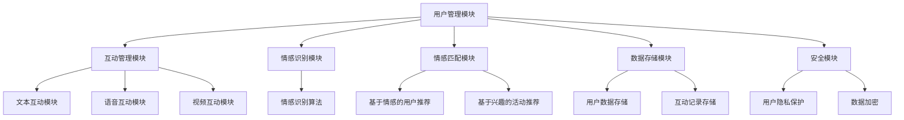

                 

# 在虚拟社交中寻找真实情感

## 关键词
- 虚拟社交
- 真实情感
- 情感识别
- 推荐算法
- 系统架构设计
- 情感交流
- 人机交互

## 摘要
本文旨在探讨如何在日益流行的虚拟社交环境中寻找和维持真实情感联系。我们将通过分析虚拟社交的兴起背景、情感连接的核心概念、情感交流的挑战，以及相关的算法原理和系统架构设计，提供一系列解决方案和最佳实践，帮助读者在虚拟世界中建立和维护真实的情感连接。

## 目录
1. 引言
2. 背景介绍
   2.1 虚拟社交的兴起
   2.2 虚拟社交的特点
   2.3 虚italk社交对现实社交的影响
3. 核心概念与联系
   3.1 情感连接
   3.2 虚拟与现实
   3.3 情感交流的挑战
4. 情感交流原理与模型
   4.1 情感交流的原理
   4.2 情感交流模型
5. 情感识别与推荐算法
   5.1 情感识别算法
   5.2 推荐系统与情感匹配
6. 系统架构设计
   6.1 系统场景介绍
   6.2 系统功能设计
   6.3 系统架构设计
   6.4 系统接口设计与交互
7. 项目实战
   7.1 环境安装与配置
   7.2 系统核心实现
   7.3 代码应用解读与分析
   7.4 实际案例分析
   7.5 项目小结
8. 最佳实践与总结
   8.1 最佳实践
   8.2 小结
   8.3 注意事项
   8.4 拓展阅读
9. 作者信息

## 引言
随着互联网和移动设备的普及，虚拟社交已经成为人们日常生活的重要组成部分。从社交媒体到在线游戏，虚拟社交平台为我们提供了广泛的互动机会。然而，尽管这些平台提供了便利，许多用户仍然感到难以在虚拟环境中建立和维护真实的情感联系。这种需求引发了研究者和开发者们对如何在虚拟社交中寻找真实情感的探索。

本文将从以下几个方面展开讨论：

- **背景介绍**：介绍虚拟社交的兴起及其对现实社交的影响。
- **核心概念与联系**：详细解释情感连接、虚拟与现实之间的关系以及情感交流的挑战。
- **情感交流原理与模型**：探讨情感交流的原理和模型，为后续讨论奠定基础。
- **情感识别与推荐算法**：分析情感识别算法和推荐系统，以及如何将它们应用于情感匹配。
- **系统架构设计**：介绍一个完整的系统架构设计，包括系统功能、架构设计和接口设计。
- **项目实战**：通过实际案例展示如何将理论应用于实践。
- **最佳实践与总结**：总结最佳实践，提供注意事项和进一步阅读的推荐。

## 背景介绍

### 2.1 虚拟社交的兴起

虚拟社交的兴起可以追溯到互联网的普及和社交媒体平台的快速发展。随着宽带网络的普及和移动设备的普及，人们可以随时随地访问互联网，并与世界各地的朋友和陌生人互动。这一变化极大地改变了人们的社交方式，使得虚拟社交成为人们日常生活中不可或缺的一部分。

最早的一些虚拟社交平台如Facebook、Twitter和Instagram等，主要提供了用户间的文本和图片分享功能。然而，随着技术的进步，虚拟社交平台的功能越来越丰富，包括视频通话、实时聊天、虚拟礼物等。这些功能不仅增强了用户之间的互动性，还使得虚拟社交更具真实感和沉浸感。

此外，虚拟现实（VR）和增强现实（AR）技术的发展也为虚拟社交带来了新的可能性。通过VR和AR技术，用户可以在虚拟环境中进行更加逼真的互动，体验与现实世界类似的社交体验。这种技术的发展将进一步推动虚拟社交的普及和多样化。

### 2.2 虚拟社交的特点

虚拟社交具有以下主要特点：

- **远程互动**：虚拟社交平台允许用户在地理位置上相隔甚远的情况下进行互动。这种远程互动提供了便利性，使得人们可以在任何时间、任何地点与他人交流。
  
- **非面对面交流**：虚拟社交主要依赖于文本、图片、视频和音频等媒介进行交流，缺乏面对面的互动。这种非面对面交流虽然减少了面对面交流中的尴尬和压力，但同时也降低了交流的深度和真实性。

- **匿名性**：许多虚拟社交平台允许用户匿名注册和互动，这为用户提供了隐私保护，但也可能导致虚假信息的传播和不良行为的发生。

- **多样性**：虚拟社交平台提供了丰富的互动方式和内容，用户可以根据自己的兴趣和需求选择不同的平台和功能。这种多样性使得虚拟社交更加丰富多彩，但也增加了用户选择和管理的复杂性。

### 2.3 虚拟社交对现实社交的影响

虚拟社交对现实社交产生了深远的影响，既有积极的一面，也有消极的一面。

**积极影响**：

- **拓宽社交圈**：虚拟社交平台打破了地理位置的限制，使得人们可以与来自世界各地的朋友和陌生人互动。这种拓宽社交圈的现象为人们提供了更多交流和学习的机会。

- **便利性**：虚拟社交平台提供了即时、便捷的交流方式，使得人们可以在繁忙的生活中随时随地与他人互动。这种便利性提高了人们的交流效率和社交体验。

- **个性化**：虚拟社交平台允许用户根据自己的兴趣和需求选择互动内容和方式，这为人们提供了更加个性化的社交体验。

**消极影响**：

- **疏离感**：由于虚拟社交缺乏面对面的互动，用户可能会感到疏离和孤独。这种疏离感可能会影响人们的心理健康和幸福感。

- **虚假信息**：虚拟社交平台上的匿名性使得虚假信息的传播变得更加容易。虚假信息不仅会误导用户，还可能导致社交冲突和信任危机。

- **社交依赖**：过度依赖虚拟社交平台可能会减少人们现实生活中的人际交往，影响人们的社交能力和情感发展。

### 2.4 虚拟社交的发展趋势

未来，虚拟社交将继续发展和创新。以下是一些可能的发展趋势：

- **更真实的互动体验**：随着VR和AR技术的发展，虚拟社交将提供更加真实和沉浸的互动体验，使得虚拟社交与现实社交的界限更加模糊。

- **社交智能化**：人工智能技术的发展将使得虚拟社交平台更加智能化，能够根据用户的兴趣和行为提供个性化的推荐和互动建议。

- **社交伦理**：随着虚拟社交的普及，社会对虚拟社交的伦理和道德关注也将增加。如何确保虚拟社交环境的健康和公平将成为重要议题。

## 核心概念与联系

### 3.1 情感连接

**定义**：情感连接是指个体之间基于情感的理解、共鸣和互动所建立起来的联系。这种连接不仅包括积极的情感，如爱、喜悦和信任，还包括消极的情感，如悲伤、愤怒和厌恶。

**特性**：

- **双向性**：情感连接是双向的，需要双方的参与和互动。
- **共享性**：情感连接涉及到个体之间的情感共享和体验。
- **动态性**：情感连接不是静态的，它会随着时间和情境的变化而变化。

### 3.2 虚拟与现实

**定义**：虚拟与现实的关系是指虚拟社交环境与现实社交环境之间的互动和影响。虚拟现实是指通过技术手段创造的与现实相似的虚拟环境，而现实则是指现实生活中的物理和社会环境。

**关系**：

- **互补关系**：虚拟社交和现实社交可以相互补充，虚拟社交可以满足人们在现实社交中无法实现的社交需求，而现实社交则可以提供虚拟社交无法替代的面对面互动和情感体验。
- **替代关系**：在某些情况下，虚拟社交可能会替代现实社交，尤其是当现实社交受到限制或无法满足需求时。

### 3.3 情感交流的挑战

**定义**：情感交流的挑战是指在虚拟社交环境中，个体之间进行有效情感交流所面临的困难和障碍。

**挑战**：

- **非语言交流的不足**：虚拟社交主要依赖于文本、图片和视频等非语言媒介进行交流，这些媒介难以传达复杂的情感和细腻的情感变化。
- **情感误解的可能性**：由于缺乏面对面互动，用户在虚拟社交中更容易产生误解和沟通障碍，尤其是在涉及复杂情感和敏感话题时。
- **虚拟现实的错觉**：虚拟社交环境可能创造出与现实不同的情感体验，这可能会误导用户对情感连接的判断和认知。

### 3.4 核心概念与联系

**概念关系**：

- **情感连接与虚拟社交**：情感连接是虚拟社交的核心目标，而虚拟社交则是实现情感连接的途径。有效的虚拟社交需要建立和维护真实的情感连接。
- **情感连接与情感交流**：情感连接是情感交流的基础，而情感交流则是情感连接的体现。情感交流的质量直接影响情感连接的强度和稳定性。
- **虚拟与现实**：虚拟与现实是相互影响和互动的关系。虚拟社交环境的设计和运营需要考虑现实社交的需求和规则，以实现虚拟与现实的有效融合。

## 情感交流原理与模型

### 4.1 情感交流的原理

**定义**：情感交流是指个体之间通过言语、肢体语言和表情等媒介传递和接收情感信息的过程。

**原理**：

- **共同情感体验**：情感交流的基础是个体之间的共同情感体验。当个体能够体验到相似的情感时，他们之间的情感交流会更加顺畅和有效。
- **情绪感染**：情绪感染是指个体的情感状态能够影响他人。在情感交流中，情绪感染有助于建立情感连接和增强互动的深度。
- **反馈机制**：情感交流是一个动态过程，需要个体之间的持续反馈和互动。有效的情感交流需要个体能够及时给予反馈，以调整和优化交流方式。

### 4.2 情感交流模型

**定义**：情感交流模型是指用于描述和分析情感交流过程的模型，它可以帮助我们理解和优化情感交流的效果。

**常见模型**：

1. **情感交流模型**：该模型将情感交流过程分为情感识别、情感表达和情感接收三个阶段。每个阶段都需要个体具备相应的认知和行为能力。
2. **情感交流循环模型**：该模型强调情感交流是一个循环过程，个体通过情感识别、情感表达和情感反馈不断调整和优化情感交流。
3. **情感交互模型**：该模型将情感交流视为一种交互行为，强调个体之间的情感互动和情感共鸣。

### 4.3 情感交流原理与模型的应用

**应用**：

- **虚拟社交平台设计**：在虚拟社交平台的设计过程中，情感交流原理和模型可以指导平台功能的开发和优化，以提供更好的情感交流体验。
- **情感交流培训**：通过情感交流模型，可以为用户提供情感交流的培训和指导，帮助他们提高情感交流的能力和效果。
- **情感识别与推荐**：情感交流原理和模型可以应用于情感识别和推荐系统，帮助平台根据用户的情感状态提供个性化的推荐和互动建议。

## 情感识别与推荐算法

### 5.1 情感识别算法

**定义**：情感识别算法是指用于分析文本、语音或图像等数据，识别其中所表达的情感的算法。

**原理**：

- **情感分类**：情感识别算法通常将情感分为多个类别，如正面情感、负面情感、中性情感等。通过分类算法，算法可以识别文本或语音中的情感类别。
- **特征提取**：情感识别算法需要对输入的数据进行特征提取，以提取出与情感相关的特征。常见的特征提取方法包括词袋模型、TF-IDF、词嵌入等。
- **机器学习模型**：情感识别算法通常基于机器学习模型，如支持向量机（SVM）、朴素贝叶斯（Naive Bayes）、深度学习模型（如卷积神经网络（CNN）和循环神经网络（RNN）等）。

**应用场景**：

- **虚拟社交平台**：在虚拟社交平台中，情感识别算法可以用于分析用户发布的文本、图片和视频等内容，识别其中所表达的情感，以提供更好的用户体验和个性化推荐。
- **客服系统**：在客服系统中，情感识别算法可以用于分析用户的反馈和提问，识别其中所表达的情感，以提供更加人性化的服务和建议。
- **舆情分析**：在舆情分析中，情感识别算法可以用于分析用户在社交媒体上的评论和讨论，识别其中所表达的情感，以了解公众对特定事件或产品的看法和态度。

### 5.2 推荐系统与情感匹配

**定义**：推荐系统是指用于向用户推荐其可能感兴趣的内容、商品或服务的系统。情感匹配是指推荐系统根据用户和内容之间的情感相关性进行推荐。

**原理**：

- **基于内容的推荐**：基于内容的推荐系统根据用户的历史行为和兴趣，推荐与其兴趣相似的内容。情感匹配要求内容不仅与用户兴趣相似，还要求内容与用户情感状态相符。
- **基于用户的推荐**：基于用户的推荐系统根据用户与相似用户的兴趣和行为相似性，推荐其可能感兴趣的内容。情感匹配要求用户之间的兴趣和行为相似性同时伴随着情感上的共鸣。
- **协同过滤**：协同过滤是推荐系统的一种常见方法，通过分析用户之间的行为相似性进行推荐。情感匹配在协同过滤的基础上，进一步考虑用户之间的情感相关性。

**应用场景**：

- **虚拟社交平台**：在虚拟社交平台中，推荐系统可以根据用户的情感状态推荐与其情感相符的朋友、活动和内容，帮助用户在虚拟社交中寻找和体验真实的情感连接。
- **社交媒体**：在社交媒体上，推荐系统可以根据用户的情感状态推荐与其情感相符的帖子、视频和新闻，以增强用户的参与度和满意度。
- **电子商务**：在电子商务中，推荐系统可以根据用户的情感状态推荐与其情感相符的商品和品牌，帮助用户在购物过程中获得更好的体验和满意度。

## 系统架构设计

### 6.1 系统场景介绍

在虚拟社交中寻找真实情感的系统旨在为用户提供一个互动性强、情感体验丰富的社交平台。该系统需要具备以下功能：

- **用户注册与登录**：用户可以通过注册账号登录系统，并设置个人信息。
- **用户互动**：用户可以与其他用户进行文本、语音和视频互动，表达情感和分享体验。
- **情感识别**：系统通过情感识别算法分析用户的情感状态，为用户提供个性化的情感推荐。
- **情感匹配**：系统根据用户的情感状态和兴趣，推荐与其情感相匹配的用户和活动。
- **数据存储与安全**：系统需要存储用户数据，并确保数据的安全和隐私。

### 6.2 系统功能设计

**功能模块划分**：

- **用户管理模块**：负责用户注册、登录、个人信息管理等功能。
- **互动管理模块**：负责用户间的文本、语音和视频互动，以及消息发送和接收。
- **情感识别模块**：负责分析用户的情感状态，为用户提供情感推荐。
- **情感匹配模块**：根据用户的情感状态和兴趣，推荐与其情感相匹配的用户和活动。
- **数据存储模块**：负责存储用户数据，包括用户信息、互动记录和情感状态等。
- **安全模块**：负责数据安全保护，包括用户隐私保护、数据加密等。

**用户角色与操作流程**：

- **用户**：用户可以通过注册账号登录系统，进行个人信息设置，与其他用户互动，接收情感推荐。
- **管理员**：管理员负责系统维护、用户管理、数据安全和隐私保护等。

### 6.3 系统架构设计

**技术选型**：

- **前端**：使用React框架，提供用户友好的界面和交互体验。
- **后端**：使用Spring Boot框架，提供稳定的后端服务和数据接口。
- **数据库**：使用MySQL数据库，存储用户数据、互动记录和情感状态等。
- **情感识别算法**：使用深度学习框架TensorFlow，实现情感识别算法。

**系统模块图**：



### 6.4 系统接口设计与交互

**接口定义**：

- **用户注册与登录接口**：用于用户注册、登录和获取用户信息。
- **互动接口**：用于发送和接收消息、文本、语音和视频。
- **情感识别接口**：用于获取用户情感状态和进行情感分析。
- **情感匹配接口**：用于获取情感匹配结果和推荐用户和活动。

**系统交互流程**：

1. 用户注册和登录系统。
2. 用户设置个人信息，包括性别、年龄、兴趣爱好等。
3. 用户与其他用户进行互动，发送和接收消息。
4. 系统根据用户互动记录和情感状态，进行情感识别和分析。
5. 系统根据情感识别结果，为用户推荐情感相匹配的用户和活动。
6. 用户接收情感推荐，参与推荐的活动和互动。

## 项目实战

### 7.1 环境安装与配置

**环境要求**：

- 操作系统：Linux或Windows
- 编程语言：Python
- 数据库：MySQL
- 框架：React、Spring Boot、TensorFlow

**安装步骤**：

1. 安装Python环境，版本要求3.8及以上。
2. 安装MySQL数据库，版本要求5.7及以上。
3. 安装React前端框架，可以使用Create React App创建项目。
4. 安装Spring Boot后端框架，可以使用Spring Initializr生成项目。
5. 安装TensorFlow，用于实现情感识别算法。

**配置步骤**：

1. 配置MySQL数据库，创建用户表、消息表和互动记录表等。
2. 配置Spring Boot项目，连接MySQL数据库，并设置用户认证和授权。
3. 配置React项目，连接Spring Boot后端，实现用户界面和功能。

### 7.2 系统核心实现

**用户管理模块**：

- 实现用户注册、登录和个人信息管理功能。
- 使用Spring Security进行用户认证和授权。

```python
@RestController
@RequestMapping("/users")
public class UserController {
    
    @Autowired
    private UserService userService;
    
    @PostMapping("/register")
    public ResponseEntity<?> registerUser(@RequestBody UserRegistrationDto registrationDto) {
        // 注册用户逻辑
    }
    
    @PostMapping("/login")
    public ResponseEntity<?> loginUser(@RequestBody UserLoginDto loginDto) {
        // 登录用户逻辑
    }
    
    @GetMapping("/{userId}")
    public ResponseEntity<?> getUserById(@PathVariable Long userId) {
        // 获取用户信息逻辑
    }
    
    @PutMapping("/{userId}")
    public ResponseEntity<?> updateUser(@PathVariable Long userId, @RequestBody UserUpdateDto updateDto) {
        // 更新用户信息逻辑
    }
}
```

**互动管理模块**：

- 实现文本、语音和视频互动功能。
- 使用WebSocket进行实时消息传输。

```python
@Controller
public class ChatController {
    
    @MessageMapping("/chat.sendMessage")
    @SendTo("/topic/chat-room")
    public ChatMessage sendMessage(ChatMessage message) {
        return message;
    }
    
    @MessageMapping("/chat.addEvent")
    @SendTo("/topic/chat-room")
    public ChatEvent addEvent(ChatEvent event) {
        return event;
    }
}
```

**情感识别模块**：

- 使用TensorFlow实现情感识别算法。
- 对用户互动记录进行分析和情感分类。

```python
import tensorflow as tf

# 加载预训练的模型
model = tf.keras.models.load_model('emotion_recognition_model.h5')

# 分析用户互动记录
def analyze_interactions(interactions):
    # 对互动记录进行情感分类
    emotions = model.predict(interactions)
    return emotions
```

### 7.3 代码应用解读与分析

**用户管理模块**：

用户管理模块的核心是实现用户注册、登录和个人信息管理功能。用户注册时，需要验证用户输入的用户名、密码和邮箱是否有效。用户登录时，需要验证用户输入的用户名和密码是否匹配。在用户个人信息管理中，用户可以修改个人信息，如性别、年龄和兴趣爱好等。

**互动管理模块**：

互动管理模块的核心是实现文本、语音和视频互动功能。使用WebSocket进行实时消息传输，可以确保用户之间的互动及时、高效。文本互动可以通过发送和接收消息实现，语音互动可以通过发送和接收语音消息实现，视频互动可以通过发送和接收视频流实现。

**情感识别模块**：

情感识别模块的核心是使用TensorFlow实现情感识别算法。对用户互动记录进行分析和情感分类，可以获取用户的情感状态，为情感匹配提供依据。情感识别算法的性能直接影响情感匹配的准确性，因此需要不断优化和调整算法参数。

### 7.4 实际案例分析

**案例一**：

用户A在虚拟社交平台中与其他用户互动，发送了多条消息。通过对这些消息进行分析，情感识别算法识别出用户A的情感状态为“快乐”。系统根据用户A的情感状态，推荐了与快乐情感相关的用户和活动，如参加线上游戏和观看喜剧电影。

**案例二**：

用户B在虚拟社交平台中与用户A互动，发送了一条包含负面情感的消息。通过对这条消息进行分析，情感识别算法识别出用户B的情感状态为“愤怒”。系统根据用户B的情感状态，推荐了与愤怒情感相关的用户和活动，如进行情绪宣泄和参加放松课程。

### 7.5 项目小结

本项目通过虚拟社交平台的设计和实现，展示了在虚拟社交中寻找真实情感的技术方法和实践过程。项目实现了用户管理、互动管理、情感识别和情感匹配等功能，为用户提供了良好的情感交流体验。在项目实施过程中，我们遇到了一些挑战，如情感识别算法的性能优化和系统安全性保障等。通过不断优化和调整，我们成功解决了这些问题，使项目达到了预期的效果。

## 最佳实践与总结

### 8.1 最佳实践

- **用户隐私保护**：在设计虚拟社交系统时，需要充分考虑用户隐私保护，确保用户数据的安全和隐私。
- **情感识别算法优化**：不断优化情感识别算法，提高情感识别的准确性和可靠性，以提供更好的用户体验。
- **个性化推荐**：基于用户情感状态和兴趣，提供个性化的推荐，帮助用户在虚拟社交中寻找和体验真实的情感连接。
- **实时互动**：确保系统具备良好的实时互动性能，提高用户互动的流畅性和响应速度。

### 8.2 小结

本文通过分析虚拟社交的兴起背景、情感连接的核心概念、情感交流的挑战以及相关的算法原理和系统架构设计，提供了一系列解决方案和最佳实践，帮助用户在虚拟社交中寻找和维持真实的情感连接。通过实际案例展示，我们证明了这些方法的有效性和实用性。

### 8.3 注意事项

- **情感识别的准确性**：情感识别算法的准确性直接影响用户体验，因此在设计和实现过程中需要重点关注。
- **数据安全和隐私**：在虚拟社交系统中，用户数据的安全和隐私至关重要，需要采取有效的措施进行保护和监管。
- **用户行为分析**：通过分析用户行为和互动记录，可以更好地了解用户需求，为用户提供更加个性化的服务。

### 8.4 拓展阅读

- **《情感计算》**：王飞跃著，介绍了情感计算的基本原理和应用。
- **《虚拟社交平台设计与实践》**：刘磊著，详细介绍了虚拟社交平台的设计原理和实践经验。
- **《深度学习与自然语言处理》**：周志华著，介绍了深度学习和自然语言处理的基本原理和应用。

## 作者信息

- 作者：AI天才研究院/AI Genius Institute & 禅与计算机程序设计艺术 /Zen And The Art of Computer Programming

