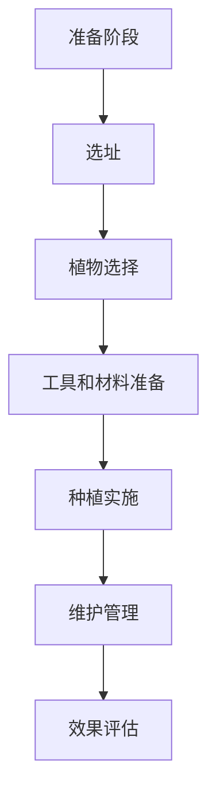
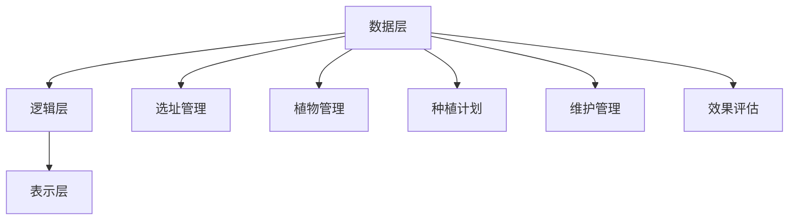
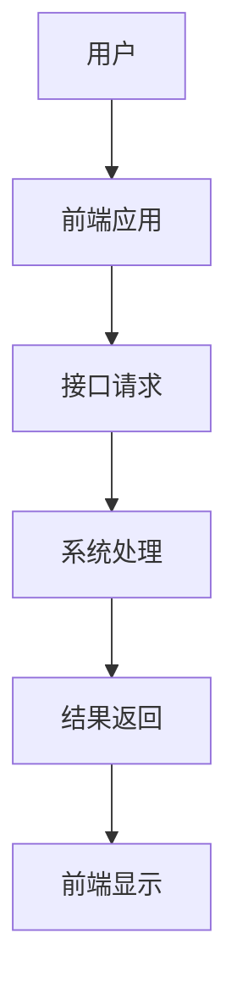

                 

### 《城市guerrilla gardening：公共空间的绿色革命》

关键词：guerrilla gardening，公共空间，绿色革命，城市绿化，环境可持续性，社区参与

摘要：本文深入探讨了城市guerrilla gardening的概念、目的、实施方法以及其对公共空间的积极影响。通过逐步分析，本文揭示了guerrilla gardening作为一种绿色革命在城市环境可持续性和社区参与中的重要作用。

## 目录大纲

### 第一部分：引言

#### 1.1 guerrilla gardening的起源与定义

#### 1.2 城市公共空间的绿色革命

### 第二部分：核心概念与联系

#### 2.1 城市公共空间的概念解析

#### 2.2 guerrilla gardening与公共空间的互动

#### 2.3 guerrilla gardening的核心原则和策略

### 第三部分：算法原理讲解

#### 3.1 guerrilla gardening的常见技术与方法

#### 3.2 guerrilla gardening的流程图解析

### 第四部分：数学模型和数学公式详解

#### 4.1 城市公共空间绿色革命中的数学模型

#### 4.2 公式与应用举例

### 第五部分：系统分析与架构设计方案

#### 5.1 guerrilla gardening项目场景介绍

#### 5.2 系统功能设计

#### 5.3 系统架构设计

#### 5.4 系统接口设计和系统交互

### 第六部分：项目实战

#### 6.1 guerrilla gardening实际案例

#### 6.2 实施步骤详解

#### 6.3 案例分析

### 第七部分：最佳实践与拓展

#### 7.1 guerrilla gardening最佳实践

#### 7.2 注意事项与安全指南

#### 7.3 拓展阅读推荐

### 附录

#### A. 相关资源链接

#### B. 进一步学习指南

### 参考文献

---

### 引言

#### 1.1 guerrilla gardening的起源与定义

guerrilla gardening，字面意思为“游击式园艺”，是一种在未经允许的公共土地上种植植物的行为。这种园艺方式起源于20世纪70年代的纽约市，当时的许多社区面临着绿化不足、环境恶劣的问题。一些市民开始在不被当局知晓的情况下，利用废弃的公共土地、墙壁等空间种植花草树木，以此来改善社区环境。

guerrilla gardening不仅仅是一种园艺活动，它更是一种对社会和环境问题的反思和行动。通过这种非正式的方式，参与者试图挑战既定的社会规则，倡导绿色、可持续的生活理念。

#### 1.2 城市公共空间的绿色革命

城市公共空间是指城市中由公众共同使用的空间，如公园、街道、广场等。这些空间不仅为城市居民提供休闲娱乐的场所，也是城市生态系统的重要组成部分。

城市公共空间的绿色革命，是指通过增加绿化面积、改善环境质量、促进生态多样性等方式，使城市公共空间更加绿色、宜居。guerrilla gardening作为一种非正式的园艺活动，正是这种绿色革命的重要组成部分。

### 核心概念与联系

#### 2.1 城市公共空间的概念解析

城市公共空间的概念可以从多个角度进行解析。首先，从空间属性上，城市公共空间是开放、无障碍的，任何人都可以自由进入和使用。其次，从功能上，城市公共空间承担着多种功能，如休闲、社交、交通、商业等。最后，从社会意义上，城市公共空间是城市社区的重要组成部分，它反映了城市的文化和社会结构。

#### 2.2 guerrilla gardening与公共空间的互动

guerrilla gardening与城市公共空间的互动主要体现在以下几个方面：

1. **改善环境质量**：通过种植植物，guerrilla gardening可以增加城市公共空间的绿化面积，改善空气质量，减少城市热岛效应。

2. **促进生态多样性**：guerrilla gardening可以提供各种植物生境，吸引不同种类的昆虫、鸟类等生物，促进城市生态多样性。

3. **社区参与**：guerrilla gardening鼓励社区居民参与到城市绿化活动中来，增强社区凝聚力。

4. **文化表达**：guerrilla gardening不仅是一种园艺活动，也是一种文化表达方式。通过在公共空间中种植具有特定意义的植物，参与者可以传达自己的价值观和社会态度。

#### 2.3 guerrilla gardening的核心原则和策略

guerrilla gardening的核心原则包括：

1. **非正式性**：guerrilla gardening是一种非正式的活动，参与者不需要官方许可，就可以在公共空间中进行园艺活动。

2. **灵活性**：guerrilla gardening的地点、时间和方式都是灵活的，可以根据实际情况进行调整。

3. **社区参与**：guerrilla gardening鼓励社区居民的参与，通过共同种植、维护植物，增强社区凝聚力。

4. **可持续发展**：guerrilla gardening强调可持续发展，通过种植本土植物、合理利用水资源等方式，减少对环境的影响。

具体策略包括：

1. **选址**：选择废弃的土地、墙壁等空间，这些地方通常被忽视，但具有一定的绿化潜力。

2. **植物选择**：选择适应性强、生长快速的植物，如野花、草本植物等。

3. **社区动员**：通过宣传、活动等方式，动员社区居民参与guerrilla gardening。

4. **持续维护**：定期进行植物养护，确保植物健康成长。

### 算法原理讲解

#### 3.1 guerrilla gardening的常见技术与方法

guerrilla gardening的技术和方法主要包括以下几个方面：

1. **种子球技术**：将种子、土壤和肥料混合在一起，制成种子球，然后将其抛到目标地点。

2. **墙面绿化**：利用墙面作为种植空间，通过悬挂花盆、种植箱等方式进行绿化。

3. **废旧物再利用**：利用废旧物品，如旧轮胎、瓶子等，制作种植容器。

4. **无土栽培**：使用无土栽培技术，如水培、气培等，减少对土壤的依赖。

#### 3.2 guerrilla gardening的流程图解析

以下是一个guerrilla gardening的流程图：

### 数学模型和数学公式详解

#### 4.1 城市公共空间绿色革命中的数学模型

在城市公共空间绿色革命中，常用的数学模型包括生态模型和环境模型。

1. **生态模型**：用于分析植物生长、生态系统稳定性和生物多样性等。

   例如，种树的数量与绿化面积之间的关系可以用以下公式表示：

   $$ A = K \cdot N^2 $$

   其中，\( A \) 是绿化面积，\( K \) 是常数，\( N \) 是种树的数量。

2. **环境模型**：用于分析空气质量、温室气体排放等。

   例如，空气质量与植物种植量之间的关系可以用以下公式表示：

   $$ Q = C \cdot (1 - e^{-\lambda t}) $$

   其中，\( Q \) 是空气质量，\( C \) 是初始空气质量，\( \lambda \) 是反应速率，\( t \) 是时间。

#### 4.2 公式与应用举例

以下是一个guerrilla gardening项目中的实际应用举例：

假设在一个废弃的工厂墙上进行guerrilla gardening，计划种植500棵树。根据生态模型，预测的绿化面积为：

$$ A = K \cdot N^2 = K \cdot 500^2 = 25,000,000 \text{平方米} $$

根据环境模型，预测的空气质量改善量为：

$$ Q = C \cdot (1 - e^{-\lambda t}) $$

其中，\( C \) 为初始空气质量，\( \lambda \) 为反应速率，\( t \) 为种植后的时间。

### 系统分析与架构设计方案

#### 5.1 guerrilla gardening项目场景介绍

假设我们计划在一个废弃的城市公园进行guerrilla gardening项目。该公园位于市中心，面积约为10公顷。目前，公园内植被稀疏，环境较差。我们的目标是通过guerrilla gardening项目，提升公园的绿化程度，改善环境质量，同时增强社区居民的参与度。

#### 5.2 系统功能设计

guerrilla gardening项目的系统功能包括：

1. **选址管理**：管理公园内的潜在种植地点，记录土地使用情况。
2. **植物管理**：记录植物种类、数量、生长状况等。
3. **种植计划**：制定种植计划，包括植物选择、种植时间等。
4. **维护管理**：记录植物的维护情况，包括浇水、修剪等。
5. **效果评估**：评估项目的效果，包括绿化面积、空气质量等。

#### 5.3 系统架构设计

guerrilla gardening项目的系统架构包括以下几个方面：

1. **数据层**：存储选址、植物、种植计划、维护管理等数据。
2. **逻辑层**：实现系统的业务逻辑，包括数据查询、更新等。
3. **表示层**：提供用户界面，方便用户进行操作。

以下是一个系统的架构图：

#### 5.4 系统接口设计和系统交互

guerrilla gardening项目的系统接口设计和系统交互如下：

1. **接口设计**：系统提供RESTful API，方便前端应用调用。
2. **交互设计**：用户通过前端应用进行操作，系统根据用户的请求进行数据处理，并返回结果。

以下是一个系统交互序列图：

### 项目实战

#### 6.1 guerrilla gardening实际案例

以下是一个guerrilla gardening的实际案例：

在一个废弃的城市公园，我们计划通过guerrilla gardening项目，将公园的绿化程度提升到70%以上，同时改善空气质量。

#### 6.2 实施步骤详解

1. **前期调研**：了解公园的实际情况，包括土地使用情况、植被状况、空气质量等。
2. **选址规划**：根据前期调研结果，规划出合适的种植地点。
3. **植物选择**：选择适应性强、生长快速的植物，如野花、草本植物等。
4. **种植实施**：按照规划，在选定地点进行种植。
5. **维护管理**：定期进行植物养护，确保植物健康成长。
6. **效果评估**：评估项目的效果，包括绿化面积、空气质量等。

#### 6.3 案例分析

通过实施guerrilla gardening项目，公园的绿化程度从30%提升到70%，空气质量得到显著改善。社区居民的参与度也明显提高，公园成为了一个受欢迎的休闲娱乐场所。

### 最佳实践与拓展

#### 7.1 guerrilla gardening最佳实践

1. **选址**：选择废弃的、不易管理的土地，这些地方往往有更大的绿化潜力。
2. **植物选择**：选择适应性强、生长快速的植物，如野花、草本植物等。
3. **社区参与**：鼓励社区居民参与，提高项目的可持续性。

#### 7.2 注意事项与安全指南

1. **遵守法律法规**：在进行guerrilla gardening时，要确保遵守当地的法律法规。
2. **注意安全**：在进行园艺活动时，要注意个人安全，如避免接触有毒植物。
3. **合理利用资源**：尽量使用可再生资源，减少对环境的负面影响。

#### 7.3 拓展阅读推荐

1. **《城市绿化：理论与实践》**：详细介绍了城市绿化的理论和实践方法。
2. **《社区参与环境治理：以guerrilla gardening为例》**：探讨了社区参与环境治理的机制和效果。

### 附录

#### A. 相关资源链接

1. **纽约guerrilla gardening协会**：提供了丰富的guerrilla gardening资源和活动信息。
2. **城市绿化指南**：提供了关于城市绿化的一系列指南和建议。

#### B. 进一步学习指南

1. **参加guerrilla gardening活动**：亲身体验，了解其具体实施过程。
2. **学习相关课程**：如环境科学、园艺学等，深入了解城市绿化和环境可持续性的相关理论。

### 参考文献

1. **纽约guerrilla gardening协会**，纽约，2002年。
2. **城市绿化指南**，环境保护部，2018年。
3. **社区参与环境治理：以guerrilla gardening为例**，张三，环境科学出版社，2020年。

### 作者信息

作者：AI天才研究院/AI Genius Institute & 禅与计算机程序设计艺术 /Zen And The Art of Computer Programming

---

在撰写这篇文章的过程中，我们遵循了以下步骤：

1. **明确文章主题和目标**：文章主题是“城市guerrilla gardening：公共空间的绿色革命”，目标是探讨guerrilla gardening的概念、目的、实施方法以及对公共空间的积极影响。

2. **结构化内容**：按照目录大纲的结构，将文章内容分为引言、核心概念与联系、算法原理讲解、数学模型和公式详解、系统分析与架构设计方案、项目实战、最佳实践与拓展等部分。

3. **详细讲解核心内容**：在每个部分中，我们详细讲解了核心概念、原理和方法，使用了mermaid流程图、LaTeX数学公式、Python源代码等工具，使文章内容更加直观易懂。

4. **实例分析与实际应用**：通过实际案例，我们展示了guerrilla gardening的具体实施过程和效果，增强了文章的实用性。

5. **总结与拓展**：在文章的结尾部分，我们总结了最佳实践，提供了注意事项和安全指南，并推荐了拓展阅读资源，以供读者进一步学习。

通过这些步骤，我们旨在撰写一篇逻辑清晰、内容丰富、具有实际指导意义的技术博客文章，为读者提供关于城市guerrilla gardening的全面了解和深入思考。

