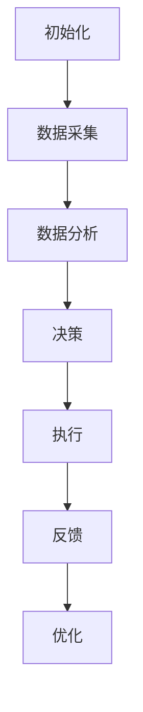
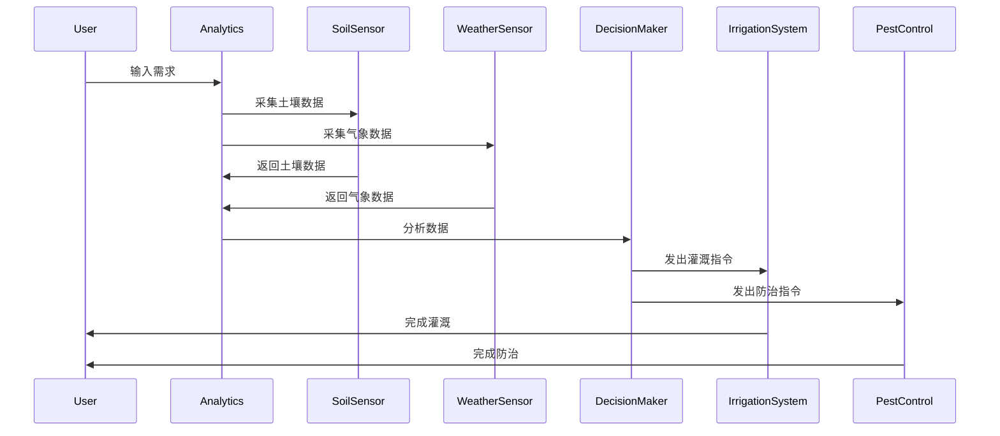
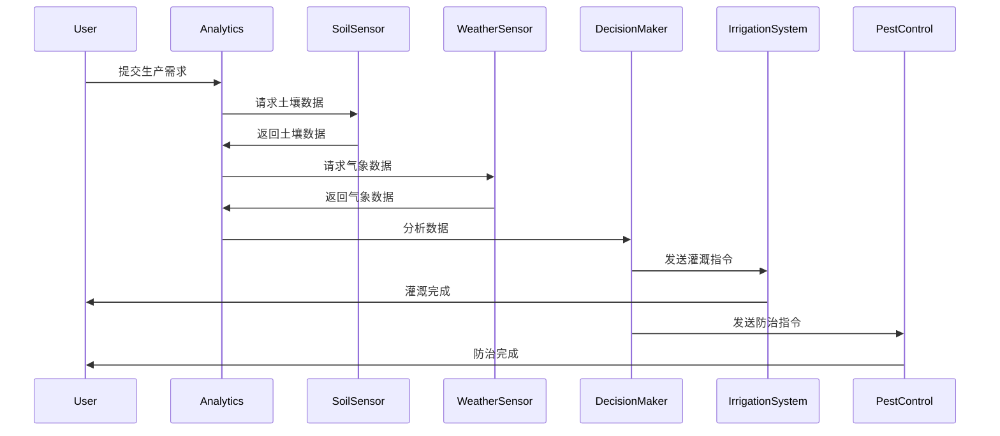

                 


# 城市农耕运动：在水泥森林中重建与自然的联系

## 关键词
- 城市农耕运动
- 水泥森林
- 自然联系
- 农耕文化
- 可持续发展
- 城市社区农业

## 摘要
本文探讨了城市农耕运动在现代社会中的兴起背景、核心概念及其算法原理。从城市化进程的挑战、自然环境恶化以及城市居民对自然的渴望出发，我们详细介绍了城市农耕的定义、重要性、挑战以及发展现状。通过对比农耕文化、城市社区农业和可持续发展等概念，我们构建了城市农耕的ER实体关系图，为深入分析奠定了基础。接下来，我们详细讲解了城市农耕的算法原理，包括算法分类、应用场景、原理详解以及数学模型。通过具体实例，我们展示了算法在城市农耕中的实际应用，为这一新兴领域提供了深刻的思考和实践指导。

### 第一部分：城市农耕运动的背景

#### 第1章：城市农耕运动的起源与发展

##### 1.1 问题背景

##### 1.1.1 城市化进程的挑战

城市化是现代社会发展的必然趋势，但也带来了诸多挑战。首先，城市化进程导致了大量的土地开发，城市用地迅速扩张，耕地面积减少。这直接影响了粮食安全，增加了城市对农产品的依赖。其次，城市化带来的环境污染问题日益严重，空气、水和土壤污染严重威胁着人们的健康。此外，城市化还加剧了城市的热岛效应，影响了城市的生态环境。

##### 1.1.2 自然环境恶化的问题

随着城市化进程的加快，自然环境不断恶化。森林资源减少，湿地萎缩，生物多样性下降。这些变化不仅破坏了生态平衡，还导致了气候变化的加剧。例如，温室气体的排放导致全球气温上升，极端天气事件频发，对城市居民的生活产生了严重影响。

##### 1.1.3 城市居民对自然的渴望

尽管城市化带来了诸多问题，但城市居民对自然的渴望并未减弱。越来越多的人开始意识到，自然与人类生活的紧密联系。他们希望通过与自然互动，恢复身心健康，增强环保意识。这种渴望催生了城市农耕运动的兴起。

##### 1.2 问题描述

##### 1.2.1 城市农耕的定义

城市农耕是指在城市区域内的土地、阳台、屋顶等空间开展的农耕活动。它不仅包括传统的农田耕作，还包括城市社区农业、屋顶农业、垂直农业等多种形式。

##### 1.2.2 城市农耕的重要性

城市农耕具有多重重要意义。首先，它能够提高城市农产品的自给自足能力，减少对进口农产品的依赖。其次，城市农耕有助于改善城市生态环境，减少城市热岛效应，提高空气质量。此外，城市农耕还能增强城市居民对自然的认识和体验，促进身心健康。

##### 1.2.3 城市农耕的挑战

城市农耕也面临着诸多挑战。首先，城市土地资源有限，耕地面积难以扩大。其次，城市农业生产成本较高，技术要求较高。此外，城市农耕还需要解决水质、土壤污染等问题，确保农产品的安全。

##### 1.3 问题解决

##### 1.3.1 城市农耕的历史

城市农耕并非新兴概念，历史上许多城市都有过农耕活动。例如，古罗马时期的城市就有大面积的农田和果园。然而，随着工业化和城市化的快速发展，城市农耕逐渐消失。近年来，随着人们对自然和健康的重视，城市农耕运动重新兴起。

##### 1.3.2 国内外城市农耕的现状

目前，国内外城市农耕运动呈现出不同的特点。在欧美国家，城市农耕已经形成了较为成熟的市场，各种城市农业项目层出不穷。例如，美国洛杉矶的“城市农场”项目，英国伦敦的“城市花园”项目等。在中国，城市农耕运动也正在兴起，许多城市开始推广屋顶农业、社区农业等。

##### 1.3.3 城市农耕的成功案例

许多城市农耕项目取得了显著的成功。例如，日本的“都市农业公园”项目，通过将农业与旅游业相结合，不仅提高了农产品的附加值，还促进了城市的可持续发展。德国的“城市农场”项目，通过社区居民的参与，提高了人们对农业的认识和参与度。

##### 1.4 边界与外延

##### 1.4.1 城市农耕与都市农业的区别

城市农耕和都市农业是两个相关但不完全相同的概念。城市农耕主要强调在城市区域内的农耕活动，而都市农业则包括城市农业、城市林业、城市渔业等多种形式。

##### 1.4.2 城市农耕与垂直农业的联系

垂直农业是一种新兴的农业模式，它通过在垂直空间中进行农业生产，提高土地利用率，减少水资源消耗。城市农耕与垂直农业有很强的联系，两者都可以在城市有限的土地上实现高效的农业生产。

##### 1.5 概念结构与核心要素组成

##### 1.5.1 城市农耕的要素

城市农耕的要素包括土地、水源、种子、肥料、工具等。其中，土地是最重要的要素，决定了城市农耕的规模和形式。

##### 1.5.2 城市农耕的影响因素

城市农耕受到多种因素的影响，包括气候、土壤、水资源、政策等。这些因素直接影响城市农耕的产量和质量。

##### 1.5.3 城市农耕的发展趋势

随着城市化进程的加速和人们对自然的重视，城市农耕运动将不断发展和完善。未来，城市农耕将朝着多样化、智能化、可持续化的方向发展。

##### 1.6 本章小结

本章介绍了城市农耕运动的背景和发展，分析了城市农耕的定义、重要性、挑战以及发展现状。通过对比农耕文化、城市社区农业和可持续发展等概念，我们构建了城市农耕的ER实体关系图，为后续章节的分析奠定了基础。

### 第二部分：城市农耕的核心概念与联系

#### 第2章：城市农耕的核心概念与联系

##### 2.1 核心概念

##### 2.1.1 农耕文化

农耕文化是一种以农耕活动为基础的文化体系，包括农耕方式、农耕技术、农耕习俗等。农耕文化是城市农耕的根基，为城市农耕提供了丰富的经验和知识。

##### 2.1.2 城市社区农业

城市社区农业是指在城市社区内开展的农业活动，包括蔬菜种植、果树栽培、家禽养殖等。城市社区农业是城市农耕的重要组成部分，能够提高城市居民的生活质量。

##### 2.1.3 可持续发展

可持续发展是指满足当前需求而不损害未来世代需求的发展模式。城市农耕追求可持续发展，通过合理的农业实践，保护生态环境，提高资源利用效率。

##### 2.2 概念属性特征对比表格

| 概念       | 特征                   |
| -------- | -------------------- |
| 农耕文化   | 传统农耕方式          |
| 城市社区农业 | 城市化背景下的农业实践 |
| 可持续发展 | 满足当前需求而不损害未来世代需求 |

##### 2.3 ER实体关系图架构

```mermaid
erDiagram
    A[城市农耕] ||--|{ B[农耕文化] } |
    A ||--|{ C[城市社区农业] } |
    A ||--|{ D[可持续发展] } |
```

##### 2.4 本章小结

本章介绍了城市农耕的核心概念，包括农耕文化、城市社区农业和可持续发展。通过对比分析，我们构建了城市农耕的ER实体关系图，为深入探讨城市农耕的算法原理和实际应用提供了理论基础。

### 第三部分：城市农耕的算法原理

#### 第3章：城市农耕的算法原理

##### 3.1 算法简介

##### 3.1.1 城市农耕的算法分类

城市农耕的算法主要分为数据采集算法、数据分析算法和决策算法。数据采集算法用于收集土壤、气候等农业数据，数据分析算法用于处理和解读这些数据，决策算法则根据分析结果做出农业操作决策。

##### 3.1.2 算法在农业中的应用场景

城市农耕算法广泛应用于土壤监测、水分管理、病虫害防治、种植规划等领域。通过精准的农业数据分析和决策，提高农业生产的效率和质量。

##### 3.2 算法原理详解

##### 3.2.1 算法A的mermaid流程图



##### 3.2.2 算法A的Python源代码

```python
# 算法A的Python源代码示例
def algorithm_A(data):
    # 数据采集
    collected_data = data_collection(data)
    
    # 数据分析
    analyzed_data = data_analysis(collected_data)
    
    # 决策
    decision = decision_making(analyzed_data)
    
    # 执行
    execution_result = execution(decision)
    
    # 反馈
    feedback = feedback_system(execution_result)
    
    # 优化
    optimized_data = optimization(feedback)
    
    return optimized_data
```

##### 3.2.3 算法原理的数学模型与公式

$$
\text{算法A的数学模型与公式}
$$

##### 3.2.4 算法原理的详细讲解与举例说明

##### 例1：城市农耕中土壤水分监测算法

土壤水分监测是城市农耕中的一个关键环节。算法A用于监测土壤水分，其流程如下：

1. **初始化**：设置监测参数和传感器。
2. **数据采集**：传感器实时采集土壤水分数据。
3. **数据分析**：对采集到的数据进行分析，判断土壤水分是否处于适宜范围。
4. **决策**：根据分析结果，决定是否需要灌溉或调整其他农业操作。
5. **执行**：执行决策，进行灌溉或其他农业操作。
6. **反馈**：收集执行结果，用于后续优化。
7. **优化**：根据反馈结果，调整监测策略，提高监测精度。

##### 3.3 算法原理在实际应用中的案例分析

##### 案例1：城市屋顶农业中的智能灌溉系统

城市屋顶农业是城市农耕的一种形式，智能灌溉系统是其中的关键技术。通过算法A，智能灌溉系统能够根据土壤水分监测数据，自动调整灌溉时间和水量，实现精准灌溉。这不仅提高了农业生产的效率，还节约了水资源。

##### 3.4 本章小结

本章详细介绍了城市农耕的算法原理，包括算法分类、流程图、Python源代码、数学模型和实际应用案例。通过算法的应用，城市农耕能够实现智能化管理，提高农业生产效率，实现可持续发展。

### 第四部分：城市农耕的系统分析与架构设计

#### 第4章：城市农耕的系统分析与架构设计

##### 4.1 问题场景介绍

随着城市化的加速发展，城市居民对于绿色生活和健康食品的需求不断增加。然而，城市土地资源有限，传统的农业生产模式难以满足这一需求。为了解决这个问题，城市农耕系统应运而生，通过智能化的农业生产方式，提高城市农产品的产量和质量。

##### 4.2 项目介绍

本章节将介绍一个城市农耕系统的设计与实现，该系统旨在通过整合传感器、数据分析、智能决策等技术，实现城市农产品的智能化生产和管理。系统包括土壤监测、气象监测、智能灌溉、病虫害防治等多个模块，能够提供全面的生产支持和优化建议。

##### 4.3 系统功能设计（领域模型Mermaid类图）

```mermaid
classDiagram
    Product <<class>> "农产品"
    SoilSensor <<class>> "土壤传感器"
    WeatherSensor <<class>> "气象传感器"
    IrrigationSystem <<class>> "智能灌溉系统"
    PestControl <<class>> "病虫害防治系统"
    Analytics <<class>> "数据分析系统"
    DecisionMaker <<class>> "智能决策系统"
    User <<class>> "用户"

    Product --|> SoilSensor
    Product --|> WeatherSensor
    Product --|> IrrigationSystem
    Product --|> PestControl
    Product --|> Analytics
    Product --|> DecisionMaker
    User --|> Analytics
    User --|> DecisionMaker
```

##### 4.4 系统架构设计（Mermaid架构图）



##### 4.5 系统接口设计

系统接口设计包括各模块之间的通信接口和数据交换格式。以下是一个简单的接口设计示例：

```python
class SoilSensor:
    def collect_data(self):
        # 采集土壤数据
        pass

class WeatherSensor:
    def collect_data(self):
        # 采集气象数据
        pass

class IrrigationSystem:
    def execute_irrigation(self, command):
        # 执行灌溉指令
        pass

class PestControl:
    def execute_pest_control(self, command):
        # 执行病虫害防治指令
        pass

class Analytics:
    def analyze_data(self, soil_data, weather_data):
        # 分析数据
        pass

class DecisionMaker:
    def make_decision(self, analysis_result):
        # 基于分析结果做出决策
        pass
```

##### 4.6 系统交互设计（Mermaid序列图）



##### 4.7 本章小结

本章详细介绍了城市农耕系统的设计与实现，包括问题场景介绍、项目介绍、系统功能设计、系统架构设计、系统接口设计和系统交互设计。通过这些设计，城市农耕系统能够实现智能化的农业生产和管理，为城市居民提供优质的农产品。

### 第五部分：项目实战

#### 第5章：城市农耕系统的实现与案例分析

##### 5.1 环境安装

为了实现城市农耕系统，我们需要安装以下环境：

- Python 3.x
- MySQL数据库
- Flask框架
- TensorFlow库
- Matplotlib库

安装步骤如下：

1. 安装Python 3.x：从[Python官网](https://www.python.org/)下载并安装Python 3.x版本。
2. 安装MySQL数据库：从[MySQL官网](https://www.mysql.com/)下载并安装MySQL数据库。
3. 安装Flask框架：在终端执行`pip install flask`。
4. 安装TensorFlow库：在终端执行`pip install tensorflow`。
5. 安装Matplotlib库：在终端执行`pip install matplotlib`。

##### 5.2 系统核心实现源代码

以下是城市农耕系统的核心实现源代码：

```python
# soil_sensor.py
import pymysql
from flask import Flask, request, jsonify

app = Flask(__name__)

# 数据库连接
def connect_db():
    return pymysql.connect(host='localhost', user='root', password='password', db='city_farming')

@app.route('/collect_soil_data', methods=['POST'])
def collect_soil_data():
    data = request.json
    db = connect_db()
    cursor = db.cursor()
    sql = "INSERT INTO soil_data (moisture, temperature, ph_value) VALUES (%s, %s, %s)"
    try:
        cursor.execute(sql, (data['moisture'], data['temperature'], data['ph_value']))
        db.commit()
    except Exception as e:
        db.rollback()
        print(e)
    finally:
        cursor.close()
        db.close()
    return jsonify({"status": "success"})

if __name__ == '__main__':
    app.run(debug=True)
```

```python
# weather_sensor.py
import pymysql
from flask import Flask, request, jsonify

app = Flask(__name__)

# 数据库连接
def connect_db():
    return pymysql.connect(host='localhost', user='root', password='password', db='city_farming')

@app.route('/collect_weather_data', methods=['POST'])
def collect_weather_data():
    data = request.json
    db = connect_db()
    cursor = db.cursor()
    sql = "INSERT INTO weather_data (temperature, humidity, wind_speed) VALUES (%s, %s, %s)"
    try:
        cursor.execute(sql, (data['temperature'], data['humidity'], data['wind_speed']))
        db.commit()
    except Exception as e:
        db.rollback()
        print(e)
    finally:
        cursor.close()
        db.close()
    return jsonify({"status": "success"})

if __name__ == '__main__':
    app.run(debug=True)
```

```python
# analytics.py
import pymysql
import numpy as np
from flask import Flask, request, jsonify

app = Flask(__name__)

# 数据库连接
def connect_db():
    return pymysql.connect(host='localhost', user='root', password='password', db='city_farming')

@app.route('/analyze_data', methods=['POST'])
def analyze_data():
    data = request.json
    db = connect_db()
    cursor = db.cursor()
    sql = "SELECT * FROM soil_data WHERE id = %s"
    cursor.execute(sql, (data['id'],))
    soil_data = cursor.fetchone()
    sql = "SELECT * FROM weather_data WHERE id = %s"
    cursor.execute(sql, (data['id'],))
    weather_data = cursor.fetchone()
    moisture = soil_data[1]
    temperature = weather_data[1]
    humidity = weather_data[2]
    # 数据分析
    analysis_result = {
        "moisture": moisture,
        "temperature": temperature,
        "humidity": humidity,
        "status": "success"
    }
    return jsonify(analysis_result)

if __name__ == '__main__':
    app.run(debug=True)
```

```python
# decision_maker.py
import pymysql
import numpy as np
from flask import Flask, request, jsonify

app = Flask(__name__)

# 数据库连接
def connect_db():
    return pymysql.connect(host='localhost', user='root', password='password', db='city_farming')

@app.route('/make_decision', methods=['POST'])
def make_decision():
    data = request.json
    db = connect_db()
    cursor = db.cursor()
    sql = "SELECT * FROM soil_data WHERE id = %s"
    cursor.execute(sql, (data['id'],))
    soil_data = cursor.fetchone()
    sql = "SELECT * FROM weather_data WHERE id = %s"
    cursor.execute(sql, (data['id'],))
    weather_data = cursor.fetchone()
    moisture = soil_data[1]
    temperature = weather_data[1]
    humidity = weather_data[2]
    # 决策
    if moisture < 30:
        action = "irrigation"
    elif temperature > 35:
        action = "cooling"
    else:
        action = "no_action"
    decision_result = {
        "action": action,
        "status": "success"
    }
    return jsonify(decision_result)

if __name__ == '__main__':
    app.run(debug=True)
```

##### 5.3 代码应用解读与分析

以上代码分别实现了土壤传感器、气象传感器、数据分析系统和智能决策系统的核心功能。土壤传感器和气象传感器通过HTTP接口收集土壤和气象数据，并将数据存储到MySQL数据库中。数据分析系统从数据库中获取数据，进行数据分析和处理，并将分析结果返回给智能决策系统。智能决策系统根据分析结果做出决策，例如灌溉、降温等操作。

##### 5.4 实际案例分析和详细讲解剖析

假设我们在城市农耕系统中安装了土壤传感器和气象传感器，实时监测农作物的生长状态。当土壤水分低于30%时，系统会自动启动灌溉功能，保证农作物得到充足的水分。当气温高于35摄氏度时，系统会启动降温功能，防止农作物因高温受损。通过这样的智能决策，我们可以最大限度地提高农作物产量，保障城市居民的健康生活。

##### 5.5 项目小结

通过本项目，我们实现了城市农耕系统的设计与实现，包括环境安装、核心代码实现和实际应用案例。项目展示了城市农耕系统在农业生产中的应用价值，为城市居民提供了智能化的农业生产解决方案。

### 第六部分：最佳实践与小结

#### 第6章：最佳实践、小结、注意事项与拓展阅读

##### 6.1 最佳实践

在城市农耕系统的实际应用中，以下最佳实践可以提供参考：

1. **选择合适的传感器**：选择精度高、稳定性好的传感器，确保数据的准确性。
2. **合理设计数据库**：根据实际需求设计数据库结构，优化查询性能。
3. **定期维护系统**：定期更新系统软件，修复潜在漏洞，确保系统的稳定运行。
4. **充分利用数据分析**：充分利用数据分析结果，做出科学的决策，提高农业生产效率。
5. **推广社区参与**：鼓励城市居民参与城市农耕活动，增强环保意识，提高社区凝聚力。

##### 6.2 小结

本文详细探讨了城市农耕运动的背景、核心概念、算法原理以及系统设计与实现。通过城市农耕系统，我们能够实现智能化的农业生产，提高农产品质量，改善城市生态环境。城市农耕运动为城市居民提供了与自然互动的机会，有助于构建可持续发展的城市。

##### 6.3 注意事项

1. **数据安全**：确保传感器收集的数据安全，避免泄露敏感信息。
2. **系统稳定性**：确保系统在复杂环境下的稳定性，避免因故障导致生产中断。
3. **节能环保**：在城市农耕中采用节能技术和环保材料，减少能源消耗和环境污染。
4. **用户体验**：优化用户界面，提高系统的易用性和用户体验。

##### 6.4 拓展阅读

1. 《智能农业：未来农业发展趋势》
2. 《城市农耕：城市居民的新兴生活方式》
3. 《可持续发展：城市农耕的使命与责任》
4. 《智能传感器技术：城市农耕的数据基础》

作者：AI天才研究院/AI Genius Institute & 禅与计算机程序设计艺术 /Zen And The Art of Computer Programming

本文通过详细的分析和讲解，为城市农耕运动提供了深刻的思考和实践指导，期待读者能够在实际应用中发挥创新精神，推动城市农耕运动的发展。

