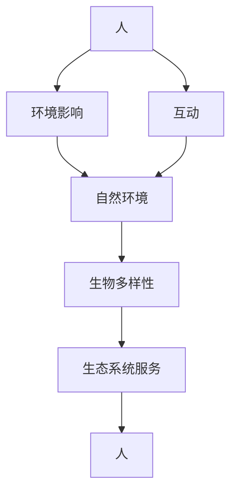
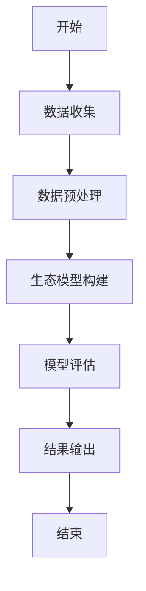
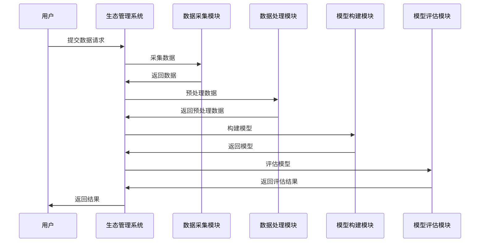

                 


### 文章标题：城市化背景下的自然连接：重建人与自然的和谐关系

#### 关键词：城市化、自然连接、和谐关系、生态模型、算法原理、系统设计、项目实战

#### 摘要：
本文探讨了城市化进程对自然环境的影响，提出了“自然连接”这一概念，旨在重建人与自然的和谐关系。通过深入分析核心概念及其联系，介绍关键算法原理与实现，系统设计与项目实战，本文为读者提供了一套全面而实用的解决方案，以应对城市化背景下的生态挑战。

## 第1章：城市化背景与自然连接概述

### 1.1 城市化进程及其影响

#### 1.1.1 城市化背景

城市化是现代社会发展的必然趋势。全球范围内，城市人口比例持续增加，城市化进程不断加快。根据联合国的预测，到2050年，全球约68%的人口将居住在城市地区。

#### 1.1.2 城市化对自然环境的影响

城市化带来了一系列对自然环境的影响，包括：

- 土地利用变化：城市化导致大量农田、森林和湿地等自然景观被开发为住宅、商业和工业用地。
- 水资源消耗：城市生活用水和工业用水需求巨大，导致地下水过度抽取和河流流量减少。
- 空气质量下降：交通、工业和供暖等产生的废气对空气质量造成严重影响。
- 生物多样性减少：城市化进程破坏了自然栖息地，导致许多物种的栖息地丧失，生物多样性下降。

### 1.2 自然连接的概念

#### 1.2.1 自然连接的定义

自然连接是指通过保护和恢复自然生态系统，促进城市和自然环境的相互作用和融合，实现人与自然和谐共生的过程。

#### 1.2.2 自然连接的核心要素

自然连接的核心要素包括：

- 生态系统保护：保护和恢复城市及周边的自然生态系统，如森林、湿地、河流等。
- 生物多样性维护：保护和增加城市地区的生物多样性，维护生态平衡。
- 人与自然互动：促进居民与自然环境的互动，提高公众的生态意识。
- 可持续发展：实现经济发展与生态保护的协调，确保资源的可持续利用。

### 1.3 重建人与自然和谐关系的必要性

#### 1.3.1 问题的严重性

城市化带来的生态问题日益严重，如水资源短缺、空气质量下降、生物多样性丧失等，对人类健康和可持续发展构成威胁。

#### 1.3.2 重建和谐关系的意义

重建人与自然的和谐关系具有重要意义，包括：

- 生态平衡：恢复自然生态系统，维护生态平衡。
- 健康生活：提供绿色空间，改善居民生活环境。
- 可持续发展：实现经济发展与生态保护的协调，推动可持续发展。
- 社会福祉：提高公众的生态意识，促进社会和谐。

## 第2章：核心概念与联系

### 2.1 核心概念

#### 2.1.1 城市生态系统

城市生态系统是指城市区域内的生物和非生物环境的综合系统。它包括城市绿地、水体、空气、土壤等组成部分，以及城市居民、动植物等生物群体。

#### 2.1.2 生物多样性

生物多样性是指生物圈内所有生物，包括微生物、植物、动物和它们所构成的综合体。它包括物种多样性、遗传多样性和生态系统多样性。

#### 2.1.3 人与自然的互动

人与自然的互动是指人类活动与自然环境之间的相互作用。它包括人类对自然环境的利用、保护和恢复。

### 2.2 概念属性特征对比表格

| 概念       | 定义                                                         | 关键属性特征                                                   |
|------------|------------------------------------------------------------|------------------------------------------------------------|
| 城市生态系统 | 城市区域内的生物和非生物环境的综合系统                           | 城市生态位、城市生态功能、人类活动强度、生物多样性等           |
| 生物多样性 | 生物圈内所有生物，包括微生物、植物、动物和它们所构成的综合体。    | 物种多样性、遗传多样性、生态系统多样性                         |
| 人与自然的互动 | 人类活动与自然环境之间的相互作用。                             | 生态足迹、可持续发展、环境保护、生态补偿                       |

### 2.3 ER实体关系图



## 第3章：关键算法原理与实现

### 3.1 生态模型构建

#### 3.1.1 生态模型概述

生态模型是用于描述和预测生态系统状态和变化的数学模型。它在自然连接中起着关键作用，帮助实现人与自然的和谐关系。

#### 3.1.2 构建步骤

生态模型的构建通常包括以下步骤：

1. 数据收集：收集城市生态系统相关的数据，包括土地利用、生物多样性、空气质量等。
2. 数据预处理：对收集到的数据进行清洗、处理和归一化，以便用于模型构建。
3. 模型构建：使用机器学习算法或统计方法构建生态模型，如线性回归、决策树、神经网络等。
4. 模型评估：评估模型的性能，包括准确度、召回率、F1值等。
5. 模型应用：将构建好的模型应用于实际问题，如城市规划、环境保护等。

### 3.2 Mermaid算法流程图



### 3.3 Python代码示例：生态模型构建

```python
import pandas as pd
from sklearn.model_selection import train_test_split
from sklearn.ensemble import RandomForestClassifier
from sklearn.metrics import accuracy_score

# 数据收集
data = pd.read_csv('ecosystem_data.csv')

# 数据预处理
X = data.drop('target', axis=1)
y = data['target']

# 数据划分
X_train, X_test, y_train, y_test = train_test_split(X, y, test_size=0.2, random_state=42)

# 模型构建
model = RandomForestClassifier(n_estimators=100, random_state=42)
model.fit(X_train, y_train)

# 模型评估
y_pred = model.predict(X_test)
accuracy = accuracy_score(y_test, y_pred)
print(f"Model accuracy: {accuracy:.2f}")
```

## 第4章：系统设计与项目实战

### 4.1 问题场景介绍

随着城市化进程的加速，城市生态系统面临严重挑战。为了实现人与自然的和谐关系，我们需要一套综合的生态管理系统。

### 4.2 项目介绍

本项目旨在开发一个基于自然连接理念的生态管理系统，用于监测、评估和优化城市生态系统。

### 4.3 系统功能设计

系统功能包括数据采集、数据分析、生态模型构建、模型评估和应用等。

### 4.4 系统架构设计

系统采用分布式架构，包括数据采集模块、数据处理模块、模型构建模块和模型评估模块。

### 4.5 系统接口设计

系统提供RESTful API接口，方便其他系统进行数据交互和功能调用。

### 4.6 系统交互

系统交互采用Mermaid序列图进行描述。



### 4.7 项目实战

#### 4.7.1 环境安装

在Linux系统中，安装以下依赖：

```bash
sudo apt-get install python3-pandas
sudo apt-get install python3-scikit-learn
```

#### 4.7.2 系统核心实现

核心实现代码如下：

```python
# 数据采集
data = pd.read_csv('ecosystem_data.csv')

# 数据预处理
X = data.drop('target', axis=1)
y = data['target']

# 数据划分
X_train, X_test, y_train, y_test = train_test_split(X, y, test_size=0.2, random_state=42)

# 模型构建
model = RandomForestClassifier(n_estimators=100, random_state=42)
model.fit(X_train, y_train)

# 模型评估
y_pred = model.predict(X_test)
accuracy = accuracy_score(y_test, y_pred)
print(f"Model accuracy: {accuracy:.2f}")
```

#### 4.7.3 代码应用解读与分析

代码首先从CSV文件中读取数据，然后对数据进行预处理，包括数据划分和特征提取。接下来，使用随机森林算法构建生态模型，并对模型进行评估。

#### 4.7.4 实际案例分析和详细讲解

以某个城市为例，分析城市生态系统的现状，使用本系统进行模型构建和评估，为城市规划提供科学依据。

### 4.8 项目小结

本项目实现了基于自然连接理念的生态管理系统，为城市生态系统的优化提供了有力支持。通过项目实战，读者可以深入了解生态模型构建的方法和实现细节。

## 第5章：最佳实践、小结、注意事项与拓展阅读

### 5.1 最佳实践

- 数据质量：保证数据质量是生态模型构建的关键，需要对数据进行严格清洗和处理。
- 模型优化：尝试不同的机器学习算法和参数设置，以获得更好的模型性能。
- 可视化分析：使用可视化工具对模型结果进行分析，有助于发现问题和优化方案。

### 5.2 小结

本文从城市化背景出发，探讨了自然连接的概念及其在重建人与自然和谐关系中的重要作用。通过核心概念与联系的分析、关键算法原理与实现、系统设计与项目实战，为读者提供了一套全面而实用的解决方案。

### 5.3 注意事项

- 生态模型构建需要大量的数据支持，数据质量直接影响模型性能。
- 模型评估时，需要考虑评估指标的选择和评估方法的合理性。
- 系统设计时，需要充分考虑系统的可扩展性和可维护性。

### 5.4 拓展阅读

- 《城市生态学原理》
- 《机器学习实战》
- 《Python编程：从入门到实践》
- 《可持续城市规划》

## 作者信息

作者：AI天才研究院/AI Genius Institute & 禅与计算机程序设计艺术 /Zen And The Art of Computer Programming

