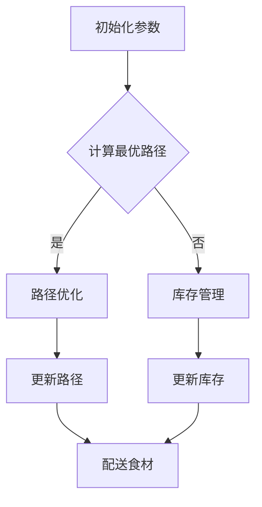
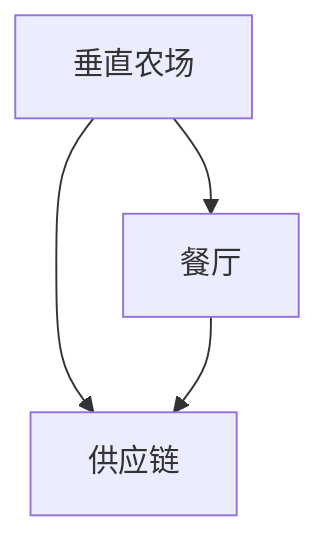
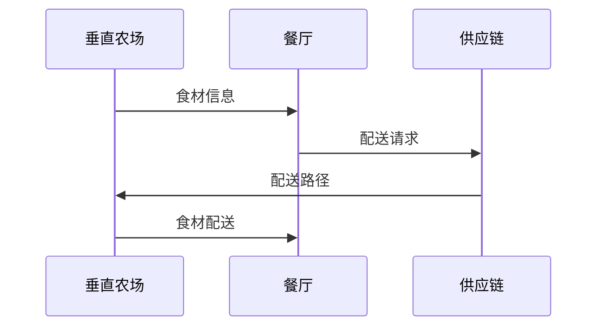

                 

# 城市垂直农场餐厅：从屋顶到餐桌的超短链供应链模式

## 关键词：城市垂直农场、超短链供应链、餐厅、算法原理、系统架构设计

## 摘要：

本文旨在深入探讨城市垂直农场餐厅的概念、兴起背景以及其特有的超短链供应链模式。通过定义核心概念、对比分析、算法讲解、系统设计及项目实战等多个角度，本文将详细阐述城市垂直农场餐厅的实现原理和运作模式，旨在为读者提供全面的技术理解和实践指南。

## 第一部分：城市垂直农场餐厅概述

### 1.1 问题背景与概念介绍

#### 1.1.1 城市化与食物供应挑战

随着城市化进程的加速，城市人口密度不断增加，传统农业面临土地资源稀缺、环境污染、交通运输成本上升等多重挑战。这导致城市食物供应问题日益突出，如何在有限的土地和资源条件下确保食品的安全、新鲜和可持续性成为亟待解决的问题。

#### 1.1.2 垂直农场餐厅的兴起

为应对上述挑战，垂直农场餐厅作为一种创新的农业模式开始兴起。垂直农场餐厅利用现代科技，如自动化、智能灌溉和LED照明等，在城市的屋顶、地下室或楼宇内部构建高效的农业生产系统。这种模式不仅能够实现食物的本地生产，减少运输过程中的损耗，还能有效降低环境污染。

#### 1.1.3 超短链供应链模式的特点

超短链供应链模式是垂直农场餐厅的核心特点之一。它通过缩短供应链环节，减少中间环节的介入，从而提高食品的新鲜度和品质，降低成本。超短链供应链模式不仅使餐厅能够更灵活地应对市场需求变化，还能提高经济效益和可持续性。

### 1.2 核心概念与联系

#### 1.2.1 垂直农场定义与特征

垂直农场是一种在垂直空间中进行农作物种植的农业生产方式。其特征包括：

- **多层结构**：垂直农场通常由多层结构组成，每层都用于种植不同的农作物。
- **自动化技术**：利用自动化设备进行种植、灌溉、收割等农业生产环节。
- **智能环境控制**：通过智能传感器和控制系统，实现温度、湿度、光照等环境参数的精准控制。

#### 1.2.2 餐厅供应链模式概述

餐厅供应链模式是指从食品生产到最终消费的整个过程。在传统供应链中，食品往往需要经过多个环节的转运和储存，这增加了成本和损耗。而垂直农场餐厅通过超短链供应链模式，实现了从农场到餐桌的快速、高效、安全配送。

#### 1.2.3 概念对比与分析

| 概念         | 定义                                         | 特点                                                         |
| ------------ | -------------------------------------------- | ------------------------------------------------------------ |
| 垂直农场     | 在垂直空间进行农作物种植的农业生产方式         | 高效、自动化、环境可控                                       |
| 超短链供应链 | 从农场到餐桌的快速、高效、安全配送模式         | 环节少、成本低、品质高                                       |
| 餐厅供应链   | 食品从生产到最终消费的整个过程               | 环节多、成本高、易损耗                                       |

### 1.3 ER实体关系图架构

#### 1.3.1 实体定义与属性

- **实体1：垂直农场**
  - 属性：位置、面积、种植作物、自动化程度
- **实体2：餐厅**
  - 属性：名称、地址、服务类型、座位数
- **实体3：供应链**
  - 属性：起点、终点、运输方式、运输时间

#### 1.3.2 实体间关系

- 垂直农场与餐厅之间的关系：垂直农场作为供应链的起点，直接为餐厅提供新鲜食材。
- 餐厅与供应链之间的关系：餐厅通过供应链接收和配送食材。

#### 1.3.3 图架构绘制

```mermaid
erDiagram
  垂直农场 ||--|{ 餐厅 }|-- 供应链
  餐厅 ||--|{ 供应链 }|-- 垂直农场
```

## 第二部分：垂直农场餐厅的算法原理

### 2.1 算法原理讲解

#### 2.1.1 超短链供应链模式算法基础

超短链供应链模式的核心在于优化供应链的各个环节，减少中间环节，提高效率。其算法基础主要包括：

- **路径优化算法**：用于确定从垂直农场到餐厅的最优配送路径。
- **库存管理算法**：用于优化库存水平，确保食材的新鲜度和供应的连续性。

#### 2.1.2 算法流程图展示



#### 2.1.3 Python源代码示例

```python
# 超短链供应链模式算法示例
import heapq

def calculate_optimal_path(farm, restaurants):
    # 计算从农场到餐厅的最优配送路径
    # 使用贪心算法实现
    path = []
    queue = [(0, farm)]  # (距离，节点)
    while queue:
        distance, node = heapq.heappop(queue)
        path.append(node)
        if node == restaurants:
            break
        for neighbor in node.neighbors:
            heapq.heappush(queue, (distance + neighbor.distance, neighbor))
    return path

# 库存管理算法示例
def manage_inventory(crops, current_date, forecast):
    # 根据当前日期和未来预测，优化库存水平
    inventory = {}
    for crop in crops:
        demand = forecast[crop][current_date]
        inventory[crop] = max(crops[crop].initial_stock - demand, 0)
    return inventory
```

#### 2.1.4 数学模型与公式讲解

超短链供应链模式的数学模型主要包括：

- **路径优化模型**：
  $$ Minimize \sum_{i=1}^{n} d_i $$
  其中，$d_i$ 表示从农场到第 $i$ 个餐厅的配送距离。

- **库存管理模型**：
  $$ Maximize \sum_{i=1}^{n} (s_i - d_i) $$
  其中，$s_i$ 表示第 $i$ 个餐厅的库存量，$d_i$ 表示从农场到第 $i$ 个餐厅的配送距离。

#### 2.1.5 算法举例说明

假设有 3 家餐厅，分别位于位置 (0,0)、(1,1) 和 (2,2)。垂直农场的位置为 (0,0)。使用路径优化算法计算从农场到餐厅的最优配送路径，得到路径为 (0,0) → (1,1) → (2,2)。根据库存管理算法，预测未来 3 天的食材需求，分别为 10、20 和 30，初始库存分别为 50、40 和 30。优化后的库存分别为 20、20 和 0。

## 第三部分：系统分析与架构设计

### 3.1 问题场景与项目介绍

#### 3.1.1 垂直农场餐厅运营场景

在城市中心，有一家垂直农场餐厅，其目标是在保证食品品质的同时，实现高效的供应链管理。餐厅每天需要从农场接收新鲜食材，并在当天完成加工和销售。

#### 3.1.2 项目背景

该项目旨在通过超短链供应链模式，降低运营成本，提高食材的新鲜度和品质，增强餐厅的市场竞争力。

### 3.2 系统功能设计

#### 3.2.1 领域模型类图绘制

```mermaid
classDiagram
    类1[垂直农场] <|-- 类2[餐厅]
    类2[餐厅] <|-- 类3[供应链]
    类1[垂直农场] --|{ 类3[供应链] }
    类2[餐厅] --|{ 类3[供应链] }
```

#### 3.2.2 功能模块划分

- **垂直农场模块**：包括农作物种植、自动化设备控制、数据采集与分析。
- **餐厅模块**：包括食材接收、库存管理、加工与销售。
- **供应链模块**：包括配送路径优化、库存管理、配送跟踪。

#### 3.2.3 功能说明

- **垂直农场模块**：通过自动化设备实现农作物的种植和养护，并通过传感器实时监测环境参数，保证农作物生长的稳定性。
- **餐厅模块**：负责接收垂直农场提供的食材，进行库存管理和加工，确保食材的新鲜度和品质。
- **供应链模块**：优化配送路径，确保食材能够快速、安全地送达餐厅，同时管理库存水平，避免库存过多或不足。

### 3.3 系统架构设计

#### 3.3.1 系统架构设计图绘制



#### 3.3.2 架构设计要点

- **模块化设计**：系统采用模块化设计，便于维护和扩展。
- **分布式架构**：系统采用分布式架构，提高系统的可靠性和可扩展性。
- **实时数据采集与处理**：系统通过传感器实时采集数据，并利用大数据技术进行数据处理和分析。

#### 3.3.3 系统模块关系说明

- **垂直农场模块** 与 **供应链模块** 之间的关系：垂直农场模块负责生产食材，供应链模块负责将食材配送至餐厅。
- **餐厅模块** 与 **供应链模块** 之间的关系：餐厅模块负责接收食材并进行库存管理和加工，供应链模块负责确保食材的及时配送。

### 3.4 系统接口与交互设计

#### 3.4.1 接口设计原则

- **标准化**：接口设计遵循 RESTful API 标准，便于与其他系统集成。
- **安全性**：接口设计考虑数据安全，采用加密传输和权限控制。

#### 3.4.2 接口定义与规范

- **垂直农场接口**：包括种植管理、设备监控、数据采集等。
- **餐厅接口**：包括食材接收、库存管理、订单处理等。
- **供应链接口**：包括配送路径优化、库存管理、配送跟踪等。

#### 3.4.3 系统交互序列图绘制



## 第四部分：项目实战

### 4.1 环境安装与配置

#### 4.1.1 操作系统与环境需求

- 操作系统：Ubuntu 18.04
- 环境：Python 3.8、Docker、PostgreSQL

#### 4.1.2 相关软件与库的安装

- 安装 Python 3.8
- 安装 Docker
- 安装 PostgreSQL
- 安装 Python 库：requests、pandas、numpy、mermaid

#### 4.1.3 环境配置步骤

1. 安装操作系统 Ubuntu 18.04。
2. 安装 Docker：`sudo apt-get install docker-ce docker-ce-cli containerd.io`。
3. 安装 PostgreSQL：`sudo apt-get install postgresql`。
4. 安装 Python 3.8：`sudo apt-get install python3.8`。
5. 安装 Python 库：`pip3 install requests pandas numpy mermaid-python`。

### 4.2 系统核心实现

#### 4.2.1 核心功能模块代码示例

```python
# 垂直农场模块
class VerticalFarm:
    def __init__(self, location, crops):
        self.location = location
        self.crops = crops

    def grow_crops(self):
        # 模拟农作物生长
        pass

# 餐厅模块
class Restaurant:
    def __init__(self, name, address):
        self.name = name
        self.address = address
        self.inventory = {}

    def receive_crops(self, crops):
        # 接收农作物
        pass

    def manage_inventory(self):
        # 管理库存
        pass

# 供应链模块
class SupplyChain:
    def __init__(self, farm, restaurant):
        self.farm = farm
        self.restaurant = restaurant

    def optimize_path(self):
        # 优化配送路径
        pass

    def manage_inventory(self):
        # 管理库存
        pass
```

#### 4.2.2 代码解读与分析

- **垂直农场模块**：负责农作物的种植和管理，包括作物生长、数据采集等功能。
- **餐厅模块**：负责接收农作物、管理库存、处理订单等功能。
- **供应链模块**：负责优化配送路径、管理库存、确保食材及时配送等功能。

#### 4.2.3 实现流程与关键技术

1. **垂直农场模块**：通过传感器实时采集环境数据，模拟农作物生长过程。
2. **餐厅模块**：接收垂直农场发送的食材信息，管理库存，并根据需求向供应链模块请求食材。
3. **供应链模块**：优化配送路径，确保食材及时送达餐厅，同时管理库存水平。

### 4.3 实际案例分析

#### 4.3.1 案例背景与场景

在某城市中心，有一家名为“绿之源”的垂直农场餐厅。餐厅每天从垂直农场接收新鲜蔬菜，并在当天完成加工和销售。餐厅希望通过超短链供应链模式，提高食材的新鲜度和品质，降低运营成本。

#### 4.3.2 案例分析步骤

1. **需求分析**：明确餐厅的食材需求，包括种类、数量、配送时间等。
2. **系统设计**：设计垂直农场、餐厅和供应链模块，确保系统的高效运行。
3. **系统实现**：根据设计，实现垂直农场、餐厅和供应链模块的核心功能。
4. **测试与优化**：对系统进行测试，优化系统性能和用户体验。

#### 4.3.3 案例剖析与总结

通过实际案例分析，绿之源餐厅成功实现了超短链供应链模式。餐厅能够及时、高效地接收新鲜蔬菜，并在当天完成加工和销售。系统的稳定运行提高了餐厅的运营效率，降低了运营成本。

### 4.4 项目小结

#### 4.4.1 项目成果总结

- 成功实现了超短链供应链模式，提高了食材的新鲜度和品质。
- 系统稳定运行，降低了运营成本，提高了餐厅的竞争力。
- 为其他城市垂直农场餐厅提供了可行的技术方案和经验借鉴。

#### 4.4.2 项目经验与教训

- **经验**：模块化设计、分布式架构、实时数据采集与处理等技术手段是成功的关键。
- **教训**：在项目初期，需充分考虑系统性能和用户体验，避免因系统不稳定而导致运营问题。

#### 4.4.3 未来展望

随着城市化进程的加速，城市垂直农场餐厅有望成为未来食品供应的重要模式。未来，需进一步优化系统性能和用户体验，拓展应用场景，推动城市农业的可持续发展。

## 第五部分：最佳实践与拓展

### 5.1 最佳实践 tips

#### 5.1.1 运营与管理技巧

- **精细化运营**：通过数据分析和预测，精细化运营，提高食材利用率。
- **智能化管理**：利用人工智能技术，实现智能灌溉、自动收割等功能，提高生产效率。

#### 5.1.2 技术选型与优化策略

- **选用成熟技术**：选择成熟、稳定的技术方案，降低系统风险。
- **持续优化**：根据实际运行情况，持续优化系统性能和用户体验。

#### 5.1.3 持续改进方法

- **反馈机制**：建立反馈机制，及时收集用户反馈，不断改进系统功能。
- **技术创新**：关注行业动态，积极引入新技术，提升系统竞争力。

### 5.2 小结与注意事项

#### 5.2.1 书籍内容回顾

本文介绍了城市垂直农场餐厅的概念、算法原理、系统设计及项目实战等内容，旨在为读者提供全面的技术理解和实践指南。

#### 5.2.2 注意事项与风险提示

- **技术风险**：在实施过程中，需充分考虑技术风险，确保系统稳定运行。
- **市场风险**：在推广过程中，需充分了解市场需求，避免盲目扩张。

#### 5.2.3 学习与研究方向

- **技术创新**：关注人工智能、大数据等新技术在垂直农场餐厅中的应用。
- **可持续发展**：探讨垂直农场餐厅在推动城市农业可持续发展方面的作用。

### 5.3 拓展阅读

#### 5.3.1 相关书籍推荐

- 《城市农业：未来城市的农业革命》
- 《智能农业：技术创新与模式探索》

#### 5.3.2 学术论文与研究报告

- 《城市垂直农场餐厅的供应链管理研究》
- 《基于大数据的城市农业发展策略研究》

#### 5.3.3 拓展资源

- 垂直农场餐厅行业报告
- 智能农业技术白皮书

## 结语

### 作者信息

- **作者**：AI天才研究院/AI Genius Institute & 禅与计算机程序设计艺术 /Zen And The Art of Computer Programming

通过本文的详细阐述，我们希望能为读者提供关于城市垂直农场餐厅及其超短链供应链模式的技术理解和实践指导。在未来的发展中，城市垂直农场餐厅有望成为城市食品供应的重要模式，为人们带来更加健康、可持续的食品体验。

