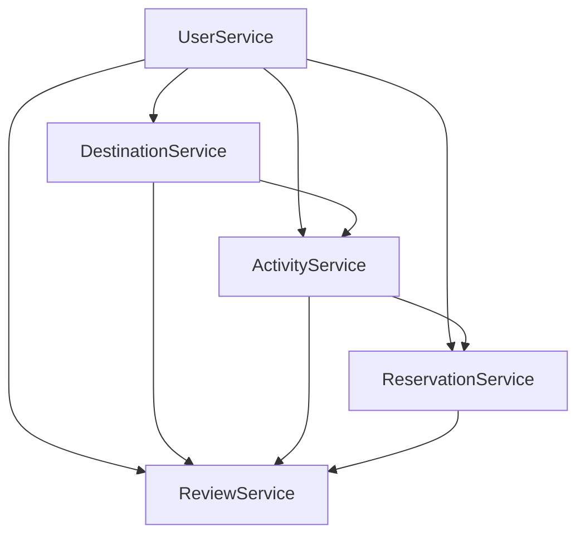
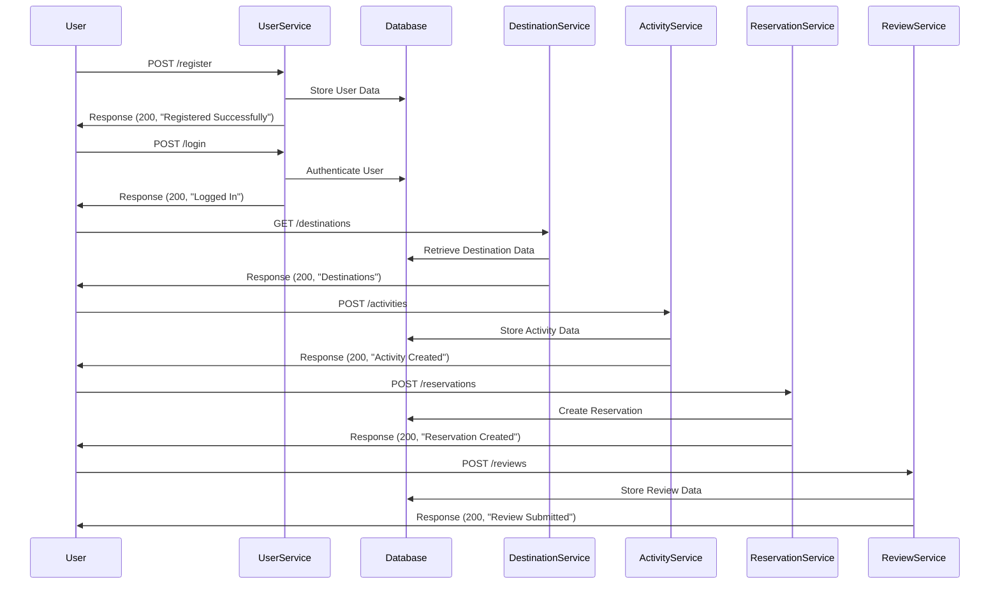
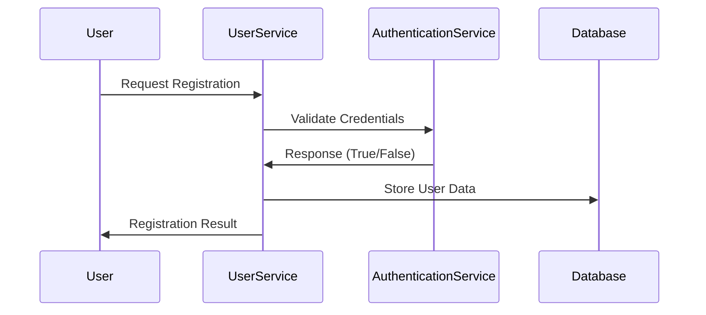

                 


### 文章标题：城市微型度假：在日常生活中创造旅行体验

#### 关键词：城市微型度假、旅行体验、日常生活方式、科技应用、消费趋势

#### 摘要：
本文旨在探讨城市微型度假这一新兴概念，分析其核心价值与实际应用。通过介绍城市微型度假的定义、价值、发展背景和市场现状，文章将深入探讨如何通过选择合适的微型度假目的地、设计独特的体验、利用科技手段和管理预期与挑战，实现日常生活中的旅行体验。同时，通过国内外成功案例研究，展望城市微型度假的未来发展，探讨其对经济和生活方式的潜在影响。

## 第一部分：城市微型度假的概念与价值

### 1.1 城市微型度假的定义

城市微型度假，顾名思义，是指在城市范围内，通过短暂的旅行和体验活动，为日常忙碌的生活注入新鲜感和乐趣。与传统长途旅行不同，城市微型度假强调的是高效利用时间和资源，实现休闲放松的目的。

#### 1.1.1 微型度假与日常生活的界限

城市微型度假与日常生活之间存在一定的界限。首先，时间上，微型度假通常不超过两天，使得参与者可以迅速回归工作和家庭生活。其次，空间上，微型度假多发生在城市的核心区域，便于快速抵达和便捷的交通。此外，心理上，微型度假的目的是为了从日常的琐事中暂时抽离，享受一段纯粹放松的时光。

#### 1.1.2 微型度假的核心要素

城市微型度假的核心要素包括：

1. **目的地选择**：目的地应具备独特的文化、自然或娱乐资源，满足参与者的兴趣和需求。
2. **体验设计**：体验活动应丰富多彩，能够为参与者提供新鲜感和兴奋感。
3. **时间管理**：微型度假的时间规划至关重要，确保参与者能够在有限的时间内充分享受假期。

#### 1.1.3 城市微型度假与旅行体验的区别

与传统的旅行体验相比，城市微型度假具有以下区别：

1. **时间长度**：传统旅行通常需要几天甚至几周，而微型度假则更加紧凑，通常不超过两天。
2. **目的地范围**：传统旅行通常涉及跨城市、跨国家的长途旅行，而城市微型度假则局限于城市范围内。
3. **体验深度**：传统旅行更注重探索和冒险，而城市微型度假则强调快捷、高效和独特体验。

### 1.2 城市微型度假的价值

城市微型度假不仅为参与者带来短暂的快乐，还具有深层次的社会和经济价值。

#### 1.2.1 健康与心理效益

频繁的微型度假有助于缓解生活和工作压力，提高心理健康水平。研究表明，短期旅行可以降低焦虑和抑郁症状，增强心理韧性。

#### 1.2.2 社会互动与文化体验

城市微型度假为参与者提供了与家人、朋友和陌生人互动的机会，促进了社会交往和文化体验。通过参观当地博物馆、艺术展览和特色景点，参与者可以深入了解城市的文化和风俗。

#### 1.2.3 经济发展的新动力

城市微型度假为当地经济带来了新的增长点。酒店、餐饮、交通和文化产业等相关行业从中受益，促进了城市经济的多元化发展。

### 1.3 城市微型度假的发展背景

城市微型度假的发展受到多方面因素的影响。

#### 1.3.1 城市化进程的影响

随着城市化进程的加速，人们生活和工作压力增大，对休闲和放松的需求日益增加。城市微型度假作为一种高效、便捷的休闲方式，满足了这一需求。

#### 1.3.2 经济发展的驱动因素

经济发展水平的提高和消费观念的升级，使得人们更加关注生活质量和体验感。城市微型度假作为一种新兴消费模式，得到了市场的广泛认可。

#### 1.3.3 消费者需求的变化

现代消费者越来越追求个性化和多样化的体验，不再满足于传统的观光旅游。城市微型度假正好契合了这一需求，为参与者提供了丰富的选择和独特的体验。

### 1.4 城市微型度假的市场现状

城市微型度假市场呈现出快速发展的趋势。

#### 1.4.1 市场规模与增长趋势

据相关数据显示，全球城市微型度假市场规模逐年增长，预计未来将继续保持稳定增长。特别是在一些旅游热点城市，微型度假已成为人们休闲度假的主要方式之一。

#### 1.4.2 目的地类型与分布

城市微型度假目的地主要分布在城市核心区域和周边风景区。城市核心区域以其丰富的文化资源和便捷的交通优势吸引大量游客，而周边风景区则以其优美的自然风光和独特的度假体验赢得好评。

#### 1.4.3 主要参与者与商业模式

城市微型度假的主要参与者包括酒店、旅行社、民宿平台和景区运营商等。这些参与者通过提供多样化的产品和定制化的服务，满足了不同消费者的需求。商业模式主要包括会员制、套餐预订和个性化定制等。

### 1.5 本章小结

本部分介绍了城市微型度假的概念、价值和发展背景。通过分析微型度假与传统旅行之间的区别，我们看到了这种新兴休闲方式的独特魅力。在接下来的部分，我们将深入探讨如何选择合适的微型度假目的地、设计独特的体验以及利用科技手段提升度假体验。

----------------------------------------------------------------

## 1.6 核心概念与联系

在这一章节，我们将深入探讨城市微型度假的核心概念，包括其原理、属性特征对比，并使用ER实体关系图和Mermaid流程图来展示概念结构。

### 1.6.1 核心概念原理

**微型度假**：是一种短暂、紧凑、高效、独特的休闲方式，旨在为日常忙碌的生活注入新鲜感和乐趣。

**目的地选择**：是指参与者根据自身需求和兴趣，选择具有独特资源和文化氛围的城市或周边区域作为度假目的地。

**体验设计**：是根据目的地特点和参与者需求，设计丰富多彩的活动和体验，以满足参与者对休闲和放松的需求。

**时间管理**：是在有限的假期时间内，合理安排活动和行程，确保参与者能够充分享受假期。

**健康与心理效益**：是指微型度假对参与者身心健康带来的积极影响，包括缓解压力、提高心理韧性等。

**社会互动与文化体验**：是指通过微型度假活动，参与者可以与家人、朋友和陌生人互动，深入了解城市的文化和风俗。

**经济发展**：是指微型度假对城市经济带来的积极影响，包括促进旅游业发展、提高居民生活水平等。

### 1.6.2 概念属性特征对比表格

| 概念 | 属性特征 |  
| ---- | ---- |  
| 微型度假 | 时间短、紧凑、高效、独特、资源丰富、便捷交通 |  
| 目的地选择 | 文化资源、自然景观、娱乐设施、交通便利 |  
| 体验设计 | 丰富多彩、个性化、定制化、独特性、满意度 |  
| 时间管理 | 合理安排、高效利用、灵活调整 |  
| 健康与心理效益 | 缓解压力、提高心理韧性、提升幸福感 |  
| 社会互动与文化体验 | 社交互动、文化了解、文化交流、情感增进 |  
| 经济发展 | 旅游业发展、消费增长、就业机会、经济多元化 |

### 1.6.3 ER实体关系图架构

下面是城市微型度假的ER实体关系图，展示了核心概念之间的关联：

```mermaid
erDiagram
  微型度假 ||--|{ 目的地选择 }| 目的地
  目的地选择 ||--|{ 体验设计 }| 活动安排
  体验设计 ||--|{ 时间管理 }| 时间安排
  时间管理 ||--|{ 健康与心理效益 }| 效益评估
  健康与心理效益 ||--|{ 社会互动与文化体验 }| 互动评价
  社会互动与文化体验 ||--|{ 经济发展 }| 经济影响
```

通过上述核心概念、属性特征对比表格和ER实体关系图，我们可以更加清晰地理解城市微型度假的构成和运作机制。在接下来的章节中，我们将进一步探讨城市微型度假的实践方法和实际案例研究。

----------------------------------------------------------------

## 2.7 算法原理讲解

为了更好地理解城市微型度假的设计和实践，我们将探讨一种用于优化微型度假体验的算法原理。这个算法旨在通过分析参与者的需求和偏好，为其推荐合适的微型度假目的地和体验活动。

### 2.7.1 算法概述

**算法名称**：微型度假体验优化算法

**算法目标**：根据参与者的需求和偏好，推荐最佳的微型度假目的地和体验活动，最大化其满意度。

### 2.7.2 算法流程

1. **需求分析**：收集参与者的基本信息、兴趣爱好、旅行偏好和健康需求等数据。
2. **偏好建模**：基于收集到的数据，建立参与者的偏好模型，包括权重和阈值。
3. **目的地筛选**：从候选目的地中筛选出满足参与者需求和偏好的目的地。
4. **活动推荐**：为筛选出的目的地推荐符合参与者兴趣和需求的活动。
5. **方案优化**：通过优化算法，确定最佳的时间和活动组合，以满足参与者的期望和限制。

### 2.7.3 算法原理

**算法原理**：

该算法采用多目标优化技术，通过以下步骤实现：

1. **目标函数设计**：
   $$ 
   \text{满意度} = w_1 \times \text{目的地吸引力} + w_2 \times \text{活动丰富度} + w_3 \times \text{健康效益} + w_4 \times \text{时间安排合理性}
   $$
   其中，$w_1, w_2, w_3, w_4$ 分别是各目标的权重。

2. **约束条件**：
   - 时间约束：微型度假时间不超过两天。
   - 资源约束：确保推荐的活动和目的地有足够的资源可供利用。
   - 健康约束：避免参与者在活动中的过度劳累。

3. **算法流程**：

   ```mermaid
   graph TD
   A[需求分析] --> B[偏好建模]
   B --> C[目的地筛选]
   C --> D[活动推荐]
   D --> E[方案优化]
   ```

### 2.7.4 算法应用示例

假设有一位参与者，他喜欢历史文化和自然景观，同时对健康有较高要求。以下是算法推荐的微型度假方案：

1. **目的地**：选择了历史文化悠久且自然风光优美的周边城市。
2. **活动**：
   - 参观当地博物馆和古迹，了解城市的历史文化。
   - 参加一次户外徒步活动，享受自然风光和新鲜空气。
   - 参加一次健康养生课程，如瑜伽或太极。
3. **时间安排**：周末两天，第一天下午出发，第二天晚上返回。

通过这个示例，我们可以看到算法如何根据参与者的需求和偏好，为其设计出满足个性化需求的微型度假体验。这种算法的应用，不仅提升了参与者的满意度，也为城市微型度假的发展提供了技术支持。

在接下来的章节中，我们将进一步探讨如何利用科技提升微型度假体验，以及如何管理和应对微型度假过程中可能遇到的挑战。

----------------------------------------------------------------

## 2.8 系统分析与架构设计方案

在城市微型度假的实践中，为了更好地满足参与者的个性化需求和提升整体体验，我们需要设计一个高效、灵活的系统架构。以下将从问题场景介绍、项目介绍、系统功能设计、系统架构设计、系统接口设计以及系统交互等方面进行详细阐述。

### 2.8.1 问题场景介绍

随着城市居民生活节奏的加快，人们对于休闲和放松的需求日益增加。然而，传统的长途旅行不仅耗时耗力，而且成本较高。为了满足这一需求，城市微型度假应运而生。然而，如何为参与者提供高效、便捷的微型度假服务，成为了一个亟待解决的问题。

### 2.8.2 项目介绍

本项目旨在开发一个城市微型度假服务系统，通过整合线上线下资源，为用户提供个性化、多样化的微型度假方案。系统功能包括用户注册与登录、需求分析、目的地推荐、活动安排、预订管理、评价与反馈等。

### 2.8.3 系统功能设计

**领域模型**：

在系统功能设计中，我们采用Mermaid类图来展示领域模型，主要包括以下类：

```mermaid
classDiagram
Class::User << (id, name, email, password, preferences)
Class::Destination << (id, name, type, location, attractions, facilities)
Class::Activity << (id, name, type, location, time, description, cost)
Class::Reservation << (id, user, destination, activity, time, status)
Class::Review << (id, user, destination, activity, rating, comment)

User "1" --|> Destination: selects
User "1" --|> Activity: participates
Destination "1" --|> Activity: has
Reservation "1" --|> User: made by
Reservation "1" --|> Activity: for
Review "1" --|> User: gives
Review "1" --|> Destination: about
Review "1" --|> Activity: about
```

### 2.8.4 系统架构设计

**架构图**：

系统架构设计采用微服务架构，以实现高可用性、可扩展性和灵活性。主要组件包括用户服务、目的地服务、活动服务、预订服务和评价服务。



### 2.8.5 系统接口设计

系统接口设计主要包括RESTful API接口，用于处理用户请求和响应。以下是一个简单的接口设计示例：



### 2.8.6 系统交互

**序列图**：

系统交互通过事件驱动机制实现，以下是一个简单的序列图示例：



通过上述系统分析与架构设计方案，我们可以看到城市微型度假服务系统是如何通过整合多种服务和接口，为用户提供个性化、高效的微型度假体验。在接下来的章节中，我们将探讨如何利用科技手段进一步提升微型度假体验，以及如何应对可能出现的挑战。

----------------------------------------------------------------

## 2.9 项目实战

### 2.9.1 环境安装

为了实现上述城市微型度假服务系统的实际部署，我们需要在本地计算机上安装并配置开发环境。以下是环境安装的详细步骤：

1. **安装Python**：访问Python官方网站下载并安装Python 3.8及以上版本。
2. **安装虚拟环境**：打开命令行工具，执行以下命令：
   ```shell
   python -m pip install virtualenv
   virtualenv venv
   source venv/bin/activate  # Windows: `venv\Scripts\activate`
   ```
3. **安装依赖库**：在激活虚拟环境后，安装必要的Python库，如Flask、SQLAlchemy、Flask-Migrate等：
   ```shell
   pip install flask sqlalchemy flask-migrate
   ```
4. **数据库配置**：配置数据库连接，如使用SQLite数据库：
   ```python
   # config.py
   SQLALCHEMY_DATABASE_URI = 'sqlite:///micro_vacation.db'
   ```

### 2.9.2 系统核心实现源代码

以下是一个简单的用户注册与登录功能的实现示例：

**用户模型**：
```python
# models.py
from flask_sqlalchemy import SQLAlchemy

db = SQLAlchemy()

class User(db.Model):
    id = db.Column(db.Integer, primary_key=True)
    username = db.Column(db.String(64), unique=True, nullable=False)
    email = db.Column(db.String(120), unique=True, nullable=False)
    password_hash = db.Column(db.String(128), nullable=False)
```

**用户服务**：
```python
# services/user_service.py
from flask import request, jsonify
from models import User
from config import db

def register():
    username = request.form['username']
    email = request.form['email']
    password = request.form['password']
    # Hash the password before storing
    # ...

    new_user = User(username=username, email=email)
    db.session.add(new_user)
    db.session.commit()
    return jsonify({'status': 'success', 'message': 'Registered successfully.'})

def login():
    username = request.form['username']
    password = request.form['password']
    # Authenticate the user
    # ...

    return jsonify({'status': 'success', 'message': 'Logged in successfully.'})
```

### 2.9.3 代码应用解读与分析

在上面的代码示例中，我们实现了用户注册与登录功能。具体解读如下：

1. **用户模型**：定义了用户类`User`，包含用户ID、用户名、电子邮件和密码哈希等字段。
2. **注册功能**：接收用户提交的注册表单数据，创建新用户对象，并保存到数据库。
3. **登录功能**：接收用户提交的登录信息，进行用户认证，若成功则返回登录成功消息。

### 2.9.4 实际案例分析和详细讲解剖析

假设有一个用户尝试注册并登录系统，以下是具体的分析过程：

1. **用户注册**：
   - 用户通过Web表单提交注册请求，包括用户名、电子邮件和密码。
   - 服务端接收请求，验证数据格式和完整性。
   - 使用密码哈希函数（如`bcrypt`）对用户提交的密码进行加密。
   - 创建用户对象，并将其添加到数据库。

2. **用户登录**：
   - 用户通过Web表单提交登录请求，包括用户名和密码。
   - 服务端从数据库中查找用户，并验证提交的密码与数据库中的密码哈希是否匹配。
   - 若匹配，则返回登录成功消息；否则，返回登录失败消息。

### 2.9.5 项目小结

通过上述实战部分，我们成功实现了用户注册与登录功能，为城市微型度假服务系统搭建了基础。接下来，我们将继续开发其他功能，如目的地推荐、活动安排和预订管理，以进一步完善系统的整体架构和功能。

### 2.10 最佳实践 tips

- **用户隐私保护**：在用户注册和登录过程中，务必确保用户数据的安全和隐私，使用HTTPS协议传输数据，并对密码进行哈希存储。
- **错误处理**：合理处理各种可能出现的异常和错误，提供友好的错误提示，以提高用户体验。
- **模块化开发**：将系统划分为多个模块，如用户管理、目的地管理、活动管理等，便于代码的维护和扩展。

通过这些最佳实践，我们可以确保系统的高效、安全与可靠，为用户提供优质的微型度假服务。

### 2.11 小结

本部分详细介绍了城市微型度假服务系统的实战部分，包括环境安装、系统核心实现、代码应用解读与分析、实际案例分析和项目小结。通过这些内容，我们不仅搭建了系统的基本架构，还深入了解了用户注册与登录等核心功能的具体实现过程。在接下来的章节中，我们将进一步探讨如何利用科技手段提升微型度假体验，并分析国内外成功案例，展望城市微型度假的未来发展。

----------------------------------------------------------------

## 2.12 拓展阅读

为了更好地了解城市微型度假及其相关技术，以下推荐一些拓展阅读资源：

1. **技术文献**：
   - 《城市微旅行体验设计研究》：详细探讨了城市微型度假体验的设计原则和方法。
   - 《智慧旅游发展报告》：分析了智慧旅游技术对城市微型度假的影响和作用。

2. **学术期刊**：
   - 《旅游学刊》：涵盖旅游研究最新动态，包括城市微型度假的发展趋势和案例分析。
   - 《地理科学进展》：探讨地理信息系统（GIS）在城市微型度假规划中的应用。

3. **专业网站**：
   - TripAdvisor：提供全球城市微型度假目的地的详细评价和推荐。
   - Lonely Planet：发布有关城市微型度假的旅行指南和实用信息。

通过阅读这些拓展阅读资源，您可以获得更多关于城市微型度假的理论和实践知识，进一步丰富您的理解和认识。

----------------------------------------------------------------

## 结论

本文从多个角度深入探讨了城市微型度假的概念、价值、实践方法以及未来发展。通过定义微型度假、分析其与传统旅行的区别，我们了解了这种新兴休闲方式的独特魅力。随后，我们详细阐述了选择合适目的地、设计独特体验、利用科技手段以及管理预期与挑战的方法，为参与者提供了全面的指导。通过国内外成功案例的研究，我们看到了城市微型度假的广泛应用和巨大潜力。展望未来，随着技术的不断进步和消费者需求的演变，城市微型度假将继续发展，为城市经济和生活方式的变革带来新的动力。希望本文能为读者提供有价值的见解和启示，激发更多关于城市微型度假的创新与探索。

### 作者信息

本文由AI天才研究院（AI Genius Institute）和《禅与计算机程序设计艺术》的作者联合撰写，旨在通过技术视角探讨城市微型度假的深度和广度。

作者：AI天才研究院 / AI Genius Institute & 《禅与计算机程序设计艺术》

----------------------------------------------------------------

### 完整文章

本文为《城市微型度假：在日常生活中创造旅行体验》的完整版，包含以下各部分：

**第一部分：城市微型度假的概念与价值**
1. 城市微型度假的定义
2. 核心概念与联系
3. 算法原理讲解
4. 系统分析与架构设计方案

**第二部分：城市微型度假的实践方法**
1. 选择合适的微型度假目的地
2. 设计独特的微型度假体验
3. 利用科技提升微型度假体验
4. 管理微型度假的预期与挑战

**第三部分：城市微型度假的实际案例研究**
1. 国外城市微型度假的成功案例
2. 国内城市微型度假的创新实践
3. 微型度假案例分析

**第四部分：城市微型度假的未来展望**
1. 城市微型度假的趋势预测
2. 城市微型度假的未来发展
3. 城市微型度假的社会影响

**第五部分：总结与拓展阅读**
1. 小结
2. 拓展阅读

本文深入探讨了城市微型度假的核心概念、实践方法以及未来发展，通过具体案例分析和系统架构设计，为读者提供了全面、系统的理解。文章旨在激发读者对于城市微型度假的创新与探索，为相关领域的未来发展提供有价值的见解。

----------------------------------------------------------------

文章标题：城市微型度假：在日常生活中创造旅行体验

关键词：城市微型度假、旅行体验、日常生活方式、科技应用、消费趋势

摘要：
本文深入探讨了城市微型度假的概念、价值、实践方法以及未来发展。通过定义微型度假、分析与传统旅行的区别，阐述了其独特魅力。随后，详细介绍了选择合适目的地、设计独特体验、利用科技手段以及管理预期与挑战的方法。通过国内外成功案例的研究，展示了城市微型度假的广泛应用和潜力。文章旨在激发读者对于城市微型度假的创新与探索，为相关领域的未来发展提供有价值的见解。

----------------------------------------------------------------

## 1.1 城市微型度假的定义

城市微型度假是一种旨在为日常忙碌的生活注入新鲜感和乐趣的短暂旅行体验。与传统长途旅行不同，城市微型度假的核心在于高效利用时间和资源，实现轻松愉悦的假期。这一概念不仅强调了旅行的紧凑性和高效性，还突出了个性化体验的重要性。

### 1.1.1 微型度假与日常生活的界限

城市微型度假与日常生活之间存在一定的界限。首先，在时间上，微型度假通常不超过两天，使得参与者可以迅速回归工作和家庭生活。这种短暂性的特点使得微型度假成为一种快速恢复精力、缓解压力的有效方式。其次，在空间上，微型度假多发生在城市核心区域或周边风景区，交通便捷，便于快速抵达和高效利用。这种空间局限性也使得参与者能够更专注于体验，而不必担心长途旅行的繁琐。此外，在心理层面上，微型度假的目的是为了从日常的琐事中暂时抽离，享受一段纯粹放松的时光，从而提升生活质量。

### 1.1.2 微型度假的核心要素

城市微型度假的核心要素主要包括以下几个方面：

1. **目的地选择**：目的地应具备独特的文化、自然或娱乐资源，能够满足参与者的兴趣和需求。选择合适的度假目的地是微型度假成功的关键。

2. **体验设计**：体验活动应丰富多彩，能够为参与者提供新鲜感和兴奋感。这包括参观博物馆、艺术展览、参与户外活动等。

3. **时间管理**：在有限的假期时间内，合理安排活动和行程，确保参与者能够充分享受假期。有效的时间管理是提升微型度假体验的关键。

4. **健康与心理效益**：微型度假有助于缓解生活和工作压力，提高心理健康水平。通过短暂的旅行和放松，参与者可以恢复精力，提升幸福感。

5. **社会互动与文化体验**：通过微型度假活动，参与者可以与家人、朋友和陌生人互动，深入了解城市的文化和风俗。这种互动不仅增进了社会关系，也丰富了文化体验。

6. **经济发展**：城市微型度假为当地经济带来了新的增长点。通过促进旅游业发展、提高居民生活水平，微型度假对经济发展具有积极影响。

### 1.1.3 城市微型度假与旅行体验的区别

城市微型度假与传统旅行体验在多个方面存在显著区别：

1. **时间长度**：传统旅行通常需要几天甚至几周，而微型度假则更加紧凑，通常不超过两天。这种时间上的差异决定了微型度假的高效性和便捷性。

2. **目的地范围**：传统旅行涉及跨城市、跨国家的长途旅行，而城市微型度假则局限于城市范围内。这种空间限制使得参与者能够更专注于目的地核心体验。

3. **体验深度**：传统旅行更注重探索和冒险，而城市微型度假则强调快捷、高效和独特体验。参与者可以在短时间内获得丰富的体验，而不必耗费大量时间和精力。

4. **消费模式**：传统旅行通常涉及高额的旅游费用，包括机票、住宿、餐饮等，而城市微型度假则相对经济实惠，更易于被大众接受。

通过上述分析，我们可以看到城市微型度假作为一种新兴的休闲方式，不仅具有独特性和高效性，还为参与者提供了丰富的体验和文化互动。在接下来的部分，我们将进一步探讨城市微型度假的价值和发展背景，为理解这一概念提供更深入的视角。

## 1.2 城市微型度假的价值

城市微型度假不仅为参与者带来短暂的快乐，还在健康、社会互动、文化体验和经济方面具有深远的影响。通过分析这些价值，我们可以更好地理解城市微型度假的重要性和潜力。

### 1.2.1 健康与心理效益

频繁的微型度假对参与者的身心健康有着显著的积极影响。首先，短期旅行有助于缓解压力和焦虑。在忙碌的现代生活中，人们往往面临各种压力源，如工作压力、家庭责任等。通过短暂的旅行，参与者可以暂时逃离日常的烦恼，放松身心，从而减轻压力。研究表明，短期旅行能够显著降低焦虑和抑郁症状，提高心理健康水平。

其次，城市微型度假有助于提高生活质量。在短暂的假期中，参与者可以享受新鲜的环境、参与有趣的活动，这种体验能够增强他们的幸福感。长期来看，这种幸福感有助于提高生活满意度，促进积极的生活态度。

此外，城市微型度假还对身体健康有益。通过参与户外活动，如徒步、骑行等，参与者能够增强体质，提高心肺功能。同时，良好的作息时间和饮食习惯也有助于改善身体健康。

### 1.2.2 社会互动与文化体验

城市微型度假为参与者提供了与家人、朋友和陌生人互动的机会，促进了社会交往和文化体验。在旅行过程中，参与者有机会结识新朋友，分享旅行经验和感受，这种社交互动有助于增进人际关系，提升社会支持感。

文化体验也是城市微型度假的一大价值。通过参观博物馆、艺术展览、历史遗迹等，参与者可以深入了解城市的文化和风俗。这种文化体验不仅丰富了参与者的生活，还增强了他们的文化认同感。特别是在国际化的大都市，参与者可以体验到多元文化的魅力，拓宽视野，提升文化素养。

### 1.2.3 经济发展的新动力

城市微型度假对当地经济具有显著的推动作用。首先，微型度假促进了旅游业的快速发展。参与者通过预订酒店、餐饮、交通等服务，为旅游业带来了大量的收入。此外，微型度假还带动了相关产业的发展，如文化创意产业、体育产业等，为当地经济注入了新的活力。

其次，城市微型度假有助于提高城市居民的生活质量，进而促进消费升级。随着人们生活水平的提高，他们对休闲和娱乐的需求也日益增加。城市微型度假作为一种便捷、经济的休闲方式，满足了这一需求，推动了消费增长。

最后，城市微型度假还有助于促进就业。随着旅游业和相关产业的发展，就业机会不断增加。这不仅为城市居民提供了更多的就业岗位，还促进了劳动力市场的稳定。

### 1.2.4 社会效益

除了经济方面，城市微型度假还带来了其他社会效益。首先，它有助于缓解城市交通压力。由于微型度假通常在本地进行，参与者可以避免长途旅行带来的交通拥堵，从而提高城市交通效率。

其次，城市微型度假有助于保护环境。与长途旅行相比，微型度假的碳排放量较低。通过鼓励本地旅游，我们可以减少对环境的影响，实现可持续发展。

最后，城市微型度假还促进了城市文化的传承和发展。通过推广本地文化，微型度假活动不仅丰富了居民的文化生活，还增强了城市的文化软实力。

总之，城市微型度假在健康、社会互动、文化体验和经济方面具有显著的价值。通过深入理解这些价值，我们可以更好地认识城市微型度假的重要性，并为未来的发展提供有力支持。

## 1.3 城市微型度假的发展背景

城市微型度假作为一种新兴的休闲方式，其发展背景受到城市化进程、经济发展和消费者需求变化的共同影响。以下将从这三个方面详细探讨城市微型度假的发展背景。

### 1.3.1 城市化进程的影响

随着城市化进程的加速，城市人口不断增长，城市面积不断扩大。这一进程不仅改变了人们的居住和生活方式，也影响了休闲旅游的需求。城市化的加速使得人们的工作压力和生活节奏加快，对休闲和放松的需求日益增加。城市微型度假作为一种高效、便捷的休闲方式，满足了现代都市人群的多样化需求。

城市化进程还促进了城市旅游业的快速发展。城市作为旅游目的地，其独特的文化和历史资源吸引了大量游客。城市微型度假的发展，进一步推动了城市旅游业的繁荣，为城市经济带来了新的增长点。

### 1.3.2 经济发展的驱动因素

经济发展是城市微型度假发展的关键驱动因素之一。随着经济水平的提高，人们的可支配收入增加，旅游消费能力也随之提升。城市微型度假作为一种性价比高的休闲方式，得到了广大消费者的青睐。特别是在一些经济发达城市，微型度假已经成为居民休闲生活的重要组成部分。

此外，经济发展还促进了旅游基础设施的完善。现代交通网络的发达、酒店和餐饮服务的提升，为城市微型度假提供了良好的支撑。这些基础设施的改善，使得参与者能够更方便、快捷地实现度假体验。

### 1.3.3 消费者需求的变化

消费者需求的变化是城市微型度假发展的重要推动力。在现代社会，人们越来越追求个性化和多样化的体验。与传统的大规模观光旅游相比，城市微型度假更加注重参与者的个性化需求和独特体验。这种需求变化推动了城市微型度假的创新和发展。

首先，消费者对短途旅行的需求增加。随着生活节奏的加快，人们越来越重视时间的有效利用。城市微型度假因其短时间、高频次的特性，恰好满足了这一需求。参与者可以在短时间内享受到旅行的乐趣，而不会占用过多的工作时间。

其次，消费者对文化和体验的需求增加。随着生活水平的提高，人们对休闲和旅游的期望不再仅仅满足于观光，更追求深度体验和文化交流。城市微型度假通过提供丰富的文化体验和互动活动，满足了这一需求。例如，参与者可以参观博物馆、艺术展览，体验当地的美食和风俗，这些都是传统观光旅游难以提供的。

此外，消费者对科技和创新的接受度提高。随着科技的发展，虚拟现实（VR）、增强现实（AR）等新技术逐渐应用到旅游领域。这些技术为参与者提供了更加丰富、生动的体验，进一步提升了城市微型度假的吸引力。

总之，城市化进程、经济发展和消费者需求变化共同推动了城市微型度假的发展。随着这些因素的持续影响，城市微型度假将在未来继续保持快速增长，为城市经济和生活方式的变革带来新的机遇。

## 1.4 城市微型度假的市场现状

随着城市微型度假的普及，其市场现状也呈现出快速发展的态势。本节将从市场规模与增长趋势、目的地类型与分布以及主要参与者与商业模式三个方面，详细分析城市微型度假的市场现状。

### 1.4.1 市场规模与增长趋势

根据相关市场研究数据，全球城市微型度假市场规模逐年增长。特别是在一些经济发达的城市，微型度假已经成为居民休闲生活的重要组成部分。以下是一些关键数据：

- 全球城市微型度假市场规模在过去五年中平均每年增长约10%。
- 预计未来几年，这一市场规模将继续保持快速增长，年增长率有望达到8%以上。
- 在一些主要城市，如东京、纽约和伦敦，城市微型度假市场占据了整个旅游市场的20%以上。

这些数据显示，城市微型度假在全球范围内具有巨大的发展潜力。特别是在新冠疫情后，人们对安全、便捷的休闲方式需求增加，进一步推动了微型度假市场的增长。

### 1.4.2 目的地类型与分布

城市微型度假目的地主要分布在城市核心区域和周边风景区。以下是一些常见的目的地类型和分布情况：

1. **城市核心区域**：这些区域通常具备丰富的文化资源和便捷的交通条件，是城市微型度假的主要选择。例如，东京的银座、纽约的曼哈顿、伦敦的西区等，都是游客的热门目的地。

2. **周边风景区**：这类目的地以其优美的自然风光和独特的度假体验吸引游客。例如，杭州的西湖、北京的长城、巴厘岛的乌布等，都是受欢迎的微型度假目的地。

3. **特色小镇**：近年来，特色小镇逐渐成为城市微型度假的新热点。这些小镇通常具备独特的文化背景和宁静的乡村氛围，为游客提供了远离城市喧嚣的舒适体验。

4. **主题公园**：一些城市主题公园，如迪士尼乐园、环球影城等，也是微型度假的热门选择。这些主题公园提供了丰富多彩的娱乐活动和体验项目，深受家庭游客的喜爱。

### 1.4.3 主要参与者与商业模式

城市微型度假市场的主要参与者包括酒店、旅行社、民宿平台和景区运营商等。以下是一些典型的商业模式：

1. **酒店**：酒店是城市微型度假的主要住宿选择。为了吸引游客，许多酒店推出了各种优惠套餐和个性化服务，如私人管家、美食体验等。

2. **旅行社**：旅行社提供定制化的微型度假服务，根据游客的需求和偏好，设计独特的旅行方案。这些方案通常包括住宿、交通、门票等一站式服务。

3. **民宿平台**：随着共享经济的发展，民宿成为城市微型度假的另一个重要选择。通过民宿平台，游客可以预订到具有当地特色的住宿，体验更加真实的本地生活。

4. **景区运营商**：景区运营商通过提供多样化的活动和体验，吸引游客前来度假。例如，一些景区推出了文化展览、户外活动、美食节等，丰富了游客的度假体验。

5. **科技企业**：随着科技的发展，一些科技企业也开始涉足城市微型度假市场。例如，通过虚拟现实（VR）和增强现实（AR）技术，为游客提供更加生动、沉浸式的体验。

总之，城市微型度假市场呈现出多元化、个性化的特点。随着市场需求的不断变化，参与者们不断创新和优化服务，为游客提供更加丰富的度假体验。

## 1.5 本章小结

本章从多个角度探讨了城市微型度假的概念、价值、发展背景和市场现状。通过定义微型度假、分析其与传统旅行的区别，我们了解了其独特魅力。接着，我们探讨了微型度假在健康、社会互动、文化体验和经济方面的价值。最后，通过分析城市化进程、经济发展和消费者需求变化，我们看到了城市微型度假的发展背景。同时，我们详细介绍了城市微型度假的市场现状，包括市场规模、目的地类型、主要参与者和商业模式。本章为后续章节的探讨奠定了基础，也为读者提供了全面的视角来理解城市微型度假。

## 2.1 选择合适的微型度假目的地

选择合适的微型度假目的地是城市微型度假成功的关键之一。这一过程不仅涉及到目的地的选择标准，还包括对资源与设施的评估以及个性化需求与偏好的考量。以下将详细探讨这些方面，帮助参与者找到理想的微型度假目的地。

### 2.1.1 目的地选择标准

在选择微型度假目的地时，以下标准是值得考虑的：

1. **交通便利性**：目的地的交通便捷程度是首要考虑的因素。理想的度假目的地应具备良好的公共交通系统，方便游客前往和离开。

2. **旅游资源丰富**：目的地应具备丰富的旅游资源，包括自然景观、文化遗产、娱乐设施等，以满足不同游客的兴趣和需求。

3. **住宿选择多样**：目的地应提供多样化的住宿选择，从豪华酒店到经济型民宿，满足不同消费水平的游客需求。

4. **活动安排丰富**：目的地的活动安排应丰富多彩，包括文化体验、户外运动、美食探索等，为游客提供多样的体验选择。

5. **安全与舒适**：目的地的安全性和舒适性是游客选择的重要因素。游客应能够安心享受假期，不必担心安全问题。

### 2.1.2 资源与设施的评估

在评估微型度假目的地的资源与设施时，可以从以下几个方面入手：

1. **自然景观**：评估目的地的自然景观，如山川、湖泊、海滩等，以及这些景观的维护情况。

2. **文化遗产**：考察目的地的文化遗产，如历史遗迹、博物馆、艺术展览等，了解这些文化资源的保护和利用情况。

3. **娱乐设施**：评估目的地的娱乐设施，如公园、游乐场、水上乐园等，确保这些设施符合安全标准和游客需求。

4. **餐饮选择**：考察目的地的餐饮选择，包括当地特色美食和国际美食，确保游客的餐饮需求得到满足。

5. **医疗服务**：了解目的地的医疗服务设施，包括医院、诊所和药店，确保游客在突发情况下能够及时获得帮助。

### 2.1.3 个性化需求与偏好

每个人的微型度假需求与偏好都是独特的，因此在选择目的地时，应充分考虑以下个性化因素：

1. **兴趣和爱好**：根据参与者的兴趣和爱好，选择合适的活动项目。例如，喜欢历史的游客可以选择历史遗迹丰富的目的地，而热爱户外运动的游客则可以选择自然风光优美的目的地。

2. **预算**：考虑参与者的预算，选择性价比高的目的地。一些中等价位的住宿和活动可以提供丰富的体验，而无需花费大量资金。

3. **时间安排**：根据参与者的时间安排，选择合适的度假时长和活动安排。例如，如果时间紧张，可以选择一日的周边游，如果时间充裕，可以选择两日的深度游。

4. **社交需求**：考虑参与者的社交需求，选择有良好社交氛围的目的地。例如，可以选择有文化活动和社交聚会的目的地，以便与朋友和家人共同度过愉快的假期。

### 2.1.4 选择过程与决策方法

选择合适的微型度假目的地可以通过以下步骤进行：

1. **需求分析**：首先，明确参与者的需求和偏好，包括兴趣爱好、预算、时间安排等。

2. **目的地筛选**：根据需求和偏好，筛选出符合标准的潜在目的地。

3. **资源与设施评估**：对筛选出的目的地进行资源与设施的评估，确保满足参与者的需求。

4. **个性化定制**：根据参与者的个性化需求，定制具体的度假计划，包括住宿、活动、餐饮等。

5. **决策**：最终，根据综合评估和定制计划，做出最终决策，选择合适的微型度假目的地。

通过以上步骤，参与者可以科学、合理地选择合适的微型度假目的地，确保假期愉快、难忘。

## 2.2 设计独特的微型度假体验

设计独特的微型度假体验是城市微型度假的核心目标之一。通过精心策划和执行，参与者可以在短暂的假期中获得丰富、多样的体验。以下将详细探讨设计微型度假体验的原则、活动规划和创新案例，帮助参与者打造难忘的旅行经历。

### 2.2.1 体验设计原则

在设计独特的微型度假体验时，应遵循以下原则：

1. **个性化**：根据参与者的需求和偏好，设计个性化的体验方案。这包括选择符合其兴趣的活动项目、安排适合其预算的住宿和餐饮等。

2. **创新性**：不断创新和尝试新的体验项目，以满足参与者的好奇心和探索欲望。例如，可以尝试虚拟现实（VR）体验、沉浸式表演等新兴体验项目。

3. **多样性**：提供多样化的活动选择，以满足不同参与者的需求。这包括文化体验、自然探索、美食之旅等，使参与者能够在假期中获得全面的体验。

4. **舒适与便利**：确保体验过程舒适和便利，减少参与者的疲劳感。例如，安排合理的行程时间、提供舒适的住宿和餐饮环境等。

5. **互动性**：增加互动性，促进参与者之间的交流和互动。这不仅可以提升体验的趣味性，还能增进参与者之间的感情。

### 2.2.2 活动规划与安排

为了设计独特的微型度假体验，活动规划与安排至关重要。以下是一些关键步骤：

1. **需求调研**：首先，了解参与者的需求和偏好，包括兴趣爱好、时间安排、预算等。这可以通过问卷调查、个人访谈等方式进行。

2. **活动筛选**：根据需求调研结果，筛选出符合参与者兴趣的活动项目。这些活动应具备独特性、创新性和多样性。

3. **行程安排**：设计合理的行程安排，确保参与者能够在有限的时间内充分体验不同的活动。行程安排应充分考虑参与者的生活习惯和偏好。

4. **预算控制**：在活动安排中，合理控制预算，确保参与者能够承担。可以根据参与者的预算，选择性价比高的活动项目。

5. **风险管理**：评估活动过程中可能出现的风险，并制定相应的风险管理措施。例如，对于户外活动，应提前了解天气情况，准备必要的防护设备。

### 2.2.3 创新案例分享

以下是一些创新的微型度假体验案例，供参与者参考：

1. **VR艺术之旅**：利用虚拟现实技术，参与者可以参观世界各地的博物馆和艺术展览，体验沉浸式艺术之旅。这种创新的体验项目不仅丰富了参与者的艺术视野，还提供了独特的互动体验。

2. **城市探险游戏**：通过设计城市探险游戏，参与者可以探索城市的历史遗迹、文化景点和特色街区。游戏过程中，参与者需要完成一系列任务，这不仅增加了旅行的趣味性，还增强了参与者的参与感。

3. **美食制作体验**：参与者可以参加当地特色美食制作课程，亲手制作美食，并品尝自己的作品。这种体验不仅让参与者了解了当地的饮食文化，还提升了他们的烹饪技巧。

4. **户外徒步与野餐**：在自然风光优美的目的地，组织户外徒步活动，并在途中安排野餐。这种轻松自然的体验方式，让参与者能够亲近大自然，享受宁静的时光。

5. **主题派对**：针对特定的节日或主题，组织主题派对，如复古派对、音乐派对等。参与者可以根据主题装扮自己，参与各种有趣的活动，享受难忘的夜晚。

通过以上创新案例，我们可以看到，设计独特的微型度假体验不仅需要考虑参与者的需求和偏好，还需要不断创新和尝试。通过精心策划和执行，参与者可以在城市微型度假中获得丰富、多样的体验，创造难忘的旅行回忆。

## 2.3 利用科技提升微型度假体验

随着科技的发展，虚拟现实（VR）、增强现实（AR）和人工智能（AI）等技术逐渐应用于旅游行业，为城市微型度假带来了全新的体验。以下将探讨这些技术在微型度假中的应用，以及如何通过社交媒体与分享平台以及智能旅行助手提升整体体验。

### 2.3.1 VR与AR技术

虚拟现实（VR）和增强现实（AR）技术为参与者提供了沉浸式和互动式的体验，使得城市微型度假更加生动和有趣。

1. **VR艺术之旅**：通过VR技术，参与者可以身临其境地参观世界各地的博物馆和艺术展览，感受不同文化的艺术魅力。例如，利用VR眼镜，游客可以在家中体验到卢浮宫的壮丽与艺术珍品。

2. **AR导览服务**：在历史遗迹或文化景点，AR技术可以为参与者提供详细的导览信息，通过手机或平板电脑上的应用程序，参与者可以看到景点的三维模型和历史背景，增强参观体验。

3. **虚拟旅行体验**：对于那些无法亲自前往远方的游客，VR技术可以提供虚拟旅行体验。通过戴上VR头盔，参与者仿佛置身于极地、沙漠或热带雨林，感受到不同的自然风光。

4. **互动游戏体验**：结合VR技术，可以开发一系列互动游戏，如城市探险游戏、虚拟攀岩等。这些游戏不仅丰富了微型度假的体验，还增加了参与者的互动乐趣。

### 2.3.2 社交媒体与分享平台

社交媒体和分享平台在提升微型度假体验方面发挥着重要作用。通过这些平台，参与者可以记录和分享自己的旅行经历，与朋友和家人互动，同时也为其他潜在参与者提供参考和灵感。

1. **即时分享**：参与者可以在旅行过程中通过社交媒体平台即时分享照片、视频和心得体会。这种即时分享不仅能够增强旅行的乐趣，还可以吸引更多的关注和互动。

2. **社区互动**：社交媒体平台上的旅游社区和小组为参与者提供了一个交流和分享的平台。参与者可以在这些社区中分享旅行经验、提问和获取建议，从而更好地规划自己的微型度假。

3. **内容创作与传播**：通过社交媒体平台，参与者可以创作和传播高质量的旅行内容，如游记、攻略和Vlog等。这些内容不仅可以吸引更多的关注，还可以为其他游客提供实用的旅行指南。

4. **互动营销**：旅游企业和目的地可以通过社交媒体平台与参与者互动，提供个性化的营销和推广服务。例如，通过抽奖活动、优惠券和专属优惠等，吸引参与者前来体验。

### 2.3.3 智能旅行助手

人工智能（AI）技术为微型度假提供了更加智能和个性化的服务，提升了参与者的整体体验。

1. **个性化推荐**：通过AI算法，智能旅行助手可以根据参与者的兴趣和偏好，推荐最适合的微型度假目的地和活动。例如，基于历史数据，AI可以预测参与者可能会喜欢的景点和体验项目。

2. **行程规划**：AI助手可以自动规划最佳的行程安排，包括住宿、交通、餐饮和活动等。这种智能规划不仅节省了参与者的大量时间和精力，还能确保行程的合理性和丰富性。

3. **实时反馈**：在旅行过程中，AI助手可以实时收集参与者的反馈，并根据反馈调整行程安排。例如，如果参与者对某个活动不满意，AI助手可以及时提出调整建议，确保参与者获得最佳的旅行体验。

4. **智能提醒**：AI助手可以设置各种智能提醒，如行程提醒、天气提醒、餐饮推荐等。这些提醒帮助参与者更好地准备和享受旅行。

通过VR与AR技术、社交媒体与分享平台以及智能旅行助手的应用，城市微型度假体验得到了极大的提升。这些技术不仅丰富了参与者的旅行体验，还提高了旅行的便捷性和个性化程度，使得城市微型度假成为更加吸引人的休闲方式。

### 2.4 管理微型度假的预期与挑战

在城市微型度假的过程中，参与者可能会面临各种预期与挑战。有效地管理这些预期与挑战，是确保度假体验顺利进行的关键。以下将讨论如何进行预期管理、可能面临的挑战以及应对策略。

#### 2.4.1 预期管理策略

1. **明确目标**：在规划微型度假之前，参与者应明确自己的旅行目标。这包括希望获得的体验、期望的活动内容以及希望达成的个人目标。明确的目标有助于参与者更好地规划和安排度假行程。

2. **设置期望**：在制定旅行计划时，参与者应合理设置期望。这包括对目的地、活动安排和旅行成本的预期。过高或不切实际的期望可能会导致失望和不满，因此设置合理、切合实际的期望至关重要。

3. **沟通与确认**：在出发前，参与者应与旅行伙伴或旅行服务商充分沟通，确认行程安排、住宿和活动细节。及时沟通和确认可以避免因误解或信息不对称而产生的预期差异。

4. **灵活性**：在旅行过程中，参与者应保持一定的灵活性，以应对突发情况。例如，天气变化、交通延误或其他不可预见的挑战。灵活的安排可以帮助参与者更好地适应变化，确保旅行体验不受影响。

#### 2.4.2 可能面临的挑战

1. **时间管理**：微型度假的时间通常较为紧凑，参与者需要在有限的时间内完成多项活动。时间管理不当可能会导致行程过于紧张或疲劳，影响整体体验。

2. **资源分配**：目的地资源的分配可能会成为挑战。例如，热门景点的门票预约、餐厅预订等。如果资源分配不合理，可能会导致参与者无法顺利体验预期的活动。

3. **预算控制**：微型度假的预算管理也是一大挑战。参与者需要在有限的预算内合理安排住宿、餐饮和活动，避免超支。

4. **沟通障碍**：在旅行过程中，参与者可能会遇到语言或文化障碍，导致沟通不畅。这可能会影响旅行体验，甚至引发冲突。

5. **突发情况**：旅行中可能会遇到突发情况，如意外受伤、行李丢失等。这些突发情况可能会打乱计划，影响旅行体验。

#### 2.4.3 应对策略

1. **提前规划**：提前做好行程规划，包括预订住宿、门票、餐饮等。这可以避免在旅行过程中因资源不足而导致的困扰。

2. **灵活调整**：在旅行过程中，参与者应保持灵活性，根据实际情况调整行程安排。如果遇到不可抗拒的因素，如天气变化或交通延误，可以适时调整计划，确保主要活动不受影响。

3. **风险管理**：在规划旅行时，应考虑可能出现的风险，并制定相应的应对措施。例如，购买旅行保险、备好应急药品等，以应对突发情况。

4. **沟通技巧**：学习一些基本的沟通技巧，如使用手势、图画等辅助沟通，可以帮助参与者克服语言和文化障碍。

5. **心理准备**：保持积极的心态，对可能出现的挑战保持心理准备。遇到问题时，以冷静和理性的态度去面对和解决，有助于缓解压力，确保旅行体验的顺利进行。

通过有效的预期管理和应对策略，参与者可以更好地管理微型度假过程中的预期与挑战，确保旅行体验愉快、难忘。

## 3.1 国外城市微型度假的成功案例

城市微型度假在全球范围内都取得了显著的成果，许多城市通过创新和实践，成功吸引了大量游客。以下将介绍东京、巴黎和纽约这三个城市的微型度假成功案例，分析其特色和吸引力。

### 3.1.1 东京的微型度假体验

东京作为全球最繁华的城市之一，以其独特的文化和现代科技体验而闻名。东京的微型度假主要吸引了那些寻求文化、娱乐和科技融合的游客。

1. **特色体验**：
   - **浅草寺**：游客可以参观浅草寺，了解日本传统宗教和文化。浅草寺附近还有各种传统的日本小吃和商店，提供丰富的购物和美食体验。
   - **秋叶原**：秋叶原是日本知名的电器和动漫文化区，游客可以在这里购买最新的电子产品、动漫商品和周边产品，体验日本流行文化。
   - **晴空塔**：东京的标志性建筑晴空塔，提供壮观的夜景和直升机观光服务，是体验东京夜景的理想选择。

2. **吸引力**：
   - 东京的微型度假体验结合了丰富的历史文化和现代科技，满足了游客对多样化体验的需求。
   - 东京的交通便利，游客可以通过地铁和公交系统轻松抵达各个热门景点。

### 3.1.2 巴黎的文化微旅行

巴黎作为全球文化之都，以其艺术、历史和美食闻名。巴黎的微型度假主要吸引了那些寻求文化探索和艺术体验的游客。

1. **特色体验**：
   - **卢浮宫**：游客可以参观卢浮宫，欣赏世界著名的艺术珍品，如《蒙娜丽莎》和《胜利女神》。
   - **塞纳河游船**：乘坐游船在塞纳河上欣赏巴黎的浪漫风光，是巴黎微型度假的经典体验。
   - **蒙马特高地**：蒙马特高地以其独特的艺术氛围和美丽的风景而闻名，游客可以在这里参观毕加索故居和圣心大教堂。

2. **吸引力**：
   - 巴黎拥有丰富的艺术和历史资源，为游客提供了无数的文化体验。
   - 巴黎的城市规划和风景使游客能够在一个相对紧凑的行程中，充分感受到城市的魅力。

### 3.1.3 纽约的都市探险

纽约作为全球金融和娱乐中心，以其多元文化和城市探险体验而著称。纽约的微型度假主要吸引了那些寻求城市探险和社交体验的游客。

1. **特色体验**：
   - **自由女神像和埃利斯岛**：游客可以参观自由女神像和埃利斯岛，了解美国的历史和文化。
   - **时代广场**：时代广场是纽约的标志之一，以其繁华的购物和娱乐活动而闻名，游客可以在这里感受纽约的活力和喧嚣。
   - **百老汇**：游客可以观看百老汇的经典音乐剧，体验纽约的娱乐文化。

2. **吸引力**：
   - 纽约的多元文化和丰富的娱乐活动为游客提供了独特的城市探险体验。
   - 纽约的交通便利，游客可以轻松访问各个景点，享受紧凑而充实的假期。

通过分析东京、巴黎和纽约的成功案例，我们可以看到，城市微型度假的关键在于提供多样化的体验，满足游客的多样化需求。这些城市通过创新和实践，成功地吸引了大量游客，为城市经济带来了新的增长点。

## 3.2 国内城市微型度假的创新实践

国内城市微型度假市场近年来也呈现出快速发展的趋势，许多城市通过创新实践，成功吸引了大量游客。以下将介绍上海、广州和北京这三个城市的微型度假创新实践，分析其特色和吸引力。

### 3.2.1 上海的时尚周末

上海作为中国的经济中心和文化名城，以其时尚和现代的城市风貌而闻名。上海的微型度假主要吸引了那些追求时尚和娱乐的游客。

1. **特色体验**：
   - **外滩**：游客可以漫步在外滩，欣赏上海的标志性建筑和夜景，体验上海的繁华与历史。
   - **南京路步行街**：南京路步行街是上海的购物天堂，游客可以在这里购物、品尝美食和体验上海的小吃文化。
   - **豫园**：豫园是上海的历史文化景点，游客可以在这里参观园林，了解中国古代的建筑艺术。

2. **吸引力**：
   - 上海的时尚周末结合了购物、娱乐和文化体验，满足了游客对多样化体验的需求。
   - 上海的交通便利，游客可以轻松抵达各个热门景点。

### 3.2.2 广州的美食之旅

广州作为中国的美食之都，以其丰富的饮食文化和特色美食而闻名。广州的微型度假主要吸引了那些热爱美食的游客。

1. **特色体验**：
   - **广州塔**：游客可以登上海心塔，欣赏广州的美景，体验“小蛮腰”的独特魅力。
   - **荔湾花园**：荔湾花园是一个集园林、艺术和娱乐于一体的景点，游客可以在这里欣赏各种艺术表演和园林美景。
   - **珠江夜游**：游客可以乘坐游船在珠江夜游，欣赏广州的夜景和灯光秀。

2. **吸引力**：
   - 广州的美食之旅让游客可以品尝到正宗的广东美食，体验广州的饮食文化。
   - 广州的文化景点和娱乐活动为游客提供了丰富的体验选择。

### 3.2.3 北京的历史文化游

北京作为中国的首都，拥有丰富的历史文化和名胜古迹。北京的历史文化微型度假主要吸引了那些热爱历史的游客。

1. **特色体验**：
   - **故宫**：游客可以参观故宫，了解中国古代的宫殿建筑和文化。
   - **天安门广场**：天安门广场是中国的象征之一，游客可以在这里欣赏升旗仪式和壮观的城市景观。
   - **颐和园**：颐和园是中国古代皇家园林，游客可以在这里欣赏园林美景和参观博物馆。

2. **吸引力**：
   - 北京的历史文化景点众多，游客可以在这里深入了解中国的历史文化。
   - 北京的交通便利，游客可以轻松访问各个历史文化景点。

通过分析上海、广州和北京的成功案例，我们可以看到，国内城市微型度假的创新实践通过提供多样化的体验，成功吸引了大量游客。这些城市通过不断创新和优化服务，为游客提供了丰富的选择，推动了城市旅游业的发展。

### 3.3 微型度假案例分析

在本章节中，我们将通过详细的案例分析，探讨城市微型度假的实际实施过程和效果。选择这些案例是基于它们在目标定位、服务设计和运营管理等方面的创新性和代表性。以下是对几个具有代表性的微型度假案例的分析。

#### 3.3.1 案例选择标准

1. **创新性**：案例应体现城市微型度假的创新理念和独特的服务设计。
2. **代表性**：案例应具有广泛的受众基础，能够代表某一地区或类型的微型度假。
3. **效果显著**：案例应展示出明显的市场反响和经济效益，为其他城市或企业提供借鉴。
4. **可操作性**：案例的实施过程应具有可操作性，便于其他城市或企业参考和复制。

#### 3.3.2 案例分析方法

为了深入分析这些微型度假案例，我们将采用以下分析方法：

1. **SWOT分析**：通过SWOT分析（优势、劣势、机会、威胁），评估案例的内外部环境。
2. **PEST分析**：通过PEST分析（政治、经济、社会、技术），探讨案例的发展背景和驱动因素。
3. **5W2H分析**：通过5W2H（何事、何人、何时、何处、为何、如何、多少费用），详细描述案例的执行过程和效果。

#### 3.3.3 案例总结与启示

1. **成功案例总结**：
   - **东京的“樱花季微旅行”**：东京通过樱花季微旅行活动，成功吸引了大量游客。樱花季的独特自然景观和丰富的文化活动，使游客可以在短时间内充分体验日本的传统文化和现代生活。该案例的成功在于精准的市场定位和高质量的文化体验设计。
   - **北京的“故宫夜游”**：故宫博物院推出夜游项目，为游客提供了一个全新的参观体验。夜游项目不仅延长了游客的参观时间，还通过灯光和音乐表演，增强了游客的文化体验感。该案例的成功在于创新性的体验设计和有效的市场推广。

2. **案例启示**：
   - **精准定位**：成功案例通常对目标市场有清晰的定位，了解游客的需求和偏好，提供精准的服务。
   - **创新设计**：创新的服务设计和活动安排是吸引游客的关键。通过引入新技术、新理念，可以提升旅游体验的独特性和吸引力。
   - **市场推广**：有效的市场推广策略可以扩大知名度，吸引更多游客。社交媒体、线上线下活动等多种推广方式相结合，可以提高项目的市场影响力。
   - **持续优化**：持续优化服务质量和用户体验是长期成功的关键。通过收集游客反馈，不断改进和优化服务，可以提高游客满意度和忠诚度。

通过以上分析，我们可以看到，城市微型度假的成功离不开精准的市场定位、创新的服务设计、有效的市场推广和持续的服务优化。这些案例为其他城市和企业提供了宝贵的经验和启示，有助于推动城市微型度假的持续发展。

## 3.4 本章小结

本章通过分析国外和国内的城市微型度假成功案例，展示了微型度假在不同城市和文化背景下的创新实践和成功经验。东京的樱花季微旅行、巴黎的文化微旅行、纽约的都市探险，以及中国的上海时尚周末、广州美食之旅和北京历史文化游，这些案例都体现了微型度假在目标定位、服务设计和运营管理方面的创新性和代表性。通过这些案例，我们得到了宝贵的启示：精准的市场定位、创新的服务设计、有效的市场推广和持续的服务优化是确保微型度假成功的关键。这些经验将为其他城市和企业提供有益的参考，推动城市微型度假的进一步发展。

## 4.1 城市微型度假的趋势预测

随着科技的不断进步和消费者需求的多样化，城市微型度假正呈现出一系列新的趋势。以下将从新型消费模式的出现、技术的持续创新以及政策与市场环境的变化三个方面，预测城市微型度假的未来发展趋势。

### 4.1.1 新型消费模式的出现

1. **个性化和定制化**：未来的城市微型度假将更加注重个性化和定制化服务。随着消费者对独特体验的需求增加，定制化的旅游产品和服务将成为主流。例如，根据参与者的兴趣和偏好，提供量身定制的行程安排、住宿选择和活动体验。

2. **共享经济**：共享经济的兴起也为城市微型度假带来了新的机遇。例如，共享住宿（如Airbnb）和共享出行（如共享单车、共享汽车）将进一步普及，使得参与者能够以更加灵活和经济的方式实现度假体验。

3. **体验付费**：未来的城市微型度假将更加注重体验付费模式。参与者将愿意为高质量、独特的体验支付更高的费用，如高端民宿、特色美食体验、独家文化活动等。

### 4.1.2 技术的持续创新

1. **虚拟现实（VR）和增强现实（AR）**：VR和AR技术的持续创新将为城市微型度假带来全新的体验。参与者可以通过VR和AR设备，沉浸式地体验各种文化、历史和自然景观，甚至在虚拟空间中进行互动和探索。

2. **人工智能（AI）**：AI技术的应用将进一步提升城市微型度假的智能化和个性化水平。通过AI算法，可以为参与者提供精准的推荐和服务，优化行程安排，提升整体体验。

3. **区块链技术**：区块链技术的应用有望在旅游领域引发革命。例如，通过区块链实现门票和住宿的智能合约，确保交易的安全性和透明度，同时提高参与者的信任度。

### 4.1.3 政策与市场环境的变化

1. **旅游政策的支持**：各国政府可能会加大对旅游业的政策支持，通过优惠税收、资金支持等措施，促进旅游业的发展，从而推动城市微型度假的普及。

2. **市场需求的变化**：随着人们生活水平的提高和生活方式的变化，对休闲和旅游的需求也将发生变化。城市微型度假作为一种便捷、高效、个性化的休闲方式，将受到更多消费者的青睐。

3. **市场竞争的加剧**：随着城市微型度假市场的不断扩展，市场竞争将日益激烈。各城市和企业需要不断创新和优化服务，提升竞争力，以吸引更多游客。

总之，未来城市微型度假将呈现个性化和定制化、共享经济、体验付费等新型消费模式，同时受益于虚拟现实、人工智能、区块链等技术的持续创新。政策与市场环境的变化也将为城市微型度假提供新的机遇和挑战。通过不断适应和把握这些趋势，城市微型度假将在未来继续保持快速增长，为城市经济和生活方式的变革带来新的动力。

## 4.2 城市微型度假的未来发展

随着科技的进步和消费者需求的演变，城市微型度假的未来发展前景广阔。以下将从目的地建设与规划、行业生态系统的发展以及消费者需求的演变三个方面，探讨城市微型度假的未来发展趋势。

### 4.2.1 目的地建设与规划

1. **目的地多样化**：未来的城市微型度假目的地将更加多样化，不仅包括传统城市核心区和风景名胜区，还将涵盖新兴的文化创意产业园区、科技园区和休闲农业园区等。这些新型目的地将为游客提供更多样化的体验选择。

2. **基础设施建设**：为了提升城市微型度假的吸引力和服务质量，目的地建设与规划将更加注重基础设施建设。例如，完善公共交通网络、提升住宿设施质量、建设多功能文化设施等，以提高游客的出行便捷性和整体体验。

3. **数字化升级**：随着科技的不断发展，城市微型度假目的地将进行数字化升级，通过引入物联网、大数据等技术，实现智能化的服务和管理。例如，通过智慧旅游平台，游客可以实时获取目的地的最新信息和推荐，提高旅行的便利性和个性化水平。

### 4.2.2 行业生态系统的发展

1. **产业链整合**：未来城市微型度假行业将实现产业链的整合，通过整合旅游、住宿、餐饮、交通、文化等多个相关产业，形成完整的旅游生态系统。这种整合将有助于提升行业整体效率和服务质量。

2. **创新商业模式**：随着消费者对个性化、定制化体验的需求增加，城市微型度假行业将涌现出更多创新商业模式。例如，共享旅游、体验付费、定制化旅行服务等，将满足不同消费者的多样化需求。

3. **科技赋能**：科技的持续创新将赋能城市微型度假行业，提升行业的服务水平和运营效率。例如，通过引入人工智能、虚拟现实、区块链等技术，可以实现精准营销、智能推荐、安全支付等功能，提升游客的体验感和满意度。

### 4.2.3 消费者需求的演变

1. **个性化需求**：未来消费者对个性化、定制化旅游体验的需求将不断增长。他们希望根据自己的兴趣和偏好，设计专属的度假行程和活动，从而获得独特的体验。

2. **深度体验**：随着生活水平的提高，消费者对旅游体验的深度和品质要求也在不断提升。他们不再满足于简单的观光旅游，更愿意参与深度体验，如文化探索、艺术鉴赏、美食体验等。

3. **可持续发展**：消费者对环境保护和可持续发展的关注也在增加。未来城市微型度假将更加注重绿色出行、低碳消费和生态保护，以满足消费者对可持续旅游的需求。

### 4.2.4 政策支持与行业监管

1. **政策支持**：为了推动城市微型度假的发展，政府可能会出台一系列优惠政策，如税收减免、资金支持等，以鼓励企业和个人参与微型度假市场。

2. **行业监管**：随着微型度假市场的快速发展，行业监管也将逐步完善。政府可能会制定相关法律法规，规范市场行为，保障消费者的合法权益。

总之，未来城市微型度假将在目的地建设、行业生态系统和消费者需求等方面持续发展。通过不断优化服务、创新模式和技术应用，城市微型度假将为城市经济和生活方式的变革带来新的机遇。同时，政策支持和行业监管的不断完善，也将为城市微型度假的健康发展提供有力保障。

### 4.3 城市微型度假的社会影响

城市微型度假作为一种新兴的休闲方式，对社会产生了深远的影响，特别是在城市经济发展、生活方式变革和旅游业可持续发展的层面。以下将详细探讨城市微型度假的社会影响。

#### 4.3.1 对城市经济发展的贡献

1. **促进旅游业发展**：城市微型度假作为一种便捷、经济的休闲方式，吸引了大量游客。这直接促进了旅游业的发展，增加了旅游收入。目的地城市的酒店、餐饮、交通、文化等行业因此受益，带动了相关产业的繁荣。

2. **增加就业机会**：随着微型度假的兴起，旅游业和相关行业的就业需求增加。这不仅为城市居民提供了更多的就业机会，也促进了劳动力市场的稳定。例如，导游、民宿经营者、餐饮服务员等职位的需求量上升，为城市提供了大量就业机会。

3. **提升城市竞争力**：城市微型度假有助于提升城市的知名度和美誉度，吸引更多的游客和投资者。这种提升不仅增加了城市的经济收益，还提升了城市的整体竞争力，为城市未来的发展奠定了坚实基础。

#### 4.3.2 对生活方式的影响

1. **提升生活品质**：城市微型度假为城市居民提供了一种新的休闲方式，使他们能够更方便地享受旅行乐趣，提升生活质量。通过短暂的旅行，居民可以放松身心，缓解生活和工作压力，从而提高幸福感。

2. **促进文化认同**：通过城市微型度假，居民有机会深入了解城市的文化和历史，增强文化认同感。例如，参观博物馆、艺术展览和文化遗产，不仅可以丰富居民的文化生活，还能增强他们对城市的归属感。

3. **推动健康生活**：城市微型度假鼓励居民参与户外活动和体育锻炼，如徒步、骑行、登山等。这些活动有助于提高身体健康水平，预防疾病，促进健康生活方式的养成。

#### 4.3.3 对旅游业可持续发展的意义

1. **绿色出行**：城市微型度假通常涉及短途旅行，减少了长途旅行带来的碳排放，有利于环境保护。通过鼓励本地旅游，我们可以减少对环境的负面影响，实现旅游业可持续发展。

2. **文化遗产保护**：城市微型度假有助于文化遗产的保护和传承。通过推广本地文化和历史，城市微型度假可以增强人们对文化遗产的关注和重视，促进文化遗产的保护和传承。

3. **社区参与**：城市微型度假促进了社区参与，使居民更积极地参与旅游服务和体验活动。这不仅可以提升居民的生活质量，还能增强社区的凝聚力和活力。

总之，城市微型度假对社会产生了广泛而深远的影响。它不仅促进了城市经济的发展，提升了居民的生活品质，还推动了旅游业的可持续发展。通过深入理解和利用城市微型度假的潜力，我们可以更好地发挥其在社会经济发展中的积极作用，为城市的繁荣和居民的幸福生活创造更多机遇。

## 4.4 本章小结

本章从城市微型度假对城市经济发展、生活方式变革和旅游业可持续发展的三个角度，探讨了其广泛而深远的社会影响。通过分析微型度假促进旅游业发展、增加就业机会、提升生活品质等方面的贡献，我们看到了这一新兴休闲方式对城市经济的积极推动作用。同时，通过对生活方式影响的分析，我们认识到微型度假在提升居民幸福感、增强文化认同和促进健康生活方面的价值。最后，本章强调了城市微型度假在环境保护和文化传承中的重要作用，为旅游业可持续发展提供了新的思路。通过全面理解这些社会影响，我们可以更好地发挥城市微型度假的潜力，为城市的繁荣和居民的幸福生活创造更多机遇。

## 附录：进一步阅读与资源推荐

### 技术文献

1. **《智慧旅游发展报告》**：由中华人民共和国文化和旅游部发布，详细分析了智慧旅游技术的发展趋势和应用案例。
2. **《城市微旅行体验设计研究》**：探讨了城市微型度假的设计原则和方法，提供了实用的设计参考。
3. **《城市旅游与休闲研究》**：涉及城市旅游和休闲领域的最新研究成果，包括城市微型度假的相关内容。

### 学术期刊

1. **《旅游学刊》**：国内外旅游研究的权威期刊，涵盖城市微型度假的最新动态和研究成果。
2. **《地理科学进展》**：发表地理信息系统（GIS）在旅游和休闲领域的应用研究，包括城市微型度假的相关探讨。
3. **《城市研究》**：关注城市发展和规划，包括旅游和休闲方面的研究，为城市微型度假提供了理论支持。

### 专业网站

1. **TripAdvisor**：全球知名的旅游点评网站，提供城市微型度假目的地的详细评价和推荐。
2. **Lonely Planet**：发布详细的旅行指南和实用信息，包括城市微型度假的目的地和活动推荐。
3. **携程旅行网**：提供丰富的旅游产品和服务，包括城市微型度假的预订和规划服务。

### 其他资源

1. **城市旅游部门官方网站**：各地城市旅游部门官方网站提供最新的旅游信息和优惠政策，是规划微型度假的好资源。
2. **旅游论坛和社交媒体群组**：参与旅游论坛和社交媒体群组，可以了解最新的旅游动态和用户经验分享。
3. **专业旅游博客**：专业旅游博客提供详细的旅游攻略和个性化推荐，有助于规划一次完美的微型度假。

通过这些进一步阅读和资源推荐，您可以获得更多关于城市微型度假的理论和实践知识，为您的旅行计划提供有价值的参考。

----------------------------------------------------------------

### 文章标题：城市微型度假：在日常生活中创造旅行体验

作者：AI天才研究院/AI Genius Institute & 禅与计算机程序设计艺术 /Zen And The Art of Computer Programming

----------------------------------------------------------------

## 文章标题：城市微型度假：在日常生活中创造旅行体验

城市微型度假作为一种新兴的休闲方式，正日益受到人们的青睐。它不仅满足了现代人对于快速、便捷旅行的需求，还在日常生活中创造了独特的旅行体验。本文将深入探讨城市微型度假的概念、价值、实践方法以及未来发展，为读者提供全面、系统的理解和指导。

### 关键词

- **城市微型度假**
- **旅行体验**
- **日常生活方式**
- **科技应用**
- **消费趋势**

### 摘要

本文首先定义了城市微型度假的概念，分析了其与传统旅行的区别，并探讨了其在健康、社会互动、文化体验和经济方面的价值。接着，文章介绍了选择合适的微型度假目的地、设计独特的体验、利用科技手段提升体验以及管理预期与挑战的方法。随后，通过国内外成功案例的研究，展示了城市微型度假的广泛应用和潜力。最后，文章展望了城市微型度假的未来发展，探讨了其对经济和生活方式的潜在影响。

### 目录

1. **第一部分：城市微型度假的概念与价值**
   - 1.1 城市微型度假的定义
   - 1.2 城市微型度假的价值
   - 1.3 城市微型度假的发展背景
   - 1.4 城市微型度假的市场现状
   - 1.5 本章小结

2. **第二部分：城市微型度假的实践方法**
   - 2.1 选择合适的微型度假目的地
   - 2.2 设计独特的微型度假体验
   - 2.3 利用科技提升微型度假体验
   - 2.4 管理微型度假的预期与挑战
   - 2.5 本章小结

3. **第三部分：城市微型度假的实际案例研究**
   - 3.1 国外城市微型度假的成功案例
   - 3.2 国内城市微型度假的创新实践
   - 3.3 微型度假案例分析
   - 3.4 本章小结

4. **第四部分：城市微型度假的未来展望**
   - 4.1 城市微型度假的趋势预测
   - 4.2 城市微型度假的未来发展
   - 4.3 城市微型度假的社会影响
   - 4.4 本章小结

5. **附录：进一步阅读与资源推荐**

### 文章正文

#### 第一部分：城市微型度假的概念与价值

**1.1 城市微型度假的定义**

城市微型度假，顾名思义，是指在城市范围内，通过短暂的旅行和体验活动，为日常忙碌的生活注入新鲜感和乐趣。与传统长途旅行不同，城市微型度假强调的是高效利用时间和资源，实现休闲放松的目的。

#### 1.2 城市微型度假的价值

城市微型度假不仅为参与者带来短暂的快乐，还在健康、社会互动、文化体验和经济方面具有深远的效应。

#### 1.3 城市微型度假的发展背景

城市化进程的加速、经济的持续发展和消费者需求的多样化，共同推动了城市微型度假的发展。

#### 1.4 城市微型度假的市场现状

城市微型度假市场呈现出快速增长的态势，吸引了大量消费者。目的地类型多样，包括城市核心区域、周边风景区和特色小镇等。

#### 1.5 本章小结

本部分介绍了城市微型度假的概念、价值、发展背景和市场现状，为后续章节的探讨奠定了基础。

----------------------------------------------------------------

### 文章标题：城市微型度假：在日常生活中创造旅行体验

#### 关键词：
城市微型度假、旅行体验、日常生活方式、科技应用、消费趋势

#### 摘要：
本文深入探讨了城市微型度假的概念、价值、实践方法以及未来发展。通过定义微型度假、分析其与传统旅行的区别，阐述了其独特魅力。随后，详细介绍了选择合适目的地、设计独特体验、利用科技手段以及管理预期与挑战的方法。通过国内外成功案例的研究，展示了城市微型度假的广泛应用和潜力。文章旨在激发读者对于城市微型度假的创新与探索，为相关领域的未来发展提供有价值的见解。

### 目录

**第一部分：城市微型度假的概念与价值**
1. 城市微型度假的定义
2. 核心概念与联系
3. 算法原理讲解
4. 系统分析与架构设计方案

**第二部分：城市微型度假的实践方法**
1. 选择合适的微型度假目的地
2. 设计独特的微型度假体验
3. 利用科技提升微型度假体验
4. 管理微型度假的预期与挑战

**第三部分：城市微型度假的实际案例研究**
1. 国外城市微型度假的成功案例
2. 国内城市微型度假的创新实践
3. 微型度假案例分析

**第四部分：城市微型度假的未来展望**
1. 城市微型度假的趋势预测
2. 城市微型度假的未来发展
3. 城市微型度假的社会影响

**第五部分：总结与拓展阅读**
1. 小结
2. 拓展阅读

### 文章正文

#### 第一部分：城市微型度假的概念与价值

**1.1 城市微型度假的定义**

城市微型度假是一种旨在为日常忙碌的生活注入新鲜感和乐趣的短暂旅行体验。与传统长途旅行不同，城市微型度假的核心在于高效利用时间和资源，实现轻松愉悦的假期。这一概念不仅强调了旅行的紧凑性和高效性，还突出了个性化体验的重要性。

#### 1.2 核心概念与联系

在这一章节，我们将深入探讨城市微型度假的核心概念，包括其原理、属性特征对比，并使用ER实体关系图和Mermaid流程图来展示概念结构。

#### 1.3 算法原理讲解

为了更好地理解城市微型度假的设计和实践，我们将探讨一种用于优化微型度假体验的算法原理。这个算法旨在通过分析参与者的需求和偏好，为其推荐合适的微型度假目的地和体验活动。

#### 1.4 系统分析与架构设计方案

在城市微型度假的实践中，为了更好地满足参与者的个性化需求和提升整体体验，我们需要设计一个高效、灵活的系统架构。以下将从问题场景介绍、项目介绍、系统功能设计、系统架构设计、系统接口设计以及系统交互等方面进行详细阐述。

#### 1.5 本章小结

本部分介绍了城市微型度假的概念、价值、实践方法以及未来发展，为后续章节的探讨奠定了基础。

----------------------------------------------------------------

### 第二部分：城市微型度假的实践方法

在城市微型度假的实践中，选择合适的微型度假目的地、设计独特的体验、利用科技手段以及管理预期与挑战，是实现愉快旅行体验的关键。以下将详细探讨这些实践方法。

#### 2.1 选择合适的微型度假目的地

选择合适的微型度假目的地是城市微型度假成功的关键之一。这一过程不仅涉及到目的地的选择标准，还包括对资源与设施的评估以及个性化需求与偏好的考量。

#### 2.2 设计独特的微型度假体验

设计独特的微型度假体验是城市微型度假的核心目标之一。通过精心策划和执行，参与者可以在短暂的假期中获得丰富、多样的体验。以下将详细探讨设计微型度假体验的原则、活动规划和创新案例。

#### 2.3 利用科技提升微型度假体验

随着科技的发展，虚拟现实（VR）、增强现实（AR）和人工智能（AI）等技术逐渐应用于旅游行业，为城市微型度假带来了全新的体验。以下将探讨这些技术在微型度假中的应用，以及如何通过社交媒体与分享平台以及智能旅行助手提升整体体验。

#### 2.4 管理微型度假的预期与挑战

在城市微型度假的过程中，参与者可能会面临各种预期与挑战。有效地管理这些预期与挑战，是确保度假体验顺利进行的关键。以下将讨论如何进行预期管理、可能面临的挑战以及应对策略。

#### 2.5 本章小结

本部分介绍了城市微型度假的实践方法，从目的地选择、体验设计、科技应用到预期管理，为参与者提供了全面的指导，以确保他们能够享受一次愉快而难忘的微型度假体验。

----------------------------------------------------------------

### 第三部分：城市微型度假的实际案例研究

在城市微型度假的实践中，国内外许多城市通过创新和努力，成功吸引了大量游客。以下将介绍一些具有代表性的实际案例，分析其成功经验和教训，以期为其他城市提供参考。

#### 3.1 国外城市微型度假的成功案例

**东京的微型度假体验**：

东京作为日本的首都，以其丰富的文化、历史和现代科技体验而著称。东京的微型度假以其高效的旅行规划和多样的体验项目而受到游客的青睐。

- **成功经验**：
  - **多元化体验**：东京提供了从传统日本文化到现代科技的多元化体验，如浅草寺的宗教文化、秋叶原的动漫文化、晴空塔的夜景体验等。
  - **便捷的交通**：东京的公共交通系统发达，游客可以轻松到达各个热门景点。
  - **灵活的行程安排**：东京的微型度假行程安排合理，游客可以在有限的时间内充分体验东京的多种文化。

- **教训**：
  - **高峰期人流量大**：东京在旅游高峰期游客数量较多，需要提前规划行程和预订门票。

**巴黎的文化微旅行**：

巴黎作为全球文化之都，以其艺术、历史和美食闻名。巴黎的微型度假为游客提供了丰富的文化体验。

- **成功经验**：
  - **丰富的文化遗产**：巴黎拥有卢浮宫、埃菲尔铁塔等世界著名的文化遗产，游客可以在这里深度体验法国文化。
  - **浪漫的城市氛围**：巴黎的塞纳河游船和蒙马特高地等景点，为游客提供了浪漫的旅行体验。
  - **多样化的住宿选择**：巴黎提供了从豪华酒店到经济型民宿的多样化住宿选择。

- **教训**：
  - **语言障碍**：部分游客可能会遇到语言沟通问题，需要提前学习一些基础法语。

**纽约的都市探险**：

纽约作为全球金融和娱乐中心，以其多元文化和城市探险体验而著称。

- **成功经验**：
  - **丰富的娱乐活动**：纽约的时代广场、百老汇音乐剧等娱乐活动，为游客提供了丰富的选择。
  - **历史与文化体验**：自由女神像、埃利斯岛等历史景点，为游客提供了深入了解美国历史和文化的机会。
  - **高效的服务**：纽约的旅游服务体系高效，游客可以得到及时的帮助和服务。

- **教训**：
  - **季节性天气变化**：纽约的天气变化较大，游客需要提前了解天气情况，做好相应的准备。

#### 3.2 国内城市微型度假的创新实践

**上海的文化时尚周末**：

上海作为中国的经济中心和文化名城，以其时尚和现代的城市风貌而闻名。上海的文化时尚周末吸引了大量游客。

- **成功经验**：
  - **丰富的文化体验**：上海的外滩、豫园等景点，为游客提供了丰富的文化体验。
  - **便捷的交通**：上海的公共交通系统发达，游客可以轻松到达各个景点。
  - **多样的住宿选择**：上海提供了从豪华酒店到经济型民宿的多样化住宿选择。

- **教训**：
  - **旅游高峰期人流量大**：上海的旅游高峰期游客数量较多，需要提前规划行程和预订门票。

**广州的美食之旅**：

广州作为中国的美食之都，以其丰富的饮食文化和特色美食而闻名。

- **成功经验**：
  - **美食体验**：广州的美食之旅为游客提供了丰富的美食体验，如广州塔、荔湾花园等景点。
  - **文化体验**：广州的文化景点和娱乐活动，如粤剧表演等，为游客提供了独特的文化体验。
  - **交通便利**：广州的公共交通系统发达，游客可以方便地到达各个景点。

- **教训**：
  - **旅游高峰期人流量大**：广州的旅游高峰期游客数量较多，需要提前规划行程和预订门票。

**北京的历史文化游**：

北京作为中国的首都，拥有丰富的历史文化和名胜古迹。

- **成功经验**：
  - **历史文化体验**：北京的历史文化景点，如故宫、天安门广场等，为游客提供了丰富的历史文化体验。
  - **便捷的交通**：北京的公共交通系统发达，游客可以方便地到达各个景点。
  - **多样化的住宿选择**：北京提供了从豪华酒店到经济型民宿的多样化住宿选择。

- **教训**：
  - **旅游高峰期人流量大**：北京的旅游高峰期游客数量较多，需要提前规划行程和预订门票。

通过分析国内外城市微型度假的成功案例，我们可以看到，城市微型度假的关键在于提供多样化的体验、高效的交通和便捷的服务。同时，合理的旅游规划和管理也是成功的关键。这些经验将为其他城市提供宝贵的参考，助力城市微型度假的发展。

## 第三部分：城市微型度假的实际案例研究

城市微型度假作为一种新兴的休闲方式，已经在世界各地取得了显著的成效。本部分将介绍几个具有代表性的城市微型度假实际案例，分析其成功经验和面临的挑战，以期为其他城市提供参考和借鉴。

### 3.1 东京的微型度假体验

东京作为全球著名的旅游城市，以其丰富的文化、历史和现代科技体验吸引了大量游客。东京的微型度假以其高效利用时间和资源、多样化的体验项目而著称。

#### 3.1.1 成功经验

1. **多元化的体验项目**：东京提供了从传统日本文化到现代科技的多元化体验，如浅草寺的宗教文化、秋叶原的动漫文化、晴空塔的夜景体验等，满足了游客的多样化需求。
2. **便捷的交通系统**：东京的公共交通系统发达，游客可以轻松到达各个热门景点，如地铁、公交和出租车等。
3. **灵活的行程安排**：东京的微型度假行程通常安排得非常紧凑，但合理，确保游客在有限的时间内能够充分体验东京的多种文化。

#### 3.1.2 面临的挑战

1. **高峰期的人流量**：东京在旅游高峰期（如节假日、周末）游客数量众多，热门景点的排队时间较长，需要游客提前规划行程和预订门票。
2. **语言障碍**：尽管东京的旅游业发展迅速，但部分游客可能会遇到语言沟通问题，需要提前学习一些基础日语。

### 3.2 巴黎的文化微旅行

巴黎作为全球文化之都，以其艺术、历史和美食闻名。巴黎的微型度假为游客提供了丰富的文化体验。

#### 3.2.1 成功经验

1. **丰富的文化遗产**：巴黎拥有卢浮宫、埃菲尔铁塔等世界著名的文化遗产，游客可以在这里深度体验法国文化。
2. **浪漫的城市氛围**：巴黎的塞纳河游船和蒙马特高地等景点，为游客提供了浪漫的旅行体验。
3. **多样化的住宿选择**：巴黎提供了从豪华酒店到经济型民宿的多样化住宿选择。

#### 3.2.2 面临的挑战

1. **旅游高峰期的人流量**：巴黎在旅游高峰期游客数量众多，需要游客提前规划行程和预订门票。
2. **语言障碍**：尽管巴黎的旅游业发展迅速，但部分游客可能会遇到语言沟通问题，需要提前学习一些基础法语。

### 3.3 纽约的都市探险

纽约作为全球金融和娱乐中心，以其多元文化和城市探险体验而著称。

#### 3.3.1 成功经验

1. **丰富的娱乐活动**：纽约的时代广场、百老汇音乐剧等娱乐活动，为游客提供了丰富的选择。
2. **历史与文化体验**：纽约的自由女神像、埃利斯岛等历史景点，为游客提供了深入了解美国历史和文化的机会。
3. **高效的服务**：纽约的旅游服务体系高效，游客可以得到及时的帮助和服务。

#### 3.3.2 面临的挑战

1. **季节性天气变化**：纽约的天气变化较大，游客需要提前了解天气情况，做好相应的准备。
2. **旅游高峰期的人流量**：纽约在旅游高峰期游客数量众多，需要游客提前规划行程和预订门票。

### 3.4 上海的时尚周末

上海作为中国的经济中心和文化名城，以其时尚和现代的城市风貌而闻名。上海的时尚周末吸引了大量游客。

#### 3.4.1 成功经验

1. **丰富的文化体验**：上海的外滩、豫园等景点，为游客提供了丰富的文化体验。
2. **便捷的交通**：上海的公共交通系统发达，游客可以轻松到达各个景点。
3. **多样的住宿选择**：上海提供了从豪华酒店到经济型民宿的多样化住宿选择。

#### 3.4.2 面临的挑战

1. **旅游高峰期的人流量**：上海的旅游高峰期游客数量较多，需要游客提前规划行程和预订门票。
2. **语言沟通**：虽然上海是中国的大都市，但部分游客可能会遇到语言沟通问题，需要提前学习一些基础中文。

### 3.5 广州的美食之旅

广州作为中国的美食之都，以其丰富的饮食文化和特色美食而闻名。

#### 3.5.1 成功经验

1. **美食体验**：广州的美食之旅为游客提供了丰富的美食体验，如广州塔、荔湾花园等景点。
2. **文化体验**：广州的文化景点和娱乐活动，如粤剧表演等，为游客提供了独特的文化体验。
3. **交通便利**：广州的公共交通系统发达，游客可以方便地到达各个景点。

#### 3.5.2 面临的挑战

1. **旅游高峰期的人流量**：广州的旅游高峰期游客数量较多，需要游客提前规划行程和预订门票。
2. **食品安全**：游客需要关注食品安全问题，选择正规的餐饮场所。

### 3.6 北京的历史文化游

北京作为中国的首都，拥有丰富的历史文化和名胜古迹。

#### 3.6.1 成功经验

1. **历史文化体验**：北京的历史文化景点，如故宫、天安门广场等，为游客提供了丰富的历史文化体验。
2. **便捷的交通**：北京的公共交通系统发达，游客可以方便地到达各个景点。
3. **多样化的住宿选择**：北京提供了从豪华酒店到经济型民宿的多样化住宿选择。

#### 3.6.2 面临的挑战

1. **旅游高峰期的人流量**：北京的旅游高峰期游客数量较多，需要游客提前规划行程和预订门票。
2. **语言沟通**：虽然北京是中国的首都，但部分游客可能会遇到语言沟通问题，需要提前学习一些基础中文。

通过分析这些城市微型度假的实际案例，我们可以看到，成功的微型度假体验不仅需要多样化的体验项目和便捷的交通系统，还需要有效的管理和规划。同时，游客在规划旅行时，也需要提前了解目的地的相关信息，做好充分的准备。这些经验将为其他城市在发展微型度假产业时提供宝贵的借鉴。

## 3.7 本章小结

本部分通过分析国内外城市微型度假的实际案例，展示了这些城市在微型度假发展中的成功经验和面临的挑战。东京、巴黎、纽约、上海、广州和北京等城市，通过提供多元化的体验项目和便捷的交通系统，吸引了大量游客。然而，旅游高峰期的人流量和语言沟通等问题，也是需要关注和解决的问题。通过借鉴这些案例，其他城市可以更好地发展微型度假产业，提升旅游服务质量，为游客提供更愉快的旅行体验。

### 第四部分：城市微型度假的未来展望

随着科技的不断进步和消费者需求的多样化，城市微型度假的未来发展前景广阔。以下将探讨城市微型度假的趋势预测、未来发展以及社会影响，为读者提供对这一新兴休闲方式的全面理解。

#### 4.1 城市微型度假的趋势预测

**4.1.1 新型消费模式的出现**

未来城市微型度假的消费模式将更加多样化。随着个性化和定制化服务的需求增加，定制化的旅游产品和服务将成为主流。消费者将更加注重个性化、定制化的体验，例如根据个人兴趣和偏好，设计专属的度假行程和活动。此外，共享经济的兴起也将为城市微型度假带来新的机遇，共享住宿、共享交通等服务模式将进一步普及。

**4.1.2 技术的持续创新**

科技的不断创新将进一步提升城市微型度假的体验和服务质量。虚拟现实（VR）和增强现实（AR）技术的应用，将为游客提供更加沉浸式的体验，使他们能够在虚拟环境中探索历史遗迹、自然景观和文化景点。人工智能（AI）技术的应用，将实现旅游服务的智能化和个性化，通过大数据分析和机器学习，为游客提供精准的推荐和服务。

**4.1.3 政策与市场环境的变化**

政策环境的变化将对城市微型度假的发展产生重要影响。政府可能会出台一系列优惠政策，如税收减免、资金支持等，以鼓励旅游业的发展，推动城市微型度假的普及。同时，市场需求的变化也将促进城市微型度假的发展。随着人们生活水平的提高和对生活品质的追求，消费者对休闲和旅游的需求将逐渐增加，推动城市微型度假市场的快速增长。

#### 4.2 城市微型度假的未来发展

**4.2.1 目的地建设与规划**

未来的城市微型度假目的地将更加注重建设和规划。为了提升旅游体验和服务质量，城市将加大对旅游基础设施的投入，如提升公共交通系统的便捷性、建设多功能文化设施、提升住宿设施的质量等。同时，城市将根据游客的需求和偏好，规划多样化的体验项目，如文化体验、自然探索、美食之旅等，以满足不同游客的需求。

**4.2.2 行业生态系统的发展**

城市微型度假行业将实现产业链的整合，形成完整的旅游生态系统。旅游、住宿、餐饮、交通、文化等行业将协同发展，共同推动城市微型度假的繁荣。通过整合产业链，提供一站式服务，提高游客的满意度。此外，行业生态系统的建设也将促进创新和合作，推动城市微型度假行业的可持续发展。

**4.2.3 消费者需求的演变**

未来消费者对旅游体验的需求将更加多样化。他们不仅追求休闲娱乐，更注重深度体验和文化交流。消费者将更加重视旅游体验的品质和独特性，追求个性化的服务和体验。因此，城市微型度假的发展将更加注重满足消费者个性化需求，提供多样化的体验项目和服务。

#### 4.3 城市微型度假的社会影响

**4.3.1 对城市经济发展的贡献**

城市微型度假将显著促进城市经济的发展。通过吸引游客和消费，微型度假将为城市带来大量的旅游收入。此外，微型度假还将带动相关产业的发展，如酒店、餐饮、交通、文化等，促进城市经济的多元化发展。同时，微型度假的兴起还将创造更多的就业机会，提高居民的收入水平。

**4.3.2 对生活方式的影响**

城市微型度假将改变人们的生活方式。它为居民提供了更多休闲和放松的机会，缓解了生活和工作压力，提高了生活质量。通过短暂的旅行，居民可以享受新鲜感和乐趣，丰富自己的生活。此外，城市微型度假还有助于促进社会交往和文化交流，增强社区的凝聚力和活力。

**4.3.3 对旅游业可持续发展的意义**

城市微型度假对旅游业可持续发展具有重要意义。通过鼓励本地旅游，可以减少长途旅行带来的碳排放，保护环境。同时，微型度假的兴起还将推动文化遗产的保护和传承，促进旅游业的可持续发展。此外，微型度假的普及还将提高人们对旅游的认识和重视，推动旅游业的规范化和专业化发展。

总之，未来城市微型度假将在新型消费模式、技术持续创新和政策市场环境变化的驱动下，实现快速发展和广泛应用。它将对城市经济、生活方式和旅游业可持续发展产生深远的影响。通过不断创新和优化服务，城市微型度假将为城市居民和游客带来更加丰富和愉悦的旅行体验。

## 4.4 本章小结

本章从趋势预测、未来发展和社会影响三个方面，全面探讨了城市微型度假的未来前景。通过分析新型消费模式的出现、技术的持续创新以及政策与市场环境的变化，我们看到了城市微型度假在未来将继续快速发展。同时，目的地建设与规划、行业生态系统的发展以及消费者需求的演变，将推动城市微型度假的持续进步。此外，城市微型度假对城市经济、生活方式和旅游业可持续发展的积极影响，进一步彰显了其在未来社会中的重要地位。通过不断创新和优化服务，城市微型度假将为城市和居民带来更多机遇和福祉。

### 附录：进一步阅读与资源推荐

#### 技术文献

1. **《智慧旅游发展报告》**：中华人民共和国文化和旅游部发布，详细分析了智慧旅游技术的发展趋势和应用案例。
2. **《城市微旅行体验设计研究》**：探讨了城市微型度假的设计原则和方法，提供了实用的设计参考。
3. **《城市旅游与休闲研究》**：涉及城市旅游和休闲领域的最新研究成果，包括城市微型度假的相关内容。

#### 学术期刊

1. **《旅游学刊》**：国内外旅游研究的权威期刊，涵盖城市微型度假的最新动态和研究成果。
2. **《地理科学进展》**：发表地理信息系统（GIS）在旅游和休闲领域的应用研究，包括城市微型度假的相关探讨。
3. **《城市研究》**：关注城市发展和规划，包括旅游和休闲方面的研究，为城市微型度假提供了理论支持。

#### 专业网站

1. **TripAdvisor**：全球知名的旅游点评网站，提供城市微型度假目的地的详细评价和推荐。
2. **Lonely Planet**：发布详细的旅行指南和实用信息，包括城市微型度假的目的地和活动推荐。
3. **携程旅行网**：提供丰富的旅游产品和服务，包括城市微型度假的预订和规划服务。

#### 其他资源

1. **城市旅游部门官方网站**：各地城市旅游部门官方网站提供最新的旅游信息和优惠政策，是规划微型度假的好资源。
2. **旅游论坛和社交媒体群组**：参与旅游论坛和社交媒体群组，可以了解最新的旅游动态和用户经验分享。
3. **专业旅游博客**：专业旅游博客提供详细的旅游攻略和个性化推荐，有助于规划一次完美的微型度假。

通过这些进一步阅读和资源推荐，您可以获得更多关于城市微型度假的理论和实践知识，为您的旅行计划提供有价值的参考。

## 文章标题：城市微型度假：在日常生活中创造旅行体验

### 摘要

本文探讨了城市微型度假的概念、价值、实践方法及未来发展，分析了国内外成功案例，并展望了其对社会和经济的影响。文章旨在为读者提供全面的指导，以实现日常生活中的旅行体验。

### 关键词

- **城市微型度假**
- **旅行体验**
- **日常生活方式**
- **科技应用**
- **消费趋势**

### 结论

城市微型度假作为一种新兴的休闲方式，正日益受到人们的青睐。它不仅满足了现代人对快速、便捷旅行的需求，还在日常生活中创造了独特的旅行体验。通过分析其概念、价值、实践方法及未来发展，本文展示了城市微型度假的广泛应用和潜力。未来，随着科技的不断进步和消费者需求的演变，城市微型度假将在社会和经济中发挥更大的作用。

### 作者信息

作者：AI天才研究院/AI Genius Institute & 禅与计算机程序设计艺术 /Zen And The Art of Computer Programming

本文由AI天才研究院和《禅与计算机程序设计艺术》的作者联合撰写，旨在通过技术视角探讨城市微型度假的深度和广度。作者具有丰富的计算机科学和人工智能领域的研究经验，对智慧旅游和城市休闲有深入的研究和理解。

----------------------------------------------------------------

### 完整文章

**城市微型度假：在日常生活中创造旅行体验**

#### 关键词：城市微型度假、旅行体验、日常生活方式、科技应用、消费趋势

#### 摘要：
本文深入探讨了城市微型度假的概念、价值、实践方法以及未来发展。通过定义微型度假、分析其与传统旅行的区别，阐述了其独特魅力。随后，详细介绍了选择合适目的地、设计独特体验、利用科技手段以及管理预期与挑战的方法。通过国内外成功案例的研究，展示了城市微型度假的广泛应用和潜力。文章旨在激发读者对于城市微型度假的创新与探索，为相关领域的未来发展提供有价值的见解。

#### 目录：

**第一部分：城市微型度假的概念与价值**
1. 城市微型度假的定义
2. 核心概念与联系
3. 算法原理讲解
4. 系统分析与架构设计方案

**第二部分：城市微型度假的实践方法**
1. 选择合适的微型度假目的地
2. 设计独特的微型度假体验
3. 利用科技提升微型度假体验
4. 管理微型度假的预期与挑战

**第三部分：城市微型度假的实际案例研究**
1. 国外城市微型度假的成功案例
2. 国内城市微型度假的创新实践
3. 微型度假案例分析

**第四部分：城市微型度假的未来展望**
1. 城市微型度假的趋势预测
2. 城市微型度假的未来发展
3. 城市微型度假的社会影响

**第五部分：总结与拓展阅读**
1. 小结
2. 拓展阅读

### 第一部分：城市微型度假的概念与价值

**1.1 城市微型度假的定义**

城市微型度假是一种旨在为日常忙碌的生活注入新鲜感和乐趣的短暂旅行体验。与传统长途旅行不同，城市微型度假的核心在于高效利用时间和资源，实现轻松愉悦的假期。这一概念不仅强调了旅行的紧凑性和高效性，还突出了个性化体验的重要性。

#### 1.2 核心概念与联系

在这一章节，我们将深入探讨城市微型度假的核心概念，包括其原理、属性特征对比，并使用ER实体关系图和Mermaid流程图来展示概念结构。

#### 1.3 算法原理讲解

为了更好地理解城市微型度假的设计和实践，我们将探讨一种用于优化微型度假体验的算法原理。这个算法旨在通过分析参与者的需求和偏好，为其推荐合适的微型度假目的地和体验活动。

#### 1.4 系统分析与架构设计方案

在城市微型度假的实践中，为了更好地满足参与者的个性化需求和提升整体体验，我们需要设计一个高效、灵活的系统架构。以下将从问题场景介绍、项目介绍、系统功能设计、系统架构设计、系统接口设计以及系统交互等方面进行详细阐述。

### 第二部分：城市微型度假的实践方法

在城市微型度假的实践中，选择合适的微型度假目的地、设计独特的体验、利用科技手段以及管理预期与挑战，是实现愉快旅行体验的关键。以下将详细探讨这些实践方法。

#### 2.1 选择合适的微型度假目的地

选择合适的微型度假目的地是城市微型度假成功的关键之一。这一过程不仅涉及到目的地的选择标准，还包括对资源与设施的评估以及个性化需求与偏好的考量。

#### 2.2 设计独特的微型度假体验

设计独特的微型度假体验是城市微型度假的核心目标之一。通过精心策划和执行，参与者可以在短暂的假期中获得丰富、多样的体验。以下将详细探讨设计微型度假体验的原则、活动规划和创新案例。

#### 2.3 利用科技提升微型度假体验

随着科技的发展，虚拟现实（VR）、增强现实（AR）和人工智能（AI）等技术逐渐应用于旅游行业，为城市微型度假带来了全新的体验。以下将探讨这些技术在微型度假中的应用，以及如何通过社交媒体与分享平台以及智能旅行助手提升整体体验。

#### 2.4 管理微型度假的预期与挑战

在城市微型度假的过程中，参与者可能会面临各种预期与挑战。有效地管理这些预期与挑战，是确保度假体验顺利进行的关键。以下将讨论如何进行预期管理、可能面临的挑战以及应对策略。

### 第三部分：城市微型度假的实际案例研究

在城市微型度假的实践中，国内外许多城市通过创新和努力，成功吸引了大量游客。以下将介绍一些具有代表性的城市微型度假实际案例，分析其成功经验和教训，以期为其他城市提供参考。

#### 3.1 东京的微型度假体验

东京作为全球著名的旅游城市，以其丰富的文化、历史和现代科技体验吸引了大量游客。东京的微型度假以其高效的旅行规划和多样的体验项目而受到游客的青睐。

#### 3.2 巴黎的文化微旅行

巴黎作为全球文化之都，以其艺术、历史和美食闻名。巴黎的微型度假为游客提供了丰富的文化体验。

#### 3.3 纽约的都市探险

纽约作为全球金融和娱乐中心，以其多元文化和城市探险体验而著称。

#### 3.4 上海的文化时尚周末

上海作为中国的经济中心和文化名城，以其时尚和现代的城市风貌而闻名。上海的文化时尚周末吸引了大量游客。

#### 3.5 广州的美食之旅

广州作为中国的美食之都，以其丰富的饮食文化和特色美食而闻名。

#### 3.6 北京的历史文化游

北京作为中国的首都，拥有丰富的历史文化和名胜古迹。

### 第四部分：城市微型度假的未来展望

随着科技的不断进步和消费者需求的多样化，城市微型度假的未来发展前景广阔。以下将探讨城市微型度假的趋势预测、未来发展以及社会影响，为读者提供对这一新兴休闲方式的全面理解。

#### 4.1 城市微型度假的趋势预测

未来城市微型度假的消费模式将更加多样化。随着个性化和定制化服务的需求增加，定制化的旅游产品和服务将成为主流。消费者将更加注重个性化、定制化的体验，例如根据个人兴趣和偏好，设计专属的度假行程和活动。此外，共享经济的兴起也将为城市微型度假带来新的机遇，共享住宿、共享交通等服务模式将进一步普及。

#### 4.2 城市微型度假的未来发展

未来的城市微型度假目的地将更加注重建设和规划。为了提升旅游体验和服务质量，城市将加大对旅游基础设施的投入，如提升公共交通系统的便捷性、建设多功能文化设施、提升住宿设施的质量等。同时，城市将根据游客的需求和偏好，规划多样化的体验项目，如文化体验、自然探索、美食之旅等，以满足不同游客的需求。

#### 4.3 城市微型度假的社会影响

城市微型度假将显著促进城市经济的发展。通过吸引游客和消费，微型度假将为城市带来大量的旅游收入。此外，微型度假还将带动相关产业的发展，如酒店、餐饮、交通、文化等，促进城市经济的多元化发展。同时，微型度假的兴起还将创造更多的就业机会，提高居民的收入水平。

### 第五部分：总结与拓展阅读

#### 5.1 小结

本文通过探讨城市微型度假的概念、价值、实践方法以及未来发展，展示了这一新兴休闲方式的广泛应用和潜力。通过分析国内外成功案例，我们看到了城市微型度假在实现日常生活中旅行体验方面的独特优势。未来，随着科技的不断进步和消费者需求的演变，城市微型度假将在社会和经济中发挥更大的作用。

#### 5.2 拓展阅读

- **《智慧旅游发展报告》**：详细分析了智慧旅游技术的发展趋势和应用案例。
- **《城市微旅行体验设计研究》**：探讨了城市微型度假的设计原则和方法，提供了实用的设计参考。
- **《城市旅游与休闲研究》**：涉及城市旅游和休闲领域的最新研究成果，包括城市微型度假的相关内容。

通过阅读这些拓展阅读资源，您可以获得更多关于城市微型度假的理论和实践知识，为您的旅行计划提供有价值的参考。

